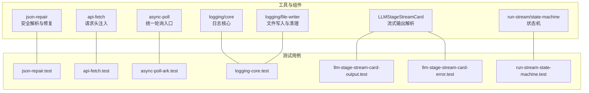
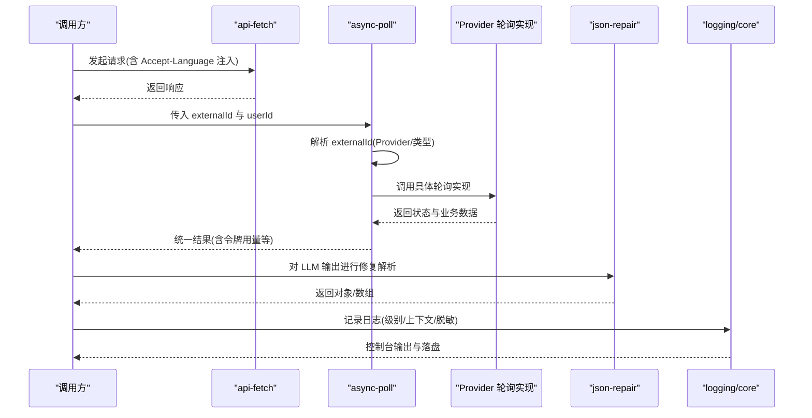
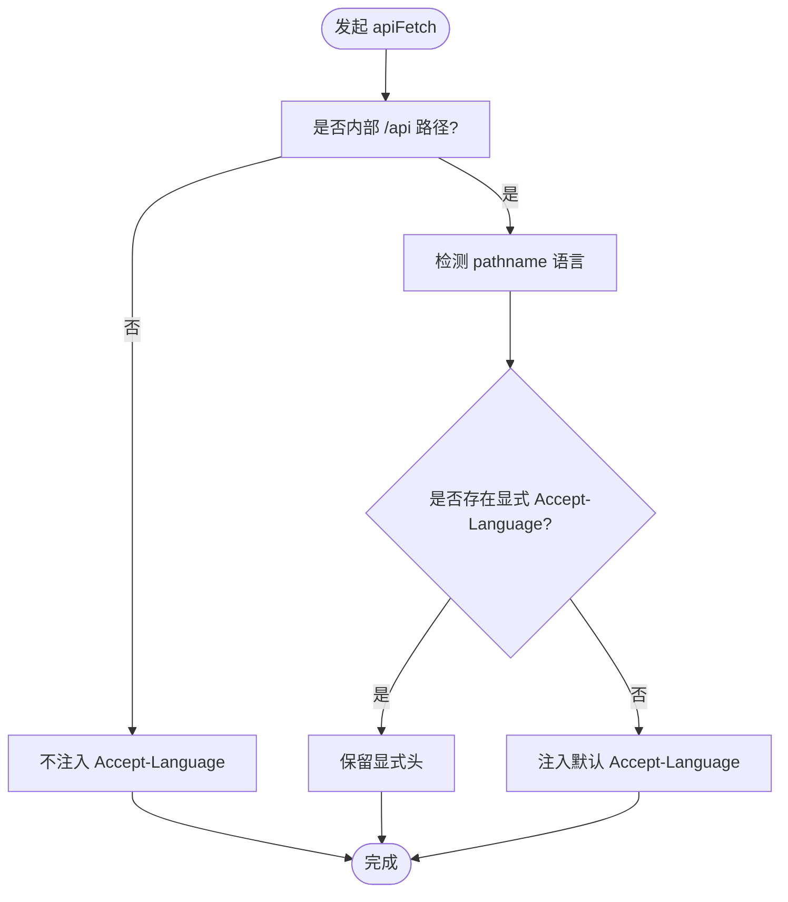
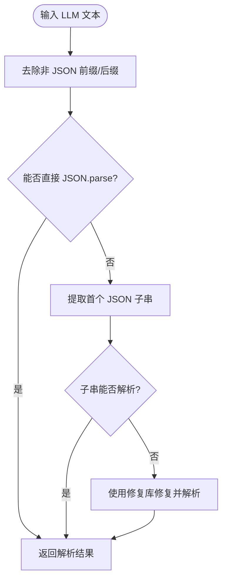
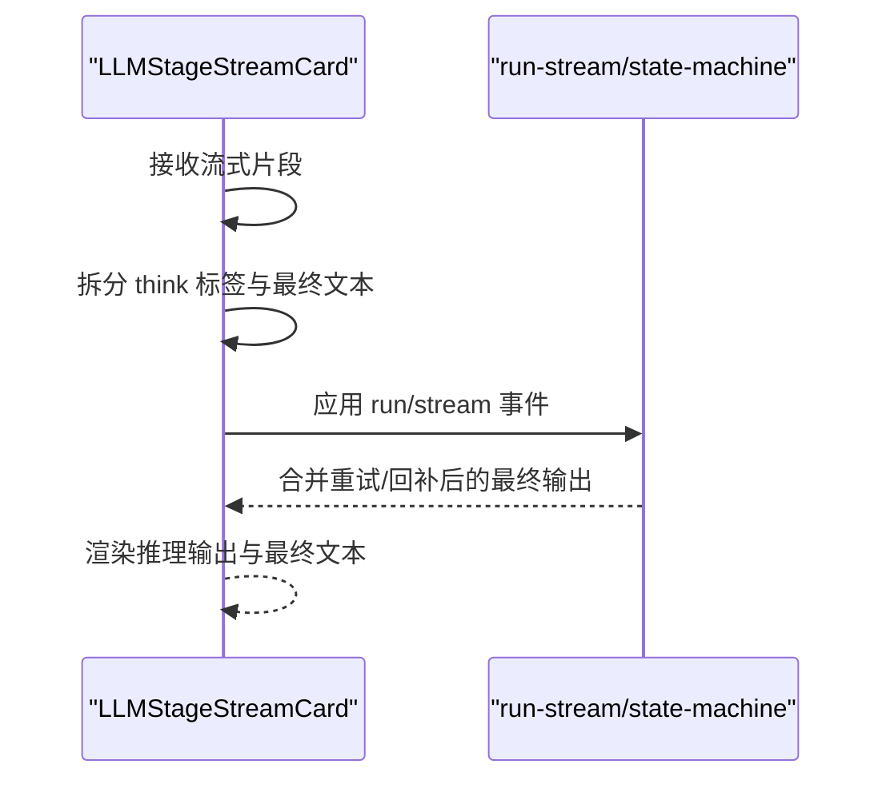
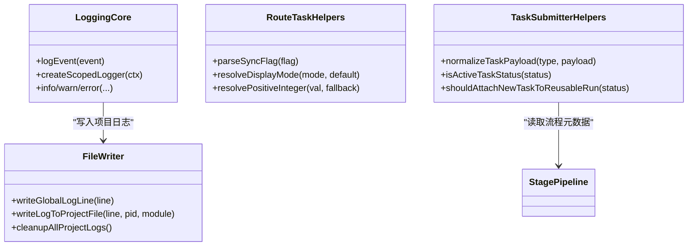
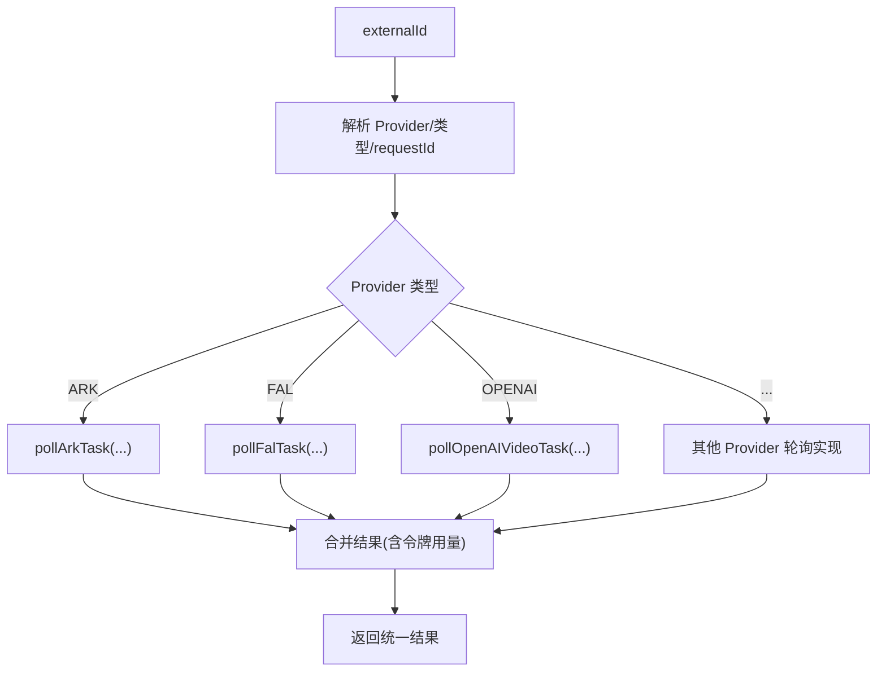
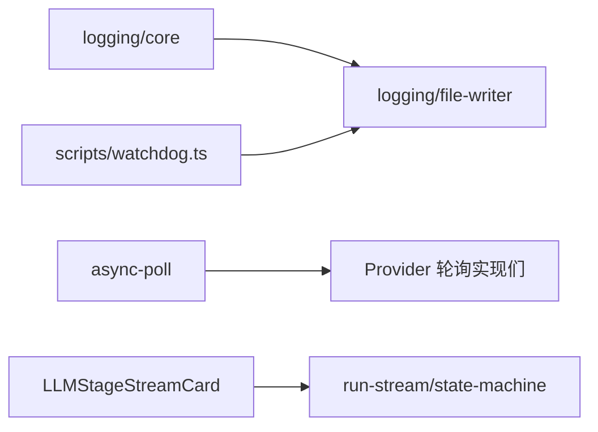

# 辅助工具测试

<cite>
**本文引用的文件**
- [src/lib/json-repair.ts](file://src/lib/json-repair.ts)
- [tests/unit/helpers/json-repair.test.ts](file://tests/unit/helpers/json-repair.test.ts)
- [src/lib/async-poll.ts](file://src/lib/async-poll.ts)
- [tests/unit/task/async-poll-ark.test.ts](file://tests/unit/task/async-poll-ark.test.ts)
- [src/lib/logging/core.ts](file://src/lib/logging/core.ts)
- [src/lib/logging/file-writer.ts](file://src/lib/logging/file-writer.ts)
- [tests/unit/helpers/logging-core.test.ts](file://tests/unit/helpers/logging-core.test.ts)
- [src/lib/api-fetch.ts](file://src/lib/api-fetch.ts)
- [tests/unit/helpers/api-fetch.test.ts](file://tests/unit/helpers/api-fetch.test.ts)
- [src/lib/llm-observe/route-task.ts](file://src/lib/llm-observe/route-task.ts)
- [tests/unit/helpers/route-task-helpers.test.ts](file://tests/unit/helpers/route-task-helpers.test.ts)
- [src/lib/task/submitter.ts](file://src/lib/task/submitter.ts)
- [src/lib/llm-observe/stage-pipeline.ts](file://src/lib/llm-observe/stage-pipeline.ts)
- [src/lib/task/types.ts](file://src/lib/task/types.ts)
- [tests/unit/helpers/task-submitter-helpers.test.ts](file://tests/unit/helpers/task-submitter-helpers.test.ts)
- [src/components/llm-console/LLMStageStreamCard.tsx](file://src/components/llm-console/LLMStageStreamCard.tsx)
- [tests/unit/helpers/llm-stage-stream-card-output.test.ts](file://tests/unit/helpers/llm-stage-stream-card-output.test.ts)
- [tests/unit/components/llm-stage-stream-card-error.test.ts](file://tests/unit/components/llm-stage-stream-card-error.test.ts)
- [src/lib/query/hooks/run-stream/state-machine.ts](file://src/lib/query/hooks/run-stream/state-machine.ts)
- [tests/unit/helpers/run-stream-state-machine.test.ts](file://tests/unit/helpers/run-stream-state-machine.test.ts)
- [scripts/check-log-semantic.ts](file://scripts/check-log-semantic.ts)
- [scripts/watchdog.ts](file://scripts/watchdog.ts)
</cite>

## 目录
1. [简介](#简介)
2. [项目结构](#项目结构)
3. [核心组件](#核心组件)
4. [架构总览](#架构总览)
5. [详细组件分析](#详细组件分析)
6. [依赖关系分析](#依赖关系分析)
7. [性能考量](#性能考量)
8. [故障排查指南](#故障排查指南)
9. [结论](#结论)
10. [附录](#附录)

## 简介
本文件面向“辅助工具”的单元测试，系统化梳理以下能力的测试策略与实践：
- API 获取工具：请求构建、响应解析、错误重试与超时控制
- JSON 修复工具：格式验证、语法修复、完整性检查
- LLM 阶段流卡输出：流式解析、错误恢复、性能监控
- 日志核心：日志抑制、上下文注入、序列化与落盘
- 路由任务助手与任务提交器助手：状态管理、事件处理、并发控制
- 轮询与任务状态：统一轮询入口、外部 ID 解析、令牌用量透传

## 项目结构
围绕“辅助工具”测试，相关源码与测试分布在如下模块：
- 工具函数与组件：json-repair、api-fetch、async-poll、logging、LLM 阶段流卡、运行流状态机
- 测试用例：helpers 与 unit 下的对应测试文件
- 脚本：日志语义检查与看门狗定时清理

图表来源
- [src/lib/json-repair.ts:1-120](file://src/lib/json-repair.ts#L1-L120)
- [src/lib/api-fetch.ts](file://src/lib/api-fetch.ts)
- [src/lib/async-poll.ts:38-294](file://src/lib/async-poll.ts#L38-L294)
- [src/lib/logging/core.ts:1-303](file://src/lib/logging/core.ts#L1-L303)
- [src/lib/logging/file-writer.ts:145-393](file://src/lib/logging/file-writer.ts#L145-L393)
- [src/components/llm-console/LLMStageStreamCard.tsx](file://src/components/llm-console/LLMStageStreamCard.tsx)
- [src/lib/query/hooks/run-stream/state-machine.ts](file://src/lib/query/hooks/run-stream/state-machine.ts)

章节来源
- [src/lib/json-repair.ts:1-120](file://src/lib/json-repair.ts#L1-L120)
- [src/lib/async-poll.ts:38-294](file://src/lib/async-poll.ts#L38-L294)
- [src/lib/logging/core.ts:1-303](file://src/lib/logging/core.ts#L1-L303)
- [src/lib/logging/file-writer.ts:145-393](file://src/lib/logging/file-writer.ts#L145-L393)
- [src/lib/api-fetch.ts](file://src/lib/api-fetch.ts)
- [src/components/llm-console/LLMStageStreamCard.tsx](file://src/components/llm-console/LLMStageStreamCard.tsx)
- [src/lib/query/hooks/run-stream/state-machine.ts](file://src/lib/query/hooks/run-stream/state-machine.ts)

## 核心组件
- JSON 修复工具：提供对 LLM 输出的鲁棒解析，支持去除代码块、提取 JSON 子串、使用修复库兜底，并对对象/数组进行类型约束校验。
- API 获取工具：封装 fetch，自动注入 Accept-Language 头，区分内部与外部请求。
- 统一轮询：根据 externalId 自动识别 Provider 与任务类型，统一调度到对应轮询实现，透传令牌用量等业务数据。
- 日志核心：统一日志级别、上下文注入、敏感信息脱敏、序列化输出与落盘；内置高频流日志抑制。
- LLM 阶段流卡：将流式片段按 think 标签拆分为“推理输出”和“最终文本”，保证 UI 层正确展示。
- 运行流状态机：对 run/stream 事件进行有序应用，处理重试合并、阻塞标记、延迟片段回补与完成态收敛。

章节来源
- [src/lib/json-repair.ts:58-120](file://src/lib/json-repair.ts#L58-L120)
- [src/lib/api-fetch.ts](file://src/lib/api-fetch.ts)
- [src/lib/async-poll.ts:256-294](file://src/lib/async-poll.ts#L256-L294)
- [src/lib/logging/core.ts:97-132](file://src/lib/logging/core.ts#L97-L132)
- [src/components/llm-console/LLMStageStreamCard.tsx](file://src/components/llm-console/LLMStageStreamCard.tsx)
- [src/lib/query/hooks/run-stream/state-machine.ts](file://src/lib/query/hooks/run-stream/state-machine.ts)

## 架构总览
下图展示“请求-解析-轮询-日志-流式输出”的关键交互路径与断言点。

图表来源
- [src/lib/api-fetch.ts](file://src/lib/api-fetch.ts)
- [src/lib/async-poll.ts:256-294](file://src/lib/async-poll.ts#L256-L294)
- [src/lib/json-repair.ts:58-120](file://src/lib/json-repair.ts#L58-L120)
- [src/lib/logging/core.ts:97-132](file://src/lib/logging/core.ts#L97-L132)

## 详细组件分析

### API 获取工具测试策略
- 请求构建
  - 内部 /api 请求自动注入 Accept-Language，优先使用 pathname 语言，显式头不覆盖
  - 非内部 URL 不注入 Accept-Language
- 响应解析
  - 仅对 204 等无主体响应进行断言，确保头注入生效
- 错误重试测试
  - 当前测试聚焦请求头注入，未直接覆盖 fetchWithRetry 的重试逻辑
  - 可扩展：构造超时/网络错误场景，断言重试次数与日志记录

图表来源
- [src/lib/api-fetch.ts](file://src/lib/api-fetch.ts)
- [tests/unit/helpers/api-fetch.test.ts:1-59](file://tests/unit/helpers/api-fetch.test.ts#L1-L59)

章节来源
- [src/lib/api-fetch.ts](file://src/lib/api-fetch.ts)
- [tests/unit/helpers/api-fetch.test.ts:1-59](file://tests/unit/helpers/api-fetch.test.ts#L1-L59)

### JSON 修复工具测试方法
- 格式验证
  - 正常 JSON 字符串可直接解析
  - 包含 markdown 代码块的 JSON 可剥离后解析
  - 大小写不敏感的代码块标记
- 语法修复
  - 尾逗号、单引号、中文引号等常见 LLM 问题通过修复库兜底
  - 前后多余文字场景，提取 JSON 子串后再修复
- 完整性检查
  - 对象/数组解析分别提供类型断言，确保返回值符合预期
  - 回归用例覆盖“思考标签”夹杂在 JSON 中的复杂场景

图表来源
- [src/lib/json-repair.ts:58-120](file://src/lib/json-repair.ts#L58-L120)
- [tests/unit/helpers/json-repair.test.ts:1-150](file://tests/unit/helpers/json-repair.test.ts#L1-L150)

章节来源
- [src/lib/json-repair.ts:1-120](file://src/lib/json-repair.ts#L1-L120)
- [tests/unit/helpers/json-repair.test.ts:1-150](file://tests/unit/helpers/json-repair.test.ts#L1-L150)

### LLM 阶段流卡输出测试策略
- 流式解析
  - 将 think 标签包裹的中间思考移动至“推理输出”，最终文本仅保留结构化 JSON
  - 支持流中未闭合标签的健壮处理
- 错误恢复
  - UI 组件测试覆盖多语言与国际化消息渲染，确保错误状态下的可读性
- 性能监控
  - 运行流状态机测试覆盖重试合并、延迟片段回补、阻塞标记与完成态收敛，间接体现流式处理的稳定性

图表来源
- [src/components/llm-console/LLMStageStreamCard.tsx](file://src/components/llm-console/LLMStageStreamCard.tsx)
- [tests/unit/helpers/llm-stage-stream-card-output.test.ts:1-25](file://tests/unit/helpers/llm-stage-stream-card-output.test.ts#L1-L25)
- [tests/unit/components/llm-stage-stream-card-error.test.ts:1-49](file://tests/unit/components/llm-stage-stream-card-error.test.ts#L1-L49)
- [src/lib/query/hooks/run-stream/state-machine.ts](file://src/lib/query/hooks/run-stream/state-machine.ts)

章节来源
- [src/components/llm-console/LLMStageStreamCard.tsx](file://src/components/llm-console/LLMStageStreamCard.tsx)
- [tests/unit/helpers/llm-stage-stream-card-output.test.ts:1-25](file://tests/unit/helpers/llm-stage-stream-card-output.test.ts#L1-L25)
- [tests/unit/components/llm-stage-stream-card-error.test.ts:1-49](file://tests/unit/components/llm-stage-stream-card-error.test.ts#L1-L49)
- [src/lib/query/hooks/run-stream/state-machine.ts](file://src/lib/query/hooks/run-stream/state-machine.ts)
- [tests/unit/helpers/run-stream-state-machine.test.ts:1-371](file://tests/unit/helpers/run-stream-state-machine.test.ts#L1-L371)

### 日志核心、路由任务助手与任务提交器助手测试
- 日志核心
  - 抑制高频流日志，避免噪声干扰
  - 上下文注入与序列化输出，断言控制台行为与项目日志落盘
- 路由任务助手
  - 同步标志解析、显示模式回退、正整数解析的安全边界
- 任务提交器助手
  - 默认流程元数据填充、负值规范化、meta 优先级与可复用运行附加策略

图表来源
- [src/lib/logging/core.ts:134-303](file://src/lib/logging/core.ts#L134-L303)
- [src/lib/logging/file-writer.ts:173-393](file://src/lib/logging/file-writer.ts#L173-L393)
- [src/lib/llm-observe/route-task.ts](file://src/lib/llm-observe/route-task.ts)
- [src/lib/task/submitter.ts](file://src/lib/task/submitter.ts)
- [src/lib/llm-observe/stage-pipeline.ts](file://src/lib/llm-observe/stage-pipeline.ts)
- [src/lib/task/types.ts](file://src/lib/task/types.ts)

章节来源
- [src/lib/logging/core.ts:1-303](file://src/lib/logging/core.ts#L1-L303)
- [src/lib/logging/file-writer.ts:145-393](file://src/lib/logging/file-writer.ts#L145-L393)
- [tests/unit/helpers/logging-core.test.ts:1-64](file://tests/unit/helpers/logging-core.test.ts#L1-L64)
- [src/lib/llm-observe/route-task.ts](file://src/lib/llm-observe/route-task.ts)
- [tests/unit/helpers/route-task-helpers.test.ts:1-57](file://tests/unit/helpers/route-task-helpers.test.ts#L1-L57)
- [src/lib/task/submitter.ts](file://src/lib/task/submitter.ts)
- [src/lib/llm-observe/stage-pipeline.ts](file://src/lib/llm-observe/stage-pipeline.ts)
- [src/lib/task/types.ts](file://src/lib/task/types.ts)
- [tests/unit/helpers/task-submitter-helpers.test.ts:1-70](file://tests/unit/helpers/task-submitter-helpers.test.ts#L1-L70)

### 统一轮询与外部 ID 解析测试
- 外部 ID 解析
  - 根据前缀识别 Provider 与任务类型，解析 requestId、令牌等参数
- Provider 分发
  - 统一入口根据解析结果调度到对应轮询实现
- 令牌用量透传
  - 示例测试覆盖 Ark 视频任务的令牌用量透传

图表来源
- [src/lib/async-poll.ts:50-294](file://src/lib/async-poll.ts#L50-L294)
- [tests/unit/task/async-poll-ark.test.ts:1-54](file://tests/unit/task/async-poll-ark.test.ts#L1-L54)

章节来源
- [src/lib/async-poll.ts:38-294](file://src/lib/async-poll.ts#L38-L294)
- [tests/unit/task/async-poll-ark.test.ts:1-54](file://tests/unit/task/async-poll-ark.test.ts#L1-L54)

## 依赖关系分析
- 日志模块
  - logging/core 依赖 logging/file-writer 进行落盘
  - 看门狗脚本周期性调用清理函数，保障日志文件大小与保留期限
- 轮询模块
  - async-poll 依赖外部 Provider 的轮询实现，解析 externalId 并分发
- 流式输出
  - LLMStageStreamCard 与 run-stream/state-machine 协作，确保流式输出的正确性与稳定性

图表来源
- [src/lib/logging/core.ts:17-32](file://src/lib/logging/core.ts#L17-L32)
- [src/lib/logging/file-writer.ts:371-393](file://src/lib/logging/file-writer.ts#L371-L393)
- [scripts/watchdog.ts:1-33](file://scripts/watchdog.ts#L1-L33)
- [src/lib/async-poll.ts:256-294](file://src/lib/async-poll.ts#L256-L294)
- [src/components/llm-console/LLMStageStreamCard.tsx](file://src/components/llm-console/LLMStageStreamCard.tsx)
- [src/lib/query/hooks/run-stream/state-machine.ts](file://src/lib/query/hooks/run-stream/state-machine.ts)

章节来源
- [src/lib/logging/core.ts:1-303](file://src/lib/logging/core.ts#L1-L303)
- [src/lib/logging/file-writer.ts:145-393](file://src/lib/logging/file-writer.ts#L145-L393)
- [scripts/watchdog.ts:1-33](file://scripts/watchdog.ts#L1-L33)
- [src/lib/async-poll.ts:38-294](file://src/lib/async-poll.ts#L38-L294)
- [src/components/llm-console/LLMStageStreamCard.tsx](file://src/components/llm-console/LLMStageStreamCard.tsx)
- [src/lib/query/hooks/run-stream/state-machine.ts](file://src/lib/query/hooks/run-stream/state-machine.ts)

## 性能考量
- 日志抑制与落盘
  - 高频流日志抑制减少 IO 压力
  - 项目日志按阈值清理，避免磁盘膨胀
- 流式处理
  - 状态机合并重试、延迟回补与阻塞标记，降低 UI 闪烁与重复渲染
- 轮询与超时
  - 统一轮询入口便于集中优化超时与重试策略

## 故障排查指南
- 日志语义检查
  - 脚本扫描 API 路由中使用 submitTask 的场景，确保导入与传参 getRequestId
- 看门狗清理
  - 定时清理项目日志中过期行，保障长期运行稳定性
- 常见问题定位
  - JSON 修复失败：检查输出是否包含非标准引号或尾逗号
  - 流式输出错位：确认 think 标签包裹与最终文本分离逻辑
  - 轮询异常：核对 externalId 格式与 Provider 配置

章节来源
- [scripts/check-log-semantic.ts:56-110](file://scripts/check-log-semantic.ts#L56-L110)
- [scripts/watchdog.ts:1-33](file://scripts/watchdog.ts#L1-L33)
- [src/lib/logging/file-writer.ts:173-185](file://src/lib/logging/file-writer.ts#L173-L185)

## 结论
本文基于仓库现有测试与工具实现，总结了 API 获取、JSON 修复、轮询、日志与流式输出等辅助工具的测试策略与最佳实践。建议后续补充：
- API 获取工具的重试与超时专项测试
- JSON 修复工具的边界与回归用例扩充
- LLM 阶段流卡的性能与并发压力测试
- 日志核心的落盘与清理策略验证

## 附录
- 相关测试文件路径
  - JSON 修复：tests/unit/helpers/json-repair.test.ts
  - API 获取：tests/unit/helpers/api-fetch.test.ts
  - 轮询 Ark：tests/unit/task/async-poll-ark.test.ts
  - 日志核心：tests/unit/helpers/logging-core.test.ts
  - 路由任务助手：tests/unit/helpers/route-task-helpers.test.ts
  - 任务提交器助手：tests/unit/helpers/task-submitter-helpers.test.ts
  - LLM 阶段流卡输出：tests/unit/helpers/llm-stage-stream-card-output.test.ts
  - LLM 阶段流卡错误：tests/unit/components/llm-stage-stream-card-error.test.ts
  - 运行流状态机：tests/unit/helpers/run-stream-state-machine.test.ts