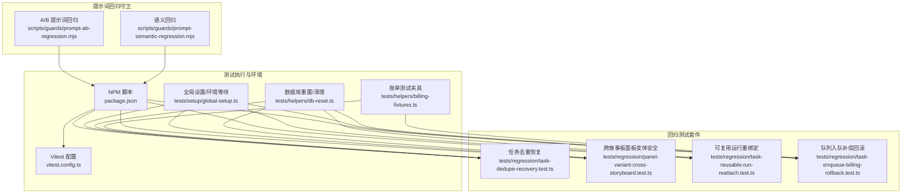
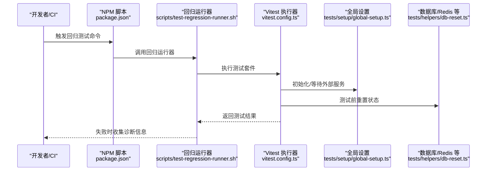
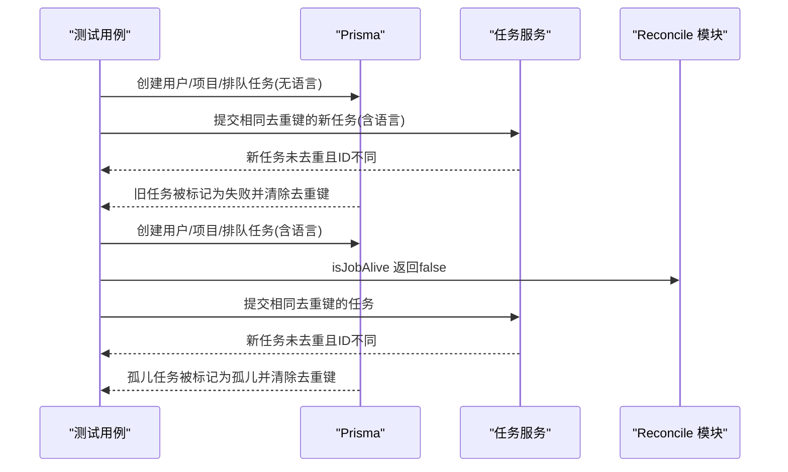
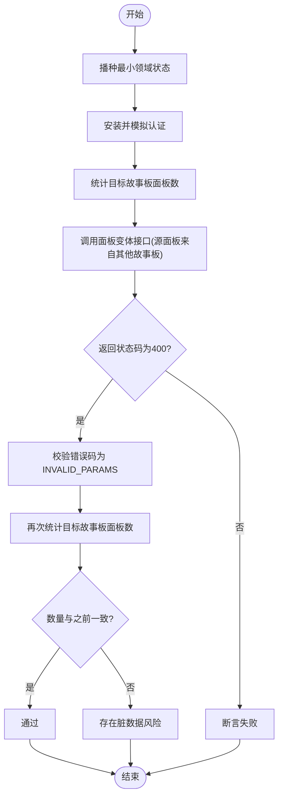
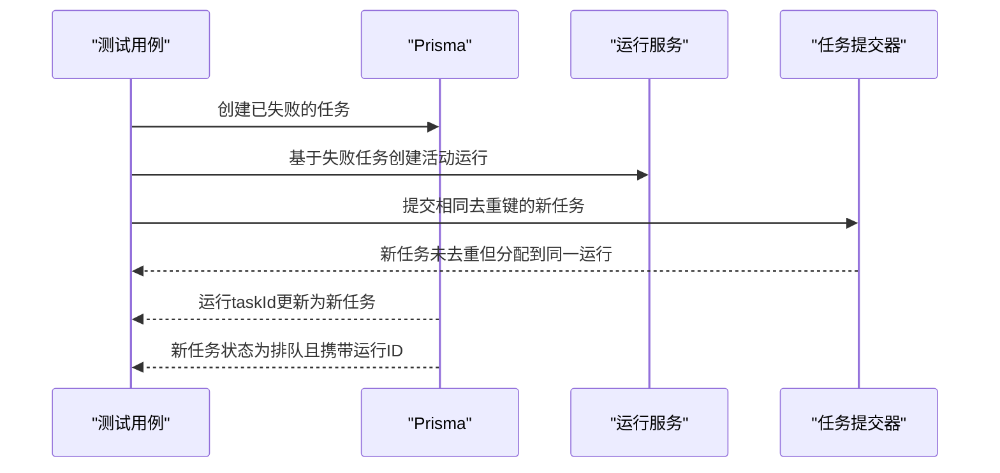
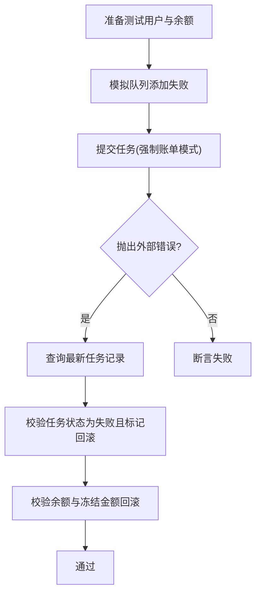
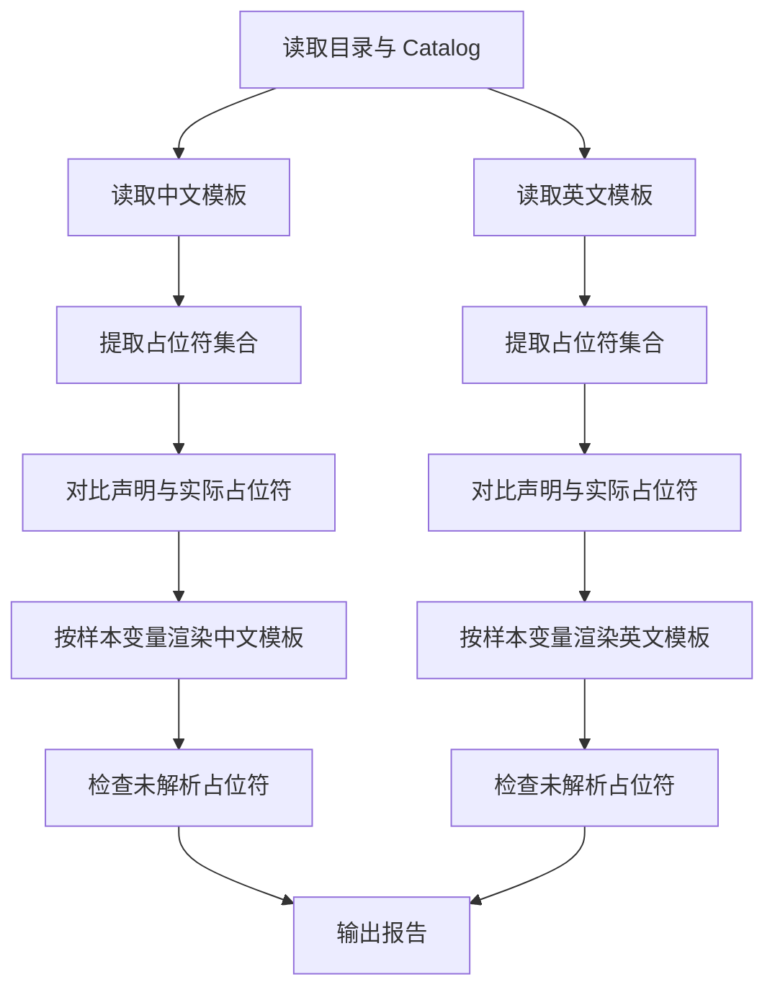
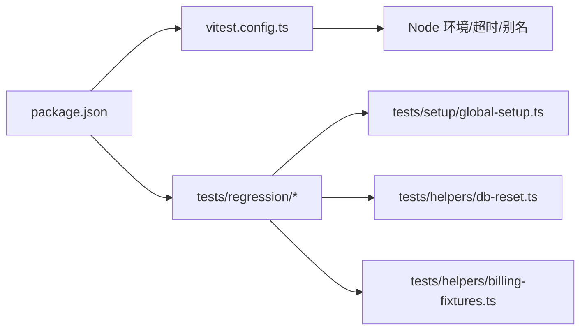

# 回归测试

<cite>
**本文引用的文件**
- [tests/regression/task-dedupe-recovery.test.ts](file://tests/regression/task-dedupe-recovery.test.ts)
- [tests/regression/panel-variant-cross-storyboard.test.ts](file://tests/regression/panel-variant-cross-storyboard.test.ts)
- [tests/regression/task-reusable-run-reattach.test.ts](file://tests/regression/task-reusable-run-reattach.test.ts)
- [tests/regression/task-enqueue-billing-rollback.test.ts](file://tests/regression/task-enqueue-billing-rollback.test.ts)
- [scripts/test-regression-runner.sh](file://scripts/test-regression-runner.sh)
- [package.json](file://package.json)
- [vitest.config.ts](file://vitest.config.ts)
- [tests/helpers/db-reset.ts](file://tests/helpers/db-reset.ts)
- [tests/helpers/billing-fixtures.ts](file://tests/helpers/billing-fixtures.ts)
- [tests/setup/global-setup.ts](file://tests/setup/global-setup.ts)
- [scripts/guards/prompt-ab-regression.mjs](file://scripts/guards/prompt-ab-regression.mjs)
- [scripts/guards/prompt-semantic-regression.mjs](file://scripts/guards/prompt-semantic-regression.mjs)
</cite>

## 目录
1. [引言](#引言)
2. [项目结构](#项目结构)
3. [核心组件](#核心组件)
4. [架构总览](#架构总览)
5. [详细组件分析](#详细组件分析)
6. [依赖关系分析](#依赖关系分析)
7. [性能考量](#性能考量)
8. [故障排查指南](#故障排查指南)
9. [结论](#结论)
10. [附录](#附录)

## 引言
本文件面向Waoowaoo项目的回归测试体系，聚焦以下目标：
- 设计并维护回归测试套件，确保关键功能、任务去重恢复、跨故事板面板变体等场景稳定。
- 明确自动化执行、失败分析与修复验证流程。
- 规范测试数据管理、测试环境同步与测试结果对比策略。
- 制定回归测试优先级、执行频率与性能监控方法。

## 项目结构
回归测试位于 tests/regression 目录，围绕三大核心主题：
- 任务去重恢复：处理重复任务、语言要求缺失、孤儿队列任务等情形。
- 跨故事板面板变体安全：防止跨故事板引用源面板导致的数据不一致。
- 可复用运行时重绑定：在已有运行实例终止后，新任务能正确接入现有运行。
- 队列入队补偿回滚：当外部队列不可用时，账单冻结状态应自动回滚。

**图表来源**
- [tests/regression/task-dedupe-recovery.test.ts:1-109](file://tests/regression/task-dedupe-recovery.test.ts#L1-L109)
- [tests/regression/panel-variant-cross-storyboard.test.ts:1-51](file://tests/regression/panel-variant-cross-storyboard.test.ts#L1-L51)
- [tests/regression/task-reusable-run-reattach.test.ts:1-94](file://tests/regression/task-reusable-run-reattach.test.ts#L1-L94)
- [tests/regression/task-enqueue-billing-rollback.test.ts:1-69](file://tests/regression/task-enqueue-billing-rollback.test.ts#L1-L69)
- [package.json:82-92](file://package.json#L82-L92)
- [vitest.config.ts:15-44](file://vitest.config.ts#L15-L44)
- [tests/setup/global-setup.ts:70-99](file://tests/setup/global-setup.ts#L70-L99)
- [tests/helpers/db-reset.ts:1-61](file://tests/helpers/db-reset.ts#L1-L61)
- [tests/helpers/billing-fixtures.ts:1-69](file://tests/helpers/billing-fixtures.ts#L1-L69)
- [scripts/guards/prompt-ab-regression.mjs:1-144](file://scripts/guards/prompt-ab-regression.mjs#L1-L144)
- [scripts/guards/prompt-semantic-regression.mjs:1-109](file://scripts/guards/prompt-semantic-regression.mjs#L1-L109)

**章节来源**
- [package.json:82-92](file://package.json#L82-L92)
- [vitest.config.ts:15-44](file://vitest.config.ts#L15-L44)

## 核心组件
- 任务去重恢复测试：覆盖“无语言参数排队任务被替换”和“孤儿排队任务在作业不存在时被替换”的两种典型回归场景。
- 跨故事板面板变体安全测试：验证从其他故事板引用源面板会触发显式参数错误且不会产生脏数据。
- 可复用运行重绑定测试：验证已终止运行的新任务能正确接入现有活动运行并更新运行关联。
- 队列入队补偿回滚测试：验证队列提交失败时账单冻结状态回滚，避免资源冻结。

**章节来源**
- [tests/regression/task-dedupe-recovery.test.ts:14-109](file://tests/regression/task-dedupe-recovery.test.ts#L14-L109)
- [tests/regression/panel-variant-cross-storyboard.test.ts:8-51](file://tests/regression/panel-variant-cross-storyboard.test.ts#L8-L51)
- [tests/regression/task-reusable-run-reattach.test.ts:20-94](file://tests/regression/task-reusable-run-reattach.test.ts#L20-L94)
- [tests/regression/task-enqueue-billing-rollback.test.ts:22-69](file://tests/regression/task-enqueue-billing-rollback.test.ts#L22-L69)

## 架构总览
回归测试执行链路由 NPM 脚本驱动，通过 Vitest 运行，使用全局设置等待数据库与缓存服务就绪，并在每次测试前进行状态清理。

**图表来源**
- [package.json:82-92](file://package.json#L82-L92)
- [scripts/test-regression-runner.sh:1-42](file://scripts/test-regression-runner.sh#L1-L42)
- [vitest.config.ts:15-44](file://vitest.config.ts#L15-L44)
- [tests/setup/global-setup.ts:70-99](file://tests/setup/global-setup.ts#L70-L99)
- [tests/helpers/db-reset.ts:1-61](file://tests/helpers/db-reset.ts#L1-L61)

## 详细组件分析

### 任务去重恢复测试（去重替换与孤儿清理）
该测试关注两类回归：
- 当排队任务缺少语言参数时，新任务应替换旧任务而非无限去重。
- 当队列作业不存在时，孤儿排队任务应被标记为孤儿并替换。

**图表来源**
- [tests/regression/task-dedupe-recovery.test.ts:21-107](file://tests/regression/task-dedupe-recovery.test.ts#L21-L107)

**章节来源**
- [tests/regression/task-dedupe-recovery.test.ts:14-109](file://tests/regression/task-dedupe-recovery.test.ts#L14-L109)
- [tests/helpers/db-reset.ts:3-15](file://tests/helpers/db-reset.ts#L3-L15)
- [tests/helpers/billing-fixtures.ts:7-25](file://tests/helpers/billing-fixtures.ts#L7-L25)

### 跨故事板面板变体验证（安全边界）
该测试确保从其他故事板引用源面板的行为是明确无效的，且不会造成脏数据。

**图表来源**
- [tests/regression/panel-variant-cross-storyboard.test.ts:14-49](file://tests/regression/panel-variant-cross-storyboard.test.ts#L14-L49)

**章节来源**
- [tests/regression/panel-variant-cross-storyboard.test.ts:8-51](file://tests/regression/panel-variant-cross-storyboard.test.ts#L8-L51)
- [tests/helpers/db-reset.ts:47-60](file://tests/helpers/db-reset.ts#L47-L60)

### 可复用运行重绑定（终止任务接入活动运行）
该测试验证当运行中的任务已处于终止态时，新任务能接入现有活动运行并更新运行与任务状态。

**图表来源**
- [tests/regression/task-reusable-run-reattach.test.ts:27-92](file://tests/regression/task-reusable-run-reattach.test.ts#L27-L92)

**章节来源**
- [tests/regression/task-reusable-run-reattach.test.ts:20-94](file://tests/regression/task-reusable-run-reattach.test.ts#L20-L94)
- [tests/helpers/db-reset.ts:3-15](file://tests/helpers/db-reset.ts#L3-L15)

### 队列入队补偿回滚（账单冻结回滚）
该测试验证当队列提交失败时，账单冻结状态应回滚，避免资源冻结。

**图表来源**
- [tests/regression/task-enqueue-billing-rollback.test.ts:30-67](file://tests/regression/task-enqueue-billing-rollback.test.ts#L30-L67)

**章节来源**
- [tests/regression/task-enqueue-billing-rollback.test.ts:22-69](file://tests/regression/task-enqueue-billing-rollback.test.ts#L22-L69)
- [tests/helpers/billing-fixtures.ts:27-42](file://tests/helpers/billing-fixtures.ts#L27-L42)

### 提示词回归守卫（A/B 与语义）
为保障提示词模板稳定性，项目提供了两套守卫：
- A/B 回归：检查模板占位符一致性、变量使用完整性与渲染后未解析占位符。
- 语义回归：检查英文模板不应包含中文字符，关键语义令牌必须存在。

**图表来源**
- [scripts/guards/prompt-ab-regression.mjs:21-137](file://scripts/guards/prompt-ab-regression.mjs#L21-L137)
- [scripts/guards/prompt-semantic-regression.mjs:34-102](file://scripts/guards/prompt-semantic-regression.mjs#L34-L102)

**章节来源**
- [scripts/guards/prompt-ab-regression.mjs:1-144](file://scripts/guards/prompt-ab-regression.mjs#L1-L144)
- [scripts/guards/prompt-semantic-regression.mjs:1-109](file://scripts/guards/prompt-semantic-regression.mjs#L1-L109)

## 依赖关系分析
- 执行入口：NPM 脚本统一调度回归测试与全量测试。
- 执行引擎：Vitest 配置定义了环境、超时、覆盖率与别名。
- 环境准备：全局设置负责等待数据库与缓存服务，必要时拉起测试容器并初始化数据库。
- 数据清理：测试前通过数据库重置脚本清理任务、账单、资产与小说推广相关实体。
- 夹具与辅助：账单夹具用于快速生成用户、项目与余额，提升测试可重复性。

**图表来源**
- [package.json:82-92](file://package.json#L82-L92)
- [vitest.config.ts:15-44](file://vitest.config.ts#L15-L44)
- [tests/setup/global-setup.ts:70-99](file://tests/setup/global-setup.ts#L70-L99)
- [tests/helpers/db-reset.ts:1-61](file://tests/helpers/db-reset.ts#L1-L61)
- [tests/helpers/billing-fixtures.ts:1-69](file://tests/helpers/billing-fixtures.ts#L1-L69)

**章节来源**
- [package.json:82-92](file://package.json#L82-L92)
- [vitest.config.ts:15-44](file://vitest.config.ts#L15-L44)
- [tests/setup/global-setup.ts:70-99](file://tests/setup/global-setup.ts#L70-L99)
- [tests/helpers/db-reset.ts:1-61](file://tests/helpers/db-reset.ts#L1-L61)
- [tests/helpers/billing-fixtures.ts:1-69](file://tests/helpers/billing-fixtures.ts#L1-L69)

## 性能考量
- 并发与隔离：Vitest 使用进程池隔离测试，减少相互干扰；建议将大体量回归拆分为独立套件以控制内存与连接压力。
- 数据规模：清理脚本按模块化粒度清理，避免全量清库带来的成本；对高频回归可考虑只清理受影响表。
- 外部依赖：全局设置等待数据库与缓存，若依赖服务不稳定，建议增加指数退避与超时上限。
- 覆盖率：当前覆盖率集中在账单模块，回归测试可结合业务热点模块补充覆盖率阈值与目标。

[本节为通用指导，无需特定文件来源]

## 故障排查指南
- 自动化失败收集：回归运行器在测试失败时解析输出，提取失败文件并打印其最近与首次变更提交，便于定位引入问题的代码范围。
- 日志与诊断：运行器将命令输出写入临时日志文件，失败时保留现场以便人工复盘。
- 环境问题：若数据库或缓存未就绪，全局设置会持续等待直至成功或超时，建议检查容器与网络配置。
- 账单异常：队列入队失败时，应核对账单冻结状态是否回滚，避免资源冻结。

**章节来源**
- [scripts/test-regression-runner.sh:16-38](file://scripts/test-regression-runner.sh#L16-L38)
- [tests/setup/global-setup.ts:19-68](file://tests/setup/global-setup.ts#L19-L68)
- [tests/regression/task-enqueue-billing-rollback.test.ts:30-67](file://tests/regression/task-enqueue-billing-rollback.test.ts#L30-L67)

## 结论
本回归测试体系围绕任务去重恢复、跨故事板面板变体安全、可复用运行重绑定与队列入队补偿回滚四大场景构建，配合自动化执行、失败诊断与环境同步机制，能够有效降低回归风险。建议持续完善提示词模板守卫与覆盖率策略，优化执行频率与优先级划分，以平衡质量与效率。

[本节为总结性内容，无需特定文件来源]

## 附录

### 回归测试套件设计与维护要点
- 分层组织：按功能域划分测试文件，便于定位与维护。
- 状态隔离：每个测试前后进行状态清理，避免跨用例污染。
- 夹具复用：通过夹具快速构造测试数据，提高可重复性与可读性。
- 守卫前置：在 CI 中先运行提示词回归守卫，尽早发现模板问题。

**章节来源**
- [tests/helpers/db-reset.ts:1-61](file://tests/helpers/db-reset.ts#L1-L61)
- [tests/helpers/billing-fixtures.ts:1-69](file://tests/helpers/billing-fixtures.ts#L1-L69)
- [scripts/guards/prompt-ab-regression.mjs:1-144](file://scripts/guards/prompt-ab-regression.mjs#L1-L144)
- [scripts/guards/prompt-semantic-regression.mjs:1-109](file://scripts/guards/prompt-semantic-regression.mjs#L1-L109)

### 自动化执行、失败分析与修复验证流程
- 执行：通过 NPM 脚本统一触发，支持全量回归与分场景执行。
- 失败分析：运行器收集失败文件并输出最近/首次变更提交，辅助定位引入者。
- 修复验证：修复后重新运行对应回归套件，确认通过后再合并。

**章节来源**
- [package.json:82-92](file://package.json#L82-L92)
- [scripts/test-regression-runner.sh:16-38](file://scripts/test-regression-runner.sh#L16-L38)

### 测试数据管理、环境同步与结果对比策略
- 数据管理：使用模块化清理脚本，按需清理任务、账单、资产与小说推广实体。
- 环境同步：全局设置等待数据库与缓存服务，必要时拉起测试容器并初始化数据库。
- 结果对比：结合提示词守卫与测试断言，确保模板一致性与业务行为正确性。

**章节来源**
- [tests/helpers/db-reset.ts:1-61](file://tests/helpers/db-reset.ts#L1-L61)
- [tests/setup/global-setup.ts:70-99](file://tests/setup/global-setup.ts#L70-L99)
- [scripts/guards/prompt-ab-regression.mjs:1-144](file://scripts/guards/prompt-ab-regression.mjs#L1-L144)
- [scripts/guards/prompt-semantic-regression.mjs:1-109](file://scripts/guards/prompt-semantic-regression.mjs#L1-L109)

### 回归测试优先级、执行频率与性能监控方法
- 优先级：关键路径（任务系统、账单、提示词）高优；UI/交互类次之。
- 执行频率：主干每日回归，PR 引入回归测试；重大变更后加跑。
- 性能监控：关注测试执行时间、并发连接数与数据库负载，必要时拆分套件与限流。

[本节为通用指导，无需特定文件来源]