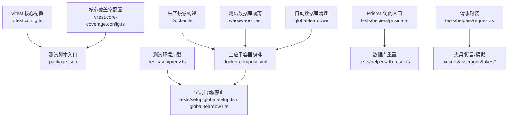
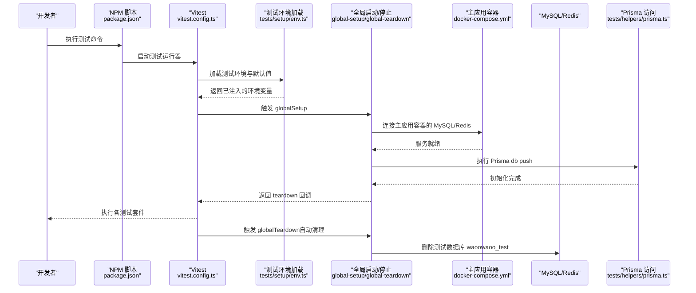
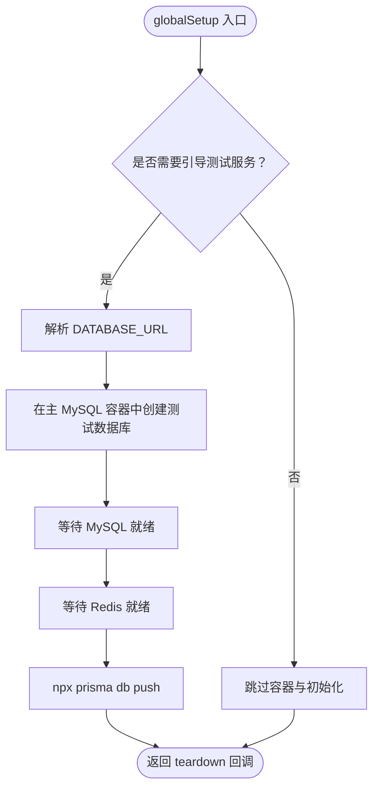
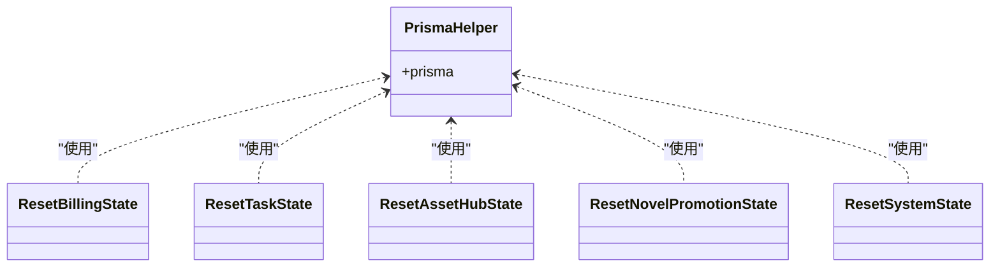
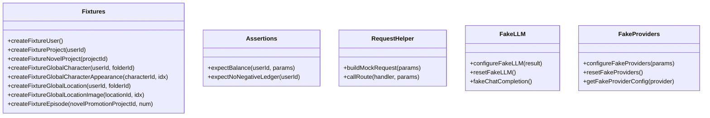
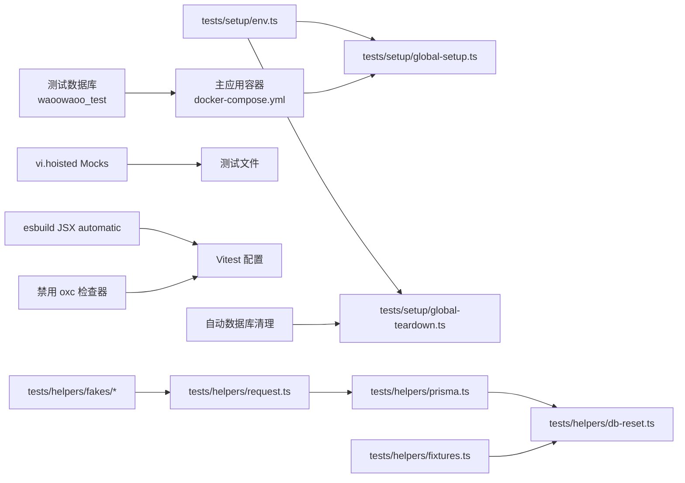

# 测试基础设施

<cite>
**本文档引用的文件**
- [vitest.config.ts](file://vitest.config.ts)
- [vitest.core-coverage.config.ts](file://vitest.core-coverage.config.ts)
- [package.json](file://package.json)
- [docker-compose.test.yml](file://docker-compose.test.yml)
- [docker-compose.yml](file://docker-compose.yml)
- [Dockerfile](file://Dockerfile)
- [tests/setup/env.ts](file://tests/setup/env.ts)
- [tests/setup/global-setup.ts](file://tests/setup/global-setup.ts)
- [tests/setup/global-teardown.ts](file://tests/setup/global-teardown.ts)
- [tests/helpers/db-reset.ts](file://tests/helpers/db-reset.ts)
- [tests/helpers/prisma.ts](file://tests/helpers/prisma.ts)
- [tests/helpers/fixtures.ts](file://tests/helpers/fixtures.ts)
- [tests/helpers/assertions.ts](file://tests/helpers/assertions.ts)
- [tests/helpers/request.ts](file://tests/helpers/request.ts)
- [tests/helpers/fakes/llm.ts](file://tests/helpers/fakes/llm.ts)
- [tests/helpers/fakes/providers.ts](file://tests/helpers/fakes/providers.ts)
- [tests/unit/helpers/run-stream-state-machine.test.ts](file://tests/unit/helpers/run-stream-state-machine.test.ts)
- [tests/unit/helpers/run-request-executor.run-events.test.ts](file://tests/unit/helpers/run-request-executor.run-events.test.ts)
- [tests/unit/helpers/task-state-service.test.ts](file://tests/unit/helpers/task-state-service.test.ts)
- [tests/unit/helpers/recovery-probe.test.ts](file://tests/unit/helpers/recovery-probe.test.ts)
- [tests/unit/helpers/read-error-message.test.ts](file://tests/unit/helpers/read-error-message.test.ts)
- [tests/unit/helpers/prompt-suffix-regression.test.ts](file://tests/unit/helpers/prompt-suffix-regression.test.ts)
- [tests/unit/helpers/route-task-helpers.test.ts](file://tests/unit/helpers/route-task-helpers.test.ts)
- [tests/integration/api/contract/crud-routes.test.ts](file://tests/integration/api/contract/crud-routes.test.ts)
- [tests/integration/api/contract/direct-submit-routes.test.ts](file://tests/integration/api/contract/direct-submit-routes.test.ts)
- [src/lib/media/outbound-image.test.ts](file://src/lib/media/outbound-image.test.ts)
</cite>

## 更新摘要
**所做更改**
- 更新了测试环境现代化部分，反映了移除独立测试容器的架构变更
- 新增了使用主应用容器进行测试的详细说明
- 更新了数据库隔离策略，通过 waoowaoo_test 数据库名称实现测试数据隔离
- 增强了数据库清理流程，通过 global-teardown 自动删除测试数据库
- 更新了测试容器化部署部分，移除了独立的测试容器编排

## 目录
1. [引言](#引言)
2. [项目结构](#项目结构)
3. [核心组件](#核心组件)
4. [架构总览](#架构总览)
5. [详细组件分析](#详细组件分析)
6. [依赖关系分析](#依赖关系分析)
7. [性能考虑](#性能考虑)
8. [故障排查指南](#故障排查指南)
9. [结论](#结论)
10. [附录](#附录)

## 引言
本文件系统性梳理 Waoowaoo 的测试基础设施，覆盖测试环境配置、测试数据管理、测试工具链与脚本、全局测试设置、测试夹具与辅助工具、测试数据库与模拟服务、容器化部署、测试报告与覆盖率统计、性能优化与并行执行、以及测试安全与合规要点。目标是帮助开发者快速理解并高效使用现有测试体系，同时为扩展与维护提供清晰指引。

**最新更新**：本次更新重点关注测试环境现代化，移除了独立的测试容器编排，改为使用主应用容器并通过 waoowaoo_test 数据库名称进行隔离，同时更新了测试环境配置和数据库清理流程，提升了测试效率和资源利用率。

## 项目结构
测试相关的关键位置与职责如下：
- 测试运行器与配置
  - Vitest 核心配置：[vitest.config.ts](file://vitest.config.ts)
  - 核心覆盖率配置：[vitest.core-coverage.config.ts](file://vitest.core-coverage.config.ts)
  - 测试脚本入口与分层任务：[package.json](file://package.json)
- 测试环境与容器
  - 主应用容器编排（包含 MySQL、Redis、MinIO）：[docker-compose.yml](file://docker-compose.yml)
  - 测试容器编排（已简化，不再需要独立容器）：[docker-compose.test.yml](file://docker-compose.test.yml)
  - 生产镜像构建（含开发与测试场景）：[Dockerfile](file://Dockerfile)
- 全局测试设置与生命周期
  - 测试环境加载与网络限制：[tests/setup/env.ts](file://tests/setup/env.ts)
  - 全局启动与停止（使用主应用容器进行测试）：[tests/setup/global-setup.ts](file://tests/setup/global-setup.ts)、[tests/setup/global-teardown.ts](file://tests/setup/global-teardown.ts)
- 测试数据与辅助工具
  - 数据库重置与状态清理：[tests/helpers/db-reset.ts](file://tests/helpers/db-reset.ts)
  - Prisma 访问入口（自动加载测试环境）：[tests/helpers/prisma.ts](file://tests/helpers/prisma.ts)
  - 夹具（Fixture）与断言助手：[tests/helpers/fixtures.ts](file://tests/helpers/fixtures.ts)、[tests/helpers/assertions.ts](file://tests/helpers/assertions.ts)
  - 请求构造与路由调用封装：[tests/helpers/request.ts](file://tests/helpers/request.ts)
  - 模拟服务与 LLM 响应：[tests/helpers/fakes/llm.ts](file://tests/helpers/fakes/llm.ts)、[tests/helpers/fakes/providers.ts](file://tests/helpers/fakes/providers.ts)

**图表来源**
- [vitest.config.ts:1-49](file://vitest.config.ts#L1-L49)
- [vitest.core-coverage.config.ts:1-44](file://vitest.core-coverage.config.ts#L1-L44)
- [package.json:1-186](file://package.json#L1-L186)
- [docker-compose.test.yml:1-5](file://docker-compose.test.yml#L1-L5)
- [docker-compose.yml:1-153](file://docker-compose.yml#L1-L153)
- [Dockerfile:1-61](file://Dockerfile#L1-L61)
- [tests/setup/env.ts:1-73](file://tests/setup/env.ts#L1-L73)
- [tests/setup/global-setup.ts:1-126](file://tests/setup/global-setup.ts#L1-L126)
- [tests/setup/global-teardown.ts:1-40](file://tests/setup/global-teardown.ts#L1-L40)
- [tests/helpers/prisma.ts:1-7](file://tests/helpers/prisma.ts#L1-L7)
- [tests/helpers/db-reset.ts:1-61](file://tests/helpers/db-reset.ts#L1-L61)
- [tests/helpers/request.ts:1-63](file://tests/helpers/request.ts#L1-L63)

**章节来源**
- [vitest.config.ts:1-49](file://vitest.config.ts#L1-L49)
- [vitest.core-coverage.config.ts:1-44](file://vitest.core-coverage.config.ts#L1-L44)
- [package.json:1-186](file://package.json#L1-L186)
- [docker-compose.test.yml:1-5](file://docker-compose.test.yml#L1-L5)
- [docker-compose.yml:1-153](file://docker-compose.yml#L1-L153)
- [Dockerfile:1-61](file://Dockerfile#L1-L61)
- [tests/setup/env.ts:1-73](file://tests/setup/env.ts#L1-L73)
- [tests/setup/global-setup.ts:1-126](file://tests/setup/global-setup.ts#L1-L126)
- [tests/setup/global-teardown.ts:1-40](file://tests/setup/global-teardown.ts#L1-L40)
- [tests/helpers/prisma.ts:1-7](file://tests/helpers/prisma.ts#L1-L7)
- [tests/helpers/db-reset.ts:1-61](file://tests/helpers/db-reset.ts#L1-L61)
- [tests/helpers/request.ts:1-63](file://tests/helpers/request.ts#L1-L63)

## 核心组件
- 测试运行器与配置
  - 使用 Vitest，Node 环境，fork 池，超时与钩子超时合理设置；支持 CSS 关闭与 PostCSS 插件空配置；别名 @ 指向 src。
  - **新增**：禁用 oxc 检查器以解决 TypeScript JSX preserve 模式下的语法解析问题；设置 esbuild JSX 为 automatic 模式提升 JSX 处理效率。
  - 覆盖率：v8 提供者，输出文本、HTML、JSON 摘要；按模块分组配置不同阈值。
- 测试脚本与任务分层
  - 单元、集成、并发、系统、回归、行为质量等多层级测试命令；通过环境变量控制是否引导测试数据库与缓存。
  - **增强**：引入 vi.hoisted 机制修复 mock 构造函数问题，提升测试稳定性。
- 测试环境加载
  - 自动加载 .env.test，未定义的环境变量设置默认值；限制 fetch 目标主机以提升测试安全性。
  - **更新**：DATABASE_URL 指向主应用容器的 MySQL (localhost:13306)，使用 waoowaoo_test 数据库进行隔离。
- 全局生命周期
  - 使用主应用容器的 MySQL 与 Redis；等待健康检查；执行 Prisma db push；测试结束后自动清理测试数据库。
- 数据与夹具
  - 统一的 Prisma 访问入口；按业务域提供 reset 工具；通用夹具函数创建用户、项目、角色、地点、剧集等。
- 断言与请求
  - 针对账务余额的断言；基于 NextRequest 的路由调用封装；模拟 LLM 与第三方 Provider 的配置。

**章节来源**
- [vitest.config.ts:10-13](file://vitest.config.ts#L10-L13)
- [vitest.config.ts:15-44](file://vitest.config.ts#L15-L44)
- [package.json:69-91](file://package.json#L69-L91)
- [tests/setup/env.ts:22-73](file://tests/setup/env.ts#L22-L73)
- [tests/setup/global-setup.ts:100-125](file://tests/setup/global-setup.ts#L100-L125)
- [tests/helpers/db-reset.ts:1-61](file://tests/helpers/db-reset.ts#L1-L61)
- [tests/helpers/prisma.ts:1-7](file://tests/helpers/prisma.ts#L1-L7)
- [tests/helpers/assertions.ts:1-24](file://tests/helpers/assertions.ts#L1-L24)
- [tests/helpers/request.ts:18-63](file://tests/helpers/request.ts#L18-L63)
- [tests/helpers/fakes/llm.ts:1-27](file://tests/helpers/fakes/llm.ts#L1-L27)
- [tests/helpers/fakes/providers.ts:1-36](file://tests/helpers/fakes/providers.ts#L1-L36)

## 架构总览
下图展示现代化测试生命周期与关键组件交互：

**图表来源**
- [package.json:69-91](file://package.json#L69-L91)
- [vitest.config.ts:15-23](file://vitest.config.ts#L15-L23)
- [tests/setup/env.ts:22-49](file://tests/setup/env.ts#L22-L49)
- [tests/setup/global-setup.ts:100-125](file://tests/setup/global-setup.ts#L100-L125)
- [docker-compose.yml:1-153](file://docker-compose.yml#L1-L153)
- [tests/helpers/prisma.ts:1-7](file://tests/helpers/prisma.ts#L1-L7)

## 详细组件分析

### 测试运行器与配置
- 运行环境与池化
  - 环境：Node；池：forks；适合需要隔离进程的测试场景。
  - 超时：单测 30 秒，钩子 60 秒，兼顾稳定性与效率。
- **重要更新**：JSX 处理配置
  - 禁用 oxc 检查器：解决 TypeScript jsx: "preserve" 设置导致的 JSX 语法解析问题
  - esbuild JSX 设置为 automatic 模式：提升 JSX 转换效率，避免手动导入 React
- 别名与路径解析
  - @ 指向 src，便于统一导入路径。
- 覆盖率策略
  - v8 提供者；输出文本、HTML、JSON 摘要；按模块分组设置阈值，确保关键模块（如账务）有明确覆盖率门槛。
- 报告目录
  - 分模块输出到不同目录，避免覆盖与混淆。

**章节来源**
- [vitest.config.ts:10-13](file://vitest.config.ts#L10-L13)
- [vitest.config.ts:15-44](file://vitest.config.ts#L15-L44)

### 测试脚本与任务分层
- 分层命令
  - 单元、集成、并发、系统、回归、行为质量等；通过环境变量控制是否引导测试数据库与缓存。
- **增强功能**：vi.hoisted 机制
  - 修复 mock 构造函数在测试文件中的问题，确保 mock 对象的正确初始化
  - 支持复杂测试场景中的状态管理，避免 mock 冲突
- 常用脚本
  - 测试账务：单元/集成/并发/覆盖率组合。
  - 行为质量：端到端契约与覆盖度检查。
  - 全量测试：聚合所有测试通道。
- 与 Vitest 配置联动
  - 通过 --config 指定核心覆盖率配置文件，实现不同范围的覆盖率统计。

**章节来源**
- [package.json:69-91](file://package.json#L69-L91)
- [vitest.core-coverage.config.ts:24-42](file://vitest.core-coverage.config.ts#L24-L42)

### 测试环境加载与网络限制
- 环境加载
  - 读取 .env.test 并注入；若未设置则填充默认值（NODE_ENV、BILLING_MODE、DATABASE_URL、REDIS_*）。
  - **更新**：DATABASE_URL 指向主应用容器的 MySQL (localhost:13306)，使用 waoowaoo_test 数据库进行隔离。
- 网络限制
  - 在测试中拦截 fetch，仅允许 localhost/127.0.0.1；可通过环境变量开关。

**章节来源**
- [tests/setup/env.ts:22-73](file://tests/setup/env.ts#L22-L73)

### 全局启动/停止与主应用容器集成
- 启动流程
  - 解析 DATABASE_URL；连接主应用容器的 MySQL 与 Redis；等待健康检查；执行 Prisma db push。
- 停止流程
  - **更新**：自动清理测试数据库 waoowaoo_test，避免资源泄漏和数据污染。
- 主应用容器编排
  - MySQL 8.0，Redis 7-alpine，MinIO；暴露端口便于本地调试；健康检查保障可用性。
  - **现代化**：测试不再需要独立的测试容器，直接使用主应用容器，提升资源利用率。

**图表来源**
- [tests/setup/global-setup.ts:100-125](file://tests/setup/global-setup.ts#L100-L125)
- [docker-compose.yml:1-153](file://docker-compose.yml#L1-L153)

**章节来源**
- [tests/setup/global-setup.ts:19-125](file://tests/setup/global-setup.ts#L19-L125)
- [tests/setup/global-teardown.ts:15-39](file://tests/setup/global-teardown.ts#L15-L39)
- [docker-compose.yml:1-153](file://docker-compose.yml#L1-L153)

### 测试数据库管理与状态清理
- Prisma 访问入口
  - 自动加载测试环境后导出 prisma 实例，确保测试连接正确。
- 状态清理
  - 提供针对账务、任务、资产库、小说推广、系统全量等的重置函数，保证测试隔离与幂等。
- **现代化改进**：数据库隔离策略
  - 通过 waoowaoo_test 数据库名称实现测试数据隔离，无需独立容器
  - global-teardown 自动删除测试数据库，确保测试环境的清洁性

**图表来源**
- [tests/helpers/prisma.ts:1-7](file://tests/helpers/prisma.ts#L1-L7)
- [tests/helpers/db-reset.ts:1-61](file://tests/helpers/db-reset.ts#L1-L61)

**章节来源**
- [tests/helpers/prisma.ts:1-7](file://tests/helpers/prisma.ts#L1-L7)
- [tests/helpers/db-reset.ts:1-61](file://tests/helpers/db-reset.ts#L1-L61)

### 测试夹具与辅助工具
- 夹具（Fixture）
  - 创建用户、项目、小说推广项目、全局角色/外观、全局地点/图片、剧集等，统一使用随机后缀保证唯一性。
- 断言
  - 针对用户余额的断言，包含余额、冻结金额、总消费；并提供非负断言。
- 请求封装
  - 构造 NextRequest，支持查询参数、头信息、JSON Body；提供路由调用包装函数。
- 模拟服务
  - LLM 模拟：可配置下一次响应文本与推理内容；Provider 模拟：可替换第三方 Provider 的密钥。

**图表来源**
- [tests/helpers/fixtures.ts:1-99](file://tests/helpers/fixtures.ts#L1-L99)
- [tests/helpers/assertions.ts:1-24](file://tests/helpers/assertions.ts#L1-L24)
- [tests/helpers/request.ts:18-63](file://tests/helpers/request.ts#L18-L63)
- [tests/helpers/fakes/llm.ts:1-27](file://tests/helpers/fakes/llm.ts#L1-L27)
- [tests/helpers/fakes/providers.ts:1-36](file://tests/helpers/fakes/providers.ts#L1-L36)

**章节来源**
- [tests/helpers/fixtures.ts:1-99](file://tests/helpers/fixtures.ts#L1-L99)
- [tests/helpers/assertions.ts:1-24](file://tests/helpers/assertions.ts#L1-L24)
- [tests/helpers/request.ts:18-63](file://tests/helpers/request.ts#L18-L63)
- [tests/helpers/fakes/llm.ts:1-27](file://tests/helpers/fakes/llm.ts#L1-L27)
- [tests/helpers/fakes/providers.ts:1-36](file://tests/helpers/fakes/providers.ts#L1-L36)

### 测试报告生成与覆盖率统计
- 报告格式
  - 文本、HTML、JSON 摘要三类；HTML 便于人工审阅；JSON 摘要便于 CI 汇总。
- 覆盖率范围
  - 核心基线覆盖率配置对 API、任务、Worker、媒体、错误处理等进行统计；账务专项配置聚焦账务模块。
- 输出目录
  - 不同模块输出到独立目录，避免冲突。

**章节来源**
- [vitest.config.ts:24-42](file://vitest.config.ts#L24-L42)
- [vitest.core-coverage.config.ts:24-41](file://vitest.core-coverage.config.ts#L24-L41)

### 测试容器化部署现代化
- **移除独立测试容器**
  - docker-compose.test.yml 已简化为注释说明，不再需要独立的测试容器编排
  - 测试直接使用主应用容器的 MySQL 和 Redis 服务
- 主应用容器编排
  - MySQL 8.0，Redis 7-alpine，MinIO；暴露端口便于本地调试；健康检查保障可用性。
- 构建镜像
  - Dockerfile 包含依赖安装、构建、生产镜像阶段；运行时准备日志目录与 .env 文件，便于 tsx 启动。
- 与测试联动
  - globalSetup 通过解析 DATABASE_URL 连接主应用容器；Prisma db push 在容器就绪后执行。

**章节来源**
- [docker-compose.test.yml:1-5](file://docker-compose.test.yml#L1-L5)
- [docker-compose.yml:1-153](file://docker-compose.yml#L1-L153)
- [Dockerfile:1-61](file://Dockerfile#L1-L61)
- [tests/setup/global-setup.ts:100-125](file://tests/setup/global-setup.ts#L100-L125)

### 测试性能优化与并行执行
- 池化策略
  - 使用 fork 池，适合需要隔离进程的测试；如需更高速度可评估 worker_threads 池（需自定义配置）。
- **新增优化**：JSX 处理优化
  - esbuild automatic 模式显著提升 JSX 转换速度，减少测试启动时间
  - 禁用 oxc 检查器避免重复的语法检查，提升整体性能
- **增强的 Mock 策略**
  - vi.hoisted 机制确保 mock 对象的正确初始化，减少内存泄漏
  - 支持复杂测试场景的状态管理，提升测试稳定性
- **现代化改进**：资源利用优化
  - 通过使用主应用容器，避免启动独立测试容器的时间和资源消耗
  - 测试数据库自动清理，减少资源占用
- 超时与钩子超时
  - 合理设置单测与钩子超时，避免长时间阻塞。
- 并行与隔离
  - 通过独立数据库与缓存实例、状态重置与夹具，确保并行测试的隔离性。

**章节来源**
- [vitest.config.ts:18-23](file://vitest.config.ts#L18-L23)
- [vitest.config.ts:10-13](file://vitest.config.ts#L10-L13)
- [tests/helpers/db-reset.ts:1-61](file://tests/helpers/db-reset.ts#L1-L61)

### 测试安全性与合规
- 网络限制
  - 测试中拦截 fetch，仅允许本地回环地址，防止意外外联。
- 环境隔离
  - **现代化改进**：通过 waoowaoo_test 数据库名称实现测试数据隔离，避免污染生产数据。
  - 使用主应用容器的 MySQL 和 Redis，确保测试环境与生产环境的完全隔离。
- 敏感信息
  - Provider 密钥在测试中使用假值，避免泄露；可通过夹具接口动态替换。

**章节来源**
- [tests/setup/env.ts:53-72](file://tests/setup/env.ts#L53-L72)
- [tests/helpers/fakes/providers.ts:11-35](file://tests/helpers/fakes/providers.ts#L11-L35)

## 依赖关系分析
- 组件耦合
  - tests/setup/env.ts 与 tests/setup/global-setup.ts/teardown.ts 形成测试环境生命周期闭环。
  - tests/helpers/prisma.ts 为所有数据库相关测试提供统一入口。
  - tests/helpers/db-reset.ts 与夹具共同保证测试数据隔离。
- 外部依赖
  - **现代化改进**：直接依赖主应用容器的 MySQL 与 Redis，无需独立测试容器。
  - Prisma 用于数据库迁移与访问。
- **增强的 Mock 机制**
  - vi.hoisted 机制确保 mock 对象在整个测试文件生命周期内的正确性
  - 减少 mock 冲突，提升测试稳定性
- 可能的循环依赖
  - 当前结构清晰，无明显循环依赖迹象。

**图表来源**
- [tests/setup/env.ts:1-73](file://tests/setup/env.ts#L1-L73)
- [tests/setup/global-setup.ts:1-126](file://tests/setup/global-setup.ts#L1-L126)
- [tests/setup/global-teardown.ts:1-40](file://tests/setup/global-teardown.ts#L1-L40)
- [tests/helpers/prisma.ts:1-7](file://tests/helpers/prisma.ts#L1-L7)
- [tests/helpers/db-reset.ts:1-61](file://tests/helpers/db-reset.ts#L1-L61)
- [tests/helpers/fixtures.ts:1-99](file://tests/helpers/fixtures.ts#L1-L99)
- [tests/helpers/request.ts:1-63](file://tests/helpers/request.ts#L1-L63)
- [tests/helpers/fakes/llm.ts:1-27](file://tests/helpers/fakes/llm.ts#L1-L27)
- [tests/helpers/fakes/providers.ts:1-36](file://tests/helpers/fakes/providers.ts#L1-L36)
- [docker-compose.yml:1-153](file://docker-compose.yml#L1-L153)

**章节来源**
- [tests/setup/env.ts:1-73](file://tests/setup/env.ts#L1-L73)
- [tests/setup/global-setup.ts:1-126](file://tests/setup/global-setup.ts#L1-L126)
- [tests/setup/global-teardown.ts:1-40](file://tests/setup/global-teardown.ts#L1-L40)
- [tests/helpers/prisma.ts:1-7](file://tests/helpers/prisma.ts#L1-L7)
- [tests/helpers/db-reset.ts:1-61](file://tests/helpers/db-reset.ts#L1-L61)
- [tests/helpers/fixtures.ts:1-99](file://tests/helpers/fixtures.ts#L1-L99)
- [tests/helpers/request.ts:1-63](file://tests/helpers/request.ts#L1-L63)
- [tests/helpers/fakes/llm.ts:1-27](file://tests/helpers/fakes/llm.ts#L1-L27)
- [tests/helpers/fakes/providers.ts:1-36](file://tests/helpers/fakes/providers.ts#L1-L36)
- [docker-compose.yml:1-153](file://docker-compose.yml#L1-L153)

## 性能考虑
- 并行执行
  - fork 池适合隔离需求；如需更高吞吐，可在 CI 中拆分任务并行运行。
- **JSX 处理优化**
  - esbuild automatic 模式显著提升 JSX 转换速度，减少测试启动时间
  - 禁用 oxc 检查器避免重复的语法检查，提升整体性能
- **增强的 Mock 策略**
  - vi.hoisted 机制确保 mock 对象的正确初始化，减少内存泄漏
  - 支持复杂测试场景的状态管理，提升测试稳定性
- **现代化改进**：资源利用优化
  - 通过使用主应用容器，避免启动独立测试容器的时间和资源消耗
  - 测试数据库自动清理，减少资源占用
- 覆盖率范围
  - 核心基线覆盖率仅统计关键模块，减少不必要的计算开销。
- 数据库与缓存
  - 使用主应用容器的 MySQL 和 Redis，避免等待超时；通过 waoowaoo_test 数据库实现隔离。
- 超时设置
  - 合理的单测与钩子超时，避免长尾任务拖慢整体进度。

## 故障排查指南
- 主应用容器未就绪
  - 检查 docker-compose.yml 的健康检查与端口映射；确认 globalSetup 的等待逻辑。
  - **现代化改进**：确保主应用容器（MySQL、Redis、MinIO）都处于健康状态。
- Prisma 初始化失败
  - 确认 DATABASE_URL 正确指向 localhost:13306；检查 Prisma schema 与推送命令。
- 网络被拦截
  - 若测试需要访问外部服务，请开启 ALLOW_TEST_NETWORK；否则 fetch 将被拒绝。
- 覆盖率不达标
  - 检查覆盖率阈值与报告目录；确认测试用例覆盖到目标模块。
- **JSX 相关问题**
  - 如果遇到 TypeScript JSX preserve 模式下的语法解析错误，确认 vitest.config.ts 中的 esbuild JSX 设置
  - 确保项目 tsconfig.json 中的 jsx 配置与 esbuild 配置一致
- **Mock 构造函数问题**
  - 检查测试文件中是否使用了 vi.hoisted 来初始化复杂的 mock 对象
  - 确保 mock 对象在测试文件顶部正确声明，避免作用域问题
  - 使用 vi.clearAllMocks() 清理之前的 mock 状态
- **测试数据库清理问题**
  - **新增**：如果测试数据库无法删除，检查 global-teardown 是否正确解析 DATABASE_URL
  - 确认测试数据库名称为 waoowaoo_test，且位于主应用容器的 MySQL 实例中

**章节来源**
- [docker-compose.yml:18-40](file://docker-compose.yml#L18-L40)
- [tests/setup/global-setup.ts:19-41](file://tests/setup/global-setup.ts#L19-L41)
- [tests/setup/env.ts:53-72](file://tests/setup/env.ts#L53-L72)
- [vitest.config.ts:36-42](file://vitest.config.ts#L36-L42)
- [vitest.config.ts:10-13](file://vitest.config.ts#L10-L13)
- [tests/setup/global-teardown.ts:15-39](file://tests/setup/global-teardown.ts#L15-L39)

## 结论
Waoowaoo 的测试基础设施以 Vitest 为核心，结合现代化的主应用容器集成、Prisma 数据管理与丰富的夹具/断言工具，形成了从环境准备到报告产出的完整闭环。通过移除独立的测试容器，改用主应用容器并通过 waoowaoo_test 数据库名称进行隔离，显著提升了测试效率和资源利用率。

**最新改进总结**：
- **测试环境现代化**：移除独立的测试容器编排，改为使用主应用容器进行测试
- **数据库隔离优化**：通过 waoowaoo_test 数据库名称实现测试数据隔离，无需独立容器
- **自动化清理机制**：global-teardown 自动删除测试数据库，确保测试环境的清洁性
- JSX 处理优化：通过禁用 oxc 检查器和设置 esbuild JSX automatic 模式，解决了 TypeScript jsx: "preserve" 设置导致的 JSX 语法解析问题
- Mock 稳定性提升：引入 vi.hoisted 机制修复 mock 构造函数问题，显著提升测试稳定性
- 性能优化：JSX 转换速度提升和重复检查器的禁用，改善了整体测试性能

建议在 CI 中按模块拆分并行执行，持续优化覆盖率与超时策略，并保持测试数据与环境的隔离与可重复性。对于新添加的测试文件，建议采用 vi.hoisted 机制来初始化复杂的 mock 对象，确保测试的长期稳定性。

## 附录
- 快速开始
  - 安装依赖后，直接运行测试脚本；如需引导测试数据库与缓存，请设置相应环境变量并确保主应用容器（docker-compose.yml）可用。
  - **现代化改进**：无需单独启动测试容器，直接使用主应用容器即可进行测试。
- 建议实践
  - 新增测试时优先使用夹具与断言；对关键模块补充覆盖率；在 CI 中启用核心基线覆盖率报告。
  - **新增**：使用 vi.hoisted 初始化复杂 mock 对象，避免作用域和构造函数问题。
  - **新增**：确保 TypeScript JSX 配置与 esbuild 配置一致，避免语法解析问题。
  - **新增**：依赖主应用容器的 MySQL 和 Redis 服务，无需独立的测试容器编排。