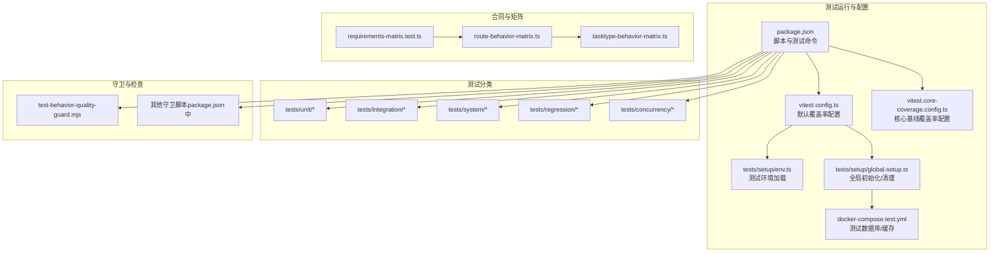
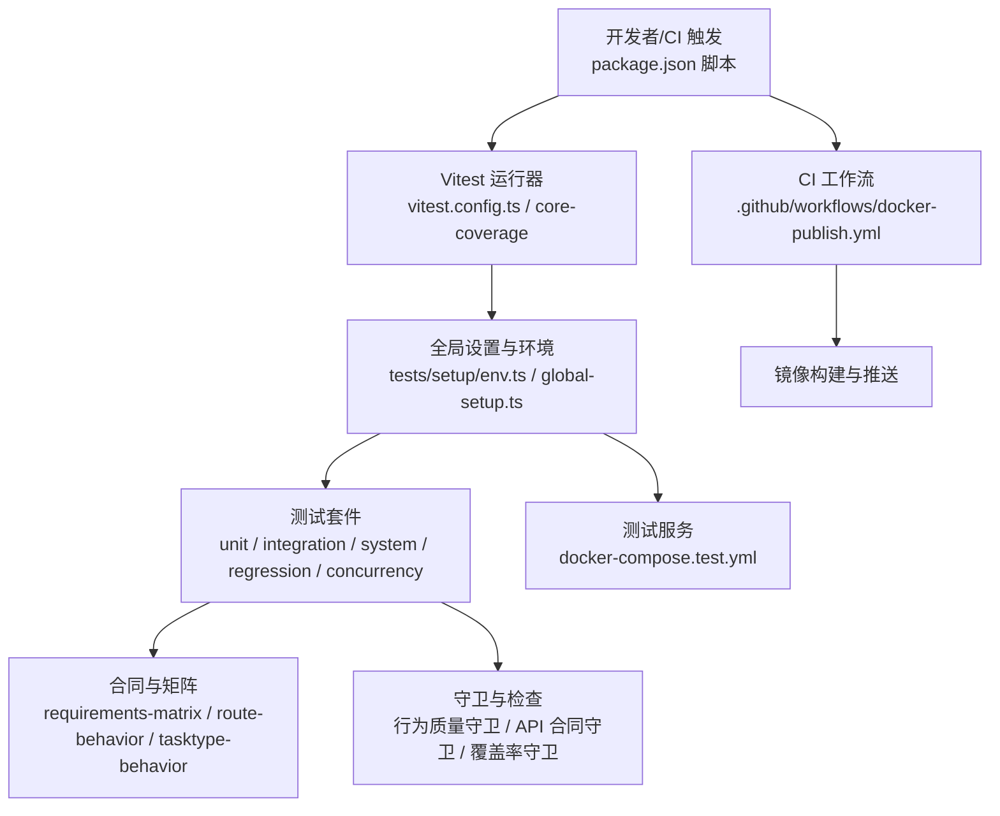
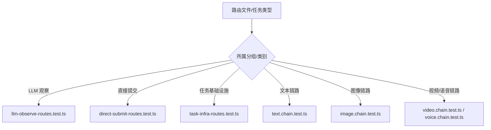
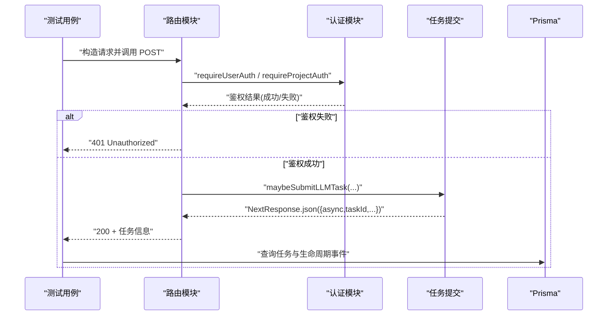
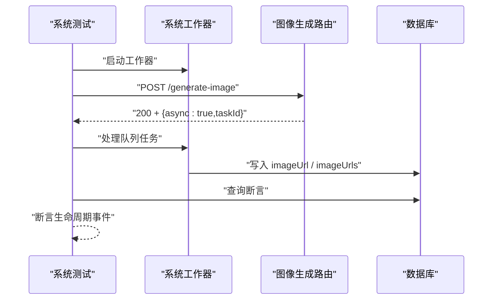
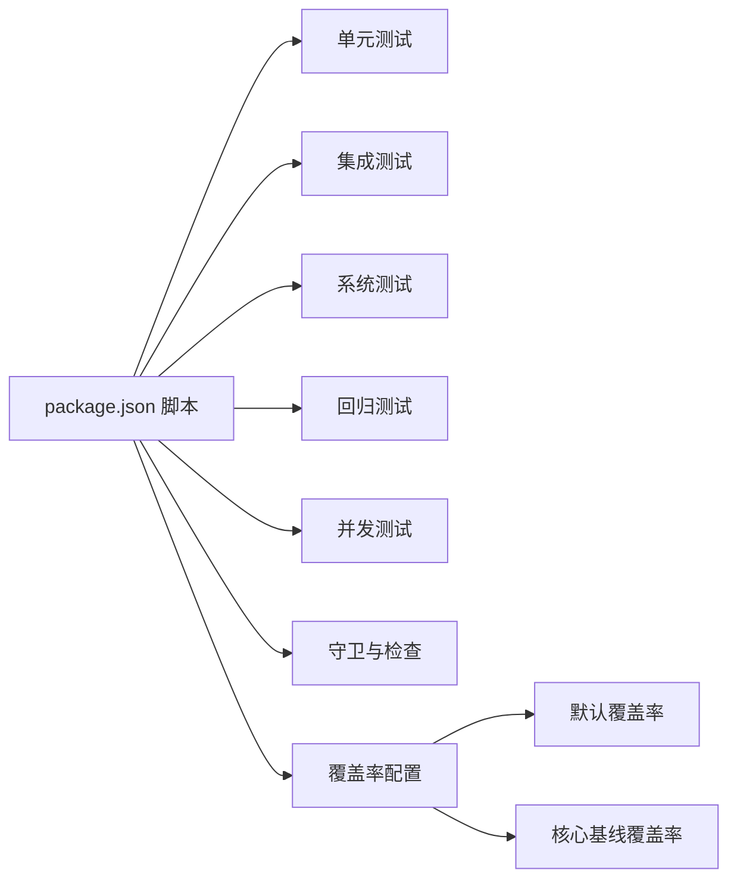

# 测试策略

<cite>
**本文引用的文件**
- [package.json](file://package.json)
- [vitest.config.ts](file://vitest.config.ts)
- [vitest.core-coverage.config.ts](file://vitest.core-coverage.config.ts)
- [tests/setup/env.ts](file://tests/setup/env.ts)
- [tests/setup/global-setup.ts](file://tests/setup/global-setup.ts)
- [docker-compose.test.yml](file://docker-compose.test.yml)
- [.github/workflows/docker-publish.yml](file://.github/workflows/docker-publish.yml)
- [tests/contracts/requirements-matrix.test.ts](file://tests/contracts/requirements-matrix.test.ts)
- [tests/contracts/route-behavior-matrix.ts](file://tests/contracts/route-behavior-matrix.ts)
- [tests/contracts/tasktype-behavior-matrix.ts](file://tests/contracts/tasktype-behavior-matrix.ts)
- [scripts/guards/test-behavior-quality-guard.mjs](file://scripts/guards/test-behavior-quality-guard.mjs)
- [tests/unit/billing/cost.test.ts](file://tests/unit/billing/cost.test.ts)
- [tests/integration/api/contract/llm-observe-routes.test.ts](file://tests/integration/api/contract/llm-observe-routes.test.ts)
- [tests/system/generate-image.system.test.ts](file://tests/system/generate-image.system.test.ts)
- [tests/regression/task-dedupe-recovery.test.ts](file://tests/regression/task-dedupe-recovery.test.ts)
</cite>

## 目录
1. [引言](#引言)
2. [项目结构](#项目结构)
3. [核心组件](#核心组件)
4. [架构总览](#架构总览)
5. [详细组件分析](#详细组件分析)
6. [依赖分析](#依赖分析)
7. [性能考虑](#性能考虑)
8. [故障排查指南](#故障排查指南)
9. [结论](#结论)
10. [附录](#附录)

## 引言
本文件面向 Waoowaoo 的质量保证与测试策略，构建覆盖单元测试、集成测试、系统测试与回归测试的多层测试体系。文档阐述测试覆盖率要求、测试数据管理与测试环境配置最佳实践；详解行为测试矩阵、API 契约测试与任务类型测试的实现方法；说明测试守卫机制、代码质量检查与持续集成流程；提供测试用例编写指南、断言策略与模拟对象使用方法；并给出性能测试、压力测试与并发测试的实施方案，以及测试自动化、CI/CD 集成与测试报告生成配置，最后解释测试数据治理、隐私保护与合规性要求。

## 项目结构
测试相关目录与文件分布如下：
- 测试运行与配置：Vitest 配置、全局环境与启动脚本
- 合同与矩阵：需求矩阵、路由行为矩阵、任务类型行为矩阵
- 测试分类：unit、integration、system、regression、concurrency
- 守卫与检查：测试覆盖率守卫、行为质量守卫、API 合同守卫等
- 环境与容器：测试数据库与缓存服务编排

**图示来源**
- [package.json:1-186](file://package.json#L1-L186)
- [vitest.config.ts:1-45](file://vitest.config.ts#L1-L45)
- [vitest.core-coverage.config.ts:1-44](file://vitest.core-coverage.config.ts#L1-L44)
- [tests/setup/env.ts:1-73](file://tests/setup/env.ts#L1-L73)
- [tests/setup/global-setup.ts:1-100](file://tests/setup/global-setup.ts#L1-L100)
- [docker-compose.test.yml:1-33](file://docker-compose.test.yml#L1-L33)
- [tests/contracts/requirements-matrix.test.ts:1-25](file://tests/contracts/requirements-matrix.test.ts#L1-L25)
- [tests/contracts/route-behavior-matrix.ts:1-52](file://tests/contracts/route-behavior-matrix.ts#L1-L52)
- [tests/contracts/tasktype-behavior-matrix.ts:1-106](file://tests/contracts/tasktype-behavior-matrix.ts#L1-L106)

**章节来源**
- [package.json:1-186](file://package.json#L1-L186)
- [vitest.config.ts:1-45](file://vitest.config.ts#L1-L45)
- [vitest.core-coverage.config.ts:1-44](file://vitest.core-coverage.config.ts#L1-L44)
- [tests/setup/env.ts:1-73](file://tests/setup/env.ts#L1-L73)
- [tests/setup/global-setup.ts:1-100](file://tests/setup/global-setup.ts#L1-L100)
- [docker-compose.test.yml:1-33](file://docker-compose.test.yml#L1-L33)
- [tests/contracts/requirements-matrix.test.ts:1-25](file://tests/contracts/requirements-matrix.test.ts#L1-L25)
- [tests/contracts/route-behavior-matrix.ts:1-52](file://tests/contracts/route-behavior-matrix.ts#L1-L52)
- [tests/contracts/tasktype-behavior-matrix.ts:1-106](file://tests/contracts/tasktype-behavior-matrix.ts#L1-L106)

## 核心组件
- 测试运行器与配置
  - Vitest 默认配置与核心覆盖率配置分别用于不同范围的覆盖率统计与阈值控制
  - 全局设置与环境加载确保测试隔离与网络限制
- 合同与矩阵
  - 需求矩阵校验测试文件完整性
  - 路由行为矩阵与任务类型行为矩阵将具体路由/任务映射到对应契约与链路测试
- 测试分类
  - 单元测试：聚焦函数/模块级逻辑与边界条件
  - 集成测试：跨模块协作、API 合同、外部服务契约
  - 系统测试：端到端工作流、真实或模拟的外部服务交互
  - 回归测试：历史缺陷复现与恢复策略验证
  - 并发测试：高并发下的资源竞争与一致性
- 守卫与检查
  - 行为质量守卫：禁止在行为测试中读取源码文本、避免弱断言等
  - API 合同守卫：禁止直接调用内部实现细节，确保契约测试的稳定性
  - 覆盖率守卫：确保路由与任务类型的测试覆盖度

**章节来源**
- [vitest.config.ts:15-42](file://vitest.config.ts#L15-L42)
- [vitest.core-coverage.config.ts:15-41](file://vitest.core-coverage.config.ts#L15-L41)
- [tests/setup/env.ts:22-73](file://tests/setup/env.ts#L22-L73)
- [tests/setup/global-setup.ts:70-99](file://tests/setup/global-setup.ts#L70-L99)
- [tests/contracts/requirements-matrix.test.ts:10-24](file://tests/contracts/requirements-matrix.test.ts#L10-L24)
- [tests/contracts/route-behavior-matrix.ts:41-52](file://tests/contracts/route-behavior-matrix.ts#L41-L52)
- [tests/contracts/tasktype-behavior-matrix.ts:97-106](file://tests/contracts/tasktype-behavior-matrix.ts#L97-L106)
- [scripts/guards/test-behavior-quality-guard.mjs:15-83](file://scripts/guards/test-behavior-quality-guard.mjs#L15-L83)

## 架构总览
下图展示测试策略的整体架构：从脚本入口到测试执行、从环境准备到报告输出，再到守卫与 CI 的协同。

**图示来源**
- [package.json:90-96](file://package.json#L90-L96)
- [vitest.config.ts:15-42](file://vitest.config.ts#L15-L42)
- [vitest.core-coverage.config.ts:15-41](file://vitest.core-coverage.config.ts#L15-L41)
- [tests/setup/env.ts:22-73](file://tests/setup/env.ts#L22-L73)
- [tests/setup/global-setup.ts:70-99](file://tests/setup/global-setup.ts#L70-L99)
- [docker-compose.test.yml:1-33](file://docker-compose.test.yml#L1-L33)
- [.github/workflows/docker-publish.yml:1-56](file://.github/workflows/docker-publish.yml#L1-L56)

## 详细组件分析

### 组件一：测试运行与覆盖率配置
- 默认配置
  - 环境：Node
  - 别名：@ 指向 src
  - 超时：测试与钩子超时
  - 覆盖率：v8 提供者，HTML/JSON 摘要，针对计费模块设定 80% 阈值
- 核心基线配置
  - 覆盖率：针对 API、任务、工作器、媒体、错误处理等核心路径，阈值设为 0 以仅统计不强制达标
- 最佳实践
  - 将高风险模块（如计费）纳入严格覆盖率
  - 对通用基础设施采用“统计但不强制”的策略，便于逐步提升

**章节来源**
- [vitest.config.ts:15-42](file://vitest.config.ts#L15-L42)
- [vitest.core-coverage.config.ts:15-41](file://vitest.core-coverage.config.ts#L15-L41)

### 组件二：测试环境与容器化
- 环境加载
  - 优先从 .env.test 注入变量，未定义则设置默认值（如测试环境、数据库、Redis）
  - 在未显式允许网络时，拦截非本地主机的网络请求，防止测试泄漏
- 全局初始化
  - 可按需拉起测试容器（MySQL/Redis），等待健康检查通过后执行 Prisma 推送
  - 支持自定义引导开关（如计费/系统测试引导）
- 最佳实践
  - 使用独立测试数据库与缓存端口，避免与开发环境冲突
  - 通过环境变量控制是否启用引导，减少不必要的容器启动

**章节来源**
- [tests/setup/env.ts:22-73](file://tests/setup/env.ts#L22-L73)
- [tests/setup/global-setup.ts:70-99](file://tests/setup/global-setup.ts#L70-L99)
- [docker-compose.test.yml:1-33](file://docker-compose.test.yml#L1-L33)

### 组件三：合同与矩阵
- 需求矩阵
  - 校验需求 ID 唯一性与测试文件存在性，确保每个需求都有对应测试
- 路由行为矩阵
  - 将路由文件映射到对应的 API 合同测试与链路测试
  - 不同路由组（如 LLM 观察、直接提交、任务基础设施等）指向不同契约文件
- 任务类型行为矩阵
  - 将任务类型映射到工作器测试、链路测试与 API 合同测试
  - 文本类、图像类、视频/语音类任务分别落到不同链路测试文件

**图示来源**
- [tests/contracts/route-behavior-matrix.ts:10-49](file://tests/contracts/route-behavior-matrix.ts#L10-L49)
- [tests/contracts/tasktype-behavior-matrix.ts:48-103](file://tests/contracts/tasktype-behavior-matrix.ts#L48-L103)

**章节来源**
- [tests/contracts/requirements-matrix.test.ts:10-24](file://tests/contracts/requirements-matrix.test.ts#L10-L24)
- [tests/contracts/route-behavior-matrix.ts:10-49](file://tests/contracts/route-behavior-matrix.ts#L10-L49)
- [tests/contracts/tasktype-behavior-matrix.ts:48-103](file://tests/contracts/tasktype-behavior-matrix.ts#L48-L103)

### 组件四：API 契约测试（以 LLM 观察路由为例）
- 设计要点
  - 使用模拟认证与配置服务，确保路由在鉴权失败时返回 401
  - 成功时调用任务提交接口并断言返回异步任务信息
  - 断言提交的任务类型、目标类型与项目 ID 符合预期
- 断言策略
  - 结果状态码与响应体字段
  - 任务提交参数的强断言（含类型、目标、用户/项目上下文）
- 模拟对象
  - 认证模块、配置服务、Prisma 查询等均通过 hoisted + vi.mock 模拟

**图示来源**
- [tests/integration/api/contract/llm-observe-routes.test.ts:370-417](file://tests/integration/api/contract/llm-observe-routes.test.ts#L370-L417)

**章节来源**
- [tests/integration/api/contract/llm-observe-routes.test.ts:1-418](file://tests/integration/api/contract/llm-observe-routes.test.ts#L1-L418)

### 组件五：系统测试（以图像生成为例）
- 设计要点
  - 种子最小域状态，模拟认证，启动系统工作器
  - 调用路由提交任务，等待终端状态，断言数据库写入与生命周期事件
  - 验证失败路径：模拟致命错误，断言任务失败且现有数据不变
- 断言策略
  - 任务状态与类型、目标 ID
  - 数据库字段一致性（如图片 URL、索引）
  - 生命周期事件序列符合终止态

**图示来源**
- [tests/system/generate-image.system.test.ts:58-99](file://tests/system/generate-image.system.test.ts#L58-L99)

**章节来源**
- [tests/system/generate-image.system.test.ts:1-143](file://tests/system/generate-image.system.test.ts#L1-L143)

### 组件六：回归测试（以任务去重恢复为例）
- 设计要点
  - 创建过期无语言标记的排队任务，提交带语言标记的新任务，验证替换而非无限去重
  - 模拟队列作业不存在，验证孤儿任务被替换并标记为失败
- 断言策略
  - 新任务未被去重，ID 与旧任务不同
  - 旧任务被标记为失败并清空去重键

**章节来源**
- [tests/regression/task-dedupe-recovery.test.ts:21-60](file://tests/regression/task-dedupe-recovery.test.ts#L21-L60)
- [tests/regression/task-dedupe-recovery.test.ts:62-107](file://tests/regression/task-dedupe-recovery.test.ts#L62-L107)

### 组件七：单元测试（以计费成本计算为例）
- 设计要点
  - 针对文本/图像/视频/语音等模型与分辨率、时长、选项组合进行精确断言
  - 包含异常场景（未知模型、不支持分辨率/能力）与边界条件
- 断言策略
  - 数值近似比较（金额计算）
  - 显式抛错断言（未知定价）

**章节来源**
- [tests/unit/billing/cost.test.ts:1-241](file://tests/unit/billing/cost.test.ts#L1-L241)

### 组件八：测试守卫机制与代码质量检查
- 行为质量守卫
  - 禁止在行为/契约/链路测试中读取源码文本
  - 禁止使用弱断言（如 toHaveBeenCalled 无参数断言）
  - 禁止字符串断言包含内部实现标识
- API 合同守卫与覆盖率守卫
  - 通过脚本在 PR 阶段执行，确保测试覆盖面与质量门槛
- 最佳实践
  - 在提交前统一执行守卫脚本，避免违规测试进入主干
  - 将守卫作为 CI 步骤的一部分

**章节来源**
- [scripts/guards/test-behavior-quality-guard.mjs:15-83](file://scripts/guards/test-behavior-quality-guard.mjs#L15-L83)
- [package.json:52-67](file://package.json#L52-L67)

## 依赖分析
- 测试脚本与命令
  - 通过 package.json 的 scripts 统一组织测试命令，涵盖守卫、单元、集成、系统、回归与并发测试
  - 支持按模块选择性运行，便于快速迭代
- 容器依赖
  - 测试数据库与缓存通过 docker-compose.test.yml 提供，全局初始化阶段等待健康检查
- 覆盖率与报告
  - 默认配置与核心基线配置分别输出不同范围的覆盖率报告，便于分层评估

**图示来源**
- [package.json:70-91](file://package.json#L70-L91)
- [vitest.config.ts:24-42](file://vitest.config.ts#L24-L42)
- [vitest.core-coverage.config.ts:24-41](file://vitest.core-coverage.config.ts#L24-L41)

**章节来源**
- [package.json:70-91](file://package.json#L70-L91)
- [docker-compose.test.yml:1-33](file://docker-compose.test.yml#L1-L33)

## 性能考虑
- 测试超时与并发
  - 测试超时与钩子超时合理设置，避免长时间阻塞
  - 使用 fork 池运行测试，平衡内存与 CPU 开销
- 覆盖率统计范围
  - 将高风险模块纳入严格覆盖率，降低回归风险
  - 对通用基础设施采用宽松阈值，逐步提升质量
- 系统测试与并发测试
  - 通过系统测试验证端到端路径，结合并发测试验证资源竞争与一致性
  - 使用容器化服务保障测试环境稳定

**章节来源**
- [vitest.config.ts:18-23](file://vitest.config.ts#L18-L23)
- [vitest.core-coverage.config.ts:18-23](file://vitest.core-coverage.config.ts#L18-L23)

## 故障排查指南
- 网络拦截导致的失败
  - 若测试中出现网络错误，检查是否访问了非本地主机，必要时在环境允许网络时调整配置
- 容器未就绪
  - 全局初始化会等待 MySQL/Redis 健康检查，若超时请检查容器日志与端口映射
- 覆盖率不达标
  - 高风险模块需满足阈值；通用模块可接受较低阈值，但应逐步提升
- 行为测试违规
  - 避免在行为测试中读取源码文本、使用弱断言或断言内部实现标识

**章节来源**
- [tests/setup/env.ts:53-72](file://tests/setup/env.ts#L53-L72)
- [tests/setup/global-setup.ts:19-68](file://tests/setup/global-setup.ts#L19-L68)
- [scripts/guards/test-behavior-quality-guard.mjs:53-78](file://scripts/guards/test-behavior-quality-guard.mjs#L53-L78)

## 结论
本测试策略通过多层次测试体系与严格的守卫机制，确保功能正确性、契约稳定性与系统可靠性。借助合同与矩阵驱动的测试覆盖，配合覆盖率配置与容器化环境，形成可演进的质量保障方案。建议持续完善覆盖率与回归测试，强化并发与性能测试，并将守卫与 CI 深度集成，以维持高质量交付节奏。

## 附录

### 测试用例编写指南
- 断言策略
  - 使用强断言（含参数）替代弱断言，确保行为可验证
  - 对数值型结果使用近似比较，避免浮点误差
  - 对异常场景明确抛错断言
- 模拟对象
  - 使用 hoisted + vi.mock 模拟外部依赖，隔离测试环境
  - 保持模拟接口最小化，仅暴露必要方法
- 数据与环境
  - 使用最小种子数据，避免冗余状态
  - 通过全局设置与环境加载确保测试隔离

### 测试自动化与 CI/CD 集成
- 提交前验证
  - 执行守卫脚本与全量测试，确保质量门槛
- CI 工作流
  - 使用现有 Docker 发布工作流，可在其基础上扩展测试步骤
- 报告生成
  - 默认配置输出 HTML/JSON 摘要报告，便于审阅与集成

**章节来源**
- [package.json:95-96](file://package.json#L95-L96)
- [.github/workflows/docker-publish.yml:1-56](file://.github/workflows/docker-publish.yml#L1-L56)
- [vitest.config.ts:26](file://vitest.config.ts#L26)

### 测试数据治理、隐私保护与合规性
- 测试数据治理
  - 使用独立测试数据库与缓存，避免污染生产数据
  - 通过最小种子数据与受控状态管理，确保可重复性
- 隐私保护
  - 禁止在行为测试中读取源码文本，避免无意泄露实现细节
  - 严格控制网络访问，仅允许本地主机
- 合规性
  - 将守卫脚本纳入 CI，确保每次变更均满足质量与安全要求

**章节来源**
- [docker-compose.test.yml:1-33](file://docker-compose.test.yml#L1-L33)
- [tests/setup/env.ts:53-72](file://tests/setup/env.ts#L53-L72)
- [scripts/guards/test-behavior-quality-guard.mjs:53-78](file://scripts/guards/test-behavior-quality-guard.mjs#L53-L78)