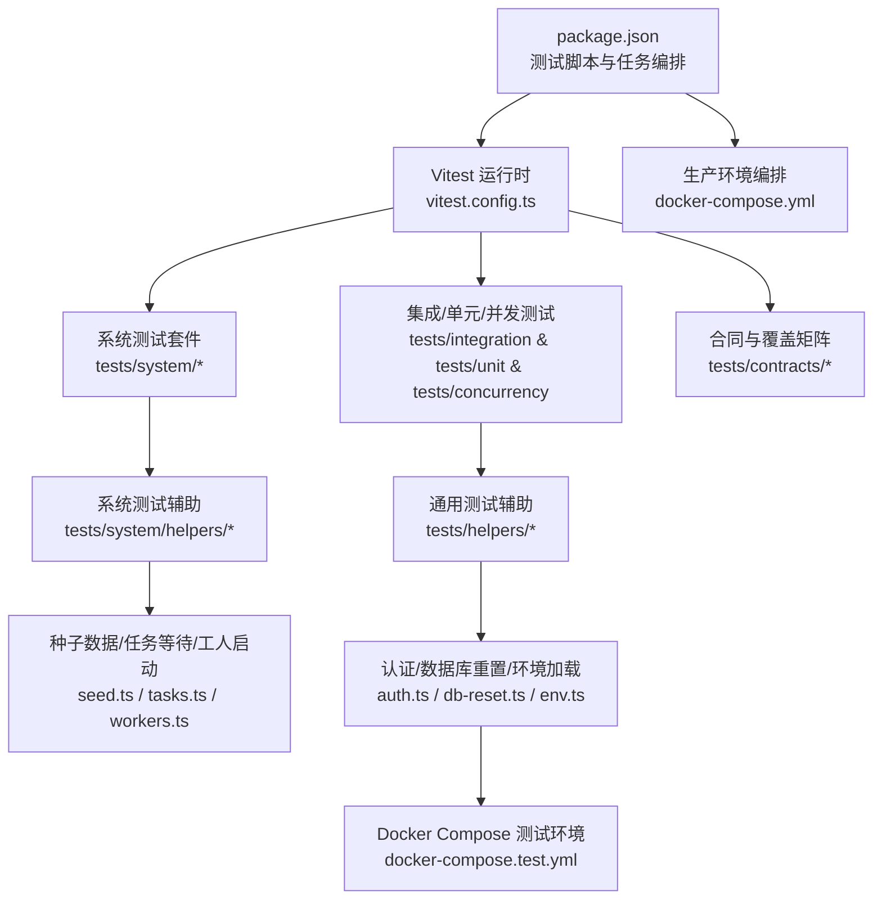
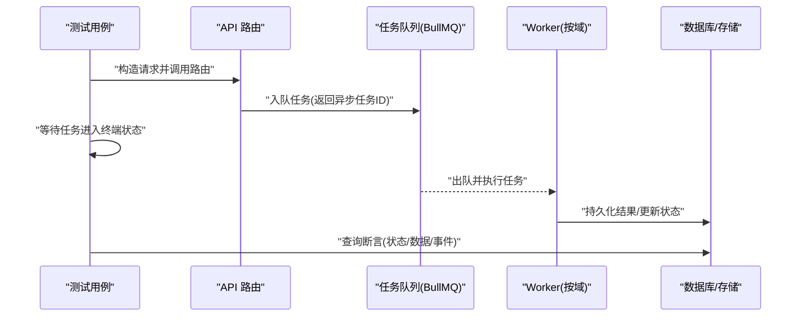
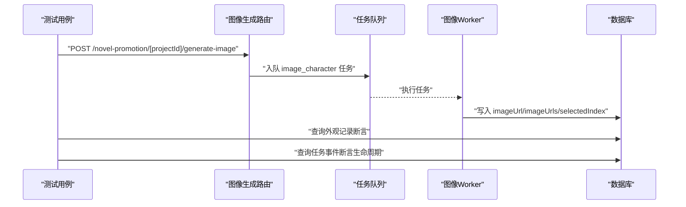
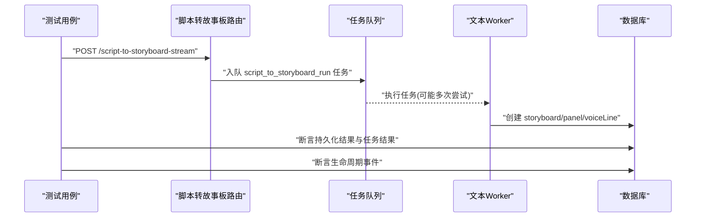
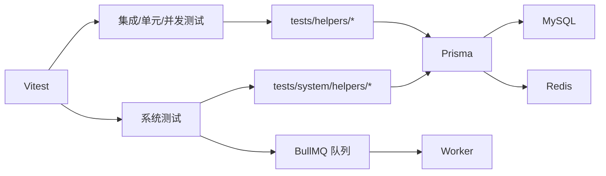

# 系统测试

<cite>
**本文引用的文件**
- [package.json](file://package.json)
- [vitest.config.ts](file://vitest.config.ts)
- [docker-compose.yml](file://docker-compose.yml)
- [docker-compose.test.yml](file://docker-compose.test.yml)
- [tests/setup/env.ts](file://tests/setup/env.ts)
- [tests/setup/global-setup.ts](file://tests/setup/global-setup.ts)
- [tests/setup/global-teardown.ts](file://tests/setup/global-teardown.ts)
- [tests/helpers/auth.ts](file://tests/helpers/auth.ts)
- [tests/helpers/db-reset.ts](file://tests/helpers/db-reset.ts)
- [tests/helpers/fixtures.ts](file://tests/helpers/fixtures.ts)
- [tests/helpers/prisma.ts](file://tests/helpers/prisma.ts)
- [tests/system/helpers/seed.ts](file://tests/system/helpers/seed.ts)
- [tests/system/helpers/tasks.ts](file://tests/system/helpers/tasks.ts)
- [tests/system/helpers/workers.ts](file://tests/system/helpers/workers.ts)
- [tests/system/generate-image.system.test.ts](file://tests/system/generate-image.system.test.ts)
- [tests/system/text-workflow.system.test.ts](file://tests/system/text-workflow.system.test.ts)
- [tests/system/generate-video.system.test.ts](file://tests/system/generate-video.system.test.ts)
- [tests/system/voice-generate.system.test.ts](file://tests/system/voice-generate.system.test.ts)
- [tests/integration/api/helpers/call-route.ts](file://tests/integration/api/helpers/call-route.ts)
- [tests/contracts/requirements-matrix.test.ts](file://tests/contracts/requirements-matrix.test.ts)
- [tests/contracts/behavior-test-standard.md](file://tests/contracts/behavior-test-standard.md)
- [tests/contracts/route-behavior-matrix.ts](file://tests/contracts/route-behavior-matrix.ts)
- [tests/contracts/tasktype-behavior-matrix.ts](file://tests/contracts/tasktype-behavior-matrix.ts)
- [tests/contracts/route-catalog.ts](file://tests/contracts/route-catalog.ts)
- [tests/contracts/task-type-catalog.ts](file://tests/contracts/task-type-catalog.ts)
- [scripts/test-regression-runner.sh](file://scripts/test-regression-runner.sh)
</cite>

## 目录
1. [引言](#引言)
2. [项目结构](#项目结构)
3. [核心组件](#核心组件)
4. [架构总览](#架构总览)
5. [详细组件分析](#详细组件分析)
6. [依赖关系分析](#依赖关系分析)
7. [性能考虑](#性能考虑)
8. [故障排查指南](#故障排查指南)
9. [结论](#结论)
10. [附录](#附录)

## 引言
本文件面向Waoowaoo系统的测试工程实践，围绕端到端工作流测试、完整功能测试与性能基准测试，系统性阐述测试策略与落地方法。重点覆盖：
- 系统边界测试、用户场景测试与业务流程测试的设计方法
- 测试环境搭建、数据准备与测试执行流程
- 性能测试、压力测试与稳定性测试的实施方案
- 测试自动化策略、监控指标与报告生成
- 测试数据治理、环境管理与回归测试配置

目标是帮助测试与开发团队在保证质量的同时，提升测试效率与可维护性。

## 项目结构
Waoowaoo采用基于Vitest的多层级测试体系，结合Docker Compose提供可复现的测试环境。关键结构如下：
- 测试入口与脚本：通过package.json统一编排各类测试任务（单元、集成、系统、回归等）
- 测试运行时配置：Vitest配置集中于vitest.config.ts，含环境、超时、覆盖率与别名设置
- 系统测试：tests/system目录下按领域划分（图像生成、文本工作流、视频生成、语音生成），每个文件聚焦一个端到端场景
- 辅助设施：tests/setup提供全局环境加载、数据库与缓存等待、容器编排；tests/helpers提供认证、数据库重置、种子数据等通用能力
- 合同与矩阵：tests/contracts定义行为契约与覆盖矩阵，确保API与任务类型的行为一致性

图表来源
- [package.json:1-186](file://package.json#L1-L186)
- [vitest.config.ts:1-45](file://vitest.config.ts#L1-L45)
- [docker-compose.test.yml:1-33](file://docker-compose.test.yml#L1-L33)
- [docker-compose.yml:1-153](file://docker-compose.yml#L1-L153)

章节来源
- [package.json:1-186](file://package.json#L1-L186)
- [vitest.config.ts:1-45](file://vitest.config.ts#L1-L45)

## 核心组件
- 测试运行时与脚本
  - Vitest配置：设置环境、池类型、超时、覆盖率范围与阈值、路径别名等
  - 包装脚本：统一入口，支持系统测试、回归测试、行为测试、覆盖率基线等
- 测试环境与基础设施
  - 测试环境变量加载：.env.test解析与网络限制
  - 全局初始化：拉起测试容器（MySQL、Redis）、等待健康、执行Prisma迁移
  - 全局收尾：按需清理测试容器
- 系统测试支撑
  - 认证模拟：统一拦截鉴权模块，支持未登录、无权限、项目不存在等边界
  - 数据重置：按域重置数据库状态，避免跨用例污染
  - 种子数据：快速构建最小可用领域状态
  - 任务等待与生命周期断言：轮询任务终端状态，校验事件序列
  - 工人启动与关闭：按作用域启动对应Worker，模拟真实队列处理链路

章节来源
- [vitest.config.ts:15-44](file://vitest.config.ts#L15-L44)
- [package.json:70-92](file://package.json#L70-L92)
- [tests/setup/env.ts:22-73](file://tests/setup/env.ts#L22-L73)
- [tests/setup/global-setup.ts:70-100](file://tests/setup/global-setup.ts#L70-L100)
- [tests/setup/global-teardown.ts:4-16](file://tests/setup/global-teardown.ts#L4-L16)
- [tests/helpers/auth.ts:71-133](file://tests/helpers/auth.ts#L71-L133)
- [tests/helpers/db-reset.ts:47-61](file://tests/helpers/db-reset.ts#L47-L61)
- [tests/system/helpers/seed.ts:14-185](file://tests/system/helpers/seed.ts#L14-L185)
- [tests/system/helpers/tasks.ts:21-54](file://tests/system/helpers/tasks.ts#L21-L54)
- [tests/system/helpers/workers.ts:25-41](file://tests/system/helpers/workers.ts#L25-L41)

## 架构总览
系统测试以“路由 → 队列 → Worker → 数据库/存储”的端到端链路为核心，通过模拟外部服务与Worker实现可控、可重复的测试。

图表来源
- [tests/system/generate-image.system.test.ts:58-99](file://tests/system/generate-image.system.test.ts#L58-L99)
- [tests/system/text-workflow.system.test.ts:205-271](file://tests/system/text-workflow.system.test.ts#L205-L271)
- [tests/system/helpers/tasks.ts:21-37](file://tests/system/helpers/tasks.ts#L21-L37)
- [tests/system/helpers/workers.ts:25-33](file://tests/system/helpers/workers.ts#L25-L33)

## 详细组件分析

### 图像生成系统测试
- 目标：验证从路由提交到Worker处理再到数据库写入的完整链路，并覆盖失败路径
- 关键点：
  - 使用认证模拟与最小领域状态种子
  - 模拟图像生成与归一化逻辑，控制成功/失败分支
  - 断言任务生命周期事件与最终数据库状态
- 测试场景：
  - 成功路径：任务完成，外观图片字段更新
  - 失败路径：任务失败，外观图片保持不变

图表来源
- [tests/system/generate-image.system.test.ts:58-99](file://tests/system/generate-image.system.test.ts#L58-L99)
- [tests/system/helpers/tasks.ts:48-54](file://tests/system/helpers/tasks.ts#L48-L54)

章节来源
- [tests/system/generate-image.system.test.ts:1-143](file://tests/system/generate-image.system.test.ts#L1-L143)
- [tests/system/helpers/seed.ts:14-185](file://tests/system/helpers/seed.ts#L14-L185)
- [tests/helpers/auth.ts:71-98](file://tests/helpers/auth.ts#L71-L98)

### 文本工作流系统测试
- 目标：验证从脚本到故事板的完整链路，包括AI解析、语音行抽取、持久化与重试机制
- 关键点：
  - 模拟AI输出与语音行解析，支持首次失败与二次成功
  - 断言故事板、面板、语音行的持久化结果
  - 校验任务结果字段与生命周期事件
- 测试场景：
  - 成功路径：生成故事板与语音行，任务完成
  - 解析重试：第一次JSON无效，第二次成功
  - 失败路径：非法AI负载，任务失败且不产生脏数据

图表来源
- [tests/system/text-workflow.system.test.ts:205-271](file://tests/system/text-workflow.system.test.ts#L205-L271)
- [tests/system/text-workflow.system.test.ts:273-315](file://tests/system/text-workflow.system.test.ts#L273-L315)
- [tests/system/text-workflow.system.test.ts:317-351](file://tests/system/text-workflow.system.test.ts#L317-L351)

章节来源
- [tests/system/text-workflow.system.test.ts:1-353](file://tests/system/text-workflow.system.test.ts#L1-L353)
- [tests/system/helpers/seed.ts:14-185](file://tests/system/helpers/seed.ts#L14-L185)
- [tests/helpers/auth.ts:71-98](file://tests/helpers/auth.ts#L71-L98)

### 视频生成与语音生成系统测试
- 目标：覆盖视频与语音生成的端到端链路，验证任务调度、持久化与生命周期
- 关键点：
  - 通过workers启动视频/语音Worker
  - 基于最小领域状态提交任务
  - 断言任务终端状态与相关实体的持久化结果

章节来源
- [tests/system/generate-video.system.test.ts](file://tests/system/generate-video.system.test.ts)
- [tests/system/voice-generate.system.test.ts](file://tests/system/voice-generate.system.test.ts)
- [tests/system/helpers/workers.ts:25-41](file://tests/system/helpers/workers.ts#L25-L41)

### 系统边界测试与用户场景测试
- 边界测试
  - 未登录/无权限/项目不存在：通过认证模拟触发不同错误码
  - 外部服务失败：模拟Worker或媒体服务异常，验证失败回滚与事件
- 用户场景测试
  - 从脚本到故事板的典型创作流程
  - 插入新面板的编辑流程
  - 图像生成的批量与失败重试场景

章节来源
- [tests/helpers/auth.ts:71-133](file://tests/helpers/auth.ts#L71-L133)
- [tests/system/generate-image.system.test.ts:101-141](file://tests/system/generate-image.system.test.ts#L101-L141)
- [tests/system/text-workflow.system.test.ts:317-351](file://tests/system/text-workflow.system.test.ts#L317-L351)

### 业务流程测试设计方法
- 以任务为中心：围绕任务类型（如image_character、script_to_storyboard_run）设计端到端场景
- 以领域模型为锚：使用种子数据构建最小可用上下文，确保测试可重复
- 以生命周期为约束：断言任务事件序列（CREATED → PROCESSING → COMPLETED/FAILED）

章节来源
- [tests/system/helpers/tasks.ts:48-54](file://tests/system/helpers/tasks.ts#L48-L54)
- [tests/system/helpers/seed.ts:14-185](file://tests/system/helpers/seed.ts#L14-L185)

## 依赖关系分析
- 测试运行时依赖
  - Vitest提供测试框架、快照、覆盖率与钩子
  - Prisma用于数据库操作与迁移
- 外部依赖
  - MySQL与Redis通过Docker Compose提供测试后端
  - BullMQ队列驱动Worker执行
- 测试耦合与内聚
  - 系统测试内聚于领域场景，依赖helpers解耦环境与数据准备
  - 合同与矩阵测试确保API与任务类型的契约一致

图表来源
- [vitest.config.ts:15-44](file://vitest.config.ts#L15-L44)
- [docker-compose.test.yml:1-33](file://docker-compose.test.yml#L1-L33)
- [tests/system/helpers/workers.ts:25-33](file://tests/system/helpers/workers.ts#L25-L33)

章节来源
- [vitest.config.ts:15-44](file://vitest.config.ts#L15-L44)
- [docker-compose.test.yml:1-33](file://docker-compose.test.yml#L1-L33)

## 性能考虑
- 测试超时与并发
  - Vitest测试超时与钩子超时合理设置，避免长耗时阻塞
  - Worker并发度可通过环境变量在生产/测试容器中配置
- 数据库与缓存
  - 测试前等待MySQL/Redis健康，减少连接抖动
  - 使用最小种子数据降低初始化成本
- 覆盖率与性能权衡
  - 覆盖率仅针对关键模块，避免过度扫描影响性能

章节来源
- [vitest.config.ts:22-24](file://vitest.config.ts#L22-L24)
- [tests/setup/global-setup.ts:19-68](file://tests/setup/global-setup.ts#L19-L68)
- [docker-compose.yml:94-106](file://docker-compose.yml#L94-L106)

## 故障排查指南
- 环境未就绪
  - 现象：测试连接数据库/Redis失败
  - 排查：确认测试容器已启动并通过健康检查；检查全局初始化日志
- 任务未达终端状态
  - 现象：等待超时
  - 排查：查看任务事件序列与Worker日志；确认队列与Worker是否正常
- 认证失败
  - 现象：401/403/404
  - 排查：检查认证模拟状态与项目鉴权模式
- 数据污染
  - 现象：用例间相互影响
  - 排查：确认每次用例后执行数据库重置

章节来源
- [tests/setup/global-setup.ts:70-100](file://tests/setup/global-setup.ts#L70-L100)
- [tests/system/helpers/tasks.ts:21-37](file://tests/system/helpers/tasks.ts#L21-L37)
- [tests/helpers/auth.ts:71-133](file://tests/helpers/auth.ts#L71-L133)
- [tests/helpers/db-reset.ts:47-61](file://tests/helpers/db-reset.ts#L47-L61)

## 结论
Waoowaoo的系统测试以“任务驱动+领域建模”为核心，通过可复现的测试环境、完善的辅助设施与清晰的契约矩阵，实现了对端到端工作流、边界条件与业务流程的全面覆盖。建议持续完善以下方面：
- 扩展更多业务场景的系统测试用例
- 引入性能与压力测试基线，结合覆盖率与回归测试形成闭环
- 将关键监控指标纳入测试报告，提升问题定位效率

## 附录

### 测试环境搭建与数据准备
- 启动测试环境
  - 使用测试Compose文件启动MySQL与Redis
  - 等待服务健康后执行Prisma迁移
- 加载测试环境变量
  - 解析.env.test，设置缺失项，限制网络访问
- 数据准备
  - 使用种子函数构建最小领域状态
  - 用例结束后重置数据库状态

章节来源
- [docker-compose.test.yml:1-33](file://docker-compose.test.yml#L1-L33)
- [tests/setup/env.ts:22-73](file://tests/setup/env.ts#L22-L73)
- [tests/setup/global-setup.ts:70-100](file://tests/setup/global-setup.ts#L70-L100)
- [tests/system/helpers/seed.ts:14-185](file://tests/system/helpers/seed.ts#L14-L185)
- [tests/helpers/db-reset.ts:47-61](file://tests/helpers/db-reset.ts#L47-L61)

### 测试执行流程
- 单元/集成/并发/系统/回归测试分别通过独立脚本执行
- 行为测试与合同矩阵用于质量门禁
- 回归测试通过专用脚本驱动

章节来源
- [package.json:70-92](file://package.json#L70-L92)
- [tests/contracts/requirements-matrix.test.ts](file://tests/contracts/requirements-matrix.test.ts)
- [scripts/test-regression-runner.sh](file://scripts/test-regression-runner.sh)

### 性能测试、压力测试与稳定性测试实施方案
- 性能基准
  - 在系统测试基础上统计关键路径耗时（任务从入队到完成）
  - 对比不同Worker并发配置下的吞吐
- 压力测试
  - 批量提交相似任务，观察队列积压与错误率
  - 验证失败重试与补偿机制
- 稳定性测试
  - 长时间运行多个Worker，监控内存与CPU
  - 验证任务持久化与事件完整性

章节来源
- [tests/system/helpers/tasks.ts:21-37](file://tests/system/helpers/tasks.ts#L21-L37)
- [docker-compose.yml:94-106](file://docker-compose.yml#L94-L106)

### 自动化策略、监控指标与报告生成
- 自动化策略
  - 通过package.json脚本统一编排
  - 使用全局初始化/收尾脚本确保环境一致性
- 监控指标
  - 任务成功率、平均/95分位耗时、队列长度、Worker空闲率
- 报告生成
  - Vitest内置HTML/JSON摘要报告，结合覆盖率阈值进行门禁

章节来源
- [package.json:70-92](file://package.json#L70-L92)
- [vitest.config.ts:24-42](file://vitest.config.ts#L24-L42)

### 测试数据治理、环境管理与回归测试配置
- 测试数据治理
  - 使用最小种子数据，避免冗余
  - 用例间通过重置隔离
- 环境管理
  - 测试容器与生产容器分离，避免互相干扰
- 回归测试
  - 提供专用脚本与命令，确保变更影响面可控

章节来源
- [tests/helpers/db-reset.ts:47-61](file://tests/helpers/db-reset.ts#L47-L61)
- [docker-compose.test.yml:1-33](file://docker-compose.test.yml#L1-L33)
- [scripts/test-regression-runner.sh](file://scripts/test-regression-runner.sh)