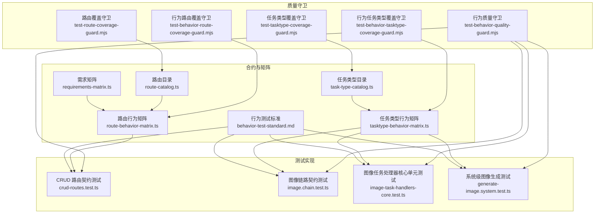
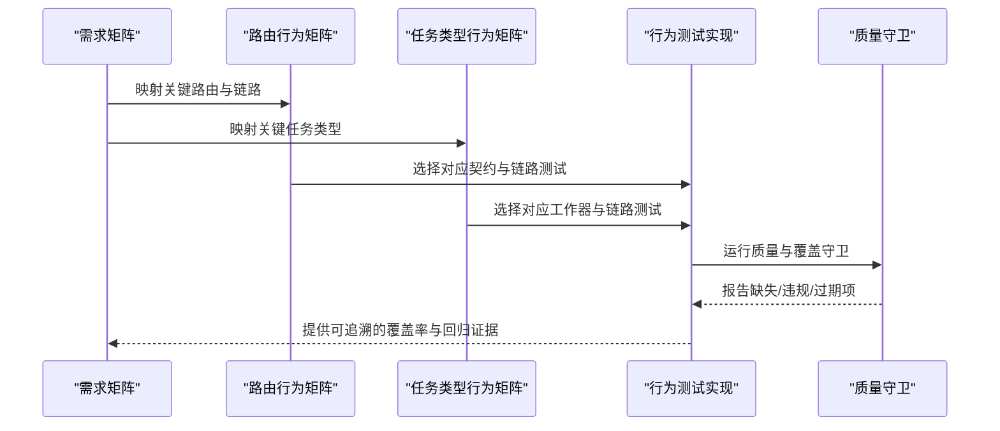
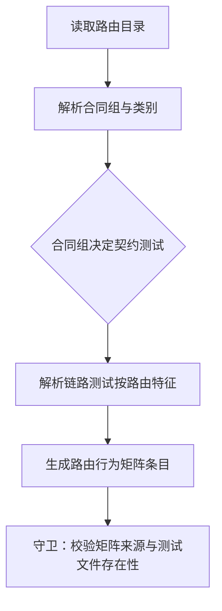
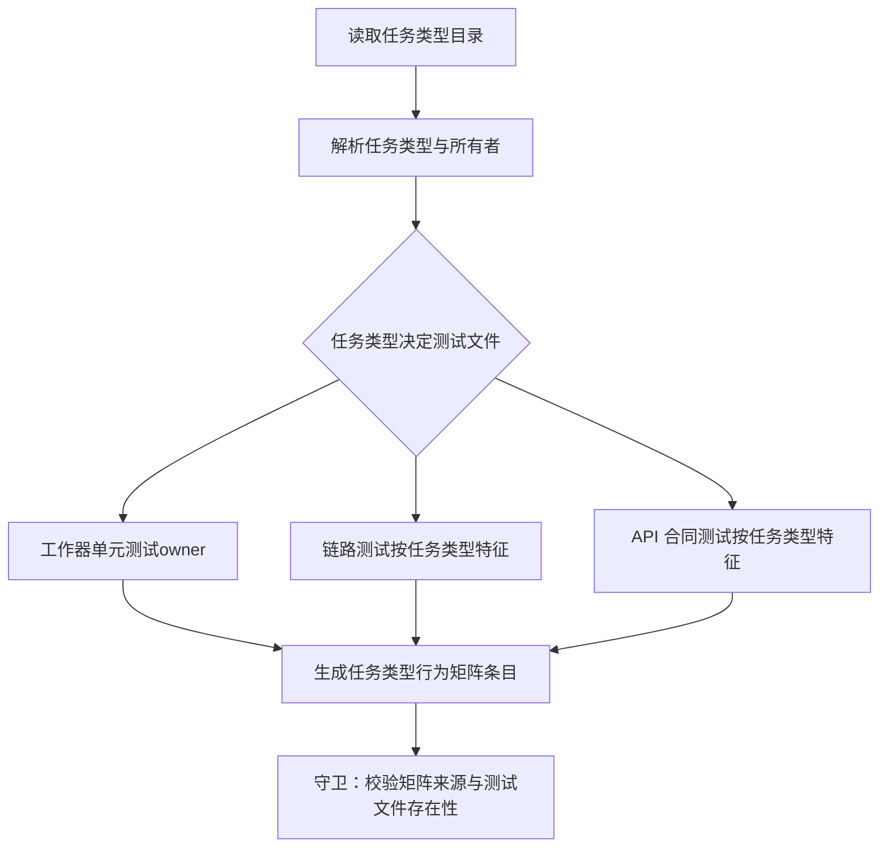
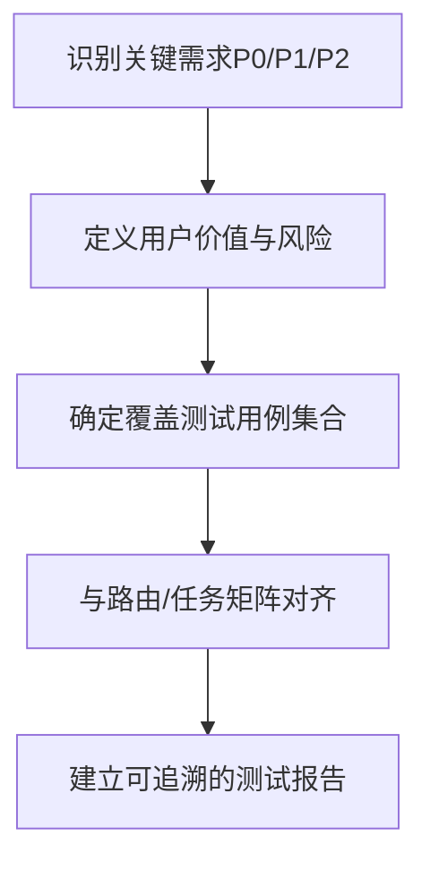
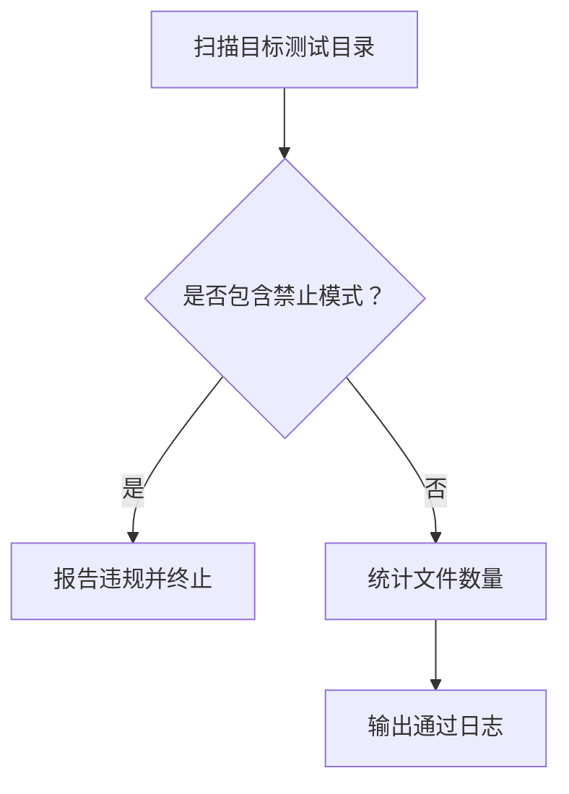
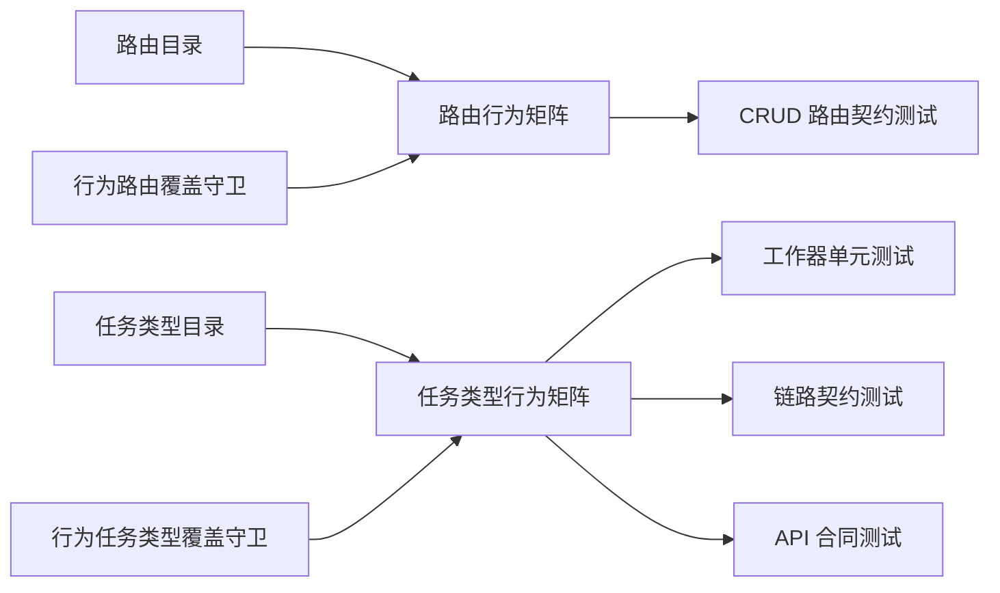

# 行为测试

<cite>
**本文引用的文件**
- [行为测试标准](file://tests/contracts/behavior-test-standard.md)
- [需求矩阵](file://tests/contracts/requirements-matrix.ts)
- [路由行为矩阵](file://tests/contracts/route-behavior-matrix.ts)
- [任务类型行为矩阵](file://tests/contracts/tasktype-behavior-matrix.ts)
- [路由目录](file://tests/contracts/route-catalog.ts)
- [任务类型目录](file://tests/contracts/task-type-catalog.ts)
- [测试行为质量守卫](file://scripts/guards/test-behavior-quality-guard.mjs)
- [测试路由覆盖守卫](file://scripts/guards/test-route-coverage-guard.mjs)
- [测试任务类型覆盖守卫](file://scripts/guards/test-tasktype-coverage-guard.mjs)
- [测试路由覆盖守卫（行为）](file://scripts/guards/test-behavior-route-coverage-guard.mjs)
- [测试任务类型覆盖守卫（行为）](file://scripts/guards/test-behavior-tasktype-coverage-guard.mjs)
- [CRUD 路由契约测试](file://tests/integration/api/contract/crud-routes.test.ts)
- [图像链路契约测试](file://tests/integration/chain/image.chain.test.ts)
- [图像任务处理器核心单元测试](file://tests/unit/worker/image-task-handlers-core.test.ts)
- [系统级图像生成测试](file://tests/system/generate-image.system.test.ts)
</cite>

## 目录
1. [简介](#简介)
2. [项目结构](#项目结构)
3. [核心组件](#核心组件)
4. [架构总览](#架构总览)
5. [详细组件分析](#详细组件分析)
6. [依赖关系分析](#依赖关系分析)
7. [性能考量](#性能考量)
8. [故障排查指南](#故障排查指南)
9. [结论](#结论)
10. [附录](#附录)

## 简介
本文件面向 Waoowaoo 的行为测试体系，系统化阐述行为测试矩阵的设计原理与实施方法，涵盖路由行为矩阵、任务类型行为矩阵与需求矩阵的构建策略；明确测试契约的定义、验证规则与变更管理流程；给出行为测试的标准模板、用例设计与覆盖率评估方法；说明测试守卫机制、代码质量检查与测试自动化集成方式；并提供行为测试的维护策略、版本管理与持续改进方案。

## 项目结构
行为测试相关的核心资产分布于以下位置：
- 合约与矩阵：tests/contracts 下包含需求矩阵、路由/任务类型目录与行为矩阵，以及行为测试标准
- 测试实现：tests/integration、tests/unit、tests/system 中的行为契约与链路测试
- 质量守卫：scripts/guards 下的各类覆盖与质量守卫脚本，保障矩阵与测试文件的一致性与质量

图表来源
- [需求矩阵:1-160](file://tests/contracts/requirements-matrix.ts#L1-L160)
- [路由行为矩阵:1-52](file://tests/contracts/route-behavior-matrix.ts#L1-L52)
- [任务类型行为矩阵:1-106](file://tests/contracts/tasktype-behavior-matrix.ts#L1-L106)
- [路由目录:1-251](file://tests/contracts/route-catalog.ts#L1-L251)
- [任务类型目录:1-62](file://tests/contracts/task-type-catalog.ts#L1-L62)
- [CRUD 路由契约测试:1-470](file://tests/integration/api/contract/crud-routes.test.ts#L1-L470)
- [图像链路契约测试:1-183](file://tests/integration/chain/image.chain.test.ts#L1-L183)
- [图像任务处理器核心单元测试:1-211](file://tests/unit/worker/image-task-handlers-core.test.ts#L1-L211)
- [系统级图像生成测试:1-143](file://tests/system/generate-image.system.test.ts#L1-L143)
- [测试行为质量守卫:1-86](file://scripts/guards/test-behavior-quality-guard.mjs#L1-L86)
- [测试路由覆盖守卫:1-58](file://scripts/guards/test-route-coverage-guard.mjs#L1-L58)
- [测试任务类型覆盖守卫:1-47](file://scripts/guards/test-tasktype-coverage-guard.mjs#L1-L47)
- [测试路由覆盖守卫（行为）:1-55](file://scripts/guards/test-behavior-route-coverage-guard.mjs#L1-L55)
- [测试任务类型覆盖守卫（行为）:1-50](file://scripts/guards/test-behavior-tasktype-coverage-guard.mjs#L1-L50)

章节来源
- [行为测试标准:1-30](file://tests/contracts/behavior-test-standard.md#L1-L30)
- [路由目录:1-251](file://tests/contracts/route-catalog.ts#L1-L251)
- [任务类型目录:1-62](file://tests/contracts/task-type-catalog.ts#L1-L62)

## 核心组件
- 需求矩阵：以需求 ID、特性、用户价值、风险、优先级与关联测试用例为主线，确保每个关键业务需求都有可追溯的行为测试覆盖。
- 路由行为矩阵：基于路由目录，将每个路由映射到对应的 API 合同测试与链路测试，保证路由契约与端到端行为一致。
- 任务类型行为矩阵：将任务类型映射到工作器单元测试、链路测试与 API 合同测试，确保任务生命周期与执行路径稳定。
- 行为测试标准：定义行为测试的范围、必须具备的断言质量、禁止模式与回归规则，统一测试质量基线。
- 质量守卫：通过静态扫描与运行时校验，确保矩阵与测试文件的完整性、一致性与质量门槛。

章节来源
- [需求矩阵:1-160](file://tests/contracts/requirements-matrix.ts#L1-L160)
- [路由行为矩阵:1-52](file://tests/contracts/route-behavior-matrix.ts#L1-L52)
- [任务类型行为矩阵:1-106](file://tests/contracts/tasktype-behavior-matrix.ts#L1-L106)
- [行为测试标准:1-30](file://tests/contracts/behavior-test-standard.md#L1-L30)
- [测试行为质量守卫:1-86](file://scripts/guards/test-behavior-quality-guard.mjs#L1-L86)

## 架构总览
行为测试体系围绕“需求—路由/任务—测试矩阵—测试实现—质量守卫”的闭环展开，形成从高层需求到具体实现的全链路验证。

图表来源
- [需求矩阵:1-160](file://tests/contracts/requirements-matrix.ts#L1-L160)
- [路由行为矩阵:1-52](file://tests/contracts/route-behavior-matrix.ts#L1-L52)
- [任务类型行为矩阵:1-106](file://tests/contracts/tasktype-behavior-matrix.ts#L1-L106)
- [CRUD 路由契约测试:1-470](file://tests/integration/api/contract/crud-routes.test.ts#L1-L470)
- [图像链路契约测试:1-183](file://tests/integration/chain/image.chain.test.ts#L1-L183)
- [图像任务处理器核心单元测试:1-211](file://tests/unit/worker/image-task-handlers-core.test.ts#L1-L211)
- [系统级图像生成测试:1-143](file://tests/system/generate-image.system.test.ts#L1-L143)
- [测试路由覆盖守卫（行为）:1-55](file://scripts/guards/test-behavior-route-coverage-guard.mjs#L1-L55)
- [测试任务类型覆盖守卫（行为）:1-50](file://scripts/guards/test-behavior-tasktype-coverage-guard.mjs#L1-L50)
- [测试行为质量守卫:1-86](file://scripts/guards/test-behavior-quality-guard.mjs#L1-L86)

## 详细组件分析

### 路由行为矩阵
- 设计原理：以路由目录为基础，按路由类别与合同组自动派生行为矩阵条目；同时根据路由文件特征推导应绑定的链路测试文件，确保每条路由都有契约与链路双保险。
- 实施要点：
  - 合同组到测试文件的映射：不同合同组（如 LLM 观察、直提交等）绑定到不同的契约测试文件。
  - 链路测试选择：根据路由路径特征（如视频/语音/文本/图像）选择对应链路测试文件。
  - 变更管理：守卫脚本要求矩阵必须来源于目录映射，且引用的测试文件必须存在，防止遗漏或过期。

图表来源
- [路由行为矩阵:1-52](file://tests/contracts/route-behavior-matrix.ts#L1-L52)
- [路由目录:1-251](file://tests/contracts/route-catalog.ts#L1-L251)
- [测试路由覆盖守卫（行为）:1-55](file://scripts/guards/test-behavior-route-coverage-guard.mjs#L1-L55)

章节来源
- [路由行为矩阵:1-52](file://tests/contracts/route-behavior-matrix.ts#L1-L52)
- [路由目录:1-251](file://tests/contracts/route-catalog.ts#L1-L251)
- [测试路由覆盖守卫（行为）:1-55](file://scripts/guards/test-behavior-route-coverage-guard.mjs#L1-L55)

### 任务类型行为矩阵
- 设计原理：以任务类型目录为基础，将每个任务类型映射到工作器单元测试、链路测试与 API 合同测试，形成“三段式”验证闭环。
- 实施要点：
  - 工作器单元测试：验证任务处理逻辑与数据持久化。
  - 链路测试：验证任务入队、队列选择与作业元数据。
  - API 合同测试：验证任务提交接口与异步观察接口的契约稳定性。
  - 变更管理：守卫脚本要求矩阵必须来源于目录映射，且引用的测试文件必须存在。

图表来源
- [任务类型行为矩阵:1-106](file://tests/contracts/tasktype-behavior-matrix.ts#L1-L106)
- [任务类型目录:1-62](file://tests/contracts/task-type-catalog.ts#L1-L62)
- [测试任务类型覆盖守卫（行为）:1-50](file://scripts/guards/test-behavior-tasktype-coverage-guard.mjs#L1-L50)

章节来源
- [任务类型行为矩阵:1-106](file://tests/contracts/tasktype-behavior-matrix.ts#L1-L106)
- [任务类型目录:1-62](file://tests/contracts/task-type-catalog.ts#L1-L62)
- [测试任务类型覆盖守卫（行为）:1-50](file://scripts/guards/test-behavior-tasktype-coverage-guard.mjs#L1-L50)

### 需求矩阵
- 设计原理：以需求 ID 为主线，描述用户价值、风险与优先级，明确覆盖的测试用例集合，确保关键业务需求具备可追溯的行为测试。
- 实施要点：
  - 每个 P0 需求至少覆盖一条契约测试与一条链路/系统测试。
  - 回归规则：历史缺陷需映射到专用回归测试，避免修复不完整。

图表来源
- [需求矩阵:1-160](file://tests/contracts/requirements-matrix.ts#L1-L160)
- [行为测试标准:1-30](file://tests/contracts/behavior-test-standard.md#L1-L30)

章节来源
- [需求矩阵:1-160](file://tests/contracts/requirements-matrix.ts#L1-L160)
- [行为测试标准:1-30](file://tests/contracts/behavior-test-standard.md#L1-L30)

### 测试契约与验证规则
- 必须具备：断言可观测结果（响应体/状态码、持久化字段、队列作业体）；每个关键业务分支至少一个具体值断言；每个关键路由/处理器至少一个失败分支断言。
- 禁止模式：源码文本契约断言、仅使用弱调用断言（如 toHaveBeenCalled）作为主证明。
- 最低断言质量：优先使用 toHaveBeenCalledWith 与 objectContaining 断言关键业务字段；异步任务链路断言队列选择与作业元数据（jobId、priority、type）。
- 回归规则：历史缺陷映射到专用回归测试；协议变更需新增或更新本地假提供程序场景。

章节来源
- [行为测试标准:1-30](file://tests/contracts/behavior-test-standard.md#L1-L30)

### 测试守卫机制
- 行为质量守卫：扫描目标目录下的测试文件，禁止读取源码文本、禁止结构化字符串断言、禁止仅有 toHaveBeenCalled 的弱断言。
- 路由覆盖守卫：对比实际路由与目录中的路由列表，确保无遗漏与过期条目。
- 任务类型覆盖守卫：对比任务类型枚举与目录中的键，确保无遗漏与过期键。
- 行为覆盖守卫：确保行为矩阵必须来源于目录映射，且引用的测试文件必须存在。

图表来源
- [测试行为质量守卫:1-86](file://scripts/guards/test-behavior-quality-guard.mjs#L1-L86)
- [测试路由覆盖守卫:1-58](file://scripts/guards/test-route-coverage-guard.mjs#L1-L58)
- [测试任务类型覆盖守卫:1-47](file://scripts/guards/test-tasktype-coverage-guard.mjs#L1-L47)
- [测试路由覆盖守卫（行为）:1-55](file://scripts/guards/test-behavior-route-coverage-guard.mjs#L1-L55)
- [测试任务类型覆盖守卫（行为）:1-50](file://scripts/guards/test-behavior-tasktype-coverage-guard.mjs#L1-L50)

章节来源
- [测试行为质量守卫:1-86](file://scripts/guards/test-behavior-quality-guard.mjs#L1-L86)
- [测试路由覆盖守卫:1-58](file://scripts/guards/test-route-coverage-guard.mjs#L1-L58)
- [测试任务类型覆盖守卫:1-47](file://scripts/guards/test-tasktype-coverage-guard.mjs#L1-L47)
- [测试路由覆盖守卫（行为）:1-55](file://scripts/guards/test-behavior-route-coverage-guard.mjs#L1-L55)
- [测试任务类型覆盖守卫（行为）:1-50](file://scripts/guards/test-behavior-tasktype-coverage-guard.mjs#L1-L50)

### 标准模板与用例设计
- 路由契约测试模板（以 CRUD 路由为例）：
  - 认证门禁：未认证请求拒绝（4xx），不出现 5xx。
  - 关键字段断言：PATCH/PUT 等写操作断言 Prisma 更新参数的关键字段。
  - 权限控制：非拥有者访问应被拒绝。
- 链路测试模板（以图像链路为例）：
  - 入队断言：任务入队到指定队列，jobId 与 taskId 对齐，优先级合理。
  - 消费与持久化：工作器消费作业并正确持久化结果。
- 系统测试模板（以图像生成为例）：
  - 端到端验证：路由 -> 队列 -> 工作器 -> 数据库 -> 事件流转。
  - 失败路径：致命错误路径下，现有数据保持不变，错误信息可追溯。

章节来源
- [CRUD 路由契约测试:1-470](file://tests/integration/api/contract/crud-routes.test.ts#L1-L470)
- [图像链路契约测试:1-183](file://tests/integration/chain/image.chain.test.ts#L1-L183)
- [系统级图像生成测试:1-143](file://tests/system/generate-image.system.test.ts#L1-L143)

### 覆盖率评估方法
- 路由覆盖率：基于路由目录与行为矩阵，统计已覆盖路由数与测试文件数，守卫脚本输出“routes/tests”计数。
- 任务类型覆盖率：基于任务类型目录与行为矩阵，统计已覆盖任务类型数与测试文件数，守卫脚本输出“taskTypes/tests”计数。
- 需求覆盖率：基于需求矩阵，统计每个需求的测试用例集合，结合路由/任务矩阵进行交叉核对。

章节来源
- [测试路由覆盖守卫（行为）:1-55](file://scripts/guards/test-behavior-route-coverage-guard.mjs#L1-L55)
- [测试任务类型覆盖守卫（行为）:1-50](file://scripts/guards/test-behavior-tasktype-coverage-guard.mjs#L1-L50)
- [需求矩阵:1-160](file://tests/contracts/requirements-matrix.ts#L1-L160)

### 测试自动化集成
- 在 CI 中集成质量守卫与覆盖守卫，确保每次提交均通过断言质量与矩阵完整性检查。
- 将行为测试纳入常规测试套件，结合系统测试与回归测试，形成稳定的行为验证流水线。

## 依赖关系分析
- 路由行为矩阵依赖路由目录与合同组映射，同时依赖链路测试文件的存在性。
- 任务类型行为矩阵依赖任务类型目录与所有者映射，同时依赖工作器/链路/API 合同测试文件的存在性。
- 质量守卫依赖矩阵文件与测试文件的实际存在，防止“幽灵引用”。

图表来源
- [路由行为矩阵:1-52](file://tests/contracts/route-behavior-matrix.ts#L1-L52)
- [任务类型行为矩阵:1-106](file://tests/contracts/tasktype-behavior-matrix.ts#L1-L106)
- [路由目录:1-251](file://tests/contracts/route-catalog.ts#L1-L251)
- [任务类型目录:1-62](file://tests/contracts/task-type-catalog.ts#L1-L62)
- [测试路由覆盖守卫（行为）:1-55](file://scripts/guards/test-behavior-route-coverage-guard.mjs#L1-L55)
- [测试任务类型覆盖守卫（行为）:1-50](file://scripts/guards/test-behavior-tasktype-coverage-guard.mjs#L1-L50)

章节来源
- [路由行为矩阵:1-52](file://tests/contracts/route-behavior-matrix.ts#L1-L52)
- [任务类型行为矩阵:1-106](file://tests/contracts/tasktype-behavior-matrix.ts#L1-L106)
- [路由目录:1-251](file://tests/contracts/route-catalog.ts#L1-L251)
- [任务类型目录:1-62](file://tests/contracts/task-type-catalog.ts#L1-L62)
- [测试路由覆盖守卫（行为）:1-55](file://scripts/guards/test-behavior-route-coverage-guard.mjs#L1-L55)
- [测试任务类型覆盖守卫（行为）:1-50](file://scripts/guards/test-behavior-tasktype-coverage-guard.mjs#L1-L50)

## 性能考量
- 测试执行效率：通过守卫提前发现矩阵/测试文件问题，减少 CI 失败重试成本。
- 断言粒度：优先使用强断言与对象匹配，避免弱断言导致的误判与额外开销。
- 链路测试隔离：使用队列模拟与数据库桩，缩短端到端测试时间。

## 故障排查指南
- 断言质量违规：若出现“仅 toHaveBeenCalled 无 toHaveBeenCalledWith”或包含禁止字符串的断言，需调整为强断言并移除结构化字符串契约。
- 路由/任务矩阵缺失：若守卫提示“未找到路由/任务类型目录”或“引用了不存在的测试文件”，需同步更新目录与矩阵。
- 覆盖率不足：若守卫提示“routes/tests”或“taskTypes/tests”计数异常，需补充相应契约/链路/系统测试。

章节来源
- [测试行为质量守卫:1-86](file://scripts/guards/test-behavior-quality-guard.mjs#L1-L86)
- [测试路由覆盖守卫（行为）:1-55](file://scripts/guards/test-behavior-route-coverage-guard.mjs#L1-L55)
- [测试任务类型覆盖守卫（行为）:1-50](file://scripts/guards/test-behavior-tasktype-coverage-guard.mjs#L1-L50)

## 结论
Waoowaoo 的行为测试体系通过需求矩阵、路由/任务行为矩阵与行为测试标准，构建了从高层需求到底层实现的全链路验证框架；配合质量守卫与覆盖守卫，确保测试文件的完整性与断言质量；通过系统测试与回归测试，保障关键路径的稳定性与可追溯性。建议持续完善矩阵与测试文件，严格执行回归规则，推动行为测试的版本化与持续改进。

## 附录
- 示例测试文件路径（用于参考与对齐）：
  - [CRUD 路由契约测试:1-470](file://tests/integration/api/contract/crud-routes.test.ts#L1-L470)
  - [图像链路契约测试:1-183](file://tests/integration/chain/image.chain.test.ts#L1-L183)
  - [图像任务处理器核心单元测试:1-211](file://tests/unit/worker/image-task-handlers-core.test.ts#L1-L211)
  - [系统级图像生成测试:1-143](file://tests/system/generate-image.system.test.ts#L1-L143)