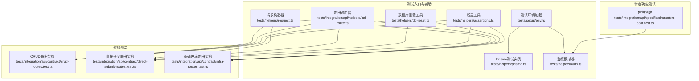
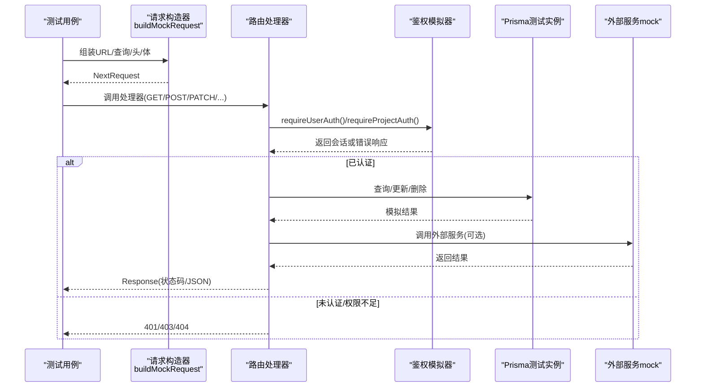
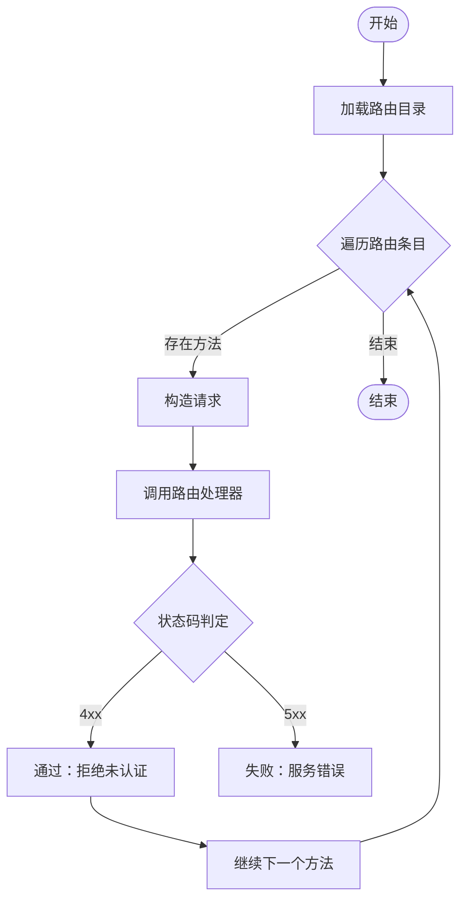
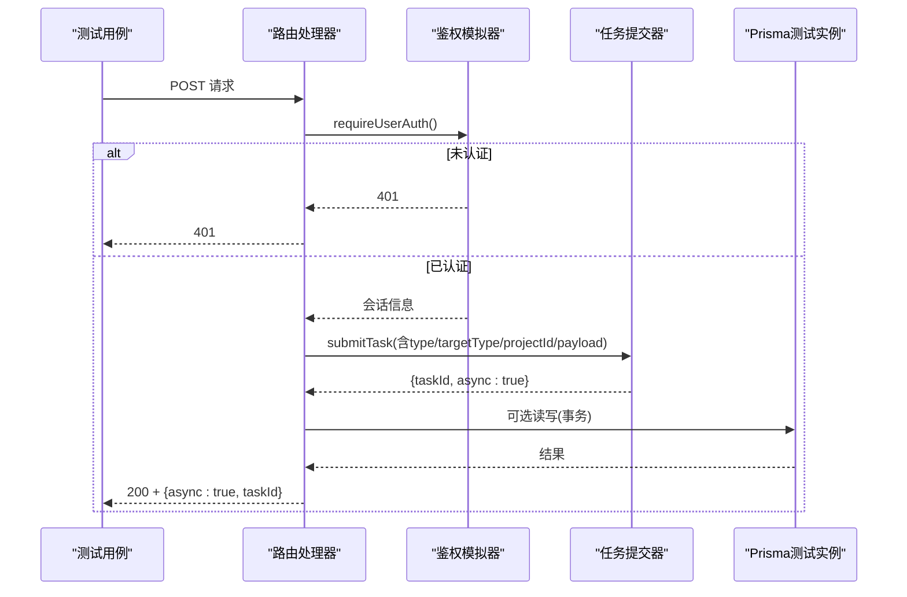
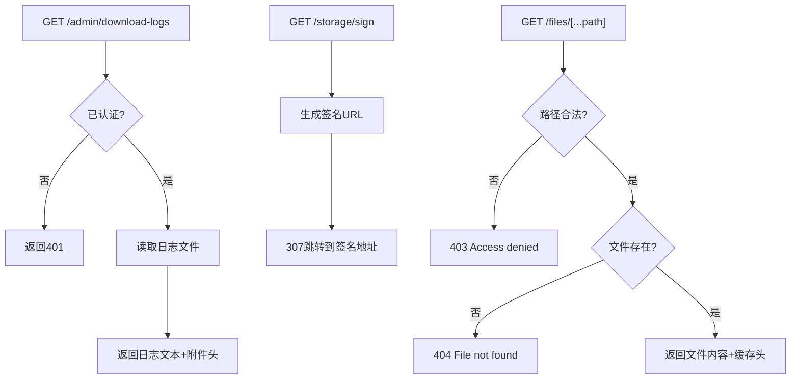
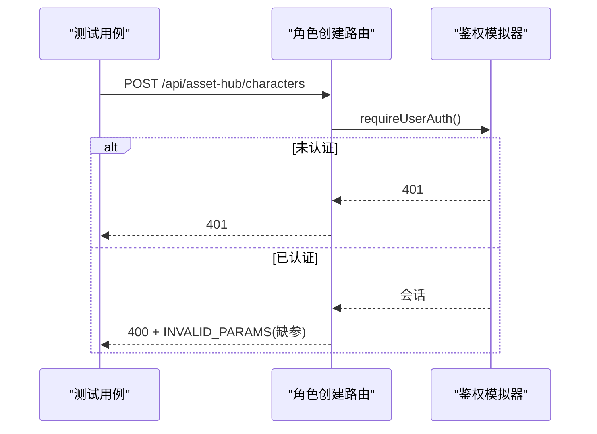
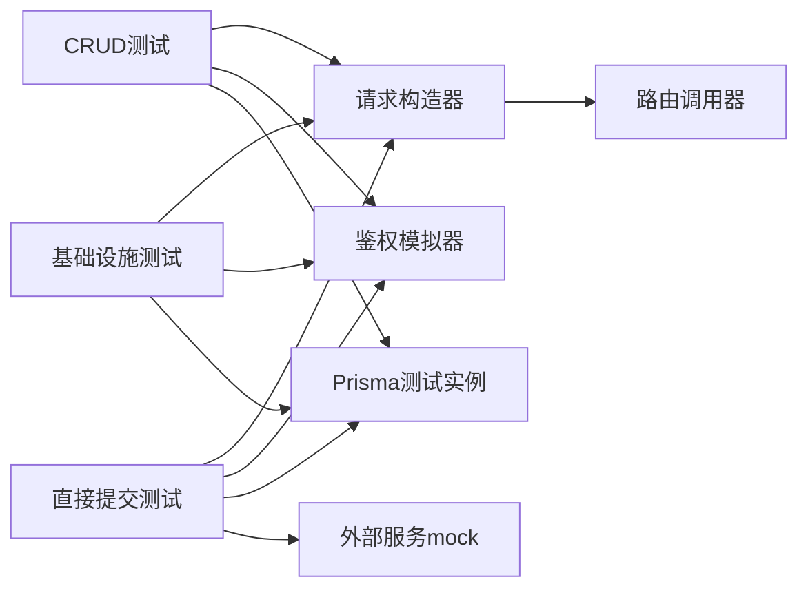

# API集成测试

<cite>
**本文引用的文件**
- [tests/integration/api/contract/crud-routes.test.ts](file://tests/integration/api/contract/crud-routes.test.ts)
- [tests/integration/api/contract/direct-submit-routes.test.ts](file://tests/integration/api/contract/direct-submit-routes.test.ts)
- [tests/integration/api/contract/infra-routes.test.ts](file://tests/integration/api/contract/infra-routes.test.ts)
- [tests/integration/api/helpers/call-route.ts](file://tests/integration/api/helpers/call-route.ts)
- [tests/helpers/request.ts](file://tests/helpers/request.ts)
- [tests/helpers/auth.ts](file://tests/helpers/auth.ts)
- [tests/helpers/db-reset.ts](file://tests/helpers/db-reset.ts)
- [tests/helpers/assertions.ts](file://tests/helpers/assertions.ts)
- [tests/setup/env.ts](file://tests/setup/env.ts)
- [tests/helpers/prisma.ts](file://tests/helpers/prisma.ts)
- [tests/integration/api/specific/characters-post.test.ts](file://tests/integration/api/specific/characters-post.test.ts)
</cite>

## 目录
1. [简介](#简介)
2. [项目结构](#项目结构)
3. [核心组件](#核心组件)
4. [架构总览](#架构总览)
5. [详细组件分析](#详细组件分析)
6. [依赖关系分析](#依赖关系分析)
7. [性能考量](#性能考量)
8. [故障排查指南](#故障排查指南)
9. [结论](#结论)
10. [附录](#附录)

## 简介
本文件面向Waoowaoo项目的API集成测试，系统化阐述RESTful API的集成测试策略与最佳实践，覆盖以下主题：
- CRUD路由测试：验证资源类API的增删改查行为与鉴权约束
- 直接提交路由测试：验证直接触发任务型API的行为契约（任务类型、目标对象、负载子集）
- 基础设施路由测试：验证日志下载、存储签名、系统引导ID、文件访问等基础设施接口
- API契约测试：请求/响应验证、状态码检查、数据完整性校验
- 特定功能API测试：角色创建、位置生成、面板变体等核心功能的测试用例设计
- 测试环境配置、数据库重置与第三方服务模拟策略
- 断言模式与性能基准测试方法

## 项目结构
测试体系围绕“契约测试”和“特定功能测试”两条主线组织，分别位于integration/api/contract与integration/api/specific目录下；通用辅助工具位于tests/helpers与tests/setup。

图表来源
- [tests/setup/env.ts:1-73](file://tests/setup/env.ts#L1-L73)
- [tests/helpers/prisma.ts:1-7](file://tests/helpers/prisma.ts#L1-L7)
- [tests/helpers/auth.ts:1-133](file://tests/helpers/auth.ts#L1-L133)
- [tests/helpers/request.ts:1-63](file://tests/helpers/request.ts#L1-L63)
- [tests/integration/api/helpers/call-route.ts:1-37](file://tests/integration/api/helpers/call-route.ts#L1-L37)
- [tests/helpers/db-reset.ts:1-61](file://tests/helpers/db-reset.ts#L1-L61)
- [tests/helpers/assertions.ts:1-24](file://tests/helpers/assertions.ts#L1-L24)
- [tests/integration/api/contract/crud-routes.test.ts:1-470](file://tests/integration/api/contract/crud-routes.test.ts#L1-L470)
- [tests/integration/api/contract/direct-submit-routes.test.ts:1-607](file://tests/integration/api/contract/direct-submit-routes.test.ts#L1-L607)
- [tests/integration/api/contract/infra-routes.test.ts:1-208](file://tests/integration/api/contract/infra-routes.test.ts#L1-L208)
- [tests/integration/api/specific/characters-post.test.ts:1-62](file://tests/integration/api/specific/characters-post.test.ts#L1-L62)

章节来源
- [tests/setup/env.ts:1-73](file://tests/setup/env.ts#L1-L73)
- [tests/helpers/prisma.ts:1-7](file://tests/helpers/prisma.ts#L1-L7)
- [tests/helpers/auth.ts:1-133](file://tests/helpers/auth.ts#L1-L133)
- [tests/helpers/request.ts:1-63](file://tests/helpers/request.ts#L1-L63)
- [tests/integration/api/helpers/call-route.ts:1-37](file://tests/integration/api/helpers/call-route.ts#L1-L37)
- [tests/helpers/db-reset.ts:1-61](file://tests/helpers/db-reset.ts#L1-L61)
- [tests/helpers/assertions.ts:1-24](file://tests/helpers/assertions.ts#L1-L24)
- [tests/integration/api/contract/crud-routes.test.ts:1-470](file://tests/integration/api/contract/crud-routes.test.ts#L1-L470)
- [tests/integration/api/contract/direct-submit-routes.test.ts:1-607](file://tests/integration/api/contract/direct-submit-routes.test.ts#L1-L607)
- [tests/integration/api/contract/infra-routes.test.ts:1-208](file://tests/integration/api/contract/infra-routes.test.ts#L1-L208)
- [tests/integration/api/specific/characters-post.test.ts:1-62](file://tests/integration/api/specific/characters-post.test.ts#L1-L62)

## 核心组件
- 鉴权模拟器：通过动态mock鉴权模块，控制用户认证与项目授权状态，确保路由在不同鉴权场景下的行为可测性。
- 请求构造器：统一构建NextRequest对象，支持路径参数、查询参数、请求头与JSON体，便于对路由进行端到端调用。
- 路由调用器：封装NextRequest与上下文参数，简化测试中对路由处理器的调用流程。
- 数据库重置工具：按业务域粒度清理测试数据，保证测试隔离与可重复性。
- 断言工具：提供余额、账单等业务断言，保障数据一致性与计费逻辑正确性。
- 测试环境：集中加载测试环境变量，限制网络访问，确保测试稳定与安全。

章节来源
- [tests/helpers/auth.ts:1-133](file://tests/helpers/auth.ts#L1-L133)
- [tests/helpers/request.ts:1-63](file://tests/helpers/request.ts#L1-L63)
- [tests/integration/api/helpers/call-route.ts:1-37](file://tests/integration/api/helpers/call-route.ts#L1-L37)
- [tests/helpers/db-reset.ts:1-61](file://tests/helpers/db-reset.ts#L1-L61)
- [tests/helpers/assertions.ts:1-24](file://tests/helpers/assertions.ts#L1-L24)
- [tests/setup/env.ts:1-73](file://tests/setup/env.ts#L1-L73)

## 架构总览
下图展示API集成测试的整体架构：测试用例通过请求构造器与路由调用器驱动Next.js路由处理器，同时借助鉴权模拟器、Prisma测试实例与第三方服务mock，完成对路由行为、任务提交与基础设施接口的验证。

图表来源
- [tests/helpers/request.ts:18-63](file://tests/helpers/request.ts#L18-L63)
- [tests/integration/api/helpers/call-route.ts:12-36](file://tests/integration/api/helpers/call-route.ts#L12-L36)
- [tests/helpers/auth.ts:71-98](file://tests/helpers/auth.ts#L71-L98)
- [tests/helpers/prisma.ts:1-7](file://tests/helpers/prisma.ts#L1-L7)

## 详细组件分析

### CRUD路由契约测试
该测试组聚焦于资产、资产库与小说推广相关CRUD路由，验证：
- 未认证请求一律拒绝（无2xx放行）
- PATCH/DELETE等写操作对资源归属进行校验
- POST/PUT/PATCH写入字段的规范化与持久化

图表来源
- [tests/integration/api/contract/crud-routes.test.ts:276-293](file://tests/integration/api/contract/crud-routes.test.ts#L276-L293)

章节来源
- [tests/integration/api/contract/crud-routes.test.ts:1-470](file://tests/integration/api/contract/crud-routes.test.ts#L1-L470)

### 直接提交路由契约测试
该测试组验证直接触发任务型API的行为契约，包括：
- 认证态：未认证时返回401且不提交任务
- 任务提交：认证后提交任务，断言任务类型、目标类型、项目ID与用户ID
- 负载子集：针对部分路由断言payload中的关键字段

图表来源
- [tests/integration/api/contract/direct-submit-routes.test.ts:567-605](file://tests/integration/api/contract/direct-submit-routes.test.ts#L567-L605)

章节来源
- [tests/integration/api/contract/direct-submit-routes.test.ts:1-607](file://tests/integration/api/contract/direct-submit-routes.test.ts#L1-L607)

### 基础设施路由契约测试
该测试组验证系统级API，包括：
- 日志下载：鉴权后返回日志内容与附件头
- 存储签名：重定向至签名URL并设置默认过期时间
- 文件访问：拒绝路径穿越、缺失文件返回404、本地上传目录内文件可读
- 系统引导ID：返回当前服务器启动ID

图表来源
- [tests/integration/api/contract/infra-routes.test.ts:83-207](file://tests/integration/api/contract/infra-routes.test.ts#L83-L207)

章节来源
- [tests/integration/api/contract/infra-routes.test.ts:1-208](file://tests/integration/api/contract/infra-routes.test.ts#L1-L208)

### 特定功能API测试：角色创建
该测试用例演示如何对特定API进行端到端验证：
- 未认证：返回401
- 缺少必填参数：返回400与INVALID_PARAMS错误码
- 参数完整：进入业务处理流程（具体行为取决于路由实现）

图表来源
- [tests/integration/api/specific/characters-post.test.ts:16-61](file://tests/integration/api/specific/characters-post.test.ts#L16-L61)

章节来源
- [tests/integration/api/specific/characters-post.test.ts:1-62](file://tests/integration/api/specific/characters-post.test.ts#L1-L62)

## 依赖关系分析
- 测试用例依赖请求构造器与路由调用器以驱动Next.js路由处理器
- 鉴权模拟器与Prisma测试实例通过hoisted与vi.mock注入，确保测试隔离
- 外部服务通过独立mock模块注入，避免真实网络与第三方依赖
- 数据库重置工具按业务域拆分，减少跨测试干扰

图表来源
- [tests/helpers/request.ts:18-63](file://tests/helpers/request.ts#L18-L63)
- [tests/integration/api/helpers/call-route.ts:12-36](file://tests/integration/api/helpers/call-route.ts#L12-L36)
- [tests/helpers/auth.ts:71-98](file://tests/helpers/auth.ts#L71-L98)
- [tests/helpers/prisma.ts:1-7](file://tests/helpers/prisma.ts#L1-L7)

章节来源
- [tests/helpers/request.ts:1-63](file://tests/helpers/request.ts#L1-L63)
- [tests/integration/api/helpers/call-route.ts:1-37](file://tests/integration/api/helpers/call-route.ts#L1-L37)
- [tests/helpers/auth.ts:1-133](file://tests/helpers/auth.ts#L1-L133)
- [tests/helpers/prisma.ts:1-7](file://tests/helpers/prisma.ts#L1-L7)

## 性能考量
- 使用mock替代真实外部服务，降低I/O与网络波动对测试稳定性的影响
- 通过事务mock与批量删除减少数据库写入开销
- 合理使用hoisted与vi.clearAllMocks，避免测试间状态污染
- 对高频路由采用参数化测试，提升覆盖率与执行效率

## 故障排查指南
- 鉴权问题
  - 症状：401/403频繁出现
  - 排查：确认鉴权模拟器安装顺序与状态重置
- 数据库异常
  - 症状：测试间数据串扰
  - 排查：使用对应域的重置函数，确保每个用例前/后清理
- 外部服务超时
  - 症状：任务提交或媒体处理超时
  - 排查：确认mock实现与返回值，必要时增加延迟控制
- 文件访问错误
  - 症状：路径穿越被拒绝或文件不存在
  - 排查：核对UPLOAD_DIR与相对路径拼接逻辑

章节来源
- [tests/helpers/auth.ts:126-133](file://tests/helpers/auth.ts#L126-L133)
- [tests/helpers/db-reset.ts:1-61](file://tests/helpers/db-reset.ts#L1-L61)
- [tests/integration/api/contract/infra-routes.test.ts:151-207](file://tests/integration/api/contract/infra-routes.test.ts#L151-L207)

## 结论
通过契约测试与特定功能测试相结合，Waoowaoo的API集成测试体系实现了对CRUD、任务提交与基础设施接口的全面覆盖。借助统一的请求构造、鉴权模拟与数据库重置机制，测试具备高稳定性与可维护性。建议持续扩展任务类型与业务域的契约用例，并引入性能基线监控以保障API在高并发场景下的可靠性。

## 附录
- 最佳实践
  - 将鉴权与业务逻辑分离，优先测试鉴权前置条件
  - 对任务型API断言任务类型、目标类型与关键payload字段
  - 使用参数化测试提升覆盖率，避免重复用例
  - 保持测试数据最小化与可预测性，配合重置工具
- 断言模式
  - 状态码断言：明确区分4xx/5xx与预期成功
  - 响应体断言：优先断言success/async/taskId等关键字段
  - 数据完整性断言：结合Prisma mock验证写入字段与事务一致性
- 性能基准测试
  - 在CI中固定并发与样本量，记录平均耗时与P95
  - 对关键路由（如任务提交）建立回归阈值，防止性能退化