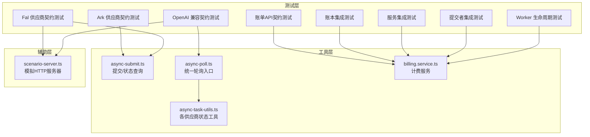
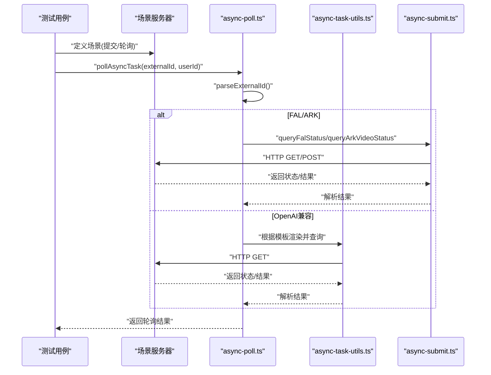
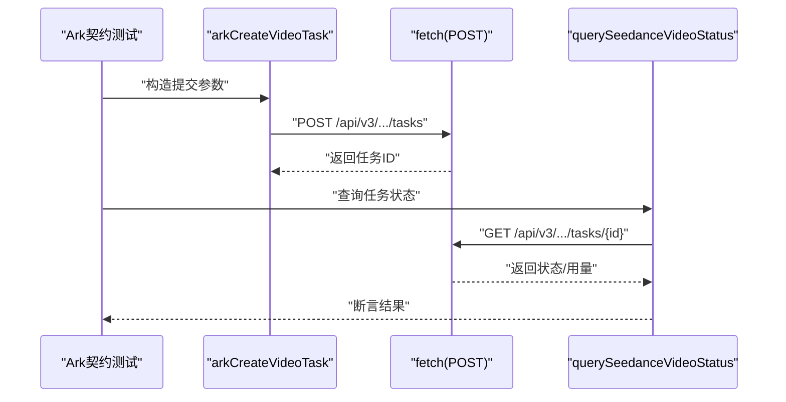
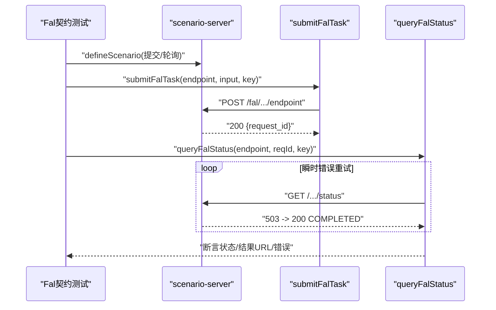
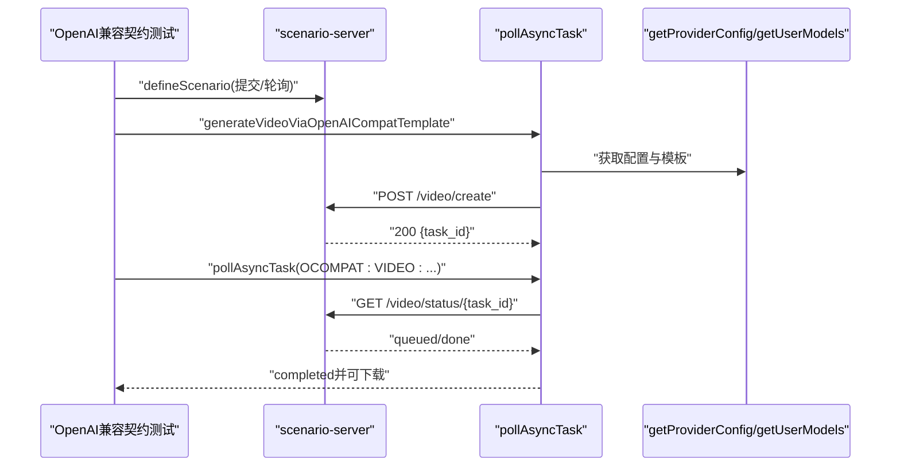
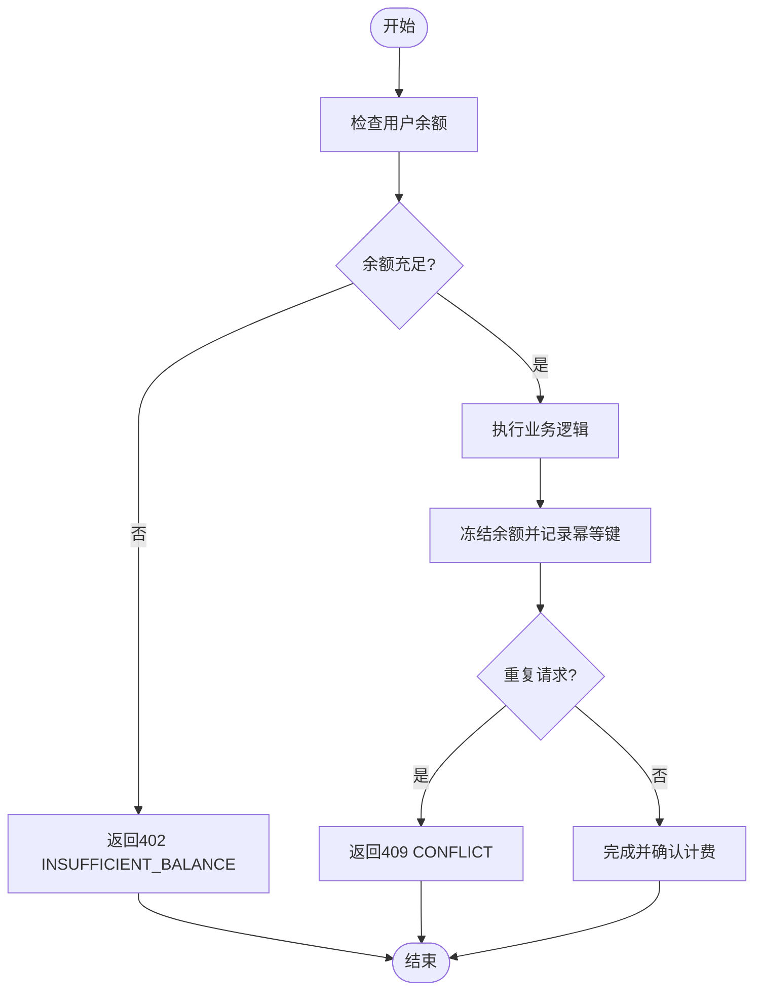
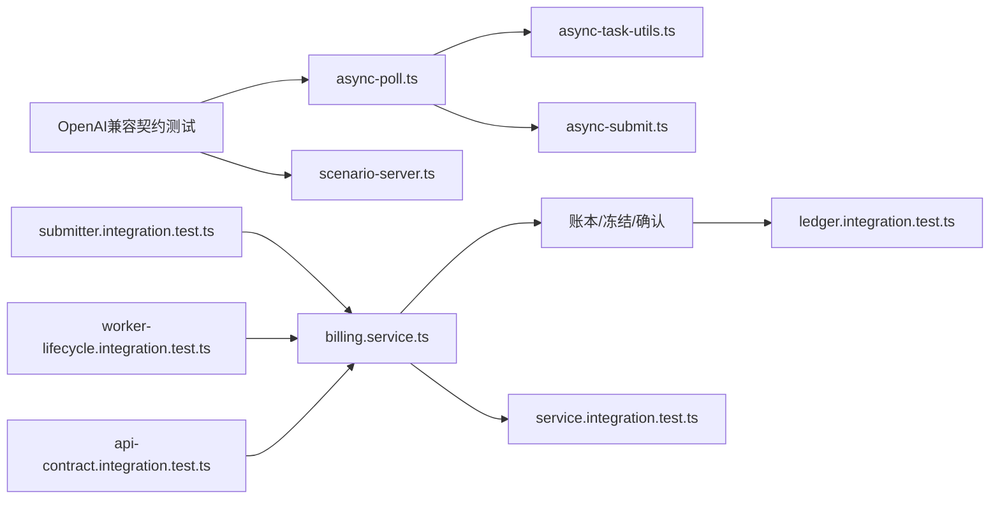

# 供应商集成测试

<cite>
**本文档引用的文件**
- [ark-provider.contract.test.ts](file://tests/integration/provider/ark-provider.contract.test.ts)
- [fal-provider.contract.test.ts](file://tests/integration/provider/fal-provider.contract.test.ts)
- [openai-compat-provider.contract.test.ts](file://tests/integration/provider/openai-compat-provider.contract.test.ts)
- [api-contract.integration.test.ts](file://tests/integration/billing/api-contract.integration.test.ts)
- [ledger.integration.test.ts](file://tests/integration/billing/ledger.integration.test.ts)
- [service.integration.test.ts](file://tests/integration/billing/service.integration.test.ts)
- [submitter.integration.test.ts](file://tests/integration/billing/submitter.integration.test.ts)
- [worker-lifecycle.integration.test.ts](file://tests/integration/billing/worker-lifecycle.integration.test.ts)
- [async-submit.ts](file://src/lib/async-submit.ts)
- [async-poll.ts](file://src/lib/async-poll.ts)
- [async-task-utils.ts](file://src/lib/async-task-utils.ts)
- [scenario-server.ts](file://tests/helpers/fakes/scenario-server.ts)
- [billing.service.ts](file://src/lib/billing/service.ts)
- [billing.index.ts](file://src/lib/billing/index.ts)
</cite>

## 目录
1. [简介](#简介)
2. [项目结构](#项目结构)
3. [核心组件](#核心组件)
4. [架构总览](#架构总览)
5. [详细组件分析](#详细组件分析)
6. [依赖关系分析](#依赖关系分析)
7. [性能考虑](#性能考虑)
8. [故障排查指南](#故障排查指南)
9. [结论](#结论)

## 简介
本文件面向Waoowaoo的供应商集成测试，系统化阐述以下测试策略与实现：
- AI服务供应商集成测试：Ark供应商、Fal供应商、OpenAI兼容供应商的契约测试方法
- 计费系统集成测试：账单API契约测试、账本测试、服务测试、提交者测试、Worker生命周期测试
- 供应商服务可用性测试、性能基准测试与故障转移测试的编写方法
- 供应商配置验证、API密钥测试与配额限制测试的实施策略
- 最佳实践、错误处理与监控方案

## 项目结构
围绕供应商集成测试，项目在以下层次组织：
- 测试层：tests/integration/provider 与 tests/integration/billing 下的契约与集成测试
- 工具层：src/lib 下的异步任务提交/轮询与计费服务
- 辅助层：tests/helpers/fakes/scenario-server.ts 提供可控制的模拟HTTP服务器

图表来源
- [ark-provider.contract.test.ts:1-106](file://tests/integration/provider/ark-provider.contract.test.ts#L1-L106)
- [fal-provider.contract.test.ts:1-155](file://tests/integration/provider/fal-provider.contract.test.ts#L1-L155)
- [openai-compat-provider.contract.test.ts:1-208](file://tests/integration/provider/openai-compat-provider.contract.test.ts#L1-L208)
- [api-contract.integration.test.ts:1-87](file://tests/integration/billing/api-contract.integration.test.ts#L1-L87)
- [ledger.integration.test.ts:1-184](file://tests/integration/billing/ledger.integration.test.ts#L1-L184)
- [service.integration.test.ts:1-138](file://tests/integration/billing/service.integration.test.ts#L1-L138)
- [submitter.integration.test.ts:1-327](file://tests/integration/billing/submitter.integration.test.ts#L1-L327)
- [worker-lifecycle.integration.test.ts:1-137](file://tests/integration/billing/worker-lifecycle.integration.test.ts#L1-L137)
- [async-submit.ts:1-336](file://src/lib/async-submit.ts#L1-L336)
- [async-poll.ts:1-800](file://src/lib/async-poll.ts#L1-L800)
- [async-task-utils.ts:1-448](file://src/lib/async-task-utils.ts#L1-L448)
- [scenario-server.ts:1-194](file://tests/helpers/fakes/scenario-server.ts#L1-L194)
- [billing.service.ts:1-800](file://src/lib/billing/service.ts#L1-L800)

章节来源
- [ark-provider.contract.test.ts:1-106](file://tests/integration/provider/ark-provider.contract.test.ts#L1-L106)
- [fal-provider.contract.test.ts:1-155](file://tests/integration/provider/fal-provider.contract.test.ts#L1-L155)
- [openai-compat-provider.contract.test.ts:1-208](file://tests/integration/provider/openai-compat-provider.contract.test.ts#L1-L208)
- [api-contract.integration.test.ts:1-87](file://tests/integration/billing/api-contract.integration.test.ts#L1-L87)
- [ledger.integration.test.ts:1-184](file://tests/integration/billing/ledger.integration.test.ts#L1-L184)
- [service.integration.test.ts:1-138](file://tests/integration/billing/service.integration.test.ts#L1-L138)
- [submitter.integration.test.ts:1-327](file://tests/integration/billing/submitter.integration.test.ts#L1-L327)
- [worker-lifecycle.integration.test.ts:1-137](file://tests/integration/billing/worker-lifecycle.integration.test.ts#L1-L137)
- [async-submit.ts:1-336](file://src/lib/async-submit.ts#L1-L336)
- [async-poll.ts:1-800](file://src/lib/async-poll.ts#L1-L800)
- [async-task-utils.ts:1-448](file://src/lib/async-task-utils.ts#L1-L448)
- [scenario-server.ts:1-194](file://tests/helpers/fakes/scenario-server.ts#L1-L194)
- [billing.service.ts:1-800](file://src/lib/billing/service.ts#L1-L800)

## 核心组件
- 供应商异步任务工具
  - 提交与状态查询：async-submit.ts
  - 统一轮询入口与多供应商解析：async-poll.ts
  - 各供应商状态工具：async-task-utils.ts
- 计费服务
  - 计费服务主入口与模式控制：billing.service.ts
  - 计费导出聚合：billing.index.ts
- 测试辅助
  - 场景化HTTP服务器：scenario-server.ts

章节来源
- [async-submit.ts:1-336](file://src/lib/async-submit.ts#L1-L336)
- [async-poll.ts:1-800](file://src/lib/async-poll.ts#L1-L800)
- [async-task-utils.ts:1-448](file://src/lib/async-task-utils.ts#L1-L448)
- [billing.service.ts:1-800](file://src/lib/billing/service.ts#L1-L800)
- [billing.index.ts:1-20](file://src/lib/billing/index.ts#L1-L20)
- [scenario-server.ts:1-194](file://tests/helpers/fakes/scenario-server.ts#L1-L194)

## 架构总览
供应商集成测试采用“契约测试 + 场景化HTTP服务器 + 统一轮询”的架构：
- 契约测试验证请求/响应契约与错误处理
- 场景化HTTP服务器按预设序列返回不同状态，模拟真实网络行为
- 统一轮询模块根据外部ID解析供应商与任务类型，调用对应状态查询工具

图表来源
- [async-poll.ts:256-459](file://src/lib/async-poll.ts#L256-L459)
- [async-task-utils.ts:395-447](file://src/lib/async-task-utils.ts#L395-L447)
- [async-submit.ts:76-224](file://src/lib/async-submit.ts#L76-L224)
- [scenario-server.ts:140-173](file://tests/helpers/fakes/scenario-server.ts#L140-L173)

## 详细组件分析

### Ark供应商契约测试
- 测试目标
  - 提交Seedance视频任务的请求字段与鉴权头
  - 查询任务状态并读取用量字段
- 关键断言
  - 提交请求：URL、方法、头部Authorization、请求体字段
  - 状态查询：返回状态映射、视频URL、用量字段
- 实现要点
  - 使用全局fetch替换进行请求捕获与断言
  - 验证请求体字段覆盖文本、图像、视频、音频等多模态内容

图表来源
- [ark-provider.contract.test.ts:14-68](file://tests/integration/provider/ark-provider.contract.test.ts#L14-L68)
- [ark-provider.contract.test.ts:70-104](file://tests/integration/provider/ark-provider.contract.test.ts#L70-L104)
- [async-task-utils.ts:395-447](file://src/lib/async-task-utils.ts#L395-L447)

章节来源
- [ark-provider.contract.test.ts:1-106](file://tests/integration/provider/ark-provider.contract.test.ts#L1-L106)
- [async-task-utils.ts:395-447](file://src/lib/async-task-utils.ts#L395-L447)

### Fal供应商契约测试
- 测试目标
  - 提交FAL任务的鉴权头与JSON负载
  - 状态轮询对瞬时错误的重试与最终成功
  - 失败状态的显式标记与错误信息
  - 非法响应的显式失败
- 关键断言
  - 提交：Authorization头、请求体字段
  - 轮询：IN_PROGRESS/PENDING、COMPLETED、FAILED
  - 结果：resultUrl存在性与媒体URL提取
- 实现要点
  - 使用scenario-server定义场景序列，模拟503重试后成功、致命错误、畸形响应等
  - 断言错误信息与状态转换

图表来源
- [fal-provider.contract.test.ts:19-47](file://tests/integration/provider/fal-provider.contract.test.ts#L19-L47)
- [fal-provider.contract.test.ts:49-85](file://tests/integration/provider/fal-provider.contract.test.ts#L49-L85)
- [fal-provider.contract.test.ts:87-108](file://tests/integration/provider/fal-provider.contract.test.ts#L87-L108)
- [fal-provider.contract.test.ts:110-124](file://tests/integration/provider/fal-provider.contract.test.ts#L110-L124)
- [fal-provider.contract.test.ts:126-153](file://tests/integration/provider/fal-provider.contract.test.ts#L126-L153)
- [scenario-server.ts:140-173](file://tests/helpers/fakes/scenario-server.ts#L140-L173)
- [async-submit.ts:23-51](file://src/lib/async-submit.ts#L23-L51)
- [async-submit.ts:76-224](file://src/lib/async-submit.ts#L76-L224)

章节来源
- [fal-provider.contract.test.ts:1-155](file://tests/integration/provider/fal-provider.contract.test.ts#L1-L155)
- [scenario-server.ts:1-194](file://tests/helpers/fakes/scenario-server.ts#L1-L194)
- [async-submit.ts:1-336](file://src/lib/async-submit.ts#L1-L336)

### OpenAI兼容供应商契约测试
- 测试目标
  - 渲染模板并提交异步任务，返回外部ID
  - 轮询状态并在输出URL缺失时回落到内容端点
  - 对畸形响应的显式失败
- 关键断言
  - 提交：Authorization头、请求体模板渲染
  - 轮询：pending/completed/failed状态；fallback下载URL
  - 外部ID：OCOMPAT前缀与编码字段
- 实现要点
  - 使用scenario-server定义提交与轮询场景
  - 通过mock注入provider配置与用户模型

图表来源
- [openai-compat-provider.contract.test.ts:36-103](file://tests/integration/provider/openai-compat-provider.contract.test.ts#L36-L103)
- [openai-compat-provider.contract.test.ts:105-161](file://tests/integration/provider/openai-compat-provider.contract.test.ts#L105-L161)
- [openai-compat-provider.contract.test.ts:163-206](file://tests/integration/provider/openai-compat-provider.contract.test.ts#L163-L206)
- [async-poll.ts:346-459](file://src/lib/async-poll.ts#L346-L459)
- [scenario-server.ts:140-173](file://tests/helpers/fakes/scenario-server.ts#L140-L173)

章节来源
- [openai-compat-provider.contract.test.ts:1-208](file://tests/integration/provider/openai-compat-provider.contract.test.ts#L1-L208)
- [async-poll.ts:1-800](file://src/lib/async-poll.ts#L1-L800)
- [scenario-server.ts:1-194](file://tests/helpers/fakes/scenario-server.ts#L1-L194)

### 计费系统集成测试

#### 账单API契约测试
- 测试目标
  - 余额不足时返回402与错误码
  - 幂等请求去重，防止重复扣费
- 关键断言
  - 402响应与错误字段
  - 重复请求返回409与冲突提示
  - 冻结记录与账单统计一致性

图表来源
- [api-contract.integration.test.ts:16-44](file://tests/integration/billing/api-contract.integration.test.ts#L16-L44)
- [api-contract.integration.test.ts:46-85](file://tests/integration/billing/api-contract.integration.test.ts#L46-L85)

章节来源
- [api-contract.integration.test.ts:1-87](file://tests/integration/billing/api-contract.integration.test.ts#L1-L87)

#### 账本集成测试
- 测试目标
  - 余额冻结与回滚
  - 部分确认与退款差异
  - 幂等等价冻结复用
  - 影子使用记录不扣费
- 关键断言
  - 冻结金额与可用余额变化
  - 重复确认幂等性
  - 回滚后资金恢复
  - 影子使用交易数与余额不变

章节来源
- [ledger.integration.test.ts:1-184](file://tests/integration/billing/ledger.integration.test.ts#L1-L184)

#### 服务集成测试
- 测试目标
  - OFF/SHADOW/ENFORCE三种计费模式的行为
  - 语音任务的用量结算与回滚
- 关键断言
  - OFF模式跳过计费
  - SHADOW模式只记录审计不扣费
  - ENFORCE模式冻结与结算，回滚恢复余额

章节来源
- [service.integration.test.ts:1-138](file://tests/integration/billing/service.integration.test.ts#L1-L138)

#### 提交者集成测试
- 测试目标
  - 任务提交时的计费信息构建
  - 余额不足时任务失败
  - 队列失败时冻结回滚
  - 运行复用与去重
- 关键断言
  - 任务创建与计费信息
  - 失败状态与错误码
  - 冻结回滚与余额恢复
  - 复用现有运行与去重

章节来源
- [submitter.integration.test.ts:1-327](file://tests/integration/billing/submitter.integration.test.ts#L1-L327)

#### Worker生命周期集成测试
- 测试目标
  - 成功完成结算、失败回滚、可重试错误保持处理中
  - 取消路径的冻结回滚
- 关键断言
  - 成功：任务完成且计费结算
  - 失败：任务失败且冻结回滚
  - 可重试：任务保持处理中且冻结状态不变
  - 取消：冻结回滚且任务非失败

章节来源
- [worker-lifecycle.integration.test.ts:1-137](file://tests/integration/billing/worker-lifecycle.integration.test.ts#L1-L137)

## 依赖关系分析
- 供应商轮询依赖
  - async-poll.ts依赖async-task-utils.ts与async-submit.ts
  - OpenAI兼容路径依赖模板渲染与用户模型配置
- 计费服务依赖
  - billing.service.ts依赖账本ledger、成本计算、模式控制
  - 任务提交与Worker生命周期依赖计费服务

图表来源
- [async-poll.ts:1-800](file://src/lib/async-poll.ts#L1-L800)
- [async-task-utils.ts:1-448](file://src/lib/async-task-utils.ts#L1-L448)
- [async-submit.ts:1-336](file://src/lib/async-submit.ts#L1-L336)
- [openai-compat-provider.contract.test.ts:1-208](file://tests/integration/provider/openai-compat-provider.contract.test.ts#L1-L208)
- [scenario-server.ts:1-194](file://tests/helpers/fakes/scenario-server.ts#L1-L194)
- [billing.service.ts:1-800](file://src/lib/billing/service.ts#L1-L800)
- [submitter.integration.test.ts:1-327](file://tests/integration/billing/submitter.integration.test.ts#L1-L327)
- [worker-lifecycle.integration.test.ts:1-137](file://tests/integration/billing/worker-lifecycle.integration.test.ts#L1-L137)
- [api-contract.integration.test.ts:1-87](file://tests/integration/billing/api-contract.integration.test.ts#L1-L87)
- [ledger.integration.test.ts:1-184](file://tests/integration/billing/ledger.integration.test.ts#L1-L184)
- [service.integration.test.ts:1-138](file://tests/integration/billing/service.integration.test.ts#L1-L138)

## 性能考虑
- 轮询策略
  - 统一轮询模块按供应商与模板配置进行轮询，避免重复轮询逻辑
  - 对瞬时错误采用指数退避与最大重试次数控制
- 资源管理
  - 场景服务器按需启动与关闭，减少资源占用
  - 测试前后清理全局mock与环境变量，避免跨用例污染
- 计费性能
  - 冻结与确认采用幂等键，避免重复计费
  - 影子模式仅记录不扣费，降低生产风险

## 故障排查指南
- 供应商契约测试常见问题
  - 请求头缺失：检查Authorization与Content-Type
  - 请求体字段不匹配：核对模板渲染与字段映射
  - 状态解析失败：确认状态枚举与JSON路径
- 计费系统常见问题
  - 402余额不足：检查余额与计费计算
  - 409重复请求：检查幂等键与冻结记录
  - 冻结回滚：确认任务状态与错误类型
- 监控与日志
  - 使用日志上下文追踪请求ID
  - 对失败与重试场景记录详细错误信息

章节来源
- [async-submit.ts:1-336](file://src/lib/async-submit.ts#L1-L336)
- [async-poll.ts:1-800](file://src/lib/async-poll.ts#L1-L800)
- [async-task-utils.ts:1-448](file://src/lib/async-task-utils.ts#L1-L448)
- [billing.service.ts:1-800](file://src/lib/billing/service.ts#L1-L800)

## 结论
通过契约测试与场景化HTTP服务器，Waoowaoo实现了对Ark、Fal与OpenAI兼容供应商的稳定集成验证；结合账单API契约、账本、服务、提交者与Worker生命周期的全面测试，确保了计费系统的正确性与鲁棒性。建议在持续集成中引入可用性与性能基准测试，以进一步提升系统可靠性。