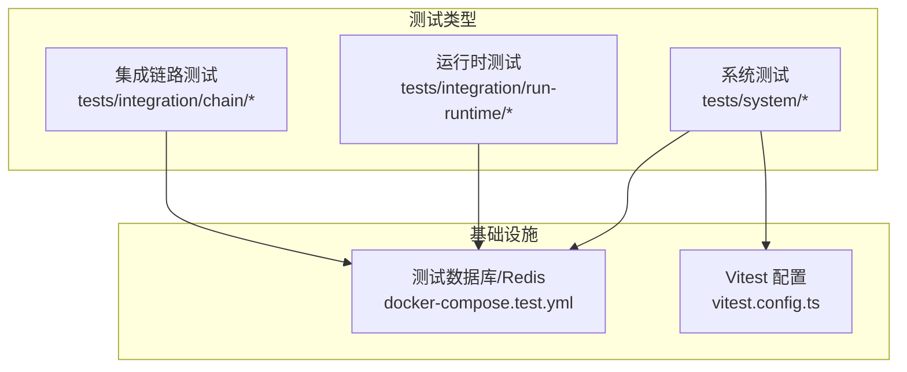
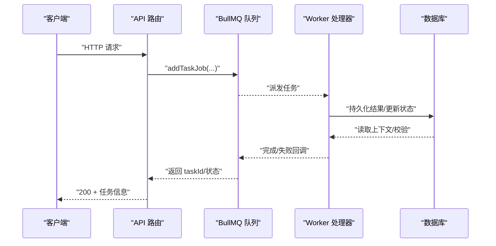
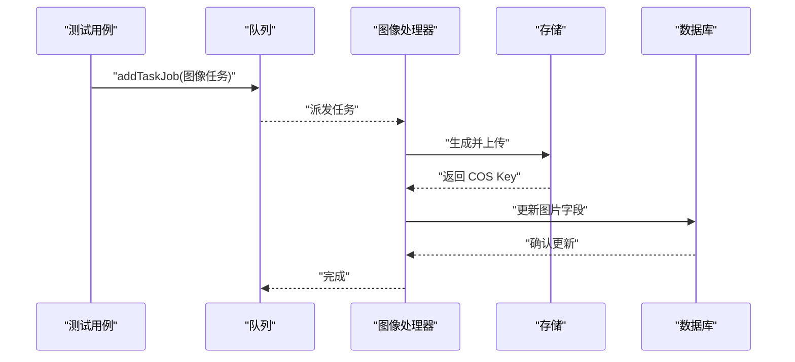
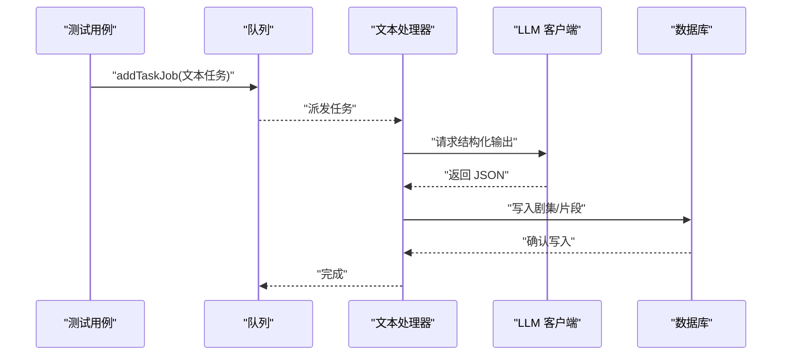
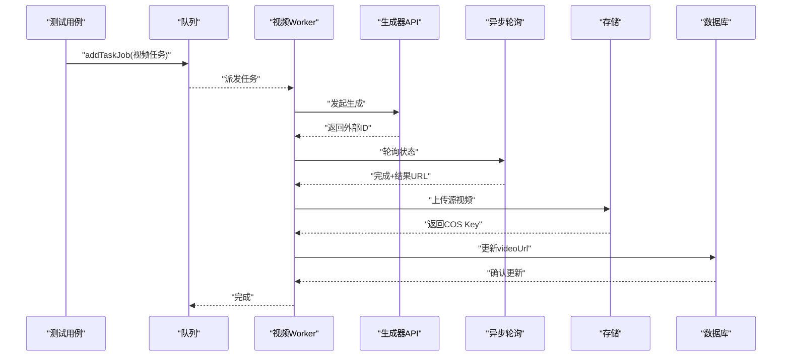
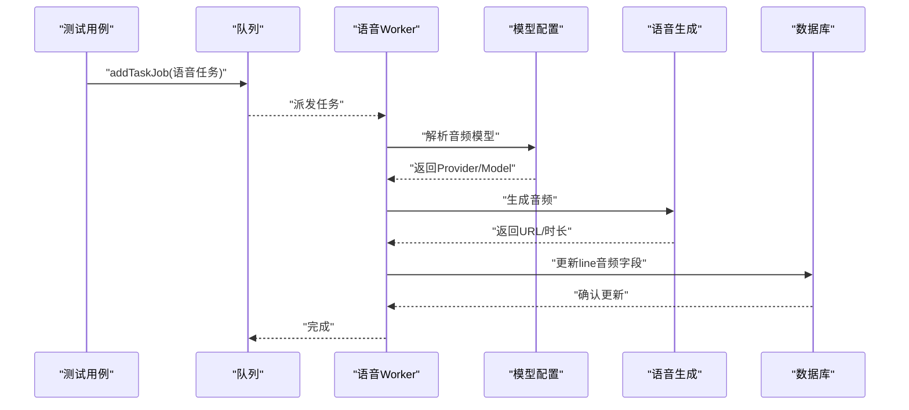
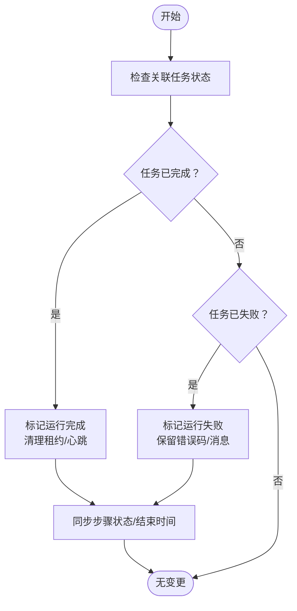
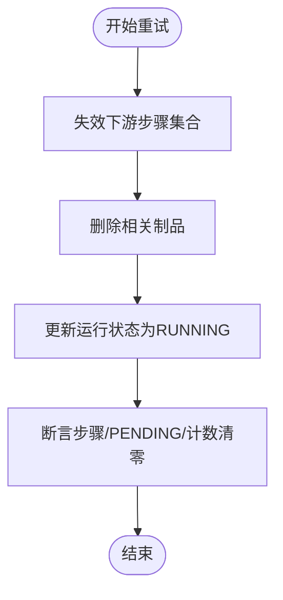
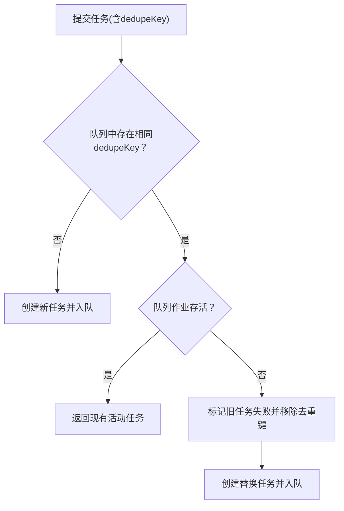
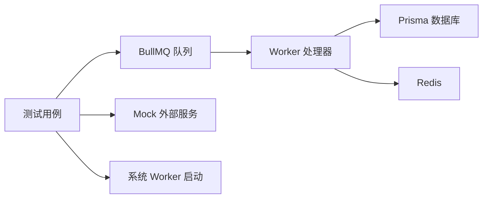

# 服务集成测试

<cite>
**本文引用的文件**
- [tests/integration/chain/image.chain.test.ts](file://tests/integration/chain/image.chain.test.ts)
- [tests/integration/chain/text.chain.test.ts](file://tests/integration/chain/text.chain.test.ts)
- [tests/integration/chain/video.chain.test.ts](file://tests/integration/chain/video.chain.test.ts)
- [tests/integration/chain/voice.chain.test.ts](file://tests/integration/chain/voice.chain.test.ts)
- [tests/integration/run-runtime/reconcile-active-runs.integration.test.ts](file://tests/integration/run-runtime/reconcile-active-runs.integration.test.ts)
- [tests/integration/run-runtime/retry-failed-step.integration.test.ts](file://tests/integration/run-runtime/retry-failed-step.integration.test.ts)
- [tests/integration/task/create-task-dedupe.integration.test.ts](file://tests/integration/task/create-task-dedupe.integration.test.ts)
- [tests/system/generate-image.system.test.ts](file://tests/system/generate-image.system.test.ts)
- [tests/system/generate-video.system.test.ts](file://tests/system/generate-video.system.test.ts)
- [tests/system/text-workflow.system.test.ts](file://tests/system/text-workflow.system.test.ts)
- [tests/system/voice-generate.system.test.ts](file://tests/system/voice-generate.system.test.ts)
- [tests/system/helpers/seed.ts](file://tests/system/helpers/seed.ts)
- [tests/system/helpers/tasks.ts](file://tests/system/helpers/tasks.ts)
- [tests/system/helpers/workers.ts](file://tests/system/helpers/workers.ts)
- [tests/helpers/db-reset.ts](file://tests/helpers/db-reset.ts)
- [tests/helpers/prisma.ts](file://tests/helpers/prisma.ts)
- [tests/helpers/auth.ts](file://tests/helpers/auth.ts)
- [docker-compose.test.yml](file://docker-compose.test.yml)
- [vitest.config.ts](file://vitest.config.ts)
</cite>

## 目录
1. [简介](#简介)
2. [项目结构](#项目结构)
3. [核心组件](#核心组件)
4. [架构总览](#架构总览)
5. [详细组件分析](#详细组件分析)
6. [依赖关系分析](#依赖关系分析)
7. [性能考量](#性能考量)
8. [故障排查指南](#故障排查指南)
9. [结论](#结论)
10. [附录](#附录)

## 简介
本文件面向 Waoowaoo 的服务集成测试，系统化梳理服务链路测试（图像生成、文本处理、视频合成、音频生成）的端到端策略；覆盖运行时服务测试（活动任务协调、失败步骤重试、任务去重）、服务间通信与异步任务处理、分布式系统集成；并给出测试环境搭建、Mock 配置与真实服务集成策略，以及设计模式、错误注入与性能监控方法。

## 项目结构
测试体系由三类测试组成：
- 集成链路测试：验证队列路由、处理器消费与数据持久化契约
- 运行时测试：验证运行状态与步骤级生命周期管理
- 系统测试：从 API 路由到队列、工作进程、数据库写入的全链路端到端验证

图表来源
- [docker-compose.test.yml:1-33](file://docker-compose.test.yml#L1-L33)
- [vitest.config.ts:15-45](file://vitest.config.ts#L15-L45)

章节来源
- [docker-compose.test.yml:1-33](file://docker-compose.test.yml#L1-L33)
- [vitest.config.ts:15-45](file://vitest.config.ts#L15-L45)

## 核心组件
- 队列与工作器：基于 BullMQ 的队列与 Worker，按链路类型分发任务（图像/文本/视频/语音）
- 任务服务：统一的任务提交入口，支持去重键与孤儿恢复
- 运行时服务：运行（Run）与步骤（Step）的生命周期协调、失败重试与失效传播
- 系统测试助手：种子数据、任务终端状态等待、工作器启动/关闭、鉴权 Mock

章节来源
- [tests/integration/chain/image.chain.test.ts:1-183](file://tests/integration/chain/image.chain.test.ts#L1-L183)
- [tests/integration/chain/text.chain.test.ts:1-209](file://tests/integration/chain/text.chain.test.ts#L1-L209)
- [tests/integration/chain/video.chain.test.ts:1-204](file://tests/integration/chain/video.chain.test.ts#L1-L204)
- [tests/integration/chain/voice.chain.test.ts:1-173](file://tests/integration/chain/voice.chain.test.ts#L1-L173)
- [tests/integration/run-runtime/reconcile-active-runs.integration.test.ts:1-196](file://tests/integration/run-runtime/reconcile-active-runs.integration.test.ts#L1-L196)
- [tests/integration/run-runtime/retry-failed-step.integration.test.ts:1-344](file://tests/integration/run-runtime/retry-failed-step.integration.test.ts#L1-L344)
- [tests/integration/task/create-task-dedupe.integration.test.ts:1-151](file://tests/integration/task/create-task-dedupe.integration.test.ts#L1-L151)
- [tests/system/generate-image.system.test.ts:1-143](file://tests/system/generate-image.system.test.ts#L1-L143)
- [tests/system/generate-video.system.test.ts:1-122](file://tests/system/generate-video.system.test.ts#L1-L122)
- [tests/system/text-workflow.system.test.ts:1-353](file://tests/system/text-workflow.system.test.ts#L1-L353)
- [tests/system/voice-generate.system.test.ts:1-109](file://tests/system/voice-generate.system.test.ts#L1-L109)
- [tests/system/helpers/seed.ts:1-185](file://tests/system/helpers/seed.ts#L1-L185)
- [tests/system/helpers/tasks.ts:1-54](file://tests/system/helpers/tasks.ts#L1-L54)
- [tests/system/helpers/workers.ts:1-41](file://tests/system/helpers/workers.ts#L1-L41)
- [tests/helpers/db-reset.ts:1-61](file://tests/helpers/db-reset.ts#L1-L61)
- [tests/helpers/prisma.ts:1-7](file://tests/helpers/prisma.ts#L1-L7)
- [tests/helpers/auth.ts:1-133](file://tests/helpers/auth.ts#L1-L133)

## 架构总览
下图展示系统测试从 API 到队列、工作器再到数据库的端到端流程，以及 Mock 注入点与断言位置。

图表来源
- [tests/system/generate-image.system.test.ts:58-99](file://tests/system/generate-image.system.test.ts#L58-L99)
- [tests/system/generate-video.system.test.ts:86-120](file://tests/system/generate-video.system.test.ts#L86-L120)
- [tests/system/text-workflow.system.test.ts:205-271](file://tests/system/text-workflow.system.test.ts#L205-L271)
- [tests/system/voice-generate.system.test.ts:71-107](file://tests/system/voice-generate.system.test.ts#L71-L107)

## 详细组件分析

### 图像生成链路测试
目标：验证任务进入图像队列、处理器消费、存储与数据库字段更新的契约。

- 关键断言
  - 任务被正确路由至图像队列，jobId 与 taskId 对齐
  - 修改资产图片任务同样路由至图像队列
  - 处理器消费后，目标实体的图片字段被持久化

- Mock 策略
  - BullMQ 队列拦截 add 调用，记录调用参数
  - Redis 作为队列后端（测试容器）
  - 图像生成共享模块返回固定 COS 路径
  - Prisma 模拟查询与更新

- 错误注入
  - 通过共享模块抛出致命错误，验证任务失败与原数据不变

图表来源
- [tests/integration/chain/image.chain.test.ts:88-181](file://tests/integration/chain/image.chain.test.ts#L88-L181)
- [tests/system/generate-image.system.test.ts:58-99](file://tests/system/generate-image.system.test.ts#L58-L99)

章节来源
- [tests/integration/chain/image.chain.test.ts:1-183](file://tests/integration/chain/image.chain.test.ts#L1-L183)
- [tests/system/generate-image.system.test.ts:1-143](file://tests/system/generate-image.system.test.ts#L1-L143)

### 文本处理链路测试
目标：验证文本队列路由、单次尝试策略、优先级保留与 LLM 解析边界识别。

- 关键断言
  - 任务进入文本队列，且 attempts 强制为 1（核心分析工作流）
  - 显式 priority 得到保留
  - 处理器解析文本标记边界，产出剧集片段

- Mock 策略
  - BullMQ 队列拦截 add
  - LLM 客户端返回结构化 JSON
  - 提示词构建与标记匹配工具 Mock

- 错误注入
  - 解析阶段抛错，验证任务失败与回滚

图表来源
- [tests/integration/chain/text.chain.test.ts:106-207](file://tests/integration/chain/text.chain.test.ts#L106-L207)
- [tests/system/text-workflow.system.test.ts:205-271](file://tests/system/text-workflow.system.test.ts#L205-L271)

章节来源
- [tests/integration/chain/text.chain.test.ts:1-209](file://tests/integration/chain/text.chain.test.ts#L1-L209)
- [tests/system/text-workflow.system.test.ts:1-353](file://tests/system/text-workflow.system.test.ts#L1-L353)

### 视频合成链路测试
目标：验证视频队列路由、Worker 启动、外部生成与轮询、存储上传与数据库更新。

- 关键断言
  - 任务进入视频队列
  - Worker 启动后可消费任务
  - 外部生成轮询完成后，视频 URL 写入数据库

- Mock 策略
  - 生成接口返回外部 ID
  - 轮询接口返回处理中/完成序列
  - 存储上传返回 COS Key

图表来源
- [tests/integration/chain/video.chain.test.ts:123-202](file://tests/integration/chain/video.chain.test.ts#L123-L202)
- [tests/system/generate-video.system.test.ts:86-120](file://tests/system/generate-video.system.test.ts#L86-L120)

章节来源
- [tests/integration/chain/video.chain.test.ts:1-204](file://tests/integration/chain/video.chain.test.ts#L1-L204)
- [tests/system/generate-video.system.test.ts:1-122](file://tests/system/generate-video.system.test.ts#L1-L122)

### 音频生成链路测试
目标：验证语音队列路由、Worker 启动、具体模型选择与音频持久化。

- 关键断言
  - 任务进入语音队列
  - Worker 启动后可消费任务
  - 具体音频模型参数透传，生成结果写入数据库

- Mock 策略
  - 模型选择解析返回指定 Provider/Model
  - 语音生成函数在写入数据库后返回结果

图表来源
- [tests/integration/chain/voice.chain.test.ts:89-171](file://tests/integration/chain/voice.chain.test.ts#L89-L171)
- [tests/system/voice-generate.system.test.ts:71-107](file://tests/system/voice-generate.system.test.ts#L71-L107)

章节来源
- [tests/integration/chain/voice.chain.test.ts:1-173](file://tests/integration/chain/voice.chain.test.ts#L1-L173)
- [tests/system/voice-generate.system.test.ts:1-109](file://tests/system/voice-generate.system.test.ts#L1-L109)

### 运行时服务测试：活动任务协调
目标：验证当关联任务已完成/失败时，运行（Run）状态与步骤（Step）状态的自动修正。

- 关键断言
  - 已完成任务：运行标记为 completed，步骤完成，结束时间同步
  - 已失败任务：运行标记为 failed，步骤失败，错误码/消息保留

图表来源
- [tests/integration/run-runtime/reconcile-active-runs.integration.test.ts:14-106](file://tests/integration/run-runtime/reconcile-active-runs.integration.test.ts#L14-L106)
- [tests/integration/run-runtime/reconcile-active-runs.integration.test.ts:108-194](file://tests/integration/run-runtime/reconcile-active-runs.integration.test.ts#L108-L194)

章节来源
- [tests/integration/run-runtime/reconcile-active-runs.integration.test.ts:1-196](file://tests/integration/run-runtime/reconcile-active-runs.integration.test.ts#L1-L196)

### 运行时服务测试：失败步骤重试与失效传播
目标：验证失败步骤重试时，下游依赖分支与相关制品的失效与重置。

- 关键断言
  - 重试后失败步骤进入 PENDING，重试次数递增
  - 下游依赖步骤（如剪辑、分镜、配音分析）全部失效并重置
  - 运行整体回到 RUNNING，移除错误信息

图表来源
- [tests/integration/run-runtime/retry-failed-step.integration.test.ts:13-174](file://tests/integration/run-runtime/retry-failed-step.integration.test.ts#L13-L174)
- [tests/integration/run-runtime/retry-failed-step.integration.test.ts:176-342](file://tests/integration/run-runtime/retry-failed-step.integration.test.ts#L176-L342)

章节来源
- [tests/integration/run-runtime/retry-failed-step.integration.test.ts:1-344](file://tests/integration/run-runtime/retry-failed-step.integration.test.ts#L1-L344)

### 任务去重与孤儿恢复
目标：验证去重键命中、队列作业存活与孤儿恢复策略。

- 关键断言
  - 去重键命中且队列作业存活：返回现有活动任务
  - 队列作业缺失：失败旧任务并创建替换任务
  - 无语言区域任务：失败并移除去重键，避免无限去重

图表来源
- [tests/integration/task/create-task-dedupe.integration.test.ts:21-59](file://tests/integration/task/create-task-dedupe.integration.test.ts#L21-L59)
- [tests/integration/task/create-task-dedupe.integration.test.ts:61-106](file://tests/integration/task/create-task-dedupe.integration.test.ts#L61-L106)
- [tests/integration/task/create-task-dedupe.integration.test.ts:108-149](file://tests/integration/task/create-task-dedupe.integration.test.ts#L108-L149)

章节来源
- [tests/integration/task/create-task-dedupe.integration.test.ts:1-151](file://tests/integration/task/create-task-dedupe.integration.test.ts#L1-L151)

## 依赖关系分析
- 测试依赖
  - BullMQ：队列与 Worker
  - Prisma：数据库访问与事务
  - Redis：队列后端
  - MySQL：测试数据库
  - Vitest：测试框架与配置

- Mock 与真实服务
  - 通过 hoisted vi.mock 注入，隔离外部依赖
  - 系统测试中使用真实 Worker 启动与数据库写入

图表来源
- [tests/integration/chain/image.chain.test.ts:43-76](file://tests/integration/chain/image.chain.test.ts#L43-L76)
- [tests/system/helpers/workers.ts:8-23](file://tests/system/helpers/workers.ts#L8-L23)
- [docker-compose.test.yml:21-32](file://docker-compose.test.yml#L21-L32)

章节来源
- [docker-compose.test.yml:1-33](file://docker-compose.test.yml#L1-L33)
- [tests/system/helpers/workers.ts:1-41](file://tests/system/helpers/workers.ts#L1-L41)

## 性能考量
- 并发与限流
  - 使用用户并发门控与工作器并发配置，避免资源争用
- 轮询与超时
  - 异步生成采用轮询，合理设置超时与重试间隔
- 数据一致性
  - 通过运行时协调与步骤失效传播，减少脏数据残留
- 测试执行
  - Vitest 配置了合理的超时与钩子超时，避免长时间阻塞

## 故障排查指南
- 任务未入队或未被消费
  - 检查队列名称常量与任务类型映射
  - 校验 Worker 是否已启动并 ready
- 任务状态异常
  - 使用任务事件列表断言生命周期事件顺序
  - 通过运行时协调测试定位运行/步骤状态不一致问题
- 外部服务失败
  - 通过 Mock 抛错模拟致命路径，验证失败回滚与原数据保护
- 数据库状态不一致
  - 使用系统测试中的种子数据与断言，快速定位写入问题

章节来源
- [tests/system/helpers/tasks.ts:17-54](file://tests/system/helpers/tasks.ts#L17-L54)
- [tests/system/generate-image.system.test.ts:101-141](file://tests/system/generate-image.system.test.ts#L101-L141)
- [tests/integration/run-runtime/reconcile-active-runs.integration.test.ts:68-106](file://tests/integration/run-runtime/reconcile-active-runs.integration.test.ts#L68-L106)

## 结论
本测试体系通过“集成链路 + 运行时 + 系统测试”的分层设计，覆盖了从任务路由、处理器消费到数据库写入的完整链路；结合 Mock 与真实 Worker 的混合策略，既能稳定复现问题，又能验证真实环境行为。建议在持续集成中优先运行系统测试，再补充关键集成链路与运行时测试，以保障服务稳定性与可维护性。

## 附录

### 测试环境搭建与配置
- 启动测试数据库与缓存
  - 使用 docker-compose 启动 MySQL 与 Redis
- 初始化测试环境
  - 通过测试辅助加载数据库连接与重置脚本
- 运行测试
  - 使用 Vitest 执行测试套件，系统测试会自动启动对应 Worker

章节来源
- [docker-compose.test.yml:1-33](file://docker-compose.test.yml#L1-L33)
- [tests/helpers/prisma.ts:1-7](file://tests/helpers/prisma.ts#L1-L7)
- [tests/helpers/db-reset.ts:47-61](file://tests/helpers/db-reset.ts#L47-L61)
- [vitest.config.ts:15-45](file://vitest.config.ts#L15-L45)

### 设计模式与最佳实践
- 队列契约测试：通过拦截 add 调用验证路由与选项
- Worker 生命周期：通过启动/关闭 Worker，验证处理与持久化
- Mock 注入：集中于 hoisted vi.mock，隔离外部依赖
- 断言策略：任务生命周期事件、运行/步骤状态、数据库最终一致性

章节来源
- [tests/integration/chain/image.chain.test.ts:43-76](file://tests/integration/chain/image.chain.test.ts#L43-L76)
- [tests/system/helpers/workers.ts:25-41](file://tests/system/helpers/workers.ts#L25-L41)
- [tests/system/helpers/tasks.ts:48-54](file://tests/system/helpers/tasks.ts#L48-L54)