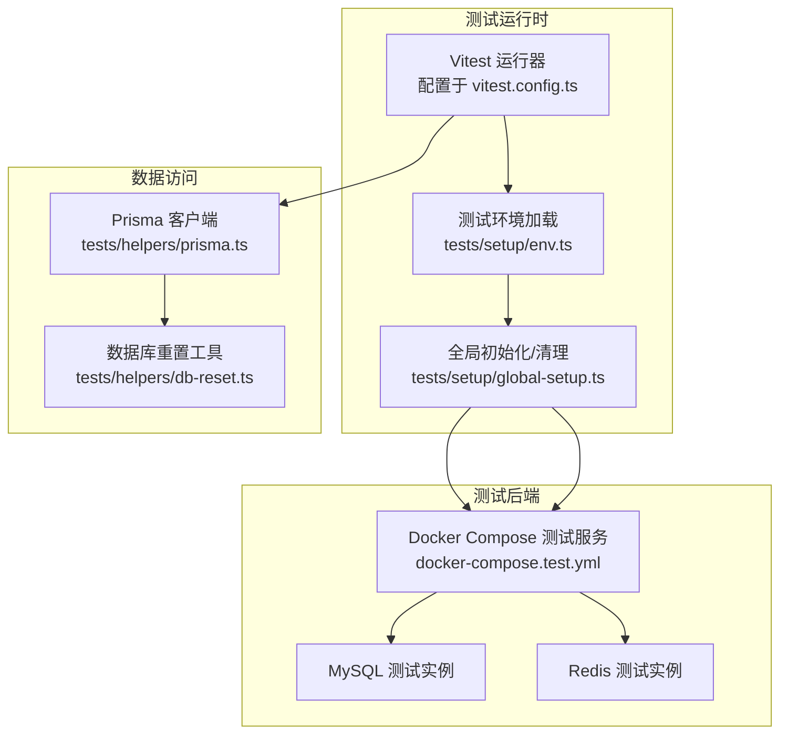
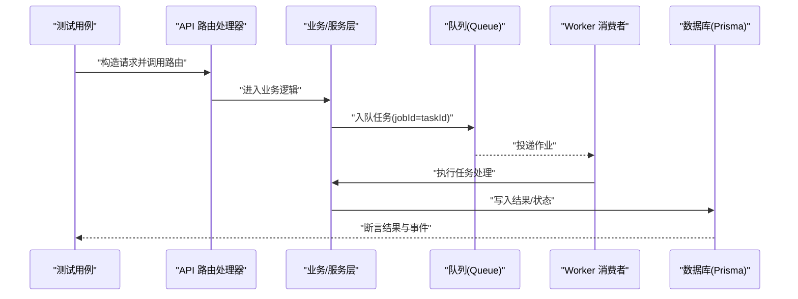
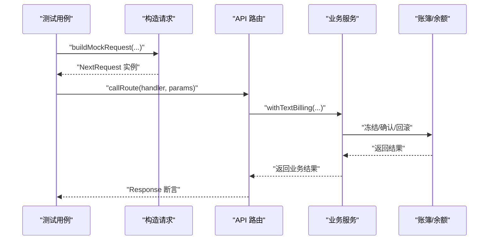
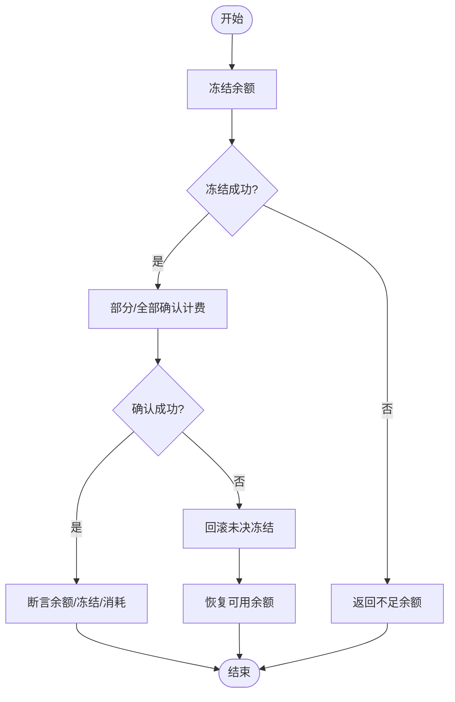
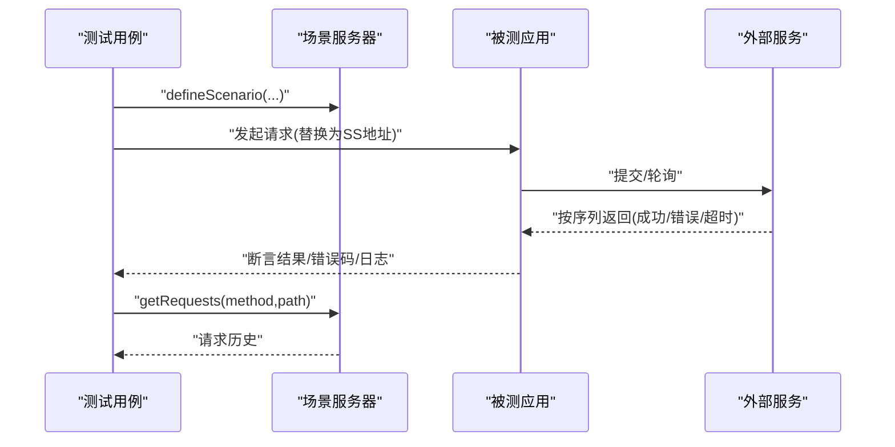
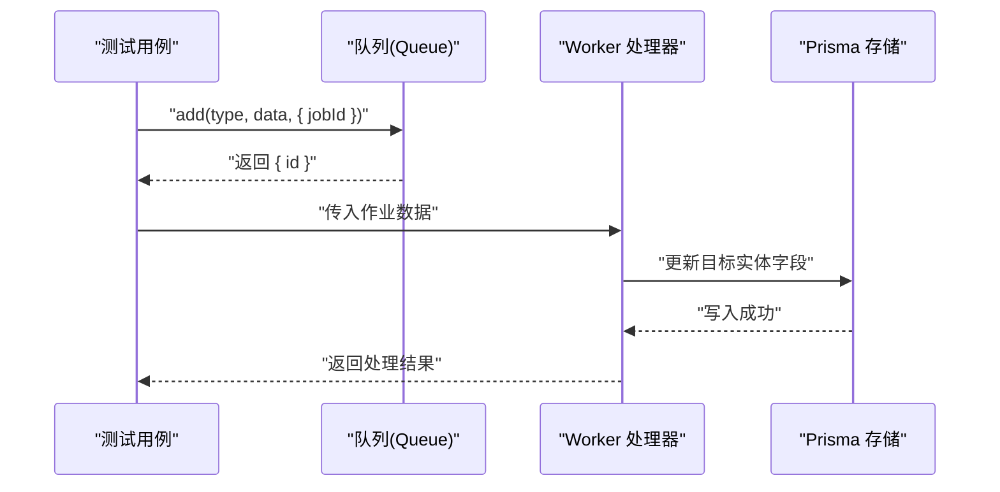
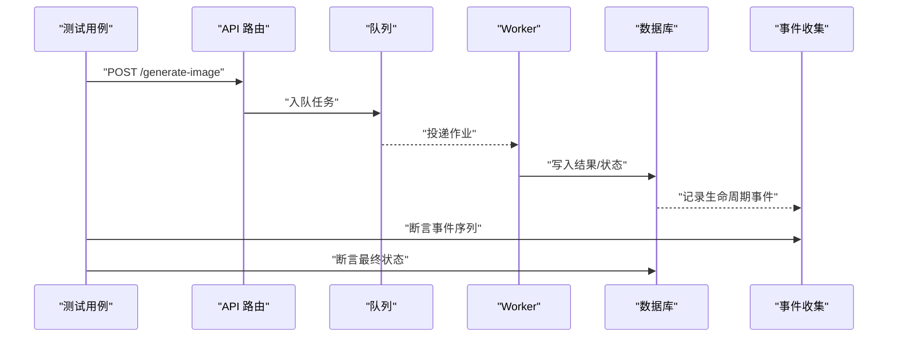
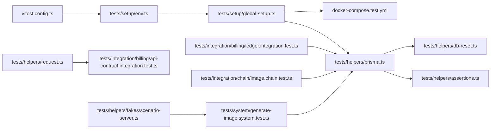

# 集成测试

<cite>
**本文引用的文件**
- [vitest.config.ts](file://vitest.config.ts)
- [docker-compose.test.yml](file://docker-compose.test.yml)
- [tests/setup/env.ts](file://tests/setup/env.ts)
- [tests/setup/global-setup.ts](file://tests/setup/global-setup.ts)
- [tests/helpers/prisma.ts](file://tests/helpers/prisma.ts)
- [tests/helpers/db-reset.ts](file://tests/helpers/db-reset.ts)
- [tests/helpers/assertions.ts](file://tests/helpers/assertions.ts)
- [tests/helpers/request.ts](file://tests/helpers/request.ts)
- [tests/helpers/fakes/scenario-server.ts](file://tests/helpers/fakes/scenario-server.ts)
- [tests/integration/billing/api-contract.integration.test.ts](file://tests/integration/billing/api-contract.integration.test.ts)
- [tests/integration/billing/ledger.integration.test.ts](file://tests/integration/billing/ledger.integration.test.ts)
- [tests/integration/chain/image.chain.test.ts](file://tests/integration/chain/image.chain.test.ts)
- [tests/system/generate-image.system.test.ts](file://tests/system/generate-image.system.test.ts)
</cite>

## 目录
1. [引言](#引言)
2. [项目结构](#项目结构)
3. [核心组件](#核心组件)
4. [架构总览](#架构总览)
5. [详细组件分析](#详细组件分析)
6. [依赖关系分析](#依赖关系分析)
7. [性能考量](#性能考量)
8. [故障排查指南](#故障排查指南)
9. [结论](#结论)
10. [附录](#附录)

## 引言
本文件面向Waoowaoo的集成测试体系，系统化阐述API集成测试、服务集成测试与外部系统集成测试的实施方法；覆盖测试环境配置、数据库连接与第三方服务模拟策略；介绍API契约测试、服务链路测试与跨模块交互测试的实现要点；说明测试数据管理、事务处理与错误场景模拟；给出设计模式、断言策略与性能基准测试建议，并提供测试隔离、并发与负载测试的实施方案。

## 项目结构
Waoowaoo采用Vitest作为测试运行器，通过Docker Compose启动MySQL与Redis作为测试后端依赖，使用Prisma进行数据库访问与迁移。测试代码按功能域分层组织：integration（集成）、system（端到端系统）、unit（单元）等。测试配置集中于vitest.config.ts，全局环境与依赖准备在tests/setup中完成。

图示来源
- [vitest.config.ts:15-44](file://vitest.config.ts#L15-L44)
- [tests/setup/env.ts:22-49](file://tests/setup/env.ts#L22-L49)
- [tests/setup/global-setup.ts:70-99](file://tests/setup/global-setup.ts#L70-L99)
- [docker-compose.test.yml:1-33](file://docker-compose.test.yml#L1-L33)
- [tests/helpers/prisma.ts:1-7](file://tests/helpers/prisma.ts#L1-L7)
- [tests/helpers/db-reset.ts:1-61](file://tests/helpers/db-reset.ts#L1-L61)

章节来源
- [vitest.config.ts:1-45](file://vitest.config.ts#L1-L45)
- [docker-compose.test.yml:1-33](file://docker-compose.test.yml#L1-L33)
- [tests/setup/env.ts:1-73](file://tests/setup/env.ts#L1-L73)
- [tests/setup/global-setup.ts:1-100](file://tests/setup/global-setup.ts#L1-L100)
- [tests/helpers/prisma.ts:1-7](file://tests/helpers/prisma.ts#L1-L7)
- [tests/helpers/db-reset.ts:1-61](file://tests/helpers/db-reset.ts#L1-L61)

## 核心组件
- 测试运行与环境
  - Vitest配置：设置环境、池类型、超时、覆盖率范围与阈值、别名与入口扫描。
  - 测试环境加载：从.env.test读取变量，注入默认值，限制网络访问以确保可重复性。
  - 全局初始化：按需拉起Docker服务，等待MySQL/Redis就绪，执行Prisma迁移，提供全局清理钩子。
- 数据与事务
  - Prisma封装：统一加载测试环境后导出客户端，避免污染。
  - 数据库重置：按业务域提供重置函数，保证测试间隔离。
  - 断言辅助：余额与账簿断言，确保资金模型正确性。
- 请求与路由调用
  - 构造NextRequest并调用路由处理器，便于对API层进行集成测试。
- 外部系统模拟
  - 场景服务器：支持成功、排队后成功、可重试错误后成功、致命错误、畸形响应、超时等多模式，用于模拟第三方服务行为。

章节来源
- [vitest.config.ts:15-44](file://vitest.config.ts#L15-L44)
- [tests/setup/env.ts:22-73](file://tests/setup/env.ts#L22-L73)
- [tests/setup/global-setup.ts:70-99](file://tests/setup/global-setup.ts#L70-L99)
- [tests/helpers/prisma.ts:1-7](file://tests/helpers/prisma.ts#L1-L7)
- [tests/helpers/db-reset.ts:1-61](file://tests/helpers/db-reset.ts#L1-L61)
- [tests/helpers/assertions.ts:1-24](file://tests/helpers/assertions.ts#L1-L24)
- [tests/helpers/request.ts:18-63](file://tests/helpers/request.ts#L18-L63)
- [tests/helpers/fakes/scenario-server.ts:84-194](file://tests/helpers/fakes/scenario-server.ts#L84-L194)

## 架构总览
下图展示典型集成测试的端到端流程：测试通过构造请求调用API路由，路由进入业务层并可能触发队列任务；系统测试可启动真实Worker消费队列，最终落库并产生生命周期事件；同时可结合场景服务器模拟外部依赖的行为与错误路径。

图示来源
- [tests/helpers/request.ts:43-63](file://tests/helpers/request.ts#L43-L63)
- [tests/integration/chain/image.chain.test.ts:88-130](file://tests/integration/chain/image.chain.test.ts#L88-L130)
- [tests/system/generate-image.system.test.ts:58-99](file://tests/system/generate-image.system.test.ts#L58-L99)

## 详细组件分析

### API集成测试
- 设计目标
  - 验证API层契约：请求头、幂等键、重复提交检测、错误码与消息一致性。
  - 验证路由到服务层的端到端路径：请求解析、鉴权、参数校验、业务调用、响应生成。
- 实施要点
  - 使用构造器构建NextRequest，调用路由处理器，断言状态码与JSON体字段。
  - 在需要时开启强制计费模式，验证余额冻结、确认与回滚等账簿行为。
- 示例参考
  - API契约与重复请求防护：[tests/integration/billing/api-contract.integration.test.ts:16-85](file://tests/integration/billing/api-contract.integration.test.ts#L16-L85)
  - 路由调用与断言：[tests/helpers/request.ts:43-63](file://tests/helpers/request.ts#L43-L63)

图示来源
- [tests/helpers/request.ts:18-63](file://tests/helpers/request.ts#L18-L63)
- [tests/integration/billing/api-contract.integration.test.ts:21-31](file://tests/integration/billing/api-contract.integration.test.ts#L21-L31)

章节来源
- [tests/helpers/request.ts:18-63](file://tests/helpers/request.ts#L18-L63)
- [tests/integration/billing/api-contract.integration.test.ts:10-87](file://tests/integration/billing/api-contract.integration.test.ts#L10-L87)

### 服务集成测试
- 设计目标
  - 验证服务层内部协作：冻结余额、确认计费、回滚未决冻结、影子用量记录。
  - 验证幂等性与重复调用的安全性：同一幂等键复用、重复确认仅一次生效。
- 实施要点
  - 通过Prisma直接查询余额与交易表，断言余额、冻结金额与总消耗。
  - 使用种子数据与重置工具，确保每次测试前后的数据库状态一致。
- 示例参考
  - 冻结/确认/回滚与幂等性：[tests/integration/billing/ledger.integration.test.ts:19-160](file://tests/integration/billing/ledger.integration.test.ts#L19-L160)
  - 余额断言与负数保护：[tests/helpers/assertions.ts:5-23](file://tests/helpers/assertions.ts#L5-L23)

图示来源
- [tests/integration/billing/ledger.integration.test.ts:19-160](file://tests/integration/billing/ledger.integration.test.ts#L19-L160)
- [tests/helpers/assertions.ts:5-23](file://tests/helpers/assertions.ts#L5-L23)

章节来源
- [tests/integration/billing/ledger.integration.test.ts:13-184](file://tests/integration/billing/ledger.integration.test.ts#L13-L184)
- [tests/helpers/assertions.ts:1-24](file://tests/helpers/assertions.ts#L1-L24)

### 外部系统集成测试
- 设计目标
  - 模拟第三方服务的多种行为：成功、排队后成功、可重试错误后成功、致命错误、畸形响应、超时。
  - 验证上游调用的重试、轮询与失败降级策略。
- 实施要点
  - 启动场景服务器，定义路由场景与响应序列，记录请求历史以便断言。
  - 在被测代码中替换对外HTTP调用，指向场景服务器地址。
- 示例参考
  - 场景服务器能力与使用：[tests/helpers/fakes/scenario-server.ts:84-194](file://tests/helpers/fakes/scenario-server.ts#L84-L194)

图示来源
- [tests/helpers/fakes/scenario-server.ts:140-173](file://tests/helpers/fakes/scenario-server.ts#L140-L173)
- [tests/helpers/fakes/scenario-server.ts:174-180](file://tests/helpers/fakes/scenario-server.ts#L174-L180)

章节来源
- [tests/helpers/fakes/scenario-server.ts:1-194](file://tests/helpers/fakes/scenario-server.ts#L1-L194)

### 服务链路测试
- 设计目标
  - 验证任务从路由入队到Worker处理的完整链路：队列名称、jobId与payload一致性、Worker持久化结果。
- 实施要点
  - 使用Mock替换队列与共享模块，捕获add调用与参数，断言队列名、jobId与优先级。
  - 将队列中的数据转交Worker处理函数，断言数据库更新与返回值。
- 示例参考
  - 图像任务链路与Worker断言：[tests/integration/chain/image.chain.test.ts:88-181](file://tests/integration/chain/image.chain.test.ts#L88-181)

图示来源
- [tests/integration/chain/image.chain.test.ts:88-130](file://tests/integration/chain/image.chain.test.ts#L88-L130)
- [tests/integration/chain/image.chain.test.ts:132-181](file://tests/integration/chain/image.chain.test.ts#L132-L181)

章节来源
- [tests/integration/chain/image.chain.test.ts:1-183](file://tests/integration/chain/image.chain.test.ts#L1-L183)

### 端到端系统测试
- 设计目标
  - 覆盖真实Worker消费、数据库写入与任务生命周期事件的完整闭环。
  - 支持错误场景：外部生成失败、保留原有图像不变、任务标记失败。
- 实施要点
  - 启动指定Worker组，调用API路由提交任务，等待终端状态，断言结果与事件序列。
  - 使用Mock替换生成逻辑，控制成功/失败分支，验证回滚语义。
- 示例参考
  - 图像生成系统测试与失败回退：[tests/system/generate-image.system.test.ts:58-141](file://tests/system/generate-image.system.test.ts#L58-141)

图示来源
- [tests/system/generate-image.system.test.ts:58-99](file://tests/system/generate-image.system.test.ts#L58-L99)
- [tests/system/generate-image.system.test.ts:101-141](file://tests/system/generate-image.system.test.ts#L101-L141)

章节来源
- [tests/system/generate-image.system.test.ts:1-143](file://tests/system/generate-image.system.test.ts#L1-L143)

## 依赖关系分析
- 组件耦合
  - 测试运行器与环境：Vitest配置驱动环境加载与全局初始化。
  - 数据访问：Prisma封装统一入口，db-reset按域清理，assertions提供余额断言。
  - 外部依赖：Docker Compose提供MySQL/Redis；场景服务器模拟第三方HTTP。
- 可能的循环依赖
  - 通过“helpers”与“setup”分层避免直接循环；Prisma仅在helpers中导出，不反向依赖测试。
- 外部依赖与集成点
  - MySQL/Redis健康检查与迁移；fetch网络限制确保测试可重复性。

图示来源
- [vitest.config.ts:15-44](file://vitest.config.ts#L15-L44)
- [tests/setup/env.ts:22-49](file://tests/setup/env.ts#L22-L49)
- [tests/setup/global-setup.ts:70-99](file://tests/setup/global-setup.ts#L70-L99)
- [docker-compose.test.yml:1-33](file://docker-compose.test.yml#L1-L33)
- [tests/helpers/prisma.ts:1-7](file://tests/helpers/prisma.ts#L1-L7)
- [tests/helpers/db-reset.ts:1-61](file://tests/helpers/db-reset.ts#L1-L61)
- [tests/helpers/assertions.ts:1-24](file://tests/helpers/assertions.ts#L1-L24)
- [tests/helpers/request.ts:18-63](file://tests/helpers/request.ts#L18-L63)
- [tests/integration/billing/api-contract.integration.test.ts:10-87](file://tests/integration/billing/api-contract.integration.test.ts#L10-L87)
- [tests/integration/billing/ledger.integration.test.ts:13-184](file://tests/integration/billing/ledger.integration.test.ts#L13-L184)
- [tests/integration/chain/image.chain.test.ts:1-183](file://tests/integration/chain/image.chain.test.ts#L1-L183)
- [tests/system/generate-image.system.test.ts:1-143](file://tests/system/generate-image.system.test.ts#L1-L143)
- [tests/helpers/fakes/scenario-server.ts:84-194](file://tests/helpers/fakes/scenario-server.ts#L84-L194)

章节来源
- [vitest.config.ts:15-44](file://vitest.config.ts#L15-L44)
- [tests/setup/env.ts:22-49](file://tests/setup/env.ts#L22-L49)
- [tests/setup/global-setup.ts:70-99](file://tests/setup/global-setup.ts#L70-L99)
- [docker-compose.test.yml:1-33](file://docker-compose.test.yml#L1-L33)
- [tests/helpers/prisma.ts:1-7](file://tests/helpers/prisma.ts#L1-L7)
- [tests/helpers/db-reset.ts:1-61](file://tests/helpers/db-reset.ts#L1-L61)
- [tests/helpers/assertions.ts:1-24](file://tests/helpers/assertions.ts#L1-L24)
- [tests/helpers/request.ts:18-63](file://tests/helpers/request.ts#L18-L63)
- [tests/helpers/fakes/scenario-server.ts:84-194](file://tests/helpers/fakes/scenario-server.ts#L84-L194)

## 性能考量
- 测试并发与隔离
  - 使用fork池运行测试，避免共享状态；每个测试独立重置数据库，减少锁竞争。
- 数据库性能
  - 通过批量删除与按域重置，降低测试间干扰；必要时在测试前执行最小化种子数据。
- 外部依赖延迟
  - 场景服务器支持延迟响应，模拟真实网络抖动；合理设置超时与重试策略。
- 基准测试建议
  - 对关键API与Worker处理路径进行微基准，记录平均耗时与P95；结合覆盖率报告定位热点。

## 故障排查指南
- 环境与依赖
  - 确认测试环境变量已加载且默认值存在；检查MySQL/Redis容器是否健康。
  - 如遇网络错误，检查fetch拦截逻辑与允许主机列表。
- 数据库问题
  - 若余额断言失败，检查重置脚本是否覆盖所有相关表；核对计费计算精度。
- 外部服务模拟
  - 场景服务器未命中或队列耗尽时，检查路由键大小写与路径匹配；确认响应队列是否为空。
- Worker与队列
  - 系统测试需确保Worker已启动并连接到相同Redis；核对队列名称与作业ID一致性。

章节来源
- [tests/setup/env.ts:53-73](file://tests/setup/env.ts#L53-L73)
- [tests/helpers/assertions.ts:5-23](file://tests/helpers/assertions.ts#L5-L23)
- [tests/helpers/fakes/scenario-server.ts:140-173](file://tests/helpers/fakes/scenario-server.ts#L140-L173)
- [tests/system/generate-image.system.test.ts:61-61](file://tests/system/generate-image.system.test.ts#L61-L61)

## 结论
Waoowaoo的集成测试体系以Vitest为核心，结合Docker Compose与Prisma，实现了对API、服务与系统链路的全面覆盖。通过严格的环境隔离、数据库重置与断言策略，以及对第三方服务的场景化模拟，测试具备高可重复性与可维护性。建议持续完善系统级负载与并发测试，补充关键路径的性能基线，以支撑更稳健的发布节奏。

## 附录
- 测试数据管理
  - 使用db-reset按域清理；在测试前注入最小化种子数据，确保可预测性。
- 事务与一致性
  - 使用账簿断言确保余额非负与计费一致性；对回滚与影子用量进行专项验证。
- 错误场景模拟
  - 利用场景服务器定义多模式响应；在系统测试中验证失败回退与事件序列。
- 设计模式与断言策略
  - Mock队列与共享模块，聚焦断言输入输出；对幂等性与重复调用进行重点验证。
- 并发与负载
  - 通过多个测试进程与队列消费者并行执行，观察数据库锁与事件一致性；结合基准测试评估瓶颈。