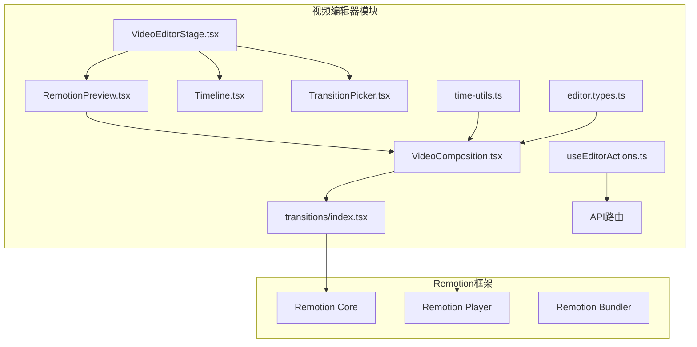
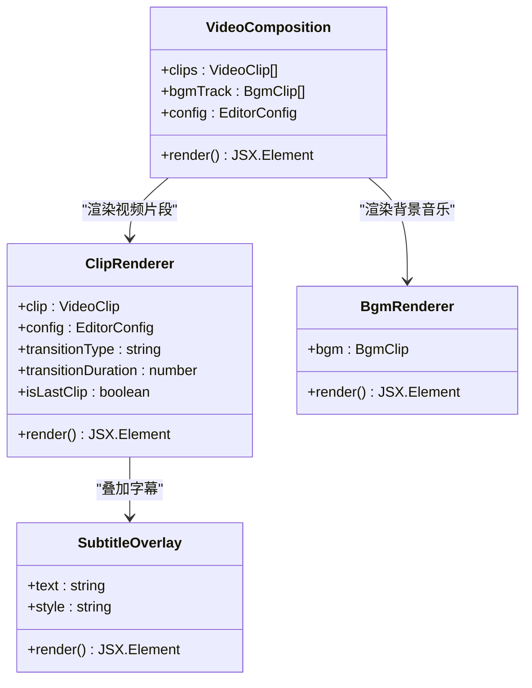
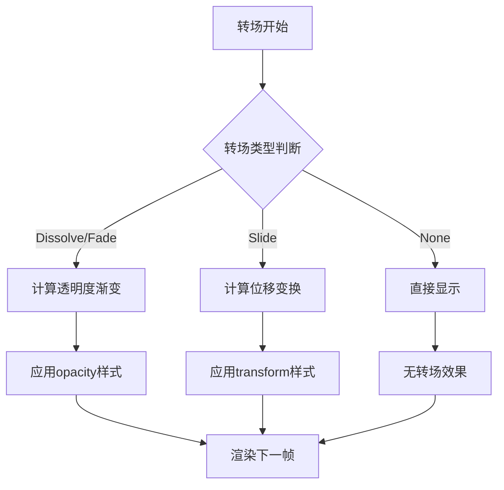
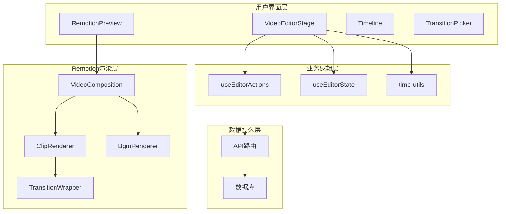
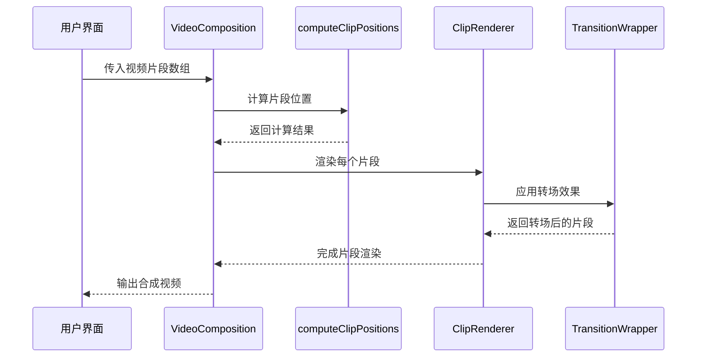
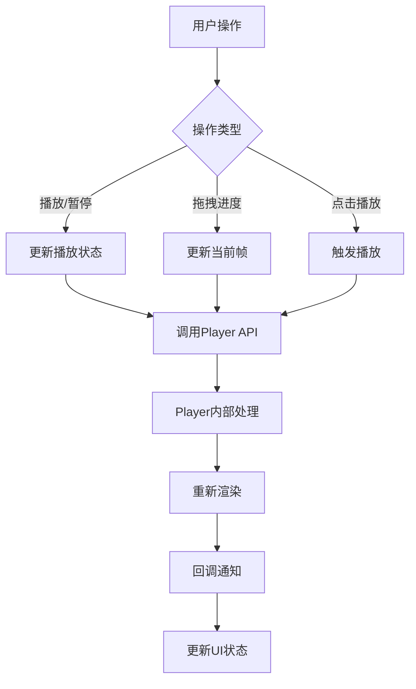
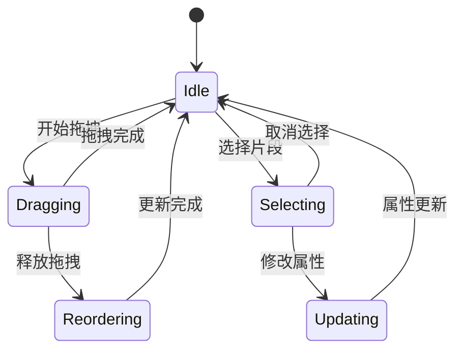
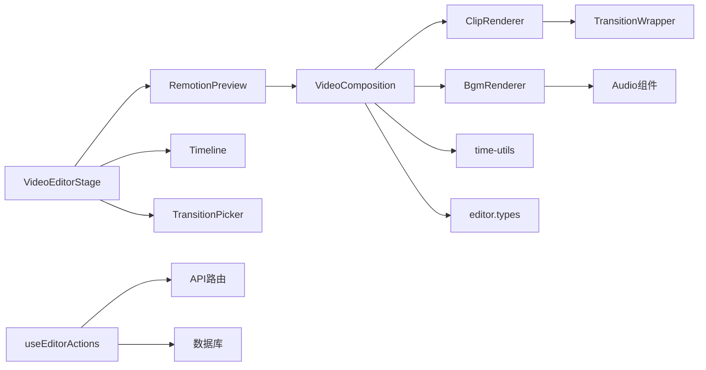
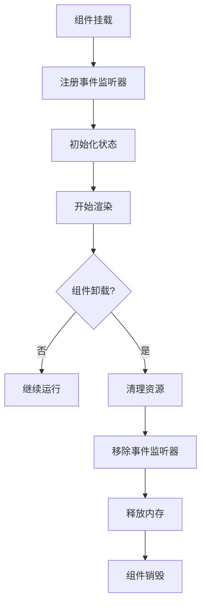
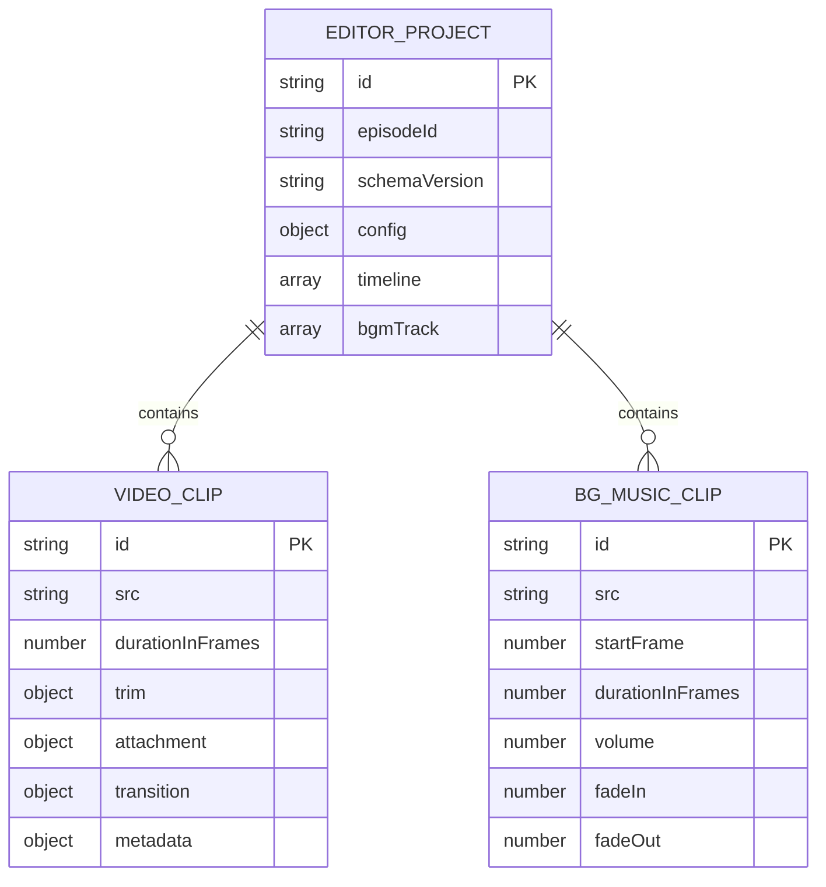

# Remotion集成

<cite>
**本文档引用的文件**
- [VideoComposition.tsx](file://src/features/video-editor/remotion/VideoComposition.tsx)
- [transitions/index.tsx](file://src/features/video-editor/remotion/transitions/index.tsx)
- [VideoEditorStage.tsx](file://src/features/video-editor/components/VideoEditorStage.tsx)
- [RemotionPreview.tsx](file://src/features/video-editor/components/Preview/RemotionPreview.tsx)
- [Timeline.tsx](file://src/features/video-editor/components/Timeline/Timeline.tsx)
- [TransitionPicker.tsx](file://src/features/video-editor/components/TransitionPicker.tsx)
- [time-utils.ts](file://src/features/video-editor/utils/time-utils.ts)
- [editor.types.ts](file://src/features/video-editor/types/editor.types.ts)
- [useEditorActions.ts](file://src/features/video-editor/hooks/useEditorActions.ts)
- [index.ts](file://src/features/video-editor/index.ts)
- [package.json](file://package.json)
- [route.ts](file://src/app/api/novel-promotion/[projectId]/editor/route.ts)
</cite>

## 目录
1. [简介](#简介)
2. [项目结构](#项目结构)
3. [核心组件](#核心组件)
4. [架构概览](#架构概览)
5. [详细组件分析](#详细组件分析)
6. [依赖关系分析](#依赖关系分析)
7. [性能考虑](#性能考虑)
8. [故障排除指南](#故障排除指南)
9. [结论](#结论)
10. [附录](#附录)

## 简介

Remotion是一个基于React的视频合成框架，允许开发者使用代码创建高质量的视频内容。在本项目中，Remotion被深度集成到视频编辑器中，提供了强大的视频合成、转场效果和实时预览功能。

该集成实现了完整的视频编辑工作流程，包括：
- 基于Remotion的视频合成引擎
- 磁性时间轴布局系统
- 内置转场效果系统
- 实时预览和播放控制
- AI生成内容的无缝集成

## 项目结构

视频编辑器的Remotion集成主要位于`src/features/video-editor/`目录下，采用模块化设计：

**图表来源**
- [VideoEditorStage.tsx:1-296](file://src/features/video-editor/components/VideoEditorStage.tsx#L1-L296)
- [VideoComposition.tsx:1-237](file://src/features/video-editor/remotion/VideoComposition.tsx#L1-L237)

**章节来源**
- [VideoEditorStage.tsx:1-296](file://src/features/video-editor/components/VideoEditorStage.tsx#L1-L296)
- [index.ts:1-43](file://src/features/video-editor/index.ts#L1-L43)

## 核心组件

### VideoComposition组件

VideoComposition是Remotion集成的核心组件，负责将多个视频片段、音频和文本元素组合成最终视频输出。

**图表来源**
- [VideoComposition.tsx:16-60](file://src/features/video-editor/remotion/VideoComposition.tsx#L16-L60)
- [VideoComposition.tsx:105-192](file://src/features/video-editor/remotion/VideoComposition.tsx#L105-L192)

### 转场效果系统

转场效果系统提供了多种内置转场动画，包括溶解、淡入淡出和滑动效果：

**图表来源**
- [transitions/index.tsx:15-56](file://src/features/video-editor/remotion/transitions/index.tsx#L15-L56)
- [VideoComposition.tsx:120-160](file://src/features/video-editor/remotion/VideoComposition.tsx#L120-L160)

**章节来源**
- [VideoComposition.tsx:1-237](file://src/features/video-editor/remotion/VideoComposition.tsx#L1-L237)
- [transitions/index.tsx:1-116](file://src/features/video-editor/remotion/transitions/index.tsx#L1-L116)

## 架构概览

整个Remotion集成采用分层架构设计，确保了良好的可维护性和扩展性：

**图表来源**
- [VideoEditorStage.tsx:37-296](file://src/features/video-editor/components/VideoEditorStage.tsx#L37-L296)
- [useEditorActions.ts:81-157](file://src/features/video-editor/hooks/useEditorActions.ts#L81-L157)

## 详细组件分析

### 视频合成组件实现

VideoComposition组件实现了磁性时间轴布局，支持多个视频片段的智能排列：

#### 核心渲染逻辑

组件通过`computeClipPositions`函数计算每个片段的精确位置，确保转场效果的正确实现：

**图表来源**
- [VideoComposition.tsx:21-60](file://src/features/video-editor/remotion/VideoComposition.tsx#L21-L60)
- [time-utils.ts:27-47](file://src/features/video-editor/utils/time-utils.ts#L27-L47)

#### 转场效果实现

转场效果通过CSS动画实现，支持多种动画类型：

**章节来源**
- [VideoComposition.tsx:94-192](file://src/features/video-editor/remotion/VideoComposition.tsx#L94-L192)

### 预览系统

RemotionPreview组件提供了实时预览功能，支持双向同步：

**图表来源**
- [RemotionPreview.tsx:39-100](file://src/features/video-editor/components/Preview/RemotionPreview.tsx#L39-L100)

**章节来源**
- [RemotionPreview.tsx:1-161](file://src/features/video-editor/components/Preview/RemotionPreview.tsx#L1-L161)

### 时间轴系统

Timeline组件实现了拖拽排序和可视化编辑功能：

**图表来源**
- [Timeline.tsx:62-70](file://src/features/video-editor/components/Timeline/Timeline.tsx#L62-L70)

**章节来源**
- [Timeline.tsx:1-379](file://src/features/video-editor/components/Timeline/Timeline.tsx#L1-L379)

### 转场选择器

TransitionPicker提供了直观的转场效果配置界面：

**章节来源**
- [TransitionPicker.tsx:1-125](file://src/features/video-editor/components/TransitionPicker.tsx#L1-L125)

## 依赖关系分析

### 外部依赖

项目使用Remotion 4.0版本，包含以下关键依赖：

| 依赖包 | 版本 | 用途 |
|--------|------|------|
| remotion | ^4.0.405 | 核心视频合成框架 |
| @remotion/player | ^4.0.405 | 视频播放器组件 |
| @remotion/cli | ^4.0.405 | 命令行工具 |

### 内部模块依赖

**图表来源**
- [package.json:128-159](file://package.json#L128-L159)
- [VideoEditorStage.tsx:7-13](file://src/features/video-editor/components/VideoEditorStage.tsx#L7-L13)

**章节来源**
- [package.json:1-186](file://package.json#L1-186)
- [index.ts:1-43](file://src/features/video-editor/index.ts#L1-L43)

## 性能考虑

### 渲染优化策略

1. **帧级同步优化**: 使用防抖机制避免频繁的帧更新
2. **条件渲染**: 只在必要时重新计算片段位置
3. **内存管理**: 合理清理事件监听器和定时器

### 转场效果优化

- 使用CSS变换而非重排版
- 预计算转场参数
- 避免不必要的DOM操作

### 内存管理最佳实践

## 故障排除指南

### 常见问题及解决方案

#### 预览无法加载

**症状**: 预览区域显示空白或错误信息

**可能原因**:
1. 视频URL无效或不可访问
2. Remotion Player初始化失败
3. 权限不足

**解决步骤**:
1. 检查视频URL是否有效
2. 确认用户具有访问权限
3. 验证Remotion配置

#### 转场效果异常

**症状**: 转场动画不流畅或显示错误

**检查清单**:
1. 确认转场持续时间设置合理
2. 验证帧率配置
3. 检查CSS样式冲突

**章节来源**
- [RemotionPreview.tsx:103-125](file://src/features/video-editor/components/Preview/RemotionPreview.tsx#L103-L125)
- [VideoComposition.tsx:120-160](file://src/features/video-editor/remotion/VideoComposition.tsx#L120-L160)

## 结论

本Remotion集成方案成功地将视频合成能力引入到项目中，提供了完整的视频编辑工作流程。通过模块化的架构设计和优化的渲染策略，系统能够高效地处理复杂的视频合成任务。

主要优势包括：
- **高度可定制**: 支持自定义转场效果和渲染逻辑
- **实时预览**: 提供流畅的编辑体验
- **性能优化**: 采用多种优化策略确保流畅运行
- **易于扩展**: 清晰的架构便于添加新功能

未来可以考虑的改进方向：
- 添加更多转场效果类型
- 实现GPU加速渲染
- 增强AI生成内容的集成深度

## 附录

### API配置选项

| 参数 | 类型 | 描述 | 默认值 |
|------|------|------|--------|
| fps | number | 帧率 | 30 |
| width | number | 输出宽度 | 1920 |
| height | number | 输出高度 | 1080 |
| format | 'mp4' \| 'webm' | 输出格式 | 'mp4' |
| quality | 'draft' \| 'high' | 渲染质量 | 'high' |

### 转场效果参数

| 参数 | 类型 | 描述 | 有效值 |
|------|------|------|--------|
| type | string | 转场类型 | 'none', 'dissolve', 'fade', 'slide' |
| durationInFrames | number | 持续时间(帧) | 10-45 |
| direction | string | 滑动方向 | 'left', 'right', 'up', 'down' |

### 数据模型

**图表来源**
- [editor.types.ts:9-99](file://src/features/video-editor/types/editor.types.ts#L9-L99)