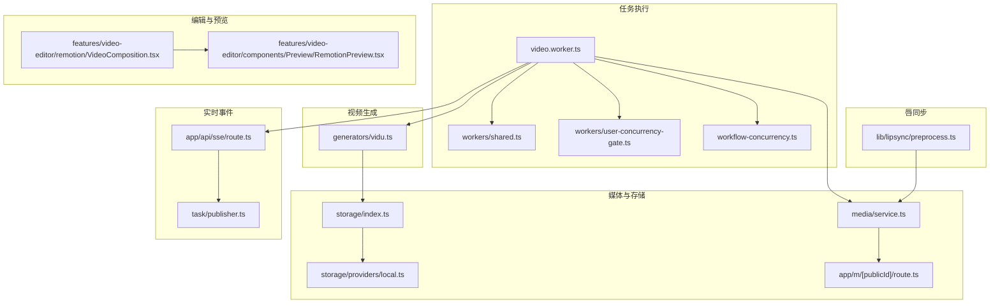
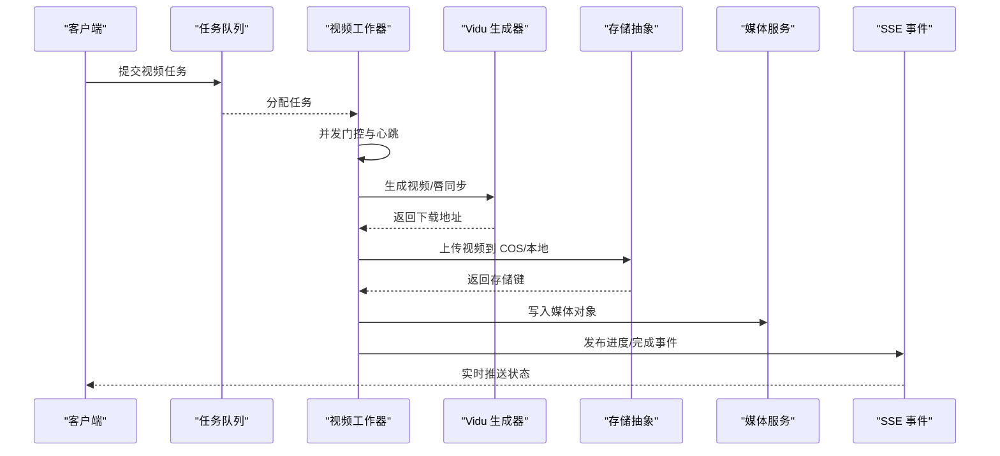
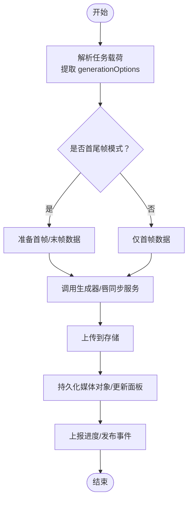
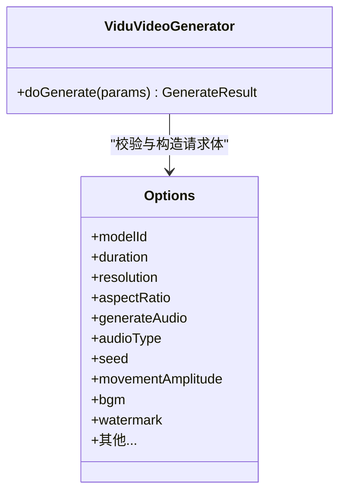
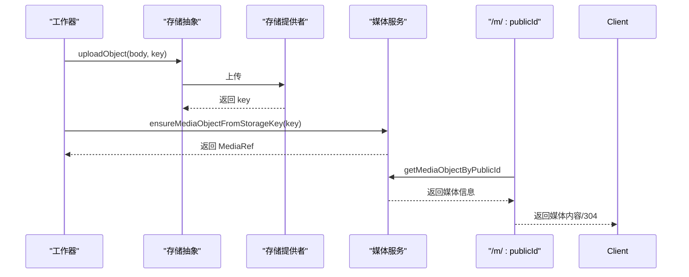
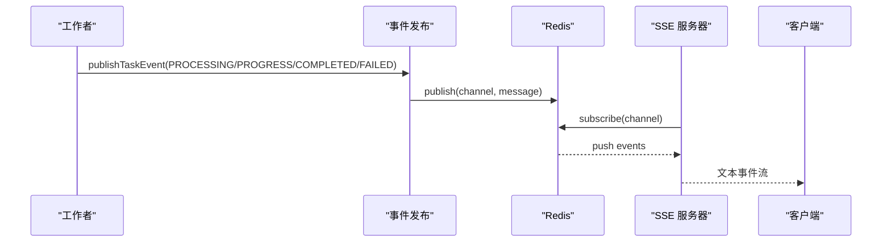
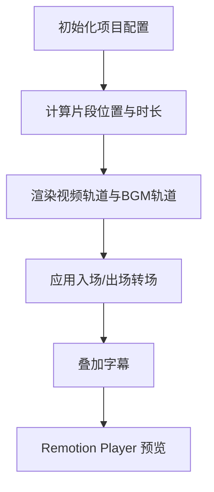
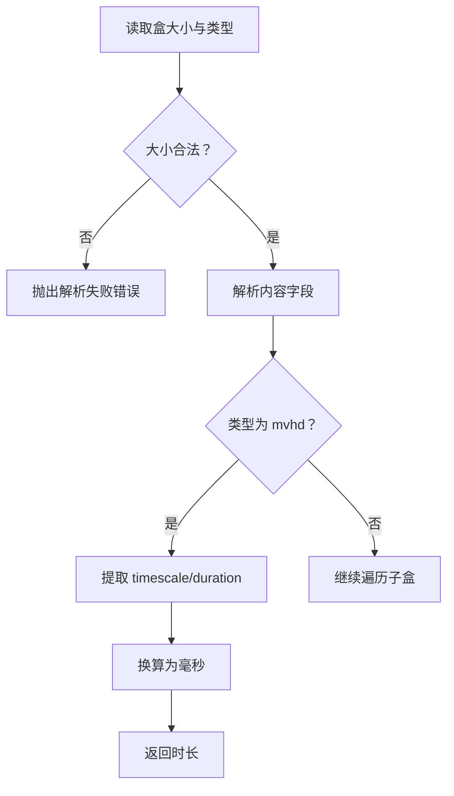
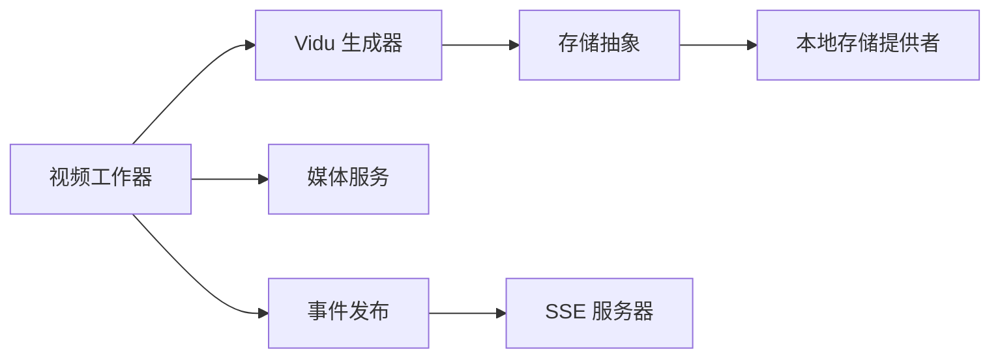

# 导出与渲染

<cite>
**本文引用的文件**
- [src/lib/workers/video.worker.ts](file://src/lib/workers/video.worker.ts)
- [src/lib/generators/vidu.ts](file://src/lib/generators/vidu.ts)
- [src/lib/media/service.ts](file://src/lib/media/service.ts)
- [src/lib/storage/index.ts](file://src/lib/storage/index.ts)
- [src/lib/storage/providers/local.ts](file://src/lib/storage/providers/local.ts)
- [src/app/m/[publicId]/route.ts](file://src/app/m/[publicId]/route.ts)
- [src/lib/workers/shared.ts](file://src/lib/workers/shared.ts)
- [src/lib/workers/user-concurrency-gate.ts](file://src/lib/workers/user-concurrency-gate.ts)
- [src/lib/workflow-concurrency.ts](file://src/lib/workflow-concurrency.ts)
- [src/lib/task/publisher.ts](file://src/lib/task/publisher.ts)
- [src/app/api/sse/route.ts](file://src/app/api/sse/route.ts)
- [src/features/video-editor/remotion/VideoComposition.tsx](file://src/features/video-editor/remotion/VideoComposition.tsx)
- [src/features/video-editor/components/Preview/RemotionPreview.tsx](file://src/features/video-editor/components/Preview/RemotionPreview.tsx)
- [src/lib/lipsync/preprocess.ts](file://src/lib/lipsync/preprocess.ts)
- [tests/unit/lipsync-preprocess.test.ts](file://tests/unit/lipsync-preprocess.test.ts)
</cite>

## 目录
1. [简介](#简介)
2. [项目结构](#项目结构)
3. [核心组件](#核心组件)
4. [架构总览](#架构总览)
5. [详细组件分析](#详细组件分析)
6. [依赖关系分析](#依赖关系分析)
7. [性能考量](#性能考量)
8. [故障排查指南](#故障排查指南)
9. [结论](#结论)
10. [附录](#附录)

## 简介
本文件面向视频导出与渲染功能，系统性梳理从任务调度、资源分配、进度监控到输出格式与编码选项、质量设置策略、批量渲染与并发控制、错误处理、媒体存储集成、性能优化与硬件加速、内存管理与大文件处理，以及实际导出配置示例与故障排除建议。内容基于仓库现有实现进行归纳与可视化，帮助开发者与使用者快速理解并高效使用导出与渲染能力。

## 项目结构
围绕“导出与渲染”的关键目录与文件如下：
- 任务执行与并发控制：workers（视频任务）、共享工具（进度上报、生命周期事件）、用户并发门控、工作流并发配置
- 视频生成器：Vidu 视频生成器（模型规格、参数校验、请求构建）
- 媒体与存储：媒体对象服务、通用存储抽象、本地存储提供者、媒体路由
- 实时事件：SSE 事件通道、事件发布与订阅
- 视频编辑与预览：Remotion 合成与预览组件
- 唇同步：预处理与 MP4 时长解析
- 测试：唇同步预处理单元测试

图示来源
- [src/lib/workers/video.worker.ts:1-324](file://src/lib/workers/video.worker.ts#L1-L324)
- [src/lib/generators/vidu.ts:1-681](file://src/lib/generators/vidu.ts#L1-L681)
- [src/lib/media/service.ts:1-224](file://src/lib/media/service.ts#L1-L224)
- [src/lib/storage/index.ts:1-52](file://src/lib/storage/index.ts#L1-L52)
- [src/lib/storage/providers/local.ts:39-86](file://src/lib/storage/providers/local.ts#L39-L86)
- [src/app/m/[publicId]/route.ts](file://src/app/m/[publicId]/route.ts#L1-L48)
- [src/lib/workers/shared.ts:1-731](file://src/lib/workers/shared.ts#L1-L731)
- [src/lib/workers/user-concurrency-gate.ts:1-70](file://src/lib/workers/user-concurrency-gate.ts#L1-L70)
- [src/lib/workflow-concurrency.ts:1-43](file://src/lib/workflow-concurrency.ts#L1-L43)
- [src/lib/task/publisher.ts:1-391](file://src/lib/task/publisher.ts#L1-L391)
- [src/app/api/sse/route.ts:77-156](file://src/app/api/sse/route.ts#L77-L156)
- [src/features/video-editor/remotion/VideoComposition.tsx:1-237](file://src/features/video-editor/remotion/VideoComposition.tsx#L1-L237)
- [src/features/video-editor/components/Preview/RemotionPreview.tsx:1-160](file://src/features/video-editor/components/Preview/RemotionPreview.tsx#L1-L160)
- [src/lib/lipsync/preprocess.ts:226-283](file://src/lib/lipsync/preprocess.ts#L226-L283)

章节来源
- [src/lib/workers/video.worker.ts:1-324](file://src/lib/workers/video.worker.ts#L1-L324)
- [src/lib/generators/vidu.ts:1-681](file://src/lib/generators/vidu.ts#L1-L681)
- [src/lib/media/service.ts:1-224](file://src/lib/media/service.ts#L1-L224)
- [src/lib/storage/index.ts:1-52](file://src/lib/storage/index.ts#L1-L52)
- [src/lib/storage/providers/local.ts:39-86](file://src/lib/storage/providers/local.ts#L39-L86)
- [src/app/m/[publicId]/route.ts](file://src/app/m/[publicId]/route.ts#L1-L48)
- [src/lib/workers/shared.ts:1-731](file://src/lib/workers/shared.ts#L1-L731)
- [src/lib/workers/user-concurrency-gate.ts:1-70](file://src/lib/workers/user-concurrency-gate.ts#L1-L70)
- [src/lib/workflow-concurrency.ts:1-43](file://src/lib/workflow-concurrency.ts#L1-L43)
- [src/lib/task/publisher.ts:1-391](file://src/lib/task/publisher.ts#L1-L391)
- [src/app/api/sse/route.ts:77-156](file://src/app/api/sse/route.ts#L77-L156)
- [src/features/video-editor/remotion/VideoComposition.tsx:1-237](file://src/features/video-editor/remotion/VideoComposition.tsx#L1-L237)
- [src/features/video-editor/components/Preview/RemotionPreview.tsx:1-160](file://src/features/video-editor/components/Preview/RemotionPreview.tsx#L1-L160)
- [src/lib/lipsync/preprocess.ts:226-283](file://src/lib/lipsync/preprocess.ts#L226-L283)

## 核心组件
- 视频任务工作器：负责视频面板生成与唇同步任务的执行、进度上报、生命周期事件发布、并发门控与重试策略
- Vidu 视频生成器：封装模型规格、参数校验、请求体构造与外部 API 调用
- 媒体服务：媒体对象的持久化、MIME 推断、URL 生成与存储键解析
- 存储抽象：统一上传、签名 URL 生成、唯一键生成与重试策略
- SSE 事件：任务生命周期与流式事件的发布与订阅
- 编辑与预览：Remotion 合成与 Player 预览组件
- 唇同步：MP4 时长解析与预处理

章节来源
- [src/lib/workers/video.worker.ts:1-324](file://src/lib/workers/video.worker.ts#L1-L324)
- [src/lib/generators/vidu.ts:1-681](file://src/lib/generators/vidu.ts#L1-L681)
- [src/lib/media/service.ts:1-224](file://src/lib/media/service.ts#L1-L224)
- [src/lib/storage/index.ts:1-52](file://src/lib/storage/index.ts#L1-L52)
- [src/lib/task/publisher.ts:1-391](file://src/lib/task/publisher.ts#L1-L391)
- [src/features/video-editor/remotion/VideoComposition.tsx:1-237](file://src/features/video-editor/remotion/VideoComposition.tsx#L1-L237)
- [src/lib/lipsync/preprocess.ts:226-283](file://src/lib/lipsync/preprocess.ts#L226-L283)

## 架构总览
下图展示从任务提交到渲染完成的关键流程：任务进入队列，工作器按用户并发限制执行，调用视频生成器或唇同步服务，上传结果至存储，持久化媒体对象，并通过 SSE 广播进度与状态。

图示来源
- [src/lib/workers/video.worker.ts:293-323](file://src/lib/workers/video.worker.ts#L293-L323)
- [src/lib/generators/vidu.ts:374-681](file://src/lib/generators/vidu.ts#L374-L681)
- [src/lib/storage/index.ts:35-52](file://src/lib/storage/index.ts#L35-L52)
- [src/lib/media/service.ts:88-134](file://src/lib/media/service.ts#L88-L134)
- [src/lib/workers/shared.ts:319-467](file://src/lib/workers/shared.ts#L319-L467)
- [src/lib/task/publisher.ts:239-284](file://src/lib/task/publisher.ts#L239-L284)
- [src/app/api/sse/route.ts:92-156](file://src/app/api/sse/route.ts#L92-L156)

## 详细组件分析

### 组件A：视频任务工作器（video.worker.ts）
- 职责
  - 解析面板任务与唇同步任务
  - 参数提取与校验（如模型、提示词、首尾帧、音频开关等）
  - 调用生成器或唇同步服务
  - 上传结果到存储并更新数据库
  - 上报进度、发布生命周期事件
  - 受用户并发门控与工作流并发配置约束
- 关键流程
  - 视频面板任务：提取 generationOptions，选择模型与模式，调用生成器，上传并持久化
  - 唇同步任务：读取音视频签名 URL，提交唇同步，上传并更新面板
- 并发与重试
  - 用户级并发门控（video scope）
  - 工作流并发配置（默认 5）
  - BullMQ 重试与退避策略由共享工具处理

图示来源
- [src/lib/workers/video.worker.ts:80-222](file://src/lib/workers/video.worker.ts#L80-L222)
- [src/lib/workers/video.worker.ts:224-291](file://src/lib/workers/video.worker.ts#L224-L291)
- [src/lib/workers/shared.ts:648-699](file://src/lib/workers/shared.ts#L648-L699)
- [src/lib/workflow-concurrency.ts:1-43](file://src/lib/workflow-concurrency.ts#L1-L43)
- [src/lib/workers/user-concurrency-gate.ts:56-70](file://src/lib/workers/user-concurrency-gate.ts#L56-L70)

章节来源
- [src/lib/workers/video.worker.ts:1-324](file://src/lib/workers/video.worker.ts#L1-L324)
- [src/lib/workers/shared.ts:1-731](file://src/lib/workers/shared.ts#L1-L731)
- [src/lib/workers/user-concurrency-gate.ts:1-70](file://src/lib/workers/user-concurrency-gate.ts#L1-L70)
- [src/lib/workflow-concurrency.ts:1-43](file://src/lib/workflow-concurrency.ts#L1-L43)

### 组件B：Vidu 视频生成器（generators/vidu.ts）
- 职责
  - 统一模型规格与参数校验
  - 构造请求体并调用外部 API
  - 返回异步任务 ID 与外部标识
- 参数体系
  - 模型与模式：支持 normal 与 firstlastframe
  - 时长与分辨率：按模型与模式限定
  - 宽高比：标准与扩展比率
  - 音频：可选生成、类型、音色、水印等
  - 其他：运动幅度、BGM、回调等
- 错误处理
  - 参数非法、不支持的组合、响应缺失字段等均抛出明确错误

图示来源
- [src/lib/generators/vidu.ts:374-681](file://src/lib/generators/vidu.ts#L374-L681)

章节来源
- [src/lib/generators/vidu.ts:1-681](file://src/lib/generators/vidu.ts#L1-L681)

### 组件C：媒体与存储（media/service.ts、storage/index.ts、storage/providers/local.ts、app/m/[publicId]/route.ts）
- 媒体服务
  - 媒体对象的查找/插入、MIME 推断、URL 生成、存储键解析
  - 归一化任意媒体值（COS key、签名 URL、/m/publicId、对象形态）
- 存储抽象
  - 统一上传接口、重试策略、唯一键生成、可获取可拉取 URL
- 本地存储提供者
  - 生成签名 URL、读取缓冲、提取存储键、生成唯一键
- 媒体路由
  - /m/:publicId 的媒体访问，支持 ETag、Range 请求与缓存头

图示来源
- [src/lib/storage/index.ts:35-52](file://src/lib/storage/index.ts#L35-L52)
- [src/lib/storage/providers/local.ts:51-86](file://src/lib/storage/providers/local.ts#L51-L86)
- [src/lib/media/service.ts:88-134](file://src/lib/media/service.ts#L88-L134)
- [src/app/m/[publicId]/route.ts](file://src/app/m/[publicId]/route.ts#L12-L48)

章节来源
- [src/lib/media/service.ts:1-224](file://src/lib/media/service.ts#L1-L224)
- [src/lib/storage/index.ts:1-52](file://src/lib/storage/index.ts#L1-L52)
- [src/lib/storage/providers/local.ts:39-86](file://src/lib/storage/providers/local.ts#L39-L86)
- [src/app/m/[publicId]/route.ts](file://src/app/m/[publicId]/route.ts#L1-L48)

### 组件D：实时事件与进度跟踪（task/publisher.ts、app/api/sse/route.ts、workers/shared.ts）
- 事件发布
  - 生命周期事件（CREATED/PROCESSING/PROGRESS/COMPLETED/FAILED）
  - 流式事件（STREAM），用于长链路输出
  - 通过 Redis 通道广播，支持回放与增量订阅
- SSE 订阅
  - /api/sse 接收项目级订阅，支持 last-event-id 回放
- 进度上报
  - 工作者通过 reportTaskProgress 更新进度并发布事件
  - 事件包含阶段、标签、显示模式、消息等

图示来源
- [src/lib/workers/shared.ts:319-467](file://src/lib/workers/shared.ts#L319-L467)
- [src/lib/task/publisher.ts:239-284](file://src/lib/task/publisher.ts#L239-L284)
- [src/app/api/sse/route.ts:92-156](file://src/app/api/sse/route.ts#L92-L156)

章节来源
- [src/lib/workers/shared.ts:1-731](file://src/lib/workers/shared.ts#L1-L731)
- [src/lib/task/publisher.ts:1-391](file://src/lib/task/publisher.ts#L1-L391)
- [src/app/api/sse/route.ts:77-156](file://src/app/api/sse/route.ts#L77-L156)

### 组件E：视频编辑与预览（VideoComposition.tsx、RemotionPreview.tsx）
- 合成组件
  - 使用 Sequence 实现磁性时间轴布局，支持转场（溶解/淡入淡出/滑动）
  - 支持 BGM 淡入淡出与字幕叠加
- 预览组件
  - 与 Remotion Player 双向同步当前帧与播放状态
  - 根据项目配置计算总时长与宽高比

图示来源
- [src/features/video-editor/remotion/VideoComposition.tsx:16-60](file://src/features/video-editor/remotion/VideoComposition.tsx#L16-L60)
- [src/features/video-editor/components/Preview/RemotionPreview.tsx:34-40](file://src/features/video-editor/components/Preview/RemotionPreview.tsx#L34-L40)

章节来源
- [src/features/video-editor/remotion/VideoComposition.tsx:1-237](file://src/features/video-editor/remotion/VideoComposition.tsx#L1-L237)
- [src/features/video-editor/components/Preview/RemotionPreview.tsx:1-160](file://src/features/video-editor/components/Preview/RemotionPreview.tsx#L1-L160)

### 组件F：唇同步与 MP4 时长解析（lipsync/preprocess.ts、tests/unit/lipsync-preprocess.test.ts）
- MP4 时长解析
  - 解析 mpvd、moov 等盒子，读取 timescale 与 duration，换算毫秒
- 单元测试
  - 构造最小 MP4 结构，验证解析逻辑与边界条件

图示来源
- [src/lib/lipsync/preprocess.ts:226-283](file://src/lib/lipsync/preprocess.ts#L226-L283)
- [tests/unit/lipsync-preprocess.test.ts:57-93](file://tests/unit/lipsync-preprocess.test.ts#L57-L93)

章节来源
- [src/lib/lipsync/preprocess.ts:226-283](file://src/lib/lipsync/preprocess.ts#L226-L283)
- [tests/unit/lipsync-preprocess.test.ts:57-93](file://tests/unit/lipsync-preprocess.test.ts#L57-L93)

## 依赖关系分析
- 低耦合高内聚
  - 视频生成器独立于具体存储与媒体服务，通过统一接口交互
  - 工作者仅依赖生成器与存储抽象，不直接耦合具体提供商
- 事件驱动
  - 通过 SSE 与 Redis 实现任务状态与流式输出的解耦
- 并发与限流
  - 用户级并发门控 + 工作流并发配置，避免资源争用
- 数据一致性
  - 媒体服务对重复写入采用 upsert 并处理唯一约束冲突

图示来源
- [src/lib/generators/vidu.ts:374-681](file://src/lib/generators/vidu.ts#L374-L681)
- [src/lib/storage/index.ts:35-52](file://src/lib/storage/index.ts#L35-L52)
- [src/lib/storage/providers/local.ts:51-86](file://src/lib/storage/providers/local.ts#L51-L86)
- [src/lib/media/service.ts:88-134](file://src/lib/media/service.ts#L88-L134)
- [src/lib/task/publisher.ts:239-284](file://src/lib/task/publisher.ts#L239-L284)
- [src/app/api/sse/route.ts:92-156](file://src/app/api/sse/route.ts#L92-L156)

章节来源
- [src/lib/generators/vidu.ts:1-681](file://src/lib/generators/vidu.ts#L1-L681)
- [src/lib/storage/index.ts:1-52](file://src/lib/storage/index.ts#L1-L52)
- [src/lib/media/service.ts:1-224](file://src/lib/media/service.ts#L1-L224)
- [src/lib/task/publisher.ts:1-391](file://src/lib/task/publisher.ts#L1-L391)
- [src/app/api/sse/route.ts:77-156](file://src/app/api/sse/route.ts#L77-L156)

## 性能考量
- 并发控制
  - 用户级并发门控避免单用户过度占用资源
  - 工作流并发配置可按环境调整（默认 5）
- 重试与退避
  - BullMQ 自动重试与指数退避，配合任务生命周期事件减少抖动
- 存储与网络
  - 上传带重试与固定延迟，降低瞬时失败影响
  - 媒体路由支持 ETag 与 Range，提升缓存命中与分块传输效率
- 渲染预览
  - Remotion 合成按帧精确控制，结合淡入淡出与转场，保证视觉一致性

章节来源
- [src/lib/workers/user-concurrency-gate.ts:1-70](file://src/lib/workers/user-concurrency-gate.ts#L1-L70)
- [src/lib/workflow-concurrency.ts:1-43](file://src/lib/workflow-concurrency.ts#L1-L43)
- [src/lib/workers/shared.ts:240-279](file://src/lib/workers/shared.ts#L240-L279)
- [src/lib/storage/index.ts:35-52](file://src/lib/storage/index.ts#L35-L52)
- [src/app/m/[publicId]/route.ts](file://src/app/m/[publicId]/route.ts#L7-L41)
- [src/features/video-editor/remotion/VideoComposition.tsx:69-92](file://src/features/video-editor/remotion/VideoComposition.tsx#L69-L92)

## 故障排查指南
- 常见错误与定位
  - 参数非法：检查 generationOptions 与模型规格是否匹配
  - 任务终止：确认任务状态与计费回滚是否成功
  - 重试与退避：查看日志中的 retry 状态与下次重试时间
  - SSE 订阅异常：确认 last-event-id 与项目鉴权
- 建议步骤
  - 查看工作者日志与任务事件表
  - 确认存储键与媒体对象存在
  - 校验签名 URL 是否有效与过期
  - 检查并发配置与用户级门控是否阻塞

章节来源
- [src/lib/workers/shared.ts:467-646](file://src/lib/workers/shared.ts#L467-L646)
- [src/lib/task/publisher.ts:239-284](file://src/lib/task/publisher.ts#L239-L284)
- [src/app/api/sse/route.ts:92-156](file://src/app/api/sse/route.ts#L92-L156)
- [src/lib/media/service.ts:88-134](file://src/lib/media/service.ts#L88-L134)

## 结论
该导出与渲染体系以任务驱动为核心，通过严格的参数校验、统一的存储抽象、事件驱动的进度跟踪与并发门控，实现了稳定高效的视频生成与预览能力。结合媒体路由与 SSE，用户可获得一致的体验与可观测性。后续可在硬件加速、大文件分片与缓存策略上进一步优化。

## 附录

### 输出格式与编码选项（基于 Vidu 生成器）
- 支持的模型与模式
  - normal / firstlastframe
  - 多档模型（如 viduq3-pro、viduq2-pro、viduq2-turbo、viduq1、vidu2.0 等）
- 时长与时序
  - 不同模型支持的时长范围不同，按模式与分辨率规则推导
- 分辨率与宽高比
  - 标准比率（16:9、9:16、1:1）与扩展比率（4:3、3:4、21:9、2:3、3:2、auto）
- 音频与附加项
  - 可选生成音频、音频类型（全量/仅语音/仅音效）、音色、BGM、水印、回调等
- 参数校验与错误
  - 所有参数均进行类型与取值范围校验，不支持的组合会抛出明确错误

章节来源
- [src/lib/generators/vidu.ts:171-309](file://src/lib/generators/vidu.ts#L171-L309)
- [src/lib/generators/vidu.ts:444-554](file://src/lib/generators/vidu.ts#L444-L554)

### 质量设置策略（分辨率、比特率、帧率、音频）
- 分辨率与时长
  - 依据模型与模式确定默认分辨率与可用分辨率集合
- 帧率
  - 由编辑器配置传入，作为合成参数
- 音频
  - 可开启/关闭，指定类型与音色；部分模型与时段高峰策略有约束
- 水印与元数据
  - 支持位置、URL 与元数据透传

章节来源
- [src/lib/generators/vidu.ts:455-554](file://src/lib/generators/vidu.ts#L455-L554)
- [src/features/video-editor/remotion/VideoComposition.tsx:16-60](file://src/features/video-editor/remotion/VideoComposition.tsx#L16-L60)

### 批量渲染与并发处理
- 用户级并发门控
  - 按用户维度限制同时运行的任务数
- 工作流并发配置
  - 默认每类任务并发为 5，可通过配置覆盖
- 任务重试与退避
  - 自动指数退避，配合生命周期事件记录

章节来源
- [src/lib/workers/user-concurrency-gate.ts:56-70](file://src/lib/workers/user-concurrency-gate.ts#L56-L70)
- [src/lib/workflow-concurrency.ts:1-43](file://src/lib/workflow-concurrency.ts#L1-L43)
- [src/lib/workers/shared.ts:240-279](file://src/lib/workers/shared.ts#L240-L279)

### 渲染进度跟踪与错误处理
- 进度上报
  - 工作者在关键阶段上报进度并发布事件
- 错误处理
  - 标准化错误码与可重试标记，必要时进行计费回滚
- SSE 实时反馈
  - 客户端订阅 /api/sse 获取最新状态

章节来源
- [src/lib/workers/shared.ts:648-699](file://src/lib/workers/shared.ts#L648-L699)
- [src/lib/task/publisher.ts:239-284](file://src/lib/task/publisher.ts#L239-L284)
- [src/app/api/sse/route.ts:92-156](file://src/app/api/sse/route.ts#L92-L156)

### 媒体存储集成（上传、URL 生成、缓存）
- 上传
  - 统一上传接口，内置重试与延迟
- URL 生成
  - 本地提供者生成可拉取 URL，支持签名与过期
- 缓存
  - 媒体路由支持 ETag 与 304 响应，提升缓存命中
- 媒体对象
  - 唯一 publicId 与 storageKey 映射，MIME 推断与尺寸/时长元数据

章节来源
- [src/lib/storage/index.ts:35-52](file://src/lib/storage/index.ts#L35-L52)
- [src/lib/storage/providers/local.ts:51-86](file://src/lib/storage/providers/local.ts#L51-L86)
- [src/app/m/[publicId]/route.ts](file://src/app/m/[publicId]/route.ts#L7-L41)
- [src/lib/media/service.ts:88-134](file://src/lib/media/service.ts#L88-L134)

### 性能优化与硬件加速
- 并发与限流
  - 合理设置用户级并发与工作流并发，避免资源争用
- 重试策略
  - 上传与网络请求采用固定延迟重试，降低瞬时失败影响
- 缓存与分块
  - 媒体路由支持 Range 与 ETag，提升大文件传输效率
- 建议
  - 在具备 GPU 加速能力的环境下，优先选用高性能模型与分辨率
  - 对大文件采用分片上传与断点续传（如需扩展）

章节来源
- [src/lib/workers/user-concurrency-gate.ts:1-70](file://src/lib/workers/user-concurrency-gate.ts#L1-L70)
- [src/lib/storage/index.ts:35-52](file://src/lib/storage/index.ts#L35-L52)
- [src/app/m/[publicId]/route.ts](file://src/app/m/[publicId]/route.ts#L44-L48)

### 内存管理与大文件处理
- 内存管理
  - 生成器与工作器尽量采用流式处理与最小化中间态
- 大文件
  - 媒体路由支持 Range 请求，客户端可按需分块拉取
- 唇同步
  - MP4 时长解析采用逐盒扫描，避免一次性加载整个文件

章节来源
- [src/lib/lipsync/preprocess.ts:226-283](file://src/lib/lipsync/preprocess.ts#L226-L283)
- [src/app/m/[publicId]/route.ts](file://src/app/m/[publicId]/route.ts#L44-L48)

### 实际导出配置示例（步骤说明）
- 选择模型与模式
  - normal 或 firstlastframe，依据需求选择
- 设置时长与分辨率
  - 根据模型支持范围选择，默认分辨率与可用分辨率
- 配置宽高比与种子
  - 标准或扩展比率，必要时设置随机种子
- 音频与附加项
  - 开启/关闭音频，选择类型与音色；可添加水印与元数据
- 提交任务
  - 工作者接收任务后，调用生成器并上传结果
- 实时跟踪
  - 通过 SSE 订阅 /api/sse 获取进度与完成事件

章节来源
- [src/lib/generators/vidu.ts:444-554](file://src/lib/generators/vidu.ts#L444-L554)
- [src/lib/workers/video.worker.ts:183-222](file://src/lib/workers/video.worker.ts#L183-L222)
- [src/app/api/sse/route.ts:92-156](file://src/app/api/sse/route.ts#L92-L156)