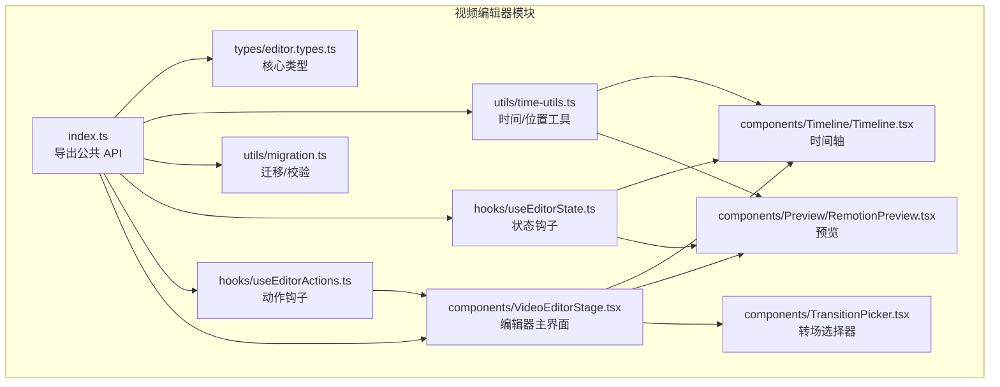
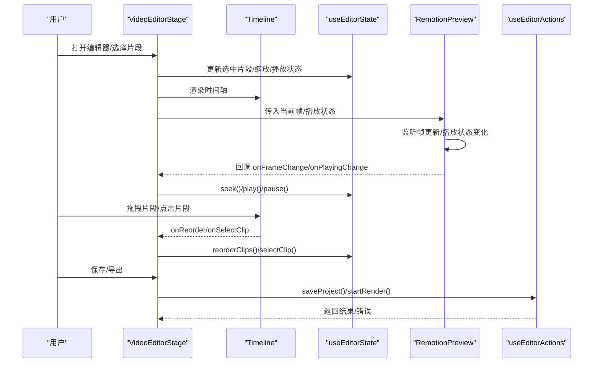
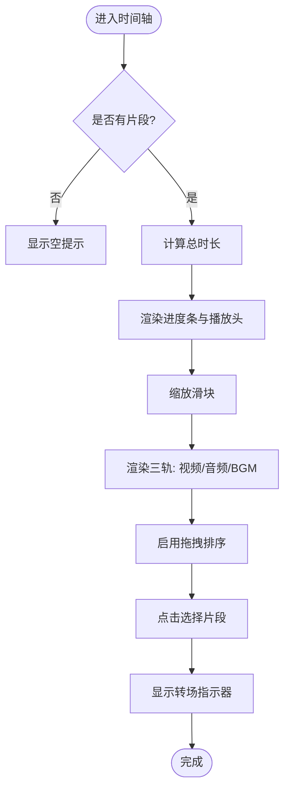
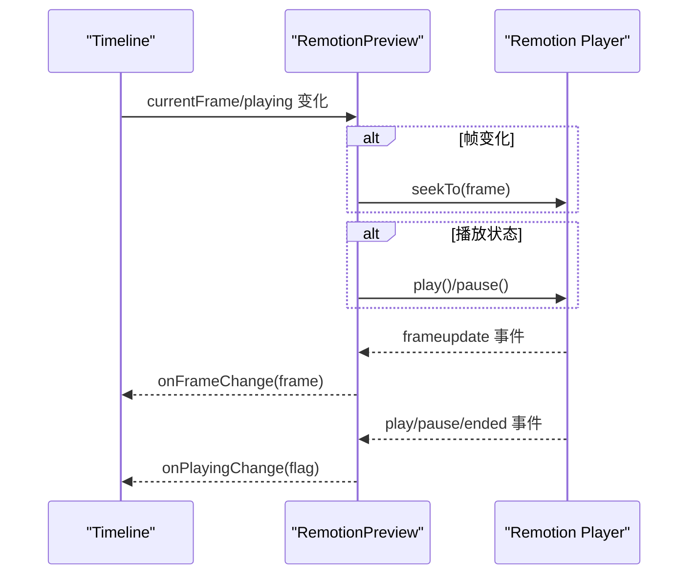
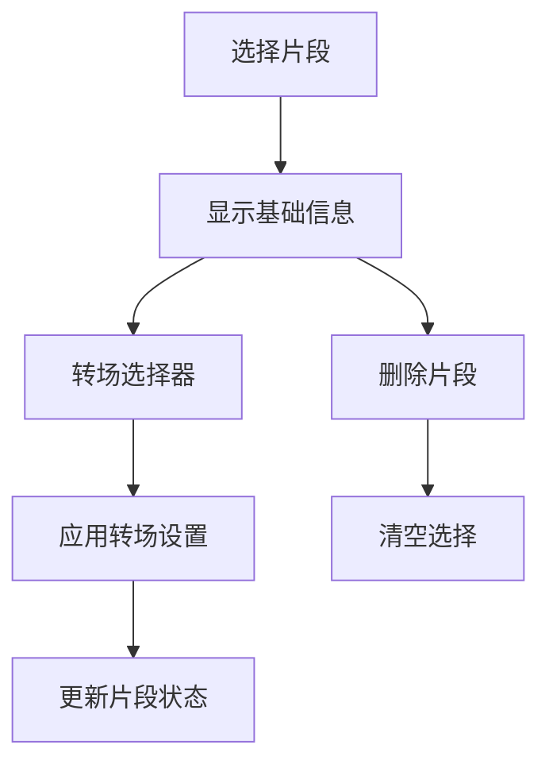
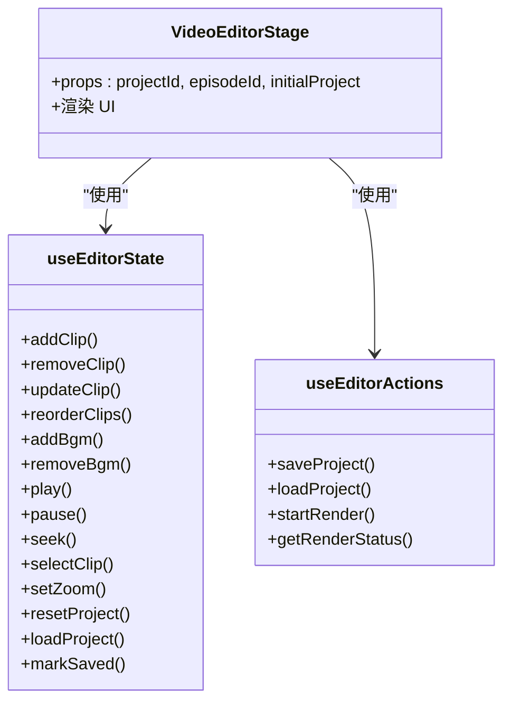
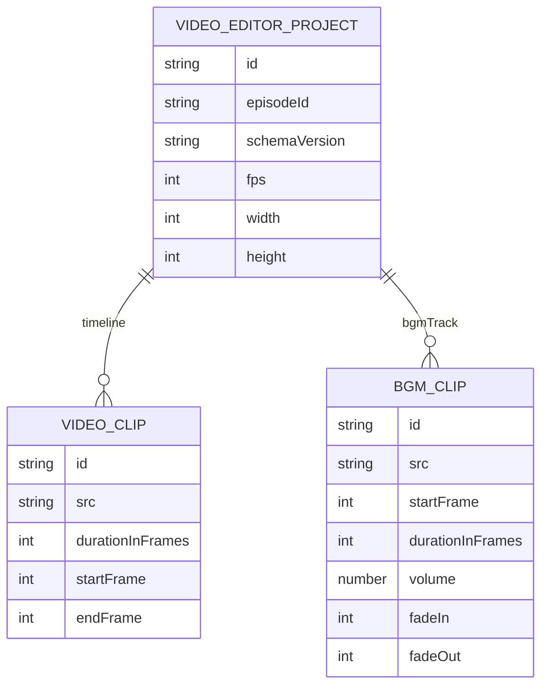
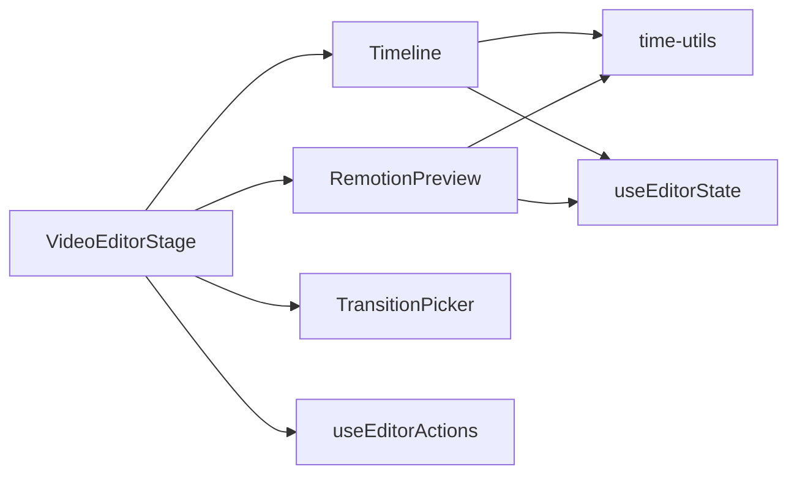

# 时间线编辑器

<cite>
**本文引用的文件**
- [src/features/video-editor/index.ts](file://src/features/video-editor/index.ts)
- [src/features/video-editor/types/editor.types.ts](file://src/features/video-editor/types/editor.types.ts)
- [src/features/video-editor/utils/time-utils.ts](file://src/features/video-editor/utils/time-utils.ts)
- [src/features/video-editor/utils/migration.ts](file://src/features/video-editor/utils/migration.ts)
- [src/features/video-editor/hooks/useEditorState.ts](file://src/features/video-editor/hooks/useEditorState.ts)
- [src/features/video-editor/hooks/useEditorActions.ts](file://src/features/video-editor/hooks/useEditorActions.ts)
- [src/features/video-editor/components/VideoEditorStage.tsx](file://src/features/video-editor/components/VideoEditorStage.tsx)
- [src/features/video-editor/components/Timeline/Timeline.tsx](file://src/features/video-editor/components/Timeline/Timeline.tsx)
- [src/features/video-editor/components/Preview/RemotionPreview.tsx](file://src/features/video-editor/components/Preview/RemotionPreview.tsx)
- [src/features/video-editor/components/TransitionPicker.tsx](file://src/features/video-editor/components/TransitionPicker.tsx)
</cite>

## 目录
1. [简介](#简介)
2. [项目结构](#项目结构)
3. [核心组件](#核心组件)
4. [架构总览](#架构总览)
5. [详细组件分析](#详细组件分析)
6. [依赖关系分析](#依赖关系分析)
7. [性能考量](#性能考量)
8. [故障排查指南](#故障排查指南)
9. [结论](#结论)
10. [附录](#附录)

## 简介
本文件为“时间线编辑器”的全面功能文档，覆盖架构设计、用户交互模式、多轨道编辑（视频/音频/BGM）、片段操作（拖拽、裁剪、缩放、对齐）、播放头控制与时间轴导航、精确到帧的时间定位、状态管理与撤销重做机制、片段属性编辑界面设计、与预览系统的数据同步与性能优化策略，并提供使用示例与最佳实践。

## 项目结构
时间线编辑器位于视频编辑特性模块中，采用“类型 + 工具 + 钩子 + 组件”的分层组织方式：
- 类型定义：统一描述项目结构、片段、轨道、UI 状态与 API 请求响应
- 工具函数：时间换算、位置计算、项目迁移与校验
- 钩子：状态与动作封装，负责本地状态、播放控制、项目持久化与渲染任务
- 组件：编辑器主界面、时间轴、预览、转场选择器等

图表来源
- [src/features/video-editor/index.ts:1-43](file://src/features/video-editor/index.ts#L1-L43)
- [src/features/video-editor/types/editor.types.ts:1-141](file://src/features/video-editor/types/editor.types.ts#L1-L141)
- [src/features/video-editor/utils/time-utils.ts:1-95](file://src/features/video-editor/utils/time-utils.ts#L1-L95)
- [src/features/video-editor/utils/migration.ts:1-48](file://src/features/video-editor/utils/migration.ts#L1-L48)
- [src/features/video-editor/hooks/useEditorState.ts:1-176](file://src/features/video-editor/hooks/useEditorState.ts#L1-L176)
- [src/features/video-editor/hooks/useEditorActions.ts:1-157](file://src/features/video-editor/hooks/useEditorActions.ts#L1-L157)
- [src/features/video-editor/components/VideoEditorStage.tsx:1-296](file://src/features/video-editor/components/VideoEditorStage.tsx#L1-L296)
- [src/features/video-editor/components/Timeline/Timeline.tsx:1-379](file://src/features/video-editor/components/Timeline/Timeline.tsx#L1-L379)
- [src/features/video-editor/components/Preview/RemotionPreview.tsx:1-161](file://src/features/video-editor/components/Preview/RemotionPreview.tsx#L1-L161)
- [src/features/video-editor/components/TransitionPicker.tsx:1-125](file://src/features/video-editor/components/TransitionPicker.tsx#L1-L125)

章节来源
- [src/features/video-editor/index.ts:1-43](file://src/features/video-editor/index.ts#L1-L43)

## 核心组件
- 项目与片段模型：定义视频编辑项目的顶层结构、片段、BGM、UI 状态与计算片段等
- 时间工具：帧数与时间字符串互转、计算总时长、计算片段位置
- 状态与动作：本地状态管理、播放控制、片段增删改、轨道操作、项目加载/保存/渲染
- UI 组件：编辑器主界面、时间轴、预览、转场选择器

章节来源
- [src/features/video-editor/types/editor.types.ts:9-141](file://src/features/video-editor/types/editor.types.ts#L9-L141)
- [src/features/video-editor/utils/time-utils.ts:7-95](file://src/features/video-editor/utils/time-utils.ts#L7-L95)
- [src/features/video-editor/hooks/useEditorState.ts:18-176](file://src/features/video-editor/hooks/useEditorState.ts#L18-L176)
- [src/features/video-editor/hooks/useEditorActions.ts:81-157](file://src/features/video-editor/hooks/useEditorActions.ts#L81-L157)

## 架构总览
编辑器采用“单向数据流 + 事件回调”的模式：
- 状态钩子维护项目数据与 UI 状态
- 动作钩子负责与服务端交互（保存、加载、发起渲染）
- 组件通过 props 接收状态与回调，触发动作
- 预览组件与时间轴组件分别与播放头进行双向同步

图表来源
- [src/features/video-editor/components/VideoEditorStage.tsx:43-296](file://src/features/video-editor/components/VideoEditorStage.tsx#L43-L296)
- [src/features/video-editor/components/Timeline/Timeline.tsx:38-279](file://src/features/video-editor/components/Timeline/Timeline.tsx#L38-L279)
- [src/features/video-editor/components/Preview/RemotionPreview.tsx:23-161](file://src/features/video-editor/components/Preview/RemotionPreview.tsx#L23-L161)
- [src/features/video-editor/hooks/useEditorState.ts:18-176](file://src/features/video-editor/hooks/useEditorState.ts#L18-L176)
- [src/features/video-editor/hooks/useEditorActions.ts:81-157](file://src/features/video-editor/hooks/useEditorActions.ts#L81-L157)

## 详细组件分析

### 时间轴组件（多轨道与交互）
- 视频轨道：使用可排序的片段条，支持拖拽重排、点击选择、转场指示
- 音频轨道：展示带附属音频的片段条（以不同背景色标识）
- BGM 轨道：预留轨道区域（当前未实现具体片段可视化）
- 缩放控制：滑块调节缩放比例，影响片段宽度与滚动体验
- 播放头进度条：点击进度条可跳转到指定帧；播放时平滑更新
- 时间标记：显示当前帧与总时长

图表来源
- [src/features/video-editor/components/Timeline/Timeline.tsx:38-279](file://src/features/video-editor/components/Timeline/Timeline.tsx#L38-L279)

章节来源
- [src/features/video-editor/components/Timeline/Timeline.tsx:38-279](file://src/features/video-editor/components/Timeline/Timeline.tsx#L38-L279)

### 预览组件（与播放头同步）
- 使用 Remotion Player 渲染合成
- 双向同步：
  - 外部帧变化：避免抖动，仅在帧差大于阈值时 seek
  - Player 帧更新：监听 frameupdate 事件，回调上抛当前帧
  - 播放状态：监听 play/pause/ended，同步到 UI
- 无片段时显示占位提示

图表来源
- [src/features/video-editor/components/Preview/RemotionPreview.tsx:23-161](file://src/features/video-editor/components/Preview/RemotionPreview.tsx#L23-L161)

章节来源
- [src/features/video-editor/components/Preview/RemotionPreview.tsx:23-161](file://src/features/video-editor/components/Preview/RemotionPreview.tsx#L23-L161)

### 片段属性编辑界面（转场与删除）
- 展示片段基础信息（编号/时长）
- 提供转场类型与持续时间选择
- 支持删除片段并取消选择

图表来源
- [src/features/video-editor/components/VideoEditorStage.tsx:227-273](file://src/features/video-editor/components/VideoEditorStage.tsx#L227-L273)
- [src/features/video-editor/components/TransitionPicker.tsx:31-125](file://src/features/video-editor/components/TransitionPicker.tsx#L31-L125)

章节来源
- [src/features/video-editor/components/VideoEditorStage.tsx:227-273](file://src/features/video-editor/components/VideoEditorStage.tsx#L227-L273)
- [src/features/video-editor/components/TransitionPicker.tsx:31-125](file://src/features/video-editor/components/TransitionPicker.tsx#L31-L125)

### 状态管理与动作（播放控制、片段操作、项目生命周期）
- 片段操作：新增、删除、更新、重排
- BGM 操作：新增、删除
- 播放控制：播放/暂停/跳转
- 项目操作：重置、加载、标记已保存
- 动作：保存项目、加载项目、发起渲染、查询渲染状态

图表来源
- [src/features/video-editor/hooks/useEditorState.ts:18-176](file://src/features/video-editor/hooks/useEditorState.ts#L18-L176)
- [src/features/video-editor/hooks/useEditorActions.ts:81-157](file://src/features/video-editor/hooks/useEditorActions.ts#L81-L157)
- [src/features/video-editor/components/VideoEditorStage.tsx:43-296](file://src/features/video-editor/components/VideoEditorStage.tsx#L43-L296)

章节来源
- [src/features/video-editor/hooks/useEditorState.ts:18-176](file://src/features/video-editor/hooks/useEditorState.ts#L18-L176)
- [src/features/video-editor/hooks/useEditorActions.ts:81-157](file://src/features/video-editor/hooks/useEditorActions.ts#L81-L157)

### 数据模型与时间工具
- 项目模型：包含配置、主时间轴（顺序即时间）、BGM 轨道
- 片段模型：源地址、时长、可选素材内裁剪、附属内容（音频/字幕）、转场、元数据
- 计算片段：派生的起止帧
- 时间工具：总时长计算（考虑转场重叠）、片段位置计算、帧与时间字符串互转、ID 生成、默认项目创建

图表来源
- [src/features/video-editor/types/editor.types.ts:9-141](file://src/features/video-editor/types/editor.types.ts#L9-L141)

章节来源
- [src/features/video-editor/types/editor.types.ts:9-141](file://src/features/video-editor/types/editor.types.ts#L9-L141)
- [src/features/video-editor/utils/time-utils.ts:7-95](file://src/features/video-editor/utils/time-utils.ts#L7-L95)

## 依赖关系分析
- 组件依赖：
  - VideoEditorStage 依赖 Timeline、RemotionPreview、TransitionPicker
  - Timeline 依赖 useEditorState 的状态与回调
  - RemotionPreview 依赖 useEditorState 的播放状态与帧信息
- 工具依赖：
  - 时间工具被 Timeline 与 RemotionPreview 广泛使用
- 钩子依赖：
  - useEditorState 与 useEditorActions 分别提供状态与动作能力

图表来源
- [src/features/video-editor/components/VideoEditorStage.tsx:43-296](file://src/features/video-editor/components/VideoEditorStage.tsx#L43-L296)
- [src/features/video-editor/components/Timeline/Timeline.tsx:38-279](file://src/features/video-editor/components/Timeline/Timeline.tsx#L38-L279)
- [src/features/video-editor/components/Preview/RemotionPreview.tsx:23-161](file://src/features/video-editor/components/Preview/RemotionPreview.tsx#L23-L161)
- [src/features/video-editor/utils/time-utils.ts:7-95](file://src/features/video-editor/utils/time-utils.ts#L7-L95)
- [src/features/video-editor/hooks/useEditorState.ts:18-176](file://src/features/video-editor/hooks/useEditorState.ts#L18-L176)
- [src/features/video-editor/hooks/useEditorActions.ts:81-157](file://src/features/video-editor/hooks/useEditorActions.ts#L81-L157)

章节来源
- [src/features/video-editor/components/VideoEditorStage.tsx:43-296](file://src/features/video-editor/components/VideoEditorStage.tsx#L43-L296)
- [src/features/video-editor/components/Timeline/Timeline.tsx:38-279](file://src/features/video-editor/components/Timeline/Timeline.tsx#L38-L279)
- [src/features/video-editor/components/Preview/RemotionPreview.tsx:23-161](file://src/features/video-editor/components/Preview/RemotionPreview.tsx#L23-L161)

## 性能考量
- 预览同步节流：仅在帧差超过阈值时执行 seek，避免频繁跳转导致卡顿
- 渲染范围限制：当无片段时显示占位，避免无效渲染
- 时间计算缓存：使用 useMemo 计算总时长，减少重复计算
- UI 响应优化：拖拽排序使用 dnd-kit，保证流畅性
- 缩放与滚动：通过缩放系数动态调整片段宽度，配合横向滚动提升可读性

章节来源
- [src/features/video-editor/components/Preview/RemotionPreview.tsx:40-50](file://src/features/video-editor/components/Preview/RemotionPreview.tsx#L40-L50)
- [src/features/video-editor/components/Preview/RemotionPreview.tsx:103-125](file://src/features/video-editor/components/Preview/RemotionPreview.tsx#L103-L125)
- [src/features/video-editor/components/Preview/RemotionPreview.tsx:34-37](file://src/features/video-editor/components/Preview/RemotionPreview.tsx#L34-L37)
- [src/features/video-editor/components/Timeline/Timeline.tsx:196-212](file://src/features/video-editor/components/Timeline/Timeline.tsx#L196-L212)

## 故障排查指南
- 保存失败：检查网络请求与服务端响应，确认项目数据结构完整
- 导出失败：确认渲染任务已成功提交，必要时轮询渲染状态
- 预览无画面：确认项目包含有效片段，否则显示占位提示
- 同步异常：若播放头不同步，检查帧差阈值与事件监听是否正常

章节来源
- [src/features/video-editor/hooks/useEditorActions.ts:85-97](file://src/features/video-editor/hooks/useEditorActions.ts#L85-L97)
- [src/features/video-editor/hooks/useEditorActions.ts:117-133](file://src/features/video-editor/hooks/useEditorActions.ts#L117-L133)
- [src/features/video-editor/components/Preview/RemotionPreview.tsx:103-125](file://src/features/video-editor/components/Preview/RemotionPreview.tsx#L103-L125)

## 结论
该时间线编辑器以清晰的类型定义与工具函数为基础，结合状态与动作钩子，构建了完整的多轨道编辑流程。时间轴与预览组件通过播放头实现双向同步，转场选择器提供直观的片段属性编辑入口。整体架构具备良好的扩展性与性能表现，适合进一步完善 BGM 轨道可视化与撤销重做机制。

## 附录

### 使用示例与最佳实践
- 快速开始：通过面板数据创建项目，自动填充片段与转场
- 片段操作：拖拽重排顺序；点击片段查看/修改转场；删除不需要的片段
- 时间定位：在时间轴进度条点击跳转；使用播放头精确定位
- 导出流程：先保存项目，再发起渲染，最后下载输出文件

章节来源
- [src/features/video-editor/hooks/useEditorActions.ts:27-79](file://src/features/video-editor/hooks/useEditorActions.ts#L27-L79)
- [src/features/video-editor/components/VideoEditorStage.tsx:65-84](file://src/features/video-editor/components/VideoEditorStage.tsx#L65-L84)

### 多轨道编辑说明
- 视频轨道：主时间轴，顺序即时间，片段按顺序排列
- 音频轨道：展示附属音频片段（如配音），以不同颜色标识
- BGM 轨道：当前预留区域，后续可扩展为独立轨道编辑

章节来源
- [src/features/video-editor/components/Timeline/Timeline.tsx:161-277](file://src/features/video-editor/components/Timeline/Timeline.tsx#L161-L277)

### 片段属性编辑界面设计
- 基础信息：显示片段编号与时长
- 转场设置：提供多种转场类型与持续时间选项
- 删除操作：提供二次确认，防止误删

章节来源
- [src/features/video-editor/components/VideoEditorStage.tsx:227-273](file://src/features/video-editor/components/VideoEditorStage.tsx#L227-L273)
- [src/features/video-editor/components/TransitionPicker.tsx:31-125](file://src/features/video-editor/components/TransitionPicker.tsx#L31-L125)

### 与预览系统的数据同步机制
- 外部帧变化 → 预览 seek：避免抖动的阈值判断
- 预览帧更新 → 上抛当前帧：通过事件监听实现
- 播放状态同步：play/pause/ended 事件驱动 UI 更新

章节来源
- [src/features/video-editor/components/Preview/RemotionPreview.tsx:40-100](file://src/features/video-editor/components/Preview/RemotionPreview.tsx#L40-L100)

### 性能优化策略
- 合理的缩放范围与片段宽度计算，提升滚动与渲染效率
- 仅在必要时重新计算总时长与片段位置
- 控制事件监听数量，及时清理监听器

章节来源
- [src/features/video-editor/components/Timeline/Timeline.tsx:90-102](file://src/features/video-editor/components/Timeline/Timeline.tsx#L90-L102)
- [src/features/video-editor/utils/time-utils.ts:7-47](file://src/features/video-editor/utils/time-utils.ts#L7-L47)