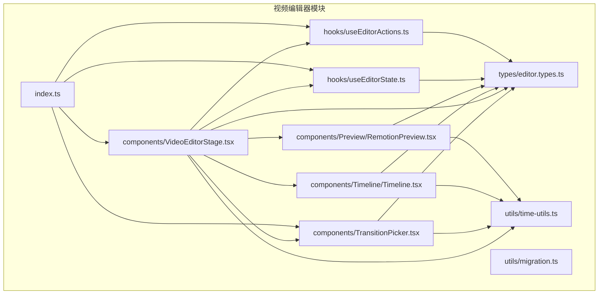
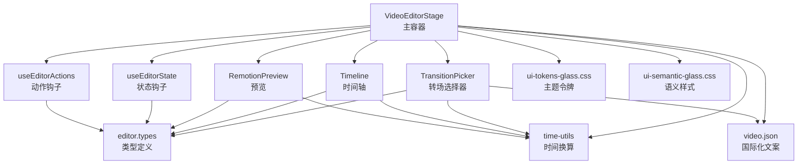
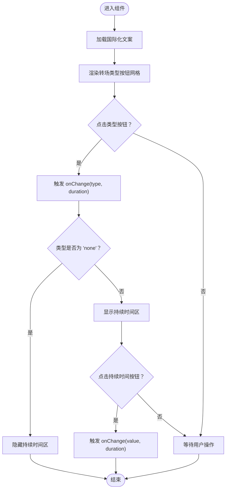
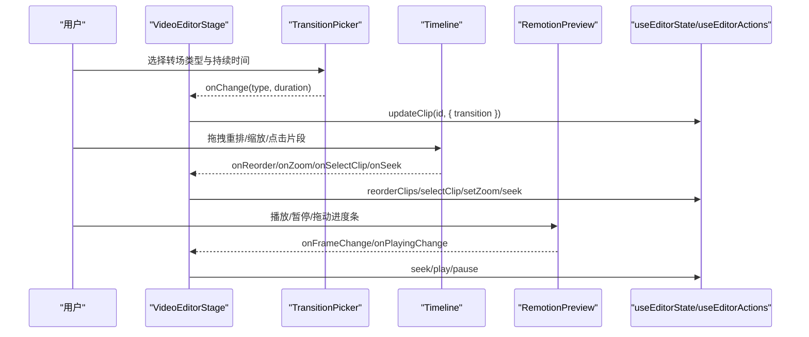
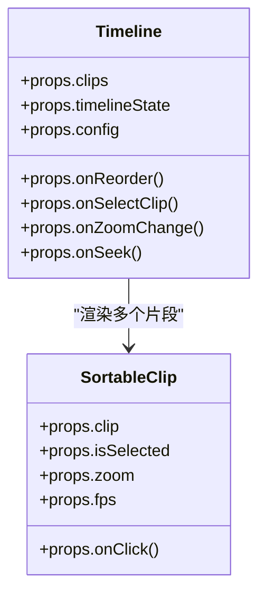
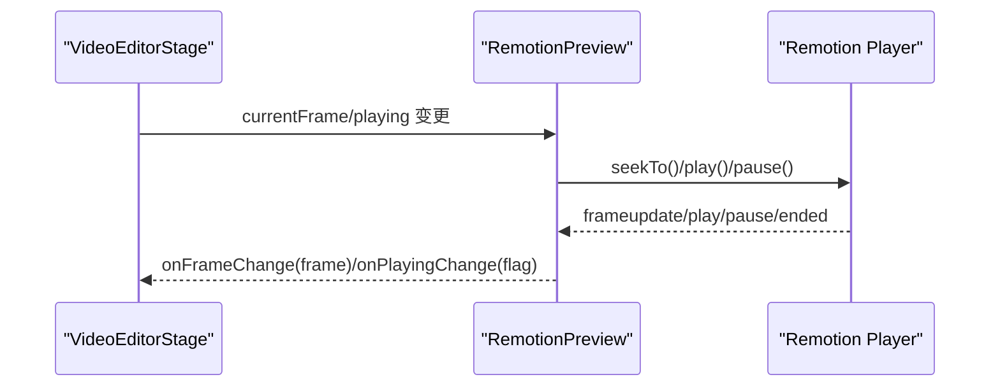
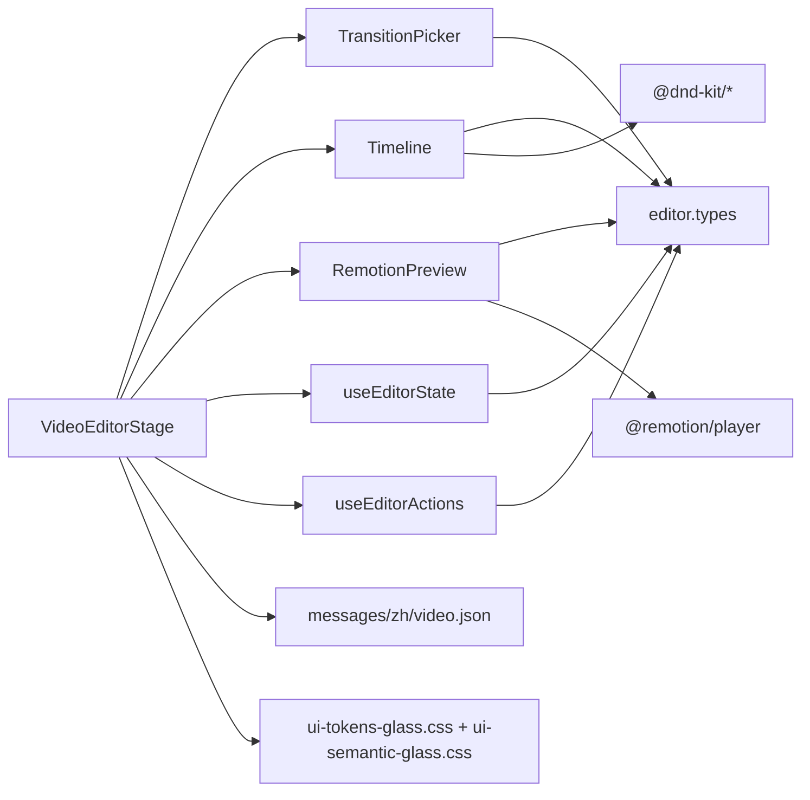

# 编辑器组件

<cite>
**本文引用的文件**   
- [src/features/video-editor/components/TransitionPicker.tsx](file://src/features/video-editor/components/TransitionPicker.tsx)
- [src/features/video-editor/components/VideoEditorStage.tsx](file://src/features/video-editor/components/VideoEditorStage.tsx)
- [src/features/video-editor/components/Timeline/Timeline.tsx](file://src/features/video-editor/components/Timeline/Timeline.tsx)
- [src/features/video-editor/components/Preview/RemotionPreview.tsx](file://src/features/video-editor/components/Preview/RemotionPreview.tsx)
- [src/features/video-editor/hooks/useEditorActions.ts](file://src/features/video-editor/hooks/useEditorActions.ts)
- [src/features/video-editor/hooks/useEditorState.ts](file://src/features/video-editor/hooks/useEditorState.ts)
- [src/features/video-editor/types/editor.types.ts](file://src/features/video-editor/types/editor.types.ts)
- [src/features/video-editor/utils/time-utils.ts](file://src/features/video-editor/utils/time-utils.ts)
- [src/features/video-editor/utils/migration.ts](file://src/features/video-editor/utils/migration.ts)
- [src/features/video-editor/index.ts](file://src/features/video-editor/index.ts)
- [messages/zh/video.json](file://messages/zh/video.json)
- [src/styles/ui-tokens-glass.css](file://src/styles/ui-tokens-glass.css)
- [src/styles/ui-semantic-glass.css](file://src/styles/ui-semantic-glass.css)
</cite>

## 目录
1. [简介](#简介)
2. [项目结构](#项目结构)
3. [核心组件](#核心组件)
4. [架构总览](#架构总览)
5. [组件详解](#组件详解)
6. [依赖关系分析](#依赖关系分析)
7. [性能考量](#性能考量)
8. [故障排查指南](#故障排查指南)
9. [结论](#结论)
10. [附录](#附录)

## 简介
本文件面向视频编辑器的UI组件系统，重点围绕以下目标展开：
- 深入解析 TransitionPicker 转场选择器的实现原理与交互设计
- 详述 VideoEditorStage 主编辑器容器的功能、布局与状态管理
- 阐明组件间通信机制与状态传递路径
- 解释组件的可复用性与扩展性设计原则
- 提供定制与主题适配方法、生命周期管理与性能优化策略
- 说明组件依赖关系与数据流，并给出使用示例与移动端适配建议
- 总结测试与调试最佳实践

## 项目结构
视频编辑器模块位于 features/video-editor，采用“功能域+分层”的组织方式：
- components：UI组件（转场选择器、编辑器容器、时间轴、预览等）
- hooks：状态与动作钩子（useEditorState、useEditorActions）
- types：编辑器核心类型定义
- utils：工具函数（时间换算、迁移校验）
- index.ts：对外公开的模块入口

图表来源
- [src/features/video-editor/components/VideoEditorStage.tsx:15-296](file://src/features/video-editor/components/VideoEditorStage.tsx#L15-L296)
- [src/features/video-editor/components/TransitionPicker.tsx:10-125](file://src/features/video-editor/components/TransitionPicker.tsx#L10-L125)
- [src/features/video-editor/components/Timeline/Timeline.tsx:24-379](file://src/features/video-editor/components/Timeline/Timeline.tsx#L24-L379)
- [src/features/video-editor/components/Preview/RemotionPreview.tsx:11-161](file://src/features/video-editor/components/Preview/RemotionPreview.tsx#L11-L161)
- [src/features/video-editor/hooks/useEditorState.ts:18-176](file://src/features/video-editor/hooks/useEditorState.ts#L18-L176)
- [src/features/video-editor/hooks/useEditorActions.ts:81-157](file://src/features/video-editor/hooks/useEditorActions.ts#L81-L157)
- [src/features/video-editor/types/editor.types.ts:9-141](file://src/features/video-editor/types/editor.types.ts#L9-L141)
- [src/features/video-editor/utils/time-utils.ts:7-95](file://src/features/video-editor/utils/time-utils.ts#L7-L95)
- [src/features/video-editor/utils/migration.ts:8-48](file://src/features/video-editor/utils/migration.ts#L8-L48)
- [src/features/video-editor/index.ts:5-43](file://src/features/video-editor/index.ts#L5-L43)

章节来源
- [src/features/video-editor/index.ts:1-43](file://src/features/video-editor/index.ts#L1-L43)

## 核心组件
- TransitionPicker：转场效果选择器，支持类型与持续时间双维度配置，基于国际化文案与玻璃风格主题
- VideoEditorStage：主编辑器容器，负责布局、工具栏、媒体库、预览、属性面板、时间轴与播放控制
- Timeline：时间轴组件，支持拖拽重排、缩放、进度条与播放头联动
- RemotionPreview：基于 Remotion Player 的预览封装，双向同步帧与播放状态
- useEditorState/useEditorActions：状态与动作钩子，统一管理项目数据、UI 状态与持久化/渲染动作
- 类型系统与工具：editor.types 定义项目结构；time-utils 提供帧/时间换算与默认项目生成；migration 提供版本迁移与校验

章节来源
- [src/features/video-editor/components/TransitionPicker.tsx:10-125](file://src/features/video-editor/components/TransitionPicker.tsx#L10-L125)
- [src/features/video-editor/components/VideoEditorStage.tsx:15-296](file://src/features/video-editor/components/VideoEditorStage.tsx#L15-L296)
- [src/features/video-editor/components/Timeline/Timeline.tsx:24-379](file://src/features/video-editor/components/Timeline/Timeline.tsx#L24-L379)
- [src/features/video-editor/components/Preview/RemotionPreview.tsx:11-161](file://src/features/video-editor/components/Preview/RemotionPreview.tsx#L11-L161)
- [src/features/video-editor/hooks/useEditorState.ts:18-176](file://src/features/video-editor/hooks/useEditorState.ts#L18-L176)
- [src/features/video-editor/hooks/useEditorActions.ts:81-157](file://src/features/video-editor/hooks/useEditorActions.ts#L81-L157)
- [src/features/video-editor/types/editor.types.ts:9-141](file://src/features/video-editor/types/editor.types.ts#L9-L141)
- [src/features/video-editor/utils/time-utils.ts:7-95](file://src/features/video-editor/utils/time-utils.ts#L7-L95)
- [src/features/video-editor/utils/migration.ts:8-48](file://src/features/video-editor/utils/migration.ts#L8-L48)

## 架构总览
编辑器采用“容器-组件-钩子-工具”分层：
- 容器层：VideoEditorStage 负责布局与协调
- 组件层：TransitionPicker、Timeline、RemotionPreview 等
- 钩子层：useEditorState 管理本地状态，useEditorActions 管理远程动作
- 工具层：类型定义、时间换算、迁移校验

图表来源
- [src/features/video-editor/components/VideoEditorStage.tsx:37-296](file://src/features/video-editor/components/VideoEditorStage.tsx#L37-L296)
- [src/features/video-editor/components/TransitionPicker.tsx:31-125](file://src/features/video-editor/components/TransitionPicker.tsx#L31-L125)
- [src/features/video-editor/components/Timeline/Timeline.tsx:38-379](file://src/features/video-editor/components/Timeline/Timeline.tsx#L38-L379)
- [src/features/video-editor/components/Preview/RemotionPreview.tsx:23-161](file://src/features/video-editor/components/Preview/RemotionPreview.tsx#L23-L161)
- [src/features/video-editor/hooks/useEditorState.ts:18-176](file://src/features/video-editor/hooks/useEditorState.ts#L18-L176)
- [src/features/video-editor/hooks/useEditorActions.ts:81-157](file://src/features/video-editor/hooks/useEditorActions.ts#L81-L157)
- [src/features/video-editor/types/editor.types.ts:9-141](file://src/features/video-editor/types/editor.types.ts#L9-L141)
- [src/features/video-editor/utils/time-utils.ts:7-95](file://src/features/video-editor/utils/time-utils.ts#L7-L95)
- [messages/zh/video.json:140-187](file://messages/zh/video.json#L140-L187)
- [src/styles/ui-tokens-glass.css:1-96](file://src/styles/ui-tokens-glass.css#L1-L96)
- [src/styles/ui-semantic-glass.css:1-465](file://src/styles/ui-semantic-glass.css#L1-L465)

## 组件详解

### TransitionPicker 转场选择器
- 功能概述
  - 提供转场类型与持续时间的双控界面，支持禁用态
  - 类型选项包括“无/溶解/淡入淡出/滑动”，持续时间提供 0.3s~1.5s 的离散选项
  - 基于国际化键值动态显示文案，使用 AppIcon 图标增强可读性
- 交互设计
  - 类型区采用网格布局，选中态高亮与边框强调
  - 持续时间区仅在非“无”时展示，便于快速切换
  - 支持禁用态以避免在不可编辑状态下误操作
- 数据与状态
  - 接收当前值与变更回调，向外抛出 (type, duration) 二元组
  - 内部维护常量选项集，保证 UI 与行为一致
- 主题与可访问性
  - 使用 CSS 变量实现主题一致性，支持低开销预设
  - 文案与图标颜色根据选中态动态调整，提升对比度

图表来源
- [src/features/video-editor/components/TransitionPicker.tsx:31-125](file://src/features/video-editor/components/TransitionPicker.tsx#L31-L125)
- [messages/zh/video.json:177-186](file://messages/zh/video.json#L177-L186)

章节来源
- [src/features/video-editor/components/TransitionPicker.tsx:10-125](file://src/features/video-editor/components/TransitionPicker.tsx#L10-L125)
- [messages/zh/video.json:177-186](file://messages/zh/video.json#L177-L186)

### VideoEditorStage 主编辑器容器
- 布局与职责
  - 工具栏：返回、时间显示、保存、导出
  - 左侧面板：媒体库占位
  - 中央区域：RemotionPreview 预览与播放控制
  - 右侧面板：所选片段属性与转场设置
  - 底部时间轴：Timeline 控制片段顺序、缩放与播放头
- 状态与动作
  - 通过 useEditorState 获取项目、时间轴 UI 状态与变更方法
  - 通过 useEditorActions 执行保存与渲染任务
  - 计算总时长与当前时间，驱动预览与时间轴显示
- 与子组件协作
  - 属性面板中的 TransitionPicker 通过 updateClip 更新片段转场
  - Timeline 的 onReorder/selectClip/zoom/seek 回调驱动全局状态
  - RemotionPreview 的 onFrameChange/onPlayingChange 与 timelineState 同步

图表来源
- [src/features/video-editor/components/VideoEditorStage.tsx:37-296](file://src/features/video-editor/components/VideoEditorStage.tsx#L37-L296)
- [src/features/video-editor/components/TransitionPicker.tsx:31-125](file://src/features/video-editor/components/TransitionPicker.tsx#L31-L125)
- [src/features/video-editor/components/Timeline/Timeline.tsx:38-379](file://src/features/video-editor/components/Timeline/Timeline.tsx#L38-L379)
- [src/features/video-editor/components/Preview/RemotionPreview.tsx:23-161](file://src/features/video-editor/components/Preview/RemotionPreview.tsx#L23-L161)
- [src/features/video-editor/hooks/useEditorState.ts:18-176](file://src/features/video-editor/hooks/useEditorState.ts#L18-L176)
- [src/features/video-editor/hooks/useEditorActions.ts:81-157](file://src/features/video-editor/hooks/useEditorActions.ts#L81-L157)

章节来源
- [src/features/video-editor/components/VideoEditorStage.tsx:15-296](file://src/features/video-editor/components/VideoEditorStage.tsx#L15-L296)

### Timeline 时间轴
- 能力概览
  - 使用 dnd-kit 实现片段拖拽排序
  - 支持缩放滑块、进度条与播放头联动
  - 显示视频轨道、配音轨道与 BGM 轨道
- 关键交互
  - 拖拽结束触发 onReorder，更新项目时间轴顺序
  - 点击进度条计算百分比并调用 onSeek
  - 点击片段触发 onSelectClip
  - 缩放滑块调用 onZoomChange
- 视觉反馈
  - 选中片段高亮边框，拖拽片段半透明与层级提升
  - 转场指示器以徽标形式标注

图表来源
- [src/features/video-editor/components/Timeline/Timeline.tsx:24-379](file://src/features/video-editor/components/Timeline/Timeline.tsx#L24-L379)

章节来源
- [src/features/video-editor/components/Timeline/Timeline.tsx:24-379](file://src/features/video-editor/components/Timeline/Timeline.tsx#L24-L379)

### RemotionPreview 预览
- 双向同步
  - 外部 currentFrame 变化时，通过 seekTo 同步到 Player
  - Player 的 frameupdate 事件回传当前帧，触发 onFrameChange
  - 播放/暂停/结束事件与 onPlayingChange 对接
- 渲染与尺寸
  - 基于 VideoComposition 渲染组合，按项目配置设置宽高与帧率
  - 总时长由 calculateTimelineDuration 计算，避免空片段导致异常
- 占位提示
  - 无片段时显示“添加素材开始编辑”的提示

图表来源
- [src/features/video-editor/components/Preview/RemotionPreview.tsx:23-161](file://src/features/video-editor/components/Preview/RemotionPreview.tsx#L23-L161)
- [src/features/video-editor/utils/time-utils.ts:7-21](file://src/features/video-editor/utils/time-utils.ts#L7-L21)

章节来源
- [src/features/video-editor/components/Preview/RemotionPreview.tsx:23-161](file://src/features/video-editor/components/Preview/RemotionPreview.tsx#L23-L161)

### 类型系统与工具
- 类型定义
  - VideoEditorProject、VideoClip、BgmClip、TimelineState 等核心类型
  - ClipTransition、ClipAttachment、ClipMetadata 等扩展字段
- 工具函数
  - calculateTimelineDuration：考虑转场重叠计算总时长
  - computeClipPositions：计算每个片段的起止帧
  - framesToTime/timeToFrames：帧与时分秒互转
  - createDefaultProject/generateClipId：默认项目与片段 ID 生成
- 迁移与校验
  - migrateProjectData：按 schemaVersion 迁移到最新版本
  - validateProjectData：基础完整性校验

章节来源
- [src/features/video-editor/types/editor.types.ts:9-141](file://src/features/video-editor/types/editor.types.ts#L9-L141)
- [src/features/video-editor/utils/time-utils.ts:7-95](file://src/features/video-editor/utils/time-utils.ts#L7-L95)
- [src/features/video-editor/utils/migration.ts:8-48](file://src/features/video-editor/utils/migration.ts#L8-L48)

## 依赖关系分析
- 组件依赖
  - VideoEditorStage 依赖 TransitionPicker、Timeline、RemotionPreview、useEditorState、useEditorActions
  - TransitionPicker 依赖 editor.types 与国际化资源
  - Timeline 依赖 editor.types、time-utils 与 dnd-kit
  - RemotionPreview 依赖 editor.types、time-utils 与 @remotion/player
- 数据流
  - 从 useEditorState 获取项目与 UI 状态，经 props 下发至子组件
  - 子组件通过回调修改状态，触发 isDirty 标记与后续持久化
- 外部接口
  - useEditorActions 通过 apiFetch 与后端交互，执行保存与渲染任务

图表来源
- [src/features/video-editor/components/VideoEditorStage.tsx:15-296](file://src/features/video-editor/components/VideoEditorStage.tsx#L15-L296)
- [src/features/video-editor/components/TransitionPicker.tsx:10-125](file://src/features/video-editor/components/TransitionPicker.tsx#L10-L125)
- [src/features/video-editor/components/Timeline/Timeline.tsx:13-22](file://src/features/video-editor/components/Timeline/Timeline.tsx#L13-L22)
- [src/features/video-editor/components/Preview/RemotionPreview.tsx:5-9](file://src/features/video-editor/components/Preview/RemotionPreview.tsx#L5-L9)
- [messages/zh/video.json:140-187](file://messages/zh/video.json#L140-L187)
- [src/styles/ui-tokens-glass.css:1-96](file://src/styles/ui-tokens-glass.css#L1-L96)
- [src/styles/ui-semantic-glass.css:1-465](file://src/styles/ui-semantic-glass.css#L1-L465)

章节来源
- [src/features/video-editor/components/VideoEditorStage.tsx:15-296](file://src/features/video-editor/components/VideoEditorStage.tsx#L15-L296)
- [src/features/video-editor/components/Timeline/Timeline.tsx:13-22](file://src/features/video-editor/components/Timeline/Timeline.tsx#L13-L22)
- [src/features/video-editor/components/Preview/RemotionPreview.tsx:5-9](file://src/features/video-editor/components/Preview/RemotionPreview.tsx#L5-L9)

## 性能考量
- 渲染性能
  - RemotionPreview 使用 useMemo 计算总时长，避免不必要的重渲染
  - Timeline 片段宽度按 zoom 线性缩放，注意大数据量时的 DOM 数量控制
- 同步与节流
  - RemotionPreview 在帧差大于阈值时才 seek，避免频繁同步导致抖动
  - 播放状态变化通过事件监听，减少轮询
- 主题与样式
  - 使用 CSS 变量与低开销预设，可在性能敏感环境启用 subtle 预设
  - 语义类名统一，减少重复样式计算
- 状态更新
  - useEditorState 通过不可变更新与批量 setState，降低重渲染成本
  - isDirty 标记仅在必要时触发保存按钮高亮

章节来源
- [src/features/video-editor/components/Preview/RemotionPreview.tsx:34-99](file://src/features/video-editor/components/Preview/RemotionPreview.tsx#L34-L99)
- [src/features/video-editor/components/Timeline/Timeline.tsx:180-214](file://src/features/video-editor/components/Timeline/Timeline.tsx#L180-L214)
- [src/styles/ui-tokens-glass.css:81-96](file://src/styles/ui-tokens-glass.css#L81-L96)
- [src/features/video-editor/hooks/useEditorState.ts:18-176](file://src/features/video-editor/hooks/useEditorState.ts#L18-L176)

## 故障排查指南
- 保存失败
  - 检查 useEditorActions.saveProject 的响应状态与错误日志
  - 确认 isDirty 状态与 markSaved 的调用时机
- 导出失败
  - 检查 startRender 的请求体与后端返回
  - 关注 getRenderStatus 的轮询与状态机
- 预览不同步
  - 确认 RemotionPreview 的事件监听是否正确绑定与解绑
  - 检查 seek 阈值与 currentFrame 变化频率
- 时间轴异常
  - 核对 calculateTimelineDuration 的转场重叠逻辑
  - 检查 computeClipPositions 的累积起止帧计算
- 国际化缺失
  - 确认 video.json 中对应键值存在且拼写正确

章节来源
- [src/features/video-editor/hooks/useEditorActions.ts:85-154](file://src/features/video-editor/hooks/useEditorActions.ts#L85-L154)
- [src/features/video-editor/components/Preview/RemotionPreview.tsx:63-100](file://src/features/video-editor/components/Preview/RemotionPreview.tsx#L63-L100)
- [src/features/video-editor/utils/time-utils.ts:7-47](file://src/features/video-editor/utils/time-utils.ts#L7-L47)
- [messages/zh/video.json:140-187](file://messages/zh/video.json#L140-L187)

## 结论
该组件体系以清晰的分层与稳定的类型定义为基础，通过钩子与工具函数实现状态与行为的解耦。TransitionPicker 与 VideoEditorStage 的组合提供了直观的转场编辑体验；Timeline 与 RemotionPreview 则确保了时间轴与预览的高效协同。主题系统与国际化资源使组件具备良好的可定制性与可扩展性。

## 附录

### 组件可复用性与扩展性设计
- 类型优先：通过 editor.types 明确数据契约，便于替换底层实现
- 钩子抽象：useEditorState/useEditorActions 将业务逻辑与 UI 解耦，便于测试与替换
- 组件边界：各组件通过 props 与回调通信，降低耦合度
- 主题与样式：CSS 变量与语义类名统一风格，便于主题切换与定制

章节来源
- [src/features/video-editor/types/editor.types.ts:9-141](file://src/features/video-editor/types/editor.types.ts#L9-L141)
- [src/features/video-editor/hooks/useEditorState.ts:18-176](file://src/features/video-editor/hooks/useEditorState.ts#L18-L176)
- [src/features/video-editor/hooks/useEditorActions.ts:81-157](file://src/features/video-editor/hooks/useEditorActions.ts#L81-L157)
- [src/styles/ui-tokens-glass.css:1-96](file://src/styles/ui-tokens-glass.css#L1-L96)
- [src/styles/ui-semantic-glass.css:1-465](file://src/styles/ui-semantic-glass.css#L1-L465)

### 主题适配与定制
- 使用 ui-tokens-glass.css 定义主题令牌，覆盖背景、文字、边框、阴影、圆角与密度
- 通过 ui-semantic-glass.css 提供语义化样式类，统一按钮、输入、滚动条等组件风格
- 在性能敏感场景启用 data-glass-preset="subtle" 降低模糊与阴影开销

章节来源
- [src/styles/ui-tokens-glass.css:1-96](file://src/styles/ui-tokens-glass.css#L1-L96)
- [src/styles/ui-semantic-glass.css:1-465](file://src/styles/ui-semantic-glass.css#L1-L465)

### 生命周期管理
- 组件挂载：useEffect 绑定事件监听；卸载时清理监听，避免内存泄漏
- 状态更新：useCallback 包裹回调，减少子组件重渲染
- 项目重置：resetProject/loadProject/markSaved 提供明确的生命周期节点

章节来源
- [src/features/video-editor/components/Preview/RemotionPreview.tsx:77-100](file://src/features/video-editor/components/Preview/RemotionPreview.tsx#L77-L100)
- [src/features/video-editor/hooks/useEditorState.ts:18-176](file://src/features/video-editor/hooks/useEditorState.ts#L18-L176)

### 组件使用示例与集成指南
- 基本集成
  - 引入 VideoEditorStage 并传入 projectId/episodeId/initialProject
  - 在属性面板中嵌入 TransitionPicker，并通过 updateClip 更新片段转场
  - 将 Timeline 的 onReorder/onSelectClip/onZoomChange/onSeek 回调接入 useEditorState
- 自定义转场
  - 在 onChange 中处理新类型与持续时间，必要时扩展 DURATION_OPTIONS
- 主题切换
  - 通过切换 data-glass-preset 或覆盖 CSS 变量实现主题切换

章节来源
- [src/features/video-editor/components/VideoEditorStage.tsx:244-253](file://src/features/video-editor/components/VideoEditorStage.tsx#L244-L253)
- [src/features/video-editor/components/TransitionPicker.tsx:58-119](file://src/features/video-editor/components/TransitionPicker.tsx#L58-L119)
- [src/features/video-editor/components/Timeline/Timeline.tsx:62-70](file://src/features/video-editor/components/Timeline/Timeline.tsx#L62-L70)

### 响应式设计与移动端适配
- 布局策略
  - 使用 Flex 布局与相对单位，配合 CSS 变量实现深浅主题自适应
  - 时间轴与预览区域支持滚动与等比缩放
- 交互优化
  - dnd-kit 的 PointerSensor/KeyboardSensor 适配触摸与键盘
  - 播放控制按钮尺寸与间距适合移动端点击
- 性能优化
  - subtle 预设降低模糊与阴影开销，改善移动端性能

章节来源
- [src/features/video-editor/components/VideoEditorStage.tsx:134-291](file://src/features/video-editor/components/VideoEditorStage.tsx#L134-L291)
- [src/features/video-editor/components/Timeline/Timeline.tsx:51-60](file://src/features/video-editor/components/Timeline/Timeline.tsx#L51-L60)
- [src/styles/ui-tokens-glass.css:81-96](file://src/styles/ui-tokens-glass.css#L81-L96)

### 测试与调试最佳实践
- 单元测试
  - 对 useEditorState 的增删改查进行断言，覆盖边界条件（空片段、负缩放）
  - 对 TransitionPicker 的 onChange 行为进行快照测试
- 集成测试
  - 模拟 RemotionPreview 的事件流，验证帧同步与播放状态
  - 使用 createDefaultProject 与 migrateProjectData 验证数据迁移
- 调试技巧
  - 使用 isDirty 与 markSaved 的组合验证保存流程
  - 在 startRender 前检查项目完整性（validateProjectData）

章节来源
- [src/features/video-editor/hooks/useEditorState.ts:39-176](file://src/features/video-editor/hooks/useEditorState.ts#L39-L176)
- [src/features/video-editor/components/TransitionPicker.tsx:31-125](file://src/features/video-editor/components/TransitionPicker.tsx#L31-L125)
- [src/features/video-editor/components/Preview/RemotionPreview.tsx:63-100](file://src/features/video-editor/components/Preview/RemotionPreview.tsx#L63-L100)
- [src/features/video-editor/utils/migration.ts:32-48](file://src/features/video-editor/utils/migration.ts#L32-L48)