# 视频编辑器

<cite>
**本文引用的文件**
- [src/features/video-editor/index.ts](file://src/features/video-editor/index.ts)
- [src/features/video-editor/types/editor.types.ts](file://src/features/video-editor/types/editor.types.ts)
- [src/features/video-editor/utils/time-utils.ts](file://src/features/video-editor/utils/time-utils.ts)
- [src/features/video-editor/utils/migration.ts](file://src/features/video-editor/utils/migration.ts)
- [src/features/video-editor/hooks/useEditorState.ts](file://src/features/video-editor/hooks/useEditorState.ts)
- [src/features/video-editor/hooks/useEditorActions.ts](file://src/features/video-editor/hooks/useEditorActions.ts)
- [src/features/video-editor/components/VideoEditorStage.tsx](file://src/features/video-editor/components/VideoEditorStage.tsx)
- [src/features/video-editor/components/Preview/RemotionPreview.tsx](file://src/features/video-editor/components/Preview/RemotionPreview.tsx)
- [src/features/video-editor/components/Timeline/index.ts](file://src/features/video-editor/components/Timeline/index.ts)
- [src/features/video-editor/components/TransitionPicker.tsx](file://src/features/video-editor/components/TransitionPicker.tsx)
- [src/features/video-editor/remotion/VideoComposition.tsx](file://src/features/video-editor/remotion/VideoComposition.tsx)
- [src/lib/storage/index.ts](file://src/lib/storage/index.ts)
</cite>

## 目录
1. [简介](#简介)
2. [项目结构](#项目结构)
3. [核心组件](#核心组件)
4. [架构总览](#架构总览)
5. [详细组件分析](#详细组件分析)
6. [依赖关系分析](#依赖关系分析)
7. [性能考量](#性能考量)
8. [故障排查指南](#故障排查指南)
9. [结论](#结论)
10. [附录](#附录)

## 简介
本文件面向Waoowaoo的视频编辑器功能，围绕基于Remotion的视频合成与播放进行系统化技术说明。内容涵盖时间线编辑、预览系统、渲染引擎、视频合成与特效、音频同步与字幕、多轨道编辑、导出格式与质量配置、与AI生成内容的集成（自动剪辑与智能拼接）、UI组件架构与状态管理、用户交互设计、以及与外部存储服务的集成与文件管理机制。文档同时提供流程图与时序图帮助理解关键工作流。

## 项目结构
视频编辑器模块位于 src/features/video-editor 下，采用“类型定义 → 工具函数 → Hooks → 组件 → Remotion合成”的分层组织方式；预览与渲染通过Remotion Player与VideoComposition实现；与存储系统的集成通过统一的存储抽象层完成。

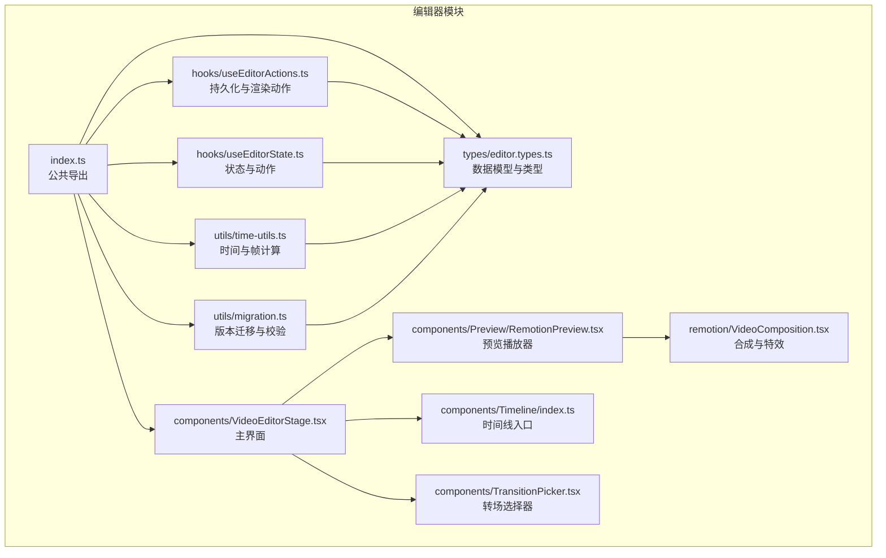

图表来源
- [src/features/video-editor/index.ts:1-43](file://src/features/video-editor/index.ts#L1-L43)
- [src/features/video-editor/types/editor.types.ts:1-141](file://src/features/video-editor/types/editor.types.ts#L1-L141)
- [src/features/video-editor/utils/time-utils.ts:1-95](file://src/features/video-editor/utils/time-utils.ts#L1-L95)
- [src/features/video-editor/utils/migration.ts:1-48](file://src/features/video-editor/utils/migration.ts#L1-L48)
- [src/features/video-editor/hooks/useEditorState.ts:1-176](file://src/features/video-editor/hooks/useEditorState.ts#L1-L176)
- [src/features/video-editor/hooks/useEditorActions.ts:1-157](file://src/features/video-editor/hooks/useEditorActions.ts#L1-L157)
- [src/features/video-editor/components/VideoEditorStage.tsx:1-296](file://src/features/video-editor/components/VideoEditorStage.tsx#L1-L296)
- [src/features/video-editor/components/Preview/RemotionPreview.tsx:1-161](file://src/features/video-editor/components/Preview/RemotionPreview.tsx#L1-L161)
- [src/features/video-editor/components/Timeline/index.ts:1-2](file://src/features/video-editor/components/Timeline/index.ts#L1-L2)
- [src/features/video-editor/components/TransitionPicker.tsx:1-125](file://src/features/video-editor/components/TransitionPicker.tsx#L1-L125)
- [src/features/video-editor/remotion/VideoComposition.tsx:1-237](file://src/features/video-editor/remotion/VideoComposition.tsx#L1-L237)

章节来源
- [src/features/video-editor/index.ts:1-43](file://src/features/video-editor/index.ts#L1-L43)

## 核心组件
- 数据模型与类型：定义视频编辑项目、片段、BGM轨道、转场、元数据、时间轴状态、渲染请求与状态等核心类型，确保前后端一致的数据契约。
- 时间与帧工具：提供帧数与时间字符串互转、计算时间轴总时长（考虑转场重叠）、计算片段起止帧位置、生成唯一ID、创建默认项目等。
- 版本迁移与校验：对项目数据进行schema版本迁移与完整性校验，保证跨版本兼容与数据安全。
- 状态与动作：集中管理项目数据、时间轴UI状态、播放控制、片段增删改、BGM增删、缩放与选择等；提供重置、加载与标记保存等项目级操作。
- 持久化与渲染：封装保存项目、加载项目、发起渲染、查询渲染状态等API调用；提供从已生成面板快速构建编辑项目的工厂方法。
- UI与预览：主编辑器界面包含工具栏、媒体库、预览区、属性面板与时间线；Remotion预览组件负责与Player双向同步播放进度与状态；转场选择器提供转场类型与持续时间配置。
- 合成与特效：Remotion合成组件以Sequence组织磁性时间轴，支持片段间转场（溶解/淡入淡出/滑动），BGM轨道支持淡入淡出，字幕叠加支持样式切换。

章节来源
- [src/features/video-editor/types/editor.types.ts:1-141](file://src/features/video-editor/types/editor.types.ts#L1-L141)
- [src/features/video-editor/utils/time-utils.ts:1-95](file://src/features/video-editor/utils/time-utils.ts#L1-L95)
- [src/features/video-editor/utils/migration.ts:1-48](file://src/features/video-editor/utils/migration.ts#L1-L48)
- [src/features/video-editor/hooks/useEditorState.ts:1-176](file://src/features/video-editor/hooks/useEditorState.ts#L1-L176)
- [src/features/video-editor/hooks/useEditorActions.ts:1-157](file://src/features/video-editor/hooks/useEditorActions.ts#L1-L157)
- [src/features/video-editor/components/VideoEditorStage.tsx:1-296](file://src/features/video-editor/components/VideoEditorStage.tsx#L1-L296)
- [src/features/video-editor/components/Preview/RemotionPreview.tsx:1-161](file://src/features/video-editor/components/Preview/RemotionPreview.tsx#L1-L161)
- [src/features/video-editor/components/TransitionPicker.tsx:1-125](file://src/features/video-editor/components/TransitionPicker.tsx#L1-L125)
- [src/features/video-editor/remotion/VideoComposition.tsx:1-237](file://src/features/video-editor/remotion/VideoComposition.tsx#L1-L237)

## 架构总览
编辑器采用“前端状态驱动 + Remotion合成渲染”的架构：UI通过Hooks维护项目与播放状态，Remotion Player承载预览播放，VideoComposition负责视频合成与特效，API层负责项目持久化与渲染任务调度，存储层负责素材与产物的上传与签名访问。

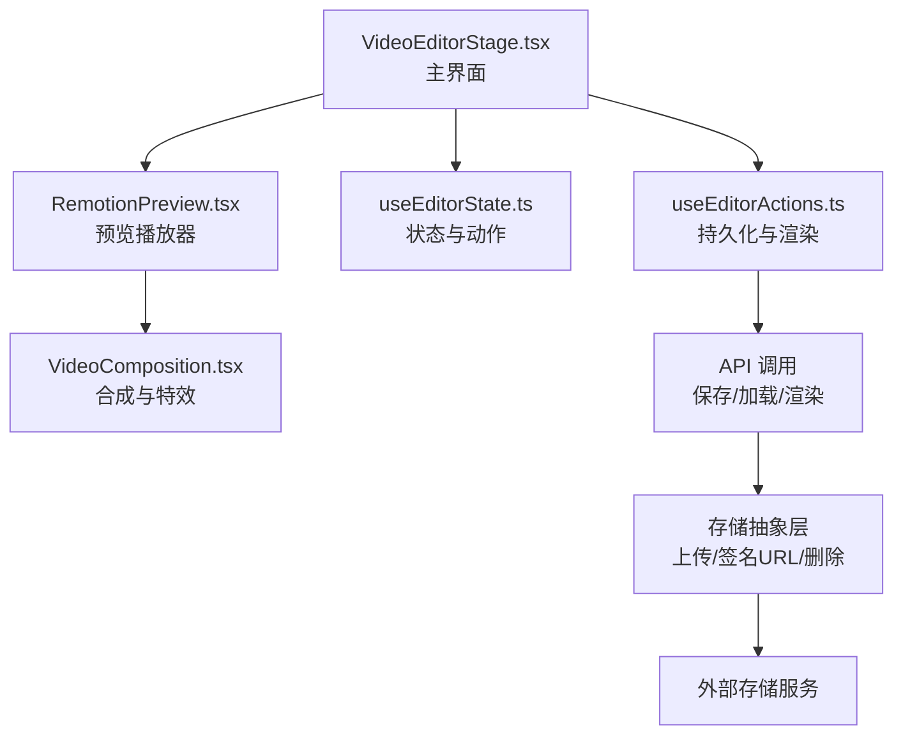

图表来源
- [src/features/video-editor/components/VideoEditorStage.tsx:1-296](file://src/features/video-editor/components/VideoEditorStage.tsx#L1-L296)
- [src/features/video-editor/components/Preview/RemotionPreview.tsx:1-161](file://src/features/video-editor/components/Preview/RemotionPreview.tsx#L1-L161)
- [src/features/video-editor/hooks/useEditorState.ts:1-176](file://src/features/video-editor/hooks/useEditorState.ts#L1-L176)
- [src/features/video-editor/hooks/useEditorActions.ts:1-157](file://src/features/video-editor/hooks/useEditorActions.ts#L1-L157)
- [src/features/video-editor/remotion/VideoComposition.tsx:1-237](file://src/features/video-editor/remotion/VideoComposition.tsx#L1-L237)
- [src/lib/storage/index.ts:1-142](file://src/lib/storage/index.ts#L1-L142)

## 详细组件分析

### 数据模型与类型
- 项目结构：包含配置（帧率、分辨率）、主时间轴（磁性轨道）、BGM轨道。
- 片段：支持源地址、时长、素材内裁剪、附属内容（配音、字幕）、转场、元数据（面板/故事板ID）。
- BGM：支持绝对定位、音量、淡入淡出。
- UI状态：当前帧、播放状态、选中片段、缩放。
- 渲染：请求格式（mp4/webm）、质量（草稿/高质量），状态（待定/渲染中/完成/失败）。

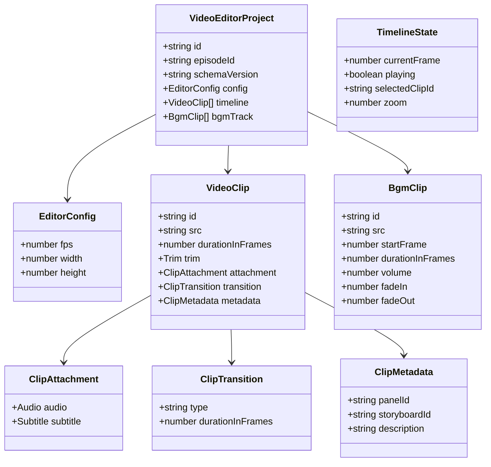

图表来源
- [src/features/video-editor/types/editor.types.ts:6-141](file://src/features/video-editor/types/editor.types.ts#L6-L141)

章节来源
- [src/features/video-editor/types/editor.types.ts:1-141](file://src/features/video-editor/types/editor.types.ts#L1-L141)

### 时间与帧计算
- 总时长计算：考虑转场重叠，最后一个片段不减去转场时间。
- 片段位置计算：按磁性轨道累加，考虑转场一半重叠。
- 时间格式转换：帧数与“分:秒.百分秒”互转。
- 默认项目与ID生成：提供默认分辨率/帧率、空时间轴与BGM轨道，生成唯一片段ID。

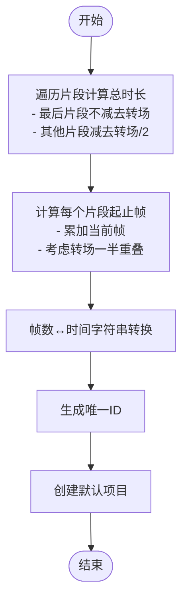

图表来源
- [src/features/video-editor/utils/time-utils.ts:3-95](file://src/features/video-editor/utils/time-utils.ts#L3-L95)

章节来源
- [src/features/video-editor/utils/time-utils.ts:1-95](file://src/features/video-editor/utils/time-utils.ts#L1-L95)

### 版本迁移与校验
- 迁移：根据schemaVersion进行版本迁移，未知或缺失版本按最新版本处理并告警。
- 校验：检查项目关键字段完整性，返回错误列表以便提示修复。

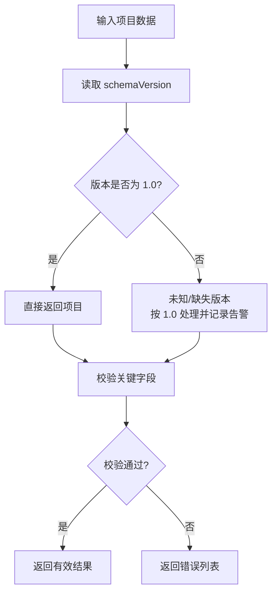

图表来源
- [src/features/video-editor/utils/migration.ts:4-48](file://src/features/video-editor/utils/migration.ts#L4-L48)

章节来源
- [src/features/video-editor/utils/migration.ts:1-48](file://src/features/video-editor/utils/migration.ts#L1-L48)

### 状态与动作（Hooks）
- useEditorState：集中管理项目与UI状态，提供片段增删改、排序、BGM增删、播放控制、缩放、选择、重置/加载/标记保存等。
- useEditorActions：封装保存/加载项目、发起渲染、查询渲染状态；提供从面板数据创建编辑项目的工厂方法，自动匹配配音与字幕，设置默认转场。

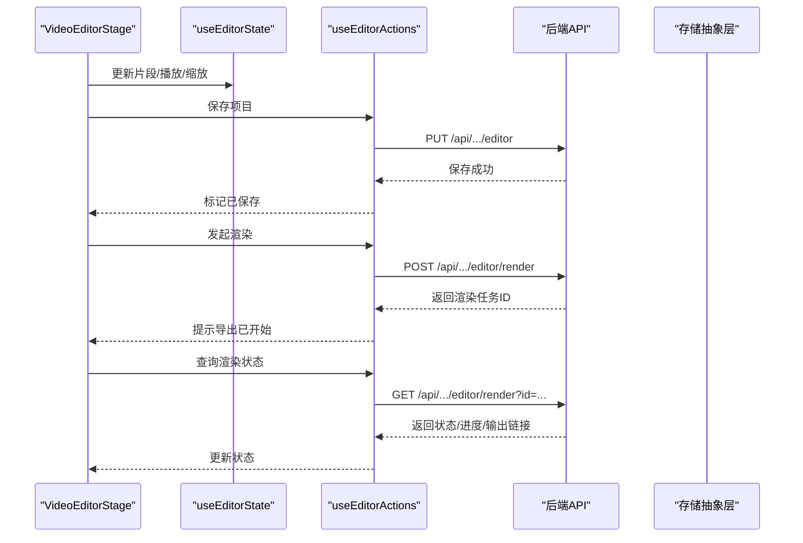

图表来源
- [src/features/video-editor/components/VideoEditorStage.tsx:65-84](file://src/features/video-editor/components/VideoEditorStage.tsx#L65-L84)
- [src/features/video-editor/hooks/useEditorActions.ts:85-148](file://src/features/video-editor/hooks/useEditorActions.ts#L85-L148)
- [src/features/video-editor/hooks/useEditorState.ts:18-176](file://src/features/video-editor/hooks/useEditorState.ts#L18-L176)

章节来源
- [src/features/video-editor/hooks/useEditorState.ts:1-176](file://src/features/video-editor/hooks/useEditorState.ts#L1-L176)
- [src/features/video-editor/hooks/useEditorActions.ts:1-157](file://src/features/video-editor/hooks/useEditorActions.ts#L1-L157)

### 预览系统（Remotion Player）
- 双向同步：外部currentFrame变化触发Player seek；Player帧更新回调同步回UI；播放/暂停状态也相互同步。
- 占位提示：当时间轴为空时显示引导文案与图标。
- 参数传递：将项目中的片段、BGM与配置传给VideoComposition，计算总时长并设置播放参数。

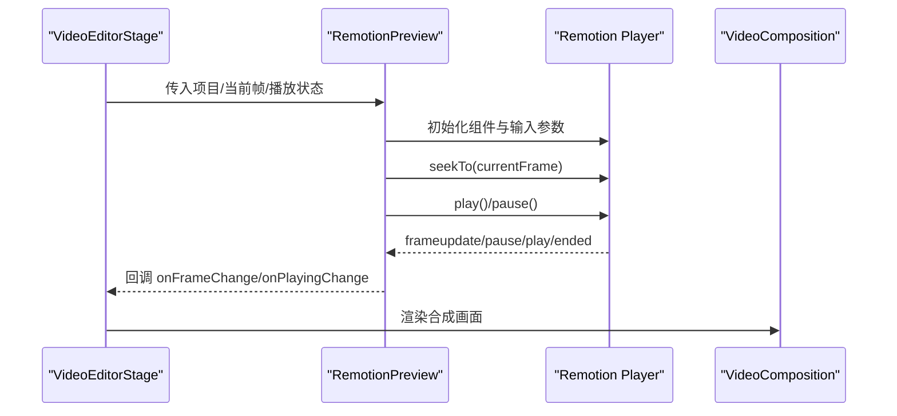

图表来源
- [src/features/video-editor/components/Preview/RemotionPreview.tsx:19-161](file://src/features/video-editor/components/Preview/RemotionPreview.tsx#L19-L161)
- [src/features/video-editor/remotion/VideoComposition.tsx:12-60](file://src/features/video-editor/remotion/VideoComposition.tsx#L12-L60)

章节来源
- [src/features/video-editor/components/Preview/RemotionPreview.tsx:1-161](file://src/features/video-editor/components/Preview/RemotionPreview.tsx#L1-L161)

### 合成与特效（Remotion）
- 磁性时间轴：使用Sequence按片段起止帧排列，配合computeClipPositions计算重叠。
- 片段转场：在片段边界计算入场/出场转场进度，支持溶解/淡入淡出/滑动。
- BGM轨道：支持淡入淡出，按帧插值调整音量。
- 字幕叠加：支持默认与电影风格两种样式，居底叠加。

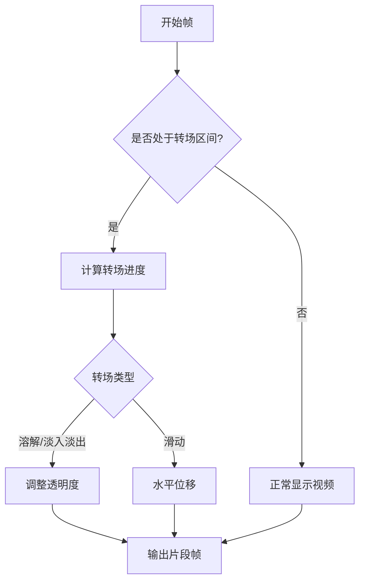

图表来源
- [src/features/video-editor/remotion/VideoComposition.tsx:116-192](file://src/features/video-editor/remotion/VideoComposition.tsx#L116-L192)

章节来源
- [src/features/video-editor/remotion/VideoComposition.tsx:1-237](file://src/features/video-editor/remotion/VideoComposition.tsx#L1-L237)

### UI组件与交互
- 主界面布局：工具栏（返回/保存/导出）、左侧媒体库、中心预览与播放控件、右侧属性面板（片段信息与转场设置）、底部时间线。
- 属性面板：展示片段描述与时长，提供转场类型与持续时间选择，支持删除片段。
- 时间线：接收片段列表、UI状态与配置，支持拖拽重排、缩放、跳转。

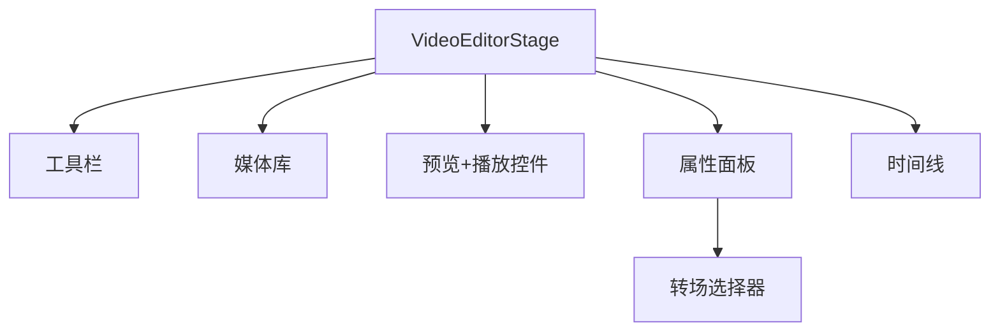

图表来源
- [src/features/video-editor/components/VideoEditorStage.tsx:22-296](file://src/features/video-editor/components/VideoEditorStage.tsx#L22-L296)
- [src/features/video-editor/components/TransitionPicker.tsx:10-125](file://src/features/video-editor/components/TransitionPicker.tsx#L10-L125)
- [src/features/video-editor/components/Timeline/index.ts:1-2](file://src/features/video-editor/components/Timeline/index.ts#L1-L2)

章节来源
- [src/features/video-editor/components/VideoEditorStage.tsx:1-296](file://src/features/video-editor/components/VideoEditorStage.tsx#L1-L296)
- [src/features/video-editor/components/TransitionPicker.tsx:1-125](file://src/features/video-editor/components/TransitionPicker.tsx#L1-L125)

### 与AI生成内容的集成
- 自动剪辑与智能拼接：提供从已生成面板数据创建编辑项目的工厂方法，自动匹配配音与字幕，按面板顺序生成片段并设置默认转场。
- 面板数据类型：灵活接受多种面板字段，便于与不同来源的AI生成面板对接。

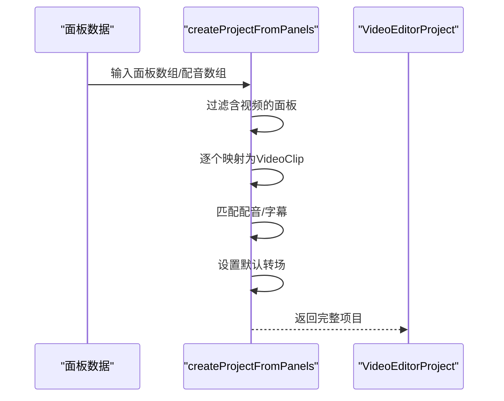

图表来源
- [src/features/video-editor/hooks/useEditorActions.ts:27-79](file://src/features/video-editor/hooks/useEditorActions.ts#L27-L79)

章节来源
- [src/features/video-editor/hooks/useEditorActions.ts:1-157](file://src/features/video-editor/hooks/useEditorActions.ts#L1-L157)

### 存储与文件管理
- 存储抽象：统一的存储提供者接口，支持本地与远端存储，提供上传、删除、批量删除、签名URL、提取键等能力。
- 文件下载与上传：支持下载远程图片/视频并上传至目标键，带重试与质量压缩策略。
- 签名访问：根据存储类型生成直链或后端签名URL，便于前端安全访问。

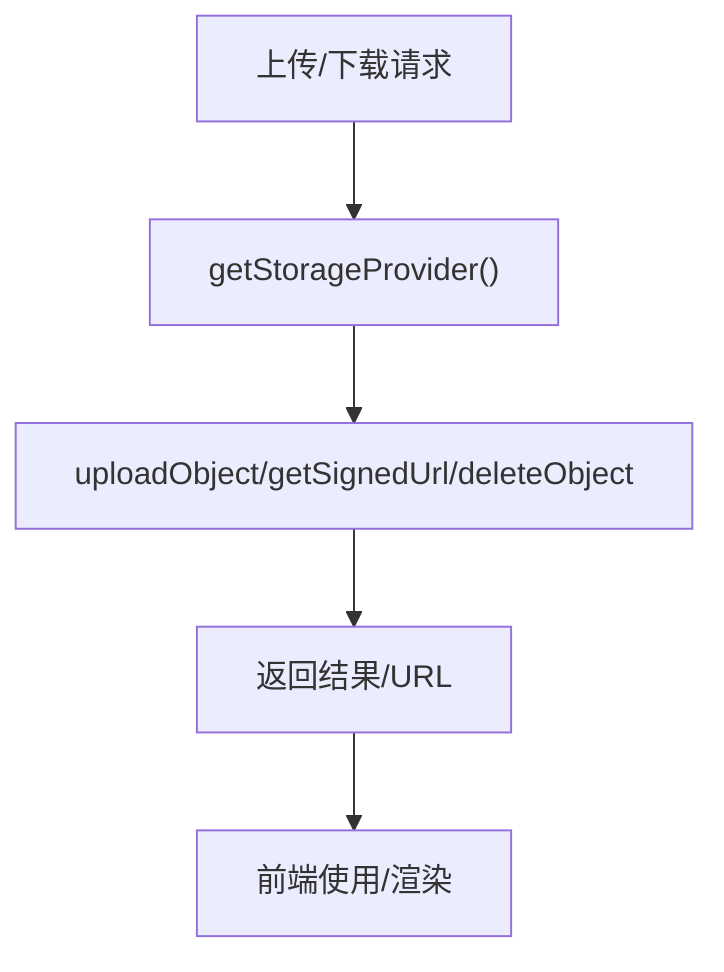

图表来源
- [src/lib/storage/index.ts:15-142](file://src/lib/storage/index.ts#L15-L142)

章节来源
- [src/lib/storage/index.ts:1-142](file://src/lib/storage/index.ts#L1-L142)

## 依赖关系分析
- 组件耦合：VideoEditorStage依赖RemotionPreview、Timeline与TransitionPicker；RemotionPreview依赖VideoComposition；Hooks提供跨组件共享的状态与动作。
- 外部依赖：Remotion Player/Player用于预览播放；API层用于项目持久化与渲染任务；存储抽象层用于素材与产物管理。
- 类型一致性：所有数据结构在types中定义，确保前后端与UI层的一致性。

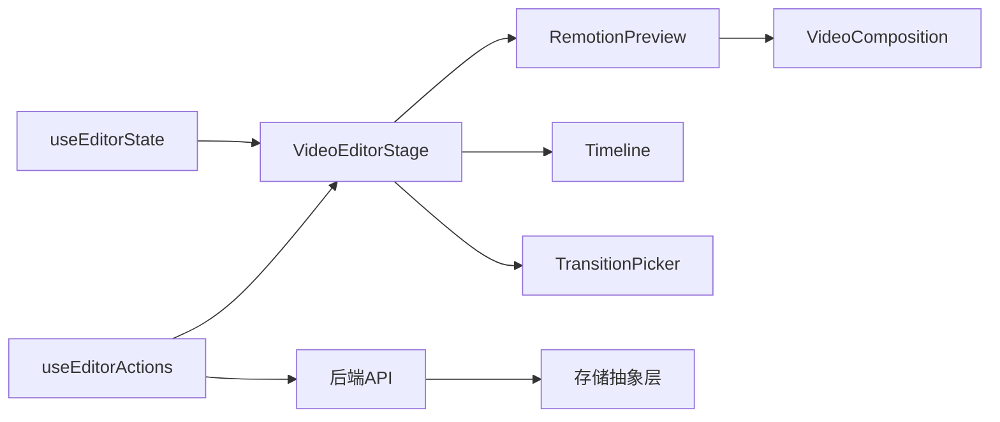

图表来源
- [src/features/video-editor/components/VideoEditorStage.tsx:1-296](file://src/features/video-editor/components/VideoEditorStage.tsx#L1-L296)
- [src/features/video-editor/components/Preview/RemotionPreview.tsx:1-161](file://src/features/video-editor/components/Preview/RemotionPreview.tsx#L1-L161)
- [src/features/video-editor/hooks/useEditorState.ts:1-176](file://src/features/video-editor/hooks/useEditorState.ts#L1-L176)
- [src/features/video-editor/hooks/useEditorActions.ts:1-157](file://src/features/video-editor/hooks/useEditorActions.ts#L1-L157)
- [src/features/video-editor/remotion/VideoComposition.tsx:1-237](file://src/features/video-editor/remotion/VideoComposition.tsx#L1-L237)

章节来源
- [src/features/video-editor/index.ts:1-43](file://src/features/video-editor/index.ts#L1-L43)

## 性能考量
- 合成性能：Remotion基于浏览器Canvas/WebGL渲染，建议合理设置分辨率与帧率；避免过长的转场持续时间导致额外计算开销。
- 预览同步：RemotionPreview对帧同步做了防抖（仅当帧差大于阈值时seek），减少频繁跳转带来的性能损耗。
- 渲染质量：导出质量分为草稿与高质量，建议在预览阶段使用较低质量以提升交互流畅度。
- 存储上传：下载与上传过程具备重试机制，建议在网络不稳定场景下适当增加重试次数与延迟。

## 故障排查指南
- 保存失败：检查API响应状态，确认网络连通与权限；查看日志输出以定位具体错误。
- 导出失败：确认渲染任务已正确提交，检查后端任务队列与存储可用性；通过查询渲染状态接口获取错误详情。
- 预览卡顿：降低分辨率或帧率，减少转场复杂度；避免在大量片段同时播放时频繁seek。
- 字幕/配音异常：检查片段附件字段是否正确设置，确认资源URL可访问且签名有效。

章节来源
- [src/features/video-editor/hooks/useEditorActions.ts:85-148](file://src/features/video-editor/hooks/useEditorActions.ts#L85-L148)
- [src/features/video-editor/components/Preview/RemotionPreview.tsx:39-100](file://src/features/video-editor/components/Preview/RemotionPreview.tsx#L39-L100)

## 结论
该视频编辑器以Remotion为核心，结合统一的类型系统、状态管理与存储抽象，实现了从时间线编辑、预览播放到渲染导出的完整闭环。通过转场、BGM与字幕等特效的模块化实现，满足基础视频编辑需求；通过与AI生成内容的集成，支持自动剪辑与智能拼接；通过存储抽象层实现与外部存储服务的解耦。后续可在渲染并发、缓存策略与UI交互细节上进一步优化。

## 附录
- 使用示例
  - 在主界面初始化编辑器并传入初始项目数据。
  - 通过属性面板为选中片段设置转场类型与持续时间。
  - 点击“导出”发起渲染任务，随后轮询渲染状态直至完成。
- 自定义扩展
  - 新增转场类型：在类型定义中扩展ClipTransition.type，并在合成组件中实现对应逻辑。
  - 新增渲染格式：在渲染请求类型中添加新格式并在后端适配相应编码器。
  - 扩展存储提供商：实现存储抽象层接口并替换默认提供者。