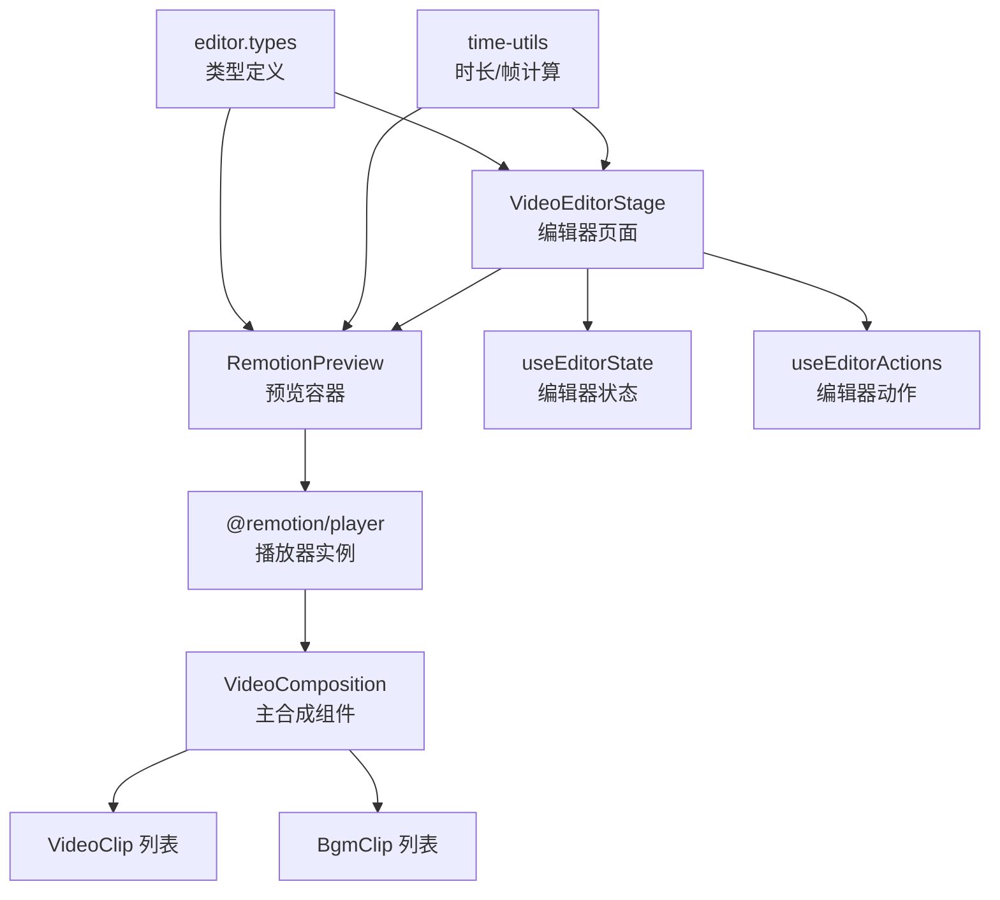
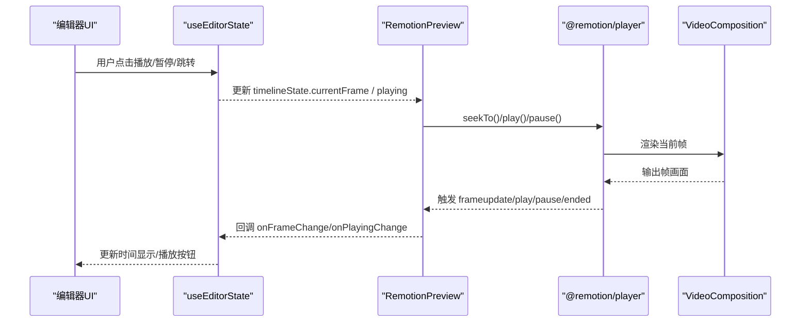
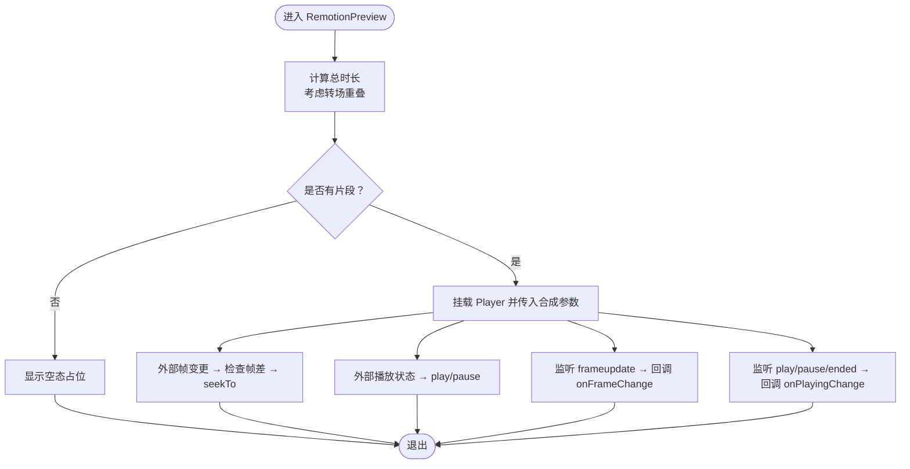
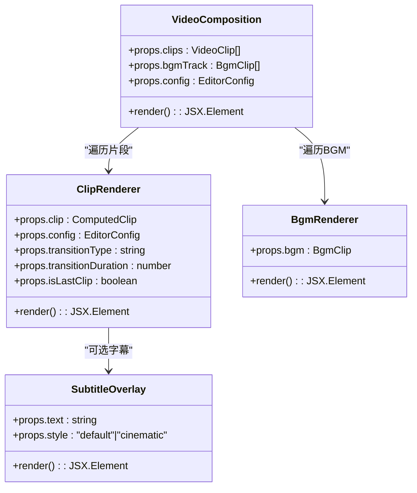
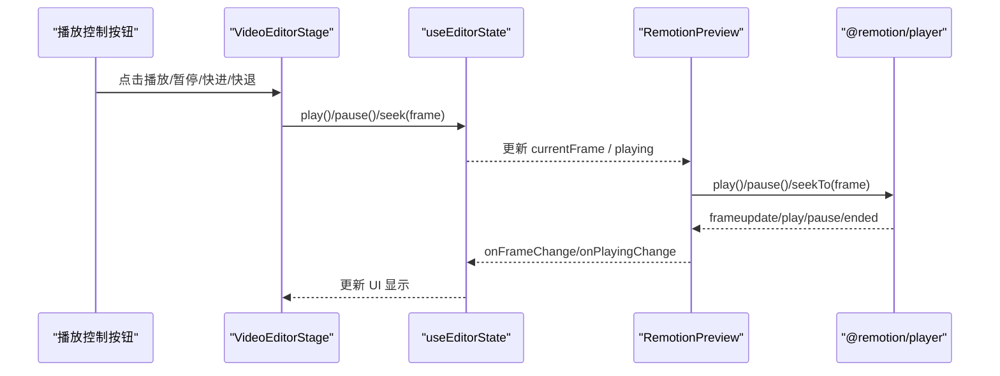
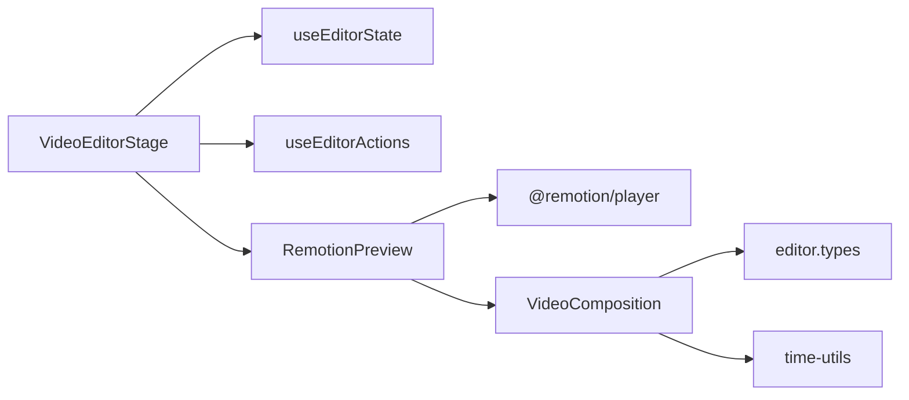

# 预览系统

<cite>
**本文引用的文件**
- [RemotionPreview.tsx](file://src/features/video-editor/components/Preview/RemotionPreview.tsx)
- [VideoComposition.tsx](file://src/features/video-editor/remotion/VideoComposition.tsx)
- [VideoEditorStage.tsx](file://src/features/video-editor/components/VideoEditorStage.tsx)
- [useEditorState.ts](file://src/features/video-editor/hooks/useEditorState.ts)
- [useEditorActions.ts](file://src/features/video-editor/hooks/useEditorActions.ts)
- [time-utils.ts](file://src/features/video-editor/utils/time-utils.ts)
- [editor.types.ts](file://src/features/video-editor/types/editor.types.ts)
- [ark.ts](file://src/lib/generators/ark.ts)
- [vidu.ts](file://src/lib/generators/vidu.ts)
- [async-poll.ts](file://src/lib/async-poll.ts)
- [video-model-options.test.ts](file://tests/unit/novel-promotion/video-model-options.test.ts)
</cite>

## 目录
1. [简介](#简介)
2. [项目结构](#项目结构)
3. [核心组件](#核心组件)
4. [架构总览](#架构总览)
5. [详细组件分析](#详细组件分析)
6. [依赖关系分析](#依赖关系分析)
7. [性能考量](#性能考量)
8. [故障排除指南](#故障排除指南)
9. [结论](#结论)
10. [附录](#附录)

## 简介
本技术文档围绕视频预览系统展开，重点解析 RemotionPreview 组件的实现原理与渲染机制，阐述实时预览的架构设计（预览缓冲、帧率控制、性能优化）、预览质量设置（分辨率、编码参数、渲染速度控制）、与编辑器状态的同步机制、播放控制（播放/暂停、快进/快退、循环播放）、预览窗口的响应式设计与用户体验优化、预览性能监控与故障排除方法，以及与外部播放器的集成与兼容性处理。

## 项目结构
视频预览系统位于视频编辑特性模块中，采用“编辑器 + Remotion Player + 合成组件”的分层组织：
- 编辑器页面负责布局与交互，连接状态钩子与预览组件
- RemotionPreview 封装 @remotion/player，承载实时预览与播放控制
- VideoComposition 是 Remotion 主合成组件，负责基于时间轴与转场的渲染
- 工具函数负责时长计算、帧到时间转换等
- 类型定义统一编辑器配置、片段、BGM、渲染请求与状态

图表来源
- [VideoEditorStage.tsx:1-296](file://src/features/video-editor/components/VideoEditorStage.tsx#L1-L296)
- [RemotionPreview.tsx:1-161](file://src/features/video-editor/components/Preview/RemotionPreview.tsx#L1-L161)
- [VideoComposition.tsx:1-237](file://src/features/video-editor/remotion/VideoComposition.tsx#L1-L237)
- [time-utils.ts:1-95](file://src/features/video-editor/utils/time-utils.ts#L1-L95)
- [editor.types.ts:1-141](file://src/features/video-editor/types/editor.types.ts#L1-L141)

章节来源
- [VideoEditorStage.tsx:1-296](file://src/features/video-editor/components/VideoEditorStage.tsx#L1-L296)
- [RemotionPreview.tsx:1-161](file://src/features/video-editor/components/Preview/RemotionPreview.tsx#L1-L161)
- [VideoComposition.tsx:1-237](file://src/features/video-editor/remotion/VideoComposition.tsx#L1-L237)
- [time-utils.ts:1-95](file://src/features/video-editor/utils/time-utils.ts#L1-L95)
- [editor.types.ts:1-141](file://src/features/video-editor/types/editor.types.ts#L1-L141)

## 核心组件
- RemotionPreview：封装 @remotion/player，负责将编辑器项目映射为 Remotion 合成输入，实现播放器与编辑器状态的双向同步（帧与播放状态），并提供空态占位提示。
- VideoComposition：Remotion 主合成组件，使用 Sequence 实现磁性时间轴布局，支持片段转场（溶解/淡入淡出/滑动）与 BGM 轨道的淡入淡出。
- VideoEditorStage：编辑器主页面，负责布局、工具栏、预览区、属性面板与时间轴，协调播放控制与状态同步。
- useEditorState/useEditorActions：状态与动作钩子，提供播放控制（play/pause/seek）、片段与 BGM 操作、项目加载/保存/导出。
- 工具函数与类型：计算总时长、片段位置、帧到时间转换；定义编辑器配置、片段、BGM、渲染请求与状态。

章节来源
- [RemotionPreview.tsx:1-161](file://src/features/video-editor/components/Preview/RemotionPreview.tsx#L1-L161)
- [VideoComposition.tsx:1-237](file://src/features/video-editor/remotion/VideoComposition.tsx#L1-L237)
- [VideoEditorStage.tsx:1-296](file://src/features/video-editor/components/VideoEditorStage.tsx#L1-L296)
- [useEditorState.ts:1-176](file://src/features/video-editor/hooks/useEditorState.ts#L1-L176)
- [useEditorActions.ts:1-157](file://src/features/video-editor/hooks/useEditorActions.ts#L1-L157)
- [time-utils.ts:1-95](file://src/features/video-editor/utils/time-utils.ts#L1-L95)
- [editor.types.ts:1-141](file://src/features/video-editor/types/editor.types.ts#L1-L141)

## 架构总览
预览系统采用“编辑器状态驱动播放器”的架构：编辑器页面通过 useEditorState 维护 timelineState（当前帧、播放状态、缩放等），RemotionPreview 将其与 @remotion/player 双向同步；VideoComposition 基于项目配置与时间轴片段进行合成渲染，支持转场与音轨。

图表来源
- [VideoEditorStage.tsx:165-171](file://src/features/video-editor/components/VideoEditorStage.tsx#L165-L171)
- [RemotionPreview.tsx:39-100](file://src/features/video-editor/components/Preview/RemotionPreview.tsx#L39-L100)
- [VideoComposition.tsx:16-60](file://src/features/video-editor/remotion/VideoComposition.tsx#L16-L60)

## 详细组件分析

### RemotionPreview 组件
- 输入与职责
  - 接收项目对象、当前帧、播放状态，以及帧变更与播放状态变更回调
  - 计算总时长（考虑转场重叠），并将其传递给 Player
  - 通过 ref 持有 Player 实例，实现 seekTo、play、pause 等控制
- 双向同步机制
  - 外部帧变更：检测帧差，避免微小波动引发的频繁 seek，降低抖动
  - 外部播放状态：根据 playing 控制播放/暂停
  - Player 内部帧更新：监听 frameupdate，回调上抛当前帧，保持编辑器 UI 与播放器一致
  - 播放状态事件：监听 play/pause/ended，同步到编辑器状态
- 空态与样式
  - 无片段时展示占位提示，使用项目宽高比计算容器比例，配合玻璃风格背景与圆角
- 性能要点
  - 禁用 Player 自带控件，统一由编辑器控制，减少重复事件
  - 使用 useMemo 计算总时长，避免不必要的重渲染
  - seekTo 仅在帧差较大时触发，降低同步频率

图表来源
- [RemotionPreview.tsx:34-100](file://src/features/video-editor/components/Preview/RemotionPreview.tsx#L34-L100)

章节来源
- [RemotionPreview.tsx:1-161](file://src/features/video-editor/components/Preview/RemotionPreview.tsx#L1-L161)

### VideoComposition 合成组件
- 磁性时间轴与转场
  - 使用 Sequence 为每个片段分配起止帧，计算片段位置时考虑转场重叠
  - 支持 dissolve/fade/slide 转场，通过当前帧与转场时长插值控制透明度或位移
- BGM 轨道
  - 支持淡入淡出，基于当前帧与淡入/淡出时长线性插值音量
- 附属内容
  - 片段可携带配音与字幕，字幕支持默认与电影风格两种样式
- 性能与兼容
  - 使用 AbsoluteFill 与 objectFit: cover 确保画面填充与适配
  - 通过 Remotion 内置插值函数实现平滑过渡

图表来源
- [VideoComposition.tsx:16-237](file://src/features/video-editor/remotion/VideoComposition.tsx#L16-L237)

章节来源
- [VideoComposition.tsx:1-237](file://src/features/video-editor/remotion/VideoComposition.tsx#L1-L237)

### 编辑器页面与状态同步
- 布局与控制
  - 工具栏包含返回、保存、导出；预览区居中展示 RemotionPreview；右侧属性面板展示选中片段信息与转场设置；底部时间轴面板
- 播放控制
  - 快退/播放暂停/快进分别调用 seek(0)/seek(totalDuration) 与 play/pause
  - 顶部时间显示基于当前帧与总帧数换算
- 状态同步
  - RemotionPreview 将帧与播放状态回传至编辑器，编辑器统一更新 timelineState，驱动 UI 与播放器保持一致

图表来源
- [VideoEditorStage.tsx:165-213](file://src/features/video-editor/components/VideoEditorStage.tsx#L165-L213)
- [useEditorState.ts:108-126](file://src/features/video-editor/hooks/useEditorState.ts#L108-L126)
- [RemotionPreview.tsx:39-100](file://src/features/video-editor/components/Preview/RemotionPreview.tsx#L39-L100)

章节来源
- [VideoEditorStage.tsx:1-296](file://src/features/video-editor/components/VideoEditorStage.tsx#L1-L296)
- [useEditorState.ts:1-176](file://src/features/video-editor/hooks/useEditorState.ts#L1-L176)

### 预览质量与渲染参数
- 分辨率与帧率
  - 项目配置包含 fps、width、height，作为合成尺寸与帧率输入
- 编码与渲染速度
  - 预览阶段使用 Remotion Player 实时合成，渲染速度受设备性能影响
  - 导出阶段通过编辑器动作发起服务端渲染，支持指定格式与质量等级
- 外部模型能力
  - vidu 与 ark 提供不同分辨率、时长、水印、草稿模式等参数，用于生成视频时的质量与速度权衡

章节来源
- [editor.types.ts:26-30](file://src/features/video-editor/types/editor.types.ts#L26-L30)
- [useEditorActions.ts:117-133](file://src/features/video-editor/hooks/useEditorActions.ts#L117-L133)
- [vidu.ts:208-309](file://src/lib/generators/vidu.ts#L208-L309)
- [ark.ts:483-524](file://src/lib/generators/ark.ts#L483-L524)

### 预览缓冲与帧率控制
- 缓冲策略
  - Remotion Player 在浏览器中实时合成，预览窗口尺寸与宽高比由项目配置决定，避免额外的解码/编码开销
- 帧率控制
  - 通过项目 config.fps 设置合成帧率，RemotionPreview 将其传递给 Player
  - 编辑器 UI 与 Player 的帧更新通过事件与回调同步，保证播放节奏一致

章节来源
- [RemotionPreview.tsx:144-147](file://src/features/video-editor/components/Preview/RemotionPreview.tsx#L144-L147)
- [VideoEditorStage.tsx:61-63](file://src/features/video-editor/components/VideoEditorStage.tsx#L61-L63)

### 预览播放控制实现
- 播放/暂停：通过 play/pause 修改 timelineState.playing，RemotionPreview 对应执行播放/暂停
- 快进/快退：seek(0)/seek(totalDuration) 将播放器跳转到首帧/末帧
- 循环播放：当前实现为禁用循环（loop=false），可在需要时扩展

章节来源
- [VideoEditorStage.tsx:184-213](file://src/features/video-editor/components/VideoEditorStage.tsx#L184-L213)
- [useEditorState.ts:108-126](file://src/features/video-editor/hooks/useEditorState.ts#L108-L126)
- [RemotionPreview.tsx:56-61](file://src/features/video-editor/components/Preview/RemotionPreview.tsx#L56-L61)

### 响应式设计与用户体验
- 容器自适应：预览容器使用 aspectRatio 与百分比宽高，确保在不同屏幕尺寸下保持正确比例
- 玻璃风格：使用主题变量实现背景、边框与圆角，提升沉浸感
- 空态提示：无片段时提供图标与文案引导用户开始编辑

章节来源
- [RemotionPreview.tsx:127-157](file://src/features/video-editor/components/Preview/RemotionPreview.tsx#L127-L157)

### 与外部播放器的集成与兼容性
- 集成方式
  - RemotionPreview 通过 @remotion/player 提供统一的播放器接口，无需额外外部播放器
- 兼容性
  - Remotion Player 依赖浏览器环境与 WebAssembly 支持；在受限环境中可通过服务端渲染导出后再播放
  - 导出流程通过编辑器动作发起，支持 mp4/webm 格式与质量选择

章节来源
- [RemotionPreview.tsx:5](file://src/features/video-editor/components/Preview/RemotionPreview.tsx#L5)
- [useEditorActions.ts:117-133](file://src/features/video-editor/hooks/useEditorActions.ts#L117-L133)

## 依赖关系分析
- 组件耦合
  - VideoEditorStage 依赖 useEditorState/useEditorActions 与 RemotionPreview
  - RemotionPreview 依赖 @remotion/player 与 VideoComposition
  - VideoComposition 依赖 editor.types 与 time-utils
- 数据流
  - 编辑器状态 → RemotionPreview → Player → VideoComposition → 帧输出
  - Player 事件 → RemotionPreview → 编辑器状态 → UI 更新

图表来源
- [VideoEditorStage.tsx:15-60](file://src/features/video-editor/components/VideoEditorStage.tsx#L15-L60)
- [RemotionPreview.tsx:3-9](file://src/features/video-editor/components/Preview/RemotionPreview.tsx#L3-L9)
- [VideoComposition.tsx:2-4](file://src/features/video-editor/remotion/VideoComposition.tsx#L2-L4)

章节来源
- [VideoEditorStage.tsx:1-296](file://src/features/video-editor/components/VideoEditorStage.tsx#L1-L296)
- [RemotionPreview.tsx:1-161](file://src/features/video-editor/components/Preview/RemotionPreview.tsx#L1-L161)
- [VideoComposition.tsx:1-237](file://src/features/video-editor/remotion/VideoComposition.tsx#L1-L237)

## 性能考量
- 同步节流
  - RemotionPreview 在外部帧变更时检查帧差，避免微小波动导致频繁 seek，降低抖动与重渲染
- 合成复杂度
  - 转场与多轨道叠加会增加合成成本，建议在预览阶段适度简化转场或减少片段数量
- 设备适配
  - 通过合理设置分辨率与帧率平衡流畅度与画质；在低端设备上可降低分辨率或帧率
- 导出优化
  - 导出阶段可启用草稿模式或调整分辨率与时长，缩短等待时间

章节来源
- [RemotionPreview.tsx:44-49](file://src/features/video-editor/components/Preview/RemotionPreview.tsx#L44-L49)
- [ark.ts:483-524](file://src/lib/generators/ark.ts#L483-L524)
- [vidu.ts:208-309](file://src/lib/generators/vidu.ts#L208-L309)

## 故障排除指南
- 预览空白
  - 检查项目是否包含片段；若为空，RemotionPreview 将显示占位提示
- 播放卡顿
  - 降低分辨率或帧率；减少转场复杂度；避免过多片段叠加
- 帧不同步
  - 确认编辑器状态与 Player 的双向同步逻辑正常；检查 seekTo 调用频率
- 导出失败
  - 通过编辑器动作获取渲染状态，确认服务端任务状态与错误信息
- 外部模型能力
  - 使用模型能力测试辅助判断是否支持首尾帧模式或普通模式

章节来源
- [RemotionPreview.tsx:103-125](file://src/features/video-editor/components/Preview/RemotionPreview.tsx#L103-L125)
- [useEditorActions.ts:138-148](file://src/features/video-editor/hooks/useEditorActions.ts#L138-L148)
- [video-model-options.test.ts:1-68](file://tests/unit/novel-promotion/video-model-options.test.ts#L1-L68)

## 结论
该预览系统以 Remotion Player 为核心，结合编辑器状态与合成组件，实现了稳定的实时预览与播放控制。通过双向同步、帧差节流与合理的质量参数，兼顾了性能与体验。配合服务端导出与外部模型能力，满足从预览到成品的全流程需求。

## 附录
- 关键路径参考
  - 预览容器与同步：[RemotionPreview.tsx:39-100](file://src/features/video-editor/components/Preview/RemotionPreview.tsx#L39-L100)
  - 合成与转场：[VideoComposition.tsx:16-192](file://src/features/video-editor/remotion/VideoComposition.tsx#L16-L192)
  - 编辑器页面与播放控制：[VideoEditorStage.tsx:165-213](file://src/features/video-editor/components/VideoEditorStage.tsx#L165-L213)
  - 状态与动作：[useEditorState.ts:108-126](file://src/features/video-editor/hooks/useEditorState.ts#L108-L126)、[useEditorActions.ts:117-133](file://src/features/video-editor/hooks/useEditorActions.ts#L117-L133)
  - 时长与帧计算：[time-utils.ts:7-21](file://src/features/video-editor/utils/time-utils.ts#L7-L21)
  - 类型定义：[editor.types.ts:9-21](file://src/features/video-editor/types/editor.types.ts#L9-L21)