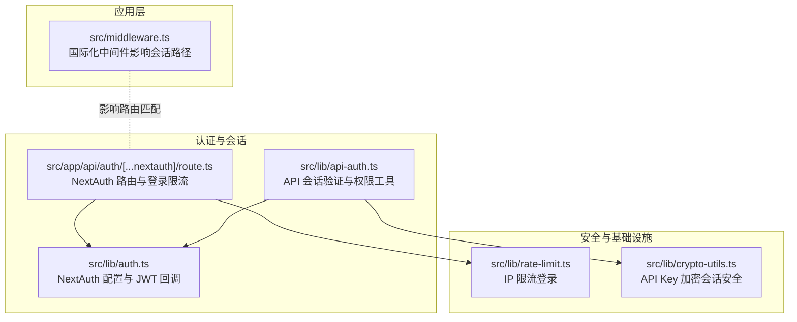
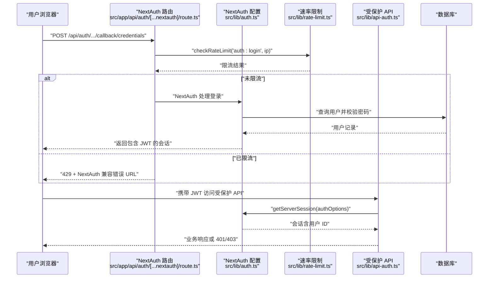
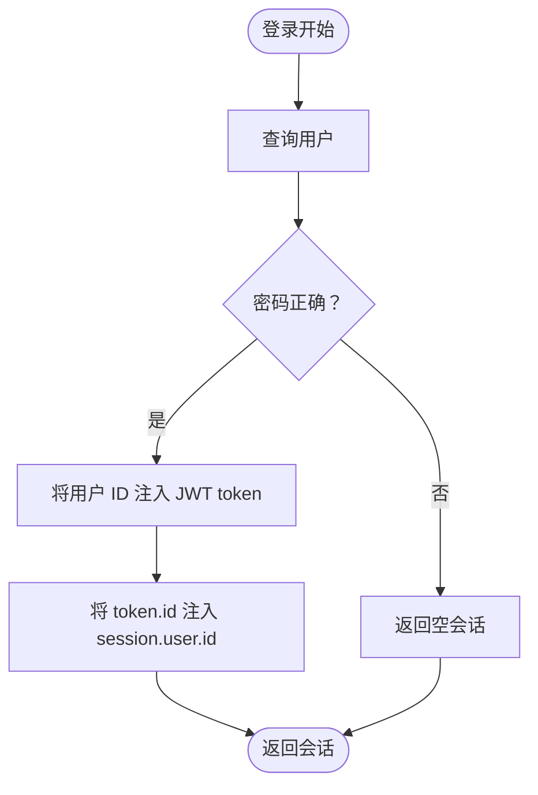
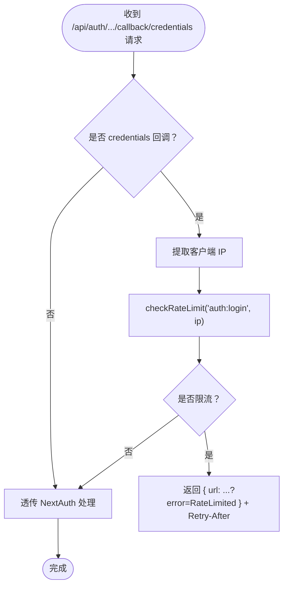
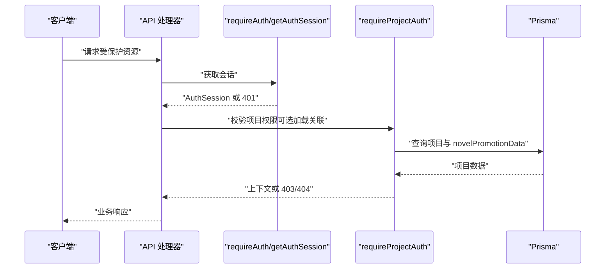
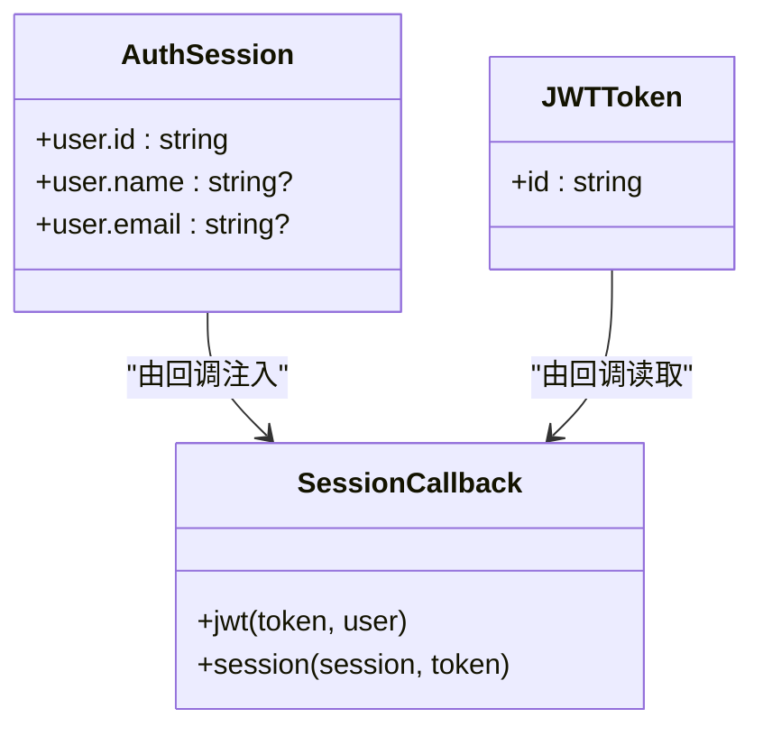
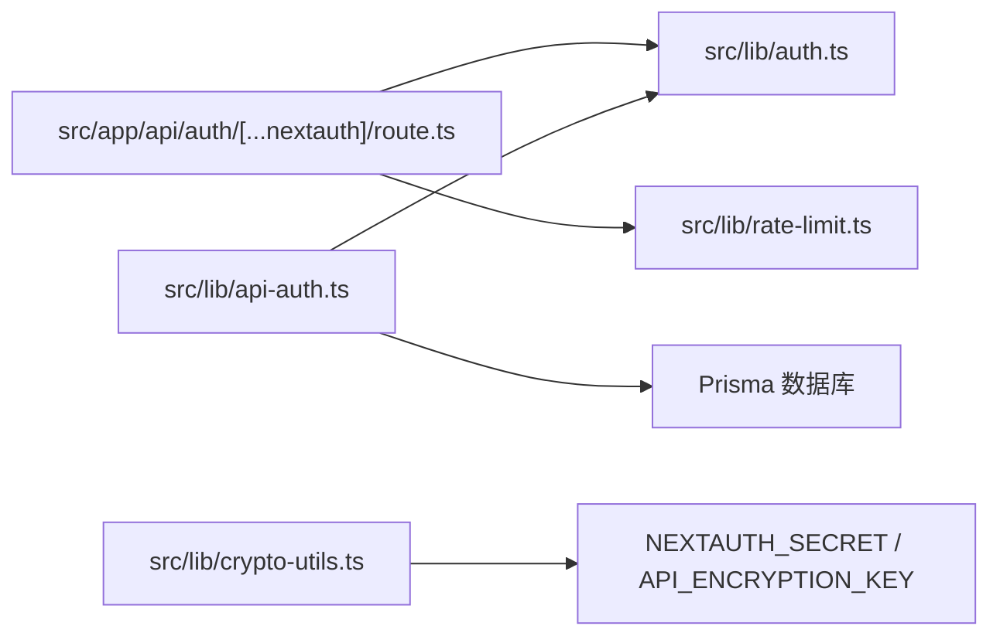

# 会话管理

<cite>
**本文引用的文件**
- [src/lib/auth.ts](file://src/lib/auth.ts)
- [src/app/api/auth/[...nextauth]/route.ts](file://src/app/api/auth/[...nextauth]/route.ts)
- [src/lib/api-auth.ts](file://src/lib/api-auth.ts)
- [src/lib/rate-limit.ts](file://src/lib/rate-limit.ts)
- [src/lib/crypto-utils.ts](file://src/lib/crypto-utils.ts)
- [src/middleware.ts](file://src/middleware.ts)
</cite>

## 目录
1. [简介](#简介)
2. [项目结构](#项目结构)
3. [核心组件](#核心组件)
4. [架构总览](#架构总览)
5. [详细组件分析](#详细组件分析)
6. [依赖关系分析](#依赖关系分析)
7. [性能考量](#性能考量)
8. [故障排除指南](#故障排除指南)
9. [结论](#结论)
10. [附录](#附录)

## 简介
本文件面向 Waoowaoo 的会话管理系统，系统采用基于 JWT 的会话策略，结合 NextAuth v5 与 Prisma 适配器，实现用户凭据登录、会话令牌生成与存储、会话状态生命周期管理、API 路由保护与页面访问控制、跨域与多设备登录管理、以及安全策略（令牌加密、防重放与会话固定防护）。文档同时提供集成示例与排障建议。

## 项目结构
围绕会话管理的关键目录与文件如下：
- 认证配置与回调：src/lib/auth.ts
- NextAuth 路由入口与登录限流：src/app/api/auth/[...nextauth]/route.ts
- API 会话验证与权限工具：src/lib/api-auth.ts
- 速率限制（登录限流）：src/lib/rate-limit.ts
- 会话安全与加密：src/lib/crypto-utils.ts
- 国际化中间件（影响会话路径与重定向）：src/middleware.ts

图表来源
- [src/lib/auth.ts:1-79](file://src/lib/auth.ts#L1-L79)
- [src/app/api/auth/[...nextauth]/route.ts:1-51](file://src/app/api/auth/[...nextauth]/route.ts#L1-L51)
- [src/lib/api-auth.ts:1-355](file://src/lib/api-auth.ts#L1-L355)
- [src/lib/rate-limit.ts:1-146](file://src/lib/rate-limit.ts#L1-L146)
- [src/lib/crypto-utils.ts:1-195](file://src/lib/crypto-utils.ts#L1-L195)
- [src/middleware.ts:1-28](file://src/middleware.ts#L1-L28)

章节来源
- [src/lib/auth.ts:1-79](file://src/lib/auth.ts#L1-L79)
- [src/app/api/auth/[...nextauth]/route.ts:1-51](file://src/app/api/auth/[...nextauth]/route.ts#L1-L51)
- [src/lib/api-auth.ts:1-355](file://src/lib/api-auth.ts#L1-L355)
- [src/lib/rate-limit.ts:1-146](file://src/lib/rate-limit.ts#L1-L146)
- [src/lib/crypto-utils.ts:1-195](file://src/lib/crypto-utils.ts#L1-L195)
- [src/middleware.ts:1-28](file://src/middleware.ts#L1-L28)

## 核心组件
- NextAuth 配置与 JWT 回调：负责凭据登录、JWT 令牌注入用户标识、会话回调映射。
- NextAuth 路由入口：封装 NextAuth 处理器，并对登录回调进行 IP 限流。
- API 会话验证工具：提供 getAuthSession、requireAuth、requireProjectAuth 等，统一 API 权限校验与日志上下文绑定。
- 速率限制：基于 Redis 的滑动窗口实现，针对登录行为进行限流。
- 会话安全与加密：提供 API Key 的对称加密/解密能力，确保敏感凭据在存储层面的安全性。
- 国际化中间件：控制语言前缀与路径匹配，间接影响会话与重定向行为。

章节来源
- [src/lib/auth.ts:8-78](file://src/lib/auth.ts#L8-L78)
- [src/app/api/auth/[...nextauth]/route.ts:19-44](file://src/app/api/auth/[...nextauth]/route.ts#L19-L44)
- [src/lib/api-auth.ts:173-191](file://src/lib/api-auth.ts#L173-L191)
- [src/lib/rate-limit.ts:58-118](file://src/lib/rate-limit.ts#L58-L118)
- [src/lib/crypto-utils.ts:50-111](file://src/lib/crypto-utils.ts#L50-L111)
- [src/middleware.ts:4-27](file://src/middleware.ts#L4-L27)

## 架构总览
下图展示从登录到 API 访问的端到端流程，包括会话生成、存储、验证与权限检查。

图表来源
- [src/app/api/auth/[...nextauth]/route.ts:19-44](file://src/app/api/auth/[...nextauth]/route.ts#L19-L44)
- [src/lib/auth.ts:22-54](file://src/lib/auth.ts#L22-L54)
- [src/lib/rate-limit.ts:58-118](file://src/lib/rate-limit.ts#L58-L118)
- [src/lib/api-auth.ts:173-191](file://src/lib/api-auth.ts#L173-L191)

## 详细组件分析

### NextAuth 配置与 JWT 回调
- 凭据提供者：用户名/密码登录，通过 Prisma 查询用户并使用 bcrypt 校验密码。
- 会话策略：strategy 为 jwt，回调将用户 ID 注入 token 并在 session 中透传。
- 安全开关：trustHost 为 true；根据 NEXTAUTH_URL 协议动态设置 useSecureCookies，以适配局域网 HTTP 环境。

图表来源
- [src/lib/auth.ts:22-54](file://src/lib/auth.ts#L22-L54)
- [src/lib/auth.ts:64-76](file://src/lib/auth.ts#L64-L76)

章节来源
- [src/lib/auth.ts:8-78](file://src/lib/auth.ts#L8-L78)

### NextAuth 路由入口与登录限流
- 仅对 callback/credentials 做登录限流，其他内部路由（session/csrf 等）不限流。
- 限流返回 NextAuth 兼容的 { url } 结构，以便客户端 signIn() 正常解析错误参数。
- 限流策略基于 Redis 滑动窗口，登录默认 60 秒最多 5 次。

图表来源
- [src/app/api/auth/[...nextauth]/route.ts:19-44](file://src/app/api/auth/[...nextauth]/route.ts#L19-L44)
- [src/lib/rate-limit.ts:58-118](file://src/lib/rate-limit.ts#L58-L118)

章节来源
- [src/app/api/auth/[...nextauth]/route.ts:10-48](file://src/app/api/auth/[...nextauth]/route.ts#L10-L48)
- [src/lib/rate-limit.ts:35-45](file://src/lib/rate-limit.ts#L35-L45)

### API 会话验证与权限工具
- getAuthSession：优先识别内部任务会话（通过头部校验），否则通过 getServerSession 获取 JWT 会话。
- requireAuth：要求已登录，否则抛出 401 响应。
- requireProjectAuth：在 requireAuth 基础上，校验项目存在、所有权与 novelPromotionData 存在，并支持按需加载关联数据。
- requireUserAuth / requireProjectAuthLight：更轻量的权限校验变体。
- 日志上下文绑定：在验证通过后将 userId 与 projectId 写入日志上下文，便于审计追踪。

图表来源
- [src/lib/api-auth.ts:173-191](file://src/lib/api-auth.ts#L173-L191)
- [src/lib/api-auth.ts:214-292](file://src/lib/api-auth.ts#L214-L292)

章节来源
- [src/lib/api-auth.ts:173-355](file://src/lib/api-auth.ts#L173-L355)

### 会话数据结构设计
- 用户信息：JWT 中包含用户 ID；在 session 回调中将其注入 session.user.id，供前端与服务端一致使用。
- 权限标识：通过 requireProjectAuth 等函数在服务端进行项目所有权与资源存在性校验，不依赖 JWT 内字段。
- 自定义字段：可通过 JWT 回调扩展 token 与 session，当前实现保留扩展空间。

图表来源
- [src/lib/api-auth.ts:20-26](file://src/lib/api-auth.ts#L20-L26)
- [src/lib/auth.ts:64-76](file://src/lib/auth.ts#L64-L76)

章节来源
- [src/lib/api-auth.ts:20-26](file://src/lib/api-auth.ts#L20-L26)
- [src/lib/auth.ts:64-76](file://src/lib/auth.ts#L64-L76)

### 会话生命周期管理
- 创建：登录成功后生成 JWT，NextAuth 将其写入 Cookie（受 useSecureCookies 控制）。
- 存储：JWT 作为 Cookie 保存在浏览器端；服务端通过 getServerSession 读取。
- 刷新：当前实现未显式刷新策略；建议在前端定期轮询或在需要时重新登录以更新令牌。
- 销毁：通过 NextAuth 的登出流程或删除 Cookie 实现；未见专门的“安全注销”接口。

章节来源
- [src/lib/auth.ts:56-61](file://src/lib/auth.ts#L56-L61)
- [src/app/api/auth/[...nextauth]/route.ts:46-48](file://src/app/api/auth/[...nextauth]/route.ts#L46-L48)

### 会话过期、自动续期与安全注销
- 过期处理：未发现显式的过期时间配置；建议在 JWT 回调中设置 exp 或通过 NextAuth 的 session.maxAge 策略。
- 自动续期：当前未实现自动刷新；可在前端定时检查令牌剩余时间并在即将过期时触发静默刷新。
- 安全注销：未见专用接口；建议提供登出 API，清除会话并使旧令牌失效。

章节来源
- [src/lib/auth.ts:56-61](file://src/lib/auth.ts#L56-L61)

### 会话验证中间件与路由保护
- 页面访问控制：国际化中间件影响路径匹配，但不直接参与会话校验；会话校验应在 API 层或页面侧通过 requireAuth 等工具实现。
- API 路由保护：通过 requireAuth/requireProjectAuth 等函数在请求进入业务逻辑前进行校验，返回统一错误响应。

章节来源
- [src/middleware.ts:4-27](file://src/middleware.ts#L4-L27)
- [src/lib/api-auth.ts:184-191](file://src/lib/api-auth.ts#L184-L191)

### 跨域会话与多设备登录
- 跨域：trustHost 为 true，允许从任意主机访问；useSecureCookies 根据协议动态启用，适配局域网 HTTP 场景。
- 多设备登录：当前未见显式会话并发控制；建议在登录时执行“踢出旧设备”策略或引入会话哈希/指纹机制。

章节来源
- [src/lib/auth.ts:10-14](file://src/lib/auth.ts#L10-L14)

### 会话安全策略
- 令牌加密：提供 API Key 的对称加密/解密工具，确保敏感凭据在存储层面安全。
- 防重放与会话固定：未见专门的 CSRF 令牌或会话固定防护；建议启用 NextAuth 的 CSRF 保护，并在登录时强制新会话。
- 密码与凭据：登录使用 bcrypt 校验，符合安全实践。

章节来源
- [src/lib/crypto-utils.ts:50-111](file://src/lib/crypto-utils.ts#L50-L111)
- [src/lib/auth.ts:39-45](file://src/lib/auth.ts#L39-L45)

## 依赖关系分析
- NextAuth 路由依赖 authOptions（src/lib/auth.ts）与速率限制（src/lib/rate-limit.ts）。
- API 权限工具依赖 NextAuth 会话与 Prisma 数据访问。
- 速率限制依赖 Redis；加密工具依赖 NEXTAUTH_SECRET 或专用密钥。

图表来源
- [src/app/api/auth/[...nextauth]/route.ts:3](file://src/app/api/auth/[...nextauth]/route.ts#L3)
- [src/lib/auth.ts:1-5](file://src/lib/auth.ts#L1-L5)
- [src/lib/rate-limit.ts:8](file://src/lib/rate-limit.ts#L8)
- [src/lib/api-auth.ts:6-14](file://src/lib/api-auth.ts#L6-L14)
- [src/lib/crypto-utils.ts:27-38](file://src/lib/crypto-utils.ts#L27-L38)

章节来源
- [src/app/api/auth/[...nextauth]/route.ts:1-51](file://src/app/api/auth/[...nextauth]/route.ts#L1-L51)
- [src/lib/api-auth.ts:1-355](file://src/lib/api-auth.ts#L1-L355)
- [src/lib/rate-limit.ts:1-146](file://src/lib/rate-limit.ts#L1-L146)
- [src/lib/crypto-utils.ts:1-195](file://src/lib/crypto-utils.ts#L1-L195)

## 性能考量
- 登录限流：Redis 滑动窗口脚本原子执行，避免竞态；Redis 不可用时放行，降低单点风险。
- 会话读取：getServerSession 为同步读取，建议在 API 层复用同一会话对象，减少重复解析。
- 项目权限加载：requireProjectAuth 支持按需 include，避免不必要的关联查询。

章节来源
- [src/lib/rate-limit.ts:98-118](file://src/lib/rate-limit.ts#L98-L118)
- [src/lib/api-auth.ts:214-292](file://src/lib/api-auth.ts#L214-L292)

## 故障排除指南
- 登录被限流
  - 现象：返回 429，URL 中带有 error=RateLimited。
  - 排查：确认客户端 IP 提取是否正确，Redis 是否可用，窗口与阈值配置是否合理。
  - 参考
    - [src/app/api/auth/[...nextauth]/route.ts:26-40](file://src/app/api/auth/[...nextauth]/route.ts#L26-L40)
    - [src/lib/rate-limit.ts:58-118](file://src/lib/rate-limit.ts#L58-L118)
- 会话为空或 401
  - 现象：requireAuth 抛出 401。
  - 排查：确认浏览器是否携带 Cookie，NEXTAUTH_URL 协议与 useSecureCookies 设置，以及登录是否成功。
  - 参考
    - [src/lib/api-auth.ts:184-191](file://src/lib/api-auth.ts#L184-L191)
    - [src/lib/auth.ts:56-61](file://src/lib/auth.ts#L56-L61)
- 项目权限 403/404
  - 现象：requireProjectAuth 返回 403 或 404。
  - 排查：确认项目是否存在、是否属于当前用户、novelPromotionData 是否存在。
  - 参考
    - [src/lib/api-auth.ts:214-292](file://src/lib/api-auth.ts#L214-L292)
- API Key 解密失败
  - 现象：解密报错或返回明文。
  - 排查：确认密钥派生配置（NEXTAUTH_SECRET 或 API_ENCRYPTION_KEY），加密格式是否正确。
  - 参考
    - [src/lib/crypto-utils.ts:85-111](file://src/lib/crypto-utils.ts#L85-L111)
    - [src/lib/crypto-utils.ts:174-182](file://src/lib/crypto-utils.ts#L174-L182)

章节来源
- [src/app/api/auth/[...nextauth]/route.ts:26-40](file://src/app/api/auth/[...nextauth]/route.ts#L26-L40)
- [src/lib/rate-limit.ts:58-118](file://src/lib/rate-limit.ts#L58-L118)
- [src/lib/api-auth.ts:184-191](file://src/lib/api-auth.ts#L184-L191)
- [src/lib/api-auth.ts:214-292](file://src/lib/api-auth.ts#L214-L292)
- [src/lib/crypto-utils.ts:85-111](file://src/lib/crypto-utils.ts#L85-L111)
- [src/lib/crypto-utils.ts:174-182](file://src/lib/crypto-utils.ts#L174-L182)

## 结论
Waoowaoo 的会话管理以 NextAuth v5 + JWT 为核心，结合 Prisma 适配器与 Redis 限流，实现了基础的登录、会话存储与 API 权限控制。建议后续完善：
- 明确会话过期与自动续期策略；
- 引入 CSRF 保护与会话固定防护；
- 提供安全注销接口与多设备会话并发控制；
- 在前端实现令牌刷新与错误重试机制。

## 附录

### 集成示例（步骤说明）
- 在 API 路由中使用 requireAuth/requireProjectAuth
  - 参考
    - [src/lib/api-auth.ts:184-191](file://src/lib/api-auth.ts#L184-L191)
    - [src/lib/api-auth.ts:214-292](file://src/lib/api-auth.ts#L214-L292)
- 在登录回调中启用限流
  - 参考
    - [src/app/api/auth/[...nextauth]/route.ts:19-44](file://src/app/api/auth/[...nextauth]/route.ts#L19-L44)
- 在存储敏感凭据时使用加密工具
  - 参考
    - [src/lib/crypto-utils.ts:50-111](file://src/lib/crypto-utils.ts#L50-L111)