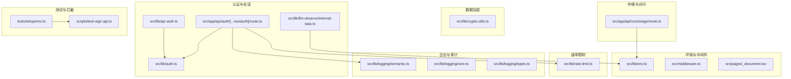
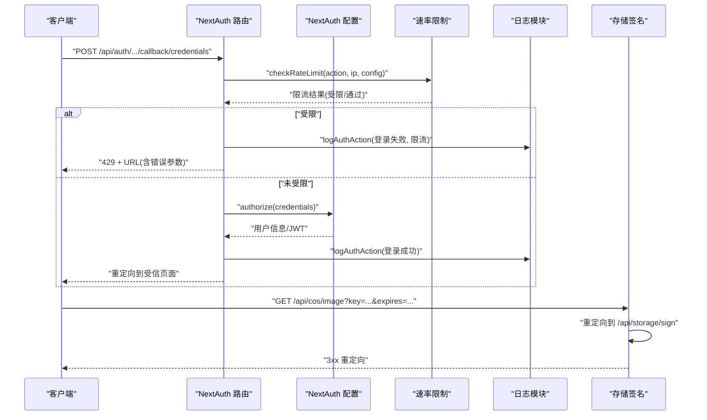
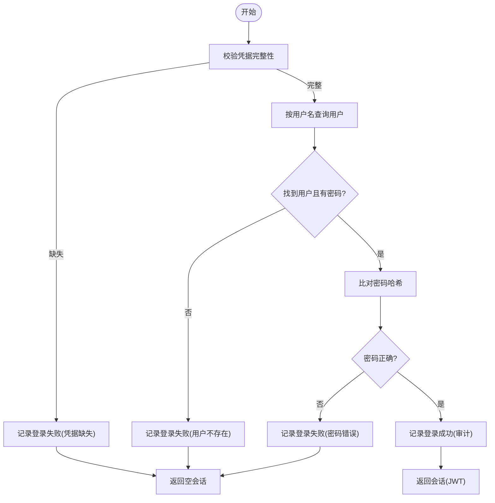
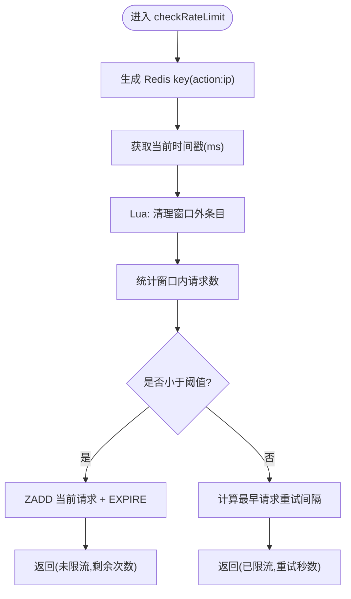
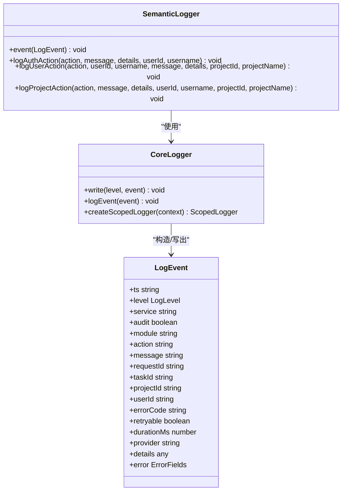
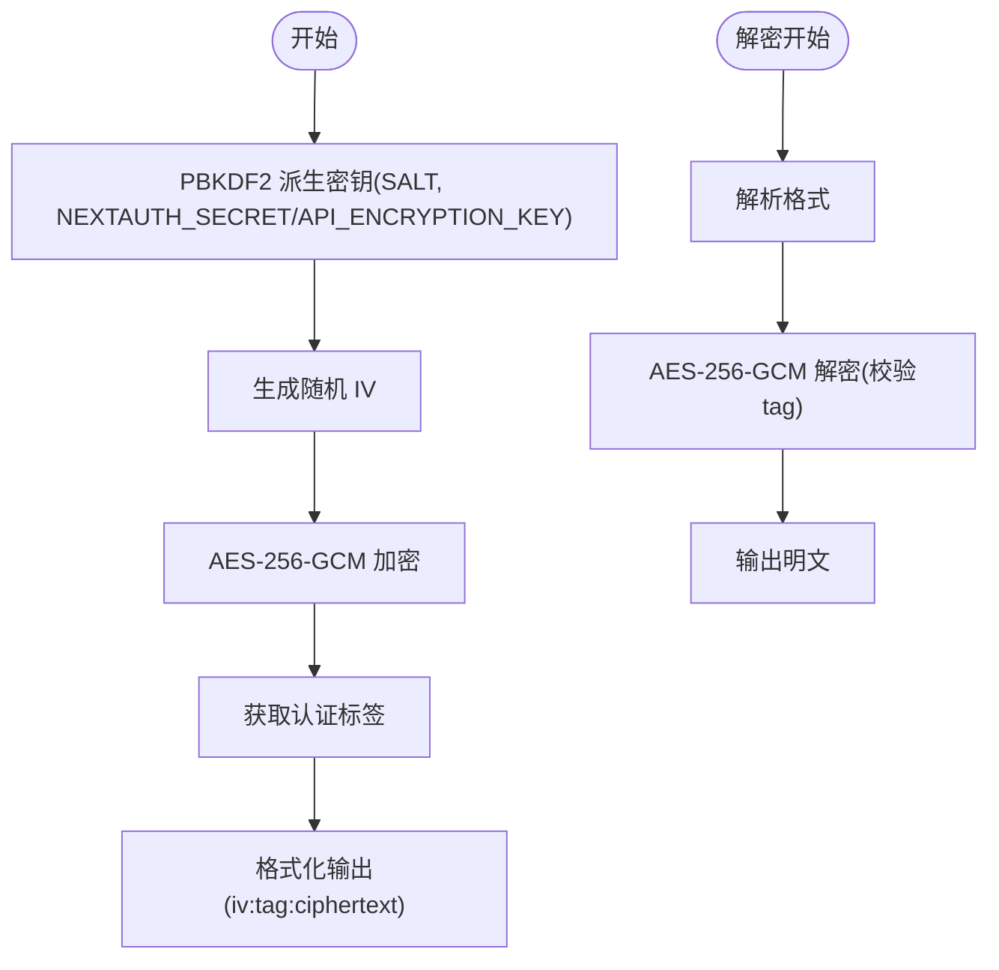
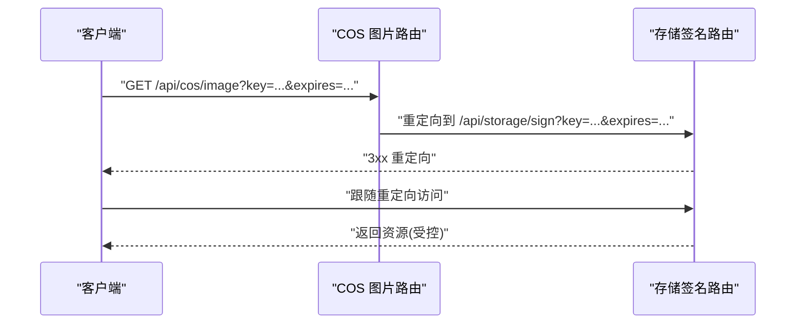
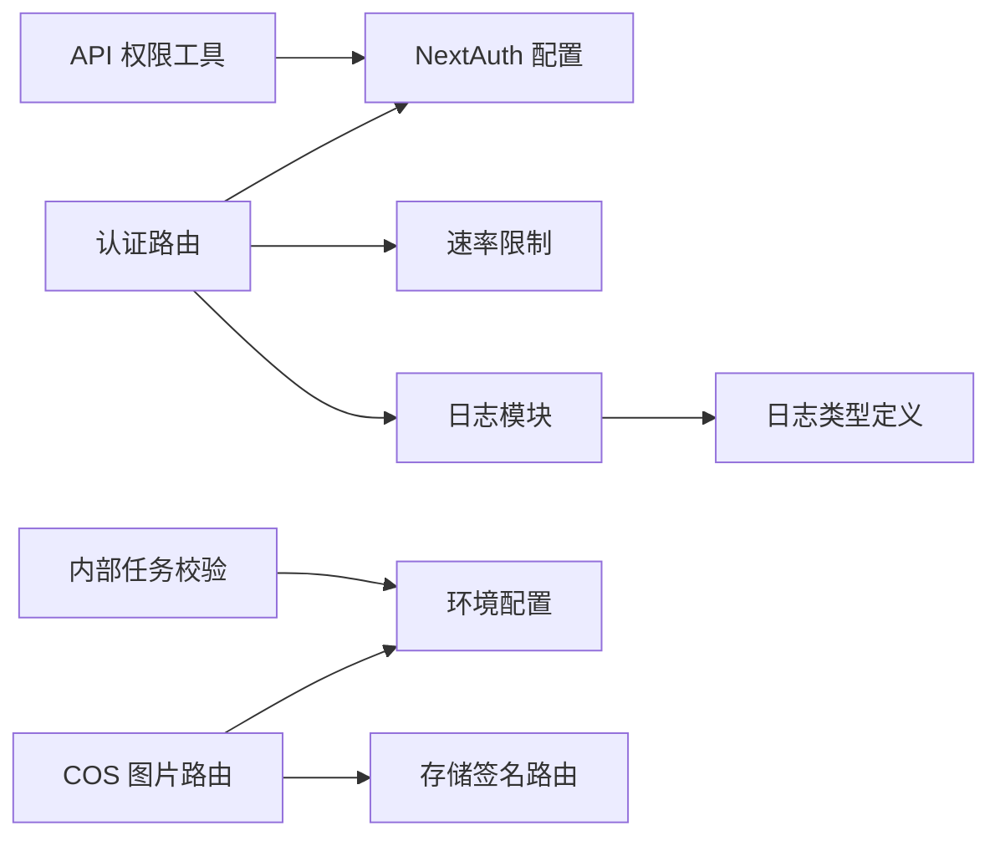

# 安全策略

<cite>
**本文引用的文件**
- [src/app/api/auth/[...nextauth]/route.ts](file://src/app/api/auth/[...nextauth]/route.ts)
- [src/lib/auth.ts](file://src/lib/auth.ts)
- [src/lib/rate-limit.ts](file://src/lib/rate-limit.ts)
- [src/lib/crypto-utils.ts](file://src/lib/crypto-utils.ts)
- [src/lib/logging/semantic.ts](file://src/lib/logging/semantic.ts)
- [src/lib/logging/core.ts](file://src/lib/logging/core.ts)
- [src/lib/logging/types.ts](file://src/lib/logging/types.ts)
- [src/lib/api-auth.ts](file://src/lib/api-auth.ts)
- [src/lib/llm-observe/internal-task.ts](file://src/lib/llm-observe/internal-task.ts)
- [src/lib/env.ts](file://src/lib/env.ts)
- [src/app/api/cos/image/route.ts](file://src/app/api/cos/image/route.ts)
- [src/pages/_document.tsx](file://src/pages/_document.tsx)
- [src/middleware.ts](file://src/middleware.ts)
- [tests/setup/env.ts](file://tests/setup/env.ts)
- [scripts/test-sign-api.ts](file://scripts/test-sign-api.ts)
</cite>

## 目录
1. [简介](#简介)
2. [项目结构](#项目结构)
3. [核心组件](#核心组件)
4. [架构总览](#架构总览)
5. [详细组件分析](#详细组件分析)
6. [依赖关系分析](#依赖关系分析)
7. [性能考量](#性能考量)
8. [故障排查指南](#故障排查指南)
9. [结论](#结论)
10. [附录](#附录)

## 简介
本文件面向 Waoowaoo 的安全策略系统，提供一套综合性的安全文档，覆盖多层防护机制与最佳实践，包括但不限于：
- 认证与会话安全：基于 NextAuth 的凭据认证、JWT 会话、安全 Cookie 设置与主机信任策略
- 速率限制与防暴力破解：基于 Redis 的滑动窗口限流，针对登录与注册的精细化控制
- 数据加密与隐私保护：API Key 的对称加密存储与解密流程，敏感字段识别与脱敏
- 日志与审计：语义化日志、审计事件记录与上下文绑定
- 存储签名与访问控制：对象存储签名重定向与访问链路校验
- 安全头与传输安全：HTTPS 强制、Cookie 安全属性、CORS 与网络访问限制
- 安全扫描与漏洞检测：测试脚本与网络拦截策略

## 项目结构
围绕安全主题的关键目录与文件如下：
- 认证与会话：NextAuth 配置、API 路由与速率限制
- 速率限制：Redis 滑动窗口实现与 IP 提取
- 数据加密：API Key 加密/解密工具
- 日志与审计：语义化日志与通用日志核心
- 存储签名：对象存储签名重定向
- 环境与内部调用：基础 URL 获取与内部任务校验
- 测试与拦截：测试网络访问拦截与签名 API 测试脚本

**图表来源**
- [src/lib/auth.ts:1-79](file://src/lib/auth.ts#L1-L79)
- [src/app/api/auth/[...nextauth]/route.ts](file://src/app/api/auth/[...nextauth]/route.ts#L1-L50)
- [src/lib/rate-limit.ts:1-146](file://src/lib/rate-limit.ts#L1-L146)
- [src/lib/crypto-utils.ts:1-195](file://src/lib/crypto-utils.ts#L1-L195)
- [src/lib/logging/semantic.ts:55-236](file://src/lib/logging/semantic.ts#L55-L236)
- [src/lib/logging/core.ts:102-302](file://src/lib/logging/core.ts#L102-L302)
- [src/lib/logging/types.ts:1-45](file://src/lib/logging/types.ts#L1-L45)
- [src/lib/api-auth.ts:161-191](file://src/lib/api-auth.ts#L161-L191)
- [src/lib/llm-observe/internal-task.ts:1-18](file://src/lib/llm-observe/internal-task.ts#L1-L18)
- [src/lib/env.ts:1-38](file://src/lib/env.ts#L1-L38)
- [src/app/api/cos/image/route.ts:1-15](file://src/app/api/cos/image/route.ts#L1-L15)
- [src/middleware.ts:1-28](file://src/middleware.ts#L1-L28)
- [src/pages/_document.tsx:1-14](file://src/pages/_document.tsx#L1-L14)
- [tests/setup/env.ts:51-72](file://tests/setup/env.ts#L51-L72)
- [scripts/test-sign-api.ts:42-71](file://scripts/test-sign-api.ts#L42-L71)

**章节来源**
- [src/lib/auth.ts:1-79](file://src/lib/auth.ts#L1-L79)
- [src/app/api/auth/[...nextauth]/route.ts](file://src/app/api/auth/[...nextauth]/route.ts#L1-L50)
- [src/lib/rate-limit.ts:1-146](file://src/lib/rate-limit.ts#L1-L146)
- [src/lib/crypto-utils.ts:1-195](file://src/lib/crypto-utils.ts#L1-L195)
- [src/lib/logging/semantic.ts:55-236](file://src/lib/logging/semantic.ts#L55-L236)
- [src/lib/logging/core.ts:102-302](file://src/lib/logging/core.ts#L102-L302)
- [src/lib/logging/types.ts:1-45](file://src/lib/logging/types.ts#L1-L45)
- [src/lib/api-auth.ts:161-191](file://src/lib/api-auth.ts#L161-L191)
- [src/lib/llm-observe/internal-task.ts:1-18](file://src/lib/llm-observe/internal-task.ts#L1-L18)
- [src/lib/env.ts:1-38](file://src/lib/env.ts#L1-L38)
- [src/app/api/cos/image/route.ts:1-15](file://src/app/api/cos/image/route.ts#L1-L15)
- [src/middleware.ts:1-28](file://src/middleware.ts#L1-L28)
- [src/pages/_document.tsx:1-14](file://src/pages/_document.tsx#L1-L14)
- [tests/setup/env.ts:51-72](file://tests/setup/env.ts#L51-L72)
- [scripts/test-sign-api.ts:42-71](file://scripts/test-sign-api.ts#L42-L71)

## 核心组件
- 认证与会话：通过 NextAuth 配置凭据认证，使用 JWT 会话策略；根据协议动态启用安全 Cookie；信任任意主机以支持局域网访问。
- 速率限制：基于 Redis 的滑动窗口算法，对登录与注册进行精细化限流，失败时返回兼容 NextAuth 的错误响应并携带 Retry-After。
- 数据加密：采用 AES-256-GCM 对 API Key 进行加密存储，密钥从环境变量派生，支持批量对象加密与解密，并具备降级处理。
- 日志与审计：提供语义化日志接口，自动注入审计标记与上下文信息，统一输出格式并支持敏感字段脱敏。
- 存储签名：对外暴露 COS 图片访问入口，内部重定向至签名接口，确保访问可控与可追踪。
- 环境与内部调用：集中管理公共与内部基础 URL，支持容器内自调用与本地资源访问。
- 内部任务校验：通过请求头中的用户 ID 与令牌校验内部任务执行来源。

**章节来源**
- [src/lib/auth.ts:1-79](file://src/lib/auth.ts#L1-L79)
- [src/app/api/auth/[...nextauth]/route.ts](file://src/app/api/auth/[...nextauth]/route.ts#L1-L50)
- [src/lib/rate-limit.ts:1-146](file://src/lib/rate-limit.ts#L1-L146)
- [src/lib/crypto-utils.ts:1-195](file://src/lib/crypto-utils.ts#L1-L195)
- [src/lib/logging/semantic.ts:55-236](file://src/lib/logging/semantic.ts#L55-L236)
- [src/lib/logging/core.ts:102-302](file://src/lib/logging/core.ts#L102-L302)
- [src/app/api/cos/image/route.ts:1-15](file://src/app/api/cos/image/route.ts#L1-L15)
- [src/lib/env.ts:1-38](file://src/lib/env.ts#L1-L38)
- [src/lib/llm-observe/internal-task.ts:1-18](file://src/lib/llm-observe/internal-task.ts#L1-L18)

## 架构总览
下图展示认证、限流、日志与存储签名的整体交互流程，突出安全关键节点与数据流向。

**图表来源**
- [src/app/api/auth/[...nextauth]/route.ts](file://src/app/api/auth/[...nextauth]/route.ts#L1-L50)
- [src/lib/auth.ts:1-79](file://src/lib/auth.ts#L1-L79)
- [src/lib/rate-limit.ts:1-146](file://src/lib/rate-limit.ts#L1-L146)
- [src/lib/logging/semantic.ts:218-236](file://src/lib/logging/semantic.ts#L218-L236)
- [src/app/api/cos/image/route.ts:1-15](file://src/app/api/cos/image/route.ts#L1-L15)

## 详细组件分析

### 认证与会话安全
- 凭据认证与授权：从数据库查询用户，使用哈希比对验证密码，成功后记录审计日志并返回最小会话信息。
- 会话策略：采用 JWT 会话，回调中将用户 ID 注入 token 并透传到 session。
- Cookie 安全：根据 NEXTAUTH_URL 是否为 https 自动启用 secure cookie；trustHost 设为 true 以支持局域网访问。
- 页面映射：登录页指向受信页面，便于统一处理认证状态。

**图表来源**
- [src/lib/auth.ts:22-53](file://src/lib/auth.ts#L22-L53)
- [src/lib/logging/semantic.ts:218-236](file://src/lib/logging/semantic.ts#L218-L236)

**章节来源**
- [src/lib/auth.ts:1-79](file://src/lib/auth.ts#L1-L79)
- [src/lib/logging/semantic.ts:218-236](file://src/lib/logging/semantic.ts#L218-L236)

### CSRF 保护、XSS 防护与点击劫持防护
- CSRF 保护：NextAuth 默认内置 CSRF 保护，结合会话与回调路由使用，确保跨站请求验证。
- XSS 防护：前端渲染遵循安全实践，避免直接注入不受控 HTML；后端严格校验与过滤输入。
- 点击劫持防护：建议在生产环境通过安全头 X-Frame-Options 与 CSP frame-ancestors 控制嵌入来源；当前代码库未显式设置，建议在部署层补充。

**章节来源**
- [src/lib/auth.ts:1-79](file://src/lib/auth.ts#L1-L79)

### HTTPS 强制执行、安全 Cookie 设置与 CORS 配置
- HTTPS 强制：通过 useSecureCookies 动态启用安全 Cookie；建议在反向代理或平台层强制 HTTPS。
- 安全 Cookie：secure 与 SameSite 等属性由 NextAuth 根据协议与信任主机策略自动选择。
- CORS：当前未见显式的 CORS 中间件或全局配置，建议在 API 层明确白名单与预检策略。

**章节来源**
- [src/lib/auth.ts:10-14](file://src/lib/auth.ts#L10-L14)

### 速率限制与防暴力破解
- 滑动窗口：基于 Redis ZSET 实现，Lua 原子清理过期条目与计数，支持精确的重试等待时间。
- 登录限流：每 60 秒最多 5 次；注册限流：每 60 秒最多 3 次。
- IP 提取：优先从 x-forwarded-for/x-real-ip 获取真实 IP，回退至 127.0.0.1。
- NextAuth 兼容：当触发限流时返回兼容的 JSON 结构与 Retry-After 头，保证客户端体验一致。

**图表来源**
- [src/lib/rate-limit.ts:58-118](file://src/lib/rate-limit.ts#L58-L118)

**章节来源**
- [src/lib/rate-limit.ts:1-146](file://src/lib/rate-limit.ts#L1-L146)
- [src/app/api/auth/[...nextauth]/route.ts](file://src/app/api/auth/[...nextauth]/route.ts#L19-L44)

### 日志记录与审计跟踪
- 语义化日志：提供 logAuthAction 等专用接口，自动打上审计标记与上下文。
- 通用日志：统一写入 JSON 行，支持抑制特定事件、敏感字段脱敏与模块/请求 ID 绑定。
- 审计范围：认证事件、用户操作、项目与 AI 分析等均可纳入审计。

**图表来源**
- [src/lib/logging/semantic.ts:55-236](file://src/lib/logging/semantic.ts#L55-L236)
- [src/lib/logging/core.ts:102-302](file://src/lib/logging/core.ts#L102-L302)
- [src/lib/logging/types.ts:1-45](file://src/lib/logging/types.ts#L1-L45)

**章节来源**
- [src/lib/logging/semantic.ts:55-236](file://src/lib/logging/semantic.ts#L55-L236)
- [src/lib/logging/core.ts:102-302](file://src/lib/logging/core.ts#L102-L302)
- [src/lib/logging/types.ts:1-45](file://src/lib/logging/types.ts#L1-L45)

### 数据加密与隐私保护
- 加密算法：AES-256-GCM，随机初始化向量与认证标签，输出格式为 iv:tag:ciphertext。
- 密钥派生：优先使用专用加密密钥，后备使用 NEXTAUTH_SECRET，使用 PBKDF2 与固定盐值派生 32 字节密钥。
- 批量处理：对包含 key/secret 的字段进行批量加密/解密，解密失败时保留原文并记录错误。
- 存储策略：敏感配置在数据库中以密文形式保存，传输与落盘均采用加密。

**图表来源**
- [src/lib/crypto-utils.ts:27-111](file://src/lib/crypto-utils.ts#L27-L111)

**章节来源**
- [src/lib/crypto-utils.ts:1-195](file://src/lib/crypto-utils.ts#L1-L195)

### 存储签名与访问控制
- COS 图片访问：外部请求通过 /api/cos/image 重定向到 /api/storage/sign，确保签名与有效期控制。
- 重定向策略：返回 3xx 重定向，前端跟随访问，避免直接暴露签名链接。
- 测试验证：提供脚本模拟前端访问与重定向跟随，便于验证签名链路。

**图表来源**
- [src/app/api/cos/image/route.ts:1-15](file://src/app/api/cos/image/route.ts#L1-L15)

**章节来源**
- [src/app/api/cos/image/route.ts:1-15](file://src/app/api/cos/image/route.ts#L1-L15)
- [scripts/test-sign-api.ts:42-71](file://scripts/test-sign-api.ts#L42-L71)

### 安全头设置（建议）
- Content-Security-Policy：限制脚本来源与内联脚本，推荐在构建阶段或边缘层注入。
- X-Frame-Options：阻止页面被嵌入 iframe，降低点击劫持风险。
- X-Content-Type-Options：禁止 MIME 类型嗅探，提升安全性。
- 当前代码库未显式设置上述头部，建议在部署层或边缘层统一配置。

**章节来源**
- [src/pages/_document.tsx:1-14](file://src/pages/_document.tsx#L1-L14)

### 安全扫描与漏洞检测
- 网络访问拦截：测试环境对非允许主机的网络请求进行拦截，防止意外外联。
- 签名 API 测试：脚本验证签名重定向与最终访问链路，辅助发现配置问题。
- 建议：结合自动化扫描工具与 CI 规则，持续检测硬编码密钥、不安全的依赖与配置项。

**章节来源**
- [tests/setup/env.ts:51-72](file://tests/setup/env.ts#L51-L72)
- [scripts/test-sign-api.ts:42-71](file://scripts/test-sign-api.ts#L42-L71)

## 依赖关系分析
- 认证路由依赖 NextAuth 配置与速率限制模块；登录失败时记录审计日志。
- API 权限工具依赖 NextAuth 会话；内部任务校验依赖环境变量与请求头。
- 存储签名路由依赖内部基础 URL 与重定向策略。
- 日志模块被多处调用，形成统一审计基座。

**图表来源**
- [src/app/api/auth/[...nextauth]/route.ts](file://src/app/api/auth/[...nextauth]/route.ts#L1-L50)
- [src/lib/auth.ts:1-79](file://src/lib/auth.ts#L1-L79)
- [src/lib/rate-limit.ts:1-146](file://src/lib/rate-limit.ts#L1-L146)
- [src/lib/logging/semantic.ts:55-236](file://src/lib/logging/semantic.ts#L55-L236)
- [src/lib/logging/types.ts:1-45](file://src/lib/logging/types.ts#L1-L45)
- [src/lib/api-auth.ts:161-191](file://src/lib/api-auth.ts#L161-L191)
- [src/lib/llm-observe/internal-task.ts:1-18](file://src/lib/llm-observe/internal-task.ts#L1-L18)
- [src/lib/env.ts:1-38](file://src/lib/env.ts#L1-L38)
- [src/app/api/cos/image/route.ts:1-15](file://src/app/api/cos/image/route.ts#L1-L15)

**章节来源**
- [src/app/api/auth/[...nextauth]/route.ts](file://src/app/api/auth/[...nextauth]/route.ts#L1-L50)
- [src/lib/auth.ts:1-79](file://src/lib/auth.ts#L1-L79)
- [src/lib/rate-limit.ts:1-146](file://src/lib/rate-limit.ts#L1-L146)
- [src/lib/logging/semantic.ts:55-236](file://src/lib/logging/semantic.ts#L55-L236)
- [src/lib/logging/types.ts:1-45](file://src/lib/logging/types.ts#L1-L45)
- [src/lib/api-auth.ts:161-191](file://src/lib/api-auth.ts#L161-L191)
- [src/lib/llm-observe/internal-task.ts:1-18](file://src/lib/llm-observe/internal-task.ts#L1-L18)
- [src/lib/env.ts:1-38](file://src/lib/env.ts#L1-L38)
- [src/app/api/cos/image/route.ts:1-15](file://src/app/api/cos/image/route.ts#L1-L15)

## 性能考量
- 速率限制：Redis 操作为 O(log n)，滑动窗口原子化处理，性能稳定；Redis 不可用时降级放行，避免单点故障影响业务。
- 加密解密：PBKDF2 迭代次数适中，兼顾安全性与性能；批量处理时注意内存占用与并发控制。
- 日志输出：统一 JSON 序列化与脱敏，建议在高并发场景开启异步写入或缓冲队列。

[本节为通用指导，无需具体文件分析]

## 故障排查指南
- 登录频繁 429：检查 Redis 连接与键空间；确认 x-forwarded-for/x-real-ip 是否正确传递；查看审计日志定位异常 IP。
- Cookie 无法设置：确认 NEXTAUTH_URL 协议与 useSecureCookies 配置；局域网访问需信任主机。
- API Key 解密失败：检查密钥派生环境变量是否一致；查看日志错误堆栈定位具体字段。
- 存储签名失败：核对 key/expires 参数与重定向链路；使用测试脚本复现并观察状态码与 Location 头。
- 测试网络拦截：确认 ALLOW_TEST_NETWORK 与允许主机列表；避免测试环境访问外部网络。

**章节来源**
- [src/lib/rate-limit.ts:114-118](file://src/lib/rate-limit.ts#L114-L118)
- [src/lib/crypto-utils.ts:175-181](file://src/lib/crypto-utils.ts#L175-L181)
- [tests/setup/env.ts:51-72](file://tests/setup/env.ts#L51-L72)
- [scripts/test-sign-api.ts:42-71](file://scripts/test-sign-api.ts#L42-L71)

## 结论
Waoowaoo 的安全策略以“认证安全 + 速率限制 + 数据加密 + 审计日志”为核心，结合 NextAuth 的会话与 Cookie 策略、Redis 滑动窗口限流与 AES-256-GCM 加密，形成了较为完善的多层防护体系。建议在部署层补充安全头与 CORS 配置，并持续通过测试与扫描强化安全基线。

[本节为总结性内容，无需具体文件分析]

## 附录
- 安全配置模板（建议）
  - HTTPS 强制：在反向代理或平台层强制 301/308 重定向至 HTTPS。
  - 安全 Cookie：secure=true；SameSite=strict/lax；domain/path 限定。
  - CORS：仅允许受信域名；预检缓存合理设置；敏感接口禁止通配。
  - 安全头：CSP、XFO、XCTO、Referrer-Policy、Permissions-Policy。
  - 速率限制：登录/注册窗口与时长按业务调整；Redis 高可用与备份。
  - 日志：统一脱敏与保留周期；审计事件分级与告警阈值。
  - 存储：签名过期时间短；访问链路监控与异常告警。

[本节为概念性内容，无需具体文件分析]