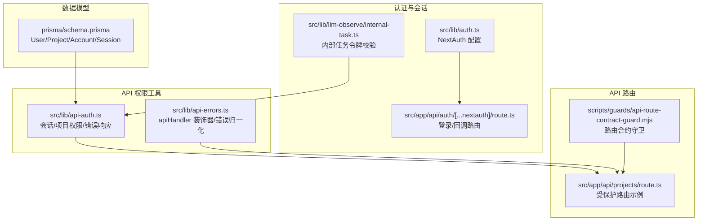
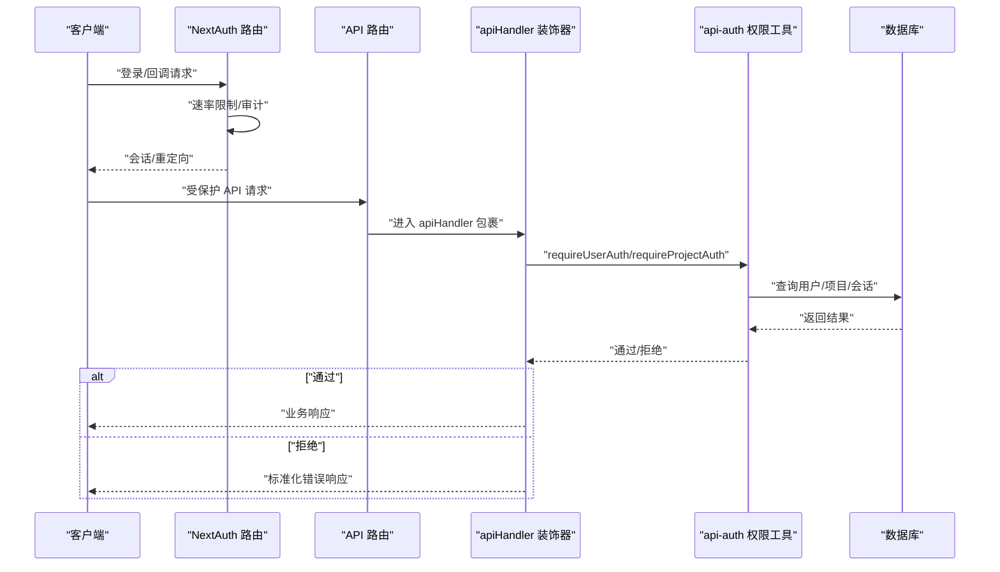
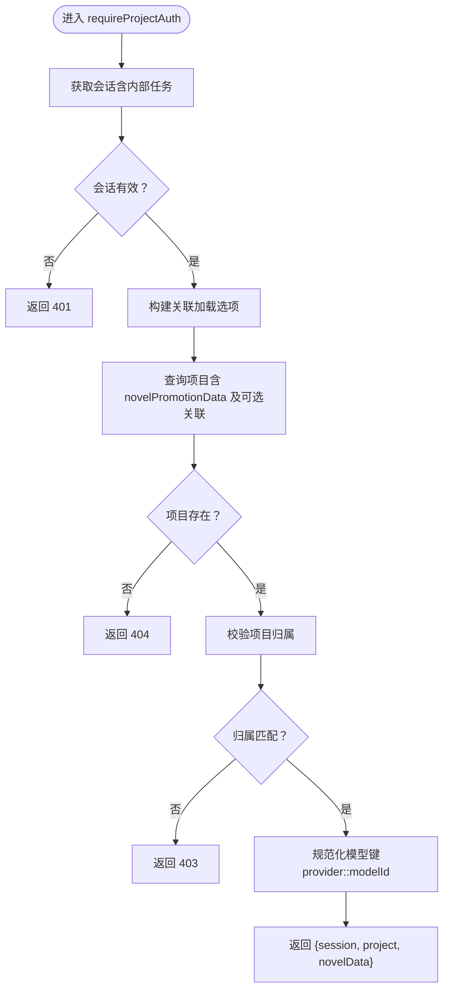
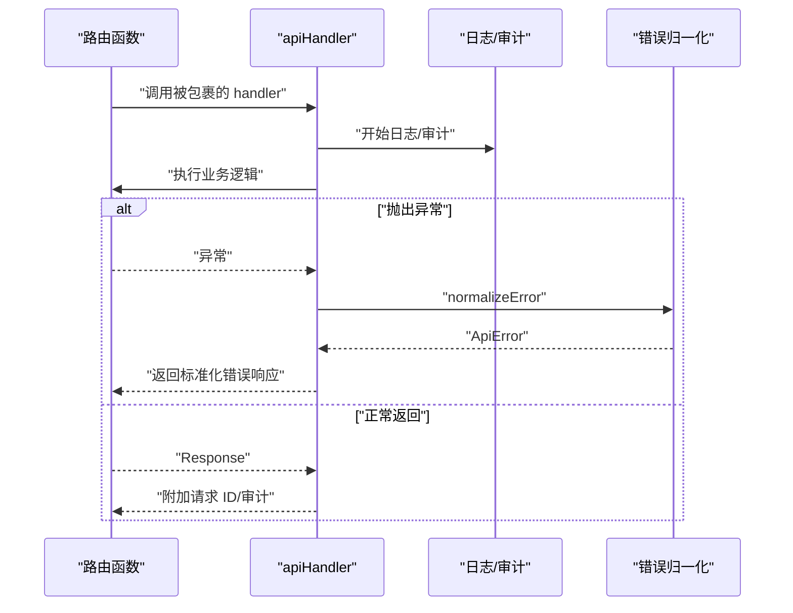
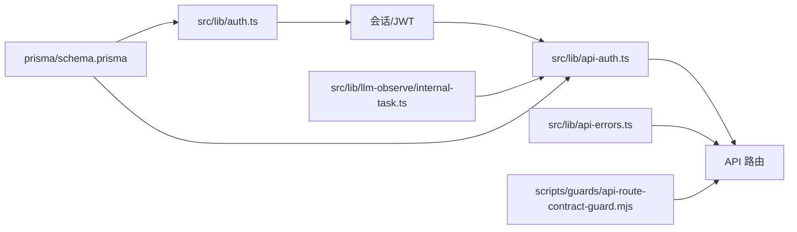

# 权限控制

<cite>
**本文引用的文件**
- [src/lib/api-auth.ts](file://src/lib/api-auth.ts)
- [src/lib/auth.ts](file://src/lib/auth.ts)
- [src/lib/api-errors.ts](file://src/lib/api-errors.ts)
- [src/app/api/auth/[...nextauth]/route.ts](file://src/app/api/auth/[...nextauth]/route.ts)
- [src/app/api/projects/route.ts](file://src/app/api/projects/route.ts)
- [src/lib/llm-observe/internal-task.ts](file://src/lib/llm-observe/internal-task.ts)
- [scripts/guards/api-route-contract-guard.mjs](file://scripts/guards/api-route-contract-guard.mjs)
- [tests/unit/guards/api-route-contract-guard.test.ts](file://tests/unit/guards/api-route-contract-guard.test.ts)
- [src/middleware.ts](file://src/middleware.ts)
- [prisma/schema.prisma](file://prisma/schema.prisma)
- [src/lib/image-cache.ts](file://src/lib/image-cache.ts)
</cite>

## 目录
1. [简介](#简介)
2. [项目结构](#项目结构)
3. [核心组件](#核心组件)
4. [架构总览](#架构总览)
5. [详细组件分析](#详细组件分析)
6. [依赖关系分析](#依赖关系分析)
7. [性能考量](#性能考量)
8. [故障排查指南](#故障排查指南)
9. [结论](#结论)
10. [附录](#附录)

## 简介
本文件系统性梳理 Waoowaoo 的权限控制体系，重点覆盖以下方面：
- 基于会话的用户认证与授权（RBAC 思想下的“用户-项目”访问控制）
- 中间件与 API 层的权限验证流程
- 权限检查函数的实现与调用模式
- 项目级权限管理（项目所有权、成员协作、资源访问）
- API 路由保护与装饰器使用规范
- 权限继承与组合的处理逻辑
- 权限相关缓存策略与性能优化
- 实际权限配置示例与常见场景解决方案

## 项目结构
围绕权限控制的关键目录与文件如下：
- 认证与会话：NextAuth 配置、内部任务会话识别
- API 权限工具：统一的权限校验与错误响应
- API 路由：受保护的路由与装饰器使用
- 数据模型：用户、项目、会话、账户等
- 运行时安全：内部任务令牌校验
- 约束检查：API 路由合约守卫

**图表来源**
- [src/lib/auth.ts:1-79](file://src/lib/auth.ts#L1-L79)
- [src/app/api/auth/[...nextauth]/route.ts:26-50](file://src/app/api/auth/[...nextauth]/route.ts#L26-L50)
- [src/lib/llm-observe/internal-task.ts:1-18](file://src/lib/llm-observe/internal-task.ts#L1-L18)
- [src/lib/api-auth.ts:1-355](file://src/lib/api-auth.ts#L1-L355)
- [src/lib/api-errors.ts:1-571](file://src/lib/api-errors.ts#L1-L571)
- [src/app/api/projects/route.ts:184-218](file://src/app/api/projects/route.ts#L184-L218)
- [scripts/guards/api-route-contract-guard.mjs:1-116](file://scripts/guards/api-route-contract-guard.mjs#L1-L116)
- [prisma/schema.prisma:10-429](file://prisma/schema.prisma#L10-L429)

**章节来源**
- [src/lib/auth.ts:1-79](file://src/lib/auth.ts#L1-L79)
- [src/app/api/auth/[...nextauth]/route.ts:26-50](file://src/app/api/auth/[...nextauth]/route.ts#L26-L50)
- [src/lib/llm-observe/internal-task.ts:1-18](file://src/lib/llm-observe/internal-task.ts#L1-L18)
- [src/lib/api-auth.ts:1-355](file://src/lib/api-auth.ts#L1-L355)
- [src/lib/api-errors.ts:1-571](file://src/lib/api-errors.ts#L1-L571)
- [src/app/api/projects/route.ts:184-218](file://src/app/api/projects/route.ts#L184-L218)
- [scripts/guards/api-route-contract-guard.mjs:1-116](file://scripts/guards/api-route-contract-guard.mjs#L1-L116)
- [prisma/schema.prisma:10-429](file://prisma/schema.prisma#L10-L429)

## 核心组件
- 会话与认证
  - NextAuth 配置与 JWT 回调，提供用户身份与会话持久化
  - 登录回调中集成速率限制与审计日志
- API 权限工具
  - 统一的会话获取、用户级与项目级权限校验
  - 错误响应构建与类型守卫，便于在路由层快速返回标准错误
- API 装饰器
  - apiHandler 装饰器负责请求生命周期日志、审计、流式进度事件、错误归一化
- 内部任务令牌
  - 通过请求头校验内部任务执行身份，绕过常规用户权限校验
- 路由合约守卫
  - 强制要求受保护路由使用 apiHandler 包裹并显式调用 requireUserAuth/requireProjectAuth 等权限函数

**章节来源**
- [src/lib/auth.ts:1-79](file://src/lib/auth.ts#L1-L79)
- [src/app/api/auth/[...nextauth]/route.ts:26-50](file://src/app/api/auth/[...nextauth]/route.ts#L26-L50)
- [src/lib/api-auth.ts:169-354](file://src/lib/api-auth.ts#L169-L354)
- [src/lib/api-errors.ts:440-571](file://src/lib/api-errors.ts#L440-L571)
- [src/lib/llm-observe/internal-task.ts:1-18](file://src/lib/llm-observe/internal-task.ts#L1-L18)
- [scripts/guards/api-route-contract-guard.mjs:26-79](file://scripts/guards/api-route-contract-guard.mjs#L26-L79)

## 架构总览
下图展示从客户端请求到权限校验与错误处理的整体流程。

**图表来源**
- [src/app/api/auth/[...nextauth]/route.ts:26-50](file://src/app/api/auth/[...nextauth]/route.ts#L26-L50)
- [src/lib/api-auth.ts:169-354](file://src/lib/api-auth.ts#L169-L354)
- [src/lib/api-errors.ts:440-571](file://src/lib/api-errors.ts#L440-L571)
- [prisma/schema.prisma:10-429](file://prisma/schema.prisma#L10-L429)

## 详细组件分析

### 会话与认证（NextAuth）
- NextAuth 使用 Prisma Adapter，JWT 回调注入用户 ID，页面登录页指向应用内登录页
- 登录回调中对凭证缺失、用户不存在、密码错误进行审计记录，并在速率受限时返回标准错误响应

**章节来源**
- [src/lib/auth.ts:1-79](file://src/lib/auth.ts#L1-L79)
- [src/app/api/auth/[...nextauth]/route.ts:26-50](file://src/app/api/auth/[...nextauth]/route.ts#L26-L50)

### API 权限工具（api-auth）
- 会话获取与内部任务会话识别
  - 优先尝试内部任务会话（基于请求头与环境变量令牌），否则回退到 NextAuth 会话
- 用户级与项目级权限
  - requireUserAuth：仅校验会话，适用于用户级资源（如资产库）
  - requireProjectAuth：校验会话、项目存在、项目归属、novelPromotionData 存在；支持按需加载关联数据（characters/locations/episodes）
  - requireProjectAuthLight：校验会话与项目归属，不强制 novelPromotionData
- 错误响应与类型守卫
  - 提供 unauthorized/forbidden/notFound/badRequest/serverError 等统一错误响应
  - isErrorResponse 用于判断返回值是否为错误响应，便于在路由层快速分支

**图表来源**
- [src/lib/api-auth.ts:214-292](file://src/lib/api-auth.ts#L214-L292)

**章节来源**
- [src/lib/api-auth.ts:169-354](file://src/lib/api-auth.ts#L169-L354)

### API 装饰器（apiHandler）
- 负责请求生命周期日志、审计、流式进度事件发布、错误归一化
- 将业务异常转换为标准化的 ApiError，并返回统一的 JSON 错误体
- 提供 getRequestId、getIdempotencyKey 等上下文提取能力

**图表来源**
- [src/lib/api-errors.ts:440-571](file://src/lib/api-errors.ts#L440-L571)

**章节来源**
- [src/lib/api-errors.ts:440-571](file://src/lib/api-errors.ts#L440-L571)

### 内部任务令牌校验
- 通过请求头 x-internal-user-id 与 x-internal-task-token 校验内部任务执行身份
- 在开发环境允许无令牌（生产环境必须匹配）

**章节来源**
- [src/lib/llm-observe/internal-task.ts:1-18](file://src/lib/llm-observe/internal-task.ts#L1-L18)
- [src/lib/api-auth.ts:37-57](file://src/lib/api-auth.ts#L37-L57)

### 路由合约守卫（API 路由保护）
- 强制要求受保护路由：
  - 使用 apiHandler 包裹
  - 显式调用 requireUserAuth/requireProjectAuth/requireProjectAuthLight
- 公开路由与框架管理路由有白名单豁免

**章节来源**
- [scripts/guards/api-route-contract-guard.mjs:11-79](file://scripts/guards/api-route-contract-guard.mjs#L11-L79)
- [tests/unit/guards/api-route-contract-guard.test.ts:1-31](file://tests/unit/guards/api-route-contract-guard.test.ts#L1-L31)

### 数据模型与权限边界
- User 与 Project 之间为“拥有者-项目”关系，项目归属是权限边界
- Account/Session 用于会话与第三方账号绑定
- novelPromotionData 作为项目扩展数据，requireProjectAuth 会确保其存在

**章节来源**
- [prisma/schema.prisma:10-429](file://prisma/schema.prisma#L10-L429)
- [src/lib/api-auth.ts:237-292](file://src/lib/api-auth.ts#L237-L292)

### 页面访问控制与国际化中间件
- 国际化中间件负责语言前缀与路径策略，不直接参与权限校验
- 页面访问控制通常通过前端路由守卫或服务端渲染时的会话检查实现

**章节来源**
- [src/middleware.ts:1-28](file://src/middleware.ts#L1-L28)

## 依赖关系分析
- NextAuth 与数据库：NextAuth 使用 Prisma Adapter，依赖 User/Account/Session 模型
- API 路由依赖 apiHandler 与 api-auth：
  - apiHandler 提供统一的错误处理与审计
  - api-auth 提供会话与项目权限校验
- 内部任务与外部 API：
  - 内部任务通过令牌头绕过常规用户权限校验
- 路由合约守卫：
  - 保证所有受保护路由均经过上述两层保护

**图表来源**
- [src/lib/auth.ts:1-79](file://src/lib/auth.ts#L1-L79)
- [src/lib/api-auth.ts:1-355](file://src/lib/api-auth.ts#L1-L355)
- [src/lib/api-errors.ts:1-571](file://src/lib/api-errors.ts#L1-L571)
- [scripts/guards/api-route-contract-guard.mjs:1-116](file://scripts/guards/api-route-contract-guard.mjs#L1-L116)
- [src/lib/llm-observe/internal-task.ts:1-18](file://src/lib/llm-observe/internal-task.ts#L1-L18)
- [prisma/schema.prisma:10-429](file://prisma/schema.prisma#L10-L429)

**章节来源**
- [src/lib/auth.ts:1-79](file://src/lib/auth.ts#L1-L79)
- [src/lib/api-auth.ts:1-355](file://src/lib/api-auth.ts#L1-L355)
- [src/lib/api-errors.ts:1-571](file://src/lib/api-errors.ts#L1-L571)
- [scripts/guards/api-route-contract-guard.mjs:1-116](file://scripts/guards/api-route-contract-guard.mjs#L1-L116)
- [src/lib/llm-observe/internal-task.ts:1-18](file://src/lib/llm-observe/internal-task.ts#L1-L18)
- [prisma/schema.prisma:10-429](file://prisma/schema.prisma#L10-L429)

## 性能考量
- 会话与权限校验
  - 会话获取与数据库查询次数应尽量减少，必要时在上层复用已获取的会话
  - novelPromotionData 的关联加载按需开启，避免不必要的 JOIN 查询
- 错误处理与审计
  - apiHandler 已内置日志与审计，注意避免在业务层重复记录相同上下文
- 缓存策略
  - 项目级权限校验涉及数据库查询，建议结合业务场景引入短期缓存（如 Redis）以降低重复查询成本
  - 当前仓库未见专门的权限缓存实现，可参考现有图片缓存模块设计思路进行扩展

**章节来源**
- [src/lib/api-auth.ts:214-292](file://src/lib/api-auth.ts#L214-L292)
- [src/lib/api-errors.ts:440-571](file://src/lib/api-errors.ts#L440-L571)
- [src/lib/image-cache.ts:34-253](file://src/lib/image-cache.ts#L34-L253)

## 故障排查指南
- 401 未授权
  - 检查是否正确调用 requireUserAuth/requireProjectAuth
  - 确认 NextAuth 会话是否有效，登录回调是否返回错误
- 403 禁止访问
  - 检查项目归属是否匹配当前会话用户
  - 确认 novelPromotionData 是否存在
- 404 资源不存在
  - 检查项目 ID 是否正确，数据库中是否存在对应记录
- 路由未受保护
  - 使用路由合约守卫检查是否遗漏 apiHandler 包裹或权限调用
- 内部任务权限异常
  - 检查请求头 x-internal-user-id 与 x-internal-task-token 是否正确传递
  - 确认环境变量 INTERNAL_TASK_TOKEN 设置

**章节来源**
- [src/lib/api-auth.ts:145-163](file://src/lib/api-auth.ts#L145-L163)
- [src/lib/api-auth.ts:214-354](file://src/lib/api-auth.ts#L214-L354)
- [scripts/guards/api-route-contract-guard.mjs:67-79](file://scripts/guards/api-route-contract-guard.mjs#L67-L79)
- [src/lib/llm-observe/internal-task.ts:1-18](file://src/lib/llm-observe/internal-task.ts#L1-L18)

## 结论
Waoowaoo 的权限控制以“会话-项目”为核心，结合 apiHandler 装饰器与 api-auth 工具，实现了统一的权限校验与错误处理。通过路由合约守卫确保受保护路由的最小暴露面，内部任务通过令牌头绕过常规用户校验。建议在项目级权限校验处引入缓存策略以提升性能，并持续使用路由合约守卫保障一致性。

## 附录

### API 路由保护与装饰器使用范式
- 受保护路由示例
  - 用户级：使用 requireUserAuth
  - 项目级：使用 requireProjectAuth（按需 include 关联数据）
  - 轻量项目级：使用 requireProjectAuthLight（不强制 novelPromotionData）
- 装饰器使用
  - 所有受保护路由必须使用 apiHandler 包裹
  - 在 handler 内显式调用 requireUserAuth/requireProjectAuth 等权限函数

**章节来源**
- [src/app/api/projects/route.ts:184-218](file://src/app/api/projects/route.ts#L184-L218)
- [src/lib/api-auth.ts:294-343](file://src/lib/api-auth.ts#L294-L343)
- [src/lib/api-errors.ts:440-571](file://src/lib/api-errors.ts#L440-L571)
- [scripts/guards/api-route-contract-guard.mjs:67-79](file://scripts/guards/api-route-contract-guard.mjs#L67-L79)

### 权限继承与组合
- 继承关系
  - 用户级权限（requireUserAuth）可作为项目级权限（requireProjectAuth）的前置条件
- 组合策略
  - requireProjectAuth 支持按需加载 characters/locations/episodes，避免过度关联查询
  - novelPromotionData 的模型键统一为 provider::modelId，便于后续能力与配额校验

**章节来源**
- [src/lib/api-auth.ts:214-292](file://src/lib/api-auth.ts#L214-L292)

### 实际权限配置示例（步骤说明）
- 创建受保护路由
  - 使用 apiHandler 包裹导出的 GET/POST 等方法
  - 在 handler 内调用 requireUserAuth 或 requireProjectAuth
  - 如需关联数据，传入 include 选项
- 内部任务调用
  - 在请求头中设置 x-internal-user-id 与 x-internal-task-token
  - 确保 INTERNAL_TASK_TOKEN 一致

**章节来源**
- [src/lib/api-errors.ts:440-571](file://src/lib/api-errors.ts#L440-L571)
- [src/lib/api-auth.ts:214-292](file://src/lib/api-auth.ts#L214-L292)
- [src/lib/llm-observe/internal-task.ts:1-18](file://src/lib/llm-observe/internal-task.ts#L1-L18)