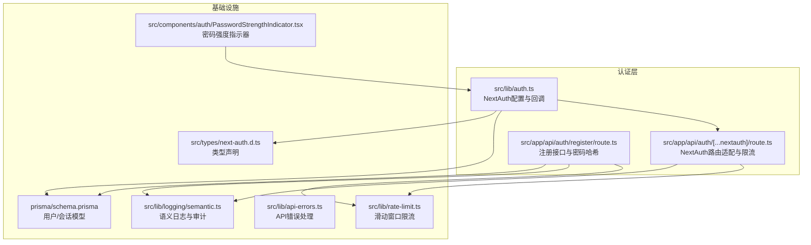
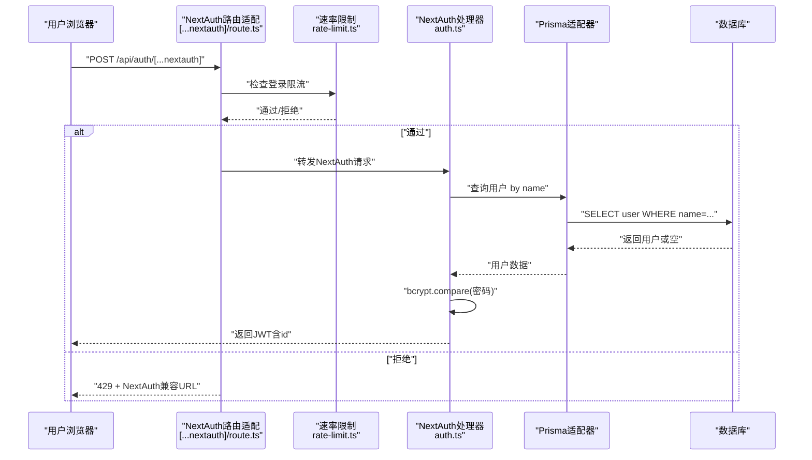
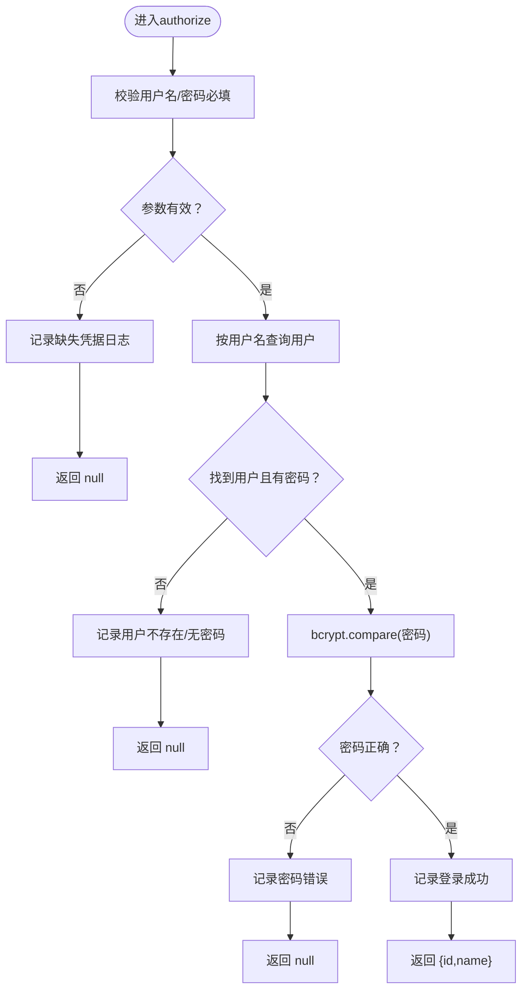
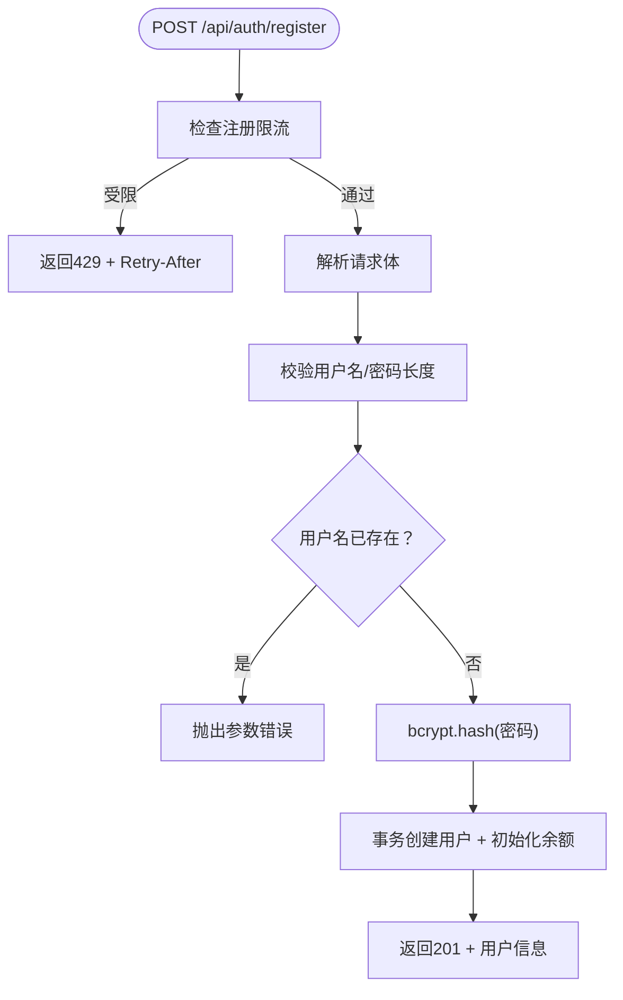
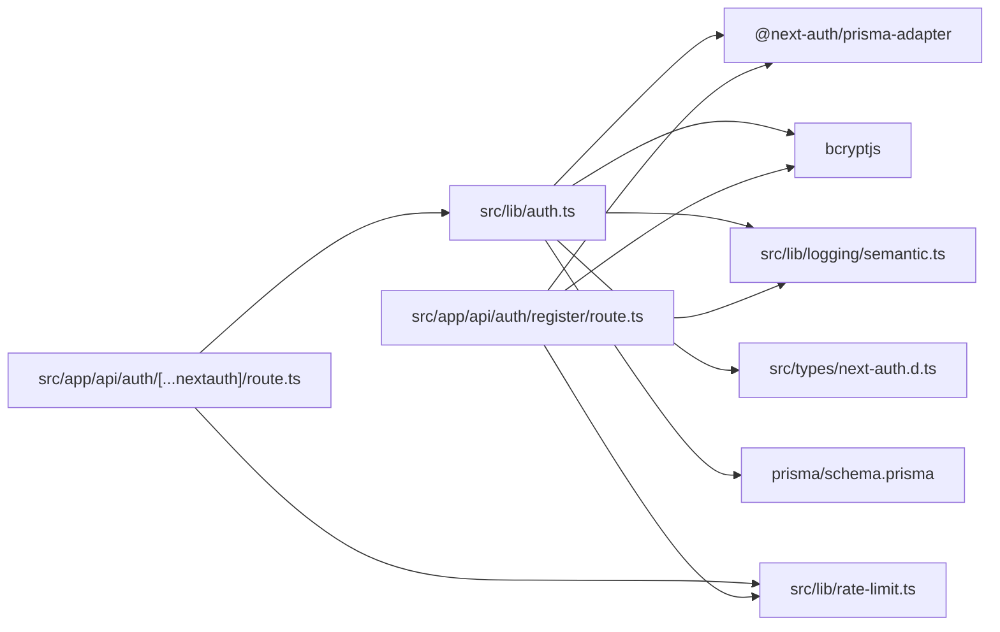

# 用户认证

<cite>
**本文引用的文件**
- [src/lib/auth.ts](file://src/lib/auth.ts)
- [src/app/api/auth/[...nextauth]/route.ts](file://src/app/api/auth/[...nextauth]/route.ts)
- [src/app/api/auth/register/route.ts](file://src/app/api/auth/register/route.ts)
- [src/lib/rate-limit.ts](file://src/lib/rate-limit.ts)
- [src/lib/crypto-utils.ts](file://src/lib/crypto-utils.ts)
- [src/lib/logging/semantic.ts](file://src/lib/logging/semantic.ts)
- [src/lib/api-errors.ts](file://src/lib/api-errors.ts)
- [src/types/next-auth.d.ts](file://src/types/next-auth.d.ts)
- [prisma/schema.prisma](file://prisma/schema.prisma)
- [src/components/auth/PasswordStrengthIndicator.tsx](file://src/components/auth/PasswordStrengthIndicator.tsx)
</cite>

## 目录
1. [简介](#简介)
2. [项目结构](#项目结构)
3. [核心组件](#核心组件)
4. [架构总览](#架构总览)
5. [详细组件分析](#详细组件分析)
6. [依赖分析](#依赖分析)
7. [性能考虑](#性能考虑)
8. [故障排查指南](#故障排查指南)
9. [结论](#结论)
10. [附录](#附录)

## 简介
本文件面向Waoowaoo的用户认证子系统，围绕基于NextAuth的凭据认证（用户名/密码）进行深入技术说明。内容涵盖：
- 凭据认证提供程序的实现与授权流程
- 用户登录验证机制与密码哈希处理
- JWT令牌的生成、存储与验证机制
- 登录页面组件的实现要点（表单验证、错误处理、用户体验）
- 认证回调函数（JWT扩展与会话数据处理）
- 实际代码示例路径与集成/自定义方法
- 安全最佳实践（密码加密、会话管理、防暴力破解）

## 项目结构
认证相关的核心位置如下：
- NextAuth配置与回调：src/lib/auth.ts
- NextAuth路由适配与登录限流：src/app/api/auth/[...nextauth]/route.ts
- 注册接口与密码哈希：src/app/api/auth/register/route.ts
- 速率限制工具：src/lib/rate-limit.ts
- 密钥加密工具（与API Key安全相关）：src/lib/crypto-utils.ts
- 日志与审计：src/lib/logging/semantic.ts
- API统一错误处理：src/lib/api-errors.ts
- NextAuth类型声明：src/types/next-auth.d.ts
- 数据模型（用户、会话等）：prisma/schema.prisma
- 登录页密码强度指示器组件：src/components/auth/PasswordStrengthIndicator.tsx

图表来源
- [src/lib/auth.ts:1-79](file://src/lib/auth.ts#L1-L79)
- [src/app/api/auth/[...nextauth]/route.ts:1-51](file://src/app/api/auth/[...nextauth]/route.ts#L1-L51)
- [src/app/api/auth/register/route.ts:1-88](file://src/app/api/auth/register/route.ts#L1-L88)
- [src/lib/rate-limit.ts:1-146](file://src/lib/rate-limit.ts#L1-L146)
- [src/lib/logging/semantic.ts:1-237](file://src/lib/logging/semantic.ts#L1-L237)
- [src/lib/api-errors.ts:1-571](file://src/lib/api-errors.ts#L1-L571)
- [src/types/next-auth.d.ts:1-22](file://src/types/next-auth.d.ts#L1-L22)
- [prisma/schema.prisma:402-429](file://prisma/schema.prisma#L402-L429)
- [src/components/auth/PasswordStrengthIndicator.tsx:1-128](file://src/components/auth/PasswordStrengthIndicator.tsx#L1-L128)

章节来源
- [src/lib/auth.ts:1-79](file://src/lib/auth.ts#L1-L79)
- [src/app/api/auth/[...nextauth]/route.ts:1-51](file://src/app/api/auth/[...nextauth]/route.ts#L1-L51)
- [src/app/api/auth/register/route.ts:1-88](file://src/app/api/auth/register/route.ts#L1-L88)
- [src/lib/rate-limit.ts:1-146](file://src/lib/rate-limit.ts#L1-L146)
- [src/lib/logging/semantic.ts:1-237](file://src/lib/logging/semantic.ts#L1-L237)
- [src/lib/api-errors.ts:1-571](file://src/lib/api-errors.ts#L1-L571)
- [src/types/next-auth.d.ts:1-22](file://src/types/next-auth.d.ts#L1-L22)
- [prisma/schema.prisma:402-429](file://prisma/schema.prisma#L402-L429)
- [src/components/auth/PasswordStrengthIndicator.tsx:1-128](file://src/components/auth/PasswordStrengthIndicator.tsx#L1-L128)

## 核心组件
- NextAuth配置与回调
  - 使用Prisma Adapter连接数据库，启用信任主机与根据协议自动选择安全Cookie策略
  - 凭据提供程序实现用户名/密码校验，使用bcrypt比较密码
  - JWT回调扩展token，会话回调将id注入session.user
  - 登录页重定向至 /auth/signin
- NextAuth路由适配与限流
  - 包装NextAuth处理器，针对凭据回调（callback/credentials）进行IP级速率限制
  - 保持NextAuth兼容的响应格式，便于客户端signIn()解析
- 注册接口
  - 输入校验、用户名唯一性检查、密码哈希（bcrypt）
  - 事务创建用户与初始余额记录
- 速率限制工具
  - 基于Redis滑动窗口，支持登录/注册不同阈值
  - 客户端IP提取（支持多种代理头）
- 日志与审计
  - 语义化日志模块，提供认证动作日志
- API错误处理
  - 统一错误包装与响应格式
- 类型声明
  - 补充NextAuth Session/JWT类型，确保类型安全
- 数据模型
  - User/Session模型，支持JWT会话策略

章节来源
- [src/lib/auth.ts:8-79](file://src/lib/auth.ts#L8-L79)
- [src/app/api/auth/[...nextauth]/route.ts:19-44](file://src/app/api/auth/[...nextauth]/route.ts#L19-L44)
- [src/app/api/auth/register/route.ts:8-88](file://src/app/api/auth/register/route.ts#L8-L88)
- [src/lib/rate-limit.ts:58-118](file://src/lib/rate-limit.ts#L58-L118)
- [src/lib/logging/semantic.ts:218-236](file://src/lib/logging/semantic.ts#L218-L236)
- [src/lib/api-errors.ts:440-562](file://src/lib/api-errors.ts#L440-L562)
- [src/types/next-auth.d.ts:1-22](file://src/types/next-auth.d.ts#L1-L22)
- [prisma/schema.prisma:402-429](file://prisma/schema.prisma#L402-L429)

## 架构总览
下图展示了从浏览器发起登录请求到数据库验证、JWT生成与存储的整体流程。

图表来源
- [src/app/api/auth/[...nextauth]/route.ts:19-44](file://src/app/api/auth/[...nextauth]/route.ts#L19-L44)
- [src/lib/rate-limit.ts:58-118](file://src/lib/rate-limit.ts#L58-L118)
- [src/lib/auth.ts:22-54](file://src/lib/auth.ts#L22-L54)
- [prisma/schema.prisma:402-429](file://prisma/schema.prisma#L402-L429)

## 详细组件分析

### 凭据认证提供程序与授权流程
- 凭据提供程序
  - 字段定义：用户名与密码
  - 授权函数：先校验必填，再按用户名查询用户，若无用户或密码为空则返回null
  - 密码验证：bcrypt.compare对比
  - 成功时返回最小用户信息（id/name），供后续回调扩展
- 回调函数
  - JWT回调：首次登录时将用户id写入token
  - 会话回调：将token中的id写回session.user.id，使客户端可直接读取

图表来源
- [src/lib/auth.ts:22-54](file://src/lib/auth.ts#L22-L54)
- [src/lib/logging/semantic.ts:218-236](file://src/lib/logging/semantic.ts#L218-L236)

章节来源
- [src/lib/auth.ts:15-77](file://src/lib/auth.ts#L15-L77)
- [src/lib/logging/semantic.ts:218-236](file://src/lib/logging/semantic.ts#L218-L236)

### 登录页面组件与用户体验
- 密码强度指示器组件
  - 依据字符类型多样性、长度、重复/顺序等规则评分
  - 提供弱/一般/良好/强四档视觉反馈
  - 结合国际化文案提升提示效果
- 集成建议
  - 在登录表单中实时显示强度条与提示
  - 与表单提交联动，阻止弱密码提交

章节来源
- [src/components/auth/PasswordStrengthIndicator.tsx:32-72](file://src/components/auth/PasswordStrengthIndicator.tsx#L32-L72)
- [src/components/auth/PasswordStrengthIndicator.tsx:93-127](file://src/components/auth/PasswordStrengthIndicator.tsx#L93-L127)

### JWT令牌生成、存储与验证
- 会话策略
  - 使用JWT策略，避免服务端会话存储
- 令牌扩展
  - JWT回调：首次登录时将用户id写入token
  - 会话回调：将token.id写回session.user.id
- Cookie与安全
  - trustHost开启以支持局域网访问
  - 根据NEXTAUTH_URL协议动态设置secure cookie

章节来源
- [src/lib/auth.ts:56-78](file://src/lib/auth.ts#L56-L78)

### 注册流程与密码哈希
- 流程概览
  - 速率限制（注册）
  - 校验输入与密码长度
  - 查询用户名唯一性
  - bcrypt哈希密码
  - 事务创建用户与初始余额
- 错误处理
  - 使用统一API错误封装，保证一致的响应结构

图表来源
- [src/app/api/auth/register/route.ts:8-88](file://src/app/api/auth/register/route.ts#L8-L88)
- [src/lib/rate-limit.ts:58-118](file://src/lib/rate-limit.ts#L58-L118)
- [src/lib/api-errors.ts:396-438](file://src/lib/api-errors.ts#L396-L438)

章节来源
- [src/app/api/auth/register/route.ts:8-88](file://src/app/api/auth/register/route.ts#L8-L88)
- [src/lib/api-errors.ts:440-562](file://src/lib/api-errors.ts#L440-L562)

### NextAuth路由适配与登录限流
- 识别凭据回调路径
  - 通过解析URL段判断是否为callback/credentials
- 限流策略
  - 使用Redis滑动窗口，登录默认每60秒最多5次
  - 限流命中时返回NextAuth兼容的{url}响应，客户端可解析error参数
- 透传其他NextAuth内部路由

章节来源
- [src/app/api/auth/[...nextauth]/route.ts:19-44](file://src/app/api/auth/[...nextauth]/route.ts#L19-L44)
- [src/lib/rate-limit.ts:35-45](file://src/lib/rate-limit.ts#L35-L45)

### 类型安全与扩展
- NextAuth类型声明
  - 补充Session与JWT的id字段，避免类型不匹配
- 数据模型
  - User/Session模型由Prisma Schema定义，与Adapter配合

章节来源
- [src/types/next-auth.d.ts:1-22](file://src/types/next-auth.d.ts#L1-L22)
- [prisma/schema.prisma:402-429](file://prisma/schema.prisma#L402-L429)

## 依赖分析
- 组件耦合
  - auth.ts依赖Prisma适配器与bcrypt；回调依赖用户模型
  - [...nextauth]/route.ts依赖auth.ts与rate-limit.ts
  - register/route.ts依赖bcrypt、prisma、rate-limit.ts与api-errors.ts
  - logging/semantic.ts贯穿认证与注册流程，提供统一审计入口
- 外部依赖
  - Redis用于限流（rate-limit.ts）
  - Prisma用于用户/会话持久化（schema.prisma）

图表来源
- [src/lib/auth.ts:1-79](file://src/lib/auth.ts#L1-L79)
- [src/app/api/auth/[...nextauth]/route.ts:1-51](file://src/app/api/auth/[...nextauth]/route.ts#L1-L51)
- [src/app/api/auth/register/route.ts:1-88](file://src/app/api/auth/register/route.ts#L1-L88)
- [src/lib/rate-limit.ts:1-146](file://src/lib/rate-limit.ts#L1-L146)
- [src/lib/logging/semantic.ts:1-237](file://src/lib/logging/semantic.ts#L1-L237)
- [src/types/next-auth.d.ts:1-22](file://src/types/next-auth.d.ts#L1-L22)
- [prisma/schema.prisma:402-429](file://prisma/schema.prisma#L402-L429)

章节来源
- [src/lib/auth.ts:1-79](file://src/lib/auth.ts#L1-L79)
- [src/app/api/auth/[...nextauth]/route.ts:1-51](file://src/app/api/auth/[...nextauth]/route.ts#L1-L51)
- [src/app/api/auth/register/route.ts:1-88](file://src/app/api/auth/register/route.ts#L1-L88)
- [src/lib/rate-limit.ts:1-146](file://src/lib/rate-limit.ts#L1-L146)
- [src/lib/logging/semantic.ts:1-237](file://src/lib/logging/semantic.ts#L1-L237)
- [src/types/next-auth.d.ts:1-22](file://src/types/next-auth.d.ts#L1-L22)
- [prisma/schema.prisma:402-429](file://prisma/schema.prisma#L402-L429)

## 性能考虑
- 速率限制
  - 登录限流窗口60秒、最多5次；注册限流窗口60秒、最多3次
  - Redis原子Lua脚本实现滑动窗口，避免竞态
- 密码哈希
  - bcrypt成本因子12，兼顾安全性与性能
- 会话策略
  - JWT策略减少服务端状态，适合分布式部署
- 日志与审计
  - 语义化日志按模块输出，便于监控与排障

[本节为通用性能讨论，无需特定文件来源]

## 故障排查指南
- 登录失败
  - 检查用户名/密码是否为空
  - 确认用户是否存在且密码非空
  - 查看认证日志中的“LOGIN”事件
- 429 Too Many Requests
  - 检查Redis是否可用；确认限流键与TTL
  - 客户端需解析NextAuth兼容URL中的error参数
- 注册失败
  - 校验用户名唯一性与密码长度
  - 查看注册日志中的“REGISTER”事件
- 会话不可用
  - 确认Cookie安全标志与协议一致性
  - 检查JWT回调是否正确写入token与session

章节来源
- [src/lib/logging/semantic.ts:218-236](file://src/lib/logging/semantic.ts#L218-L236)
- [src/lib/rate-limit.ts:98-118](file://src/lib/rate-limit.ts#L98-L118)
- [src/app/api/auth/[...nextauth]/route.ts:26-41](file://src/app/api/auth/[...nextauth]/route.ts#L26-L41)

## 结论
Waoowaoo的认证体系以NextAuth为核心，结合Prisma与Redis，实现了：
- 安全的用户名/密码登录与JWT会话
- 登录/注册双通道的速率限制
- 统一日志与错误处理
- 可扩展的回调与类型声明
建议在生产环境中：
- 配置稳定的Redis与数据库
- 使用HTTPS并确保Cookie安全标志
- 定期审查限流阈值与日志策略
- 在UI层强化密码强度提示与错误反馈

[本节为总结性内容，无需特定文件来源]

## 附录

### 集成与自定义示例（路径指引）
- 自定义登录页
  - 路径参考：[src/app/api/auth/[...nextauth]/route.ts:59-61](file://src/app/api/auth/[...nextauth]/route.ts#L59-L61)
- 扩展JWT与会话
  - 路径参考：[src/lib/auth.ts:62-77](file://src/lib/auth.ts#L62-L77)
- 添加注册接口
  - 路径参考：[src/app/api/auth/register/route.ts:8-88](file://src/app/api/auth/register/route.ts#L8-L88)
- 速率限制配置
  - 路径参考：[src/lib/rate-limit.ts:35-45](file://src/lib/rate-limit.ts#L35-L45)
- 密码强度组件
  - 路径参考：[src/components/auth/PasswordStrengthIndicator.tsx:32-72](file://src/components/auth/PasswordStrengthIndicator.tsx#L32-L72)

### 安全最佳实践清单
- 密码加密
  - 使用bcrypt，成本因子≥12
  - 注册时事务创建用户与初始余额
- 会话管理
  - 使用JWT策略，合理设置过期时间
  - 根据协议动态启用安全Cookie
- 防暴力破解
  - 登录限流：60秒最多5次
  - 注册限流：60秒最多3次
  - Redis不可用时降级放行，避免单点故障
- 日志与审计
  - 统一使用语义化日志记录认证动作
  - 保留必要的上下文（用户ID、IP、时间戳）

章节来源
- [src/app/api/auth/register/route.ts:49-73](file://src/app/api/auth/register/route.ts#L49-L73)
- [src/lib/rate-limit.ts:35-45](file://src/lib/rate-limit.ts#L35-L45)
- [src/lib/logging/semantic.ts:218-236](file://src/lib/logging/semantic.ts#L218-L236)