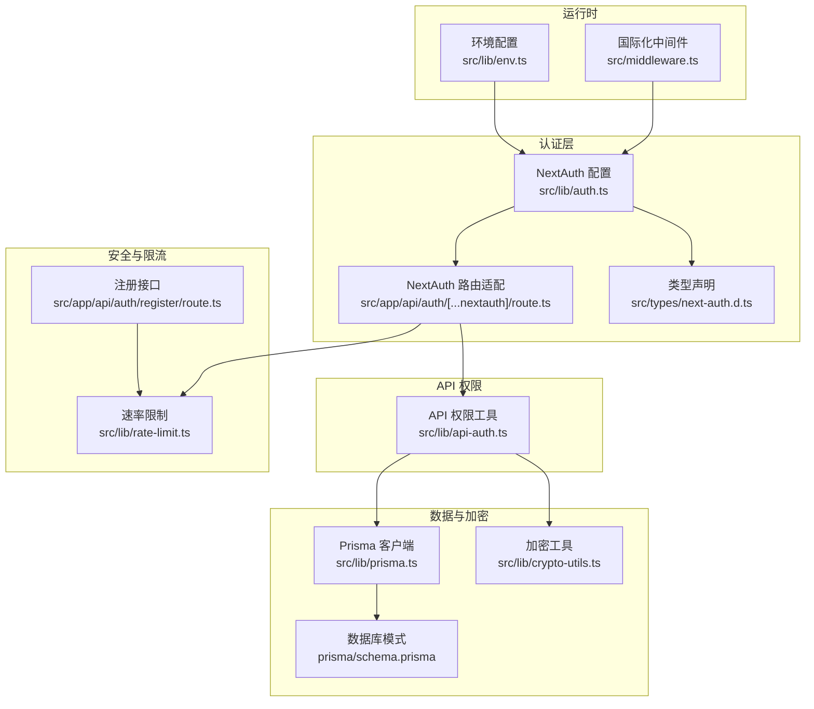
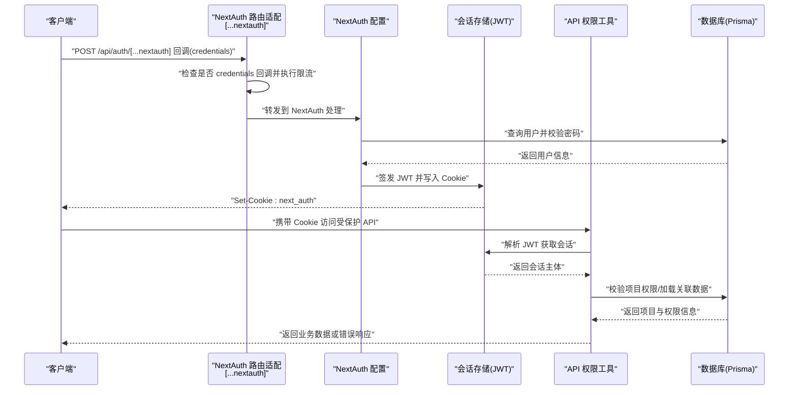
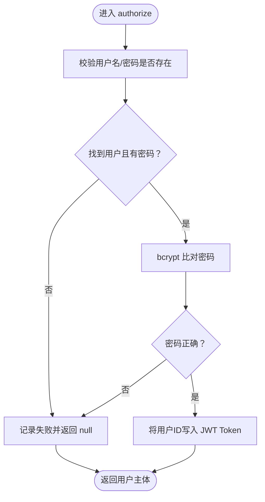
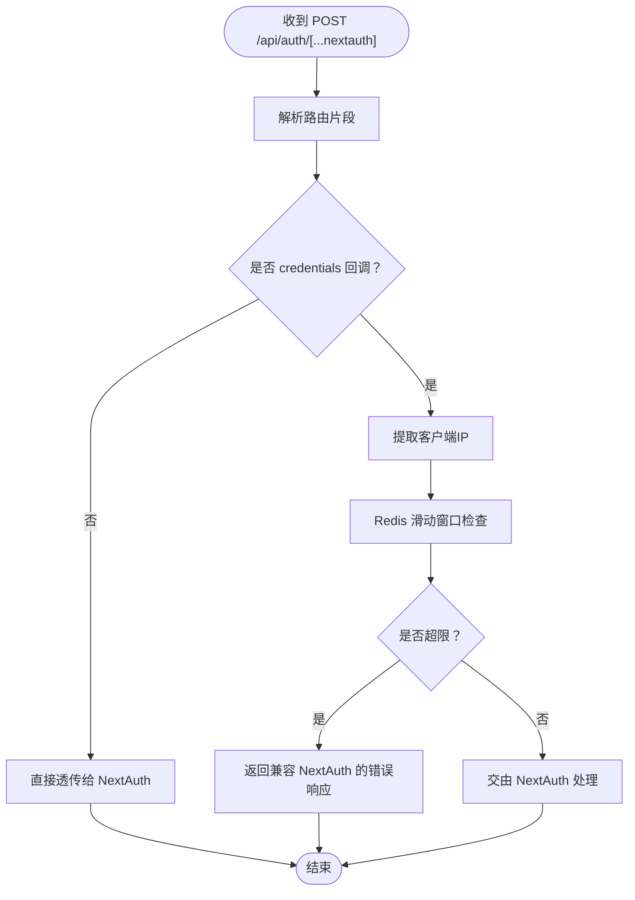
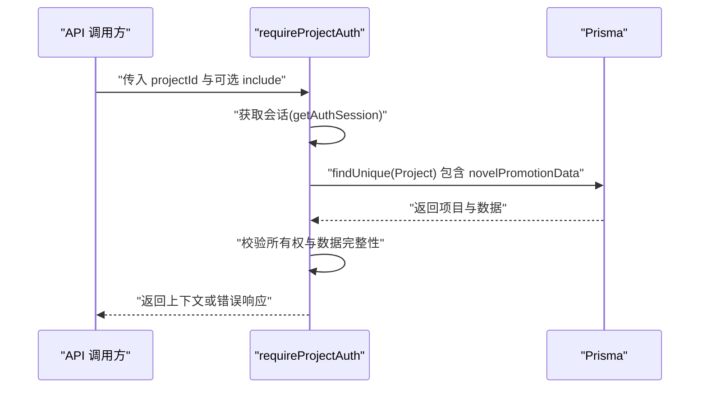
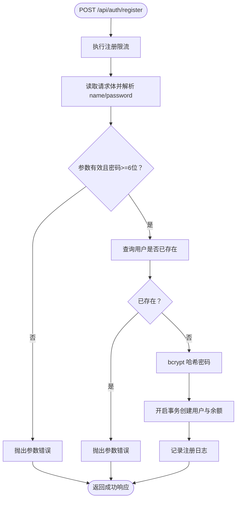
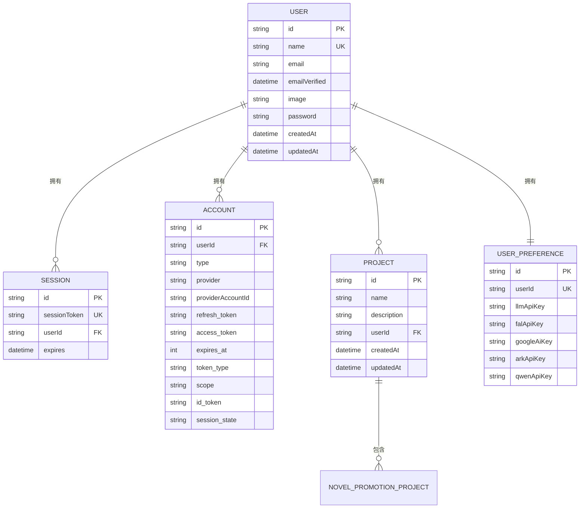
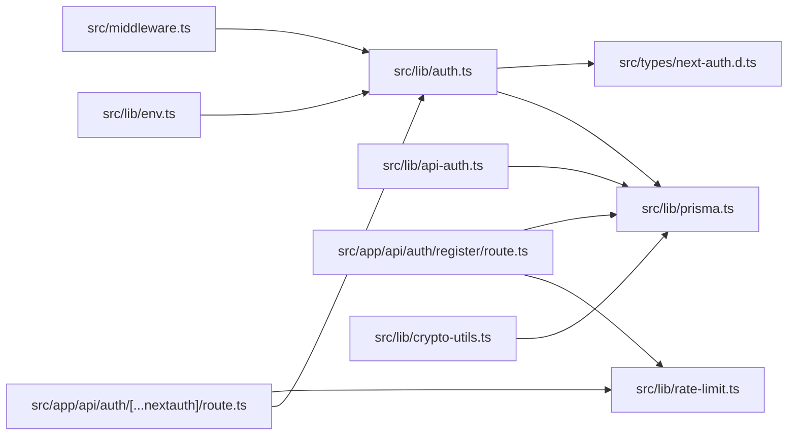

# 认证系统

<cite>
**本文引用的文件**
- [src/lib/auth.ts](file://src/lib/auth.ts)
- [src/app/api/auth/[...nextauth]/route.ts](file://src/app/api/auth/[...nextauth]/route.ts)
- [src/types/next-auth.d.ts](file://src/types/next-auth.d.ts)
- [src/lib/api-auth.ts](file://src/lib/api-auth.ts)
- [src/lib/rate-limit.ts](file://src/lib/rate-limit.ts)
- [src/app/api/auth/register/route.ts](file://src/app/api/auth/register/route.ts)
- [src/lib/prisma.ts](file://src/lib/prisma.ts)
- [prisma/schema.prisma](file://prisma/schema.prisma)
- [src/lib/crypto-utils.ts](file://src/lib/crypto-utils.ts)
- [src/lib/env.ts](file://src/lib/env.ts)
- [src/middleware.ts](file://src/middleware.ts)
</cite>

## 目录
1. [简介](#简介)
2. [项目结构](#项目结构)
3. [核心组件](#核心组件)
4. [架构总览](#架构总览)
5. [详细组件分析](#详细组件分析)
6. [依赖分析](#依赖分析)
7. [性能考虑](#性能考虑)
8. [故障排查指南](#故障排查指南)
9. [结论](#结论)
10. [附录](#附录)

## 简介
本文件面向Waoowaoo的认证系统，围绕基于NextAuth的认证架构进行深入解读，覆盖多种登录方式、会话管理、用户注册与登录流程、权限验证与API保护策略、JWT与会话持久化、安全策略（含CSRF/XSS防护与安全头）、OAuth与第三方登录、单点登录（SSO）配置思路、以及用户数据隐私与合规要点。文档同时提供可操作的集成示例与最佳实践，帮助开发者扩展与定制认证功能。

## 项目结构
认证相关代码主要分布在以下位置：
- NextAuth配置与路由适配：src/lib/auth.ts、src/app/api/auth/[...nextauth]/route.ts
- 类型声明：src/types/next-auth.d.ts
- API权限验证工具：src/lib/api-auth.ts
- 速率限制：src/lib/rate-limit.ts
- 用户注册API：src/app/api/auth/register/route.ts
- 数据库适配与模式：src/lib/prisma.ts、prisma/schema.prisma
- 加密工具（API Key）：src/lib/crypto-utils.ts
- 环境配置：src/lib/env.ts
- 国际化中间件（影响URL与Cookie策略）：src/middleware.ts

图表来源
- [src/lib/auth.ts:1-79](file://src/lib/auth.ts#L1-L79)
- [src/app/api/auth/[...nextauth]/route.ts:1-51](file://src/app/api/auth/[...nextauth]/route.ts#L1-L51)
- [src/types/next-auth.d.ts:1-22](file://src/types/next-auth.d.ts#L1-L22)
- [src/lib/api-auth.ts:1-355](file://src/lib/api-auth.ts#L1-L355)
- [src/lib/rate-limit.ts:1-146](file://src/lib/rate-limit.ts#L1-L146)
- [src/app/api/auth/register/route.ts:1-88](file://src/app/api/auth/register/route.ts#L1-L88)
- [src/lib/prisma.ts:1-9](file://src/lib/prisma.ts#L1-L9)
- [prisma/schema.prisma:1-800](file://prisma/schema.prisma#L1-L800)
- [src/lib/crypto-utils.ts:1-195](file://src/lib/crypto-utils.ts#L1-L195)
- [src/middleware.ts:1-28](file://src/middleware.ts#L1-L28)
- [src/lib/env.ts:1-38](file://src/lib/env.ts#L1-L38)

章节来源
- [src/lib/auth.ts:1-79](file://src/lib/auth.ts#L1-L79)
- [src/app/api/auth/[...nextauth]/route.ts:1-51](file://src/app/api/auth/[...nextauth]/route.ts#L1-L51)
- [src/lib/api-auth.ts:1-355](file://src/lib/api-auth.ts#L1-L355)
- [src/lib/rate-limit.ts:1-146](file://src/lib/rate-limit.ts#L1-L146)
- [src/app/api/auth/register/route.ts:1-88](file://src/app/api/auth/register/route.ts#L1-L88)
- [src/lib/prisma.ts:1-9](file://src/lib/prisma.ts#L1-L9)
- [prisma/schema.prisma:1-800](file://prisma/schema.prisma#L1-L800)
- [src/lib/crypto-utils.ts:1-195](file://src/lib/crypto-utils.ts#L1-L195)
- [src/middleware.ts:1-28](file://src/middleware.ts#L1-L28)
- [src/lib/env.ts:1-38](file://src/lib/env.ts#L1-L38)

## 核心组件
- NextAuth配置与回调：定义凭据提供者、JWT策略、会话策略、登录页重定向与回调处理。
- NextAuth路由适配：对凭据登录回调进行IP限流，保证兼容NextAuth客户端行为。
- API权限工具：统一的会话获取、鉴权、项目权限校验与错误响应构建。
- 速率限制：基于Redis滑动窗口的登录/注册限流，具备优雅降级。
- 注册流程：输入校验、去重检查、密码哈希、事务创建用户与初始余额。
- 数据模型：基于Prisma的用户、会话、账户、项目与偏好等模型。
- 加密工具：API Key加密/解密，确保敏感配置在数据库中的安全存储。
- 环境与中间件：基础URL、内部URL、国际化中间件对Cookie与URL的影响。

章节来源
- [src/lib/auth.ts:1-79](file://src/lib/auth.ts#L1-L79)
- [src/app/api/auth/[...nextauth]/route.ts:1-51](file://src/app/api/auth/[...nextauth]/route.ts#L1-L51)
- [src/lib/api-auth.ts:1-355](file://src/lib/api-auth.ts#L1-L355)
- [src/lib/rate-limit.ts:1-146](file://src/lib/rate-limit.ts#L1-L146)
- [src/app/api/auth/register/route.ts:1-88](file://src/app/api/auth/register/route.ts#L1-L88)
- [src/lib/prisma.ts:1-9](file://src/lib/prisma.ts#L1-L9)
- [prisma/schema.prisma:1-800](file://prisma/schema.prisma#L1-L800)
- [src/lib/crypto-utils.ts:1-195](file://src/lib/crypto-utils.ts#L1-L195)
- [src/lib/env.ts:1-38](file://src/lib/env.ts#L1-L38)
- [src/middleware.ts:1-28](file://src/middleware.ts#L1-L28)

## 架构总览
下图展示了从浏览器到服务端、数据库与外部系统的整体认证与授权流程，包括登录、会话、权限校验与API保护的关键节点。

图表来源
- [src/app/api/auth/[...nextauth]/route.ts:19-44](file://src/app/api/auth/[...nextauth]/route.ts#L19-L44)
- [src/lib/auth.ts:22-54](file://src/lib/auth.ts#L22-L54)
- [src/lib/api-auth.ts:173-292](file://src/lib/api-auth.ts#L173-L292)
- [src/lib/prisma.ts:1-9](file://src/lib/prisma.ts#L1-L9)

## 详细组件分析

### NextAuth配置与回调
- 凭据提供者：用户名/密码登录，通过bcrypt比对密码，日志记录登录动作。
- 会话策略：采用JWT策略，通过callbacks将用户ID注入JWT与Session。
- 登录页重定向：统一指向应用内登录页。
- 安全特性：信任主机与安全Cookie根据NEXTAUTH_URL协议自动切换；信任主机用于局域网HTTP场景。

图表来源
- [src/lib/auth.ts:22-54](file://src/lib/auth.ts#L22-L54)

章节来源
- [src/lib/auth.ts:1-79](file://src/lib/auth.ts#L1-L79)
- [src/types/next-auth.d.ts:1-22](file://src/types/next-auth.d.ts#L1-L22)

### NextAuth路由适配与限流
- 仅对凭据登录回调进行限流，避免影响NextAuth内部路由（如session/CSRF）。
- 限流结果兼容NextAuth客户端：当被限流时返回包含错误URL的JSON，便于客户端解析。
- 限流阈值：登录每60秒最多5次，注册每60秒最多3次。

图表来源
- [src/app/api/auth/[...nextauth]/route.ts:19-44](file://src/app/api/auth/[...nextauth]/route.ts#L19-L44)
- [src/lib/rate-limit.ts:58-118](file://src/lib/rate-limit.ts#L58-L118)

章节来源
- [src/app/api/auth/[...nextauth]/route.ts:1-51](file://src/app/api/auth/[...nextauth]/route.ts#L1-L51)
- [src/lib/rate-limit.ts:1-146](file://src/lib/rate-limit.ts#L1-L146)

### API权限验证与项目权限
- 会话获取：优先内部任务令牌，其次标准Session。
- 权限函数：
  - requireAuth：要求登录，否则返回未授权。
  - requireUserAuth：仅校验会话，适用于用户级API。
  - requireProjectAuth：校验项目存在、所有权与novelPromotionData，并可按需加载关联数据。
  - requireProjectAuthLight：轻量版项目权限校验。
- 错误响应：统一构建错误响应，包含错误码、消息与HTTP状态。

图表来源
- [src/lib/api-auth.ts:214-292](file://src/lib/api-auth.ts#L214-L292)
- [src/lib/prisma.ts:1-9](file://src/lib/prisma.ts#L1-L9)

章节来源
- [src/lib/api-auth.ts:1-355](file://src/lib/api-auth.ts#L1-L355)
- [src/lib/prisma.ts:1-9](file://src/lib/prisma.ts#L1-L9)

### 用户注册流程
- 输入校验：用户名与密码必填，密码长度至少6位。
- 去重检查：按用户名唯一约束检查。
- 密码哈希：使用bcrypt进行安全哈希。
- 事务创建：创建用户并初始化余额记录。
- 日志与响应：记录注册动作并返回成功信息。

图表来源
- [src/app/api/auth/register/route.ts:8-88](file://src/app/api/auth/register/route.ts#L8-L88)
- [src/lib/rate-limit.ts:58-118](file://src/lib/rate-limit.ts#L58-L118)

章节来源
- [src/app/api/auth/register/route.ts:1-88](file://src/app/api/auth/register/route.ts#L1-L88)
- [src/lib/rate-limit.ts:1-146](file://src/lib/rate-limit.ts#L1-L146)

### 数据模型与会话持久化
- 用户模型：包含用户名、邮箱、头像、密码等字段，关联项目、会话与偏好。
- 会话模型：用于传统Session策略（当前使用JWT），但保留以兼容历史。
- 账户模型：支持OAuth账户绑定，便于扩展第三方登录。
- 项目与偏好：项目表关联novelPromotionData，用户偏好表包含加密存储的API Key。

图表来源
- [prisma/schema.prisma:402-429](file://prisma/schema.prisma#L402-L429)
- [prisma/schema.prisma:369-378](file://prisma/schema.prisma#L369-L378)
- [prisma/schema.prisma:10-28](file://prisma/schema.prisma#L10-L28)
- [prisma/schema.prisma:353-367](file://prisma/schema.prisma#L353-L367)
- [prisma/schema.prisma:431-472](file://prisma/schema.prisma#L431-L472)

章节来源
- [prisma/schema.prisma:1-800](file://prisma/schema.prisma#L1-L800)
- [src/lib/prisma.ts:1-9](file://src/lib/prisma.ts#L1-L9)

### JWT与会话管理
- 策略：采用JWT策略，通过callbacks将用户ID写入JWT与Session，确保前后端一致。
- Cookie安全：根据NEXTAUTH_URL协议自动选择是否使用Secure Cookie；信任主机以支持局域网HTTP访问。
- 登录页：统一重定向至应用内登录页，便于UI与国际化中间件配合。

章节来源
- [src/lib/auth.ts:56-78](file://src/lib/auth.ts#L56-L78)
- [src/lib/auth.ts:59-61](file://src/lib/auth.ts#L59-L61)
- [src/lib/env.ts:6-8](file://src/lib/env.ts#L6-L8)

### OAuth与第三方登录
- 模型支持：Account模型支持OAuth账户绑定，可用于扩展Google、GitHub等第三方登录。
- 配置思路：在NextAuth配置中新增Provider（如Google/GitHub），并结合PrismaAdapter完成账户与用户的关联。
- 注意事项：需确保回调路由与安全Cookie策略匹配，避免跨域或非HTTPS场景下的Cookie设置问题。

章节来源
- [prisma/schema.prisma:10-28](file://prisma/schema.prisma#L10-L28)
- [src/lib/auth.ts:15-55](file://src/lib/auth.ts#L15-L55)

### 单点登录（SSO）与多实例部署
- SSO思路：通过共享的NextAuth URL与安全Cookie策略，在多实例间共享会话；结合Redis作为速率限制后端，确保跨实例一致性。
- 部署建议：在负载均衡后端启用粘性会话或共享缓存，确保会话与限流状态一致。

章节来源
- [src/lib/env.ts:6-8](file://src/lib/env.ts#L6-L8)
- [src/lib/rate-limit.ts:58-118](file://src/lib/rate-limit.ts#L58-L118)

### CSRF保护、XSS防护与安全头
- CSRF：NextAuth内置CSRF保护，路由适配中未对CSRF路由做额外处理，遵循NextAuth默认行为。
- XSS：前端渲染与后端响应均未发现直接XSS风险点；建议在UI层对用户输入进行严格转义与白名单校验。
- 安全头：当前未显式设置安全头；建议在生产环境增加HSTS、X-Frame-Options、X-Content-Type-Options等头部，提升安全性。

章节来源
- [src/app/api/auth/[...nextauth]/route.ts:19-44](file://src/app/api/auth/[...nextauth]/route.ts#L19-L44)

### 用户数据隐私与合规
- API Key加密：使用AES-256-GCM对用户敏感配置进行加密存储，密钥从NEXTAUTH_SECRET或专用API_ENCRYPTION_KEY派生。
- 数据最小化：仅在必要时加载项目关联数据，降低敏感数据暴露面。
- 日志审计：登录/注册动作记录到语义日志，便于审计与追踪。

章节来源
- [src/lib/crypto-utils.ts:27-38](file://src/lib/crypto-utils.ts#L27-L38)
- [src/lib/crypto-utils.ts:50-73](file://src/lib/crypto-utils.ts#L50-L73)
- [src/lib/crypto-utils.ts:85-111](file://src/lib/crypto-utils.ts#L85-L111)
- [src/lib/auth.ts:4-4](file://src/lib/auth.ts#L4-L4)
- [src/app/api/auth/register/route.ts:75-75](file://src/app/api/auth/register/route.ts#L75-L75)

## 依赖分析
- NextAuth与Prisma：NextAuth使用PrismaAdapter连接数据库，用户、会话、账户模型支撑认证与权限。
- 速率限制：依赖Redis，采用Lua脚本实现滑动窗口计数，具备原子性与优雅降级。
- 加密工具：依赖Node Crypto模块与PBKDF2派生密钥，确保API Key安全存储。
- 环境与中间件：NEXTAUTH_URL影响Cookie安全标志与信任主机策略；国际化中间件影响URL前缀与跳转行为。

图表来源
- [src/lib/auth.ts:1-79](file://src/lib/auth.ts#L1-L79)
- [src/app/api/auth/[...nextauth]/route.ts:1-51](file://src/app/api/auth/[...nextauth]/route.ts#L1-L51)
- [src/lib/api-auth.ts:1-355](file://src/lib/api-auth.ts#L1-L355)
- [src/lib/rate-limit.ts:1-146](file://src/lib/rate-limit.ts#L1-L146)
- [src/app/api/auth/register/route.ts:1-88](file://src/app/api/auth/register/route.ts#L1-L88)
- [src/lib/crypto-utils.ts:1-195](file://src/lib/crypto-utils.ts#L1-L195)
- [src/lib/env.ts:1-38](file://src/lib/env.ts#L1-L38)
- [src/middleware.ts:1-28](file://src/middleware.ts#L1-L28)

章节来源
- [src/lib/auth.ts:1-79](file://src/lib/auth.ts#L1-L79)
- [src/app/api/auth/[...nextauth]/route.ts:1-51](file://src/app/api/auth/[...nextauth]/route.ts#L1-L51)
- [src/lib/api-auth.ts:1-355](file://src/lib/api-auth.ts#L1-L355)
- [src/lib/rate-limit.ts:1-146](file://src/lib/rate-limit.ts#L1-L146)
- [src/app/api/auth/register/route.ts:1-88](file://src/app/api/auth/register/route.ts#L1-L88)
- [src/lib/crypto-utils.ts:1-195](file://src/lib/crypto-utils.ts#L1-L195)
- [src/lib/env.ts:1-38](file://src/lib/env.ts#L1-L38)
- [src/middleware.ts:1-28](file://src/middleware.ts#L1-L28)

## 性能考虑
- 会话策略：JWT策略减少数据库查询压力，适合高并发场景；注意JWT大小与Cookie体积限制。
- 限流策略：Redis滑动窗口具备原子性，避免竞态；Redis不可用时自动降级放行，保障系统可用性。
- 数据加载：requireProjectAuth支持按需include，减少不必要的关联查询与序列化开销。
- 事务与幂等：注册流程使用事务，确保一致性；建议在API层引入幂等键避免重复提交。

## 故障排查指南
- 登录被限流：检查Redis连通性与限流键空间；确认客户端IP提取是否正确（X-Forwarded-For、X-Real-IP）。
- Cookie无法设置：确认NEXTAUTH_URL协议与部署环境（HTTP/HTTPS）；局域网HTTP需信任主机。
- 会话解析失败：核对JWT签名与密钥一致性；检查回调链路是否正确注入用户ID。
- 权限拒绝：确认项目归属与novelPromotionData存在；检查include参数与关联数据加载。
- API Key解密失败：确认密钥派生配置与加密格式；解密失败时会回退为明文，需排查存储格式。

章节来源
- [src/lib/rate-limit.ts:128-145](file://src/lib/rate-limit.ts#L128-L145)
- [src/lib/auth.ts:10-14](file://src/lib/auth.ts#L10-L14)
- [src/lib/api-auth.ts:214-292](file://src/lib/api-auth.ts#L214-L292)
- [src/lib/crypto-utils.ts:85-111](file://src/lib/crypto-utils.ts#L85-L111)

## 结论
Waoowaoo的认证系统以NextAuth为核心，结合JWT会话、Prisma数据模型与Redis限流，实现了安全、可扩展的用户认证与授权能力。通过统一的API权限工具与严格的输入校验、密码哈希与API Key加密，系统在保障用户体验的同时兼顾了安全性与可维护性。建议在生产环境中补充安全头、完善CSRF与XSS防护，并持续优化限流与监控策略。

## 附录
- 实际集成示例
  - 登录：调用NextAuth回调路由，携带用户名与密码；若被限流，客户端将收到包含错误参数的URL。
  - 注册：POST /api/auth/register，携带name与password；成功后返回用户信息。
  - 受保护API：在API中调用requireAuth或requireProjectAuth，自动完成会话解析与权限校验。
- 最佳实践
  - 使用HTTPS与安全Cookie，避免局域网HTTP场景下的Cookie问题。
  - 为敏感操作（如修改密码、删除账户）增加二次验证与审计日志。
  - 对API Key与敏感字段进行加密存储，定期轮换密钥。
  - 在国际化中间件与NextAuth URL之间保持一致，避免语言前缀导致的重定向问题。