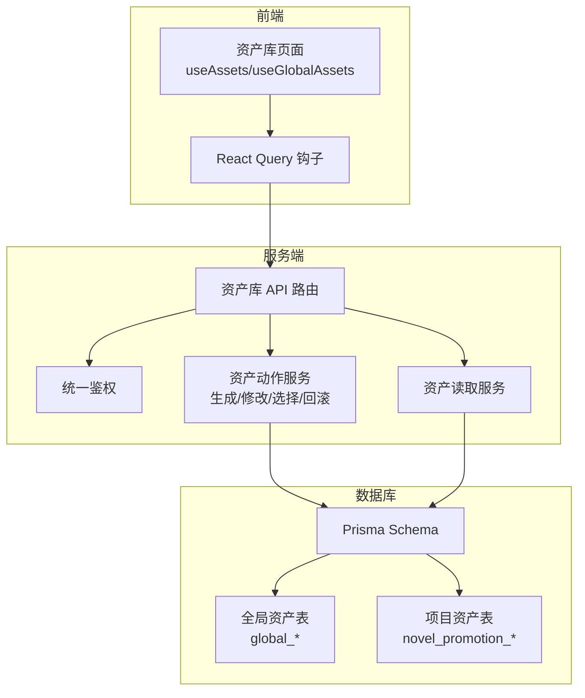
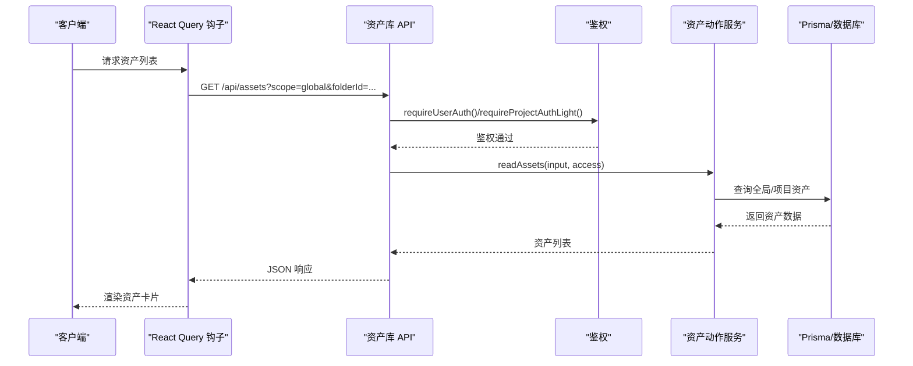
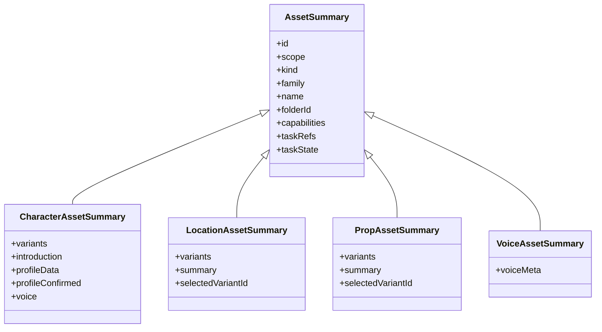
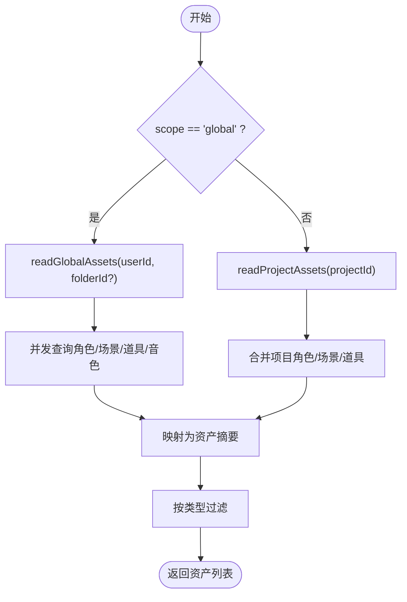
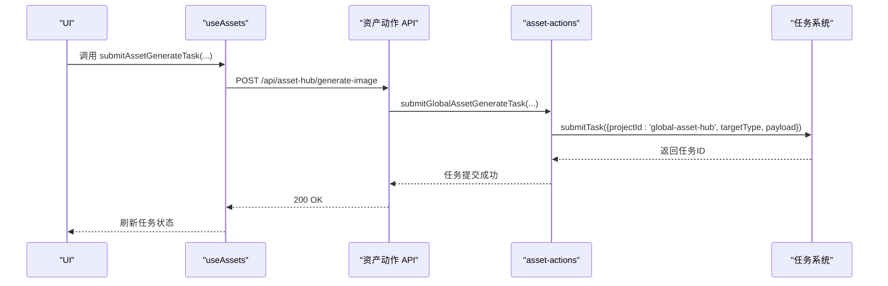
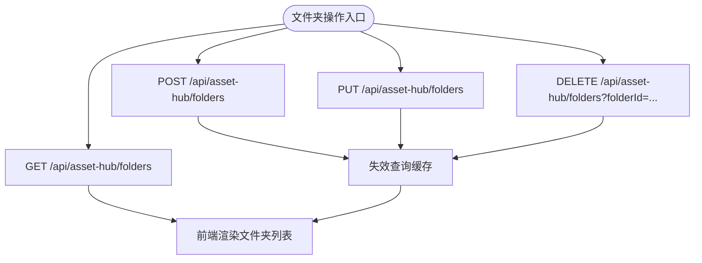
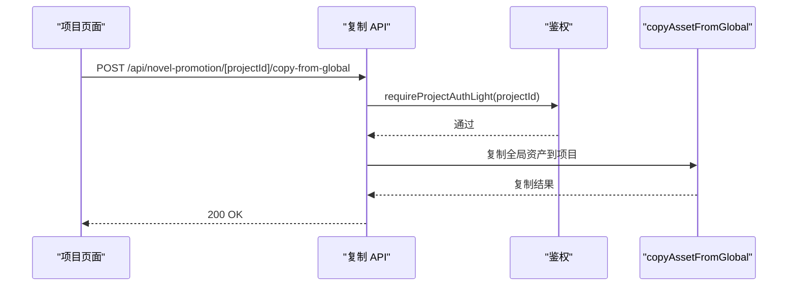
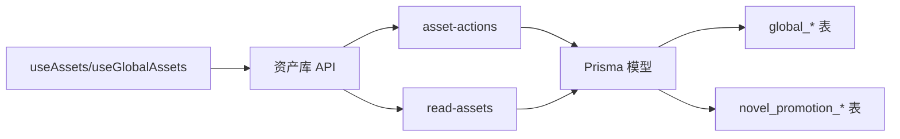

# 全局资产库

<cite>
**本文档引用的文件**
- [contracts.ts](file://src/lib/assets/contracts.ts)
- [read-assets.ts](file://src/lib/assets/services/read-assets.ts)
- [asset-actions.ts](file://src/lib/assets/services/asset-actions.ts)
- [location-backed-assets.ts](file://src/lib/assets/services/location-backed-assets.ts)
- [useAssets.ts](file://src/lib/query/hooks/useAssets.ts)
- [useGlobalAssets.ts](file://src/lib/query/hooks/useGlobalAssets.ts)
- [grouping.ts](file://src/lib/assets/grouping.ts)
- [page.tsx](file://src/app/[locale]/workspace/asset-hub/page.tsx)
- [route.ts](file://src/app/api/assets/route.ts)
- [folders/route.ts](file://src/app/api/asset-hub/folders/route.ts)
- [locations/route.ts](file://src/app/api/asset-hub/locations/route.ts)
- [characters/route.ts](file://src/app/api/asset-hub/characters/route.ts)
- [voices/route.ts](file://src/app/api/asset-hub/voices/route.ts)
- [copy-from-global/route.ts](file://src/app/api/novel-promotion/[projectId]/copy-from-global/route.ts)
- [schema.prisma](file://prisma/schema.prisma)
- [route.ts](file://src/app/api/asset-hub/generate-image/route.ts)
- [route.ts](file://src/app/api/asset-hub/modify-image/route.ts)
- [route.ts](file://src/app/api/asset-hub/select-image/route.ts)
- [route.ts](file://src/app/api/asset-hub/undo-image/route.ts)
- [route.ts](file://src/app/api/asset-hub/appearances/route.ts)
- [route.ts](file://src/app/api/asset-hub/picker/route.ts)
- [route.ts](file://src/app/api/asset-hub/reference-to-character/route.ts)
- [route.ts](file://src/app/api/asset-hub/update-asset-label/route.ts)
- [route.ts](file://src/app/api/asset-hub/upload-image/route.ts)
- [route.ts](file://src/app/api/asset-hub/upload-temp/route.ts)
- [route.ts](file://src/app/api/asset-hub/voice-design/route.ts)
- [route.ts](file://src/app/api/asset-hub/characters/[characterId]/route.ts)
- [route.ts](file://src/app/api/asset-hub/locations/[locationId]/route.ts)
- [route.ts](file://src/app/api/asset-hub/voices/[id]/route.ts)
- [route.ts](file://src/app/api/asset-hub/characters/[characterId]/appearances/[appearanceIndex]/route.ts)
- [route.ts](file://src/app/api/asset-hub/ai-design-character/route.ts)
- [route.ts](file://src/app/api/asset-hub/ai-modify-character/route.ts)
- [route.ts](file://src/app/api/asset-hub/ai-modify-location/route.ts)
- [route.ts](file://src/app/api/asset-hub/ai-modify-prop/route.ts)
- [route.ts](file://src/app/api/asset-hub/ai-design-location/route.ts)
- [route.ts](file://src/app/api/asset-hub/character-voice/route.ts)
- [route.ts](file://src/app/api/asset-hub/voices/upload/route.ts)
- [route.ts](file://src/app/api/asset-hub/characters/[characterId]/route.ts)
- [route.ts](file://src/app/api/asset-hub/locations/[locationId]/route.ts)
- [route.ts](file://src/app/api/asset-hub/voices/[id]/route.ts)
- [route.ts](file://src/app/api/asset-hub/characters/[characterId]/appearances/[appearanceIndex]/route.ts)
- [route.ts](file://src/app/api/asset-hub/ai-design-character/route.ts)
- [route.ts](file://src/app/api/asset-hub/ai-modify-character/route.ts)
- [route.ts](file://src/app/api/asset-hub/ai-modify-location/route.ts)
- [route.ts](file://src/app/api/asset-hub/ai-modify-prop/route.ts)
- [route.ts](file://src/app/api/asset-hub/ai-design-location/route.ts)
- [route.ts](file://src/app/api/asset-hub/character-voice/route.ts)
- [route.ts](file://src/app/api/asset-hub/voices/upload/route.ts)
</cite>

## 目录
1. [简介](#简介)
2. [项目结构](#项目结构)
3. [核心组件](#核心组件)
4. [架构总览](#架构总览)
5. [详细组件分析](#详细组件分析)
6. [依赖分析](#依赖分析)
7. [性能考虑](#性能考虑)
8. [故障排查指南](#故障排查指南)
9. [结论](#结论)
10. [附录](#附录)

## 简介
本文件系统性梳理 Waoowaoo 的“全局资产库”能力，覆盖跨项目资产共享机制、发布/订阅与权限控制、组织结构（文件夹/分类/访问控制）、复制/导入导出与批量操作、搜索/过滤/排序、版本管理与回滚、引用关系与依赖管理、API 接口与使用示例、与项目资产库的同步与冲突处理、性能优化与并发控制、以及监控与日志方案。目标是帮助开发者与产品人员快速理解并高效使用全局资产库。

## 项目结构
全局资产库由三层构成：
- 前端查询与交互层：React Query 钩子负责拉取与缓存资产数据，并与任务状态联动；页面组件负责展示与操作。
- 服务端 API 层：统一鉴权与路由，提供资产读写、生成、修改、选择、回滚等接口。
- 数据持久化层：Prisma 定义的全局资产表（角色、场景、道具、音色、文件夹）与项目内资产表并行存在，支持跨项目共享与复制。

图表来源
- [page.tsx:31-52](file://src/app/[locale]/workspace/asset-hub/page.tsx#L31-L52)
- [useAssets.ts:139-175](file://src/lib/query/hooks/useAssets.ts#L139-L175)
- [route.ts:23-69](file://src/app/api/assets/route.ts#L23-L69)
- [asset-actions.ts:143-329](file://src/lib/assets/services/asset-actions.ts#L143-L329)
- [read-assets.ts:106-117](file://src/lib/assets/services/read-assets.ts#L106-L117)
- [schema.prisma:797-800](file://prisma/schema.prisma#L797-L800)

章节来源
- [page.tsx:31-52](file://src/app/[locale]/workspace/asset-hub/page.tsx#L31-L52)
- [useAssets.ts:139-175](file://src/lib/query/hooks/useAssets.ts#L139-L175)
- [route.ts:23-69](file://src/app/api/assets/route.ts#L23-L69)
- [schema.prisma:797-800](file://prisma/schema.prisma#L797-L800)

## 核心组件
- 资产契约与数据模型：定义资产范围、种类、家族、任务状态、渲染变体等统一结构，确保全局与项目资产的统一消费体验。
- 资产读取服务：按作用域（全局/项目）与筛选条件（文件夹、类型）聚合资产，附加媒体字段与任务状态。
- 资产动作服务：封装生成、修改、选择、回滚等动作，统一提交任务、计费与幂等键策略。
- 文件夹与分类：全局资产库支持一级文件夹，用于资产归类与筛选。
- 项目到全局复制：提供从全局资产复制到项目的能力，保留来源信息以支持后续同步与冲突处理。

章节来源
- [contracts.ts:1-145](file://src/lib/assets/contracts.ts#L1-L145)
- [read-assets.ts:106-117](file://src/lib/assets/services/read-assets.ts#L106-L117)
- [asset-actions.ts:143-329](file://src/lib/assets/services/asset-actions.ts#L143-L329)
- [folders/route.ts:1-44](file://src/app/api/asset-hub/folders/route.ts#L1-L44)
- [copy-from-global/route.ts:1-42](file://src/app/api/novel-promotion/[projectId]/copy-from-global/route.ts#L1-L42)

## 架构总览
全局资产库采用“前端查询 + 服务端 API + 数据库”的分层架构。前端通过 React Query 缓存资产列表与任务状态，服务端路由进行统一鉴权与参数校验，动作服务封装业务逻辑并通过任务系统异步执行耗时操作，数据库层面通过 Prisma 模型区分全局与项目资产。

图表来源
- [useAssets.ts:139-175](file://src/lib/query/hooks/useAssets.ts#L139-L175)
- [route.ts:23-69](file://src/app/api/assets/route.ts#L23-L69)
- [read-assets.ts:106-117](file://src/lib/assets/services/read-assets.ts#L106-L117)

## 详细组件分析

### 资产契约与数据模型
- 资产范围与种类：支持全局与项目两种作用域，资产种类包括角色、场景、道具、音色；家族分为视觉与音频两类。
- 任务状态与能力：每个资产/变体/渲染均携带任务引用与状态，以及能力位（是否可生成、选择、修改、上传、绑定音色、从全局复制等）。
- 变体与渲染：角色资产包含多个外观变体，场景/道具资产包含多张图像渲染，每项渲染具备索引、描述、媒体、任务状态等。

图表来源
- [contracts.ts:60-127](file://src/lib/assets/contracts.ts#L60-L127)

章节来源
- [contracts.ts:1-145](file://src/lib/assets/contracts.ts#L1-L145)

### 资产读取与分组
- 读取策略：根据作用域分别调用项目或全局资产读取函数，支持按文件夹与类型过滤。
- 并发加载：角色、场景、道具、音色四类资产并行查询，随后统一映射为资产摘要。
- 分组与筛选：前端提供按种类分组与筛选工具，便于 UI 快速呈现。

图表来源
- [read-assets.ts:59-104](file://src/lib/assets/services/read-assets.ts#L59-L104)
- [grouping.ts:26-49](file://src/lib/assets/grouping.ts#L26-L49)

章节来源
- [read-assets.ts:106-117](file://src/lib/assets/services/read-assets.ts#L106-L117)
- [grouping.ts:1-49](file://src/lib/assets/grouping.ts#L1-L49)

### 资产动作与任务系统
- 生成图像：根据资产类型与外观索引，自动确定目标类型与幂等键，提交任务并携带计费信息。
- 修改图像：支持额外参考图校验与审计，提交修改任务并记录意图与输出状态。
- 选择与回滚：全局与项目路径分别实现选择确认与回滚逻辑，确保只保留选定渲染并清理多余资源。
- 任务状态联动：前端基于任务目标映射实时更新资产/变体/渲染的任务状态与错误信息。

图表来源
- [useAssets.ts:262-298](file://src/lib/query/hooks/useAssets.ts#L262-L298)
- [asset-actions.ts:143-236](file://src/lib/assets/services/asset-actions.ts#L143-L236)
- [route.ts](file://src/app/api/asset-hub/generate-image/route.ts)

章节来源
- [asset-actions.ts:143-329](file://src/lib/assets/services/asset-actions.ts#L143-L329)
- [useAssets.ts:55-175](file://src/lib/query/hooks/useAssets.ts#L55-L175)

### 文件夹与分类体系
- 文件夹管理：支持创建、更新、删除全局资产文件夹，按名称升序排列。
- 分类与筛选：资产按种类分组，前端可按文件夹与类型筛选，提升检索效率。

图表来源
- [folders/route.ts:1-44](file://src/app/api/asset-hub/folders/route.ts#L1-L44)
- [useGlobalAssets.ts:255-324](file://src/lib/query/hooks/useGlobalAssets.ts#L255-L324)

章节来源
- [folders/route.ts:1-44](file://src/app/api/asset-hub/folders/route.ts#L1-L44)
- [useGlobalAssets.ts:238-248](file://src/lib/query/hooks/useGlobalAssets.ts#L238-L248)

### 跨项目资产复制与同步
- 从全局复制到项目：提供专用路由，校验项目权限与参数，完成资产复制并记录来源信息。
- 同步与冲突：项目资产表中保留来源全局资产 ID 字段，便于后续分析与冲突处理策略（如优先级、合并规则）。

图表来源
- [copy-from-global/route.ts:12-42](file://src/app/api/novel-promotion/[projectId]/copy-from-global/route.ts#L12-L42)

章节来源
- [copy-from-global/route.ts:1-42](file://src/app/api/novel-promotion/[projectId]/copy-from-global/route.ts#L1-L42)
- [schema.prisma:89-96](file://prisma/schema.prisma#L89-L96)

### 版本管理、历史版本对比与回滚
- 历史版本：角色外观与场景/道具图像均维护上一版本的 URL 与描述，支持一键回滚。
- 回滚策略：全局与项目路径分别实现回滚逻辑，清理当前版本并恢复上一版本，同时清空上一版本备份。
- 对比与确认：选择渲染时支持“确认”模式，仅保留选定项并删除其他冗余资源。

章节来源
- [asset-actions.ts:681-797](file://src/lib/assets/services/asset-actions.ts#L681-L797)
- [schema.prisma:30-54](file://prisma/schema.prisma#L30-L54)
- [schema.prisma:56-77](file://prisma/schema.prisma#L56-L77)

### 引用关系、依赖管理与循环引用检测
- 引用关系：项目资产表包含来源全局资产 ID 字段，便于建立“项目资产 ←→ 全局资产”的引用链。
- 依赖管理：资产动作服务在生成/修改时根据目标类型与索引构建任务目标，避免跨资产误操作。
- 循环引用检测：建议在复制/链接时引入拓扑检查（如复制前计算引用深度与环路），并在 UI 中提示风险。

章节来源
- [schema.prisma:94-96](file://prisma/schema.prisma#L94-L96)
- [schema.prisma:111-113](file://prisma/schema.prisma#L111-L113)
- [asset-actions.ts:194-235](file://src/lib/assets/services/asset-actions.ts#L194-L235)

### 资产库 API 完整接口与使用示例
以下为关键接口清单与典型使用场景（路径与行为来自具体路由文件）：

- 通用资产接口
  - GET /api/assets?scope=global|project&projectId=...&folderId=...&kind=character|location|prop|voice
  - POST /api/assets（创建资产，scope 与 kind 必填）

- 文件夹接口
  - GET /api/asset-hub/folders
  - POST /api/asset-hub/folders
  - PUT /api/asset-hub/folders
  - DELETE /api/asset-hub/folders?folderId=...

- 角色/场景/音色管理
  - GET/POST /api/asset-hub/characters
  - GET/POST /api/asset-hub/locations
  - GET/POST /api/asset-hub/voices

- 图像生成/修改/选择/回滚
  - POST /api/asset-hub/generate-image
  - POST /api/asset-hub/modify-image
  - POST /api/asset-hub/select-image
  - POST /api/asset-hub/undo-image

- AI 辅助与上传
  - POST /api/asset-hub/ai-design-character
  - POST /api/asset-hub/ai-modify-character
  - POST /api/asset-hub/ai-modify-location
  - POST /api/asset-hub/ai-modify-prop
  - POST /api/asset-hub/ai-design-location
  - POST /api/asset-hub/character-voice
  - POST /api/asset-hub/voices/upload
  - POST /api/asset-hub/upload-image
  - POST /api/asset-hub/upload-temp

- 单条资产与外观
  - GET/PUT /api/asset-hub/characters/[characterId]
  - GET/PUT /api/asset-hub/locations/[locationId]
  - GET/PUT /api/asset-hub/voices/[id]
  - GET/PUT /api/asset-hub/characters/[characterId]/appearances/[appearanceIndex]

- 项目复制到全局
  - POST /api/novel-promotion/[projectId]/copy-from-global

章节来源
- [route.ts:23-69](file://src/app/api/assets/route.ts#L23-L69)
- [folders/route.ts:1-44](file://src/app/api/asset-hub/folders/route.ts#L1-L44)
- [characters/route.ts:18-46](file://src/app/api/asset-hub/characters/route.ts#L18-L46)
- [locations/route.ts:13-41](file://src/app/api/asset-hub/locations/route.ts#L13-L41)
- [voices/route.ts:8-35](file://src/app/api/asset-hub/voices/route.ts#L8-L35)
- [route.ts](file://src/app/api/asset-hub/generate-image/route.ts)
- [route.ts](file://src/app/api/asset-hub/modify-image/route.ts)
- [route.ts](file://src/app/api/asset-hub/select-image/route.ts)
- [route.ts](file://src/app/api/asset-hub/undo-image/route.ts)
- [route.ts](file://src/app/api/asset-hub/appearances/route.ts)
- [route.ts](file://src/app/api/asset-hub/picker/route.ts)
- [route.ts](file://src/app/api/asset-hub/reference-to-character/route.ts)
- [route.ts](file://src/app/api/asset-hub/update-asset-label/route.ts)
- [route.ts](file://src/app/api/asset-hub/upload-image/route.ts)
- [route.ts](file://src/app/api/asset-hub/upload-temp/route.ts)
- [route.ts](file://src/app/api/asset-hub/voice-design/route.ts)
- [route.ts](file://src/app/api/asset-hub/characters/[characterId]/route.ts)
- [route.ts](file://src/app/api/asset-hub/locations/[locationId]/route.ts)
- [route.ts](file://src/app/api/asset-hub/voices/[id]/route.ts)
- [route.ts](file://src/app/api/asset-hub/characters/[characterId]/appearances/[appearanceIndex]/route.ts)
- [route.ts](file://src/app/api/asset-hub/ai-design-character/route.ts)
- [route.ts](file://src/app/api/asset-hub/ai-modify-character/route.ts)
- [route.ts](file://src/app/api/asset-hub/ai-modify-location/route.ts)
- [route.ts](file://src/app/api/asset-hub/ai-modify-prop/route.ts)
- [route.ts](file://src/app/api/asset-hub/ai-design-location/route.ts)
- [route.ts](file://src/app/api/asset-hub/character-voice/route.ts)
- [route.ts](file://src/app/api/asset-hub/voices/upload/route.ts)
- [copy-from-global/route.ts:12-42](file://src/app/api/novel-promotion/[projectId]/copy-from-global/route.ts#L12-L42)

## 依赖分析
- 前端依赖：React Query 钩子依赖资产读取与任务状态查询；资产动作依赖统一鉴权与任务提交。
- 服务端依赖：资产动作服务依赖 Prisma 模型与任务系统；API 路由依赖鉴权与输入校验。
- 数据库依赖：全局资产与项目资产模型并行存在，通过来源字段建立跨项目引用。

图表来源
- [useAssets.ts:139-175](file://src/lib/query/hooks/useAssets.ts#L139-L175)
- [route.ts:23-69](file://src/app/api/assets/route.ts#L23-L69)
- [asset-actions.ts:143-329](file://src/lib/assets/services/asset-actions.ts#L143-L329)
- [read-assets.ts:106-117](file://src/lib/assets/services/read-assets.ts#L106-L117)
- [schema.prisma:797-800](file://prisma/schema.prisma#L797-L800)

章节来源
- [useAssets.ts:139-175](file://src/lib/query/hooks/useAssets.ts#L139-L175)
- [route.ts:23-69](file://src/app/api/assets/route.ts#L23-L69)
- [schema.prisma:797-800](file://prisma/schema.prisma#L797-L800)

## 性能考虑
- 前端缓存与并发：React Query 默认 5 秒缓存，资产列表与任务状态查询并行，减少重复请求。
- 数据库查询：按需筛选（文件夹、类型）与排序（创建时间）降低查询成本；并发查询四类资产。
- 任务去重：生成/修改任务使用目标类型+资产ID+索引等组合作为幂等键，避免重复执行。
- 存储清理：选择确认与回滚时清理冗余媒体对象，降低存储占用。

章节来源
- [useAssets.ts:139-175](file://src/lib/query/hooks/useAssets.ts#L139-L175)
- [asset-actions.ts:233-235](file://src/lib/assets/services/asset-actions.ts#L233-L235)
- [asset-actions.ts:540-618](file://src/lib/assets/services/asset-actions.ts#L540-L618)

## 故障排查指南
- 鉴权失败：确认已登录且作用域参数正确（全局/项目）。
- 参数错误：检查必填字段（名称、类型、作用域、项目ID等）与格式（如艺术风格值）。
- 任务异常：查看任务事件与错误码，定位具体步骤与原因。
- 媒体清理：若出现存储泄漏，检查回滚/确认流程是否正确执行。

章节来源
- [route.ts:23-69](file://src/app/api/assets/route.ts#L23-L69)
- [asset-actions.ts:517-618](file://src/lib/assets/services/asset-actions.ts#L517-L618)

## 结论
全局资产库通过清晰的契约模型、统一的鉴权与任务系统、完善的文件夹与分类体系，实现了跨项目的资产共享与复用。配合复制/同步、版本管理与回滚、引用关系与依赖管理，能够满足创意团队在多项目间高效协作的需求。建议在后续迭代中完善循环引用检测、冲突处理策略与更丰富的搜索/排序能力。

## 附录
- 数据模型概览（全局资产）
  - 全局文件夹：GlobalAssetFolder
  - 全局角色：GlobalCharacter（含 GlobalCharacterAppearance）
  - 全局场景：GlobalLocation（含 GlobalLocationImage）
  - 全局音色：GlobalVoice
- 数据模型概览（项目资产）
  - 项目角色：NovelPromotionCharacter（含 CharacterAppearance）
  - 项目场景：NovelPromotionLocation（含 LocationImage）
  - 项目剧集/剪辑/分镜/面板等（用于上下文关联）

章节来源
- [schema.prisma:797-800](file://prisma/schema.prisma#L797-L800)
- [schema.prisma:30-54](file://prisma/schema.prisma#L30-L54)
- [schema.prisma:56-77](file://prisma/schema.prisma#L56-L77)
- [schema.prisma:79-119](file://prisma/schema.prisma#L79-L119)