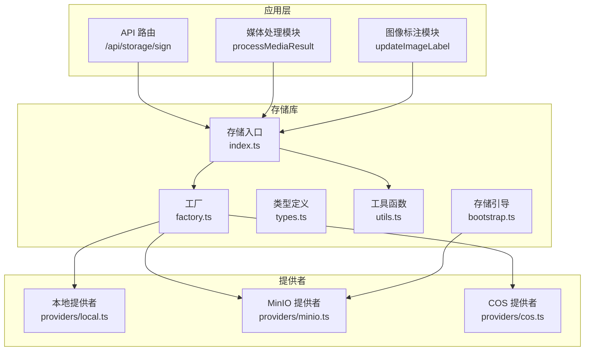
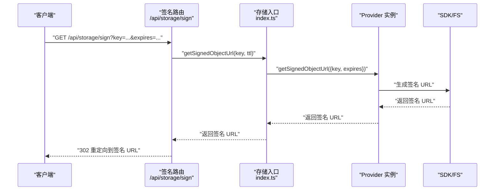
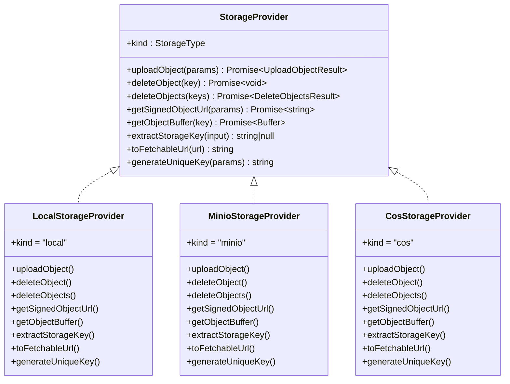
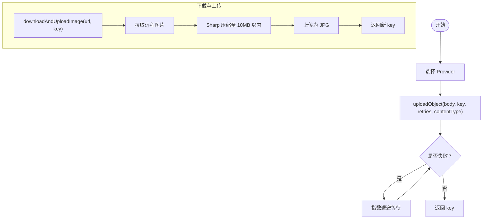
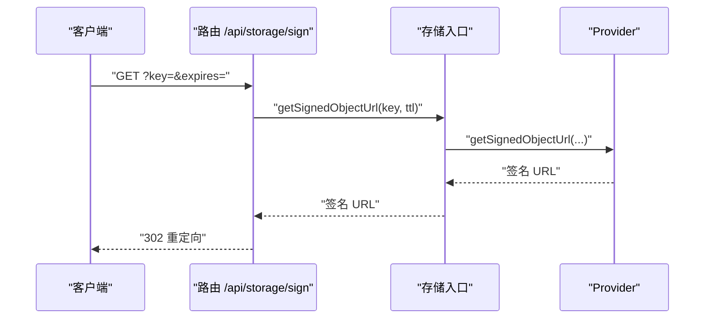
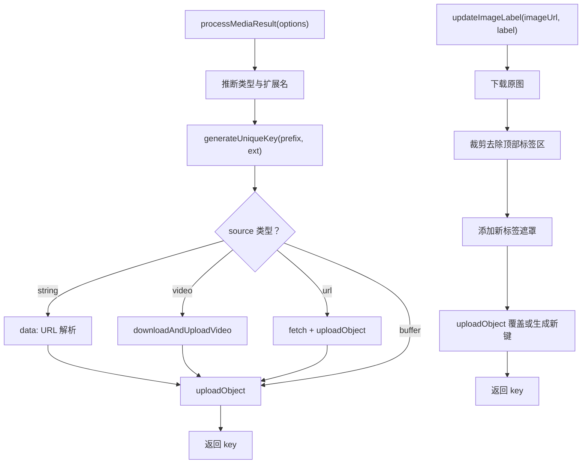
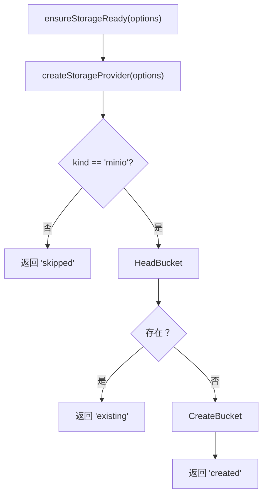
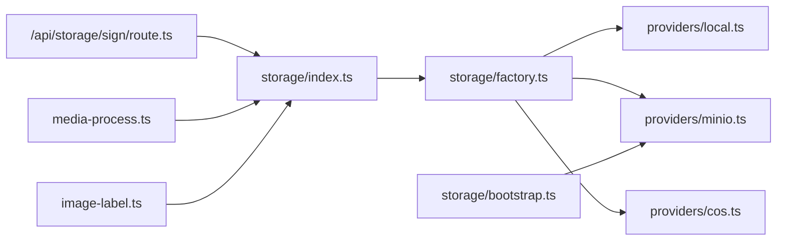

# 文件存储系统

<cite>
**本文引用的文件**
- [src/lib/storage/types.ts](file://src/lib/storage/types.ts)
- [src/lib/storage/index.ts](file://src/lib/storage/index.ts)
- [src/lib/storage/factory.ts](file://src/lib/storage/factory.ts)
- [src/lib/storage/utils.ts](file://src/lib/storage/utils.ts)
- [src/lib/storage/providers/local.ts](file://src/lib/storage/providers/local.ts)
- [src/lib/storage/providers/minio.ts](file://src/lib/storage/providers/minio.ts)
- [src/lib/storage/providers/cos.ts](file://src/lib/storage/providers/cos.ts)
- [src/lib/storage/bootstrap.ts](file://src/lib/storage/bootstrap.ts)
- [src/app/api/storage/sign/route.ts](file://src/app/api/storage/sign/route.ts)
- [src/lib/media-process.ts](file://src/lib/media-process.ts)
- [src/lib/image-label.ts](file://src/lib/image-label.ts)
- [scripts/migrate-to-minio.ts](file://scripts/migrate-to-minio.ts)
- [scripts/migrate-local-to-minio.ts](file://scripts/migrate-local-to-minio.ts)
- [scripts/test-sign-api.ts](file://scripts/test-sign-api.ts)
</cite>

## 目录
1. [简介](#简介)
2. [项目结构](#项目结构)
3. [核心组件](#核心组件)
4. [架构总览](#架构总览)
5. [详细组件分析](#详细组件分析)
6. [依赖关系分析](#依赖关系分析)
7. [性能考量](#性能考量)
8. [故障排查指南](#故障排查指南)
9. [结论](#结论)
10. [附录](#附录)

## 简介
本文件存储系统采用多存储后端架构，支持本地文件系统、MinIO 对象存储以及预留的 COS（腾讯云对象存储）适配器。系统通过统一的 Provider 接口屏蔽底层差异，提供上传、删除、批量删除、签名 URL 生成、对象读取、URL 规范化与唯一键生成等能力。同时，系统内置对图片的压缩与标签叠加处理、视频下载与上传流程，并提供存储初始化与桶检查能力，确保在 MinIO 场景下的可用性。

## 项目结构
围绕存储系统的代码主要位于 src/lib/storage 及其子目录，配合 API 层的签名路由与媒体处理模块共同构成完整的文件存储链路。

图表来源
- [src/app/api/storage/sign/route.ts:1-22](file://src/app/api/storage/sign/route.ts#L1-L22)
- [src/lib/media-process.ts:1-58](file://src/lib/media-process.ts#L1-L58)
- [src/lib/image-label.ts:1-78](file://src/lib/image-label.ts#L1-L78)
- [src/lib/storage/index.ts:1-142](file://src/lib/storage/index.ts#L1-L142)
- [src/lib/storage/factory.ts:1-26](file://src/lib/storage/factory.ts#L1-L26)
- [src/lib/storage/types.ts:1-37](file://src/lib/storage/types.ts#L1-L37)
- [src/lib/storage/utils.ts:1-83](file://src/lib/storage/utils.ts#L1-L83)
- [src/lib/storage/providers/local.ts:1-87](file://src/lib/storage/providers/local.ts#L1-L87)
- [src/lib/storage/providers/minio.ts:1-171](file://src/lib/storage/providers/minio.ts#L1-L171)
- [src/lib/storage/providers/cos.ts:1-43](file://src/lib/storage/providers/cos.ts#L1-L43)
- [src/lib/storage/bootstrap.ts:1-75](file://src/lib/storage/bootstrap.ts#L1-L75)

章节来源
- [src/lib/storage/index.ts:1-142](file://src/lib/storage/index.ts#L1-L142)
- [src/lib/storage/factory.ts:1-26](file://src/lib/storage/factory.ts#L1-L26)
- [src/lib/storage/types.ts:1-37](file://src/lib/storage/types.ts#L1-L37)
- [src/lib/storage/utils.ts:1-83](file://src/lib/storage/utils.ts#L1-L83)
- [src/lib/storage/providers/local.ts:1-87](file://src/lib/storage/providers/local.ts#L1-L87)
- [src/lib/storage/providers/minio.ts:1-171](file://src/lib/storage/providers/minio.ts#L1-L171)
- [src/lib/storage/providers/cos.ts:1-43](file://src/lib/storage/providers/cos.ts#L1-L43)
- [src/lib/storage/bootstrap.ts:1-75](file://src/lib/storage/bootstrap.ts#L1-L75)
- [src/app/api/storage/sign/route.ts:1-22](file://src/app/api/storage/sign/route.ts#L1-L22)
- [src/lib/media-process.ts:1-58](file://src/lib/media-process.ts#L1-L58)
- [src/lib/image-label.ts:1-78](file://src/lib/image-label.ts#L1-L78)

## 核心组件
- 统一接口与类型
  - StorageProvider 接口定义了上传、删除、批量删除、签名 URL、读取对象、提取键、可拉取 URL、生成唯一键等方法，保证不同后端的一致行为。
  - 类型定义包含 StorageType、UploadObjectParams、SignedUrlParams、DeleteObjectsResult 等，用于约束参数与返回值。
- 存储入口
  - 提供 getStorageProvider 单例获取、uploadObject、deleteObject/deleteObjects、getSignedObjectUrl/getSignedUrl、downloadAndUploadImage、downloadAndUploadVideo 等高层封装，内置重试与缓冲区处理。
- 工厂与选择
  - createStorageProvider 根据配置或环境变量选择具体 Provider；默认 minio，支持 local 与 cos（预留未实现）。
- 工具与引导
  - utils.ts 提供环境校验、URL 规范化、重试、流到缓冲区转换等通用能力。
  - bootstrap.ts 在 MinIO 场景下检查并创建桶，避免运行时缺失导致的错误。
- API 签名
  - /api/storage/sign 路由根据 key 与过期时间生成并重定向到签名 URL，简化客户端访问。

章节来源
- [src/lib/storage/types.ts:1-37](file://src/lib/storage/types.ts#L1-L37)
- [src/lib/storage/index.ts:1-142](file://src/lib/storage/index.ts#L1-L142)
- [src/lib/storage/factory.ts:1-26](file://src/lib/storage/factory.ts#L1-L26)
- [src/lib/storage/utils.ts:1-83](file://src/lib/storage/utils.ts#L1-L83)
- [src/lib/storage/bootstrap.ts:1-75](file://src/lib/storage/bootstrap.ts#L1-L75)
- [src/app/api/storage/sign/route.ts:1-22](file://src/app/api/storage/sign/route.ts#L1-L22)

## 架构总览
系统以“入口层 → 工厂 → Provider → 底层 SDK/FS”分层设计，API 层仅暴露统一的签名接口，业务侧通过入口模块完成上传、下载、签名等操作。

图表来源
- [src/app/api/storage/sign/route.ts:1-22](file://src/app/api/storage/sign/route.ts#L1-L22)
- [src/lib/storage/index.ts:70-84](file://src/lib/storage/index.ts#L70-L84)
- [src/lib/storage/providers/minio.ts:111-126](file://src/lib/storage/providers/minio.ts#L111-L126)
- [src/lib/storage/providers/local.ts:51-54](file://src/lib/storage/providers/local.ts#L51-L54)

## 详细组件分析

### 组件：Provider 接口与实现
- 接口职责
  - 上传/删除/批量删除：面向业务的最小操作集。
  - 签名 URL：为非本地提供统一的签名能力。
  - 对象读取：将流式响应转为 Buffer。
  - 键提取与 URL 规范化：从任意输入中提取存储键，将相对路径规范化为可拉取 URL。
  - 唯一键生成：按前缀与扩展名生成带时间戳与随机串的唯一键。
- Provider 实现对比
  - 本地提供者：基于 Node FS 写入/读取文件，签名 URL 直接映射到 /api/files/{key}。
  - MinIO 提供者：延迟加载 SDK，使用 S3Client 与 Presigner 生成签名 URL，支持批量删除与流式读取。
  - COS 提供者：当前抛出未实现异常，作为占位符。

图表来源
- [src/lib/storage/types.ts:23-33](file://src/lib/storage/types.ts#L23-L33)
- [src/lib/storage/providers/local.ts:12-86](file://src/lib/storage/providers/local.ts#L12-L86)
- [src/lib/storage/providers/minio.ts:22-170](file://src/lib/storage/providers/minio.ts#L22-L170)
- [src/lib/storage/providers/cos.ts:4-42](file://src/lib/storage/providers/cos.ts#L4-L42)

章节来源
- [src/lib/storage/types.ts:1-37](file://src/lib/storage/types.ts#L1-L37)
- [src/lib/storage/providers/local.ts:1-87](file://src/lib/storage/providers/local.ts#L1-L87)
- [src/lib/storage/providers/minio.ts:1-171](file://src/lib/storage/providers/minio.ts#L1-L171)
- [src/lib/storage/providers/cos.ts:1-43](file://src/lib/storage/providers/cos.ts#L1-L43)

### 组件：存储入口与高层封装
- 单例 Provider 获取与类型查询
- 上传封装：带指数退避重试，支持指定 Content-Type。
- 删除封装：单个与批量删除，返回统计结果。
- 签名封装：本地直连与远端签名的差异化处理。
- 下载与上传：图片自动压缩至阈值内，视频直接下载上传。
- 工具函数：重试、流转缓冲、URL 规范化。

图表来源
- [src/lib/storage/index.ts:35-52](file://src/lib/storage/index.ts#L35-L52)
- [src/lib/storage/index.ts:90-116](file://src/lib/storage/index.ts#L90-L116)
- [src/lib/storage/utils.ts:36-55](file://src/lib/storage/utils.ts#L36-L55)

章节来源
- [src/lib/storage/index.ts:1-142](file://src/lib/storage/index.ts#L1-L142)
- [src/lib/storage/utils.ts:1-83](file://src/lib/storage/utils.ts#L1-L83)

### 组件：API 签名路由
- 参数校验：必须提供 key；可选 expires，默认 3600 秒。
- 调用存储入口生成签名 URL 并进行 302 重定向。

图表来源
- [src/app/api/storage/sign/route.ts:7-21](file://src/app/api/storage/sign/route.ts#L7-L21)
- [src/lib/storage/index.ts:70-84](file://src/lib/storage/index.ts#L70-L84)

章节来源
- [src/app/api/storage/sign/route.ts:1-22](file://src/app/api/storage/sign/route.ts#L1-L22)
- [src/lib/storage/index.ts:70-84](file://src/lib/storage/index.ts#L70-L84)

### 组件：媒体处理与图像标注
- 媒体处理 processMediaResult
  - 支持字符串（含 data: URL）、Buffer 与远程 URL。
  - 自动推断扩展名与 MIME，生成唯一键并上传。
  - 视频场景走 downloadAndUploadVideo，图片走 Sharp 压缩。
- 图像标注 updateImageLabel
  - 下载原图 → 去除顶部标签区域 → 重新绘制带标签的底部遮罩 → 上传覆盖或生成新键。

图表来源
- [src/lib/media-process.ts:32-57](file://src/lib/media-process.ts#L32-L57)
- [src/lib/storage/index.ts:90-116](file://src/lib/storage/index.ts#L90-L116)
- [src/lib/image-label.ts:47-78](file://src/lib/image-label.ts#L47-L78)

章节来源
- [src/lib/media-process.ts:1-58](file://src/lib/media-process.ts#L1-L58)
- [src/lib/storage/index.ts:90-116](file://src/lib/storage/index.ts#L90-L116)
- [src/lib/image-label.ts:1-78](file://src/lib/image-label.ts#L1-L78)

### 组件：存储引导与桶管理
- ensureMinioBucket：检测桶是否存在，不存在则创建。
- ensureStorageReady：仅在 MinIO 时执行，其他 Provider 直接跳过。

图表来源
- [src/lib/storage/bootstrap.ts:66-74](file://src/lib/storage/bootstrap.ts#L66-L74)
- [src/lib/storage/bootstrap.ts:35-64](file://src/lib/storage/bootstrap.ts#L35-L64)

章节来源
- [src/lib/storage/bootstrap.ts:1-75](file://src/lib/storage/bootstrap.ts#L1-L75)

### 组件：迁移与测试脚本
- 迁移脚本 migrate-to-minio.ts：MinIO 官方 SDK，支持并发、断点续传、进度记录与日志级别。
- 迁移脚本 migrate-local-to-minio.ts：@aws-sdk/client-s3，演示从本地目录到 MinIO 的迁移。
- 测试脚本 test-sign-api.ts：上传对象、生成签名 URL 并验证可访问性。

章节来源
- [scripts/migrate-to-minio.ts:1-44](file://scripts/migrate-to-minio.ts#L1-L44)
- [scripts/migrate-local-to-minio.ts:1-33](file://scripts/migrate-local-to-minio.ts#L1-L33)
- [scripts/test-sign-api.ts:1-40](file://scripts/test-sign-api.ts#L1-L40)

## 依赖关系分析
- 入口模块依赖工厂模块以获取 Provider 实例；Provider 实例再依赖 SDK 或本地文件系统。
- API 签名路由依赖入口模块生成签名 URL。
- 媒体处理模块与图像标注模块均依赖入口模块完成上传与键生成。
- 引导模块仅在 MinIO 场景下生效，避免对本地或其他 Provider 的干扰。

图表来源
- [src/lib/storage/index.ts:1-21](file://src/lib/storage/index.ts#L1-L21)
- [src/lib/storage/factory.ts:15-26](file://src/lib/storage/factory.ts#L15-L26)
- [src/lib/storage/providers/local.ts:1-10](file://src/lib/storage/providers/local.ts#L1-L10)
- [src/lib/storage/providers/minio.ts:1-40](file://src/lib/storage/providers/minio.ts#L1-L40)
- [src/lib/storage/providers/cos.ts:1-10](file://src/lib/storage/providers/cos.ts#L1-L10)
- [src/app/api/storage/sign/route.ts:1-22](file://src/app/api/storage/sign/route.ts#L1-L22)
- [src/lib/media-process.ts:1-5](file://src/lib/media-process.ts#L1-L5)
- [src/lib/image-label.ts:1-6](file://src/lib/image-label.ts#L1-L6)
- [src/lib/storage/bootstrap.ts:66-74](file://src/lib/storage/bootstrap.ts#L66-L74)

章节来源
- [src/lib/storage/index.ts:1-142](file://src/lib/storage/index.ts#L1-L142)
- [src/lib/storage/factory.ts:1-26](file://src/lib/storage/factory.ts#L1-L26)
- [src/lib/storage/providers/local.ts:1-87](file://src/lib/storage/providers/local.ts#L1-L87)
- [src/lib/storage/providers/minio.ts:1-171](file://src/lib/storage/providers/minio.ts#L1-L171)
- [src/lib/storage/providers/cos.ts:1-43](file://src/lib/storage/providers/cos.ts#L1-L43)
- [src/app/api/storage/sign/route.ts:1-22](file://src/app/api/storage/sign/route.ts#L1-L22)
- [src/lib/media-process.ts:1-58](file://src/lib/media-process.ts#L1-L58)
- [src/lib/image-label.ts:1-78](file://src/lib/image-label.ts#L1-L78)
- [src/lib/storage/bootstrap.ts:1-75](file://src/lib/storage/bootstrap.ts#L1-L75)

## 性能考量
- 重试策略：默认最多 3 次，基础退避延迟约 2 秒，指数增长，降低瞬时峰值压力。
- 图片压缩：自动将图片压缩至 10MB 以内，减少传输与存储成本。
- 并发迁移：迁移脚本支持并发度配置，提升大体量数据迁移效率。
- 桶预检：MinIO 场景提前检查桶存在性，避免运行时错误带来的额外开销。
- CDN 加速建议：通过签名 URL 返回给前端，结合 CDN 缓存策略可显著降低源站压力（需在网关/CDN 层配置缓存头与回源策略）。

## 故障排查指南
- 环境变量缺失
  - 现象：初始化 Provider 抛出配置错误。
  - 排查：确认必需环境变量是否设置完整（如 MINIO_ENDPOINT、MINIO_BUCKET 等）。
- MinIO 桶不存在
  - 现象：首次启动报错或上传失败。
  - 排查：执行引导逻辑或手动创建桶。
- 签名 URL 无法访问
  - 现象：302 后仍无法访问。
  - 排查：检查签名 URL 是否过期、桶策略与跨域配置、CDN 缓存命中情况。
- 本地直连失效
  - 现象：本地 Provider 的 /api/files 访问 404。
  - 排查：确认 UPLOAD_DIR 配置与文件实际路径一致。
- 媒体处理失败
  - 现象：下载远程资源超时或压缩失败。
  - 排查：检查网络可达性、User-Agent 设置、目标资源防盗链策略。

章节来源
- [src/lib/storage/utils.ts:20-26](file://src/lib/storage/utils.ts#L20-L26)
- [src/lib/storage/bootstrap.ts:19-33](file://src/lib/storage/bootstrap.ts#L19-L33)
- [src/lib/storage/index.ts:77-84](file://src/lib/storage/index.ts#L77-L84)
- [src/lib/storage/providers/local.ts:5-10](file://src/lib/storage/providers/local.ts#L5-L10)
- [src/lib/media-process.ts:118-139](file://src/lib/media-process.ts#L118-L139)

## 结论
该文件存储系统通过统一接口与 Provider 架构实现了对本地与 MinIO 的无缝支持，并为未来扩展 COS 等对象存储提供了清晰的接入点。系统内置签名、重试、压缩与迁移工具，满足生产级的可用性与可维护性要求。结合 CDN 与合理的缓存策略，可在高并发场景下获得稳定且高效的访问体验。

## 附录

### 文件上传流程（含临时文件与验证）
- 输入校验：确保 key 与 body 存在，必要时设置 Content-Type。
- 重试上传：失败自动指数退避重试，避免瞬时抖动影响。
- 本地直连：/api/files/{key} 直接访问；远端签名：/api/storage/sign 生成带过期时间的 URL。
- 压缩与转码：图片自动压缩至阈值内；视频直接下载并上传；音频/图片按扩展名推断 MIME。

章节来源
- [src/lib/storage/index.ts:35-52](file://src/lib/storage/index.ts#L35-L52)
- [src/lib/storage/index.ts:77-84](file://src/lib/storage/index.ts#L77-L84)
- [src/lib/storage/index.ts:90-116](file://src/lib/storage/index.ts#L90-L116)
- [src/lib/media-process.ts:32-57](file://src/lib/media-process.ts#L32-L57)

### 文件命名规则与路径组织
- 唯一键生成：统一采用时间戳 + 随机串 + 扩展名的方式，前缀可自定义。
- 路径组织：当前实现将图片类资源置于 images/ 前缀下，便于分类与检索。
- 键提取：支持从 /api/files/、绝对路径、相对路径与带桶前缀的 URL 中提取键。

章节来源
- [src/lib/storage/providers/local.ts:81-85](file://src/lib/storage/providers/local.ts#L81-L85)
- [src/lib/storage/providers/minio.ts:165-169](file://src/lib/storage/providers/minio.ts#L165-L169)
- [src/lib/storage/providers/local.ts:60-75](file://src/lib/storage/providers/local.ts#L60-L75)
- [src/lib/storage/providers/minio.ts:138-159](file://src/lib/storage/providers/minio.ts#L138-L159)

### 版本管理机制
- 当前实现未提供显式的版本字段或版本控制 API；若需版本管理，可在键中引入版本号或引入独立的元数据表进行关联。

### 访问控制与安全策略
- 签名 URL：默认有效期 24 小时，可通过 /api/storage/sign 显式设置；建议在生产中缩短 TTL 并结合 IP 白名单或来源校验。
- 桶策略：MinIO 桶策略需允许 GetObject 权限；CDN 回源需放行签名 URL。
- 本地直连：仅在开发或受限网络中使用，生产建议统一走签名 URL。

章节来源
- [src/lib/storage/index.ts:4-8](file://src/lib/storage/index.ts#L4-L8)
- [src/lib/storage/index.ts:70-84](file://src/lib/storage/index.ts#L70-L84)
- [src/app/api/storage/sign/route.ts:5-17](file://src/app/api/storage/sign/route.ts#L5-L17)

### 缓存策略与 CDN 加速
- 签名 URL：由 CDN 缓存签名后的对象，减少源站压力。
- 建议：为不同尺寸与格式的对象设置差异化缓存头；对高频访问的资源启用长缓存，对动态内容缩短缓存周期。

### 存储 API 使用示例与最佳实践
- 上传对象
  - 路径参考：[src/lib/storage/index.ts:35-52](file://src/lib/storage/index.ts#L35-L52)
  - 最佳实践：为图片设置合适的 Content-Type；对大文件考虑分片上传（如后续扩展）。
- 生成签名 URL
  - 路径参考：[src/lib/storage/index.ts:70-84](file://src/lib/storage/index.ts#L70-L84)，[src/app/api/storage/sign/route.ts:7-21](file://src/app/api/storage/sign/route.ts#L7-L21)
  - 最佳实践：短 TTL + CDN 缓存；避免在 URL 中暴露敏感信息。
- 下载并上传媒体
  - 路径参考：[src/lib/storage/index.ts:90-116](file://src/lib/storage/index.ts#L90-L116)，[src/lib/media-process.ts:32-57](file://src/lib/media-process.ts#L32-L57)
  - 最佳实践：视频下载时设置合理的 User-Agent；对图片进行压缩以节省带宽。

### 与媒体处理管道的集成
- 管道入口：processMediaResult 根据类型自动选择下载/上传路径，统一生成唯一键。
- 图像标注：updateImageLabel 在现有图像上叠加标签，支持覆盖或生成新键。
- 性能优化：在媒体处理前后使用签名 URL，结合 CDN 缓存与边缘节点就近分发。

章节来源
- [src/lib/media-process.ts:32-57](file://src/lib/media-process.ts#L32-L57)
- [src/lib/image-label.ts:47-78](file://src/lib/image-label.ts#L47-L78)