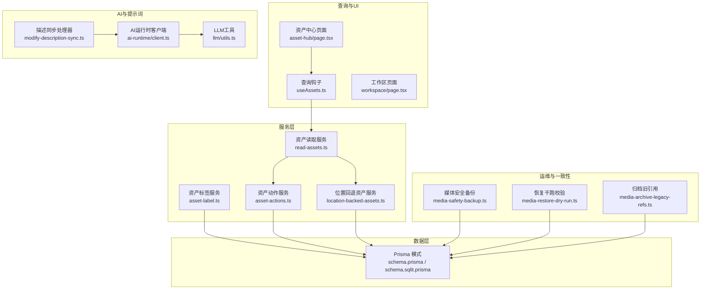
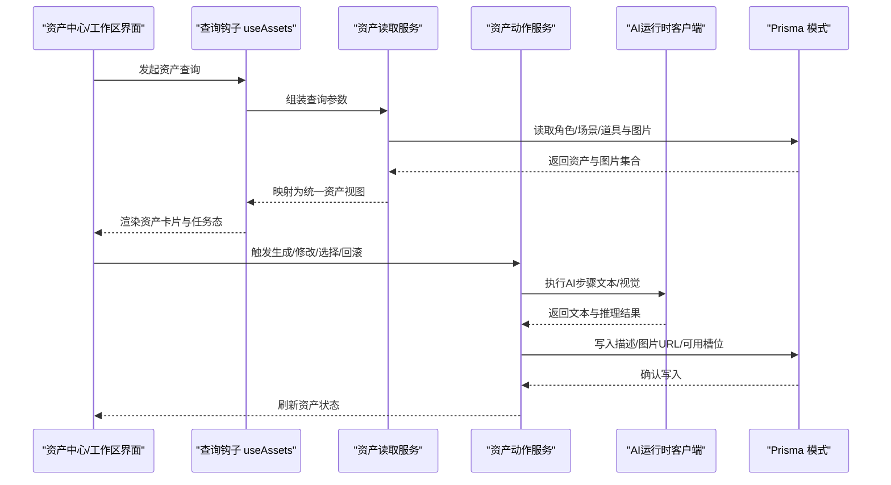
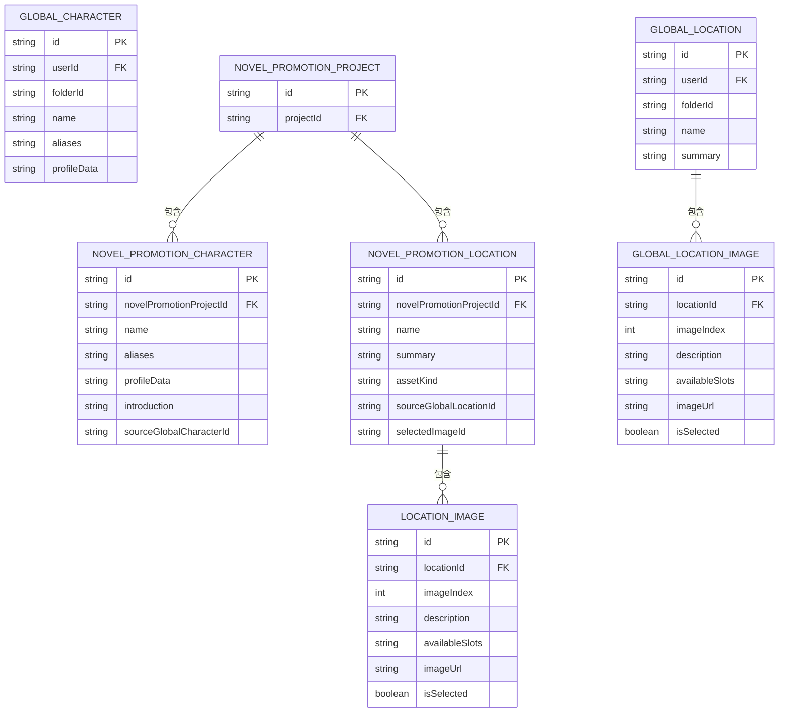
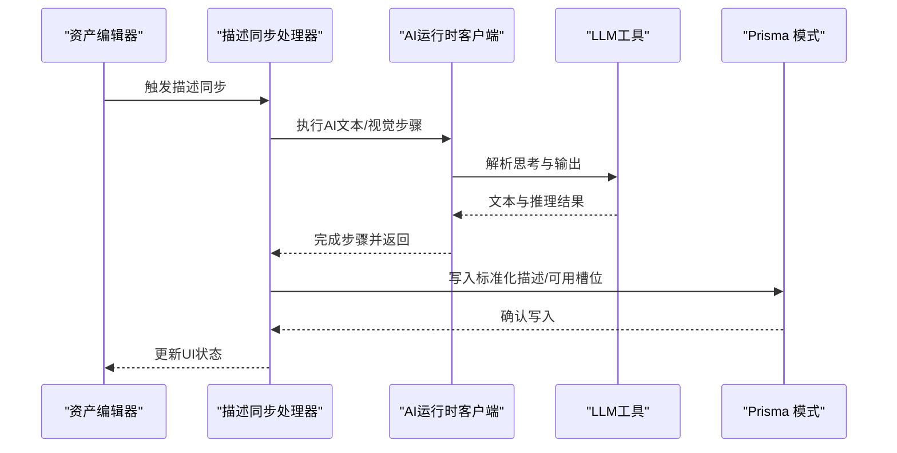
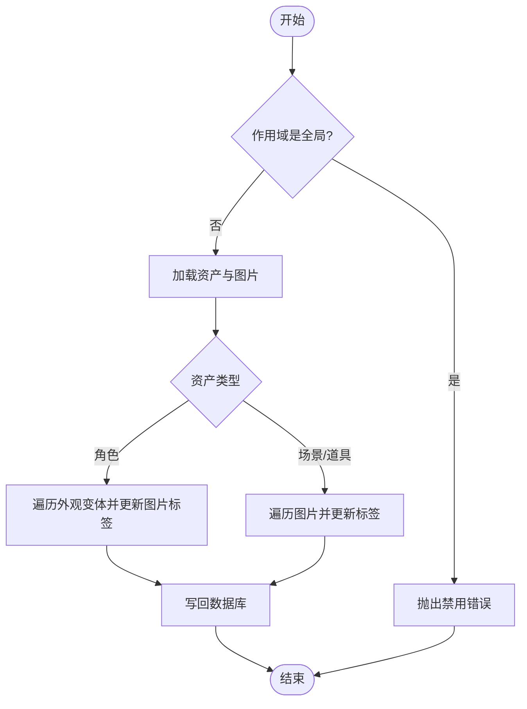
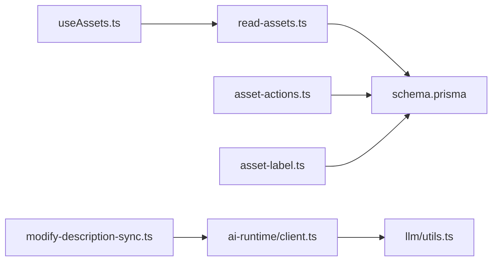

# 资产元数据管理

<cite>
**本文引用的文件**
- [schema.prisma](file://prisma/schema.prisma)
- [schema.sqlit.prisma](file://prisma/schema.sqlit.prisma)
- [location-backed-assets.ts](file://src/lib/assets/services/location-backed-assets.ts)
- [asset-actions.ts](file://src/lib/assets/services/asset-actions.ts)
- [asset-label.ts](file://src/lib/assets/services/asset-label.ts)
- [read-assets.ts](file://src/lib/assets/services/read-assets.ts)
- [useAssets.ts](file://src/lib/query/hooks/useAssets.ts)
- [modify-description-sync.ts](file://src/lib/workers/handlers/modify-description-sync.ts)
- [client.ts](file://src/lib/ai-runtime/client.ts)
- [utils.ts](file://src/lib/llm/utils.ts)
- [route.ts](file://src/app/api/asset-hub/update-asset-label/route.ts)
- [page.tsx](file://src/app/[locale]/workspace/asset-hub/page.tsx)
- [page.tsx](file://src/app/[locale]/workspace/page.tsx)
- [media-safety-backup.ts](file://scripts/media-safety-backup.ts)
- [media-restore-dry-run.ts](file://scripts/media-restore-dry-run.ts)
- [media-archive-legacy-refs.ts](file://scripts/media-archive-legacy-refs.ts)
- [requirements-matrix.ts](file://tests/contracts/requirements-matrix.ts)
</cite>

## 目录
1. [简介](#简介)
2. [项目结构](#项目结构)
3. [核心组件](#核心组件)
4. [架构总览](#架构总览)
5. [详细组件分析](#详细组件分析)
6. [依赖分析](#依赖分析)
7. [性能考虑](#性能考虑)
8. [故障排查指南](#故障排查指南)
9. [结论](#结论)
10. [附录](#附录)

## 简介
本文件面向Waoowaoo的资产元数据管理系统，系统性梳理角色、场景、道具等资产类型的元数据结构与管理流程，覆盖元数据的自动提取、人工编辑与智能补全、标签体系、验证与完整性校验、搜索索引与高级筛选、版本控制与审计追踪、API使用与批量工具、与AI生成内容的结合及智能推荐思路，以及迁移、备份恢复与数据一致性保障方案。文档以代码为依据，辅以可视化图示帮助理解。

## 项目结构
围绕资产元数据管理的关键目录与文件：
- 数据模型与迁移：prisma/schema.prisma、prisma/schema.sqlit.prisma
- 资产服务层：src/lib/assets/services/*
- 查询与UI绑定：src/lib/query/hooks/useAssets.ts
- 元数据编辑与标签：src/lib/assets/services/asset-label.ts、src/app/api/asset-hub/update-asset-label/route.ts
- 元数据读取与映射：src/lib/assets/services/read-assets.ts、src/lib/assets/services/location-backed-assets.ts
- AI运行时与提示词：src/lib/ai-runtime/client.ts、src/lib/llm/utils.ts、lib/prompts/*
- 工作流与同步：src/lib/workers/handlers/modify-description-sync.ts
- 备份与恢复：scripts/media-safety-backup.ts、scripts/media-restore-dry-run.ts、scripts/media-archive-legacy-refs.ts
- 测试契约矩阵：tests/contracts/requirements-matrix.ts

**图表来源**
- [schema.prisma:56-119](file://prisma/schema.prisma#L56-L119)
- [asset-actions.ts:34-102](file://src/lib/assets/services/asset-actions.ts#L34-L102)
- [location-backed-assets.ts:230-270](file://src/lib/assets/services/location-backed-assets.ts#L230-L270)
- [read-assets.ts:43-57](file://src/lib/assets/services/read-assets.ts#L43-L57)
- [asset-label.ts:26-34](file://src/lib/assets/services/asset-label.ts#L26-L34)
- [useAssets.ts:139-181](file://src/lib/query/hooks/useAssets.ts#L139-L181)
- [page.tsx:508-635](file://src/app/[locale]/workspace/asset-hub/page.tsx#L508-L635)
- [page.tsx:343-372](file://src/app/[locale]/workspace/page.tsx#L343-L372)
- [client.ts:49-79](file://src/lib/ai-runtime/client.ts#L49-L79)
- [utils.ts:46-81](file://src/lib/llm/utils.ts#L46-L81)
- [modify-description-sync.ts:1-19](file://src/lib/workers/handlers/modify-description-sync.ts#L1-L19)
- [media-safety-backup.ts:223-247](file://scripts/media-safety-backup.ts#L223-L247)
- [media-restore-dry-run.ts:73-102](file://scripts/media-restore-dry-run.ts#L73-L102)
- [media-archive-legacy-refs.ts:30-49](file://scripts/media-archive-legacy-refs.ts#L30-L49)

**章节来源**
- [schema.prisma:56-119](file://prisma/schema.prisma#L56-L119)
- [schema.sqlit.prisma:735-759](file://prisma/schema.sqlit.prisma#L735-L759)
- [asset-actions.ts:34-102](file://src/lib/assets/services/asset-actions.ts#L34-L102)
- [location-backed-assets.ts:230-270](file://src/lib/assets/services/location-backed-assets.ts#L230-L270)
- [read-assets.ts:43-57](file://src/lib/assets/services/read-assets.ts#L43-L57)
- [asset-label.ts:26-34](file://src/lib/assets/services/asset-label.ts#L26-L34)
- [useAssets.ts:139-181](file://src/lib/query/hooks/useAssets.ts#L139-L181)
- [page.tsx:508-635](file://src/app/[locale]/workspace/asset-hub/page.tsx#L508-L635)
- [page.tsx:343-372](file://src/app/[locale]/workspace/page.tsx#L343-L372)
- [client.ts:49-79](file://src/lib/ai-runtime/client.ts#L49-L79)
- [utils.ts:46-81](file://src/lib/llm/utils.ts#L46-L81)
- [modify-description-sync.ts:1-19](file://src/lib/workers/handlers/modify-description-sync.ts#L1-L19)
- [media-safety-backup.ts:223-247](file://scripts/media-safety-backup.ts#L223-L247)
- [media-restore-dry-run.ts:73-102](file://scripts/media-restore-dry-run.ts#L73-L102)
- [media-archive-legacy-refs.ts:30-49](file://scripts/media-archive-legacy-refs.ts#L30-L49)

## 核心组件
- 资产数据模型与索引
  - 角色、场景、道具在项目空间与全局空间均有对应模型；场景与道具共享LocationImage表，支持多变体与可用槽位。
  - 全局资产包含GlobalCharacter、GlobalLocation、GlobalLocationImage等，支持跨项目复用。
- 资产动作与写入
  - 统一的资产操作输入类型，涵盖生成、修改、选择、回滚、复制、更新、变体更新与创建/删除等。
- 资产读取与映射
  - 将项目内角色/场景/道具聚合为统一资产视图，并挂载媒体字段与任务状态。
- 标签与渲染
  - 支持对项目资产的渲染标签更新，全局资产图片标签更新已禁用。
- AI驱动的元数据同步
  - 通过AI运行时执行文本/视觉步骤，解析思考与输出，结合描述字段构建器进行同步。
- 备份与一致性
  - 提供媒体安全备份、恢复干跑校验与旧引用归档脚本，确保数据一致性与可恢复性。

**章节来源**
- [schema.prisma:56-119](file://prisma/schema.prisma#L56-L119)
- [schema.prisma:817-922](file://prisma/schema.prisma#L817-L922)
- [asset-actions.ts:34-102](file://src/lib/assets/services/asset-actions.ts#L34-L102)
- [read-assets.ts:43-57](file://src/lib/assets/services/read-assets.ts#L43-L57)
- [asset-label.ts:26-34](file://src/lib/assets/services/asset-label.ts#L26-L34)
- [client.ts:49-79](file://src/lib/ai-runtime/client.ts#L49-L79)
- [utils.ts:46-81](file://src/lib/llm/utils.ts#L46-L81)
- [media-safety-backup.ts:223-247](file://scripts/media-safety-backup.ts#L223-L247)
- [media-restore-dry-run.ts:73-102](file://scripts/media-restore-dry-run.ts#L73-L102)
- [media-archive-legacy-refs.ts:30-49](file://scripts/media-archive-legacy-refs.ts#L30-L49)

## 架构总览
资产元数据管理贯穿“模式定义—服务编排—查询绑定—AI同步—运维保障”的闭环：

**图表来源**
- [useAssets.ts:139-181](file://src/lib/query/hooks/useAssets.ts#L139-L181)
- [read-assets.ts:43-57](file://src/lib/assets/services/read-assets.ts#L43-L57)
- [asset-actions.ts:34-102](file://src/lib/assets/services/asset-actions.ts#L34-L102)
- [client.ts:49-79](file://src/lib/ai-runtime/client.ts#L49-L79)
- [schema.prisma:56-119](file://prisma/schema.prisma#L56-L119)

## 详细组件分析

### 资产元数据结构与标准化定义
- 角色（character）
  - 字段要点：名称、别名、简介、音色绑定、外观变体（含描述、图片URL数组、变更原因）。
  - 关系：属于项目，可被多个场景/分镜引用。
- 场景（location）
  - 字段要点：名称、摘要、选中图片ID、图片数组（含描述、可用槽位、是否选中、媒体对象）。
  - 关系：属于项目，可被多个片段/镜头引用。
- 道具（prop）
  - 字段要点：名称、摘要、选中图片ID、图片数组（结构与场景图片一致）。
  - 关系：属于项目，可被多个片段/镜头引用。
- 全局资产
  - 全局角色/场景/场景图片模型与项目内模型结构一致，支持跨项目复用与复制。

**图表来源**
- [schema.prisma:79-119](file://prisma/schema.prisma#L79-L119)
- [schema.prisma:817-922](file://prisma/schema.prisma#L817-L922)
- [schema.sqlit.prisma:735-759](file://prisma/schema.sqlit.prisma#L735-L759)

**章节来源**
- [schema.prisma:79-119](file://prisma/schema.prisma#L79-L119)
- [schema.prisma:817-922](file://prisma/schema.prisma#L817-L922)
- [schema.sqlit.prisma:735-759](file://prisma/schema.sqlit.prisma#L735-L759)

### 元数据自动提取、人工编辑与智能补全
- 自动提取与同步
  - 描述同步处理器负责调用AI运行时，解析思考与纯文本输出，结合描述字段构建器进行字段标准化与写回。
- 人工编辑
  - 资产中心页面提供角色/场景/道具的创建与编辑弹窗，支持在UI中直接编辑名称、摘要、描述等。
- 智能补全
  - AI运行时客户端封装了文本/视觉步骤执行、思考与输出拆分、用量统计等能力，便于在编辑流程中触发智能补全。

**图表来源**
- [modify-description-sync.ts:1-19](file://src/lib/workers/handlers/modify-description-sync.ts#L1-L19)
- [client.ts:49-79](file://src/lib/ai-runtime/client.ts#L49-L79)
- [utils.ts:46-81](file://src/lib/llm/utils.ts#L46-L81)

**章节来源**
- [modify-description-sync.ts:1-19](file://src/lib/workers/handlers/modify-description-sync.ts#L1-L19)
- [client.ts:49-79](file://src/lib/ai-runtime/client.ts#L49-L79)
- [utils.ts:46-81](file://src/lib/llm/utils.ts#L46-L81)

### 资产标签系统
- 标签渲染规则
  - 角色：名称 + 变体标签（默认“初始形象”）；场景/道具：仅名称。
- 标签更新策略
  - 项目资产：支持更新渲染标签，同时重写图片对象键并更新首图URL。
  - 全局资产：图片标签更新已禁用，避免跨项目影响。
- API行为
  - 更新资产标签接口对全局资产返回禁用错误码，防止误操作。

**图表来源**
- [asset-label.ts:26-34](file://src/lib/assets/services/asset-label.ts#L26-L34)
- [asset-label.ts:36-113](file://src/lib/assets/services/asset-label.ts#L36-L113)
- [route.ts:1-31](file://src/app/api/asset-hub/update-asset-label/route.ts#L1-L31)

**章节来源**
- [asset-label.ts:15-34](file://src/lib/assets/services/asset-label.ts#L15-L34)
- [asset-label.ts:36-113](file://src/lib/assets/services/asset-label.ts#L36-L113)
- [route.ts:1-31](file://src/app/api/asset-hub/update-asset-label/route.ts#L1-L31)

### 元数据验证规则、数据完整性检查与冲突解决
- 验证与约束
  - Prisma模式定义唯一索引与外键约束，确保资产与图片的唯一性与引用完整性。
- 数据完整性
  - 位置回退资产服务在创建时写入默认描述与可用槽位，保证最小可用性。
- 冲突解决
  - 标签更新采用生成新键与首图替换策略，避免标签冲突与缓存不一致。

**章节来源**
- [schema.prisma:56-77](file://prisma/schema.prisma#L56-L77)
- [schema.prisma:817-841](file://prisma/schema.prisma#L817-L841)
- [location-backed-assets.ts:230-270](file://src/lib/assets/services/location-backed-assets.ts#L230-L270)
- [asset-label.ts:56-77](file://src/lib/assets/services/asset-label.ts#L56-L77)

### 元数据搜索索引、全文检索与高级筛选
- 搜索入口
  - 工作区页面提供基础搜索框，支持输入关键词并清空。
- 筛选与查询
  - 查询钩子根据作用域与项目ID组装查询路径，启用防抖与过期时间，结合任务态映射增强筛选体验。
- 元数据索引
  - 当前模式未见专用全文索引字段；可通过扩展摘要/描述字段并引入外部搜索引擎实现全文检索。

**章节来源**
- [page.tsx:343-372](file://src/app/[locale]/workspace/page.tsx#L343-L372)
- [useAssets.ts:139-181](file://src/lib/query/hooks/useAssets.ts#L139-L181)

### 版本控制、变更历史与审计追踪
- 变更历史
  - 角色外观与场景图片均保留上一次描述/图片字段，支持回滚与对比。
- 审计追踪
  - 任务与图谱运行记录包含步骤尝试、错误码与时间戳，可用于审计与问题定位。

**章节来源**
- [schema.prisma:30-54](file://prisma/schema.prisma#L30-L54)
- [schema.prisma:56-77](file://prisma/schema.prisma#L56-L77)
- [schema.prisma:648-795](file://prisma/schema.prisma#L648-L795)

### 元数据API使用示例与批量处理工具
- API示例
  - 更新资产标签接口：校验参数、限制全局作用域、返回禁用错误码。
- 批量处理
  - 使用查询钩子批量获取资产列表，结合任务目标状态映射批量刷新UI状态。
- 后台脚本
  - 媒体安全备份：快照表计数、存储对象索引与校验和，生成元数据快照。
  - 恢复干跑校验：比对预期与实际计数差异，发现漂移但不写入。
  - 归档旧引用：扫描旧媒体引用并归档，避免数据漂移。

**章节来源**
- [route.ts:1-31](file://src/app/api/asset-hub/update-asset-label/route.ts#L1-L31)
- [useAssets.ts:139-181](file://src/lib/query/hooks/useAssets.ts#L139-L181)
- [media-safety-backup.ts:223-247](file://scripts/media-safety-backup.ts#L223-L247)
- [media-restore-dry-run.ts:73-102](file://scripts/media-restore-dry-run.ts#L73-L102)
- [media-archive-legacy-refs.ts:30-49](file://scripts/media-archive-legacy-refs.ts#L30-L49)

### 元数据与AI生成内容的结合与智能推荐
- 结合方式
  - 通过AI运行时客户端执行文本/视觉步骤，解析思考与输出，驱动元数据的自动提取与补全。
- 推荐思路
  - 基于资产描述相似度与可用槽位匹配，结合任务态与历史生成记录，推荐最合适的描述模板与风格提示。

**章节来源**
- [client.ts:49-79](file://src/lib/ai-runtime/client.ts#L49-L79)
- [utils.ts:46-81](file://src/lib/llm/utils.ts#L46-L81)

### 元数据迁移、备份恢复与数据一致性
- 迁移
  - 通过Prisma迁移文件维护模式演进，确保字段与索引变更的一致性。
- 备份
  - 媒体安全备份脚本生成包含表计数、存储对象索引与校验和的快照，便于恢复与核对。
- 恢复
  - 恢复干跑校验脚本比对当前与预期计数，发现差异即退出并报告。
- 一致性保障
  - 旧引用归档脚本扫描并归档历史媒体引用，降低漂移风险。

**章节来源**
- [schema.prisma:1-8](file://prisma/schema.prisma#L1-L8)
- [media-safety-backup.ts:223-247](file://scripts/media-safety-backup.ts#L223-L247)
- [media-restore-dry-run.ts:73-102](file://scripts/media-restore-dry-run.ts#L73-L102)
- [media-archive-legacy-refs.ts:30-49](file://scripts/media-archive-legacy-refs.ts#L30-L49)

## 依赖分析
- 组件耦合
  - 查询钩子依赖资产读取服务；资产读取服务依赖Prisma模式；资产动作服务与AI运行时共同驱动元数据写回。
- 外部依赖
  - AI运行时客户端依赖模型网关与提示词系统；标签更新依赖媒体对象与键生成策略。
- 潜在循环
  - 当前模块间为单向依赖，未见循环导入。

**图表来源**
- [useAssets.ts:139-181](file://src/lib/query/hooks/useAssets.ts#L139-L181)
- [read-assets.ts:43-57](file://src/lib/assets/services/read-assets.ts#L43-L57)
- [asset-actions.ts:34-102](file://src/lib/assets/services/asset-actions.ts#L34-L102)
- [asset-label.ts:26-34](file://src/lib/assets/services/asset-label.ts#L26-L34)
- [modify-description-sync.ts:1-19](file://src/lib/workers/handlers/modify-description-sync.ts#L1-L19)
- [client.ts:49-79](file://src/lib/ai-runtime/client.ts#L49-L79)
- [utils.ts:46-81](file://src/lib/llm/utils.ts#L46-L81)

**章节来源**
- [useAssets.ts:139-181](file://src/lib/query/hooks/useAssets.ts#L139-L181)
- [read-assets.ts:43-57](file://src/lib/assets/services/read-assets.ts#L43-L57)
- [asset-actions.ts:34-102](file://src/lib/assets/services/asset-actions.ts#L34-L102)
- [asset-label.ts:26-34](file://src/lib/assets/services/asset-label.ts#L26-L34)
- [modify-description-sync.ts:1-19](file://src/lib/workers/handlers/modify-description-sync.ts#L1-L19)
- [client.ts:49-79](file://src/lib/ai-runtime/client.ts#L49-L79)
- [utils.ts:46-81](file://src/lib/llm/utils.ts#L46-L81)

## 性能考虑
- 查询优化
  - 使用查询钩子的staleTime与enabled条件减少无效请求；按需加载媒体字段与任务态。
- 写入优化
  - 并行更新图片标签与URL，减少事务次数；必要时使用事务包裹以保证一致性。
- AI调用
  - 控制温度与推理强度，避免过度计算；对长文本分块处理，提升稳定性。

## 故障排查指南
- 标签更新失败
  - 全局资产标签更新被禁用，需切换到项目资产；检查错误码与消息。
- 元数据未生效
  - 检查AI运行时返回的思考与文本部分，确认解析逻辑；查看Prisma写入日志。
- 搜索无结果
  - 确认搜索关键词与资产摘要/描述字段是否匹配；考虑引入全文索引。
- 备份/恢复异常
  - 使用恢复干跑校验脚本比对差异；检查媒体对象索引与校验和。

**章节来源**
- [route.ts:1-31](file://src/app/api/asset-hub/update-asset-label/route.ts#L1-L31)
- [client.ts:49-79](file://src/lib/ai-runtime/client.ts#L49-L79)
- [media-restore-dry-run.ts:73-102](file://scripts/media-restore-dry-run.ts#L73-L102)

## 结论
本系统以Prisma模式为核心，配合资产服务层与查询钩子，实现了角色、场景、道具等资产元数据的标准化管理；通过AI运行时与描述同步处理器，打通了自动提取与智能补全链路；标签系统与备份恢复脚本保障了可用性与一致性。建议后续引入全文索引与更细粒度的权限控制，进一步完善搜索与安全。

## 附录
- 测试契约矩阵
  - 通过需求矩阵与测试用例映射，确保关键功能（如资产编辑、参考转角色、图像生成等）的覆盖率与回归保护。

**章节来源**
- [requirements-matrix.ts:12-49](file://tests/contracts/requirements-matrix.ts#L12-L49)