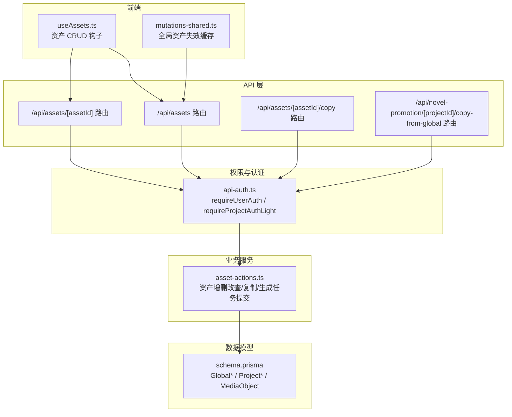
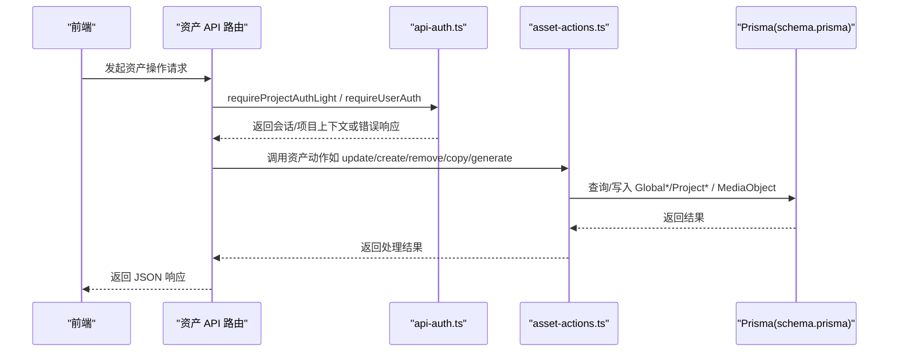
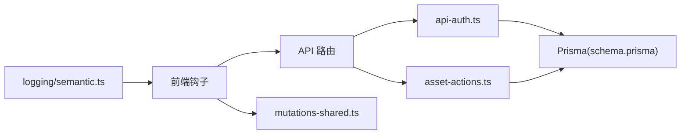

# 资产共享与权限

<cite>
**本文引用的文件**
- [src/lib/api-auth.ts](file://src/lib/api-auth.ts)
- [src/app/api/assets/route.ts](file://src/app/api/assets/route.ts)
- [src/app/api/assets/[assetId]/route.ts](file://src/app/api/assets/[assetId]/route.ts)
- [src/app/api/assets/[assetId]/copy/route.ts](file://src/app/api/assets/[assetId]/copy/route.ts)
- [src/app/api/novel-promotion/[projectId]/copy-from-global/route.ts](file://src/app/api/novel-promotion/[projectId]/copy-from-global/route.ts)
- [src/lib/assets/contracts.ts](file://src/lib/assets/contracts.ts)
- [src/lib/assets/services/asset-actions.ts](file://src/lib/assets/services/asset-actions.ts)
- [src/lib/query/hooks/useAssets.ts](file://src/lib/query/hooks/useAssets.ts)
- [src/lib/query/mutations/asset-hub-mutations-shared.ts](file://src/lib/query/mutations/asset-hub-mutations-shared.ts)
- [src/lib/logging/semantic.ts](file://src/lib/logging/semantic.ts)
- [src/lib/logging/types.ts](file://src/lib/logging/types.ts)
- [src/lib/logging/config.ts](file://src/lib/logging/config.ts)
- [src/lib/api-errors.ts](file://src/lib/api-errors.ts)
- [prisma/schema.prisma](file://prisma/schema.prisma)
- [tests/integration/api/specific/assets-route.test.ts](file://tests/integration/api/specific/assets-route.test.ts)
</cite>

## 目录
1. [简介](#简介)
2. [项目结构](#项目结构)
3. [核心组件](#核心组件)
4. [架构总览](#架构总览)
5. [详细组件分析](#详细组件分析)
6. [依赖分析](#依赖分析)
7. [性能考虑](#性能考虑)
8. [故障排查指南](#故障排查指南)
9. [结论](#结论)
10. [附录](#附录)

## 简介
本技术文档围绕 Waoowaoo 的“资产共享与权限”体系展开，系统性阐述资产权限模型、项目级与资产级权限控制、权限继承与冲突处理、权限验证与审计、跨项目资产共享机制（邀请、链接、临时访问）、权限 API 使用与集成、与认证系统的衔接以及安全策略。文档同时给出关键流程的可视化图示与最佳实践建议，帮助开发者与运维人员快速理解并正确使用该权限体系。

## 项目结构
围绕资产与权限的关键目录与文件如下：
- 认证与权限验证：src/lib/api-auth.ts
- 资产 API 入口与路由：src/app/api/assets/*.ts
- 跨项目资产复制路由：src/app/api/novel-promotion/[projectId]/copy-from-global/route.ts、src/app/api/assets/[assetId]/copy/route.ts
- 资产契约与能力模型：src/lib/assets/contracts.ts
- 资产动作服务与实现：src/lib/assets/services/asset-actions.ts
- 前端查询与变更钩子：src/lib/query/hooks/useAssets.ts、src/lib/query/mutations/asset-hub-mutations-shared.ts
- 日志与审计：src/lib/logging/semantic.ts、src/lib/logging/types.ts、src/lib/logging/config.ts
- 错误与审计开关：src/lib/api-errors.ts
- 数据模型（全局资产与项目资产）：prisma/schema.prisma

图表来源
- [src/app/api/assets/route.ts:23-53](file://src/app/api/assets/route.ts#L23-L53)
- [src/app/api/assets/[assetId]/route.ts](file://src/app/api/assets/[assetId]/route.ts#L1-L80)
- [src/app/api/assets/[assetId]/copy/route.ts](file://src/app/api/assets/[assetId]/copy/route.ts#L1-L34)
- [src/app/api/novel-promotion/[projectId]/copy-from-global/route.ts](file://src/app/api/novel-promotion/[projectId]/copy-from-global/route.ts#L1-L42)
- [src/lib/api-auth.ts:306-343](file://src/lib/api-auth.ts#L306-L343)
- [src/lib/assets/services/asset-actions.ts:1-200](file://src/lib/assets/services/asset-actions.ts#L1-L200)
- [src/lib/query/hooks/useAssets.ts:262-298](file://src/lib/query/hooks/useAssets.ts#L262-L298)
- [src/lib/query/mutations/asset-hub-mutations-shared.ts:1-17](file://src/lib/query/mutations/asset-hub-mutations-shared.ts#L1-L17)
- [prisma/schema.prisma:800-949](file://prisma/schema.prisma#L800-L949)

章节来源
- [src/lib/api-auth.ts:1-355](file://src/lib/api-auth.ts#L1-L355)
- [src/app/api/assets/route.ts:23-53](file://src/app/api/assets/route.ts#L23-L53)
- [src/app/api/assets/[assetId]/route.ts](file://src/app/api/assets/[assetId]/route.ts#L1-L80)
- [src/app/api/assets/[assetId]/copy/route.ts](file://src/app/api/assets/[assetId]/copy/route.ts#L1-L34)
- [src/app/api/novel-promotion/[projectId]/copy-from-global/route.ts](file://src/app/api/novel-promotion/[projectId]/copy-from-global/route.ts#L1-L42)
- [src/lib/assets/contracts.ts:1-145](file://src/lib/assets/contracts.ts#L1-L145)
- [src/lib/assets/services/asset-actions.ts:1-200](file://src/lib/assets/services/asset-actions.ts#L1-L200)
- [src/lib/query/hooks/useAssets.ts:262-298](file://src/lib/query/hooks/useAssets.ts#L262-L298)
- [src/lib/query/mutations/asset-hub-mutations-shared.ts:1-17](file://src/lib/query/mutations/asset-hub-mutations-shared.ts#L1-L17)
- [prisma/schema.prisma:800-949](file://prisma/schema.prisma#L800-L949)

## 核心组件
- 权限验证与认证
  - requireUserAuth：要求用户登录，适用于用户级 API（如全局资产库）
  - requireProjectAuthLight：仅验证项目存在与所有权，不强制加载 novelPromotionData
- 资产契约与能力
  - AssetScope：global / project
  - AssetKind：character / location / prop / voice
  - AssetCapabilityMap：canGenerate / canSelectRender / canRevertRender / canModifyRender / canUploadRender / canBindVoice / canCopyFromGlobal
- 资产动作服务
  - 支持资产生成、修改、选择、回退、更新、变体更新、创建、删除、从全局复制等
  - 通过 access.scope、userId、projectId 控制作用域
- 前端钩子
  - useAssetActions：封装资产创建/删除等调用，自动失效相关查询缓存
- 数据模型
  - GlobalAssetFolder / GlobalCharacter / GlobalLocation / GlobalVoice
  - Project 与 User 关系，MediaObject 作为媒体对象引用

章节来源
- [src/lib/api-auth.ts:306-343](file://src/lib/api-auth.ts#L306-L343)
- [src/lib/assets/contracts.ts:3-27](file://src/lib/assets/contracts.ts#L3-L27)
- [src/lib/assets/services/asset-actions.ts:34-141](file://src/lib/assets/services/asset-actions.ts#L34-L141)
- [src/lib/query/hooks/useAssets.ts:262-298](file://src/lib/query/hooks/useAssets.ts#L262-L298)
- [prisma/schema.prisma:800-949](file://prisma/schema.prisma#L800-L949)

## 架构总览
权限系统以“API 路由 → 权限验证 → 业务服务 → 数据模型”的链路运行；前端通过钩子发起请求，服务层根据 scope 决定使用用户级或项目级权限，并在必要时提交任务或写入数据库。

图表来源
- [src/app/api/assets/[assetId]/route.ts](file://src/app/api/assets/[assetId]/route.ts#L21-L60)
- [src/lib/api-auth.ts:319-343](file://src/lib/api-auth.ts#L319-L343)
- [src/lib/assets/services/asset-actions.ts:143-200](file://src/lib/assets/services/asset-actions.ts#L143-L200)
- [prisma/schema.prisma:800-949](file://prisma/schema.prisma#L800-L949)

## 详细组件分析

### 权限模型与作用域
- 作用域
  - global：面向用户级全局资产库（全局角色、全局场景、全局音色）
  - project：面向项目内资产（角色、场景、道具）
- 能力模型
  - AssetCapabilityMap 中的 canCopyFromGlobal 表征“从全局复制到项目”的能力
- 资产类型
  - AssetKind 覆盖 character / location / prop / voice，不同类型的可执行操作不同（如 location/prop 支持删除）

章节来源
- [src/lib/assets/contracts.ts:3-27](file://src/lib/assets/contracts.ts#L3-L27)
- [src/app/api/assets/[assetId]/route.ts](file://src/app/api/assets/[assetId]/route.ts#L62-L70)

### 项目级权限控制
- 项目所有权
  - requireProjectAuthLight 在项目存在与所有权校验失败时返回 403
- 项目内资产读取与写入
  - /api/assets 与 /api/assets/[assetId] 根据 scope 选择 requireProjectAuthLight 或 requireUserAuth
  - 写入操作携带 access.scope、userId、projectId，确保作用域与归属一致

章节来源
- [src/lib/api-auth.ts:319-343](file://src/lib/api-auth.ts#L319-L343)
- [src/app/api/assets/route.ts:23-53](file://src/app/api/assets/route.ts#L23-L53)
- [src/app/api/assets/[assetId]/route.ts](file://src/app/api/assets/[assetId]/route.ts#L21-L60)

### 资产级细粒度权限
- 能力字段
  - canCopyFromGlobal：用于判断是否允许从全局复制到项目
- 操作限制
  - 删除：仅 location / prop 支持删除
  - 更新：支持 project/global 两种 scope
  - 复制：从全局复制到项目，需携带目标 projectId 与目标资产 id

章节来源
- [src/lib/assets/contracts.ts:19-27](file://src/lib/assets/contracts.ts#L19-L27)
- [src/app/api/assets/[assetId]/route.ts](file://src/app/api/assets/[assetId]/route.ts#L62-L70)
- [src/app/api/assets/[assetId]/copy/route.ts](file://src/app/api/assets/[assetId]/copy/route.ts#L18-L21)

### 权限继承、权限链与冲突处理
- 继承与链路
  - 项目级权限通过 requireProjectAuthLight 保证“项目拥有者”才能对项目内资产进行写操作
  - 全局资产库通过 requireUserAuth 保证“登录用户”才能访问
- 冲突处理
  - 当 scope 与资源类型不匹配（如删除非 location/prop）时，直接返回 INVALID_PARAMS
  - 当缺少 projectId 时，requireProjectAuthLight 返回 404/403

章节来源
- [src/lib/api-auth.ts:319-343](file://src/lib/api-auth.ts#L319-L343)
- [src/app/api/assets/[assetId]/route.ts](file://src/app/api/assets/[assetId]/route.ts#L27-L29)
- [src/app/api/assets/[assetId]/route.ts](file://src/app/api/assets/[assetId]/route.ts#L78-L80)

### 权限验证、缓存与审计
- 权限验证
  - requireUserAuth / requireProjectAuthLight 统一返回 NextResponse 错误响应，便于 API 层直接返回
- 缓存
  - useAssetActions 在成功后主动失效相关查询缓存，避免脏读
  - 全局资产失效工具提供针对全局角色/场景/音色的缓存失效模板
- 审计
  - 语义化日志提供 logUserAction / logProjectAction / logAuthAction 等接口，支持审计标记
  - 日志配置支持启用/级别/格式/敏感字段脱敏

章节来源
- [src/lib/api-auth.ts:145-163](file://src/lib/api-auth.ts#L145-L163)
- [src/lib/query/hooks/useAssets.ts:262-298](file://src/lib/query/hooks/useAssets.ts#L262-L298)
- [src/lib/query/mutations/asset-hub-mutations-shared.ts:1-17](file://src/lib/query/mutations/asset-hub-mutations-shared.ts#L1-L17)
- [src/lib/logging/semantic.ts:55-236](file://src/lib/logging/semantic.ts#L55-L236)
- [src/lib/logging/config.ts:24-41](file://src/lib/logging/config.ts#L24-L41)

### 跨项目资产共享
- 从全局复制到项目
  - /api/assets/[assetId]/copy：将全局资产复制到指定项目内的目标资产
  - /api/novel-promotion/[projectId]/copy-from-global：将全局资产复制到指定项目的目标实体
- 邀请机制
  - 代码未见显式“邀请”API；可通过项目所有权与全局资产复制配合实现跨团队共享
- 链接分享与临时访问
  - 代码未见公开链接分享与临时访问令牌；若需实现，可在现有 requireProjectAuthLight 基础上扩展临时访问策略

章节来源
- [src/app/api/assets/[assetId]/copy/route.ts](file://src/app/api/assets/[assetId]/copy/route.ts#L1-L34)
- [src/app/api/novel-promotion/[projectId]/copy-from-global/route.ts](file://src/app/api/novel-promotion/[projectId]/copy-from-global/route.ts#L1-L42)

### 权限 API 使用示例与集成
- 读取项目资产
  - 请求 /api/assets?scope=project&projectId=xxx&kind=prop
  - 需通过 requireProjectAuthLight 校验
- 创建项目资产（location/prop）
  - POST /api/assets，body 包含 scope=project、projectId、kind、资产字段
  - 需通过 requireProjectAuthLight 校验
- 更新资产
  - PATCH /api/assets/[assetId]，body 包含 scope、kind、projectId
  - 需通过 requireProjectAuthLight 校验
- 删除资产（location/prop）
  - DELETE /api/assets/[assetId]，body 包含 scope=project、kind=location|prop、projectId
  - 需通过 requireProjectAuthLight 校验
- 从全局复制到项目
  - POST /api/assets/[assetId]/copy，body 包含 kind、projectId、globalAssetId
  - 需通过 requireProjectAuthLight 校验

章节来源
- [src/app/api/assets/route.ts:23-53](file://src/app/api/assets/route.ts#L23-L53)
- [src/app/api/assets/[assetId]/route.ts](file://src/app/api/assets/[assetId]/route.ts#L21-L60)
- [src/app/api/assets/[assetId]/copy/route.ts](file://src/app/api/assets/[assetId]/copy/route.ts#L18-L33)
- [tests/integration/api/specific/assets-route.test.ts:95-125](file://tests/integration/api/specific/assets-route.test.ts#L95-L125)

### 与认证系统的集成与安全策略
- 认证集成
  - requireUserAuth / requireProjectAuthLight 基于 NextAuth 会话获取用户信息
  - 项目权限校验包含项目存在性与所有权校验
- 安全策略
  - 严格区分 global 与 project 作用域
  - 对生成/分析/语音等高开销操作进行审计开关控制
  - 敏感字段脱敏与日志级别控制

章节来源
- [src/lib/api-auth.ts:173-191](file://src/lib/api-auth.ts#L173-L191)
- [src/lib/api-auth.ts:319-343](file://src/lib/api-auth.ts#L319-L343)
- [src/lib/logging/config.ts:24-41](file://src/lib/logging/config.ts#L24-L41)
- [src/lib/api-errors.ts:46-51](file://src/lib/api-errors.ts#L46-L51)

### 权限迁移、批量授权与清理
- 迁移
  - 项目模式字段已迁移移除，权限模型保持以 ownership 为核心
- 批量授权
  - 代码未见批量授权 API；可通过复制全局资产到项目的方式批量引入
- 清理
  - 支持删除 location/prop；可结合任务清理与媒体对象删除

章节来源
- [prisma/migrations/20260324120000_drop_project_mode/migration.sql:1-2](file://prisma/migrations/20260324120000_drop_project_mode/migration.sql#L1-L2)
- [src/app/api/assets/[assetId]/route.ts](file://src/app/api/assets/[assetId]/route.ts#L68-L70)
- [src/lib/assets/services/asset-actions.ts:1185-1194](file://src/lib/assets/services/asset-actions.ts#L1185-L1194)

## 依赖分析
- API 路由依赖权限验证模块
- 权限验证模块依赖 Prisma 与 NextAuth
- 资产动作服务依赖 Prisma、任务提交与计费配置
- 前端钩子依赖 API 与查询缓存失效工具
- 日志模块提供统一审计入口

图表来源
- [src/app/api/assets/route.ts:23-53](file://src/app/api/assets/route.ts#L23-L53)
- [src/lib/api-auth.ts:306-343](file://src/lib/api-auth.ts#L306-L343)
- [src/lib/assets/services/asset-actions.ts:1-200](file://src/lib/assets/services/asset-actions.ts#L1-L200)
- [src/lib/query/mutations/asset-hub-mutations-shared.ts:1-17](file://src/lib/query/mutations/asset-hub-mutations-shared.ts#L1-L17)
- [src/lib/logging/semantic.ts:55-236](file://src/lib/logging/semantic.ts#L55-L236)
- [prisma/schema.prisma:800-949](file://prisma/schema.prisma#L800-L949)

章节来源
- [src/lib/api-auth.ts:1-355](file://src/lib/api-auth.ts#L1-L355)
- [src/lib/assets/services/asset-actions.ts:1-200](file://src/lib/assets/services/asset-actions.ts#L1-L200)
- [src/lib/query/mutations/asset-hub-mutations-shared.ts:1-17](file://src/lib/query/mutations/asset-hub-mutations-shared.ts#L1-L17)
- [src/lib/logging/semantic.ts:55-236](file://src/lib/logging/semantic.ts#L55-L236)
- [prisma/schema.prisma:800-949](file://prisma/schema.prisma#L800-L949)

## 性能考虑
- 权限验证与数据库查询
  - requireProjectAuthLight 不加载 novelPromotionData，减少查询开销
  - 对项目存在性与所有权的快速校验避免后续昂贵操作
- 前端缓存
  - useAssetActions 成功后主动失效相关查询，降低重复渲染成本
- 日志与审计
  - 通过日志级别与审计开关控制输出，避免高负载下的性能损耗

## 故障排查指南
- 常见错误
  - UNAUTHORIZED：未登录或会话无效
  - FORBIDDEN：非项目所有者访问项目资产
  - NOT_FOUND：项目不存在或资产不存在
  - INVALID_PARAMS：scope/assetKind/projectId 缺失或非法
- 排查步骤
  - 确认请求头与会话有效性
  - 核对 scope 与 projectId 是否匹配
  - 检查资产类型是否支持目标操作（如删除 location/prop）
  - 查看日志中的 audit 字段与 requestId，定位具体操作

章节来源
- [src/lib/api-auth.ts:145-163](file://src/lib/api-auth.ts#L145-L163)
- [src/app/api/assets/[assetId]/route.ts](file://src/app/api/assets/[assetId]/route.ts#L27-L29)
- [src/lib/logging/semantic.ts:218-236](file://src/lib/logging/semantic.ts#L218-L236)

## 结论
Waoowaoo 的资产共享与权限体系以“所有权”为核心，结合“作用域（global/project）”与“资产能力（canCopyFromGlobal 等）”实现清晰的权限边界。通过统一的权限验证、语义化审计与前端缓存失效机制，系统在保障安全性的同时兼顾了易用性与可维护性。对于跨项目共享、邀请与临时访问等高级能力，可在现有权限模型基础上扩展实现。

## 附录
- 数据模型概览（与权限相关）
  - GlobalAssetFolder / GlobalCharacter / GlobalLocation / GlobalVoice：用户级全局资产
  - Project / User：项目与用户关系
  - MediaObject：媒体对象引用

章节来源
- [prisma/schema.prisma:800-949](file://prisma/schema.prisma#L800-L949)