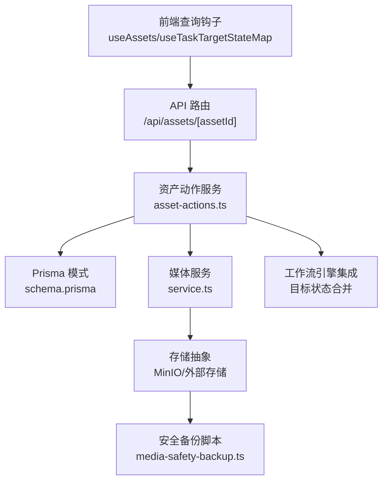
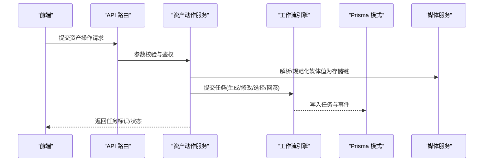
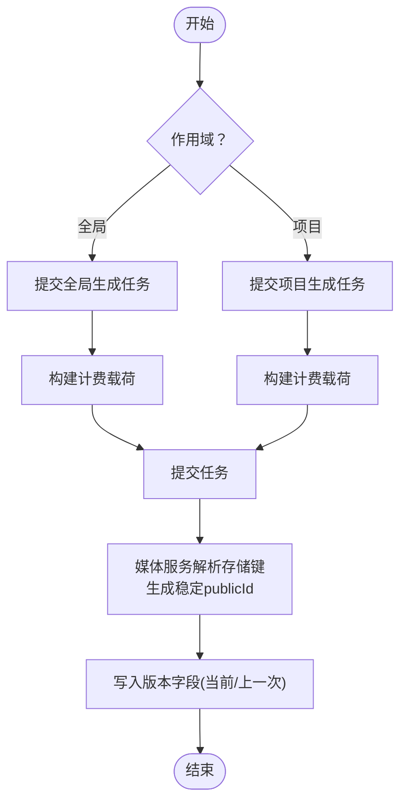
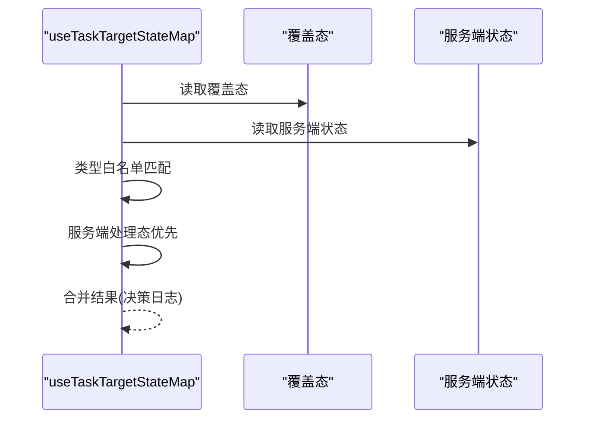
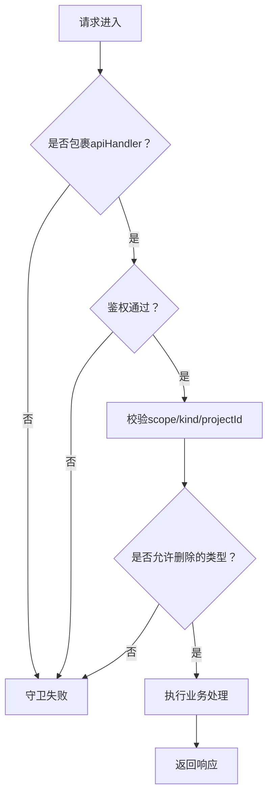
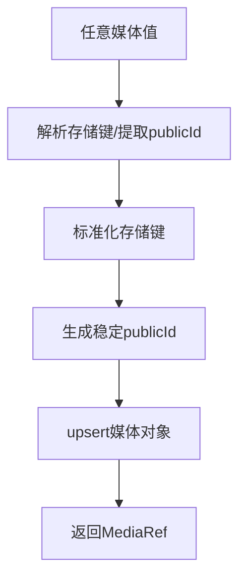
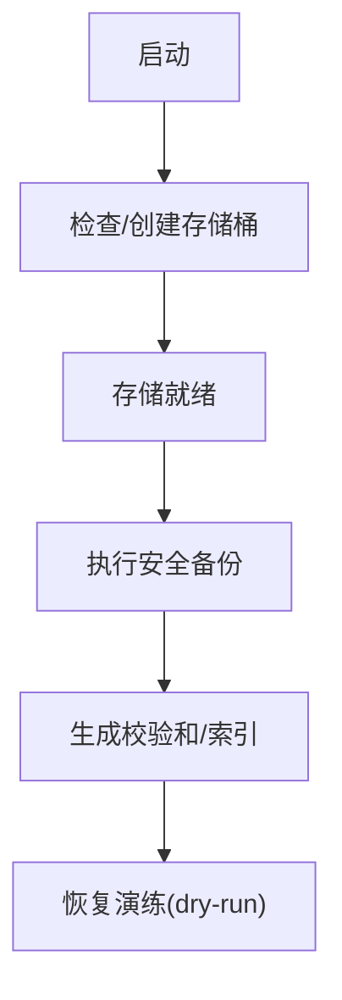
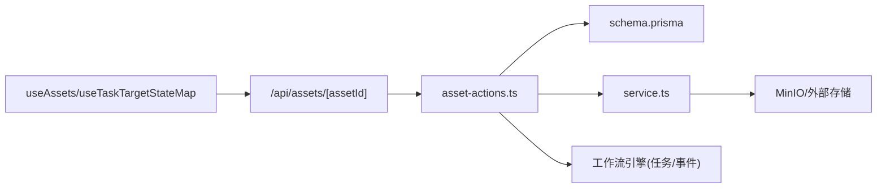

# 资产版本控制

<cite>
**本文引用的文件**
- [asset-actions.ts](file://src/lib/assets/services/asset-actions.ts)
- [useAssets.ts](file://src/lib/query/hooks/useAssets.ts)
- [route.ts](file://src/app/api/assets/[assetId]/route.ts)
- [schema.prisma](file://prisma/schema.prisma)
- [service.ts](file://src/lib/media/service.ts)
- [bootstrap.ts](file://src/lib/storage/bootstrap.ts)
- [media-safety-backup.ts](file://scripts/media-safety-backup.ts)
- [media-restore-dry-run.ts](file://scripts/media-restore-dry-run.ts)
- [useTaskTargetStateMap.ts](file://src/lib/query/hooks/useTaskTargetStateMap.ts)
- [task-state-service.test.ts](file://tests/unit/helpers/task-state-service.test.ts)
- [registry.test.ts](file://tests/unit/workflow-engine/registry.test.ts)
- [route-catalog.ts](file://tests/contracts/route-catalog.ts)
- [api-route-contract-guard.mjs](file://scripts/guards/api-route-contract-guard.mjs)
- [no-duplicate-endpoint-entry.mjs](file://scripts/guards/no-duplicate-endpoint-entry.mjs)
- [semantic.ts](file://src/lib/logging/semantic.ts)
</cite>

## 目录
1. [简介](#简介)
2. [项目结构](#项目结构)
3. [核心组件](#核心组件)
4. [架构总览](#架构总览)
5. [详细组件分析](#详细组件分析)
6. [依赖分析](#依赖分析)
7. [性能考虑](#性能考虑)
8. [故障排查指南](#故障排查指南)
9. [结论](#结论)
10. [附录](#附录)

## 简介
本技术文档围绕 Waoowaoo 的“资产版本控制系统”展开，系统以工作流驱动为核心，结合任务队列、媒体对象索引与存储抽象，实现对图像、视频、音频与文本类资产的版本化管理。重点覆盖以下方面：
- 版本创建：通过任务提交与媒体对象索引建立版本基线
- 分支合并与版本比较：基于目标状态合并与覆盖策略，支持多来源状态聚合
- 变更追踪与审计：统一语义日志与任务事件，形成可追溯的审计轨迹
- 回滚与快照：利用“上一次/前一版本”字段与媒体对象索引实现回滚与一致性校验
- 冲突检测与处理：服务端处理态优先、覆盖态白名单匹配与决策日志
- 存储策略与空间优化：媒体对象去重、稳定 publicId、存储桶准备与安全备份
- API 使用与集成：路由契约、鉴权包装与前端查询钩子
- 工作流引擎集成：目标状态映射、步骤失效范围与重试策略
- 迁移与兼容：数据库模式、脚本迁移与备份恢复

## 项目结构
资产版本控制相关能力横跨三层：
- 前端层：查询钩子负责拉取资产与任务状态，合并目标状态并暴露 UI 所需的实时视图
- 后端层：API 路由负责鉴权与参数校验，业务服务封装任务提交与资产操作
- 基础设施层：Prisma 模式定义资产与媒体对象结构；媒体服务负责存储键解析与对象索引；存储引导脚本确保 MinIO 桶可用；备份脚本保障介质安全与一致性

图表来源
- [useAssets.ts:139-175](file://src/lib/query/hooks/useAssets.ts#L139-L175)
- [useTaskTargetStateMap.ts:274-440](file://src/lib/query/hooks/useTaskTargetStateMap.ts#L274-L440)
- [route.ts:31-80](file://src/app/api/assets/[assetId]/route.ts#L31-L80)
- [asset-actions.ts:143-329](file://src/lib/assets/services/asset-actions.ts#L143-L329)
- [schema.prisma:30-77](file://prisma/schema.prisma#L30-L77)
- [service.ts:88-134](file://src/lib/media/service.ts#L88-L134)
- [bootstrap.ts:35-74](file://src/lib/storage/bootstrap.ts#L35-L74)
- [media-safety-backup.ts:207-238](file://scripts/media-safety-backup.ts#L207-L238)

章节来源
- [useAssets.ts:139-175](file://src/lib/query/hooks/useAssets.ts#L139-L175)
- [useTaskTargetStateMap.ts:274-440](file://src/lib/query/hooks/useTaskTargetStateMap.ts#L274-L440)
- [route.ts:31-80](file://src/app/api/assets/[assetId]/route.ts#L31-L80)
- [asset-actions.ts:143-329](file://src/lib/assets/services/asset-actions.ts#L143-L329)
- [schema.prisma:30-77](file://prisma/schema.prisma#L30-L77)
- [service.ts:88-134](file://src/lib/media/service.ts#L88-L134)
- [bootstrap.ts:35-74](file://src/lib/storage/bootstrap.ts#L35-L74)
- [media-safety-backup.ts:207-238](file://scripts/media-safety-backup.ts#L207-L238)

## 核心组件
- 资产动作服务：封装生成、修改、选择渲染、回滚等操作，并提交相应任务类型到工作流引擎
- 媒体服务：统一解析存储键、生成稳定 publicId、建立媒体对象索引，支撑版本比较与去重
- Prisma 模式：定义角色外观、场景图像、面板/镜头等资产表结构，含“上一次/前一版本”字段用于回滚
- 前端查询钩子：批量拉取任务目标状态，进行覆盖态合并，输出 UI 友好的状态视图
- 存储引导：确保 MinIO 桶存在并可公开读取，避免运行期错误
- 安全备份：导出数据库快照、存储对象索引与校验和，便于一致性核验与灾难恢复

章节来源
- [asset-actions.ts:143-329](file://src/lib/assets/services/asset-actions.ts#L143-L329)
- [service.ts:88-134](file://src/lib/media/service.ts#L88-L134)
- [schema.prisma:30-77](file://prisma/schema.prisma#L30-L77)
- [useTaskTargetStateMap.ts:274-440](file://src/lib/query/hooks/useTaskTargetStateMap.ts#L274-L440)
- [bootstrap.ts:35-74](file://src/lib/storage/bootstrap.ts#L35-L74)
- [media-safety-backup.ts:207-238](file://scripts/media-safety-backup.ts#L207-L238)

## 架构总览
资产版本控制采用“任务驱动 + 媒体对象索引”的双轴架构：
- 任务驱动：前端通过 API 提交生成/修改任务，后端解析参数、构建计费负载并提交到工作流引擎；任务事件持久化，供前端合并目标状态
- 媒体对象索引：所有媒体值统一解析为存储键，生成稳定 publicId 并写入媒体对象表，作为版本比较与去重依据

图表来源
- [route.ts:31-80](file://src/app/api/assets/[assetId]/route.ts#L31-L80)
- [asset-actions.ts:143-329](file://src/lib/assets/services/asset-actions.ts#L143-L329)
- [service.ts:152-171](file://src/lib/media/service.ts#L152-L171)
- [schema.prisma:587-646](file://prisma/schema.prisma#L587-L646)

## 详细组件分析

### 组件A：资产动作服务（版本创建/分支合并/版本比较）
- 版本创建
  - 生成任务：根据作用域（全局/项目）与资产类型（角色/场景），构造任务载荷并提交；计费信息与去重键保证幂等
  - 修改任务：对指定外观或图像进行修改，携带额外输入审计与计费
- 分支合并与版本比较
  - 通过“上一次/前一版本”字段记录前一状态，支持回滚
  - 媒体服务将任意媒体值归一化为存储键，配合稳定 publicId 实现版本比较
- 回滚
  - 回滚逻辑读取“previousImageUrls/previousImageUrl/previousDescription”等字段，恢复至前一版本

图表来源
- [asset-actions.ts:143-329](file://src/lib/assets/services/asset-actions.ts#L143-L329)
- [service.ts:88-134](file://src/lib/media/service.ts#L88-L134)

章节来源
- [asset-actions.ts:143-329](file://src/lib/assets/services/asset-actions.ts#L143-L329)
- [service.ts:88-134](file://src/lib/media/service.ts#L88-L134)

### 组件B：前端目标状态合并（分支合并/冲突处理）
- 批量拉取任务目标状态，按覆盖策略合并
- 决策日志：记录覆盖应用、过期、忽略、类型不匹配、服务端处理态优先等决策
- 白名单过滤：仅对允许的任务类型进行覆盖

图表来源
- [useTaskTargetStateMap.ts:355-411](file://src/lib/query/hooks/useTaskTargetStateMap.ts#L355-L411)

章节来源
- [useTaskTargetStateMap.ts:355-411](file://src/lib/query/hooks/useTaskTargetStateMap.ts#L355-L411)
- [task-state-service.test.ts:12-31](file://tests/unit/helpers/task-state-service.test.ts#L12-L31)

### 组件C：API 与鉴权（版本创建/更新/删除）
- 路由契约：统一使用 apiHandler 包裹，缺失鉴权或包装将被守卫检测
- 参数校验：scope/kind/projectId 等必填项严格校验
- 删除限制：仅允许删除特定资产类型

图表来源
- [route.ts:31-80](file://src/app/api/assets/[assetId]/route.ts#L31-L80)
- [api-route-contract-guard.mjs:59-78](file://scripts/guards/api-route-contract-guard.mjs#L59-L78)
- [no-duplicate-endpoint-entry.mjs:20-26](file://scripts/guards/no-duplicate-endpoint-entry.mjs#L20-L26)

章节来源
- [route.ts:31-80](file://src/app/api/assets/[assetId]/route.ts#L31-L80)
- [api-route-contract-guard.mjs:59-78](file://scripts/guards/api-route-contract-guard.mjs#L59-L78)
- [no-duplicate-endpoint-entry.mjs:20-26](file://scripts/guards/no-duplicate-endpoint-entry.mjs#L20-L26)

### 组件D：媒体对象索引与版本比较（存储策略）
- 存储键解析：支持 /m/publicId、签名 URL、COS key 等多种输入，统一归一化
- 稳定 publicId：基于存储键生成，保证跨环境一致性
- 去重与并发：upsert 时处理唯一约束冲突，避免重复写入
- 版本比较：通过 imageUrls/previousImageUrls 等字段进行版本对比与回滚

图表来源
- [service.ts:152-200](file://src/lib/media/service.ts#L152-L200)

章节来源
- [service.ts:88-134](file://src/lib/media/service.ts#L88-L134)
- [service.ts:152-200](file://src/lib/media/service.ts#L152-L200)

### 组件E：存储桶准备与安全备份（空间优化/灾备）
- 存储桶准备：自动检测并创建 MinIO 桶，必要时设置公开读策略
- 安全备份：导出数据库文件、表计数、存储对象索引与校验和，便于一致性核验
- 恢复演练：提供 dry-run 校验，检测当前与期望的差异

图表来源
- [bootstrap.ts:35-74](file://src/lib/storage/bootstrap.ts#L35-L74)
- [media-safety-backup.ts:207-238](file://scripts/media-safety-backup.ts#L207-L238)
- [media-restore-dry-run.ts:85-102](file://scripts/media-restore-dry-run.ts#L85-L102)

章节来源
- [bootstrap.ts:35-74](file://src/lib/storage/bootstrap.ts#L35-L74)
- [media-safety-backup.ts:207-238](file://scripts/media-safety-backup.ts#L207-L238)
- [media-restore-dry-run.ts:85-102](file://scripts/media-restore-dry-run.ts#L85-L102)

## 依赖分析
- 前端依赖后端 API 与任务状态服务，后端依赖 Prisma 模式与媒体服务
- 工作流引擎通过任务与事件模型与前端状态合并解耦
- 媒体服务依赖存储抽象，Prisma 模式定义版本字段（previousImageUrls/previousImageUrl 等）

图表来源
- [useAssets.ts:139-175](file://src/lib/query/hooks/useAssets.ts#L139-L175)
- [route.ts:31-80](file://src/app/api/assets/[assetId]/route.ts#L31-L80)
- [asset-actions.ts:143-329](file://src/lib/assets/services/asset-actions.ts#L143-L329)
- [schema.prisma:30-77](file://prisma/schema.prisma#L30-L77)
- [service.ts:88-134](file://src/lib/media/service.ts#L88-L134)

章节来源
- [useAssets.ts:139-175](file://src/lib/query/hooks/useAssets.ts#L139-L175)
- [route.ts:31-80](file://src/app/api/assets/[assetId]/route.ts#L31-L80)
- [asset-actions.ts:143-329](file://src/lib/assets/services/asset-actions.ts#L143-L329)
- [schema.prisma:30-77](file://prisma/schema.prisma#L30-L77)
- [service.ts:88-134](file://src/lib/media/service.ts#L88-L134)

## 性能考虑
- 前端批量化目标状态查询与合并，减少网络往返与渲染抖动
- 媒体对象 upsert 的并发冲突处理，避免写放大
- 任务去重键与计费信息预构建，降低重复计算与资源浪费
- 存储桶提前准备，避免运行期 IO 异常导致的重试风暴

## 故障排查指南
- API 合同与鉴权
  - 使用路由契约守卫与重复端点检测，定位缺失 apiHandler 或鉴权调用的问题
- 任务状态异常
  - 检查任务事件序列与终端状态，确认生命周期事件顺序
- 目标状态合并
  - 查看决策日志，识别覆盖过期、类型不匹配、服务端处理态优先等情形
- 媒体对象不一致
  - 校验存储键解析与 publicId 生成，确认 upsert 冲突处理是否生效
- 备份与恢复
  - 使用安全备份导出元数据与校验和，结合恢复演练验证一致性

章节来源
- [api-route-contract-guard.mjs:59-78](file://scripts/guards/api-route-contract-guard.mjs#L59-L78)
- [no-duplicate-endpoint-entry.mjs:20-26](file://scripts/guards/no-duplicate-endpoint-entry.mjs#L20-L26)
- [task-state-service.test.ts:12-31](file://tests/unit/helpers/task-state-service.test.ts#L12-L31)
- [useTaskTargetStateMap.ts:121-171](file://src/lib/query/hooks/useTaskTargetStateMap.ts#L121-L171)
- [media-safety-backup.ts:207-238](file://scripts/media-safety-backup.ts#L207-L238)
- [media-restore-dry-run.ts:85-102](file://scripts/media-restore-dry-run.ts#L85-L102)

## 结论
Waoowaoo 的资产版本控制系统以任务驱动与媒体对象索引为核心，结合目标状态合并、审计日志与安全备份，实现了对图像、视频、音频与文本资产的版本化管理。通过严格的路由契约、鉴权与冲突处理策略，系统在复杂工作流中保持一致性与可观测性。

## 附录

### 版本历史记录与审计日志
- 语义日志：统一审计事件，记录用户、项目、动作与详情
- 任务事件：持久化任务生命周期事件，支持前端状态合并

章节来源
- [semantic.ts:200-236](file://src/lib/logging/semantic.ts#L200-L236)
- [schema.prisma:630-646](file://prisma/schema.prisma#L630-L646)

### 版本回滚、快照与标签管理
- 回滚：利用“上一次/前一版本”字段恢复至历史状态
- 快照：安全备份导出数据库与存储对象索引，生成校验和
- 标签：建议在媒体对象层引入标签字段，配合版本号进行标记与检索

章节来源
- [asset-actions.ts:681-797](file://src/lib/assets/services/asset-actions.ts#L681-L797)
- [media-safety-backup.ts:207-238](file://scripts/media-safety-backup.ts#L207-L238)

### 版本冲突检测与处理流程
- 服务端处理态优先：当目标处于处理态时，忽略覆盖
- 类型白名单匹配：仅对允许的任务类型进行覆盖
- 决策日志：记录每次合并决策，便于审计与排障

章节来源
- [useTaskTargetStateMap.ts:355-411](file://src/lib/query/hooks/useTaskTargetStateMap.ts#L355-L411)
- [registry.test.ts:39-57](file://tests/unit/workflow-engine/registry.test.ts#L39-L57)

### 版本存储策略与空间优化
- 媒体对象去重：基于 stable publicId 与存储键 upsert
- 存储桶准备：自动创建 MinIO 桶并设置公开读策略
- 备份与恢复：导出快照与校验和，dry-run 校验一致性

章节来源
- [service.ts:88-134](file://src/lib/media/service.ts#L88-L134)
- [bootstrap.ts:35-74](file://src/lib/storage/bootstrap.ts#L35-L74)
- [media-safety-backup.ts:207-238](file://scripts/media-safety-backup.ts#L207-L238)
- [media-restore-dry-run.ts:85-102](file://scripts/media-restore-dry-run.ts#L85-L102)

### 版本控制 API 使用示例与集成指南
- 路由契约：确保每个 API 文件包裹 apiHandler 并进行鉴权
- 前端集成：使用查询钩子拉取资产与任务状态，自动合并覆盖态
- 业务集成：通过资产动作服务提交生成/修改任务，利用去重键与计费信息

章节来源
- [route-catalog.ts:173-242](file://tests/contracts/route-catalog.ts#L173-L242)
- [useAssets.ts:139-175](file://src/lib/query/hooks/useAssets.ts#L139-L175)
- [asset-actions.ts:143-329](file://src/lib/assets/services/asset-actions.ts#L143-L329)

### 版本控制与工作流引擎集成
- 目标状态映射：将任务运行态与目标类型/ID映射为 UI 状态
- 步骤失效范围：针对特定步骤重试时，仅失效受影响分支与相关节点
- 状态同步：通过 SSE/轮询获取任务事件，驱动前端状态刷新

章节来源
- [useTaskTargetStateMap.ts:274-440](file://src/lib/query/hooks/useTaskTargetStateMap.ts#L274-L440)
- [registry.test.ts:39-57](file://tests/unit/workflow-engine/registry.test.ts#L39-L57)

### 版本迁移、兼容性检查与数据修复
- 数据库迁移：Prisma 迁移脚本管理 schema 变更
- 兼容性检查：路由契约与守卫确保新增端点符合规范
- 数据修复：媒体对象 upsert 的冲突处理与恢复演练

章节来源
- [route-catalog.ts:173-242](file://tests/contracts/route-catalog.ts#L173-L242)
- [api-route-contract-guard.mjs:59-78](file://scripts/guards/api-route-contract-guard.mjs#L59-L78)
- [service.ts:124-133](file://src/lib/media/service.ts#L124-L133)
- [media-restore-dry-run.ts:85-102](file://scripts/media-restore-dry-run.ts#L85-L102)