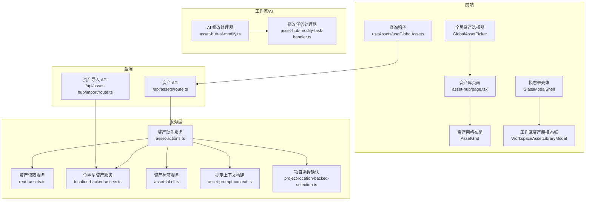
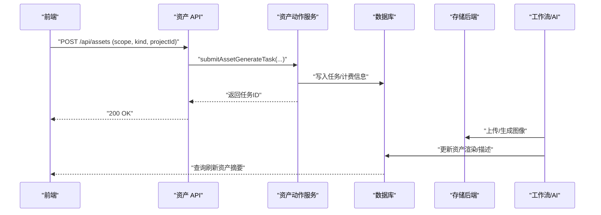
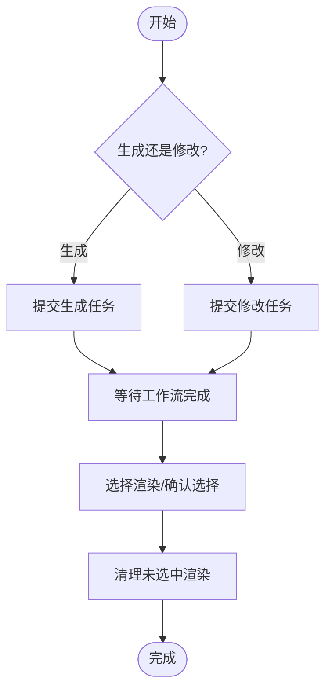
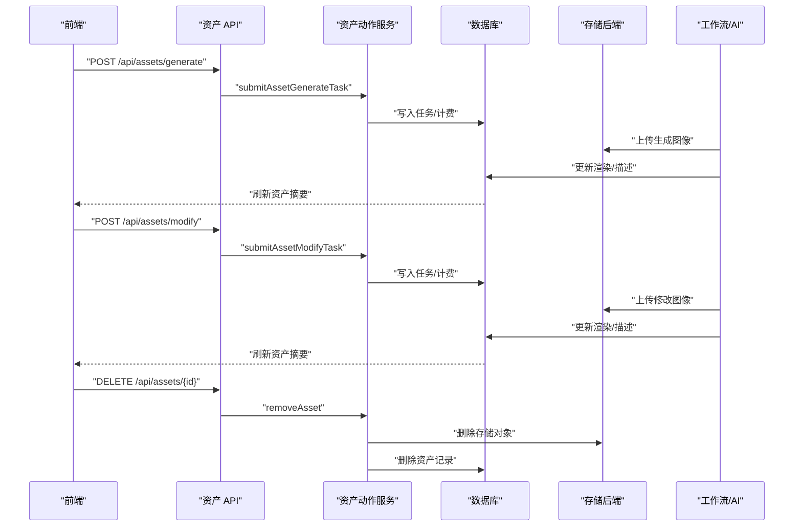
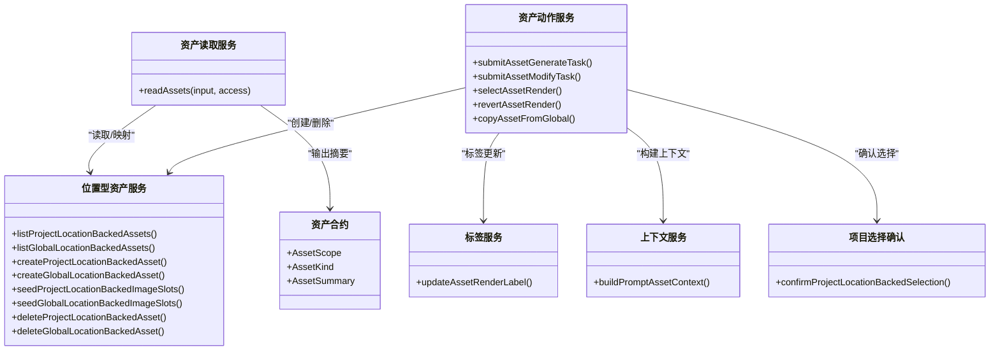

# 资产管理

<cite>
**本文引用的文件**
- [src/lib/assets/services/asset-actions.ts](file://src/lib/assets/services/asset-actions.ts)
- [src/lib/assets/services/location-backed-assets.ts](file://src/lib/assets/services/location-backed-assets.ts)
- [src/lib/assets/services/read-assets.ts](file://src/lib/assets/services/read-assets.ts)
- [src/lib/assets/services/asset-label.ts](file://src/lib/assets/services/asset-label.ts)
- [src/lib/assets/services/asset-prompt-context.ts](file://src/lib/assets/services/asset-prompt-context.ts)
- [src/lib/assets/services/project-location-backed-selection.ts](file://src/lib/assets/services/project-location-backed-selection.ts)
- [src/lib/assets/contracts.ts](file://src/lib/assets/contracts.ts)
- [src/app/api/assets/route.ts](file://src/app/api/assets/route.ts)
- [src/app/api/asset-hub/import/route.ts](file://src/app/api/asset-hub/import/route.ts)
- [src/lib/query/hooks/useAssets.ts](file://src/lib/query/hooks/useAssets.ts)
- [src/lib/query/hooks/useGlobalAssets.ts](file://src/lib/query/hooks/useGlobalAssets.ts)
- [src/components/shared/assets/GlobalAssetPicker.tsx](file://src/components/shared/assets/GlobalAssetPicker.tsx)
- [src/app/[locale]/workspace/asset-hub/page.tsx](file://src/app/[locale]/workspace/asset-hub/page.tsx)
- [src/lib/workers/handlers/asset-hub-ai-modify.ts](file://src/lib/workers/handlers/asset-hub-ai-modify.ts)
- [src/lib/workers/handlers/asset-hub-modify-task-handler.ts](file://src/lib/workers/handlers/asset-hub-modify-task-handler.ts)
- [src/components/shared/assets/LocationEditModal.tsx](file://src/components/shared/assets/LocationEditModal.tsx)
- [src/lib/storage/errors.ts](file://src/lib/storage/errors.ts)
- [src/app/[locale]/workspace/[projectId]/modes/novel-promotion/components/WorkspaceAssetLibraryModal.tsx](file://src/app/[locale]/workspace/[projectId]/modes/novel-promotion/components/WorkspaceAssetLibraryModal.tsx)
- [src/components/ui/primitives/GlassModalShell.tsx](file://src/components/ui/primitives/GlassModalShell.tsx)
- [src/app/[locale]/workspace/asset-hub/components/AssetGrid.tsx](file://src/app/[locale]/workspace/asset-hub/components/AssetGrid.tsx)
</cite>

## 更新摘要
**所做更改**
- 更新了工作区资产库模态框的最大宽度设置，从 `max-w-6xl` 调整为 `max-w-[1400px]`
- 更新了资产库网格布局的列数配置，确保更好的屏幕空间利用和资产展示效果
- 增强了资产库页面的响应式布局优化

## 目录
1. [简介](#简介)
2. [项目结构](#项目结构)
3. [核心组件](#核心组件)
4. [架构总览](#架构总览)
5. [详细组件分析](#详细组件分析)
6. [依赖关系分析](#依赖关系分析)
7. [性能考量](#性能考量)
8. [故障排查指南](#故障排查指南)
9. [结论](#结论)
10. [附录](#附录)

## 简介
本技术文档围绕 Waoowaoo 的资产管理能力展开，重点覆盖统一媒体库设计与实现、文件上传与存储管理、版本控制与选择机制、全局资产库共享与跨项目访问、权限控制与引用管理、资产标签与分类、搜索与上下文构建、AI 生成与传统媒体处理、元数据与缩略图、预览与导出、迁移与清理策略、API 使用与集成以及与存储后端的对接与性能优化。

## 项目结构
资产管理相关代码主要分布在以下区域：
- 后端 API 层：统一资产接口与导入接口，负责鉴权、参数校验与路由转发
- 服务层：资产动作（生成、修改、选择、回退、复制）、资产读取、位置型资产（场景/道具）生命周期
- 前端查询与 UI：资产钩子、全局资产选择器、资产库页面导出
- 工作流与 AI：资产库 AI 修改任务处理器、修改任务处理器
- 存储与错误：存储抽象错误类型

**图表来源**
- [src/app/api/assets/route.ts:1-120](file://src/app/api/assets/route.ts#L1-L120)
- [src/app/api/asset-hub/import/route.ts:90-144](file://src/app/api/asset-hub/import/route.ts#L90-L144)
- [src/lib/assets/services/asset-actions.ts:143-329](file://src/lib/assets/services/asset-actions.ts#L143-L329)
- [src/lib/assets/services/read-assets.ts:110-121](file://src/lib/assets/services/read-assets.ts#L110-L121)
- [src/lib/assets/services/location-backed-assets.ts:135-193](file://src/lib/assets/services/location-backed-assets.ts#L135-L193)
- [src/lib/assets/services/asset-label.ts:26-34](file://src/lib/assets/services/asset-label.ts#L26-L34)
- [src/lib/assets/services/asset-prompt-context.ts:107-164](file://src/lib/assets/services/asset-prompt-context.ts#L107-L164)
- [src/lib/assets/services/project-location-backed-selection.ts:6-75](file://src/lib/assets/services/project-location-backed-selection.ts#L6-L75)
- [src/lib/workers/handlers/asset-hub-ai-modify.ts:57-140](file://src/lib/workers/handlers/asset-hub-ai-modify.ts#L57-L140)
- [src/lib/workers/handlers/asset-hub-modify-task-handler.ts:219-257](file://src/lib/workers/handlers/asset-hub-modify-task-handler.ts#L219-L257)

**章节来源**
- [src/app/api/assets/route.ts:1-120](file://src/app/api/assets/route.ts#L1-L120)
- [src/lib/assets/services/read-assets.ts:110-121](file://src/lib/assets/services/read-assets.ts#L110-L121)

## 核心组件
- 统一资产接口与作用域
  - 支持全局与项目两种作用域，分别进行鉴权与数据读取
  - 创建仅限特定种类（如场景/道具），角色资产通过其他路径创建
- 位置型资产（场景/道具）
  - 提供创建、读取、种子槽位填充、删除等生命周期操作
  - 支持项目内与全局两类位置型资产
- 资产动作服务
  - 生成、修改、选择渲染、回退渲染、从全局复制到项目等
  - 生成与修改均提交任务，支持去重键与计费信息
- 资产读取服务
  - 按作用域聚合角色、场景、道具、声音资产，注入媒体字段并映射为统一摘要
- 标签与上下文
  - 渲染标签更新（项目内可用，全局禁用）
  - 构建提示词上下文（角色、场景、道具、剪辑引用）

**章节来源**
- [src/app/api/assets/route.ts:23-69](file://src/app/api/assets/route.ts#L23-L69)
- [src/lib/assets/services/location-backed-assets.ts:195-275](file://src/lib/assets/services/location-backed-assets.ts#L195-L275)
- [src/lib/assets/services/asset-actions.ts:143-329](file://src/lib/assets/services/asset-actions.ts#L143-L329)
- [src/lib/assets/services/read-assets.ts:19-57](file://src/lib/assets/services/read-assets.ts#L19-L57)
- [src/lib/assets/services/asset-label.ts:26-34](file://src/lib/assets/services/asset-label.ts#L26-L34)
- [src/lib/assets/services/asset-prompt-context.ts:107-164](file://src/lib/assets/services/asset-prompt-context.ts#L107-L164)

## 架构总览
资产管理采用"API -> 服务层 -> 数据库/存储"的分层架构，结合任务系统完成异步生成与修改；前端通过查询钩子与 UI 组件消费统一资产摘要。

**图表来源**
- [src/app/api/assets/route.ts:65-69](file://src/app/api/assets/route.ts#L65-L69)
- [src/lib/assets/services/asset-actions.ts:143-329](file://src/lib/assets/services/asset-actions.ts#L143-L329)

## 详细组件分析

### 统一媒体库与作用域
- 全局资产库
  - 用户维度隔离，支持按文件夹分组
  - 角色、场景、道具、声音资产统一读取与映射
- 项目资产库
  - 项目维度隔离，角色、场景、道具资产按项目聚合
- 权限控制
  - 项目作用域需要鉴权并通过项目 ID 校验
  - 全局作用域需要用户认证

**章节来源**
- [src/app/api/assets/route.ts:23-52](file://src/app/api/assets/route.ts#L23-L52)
- [src/lib/assets/services/read-assets.ts:19-57](file://src/lib/assets/services/read-assets.ts#L19-L57)

### 文件上传、存储管理与版本控制
- 生成与修改任务
  - 生成与修改均通过任务系统提交，携带去重键与计费信息
  - 生成时根据艺术风格与数量规范化，修改时对额外参考图进行输入审计
- 版本与选择
  - 全局与项目场景/道具支持多渲染版本，可选择当前渲染或回退到上一版本
  - 选择确认会清理未选中渲染并重置索引
- 存储后端
  - 通过存储服务解析媒体值并执行删除/重命名等操作
  - 存储抽象错误类型用于统一异常处理

**图表来源**
- [src/lib/assets/services/asset-actions.ts:143-329](file://src/lib/assets/services/asset-actions.ts#L143-L329)
- [src/lib/assets/services/project-location-backed-selection.ts:6-75](file://src/lib/assets/services/project-location-backed-selection.ts#L6-L75)

**章节来源**
- [src/lib/assets/services/asset-actions.ts:143-329](file://src/lib/assets/services/asset-actions.ts#L143-L329)
- [src/lib/assets/services/project-location-backed-selection.ts:6-75](file://src/lib/assets/services/project-location-backed-selection.ts#L6-L75)
- [src/lib/storage/errors.ts:1-13](file://src/lib/storage/errors.ts#L1-L13)

### 全局资产库共享与跨项目访问
- 全局资产库
  - 用户维度隔离，支持文件夹分组
  - 可从全局复制到项目，形成项目内引用
- 跨项目访问
  - 项目资产库通过项目 ID 限定范围
  - 复制流程在服务层完成，确保项目内引用建立

**章节来源**
- [src/lib/assets/services/read-assets.ts:59-108](file://src/lib/assets/services/read-assets.ts#L59-L108)
- [src/lib/assets/services/asset-actions.ts:799-800](file://src/lib/assets/services/asset-actions.ts#L799-L800)

### 资产标签系统、分类与搜索
- 标签系统
  - 项目内渲染标签可更新，全局渲染标签更新被禁用
  - 标签格式化规则随资产类型与变体变化
- 分类与文件夹
  - 全局资产支持文件夹分组，读取时可按文件夹过滤
- 搜索
  - 当前未见专用全文检索实现，建议基于资产名称/摘要/描述字段在前端或数据库侧扩展

**章节来源**
- [src/lib/assets/services/asset-label.ts:26-34](file://src/lib/assets/services/asset-label.ts#L26-L34)
- [src/lib/assets/services/read-assets.ts:59-68](file://src/lib/assets/services/read-assets.ts#L59-L68)

### 资产生成、修改与删除流程
- 生成
  - 选择作用域（全局/项目），提交生成任务，按艺术风格与数量生成渲染
- 修改
  - 选择目标渲染，提交修改任务，支持额外参考图与分辨率选项
  - AI 修改流程可解析并生成新的描述文本与可用槽位
- 删除
  - 位置型资产（场景/道具）支持删除，删除时清理对应存储对象

**图表来源**
- [src/app/api/assets/route.ts:65-69](file://src/app/api/assets/route.ts#L65-L69)
- [src/lib/assets/services/asset-actions.ts:143-329](file://src/lib/assets/services/asset-actions.ts#L143-L329)
- [src/lib/workers/handlers/asset-hub-ai-modify.ts:57-140](file://src/lib/workers/handlers/asset-hub-ai-modify.ts#L57-L140)

**章节来源**
- [src/lib/assets/services/asset-actions.ts:1187-1203](file://src/lib/assets/services/asset-actions.ts#L1187-L1203)

### 元数据管理、缩略图与预览
- 元数据
  - 场景/道具支持描述、可用槽位、艺术风格等元数据
  - 角色资产支持多变体与描述数组
- 缩略图与预览
  - 前端通过媒体组件加载缩略图与预览图
  - 资产库页面支持批量导出图片，按名称与变体索引生成文件名

**章节来源**
- [src/lib/assets/services/asset-prompt-context.ts:24-36](file://src/lib/assets/services/asset-prompt-context.ts#L24-L36)
- [src/components/shared/assets/GlobalAssetPicker.tsx:385-403](file://src/components/shared/assets/GlobalAssetPicker.tsx#L385-L403)
- [src/app/[locale]/workspace/asset-hub/page.tsx:438-462](file://src/app/[locale]/workspace/asset-hub/page.tsx#L438-L462)

### 资产导入与迁移
- 导入
  - 支持批量导入资产，自动解析冲突（跳过/覆盖），并创建或复用文件夹
- 迁移
  - 位置型资产支持种子槽位填充，便于后续生成与修改

**章节来源**
- [src/app/api/asset-hub/import/route.ts:90-144](file://src/app/api/asset-hub/import/route.ts#L90-L144)
- [src/lib/assets/services/location-backed-assets.ts:277-308](file://src/lib/assets/services/location-backed-assets.ts#L277-L308)

### 资产库界面布局优化

#### 模态框最大宽度调整
工作区资产库模态框的最大宽度已从 `max-w-6xl` 调整为 `max-w-[1400px]`，提供了更好的屏幕空间利用和资产展示效果。

**更新** 资产库模态框最大宽度从 `max-w-6xl` 调整为 `max-w-[1400px]`

**章节来源**
- [src/app/[locale]/workspace/[projectId]/modes/novel-promotion/components/WorkspaceAssetLibraryModal.tsx:45](file://src/app/[locale]/workspace/[projectId]/modes/novel-promotion/components/WorkspaceAssetLibraryModal.tsx#L45)
- [src/components/ui/primitives/GlassModalShell.tsx:47-51](file://src/components/ui/primitives/GlassModalShell.tsx#L47-L51)

#### 网格布局列数优化
资产库网格布局的列数配置已优化，确保更好的屏幕空间利用和资产展示效果。网格布局采用响应式设计，根据不同屏幕尺寸提供适当的列数配置。

**更新** 资产库网格布局列数优化，确保更好的屏幕空间利用和资产展示效果

**章节来源**
- [src/app/[locale]/workspace/asset-hub/components/AssetGrid.tsx:241](file://src/app/[locale]/workspace/asset-hub/components/AssetGrid.tsx#L241)
- [src/app/[locale]/workspace/asset-hub/components/AssetGrid.tsx:263](file://src/app/[locale]/workspace/asset-hub/components/AssetGrid.tsx#L263)
- [src/app/[locale]/workspace/asset-hub/components/AssetGrid.tsx:282](file://src/app/[locale]/workspace/asset-hub/components/AssetGrid.tsx#L282)
- [src/app/[locale]/workspace/asset-hub/components/AssetGrid.tsx:303](file://src/app/[locale]/workspace/asset-hub/components/AssetGrid.tsx#L303)

### API 使用与集成指南
- 资产读取
  - GET /api/assets?scope=global|project&projectId=...&folderId=...&kind=...
- 资产创建
  - POST /api/assets（scope、kind、projectId 必填，kind 限制为 location/prop）
- 前端集成
  - 使用查询钩子触发 API 请求，自动失效与刷新缓存

**章节来源**
- [src/app/api/assets/route.ts:23-69](file://src/app/api/assets/route.ts#L23-L69)
- [src/lib/query/hooks/useAssets.ts:265-301](file://src/lib/query/hooks/useAssets.ts#L265-L301)

### 与存储后端的集成与性能优化
- 集成
  - 通过存储服务解析媒体值，执行删除/重命名等操作
  - 存储抽象错误类型用于统一异常处理
- 性能优化
  - 任务去重键避免重复生成
  - 并行读取与映射减少往返
  - 选择确认时清理冗余渲染降低存储占用

**章节来源**
- [src/lib/storage/errors.ts:1-13](file://src/lib/storage/errors.ts#L1-L13)
- [src/lib/assets/services/asset-actions.ts:233-234](file://src/lib/assets/services/asset-actions.ts#L233-L234)
- [src/lib/assets/services/read-assets.ts:19-57](file://src/lib/assets/services/read-assets.ts#L19-L57)

## 依赖关系分析

**图表来源**
- [src/lib/assets/contracts.ts:1-148](file://src/lib/assets/contracts.ts#L1-L148)
- [src/lib/assets/services/read-assets.ts:19-108](file://src/lib/assets/services/read-assets.ts#L19-L108)
- [src/lib/assets/services/asset-actions.ts:143-329](file://src/lib/assets/services/asset-actions.ts#L143-L329)
- [src/lib/assets/services/location-backed-assets.ts:135-344](file://src/lib/assets/services/location-backed-assets.ts#L135-L344)
- [src/lib/assets/services/asset-label.ts:26-113](file://src/lib/assets/services/asset-label.ts#L26-L113)
- [src/lib/assets/services/asset-prompt-context.ts:107-164](file://src/lib/assets/services/asset-prompt-context.ts#L107-L164)
- [src/lib/assets/services/project-location-backed-selection.ts:6-75](file://src/lib/assets/services/project-location-backed-selection.ts#L6-L75)

**章节来源**
- [src/lib/assets/services/read-assets.ts:19-108](file://src/lib/assets/services/read-assets.ts#L19-L108)
- [src/lib/assets/services/asset-actions.ts:143-329](file://src/lib/assets/services/asset-actions.ts#L143-L329)

## 性能考量
- 任务去重与计费
  - 通过去重键避免重复生成，减少无效计算
  - 计费信息与默认计费策略统一处理
- 批量与并行
  - 读取阶段并行拉取角色/场景/道具/声音，减少等待时间
- 存储清理
  - 选择确认时清理未选中渲染，降低存储与带宽压力
- 响应式布局优化
  - 网格布局采用响应式设计，适应不同屏幕尺寸
  - 模态框最大宽度优化，提供更好的用户体验

## 故障排查指南
- 常见错误
  - 参数非法：scope/projectId/kind 不合法或缺失
  - 资源不存在：资产/渲染未找到
  - 存储配置错误：存储提供商未实现或配置错误
- 排查步骤
  - 检查请求参数与作用域匹配
  - 核对鉴权状态与项目/用户 ID
  - 查看任务日志与存储后端状态
  - 对照存储抽象错误类型定位问题

**章节来源**
- [src/lib/storage/errors.ts:1-13](file://src/lib/storage/errors.ts#L1-L13)

## 结论
Waoowaoo 的资产管理以统一媒体库为核心，通过清晰的作用域划分、任务驱动的生成与修改流程、完善的版本选择与清理机制，实现了全局与项目资产的协同管理。配合标签系统、上下文构建与前端导出能力，满足了从创作到产出的全链路需求。

**更新** 最新更新增强了界面布局优化，包括模态框最大宽度调整和网格布局列数优化，提供了更好的屏幕空间利用和资产展示效果。

建议后续增强搜索与元数据索引能力，并完善全局资产标签更新策略以提升一致性。

## 附录
- 前端资产钩子
  - useAssets：封装创建/删除等动作，自动失效与刷新查询
  - useGlobalAssets：面向全局资产的数据结构与分组
- UI 组件
  - 全局资产选择器：支持预览与缩略图展示
  - 资产库页面：支持导出图片资源
  - 资产网格布局：响应式网格布局，支持多种屏幕尺寸
  - 模态框壳体：提供标准化的模态框容器

**章节来源**
- [src/lib/query/hooks/useAssets.ts:265-301](file://src/lib/query/hooks/useAssets.ts#L265-L301)
- [src/lib/query/hooks/useGlobalAssets.ts:139-173](file://src/lib/query/hooks/useGlobalAssets.ts#L139-L173)
- [src/components/shared/assets/GlobalAssetPicker.tsx:385-403](file://src/components/shared/assets/GlobalAssetPicker.tsx#L385-L403)
- [src/app/[locale]/workspace/asset-hub/page.tsx:438-462](file://src/app/[locale]/workspace/asset-hub/page.tsx#L438-L462)
- [src/app/[locale]/workspace/asset-hub/components/AssetGrid.tsx:241](file://src/app/[locale]/workspace/asset-hub/components/AssetGrid.tsx#L241)
- [src/components/ui/primitives/GlassModalShell.tsx:47-51](file://src/components/ui/primitives/GlassModalShell.tsx#L47-L51)