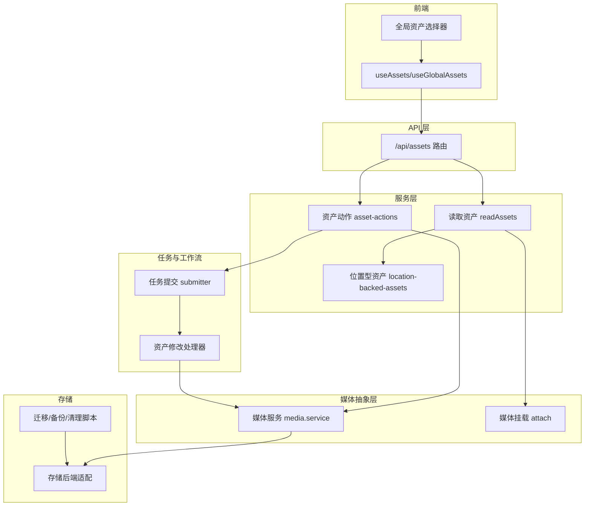
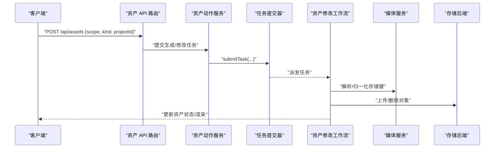
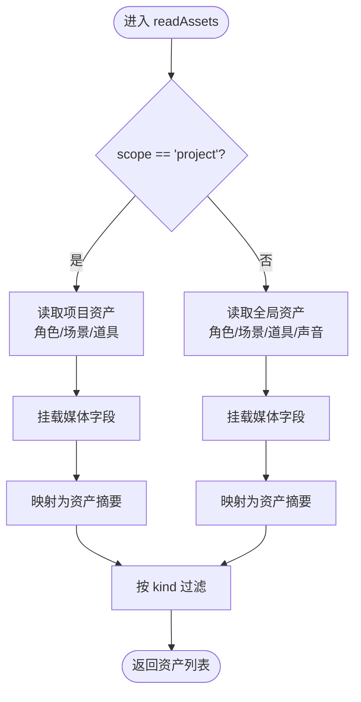
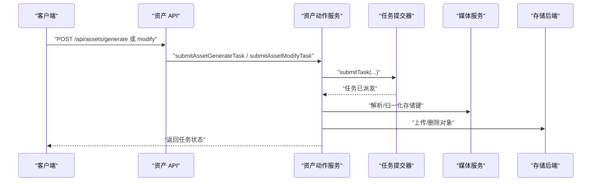
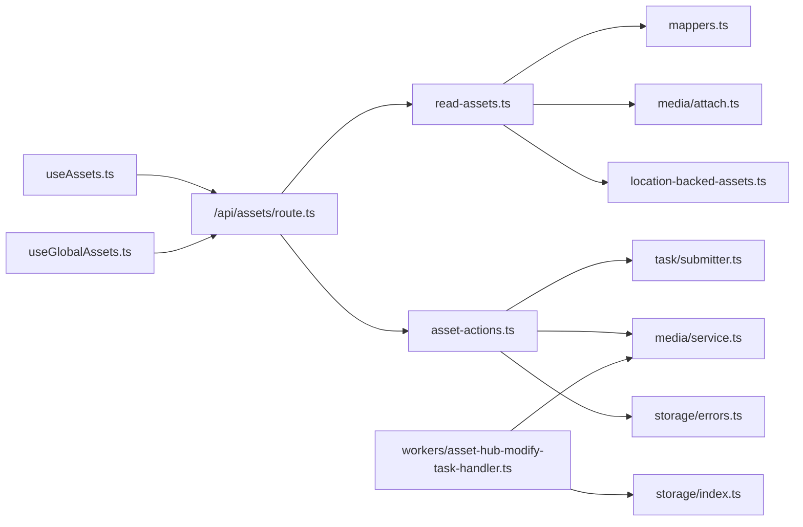

# 资产管理

<cite>
**本文引用的文件**
- [src/lib/assets/services/read-assets.ts](file://src/lib/assets/services/read-assets.ts)
- [src/lib/assets/services/asset-actions.ts](file://src/lib/assets/services/asset-actions.ts)
- [src/lib/assets/services/location-backed-assets.ts](file://src/lib/assets/services/location-backed-assets.ts)
- [src/lib/assets/services/asset-label.ts](file://src/lib/assets/services/asset-label.ts)
- [src/lib/assets/services/asset-prompt-context.ts](file://src/lib/assets/services/asset-prompt-context.ts)
- [src/lib/assets/services/project-location-backed-selection.ts](file://src/lib/assets/services/project-location-backed-selection.ts)
- [src/lib/assets/mappers.ts](file://src/lib/assets/mappers.ts)
- [src/lib/assets/grouping.ts](file://src/lib/assets/grouping.ts)
- [src/lib/assets/contracts.ts](file://src/lib/assets/contracts.ts)
- [src/lib/assets/kinds/registry.ts](file://src/lib/assets/kinds/registry.ts)
- [src/lib/media/service.ts](file://src/lib/media/service.ts)
- [src/lib/media/attach.ts](file://src/lib/media/attach.ts)
- [src/lib/media/outbound-image.ts](file://src/lib/media/outbound-image.ts)
- [src/lib/media/types.ts](file://src/lib/media/types.ts)
- [src/lib/media/hash.ts](file://src/lib/media/hash.ts)
- [src/lib/media/image-url.ts](file://src/lib/media/image-url.ts)
- [src/lib/storage/errors.ts](file://src/lib/storage/errors.ts)
- [src/app/api/assets/route.ts](file://src/app/api/assets/route.ts)
- [src/lib/query/hooks/useAssets.ts](file://src/lib/query/hooks/useAssets.ts)
- [src/lib/query/hooks/useGlobalAssets.ts](file://src/lib/query/hooks/useGlobalAssets.ts)
- [src/app/[locale]/workspace/[projectId]/modes/novel-promotion/components/assets/hooks/index.ts](file://src/app/[locale]/workspace/[projectId]/modes/novel-promotion/components/assets/hooks/index.ts)
- [src/app/[locale]/workspace/[projectId]/modes/novel-promotion/components/prompts-stage/runtime/hooks/usePromptAssetMention.ts](file://src/app/[locale]/workspace/[projectId]/modes/novel-promotion/components/prompts-stage/runtime/hooks/usePromptAssetMention.ts)
- [src/components/shared/assets/GlobalAssetPicker.tsx](file://src/components/shared/assets/GlobalAssetPicker.tsx)
- [src/components/shared/assets/LocationEditModal.tsx](file://src/components/shared/assets/LocationEditModal.tsx)
- [src/lib/workers/handlers/asset-hub-modify-task-handler.ts](file://src/lib/workers/handlers/asset-hub-modify-task-handler.ts)
- [src/lib/workers/handlers/asset-hub-ai-modify.ts](file://src/lib/workers/handlers/asset-hub-ai-modify.ts)
- [src/lib/image-label.ts](file://src/lib/image-label.ts)
- [src/lib/location-available-slots.ts](file://src/lib/location-available-slots.ts)
- [src/lib/constants.ts](file://src/lib/constants.ts)
- [src/lib/task/submitter.ts](file://src/lib/task/submitter.ts)
- [src/lib/task/types.ts](file://src/lib/task/types.ts)
- [src/lib/task/resolve-locale.ts](file://src/lib/task/resolve-locale.ts)
- [src/lib/task/has-output.ts](file://src/lib/task/has-output.ts)
- [src/lib/config-service.ts](file://src/lib/config-service.ts)
- [src/lib/api-errors.ts](file://src/lib/api-errors.ts)
- [src/lib/prisma.ts](file://src/lib/prisma.ts)
- [src/lib/storage/index.ts](file://src/lib/storage/index.ts)
- [src/lib/storage/cos.ts](file://src/lib/storage/cos.ts)
- [scripts/migrate-to-minio.ts](file://scripts/migrate-to-minio.ts)
- [scripts/media-safety-backup.ts](file://scripts/media-safety-backup.ts)
- [scripts/media-restore-dry-run.ts](file://scripts/media-restore-dry-run.ts)
- [scripts/media-archive-legacy-refs.ts](file://scripts/media-archive-legacy-refs.ts)
- [scripts/media-build-unreferenced-index.ts](file://scripts/media-build-unreferenced-index.ts)
- [scripts/media-backfill-refs.ts](file://scripts/media-backfill-refs.ts)
- [prisma/schema.prisma](file://prisma/schema.prisma)
</cite>

## 目录
1. [简介](#简介)
2. [项目结构](#项目结构)
3. [核心组件](#核心组件)
4. [架构总览](#架构总览)
5. [详细组件分析](#详细组件分析)
6. [依赖关系分析](#依赖关系分析)
7. [性能考量](#性能考量)
8. [故障排查指南](#故障排查指南)
9. [结论](#结论)
10. [附录](#附录)

## 简介
本技术文档围绕 Waoowaoo 的资产管理能力展开，系统性阐述统一媒体库的设计与实现，覆盖文件上传、存储管理、版本控制、全局资产库共享、跨项目访问与权限控制、资产标签与分类、搜索、AI 生成与传统媒体处理、元数据与缩略图、预览、迁移与备份恢复、清理策略，以及资产 API 使用与集成指南，并解释与存储后端的对接与性能优化策略。

## 项目结构
资产管理相关代码主要分布在以下区域：
- 服务层：资产查询、动作提交、位置型资产（场景/道具）生命周期管理
- 媒体抽象层：媒体对象、存储键解析、媒体引用与路由
- API 层：资产读取与创建接口、鉴权与作用域控制
- 查询与前端 Hook：资产列表、全局资产、资产选择与渲染确认
- 工作流与任务：图像生成与修改任务的提交与处理
- 存储与脚本：对象存储后端适配、迁移与备份恢复脚本
- 数据模型：Prisma schema 定义资产表与关联字段

**图表来源**
- [src/app/api/assets/route.ts:23-69](file://src/app/api/assets/route.ts#L23-L69)
- [src/lib/assets/services/read-assets.ts:106-117](file://src/lib/assets/services/read-assets.ts#L106-L117)
- [src/lib/assets/services/asset-actions.ts:143-329](file://src/lib/assets/services/asset-actions.ts#L143-L329)
- [src/lib/assets/services/location-backed-assets.ts:135-188](file://src/lib/assets/services/location-backed-assets.ts#L135-L188)
- [src/lib/media/service.ts:88-134](file://src/lib/media/service.ts#L88-L134)
- [src/lib/media/attach.ts](file://src/lib/media/attach.ts)
- [src/lib/query/hooks/useAssets.ts:262-298](file://src/lib/query/hooks/useAssets.ts#L262-L298)
- [src/lib/query/hooks/useGlobalAssets.ts:139-173](file://src/lib/query/hooks/useGlobalAssets.ts#L139-L173)
- [src/lib/task/submitter.ts](file://src/lib/task/submitter.ts)
- [src/lib/workers/handlers/asset-hub-modify-task-handler.ts:219-257](file://src/lib/workers/handlers/asset-hub-modify-task-handler.ts#L219-L257)
- [src/lib/storage/index.ts](file://src/lib/storage/index.ts)

**章节来源**
- [src/app/api/assets/route.ts:23-69](file://src/app/api/assets/route.ts#L23-L69)
- [src/lib/assets/services/read-assets.ts:19-104](file://src/lib/assets/services/read-assets.ts#L19-L104)
- [src/lib/assets/services/asset-actions.ts:143-329](file://src/lib/assets/services/asset-actions.ts#L143-L329)
- [src/lib/assets/services/location-backed-assets.ts:135-188](file://src/lib/assets/services/location-backed-assets.ts#L135-L188)
- [src/lib/media/service.ts:88-134](file://src/lib/media/service.ts#L88-L134)
- [src/lib/media/attach.ts](file://src/lib/media/attach.ts)

## 核心组件
- 统一资产查询与映射
  - 通过 readAssets 在项目与全局两个作用域内聚合资产，按类型过滤并映射为统一的资产摘要结构。
  - 支持位置型资产（场景/道具）与角色、声音等其他资产类型的统一输出。
- 资产动作服务
  - 提交生成与修改任务，支持全局与项目两种作用域；自动注入计费信息与去重键；处理渲染选择与回退。
- 位置型资产生命周期
  - 创建/删除全局与项目的场景/道具资产；批量填充初始图像槽位；按索引排序与选择当前渲染。
- 媒体对象与存储键解析
  - 将任意媒体值（COS key、签名 URL、/m/publicId、对象形态）归一化为存储键，确保写路径一致性。
- 前端查询与选择
  - useAssets/useGlobalAssets 提供资产列表与失效刷新；全局资产选择器支持跨项目引用与 AI 修改。
- 任务与工作流
  - 通过任务系统提交图像生成与修改任务，工作流处理器负责调用模型、上传源图、生成描述与可用槽位。

**章节来源**
- [src/lib/assets/services/read-assets.ts:106-117](file://src/lib/assets/services/read-assets.ts#L106-L117)
- [src/lib/assets/services/asset-actions.ts:143-329](file://src/lib/assets/services/asset-actions.ts#L143-L329)
- [src/lib/assets/services/location-backed-assets.ts:190-270](file://src/lib/assets/services/location-backed-assets.ts#L190-L270)
- [src/lib/media/service.ts:152-171](file://src/lib/media/service.ts#L152-L171)
- [src/lib/query/hooks/useAssets.ts:262-298](file://src/lib/query/hooks/useAssets.ts#L262-L298)
- [src/lib/query/hooks/useGlobalAssets.ts:139-173](file://src/lib/query/hooks/useGlobalAssets.ts#L139-L173)

## 架构总览
资产管理采用“API → 服务层 → 媒体抽象 → 存储后端”的分层设计，结合任务系统完成 AI 生成与修改，通过 Prisma 管理资产与图像槽位数据。

**图表来源**
- [src/app/api/assets/route.ts:65-125](file://src/app/api/assets/route.ts#L65-L125)
- [src/lib/assets/services/asset-actions.ts:143-329](file://src/lib/assets/services/asset-actions.ts#L143-L329)
- [src/lib/task/submitter.ts](file://src/lib/task/submitter.ts)
- [src/lib/workers/handlers/asset-hub-modify-task-handler.ts:219-257](file://src/lib/workers/handlers/asset-hub-modify-task-handler.ts#L219-L257)
- [src/lib/media/service.ts:152-171](file://src/lib/media/service.ts#L152-L171)
- [src/lib/storage/index.ts](file://src/lib/storage/index.ts)

## 详细组件分析

### 统一资产查询与映射
- 作用域与鉴权
  - 项目作用域需要 projectId 并进行轻量鉴权；全局作用域需要用户认证并按 userId 过滤。
- 聚合与映射
  - 项目资产：从项目角色、场景/道具中读取并挂载媒体字段，再映射为统一资产结构。
  - 全局资产：从全局角色、场景/道具与声音中读取，挂载媒体字段并映射。
- 类型过滤
  - 可按 kind 过滤返回结果，支持 location、prop、character、voice 等。

**图表来源**
- [src/lib/assets/services/read-assets.ts:19-104](file://src/lib/assets/services/read-assets.ts#L19-L104)
- [src/lib/assets/mappers.ts](file://src/lib/assets/mappers.ts)
- [src/lib/media/attach.ts](file://src/lib/media/attach.ts)

**章节来源**
- [src/lib/assets/services/read-assets.ts:106-117](file://src/lib/assets/services/read-assets.ts#L106-L117)

### 资产动作服务（生成/修改/选择/回退/删除）
- 生成任务
  - 全局：根据类型与外观索引确定艺术风格，确保目标图像槽位存在，构建计费负载并提交任务。
  - 项目：根据目标类型（角色外观或场景图像）解析目标 ID，构建计费负载并提交任务。
- 修改任务
  - 全局/项目均对额外参考图进行输入审计，构建修改意图与计费负载，提交修改任务。
- 渲染选择与确认
  - 全局：支持选择/确认当前渲染，确认时清理非选中对象并持久化描述与索引。
  - 项目：支持选择/确认当前渲染，确认时清理多余图像并更新选中项。
- 回退
  - 恢复到 previousImageUrls/previousDescription，必要时删除当前图像对象。
- 删除
  - 删除位置型资产时级联删除图像槽位；删除全局资产时同时删除图像与资产记录。

**图表来源**
- [src/lib/assets/services/asset-actions.ts:143-329](file://src/lib/assets/services/asset-actions.ts#L143-L329)
- [src/lib/assets/services/asset-actions.ts:517-679](file://src/lib/assets/services/asset-actions.ts#L517-L679)
- [src/lib/assets/services/asset-actions.ts:1185-1201](file://src/lib/assets/services/asset-actions.ts#L1185-L1201)
- [src/lib/media/service.ts:152-171](file://src/lib/media/service.ts#L152-L171)
- [src/lib/storage/index.ts](file://src/lib/storage/index.ts)

**章节来源**
- [src/lib/assets/services/asset-actions.ts:143-329](file://src/lib/assets/services/asset-actions.ts#L143-L329)
- [src/lib/assets/services/asset-actions.ts:517-679](file://src/lib/assets/services/asset-actions.ts#L517-L679)
- [src/lib/assets/services/asset-actions.ts:1185-1201](file://src/lib/assets/services/asset-actions.ts#L1185-L1201)

### 位置型资产生命周期（场景/道具）
- 创建
  - 全局：插入全局资产记录并填充初始图像槽位（描述与可用槽位）。
  - 项目：插入项目资产记录并填充初始图像槽位。
- 图像槽位
  - 按 imageIndex 排序；支持可用槽位序列化存储；支持描述数组归一化。
- 删除
  - 级联删除图像槽位与资产记录。

**图表来源**
- [src/lib/assets/services/location-backed-assets.ts:190-270](file://src/lib/assets/services/location-backed-assets.ts#L190-L270)
- [src/lib/assets/services/location-backed-assets.ts:272-325](file://src/lib/assets/services/location-backed-assets.ts#L272-L325)

**章节来源**
- [src/lib/assets/services/location-backed-assets.ts:135-188](file://src/lib/assets/services/location-backed-assets.ts#L135-L188)
- [src/lib/assets/services/location-backed-assets.ts:190-270](file://src/lib/assets/services/location-backed-assets.ts#L190-L270)
- [src/lib/assets/services/location-backed-assets.ts:272-325](file://src/lib/assets/services/location-backed-assets.ts#L272-L325)

### 媒体对象与存储键解析
- 归一化入口
  - resolveStorageKeyFromMediaValue 将多种媒体值形态统一为存储键，用于写操作与比较。
- 媒体对象登记
  - ensureMediaObjectFromStorageKey 基于存储键生成稳定 publicId 并登记媒体对象，避免并发冲突。
- URL 与路由
  - 媒体路由 /m/{publicId} 与存储键映射，便于安全访问与缓存。

**图表来源**
- [src/lib/media/service.ts:152-171](file://src/lib/media/service.ts#L152-L171)
- [src/lib/media/service.ts:88-134](file://src/lib/media/service.ts#L88-L134)

**章节来源**
- [src/lib/media/service.ts:88-134](file://src/lib/media/service.ts#L88-L134)
- [src/lib/media/service.ts:152-171](file://src/lib/media/service.ts#L152-L171)

### 全局资产库共享与跨项目访问
- 全局资产
  - 用户登录后可访问其全局资产库，按 folderId 分类，支持 location/prop/character/voice。
- 跨项目访问
  - 项目内可通过复制/引用全局资产到项目场景/道具，形成“项目资产 → 全局资产”映射。
- 权限控制
  - 项目作用域需携带有效 projectId 并通过轻量鉴权；全局作用域需用户认证。

**章节来源**
- [src/lib/assets/services/read-assets.ts:59-104](file://src/lib/assets/services/read-assets.ts#L59-L104)
- [src/app/api/assets/route.ts:23-52](file://src/app/api/assets/route.ts#L23-L52)

### 资产标签系统与分类管理
- 标签与分类
  - 通过资产创建与更新接口传入标签/分类字段，配合前端选择器与搜索组件实现筛选。
- 可用槽位
  - 场景/道具图像支持可用槽位序列化存储，便于后续变体生成与选择。

**章节来源**
- [src/lib/assets/services/asset-label.ts](file://src/lib/assets/services/asset-label.ts)
- [src/lib/location-available-slots.ts](file://src/lib/location-available-slots.ts)

### 搜索功能实现
- 前端搜索
  - 结合 useAssets/useGlobalAssets 返回的资产列表，按名称、描述、标签等字段进行本地搜索与过滤。
- 后端过滤
  - readAssets 支持按 kind 进行二次过滤，减少前端负担。

**章节来源**
- [src/lib/query/hooks/useAssets.ts:262-298](file://src/lib/query/hooks/useAssets.ts#L262-L298)
- [src/lib/query/hooks/useGlobalAssets.ts:139-173](file://src/lib/query/hooks/useGlobalAssets.ts#L139-L173)
- [src/lib/assets/services/read-assets.ts:106-117](file://src/lib/assets/services/read-assets.ts#L106-L117)

### AI 生成内容与传统媒体文件处理
- 生成流程
  - 通过任务系统提交图像生成任务，工作流处理器根据类型与艺术风格生成图像，上传源图并更新资产。
- 修改流程
  - 支持基于用户指令的图像修改，工作流处理器解析修改意图、生成新描述与可用槽位。
- 传统媒体
  - 通过媒体服务解析存储键与媒体对象，支持上传、删除与引用管理。

**章节来源**
- [src/lib/assets/services/asset-actions.ts:143-329](file://src/lib/assets/services/asset-actions.ts#L143-L329)
- [src/lib/workers/handlers/asset-hub-modify-task-handler.ts:219-257](file://src/lib/workers/handlers/asset-hub-modify-task-handler.ts#L219-L257)
- [src/lib/workers/handlers/asset-hub-ai-modify.ts:57-140](file://src/lib/workers/handlers/asset-hub-ai-modify.ts#L57-L140)
- [src/lib/media/service.ts:152-171](file://src/lib/media/service.ts#L152-L171)

### 元数据管理、缩略图与预览
- 元数据
  - 媒体对象登记时记录 MIME、尺寸、时长等；资产描述与可用槽位作为元数据存储。
- 缩略图与预览
  - 媒体服务提供统一 URL 路由，前端组件负责缩略图与预览展示。

**章节来源**
- [src/lib/media/service.ts:72-86](file://src/lib/media/service.ts#L72-L86)
- [src/lib/media/image-url.ts](file://src/lib/media/image-url.ts)

### 资产生成、修改与删除流程
- 生成
  - 解析语言与计费配置 → 确保目标槽位 → 提交任务 → 更新任务状态。
- 修改
  - 输入审计 → 构建修改意图 → 提交任务 → 处理器生成新描述与可用槽位。
- 删除
  - 删除资产记录与图像槽位，必要时删除存储对象。

**图表来源**
- [src/lib/assets/services/asset-actions.ts:143-329](file://src/lib/assets/services/asset-actions.ts#L143-L329)
- [src/lib/assets/services/asset-actions.ts:369-515](file://src/lib/assets/services/asset-actions.ts#L369-L515)
- [src/lib/assets/services/asset-actions.ts:1185-1201](file://src/lib/assets/services/asset-actions.ts#L1185-L1201)

**章节来源**
- [src/lib/assets/services/asset-actions.ts:143-329](file://src/lib/assets/services/asset-actions.ts#L143-L329)
- [src/lib/assets/services/asset-actions.ts:369-515](file://src/lib/assets/services/asset-actions.ts#L369-L515)
- [src/lib/assets/services/asset-actions.ts:1185-1201](file://src/lib/assets/services/asset-actions.ts#L1185-L1201)

### 资产迁移、备份恢复与清理策略
- 迁移
  - 迁移到 MinIO 的脚本提供对象存储迁移流程。
- 备份
  - 媒体安全备份脚本提供备份策略与执行入口。
- 恢复
  - 恢复演练脚本支持干跑验证恢复流程。
- 清理
  - 未引用索引构建与遗留引用归档脚本，辅助清理无用对象。

**章节来源**
- [scripts/migrate-to-minio.ts](file://scripts/migrate-to-minio.ts)
- [scripts/media-safety-backup.ts](file://scripts/media-safety-backup.ts)
- [scripts/media-restore-dry-run.ts](file://scripts/media-restore-dry-run.ts)
- [scripts/media-build-unreferenced-index.ts](file://scripts/media-build-unreferenced-index.ts)
- [scripts/media-archive-legacy-refs.ts](file://scripts/media-archive-legacy-refs.ts)
- [scripts/media-backfill-refs.ts](file://scripts/media-backfill-refs.ts)

### 资产 API 使用示例与集成指南
- 读取资产
  - GET /api/assets?scope=global|project&projectId=...&folderId=...&kind=...
  - 需要用户认证或项目轻量鉴权。
- 创建资产（项目）
  - POST /api/assets（scope=project, kind=location|prop, projectId=...）
  - 负载包含名称、摘要、描述等。
- 生成/修改任务
  - 通过资产动作服务提交任务，工作流处理器完成生成与修改。
- 前端集成
  - 使用 useAssets/useGlobalAssets 获取资产列表，结合全局资产选择器与编辑模态框进行交互。

**章节来源**
- [src/app/api/assets/route.ts:23-69](file://src/app/api/assets/route.ts#L23-L69)
- [src/lib/query/hooks/useAssets.ts:262-298](file://src/lib/query/hooks/useAssets.ts#L262-L298)
- [src/lib/query/hooks/useGlobalAssets.ts:139-173](file://src/lib/query/hooks/useGlobalAssets.ts#L139-L173)
- [src/components/shared/assets/GlobalAssetPicker.tsx](file://src/components/shared/assets/GlobalAssetPicker.tsx)
- [src/components/shared/assets/LocationEditModal.tsx](file://src/components/shared/assets/LocationEditModal.tsx)

### 与存储后端的集成与性能优化
- 存储后端
  - 通过统一的存储适配层与媒体服务解耦具体后端（如 COS/MinIO），保证键解析与对象管理一致性。
- 性能优化
  - 并行查询与映射：项目资产读取中并行获取场景/道具与角色数据。
  - 去重键：任务提交时使用去重键避免重复生成。
  - 计费与能力检查：在提交前校验模型能力与计费配置，减少无效任务。
  - 媒体对象登记：通过稳定 publicId 与 upsert 降低并发冲突风险。

**章节来源**
- [src/lib/storage/index.ts](file://src/lib/storage/index.ts)
- [src/lib/media/service.ts:88-134](file://src/lib/media/service.ts#L88-L134)
- [src/lib/assets/services/asset-actions.ts:224-235](file://src/lib/assets/services/asset-actions.ts#L224-L235)
- [src/lib/assets/services/asset-actions.ts:317-328](file://src/lib/assets/services/asset-actions.ts#L317-L328)

## 依赖关系分析

**图表来源**
- [src/lib/assets/services/read-assets.ts:1-132](file://src/lib/assets/services/read-assets.ts#L1-L132)
- [src/lib/assets/services/asset-actions.ts:1-100](file://src/lib/assets/services/asset-actions.ts#L1-L100)
- [src/app/api/assets/route.ts:23-69](file://src/app/api/assets/route.ts#L23-L69)
- [src/lib/query/hooks/useAssets.ts:262-298](file://src/lib/query/hooks/useAssets.ts#L262-L298)
- [src/lib/query/hooks/useGlobalAssets.ts:139-173](file://src/lib/query/hooks/useGlobalAssets.ts#L139-L173)
- [src/lib/workers/handlers/asset-hub-modify-task-handler.ts:219-257](file://src/lib/workers/handlers/asset-hub-modify-task-handler.ts#L219-L257)
- [src/lib/storage/errors.ts:1-13](file://src/lib/storage/errors.ts#L1-L13)

**章节来源**
- [src/lib/assets/services/read-assets.ts:1-132](file://src/lib/assets/services/read-assets.ts#L1-L132)
- [src/lib/assets/services/asset-actions.ts:1-100](file://src/lib/assets/services/asset-actions.ts#L1-L100)
- [src/app/api/assets/route.ts:23-69](file://src/app/api/assets/route.ts#L23-L69)

## 性能考量
- 批量与并行
  - 项目资产读取中并行获取角色与场景/道具数据，减少往返时间。
- 去重与幂等
  - 任务提交使用去重键，避免重复生成；渲染选择确认时仅保留选中对象，清理冗余。
- 计费前置
  - 在提交任务前完成计费与能力校验，降低失败成本。
- 存储键解析
  - 统一解析入口减少错误路径与重复 IO。

[本节为通用指导，无需列出具体文件来源]

## 故障排查指南
- 参数校验
  - INVALID_PARAMS：scope、kind、projectId、artStyle 等参数不合法或缺失。
- 资源不存在
  - NOT_FOUND：目标资产/外观/图像不存在。
- 存储配置
  - StorageConfigError/StorageProviderNotImplementedError：存储配置缺失或未实现。
- 任务状态
  - 通过任务系统查看任务状态与错误码，定位生成/修改失败原因。

**章节来源**
- [src/lib/api-errors.ts](file://src/lib/api-errors.ts)
- [src/lib/storage/errors.ts:1-13](file://src/lib/storage/errors.ts#L1-L13)
- [src/lib/assets/services/asset-actions.ts:1196-1201](file://src/lib/assets/services/asset-actions.ts#L1196-L1201)

## 结论
Waoowaoo 的资产管理以统一查询与动作服务为核心，结合任务系统与媒体抽象层，实现了跨项目共享、全局资产库、AI 生成与修改、版本控制与渲染选择、以及完善的存储与迁移策略。通过清晰的分层与严格的参数校验，系统在易用性与可靠性之间取得平衡。

## 附录
- 数据模型
  - Prisma schema 定义了资产、图像槽位与媒体对象等核心实体，支持资产与图像的多对多关系与有序索引。
- 前端组件
  - 全局资产选择器与编辑模态框提供直观的资产交互体验，支持 AI 修改与描述同步。

**章节来源**
- [prisma/schema.prisma](file://prisma/schema.prisma)
- [src/components/shared/assets/GlobalAssetPicker.tsx](file://src/components/shared/assets/GlobalAssetPicker.tsx)
- [src/components/shared/assets/LocationEditModal.tsx](file://src/components/shared/assets/LocationEditModal.tsx)