# 资产管理

<cite>
**本文引用的文件**
- [src/lib/assets/services/read-assets.ts](file://src/lib/assets/services/read-assets.ts)
- [src/lib/assets/services/asset-actions.ts](file://src/lib/assets/services/asset-actions.ts)
- [src/lib/assets/services/location-backed-assets.ts](file://src/lib/assets/services/location-backed-assets.ts)
- [src/lib/assets/services/asset-label.ts](file://src/lib/assets/services/asset-label.ts)
- [src/lib/assets/services/asset-prompt-context.ts](file://src/lib/assets/services/asset-prompt-context.ts)
- [src/lib/assets/services/project-location-backed-selection.ts](file://src/lib/assets/services/project-location-backed-selection.ts)
- [src/lib/assets/mappers.ts](file://src/lib/assets/mappers.ts)
- [src/lib/assets/grouping.ts](file://src/lib/assets/grouping.ts)
- [src/lib/assets/contracts.ts](file://src/lib/assets/contracts.ts)
- [src/lib/assets/kinds/registry.ts](file://src/lib/assets/kinds/registry.ts)
- [src/lib/media/service.ts](file://src/lib/media/service.ts)
- [src/lib/media/attach.ts](file://src/lib/media/attach.ts)
- [src/lib/media/outbound-image.ts](file://src/lib/media/outbound-image.ts)
- [src/lib/media/types.ts](file://src/lib/media/types.ts)
- [src/lib/media/hash.ts](file://src/lib/media/hash.ts)
- [src/lib/media/image-url.ts](file://src/lib/media/image-url.ts)
- [src/lib/storage/errors.ts](file://src/lib/storage/errors.ts)
- [src/app/api/assets/route.ts](file://src/app/api/assets/route.ts)
- [src/lib/query/hooks/useAssets.ts](file://src/lib/query/hooks/useAssets.ts)
- [src/lib/query/hooks/useGlobalAssets.ts](file://src/lib/query/hooks/useGlobalAssets.ts)
- [src/app/[locale]/workspace/[projectId]/modes/novel-promotion/components/assets/hooks/index.ts](file://src/app/[locale]/workspace/[projectId]/modes/novel-promotion/components/assets/hooks/index.ts)
- [src/app/[locale]/workspace/[projectId]/modes/novel-promotion/components/prompts-stage/runtime/hooks/usePromptAssetMention.ts](file://src/app/[locale]/workspace/[projectId]/modes/novel-promotion/components/prompts-stage/runtime/hooks/usePromptAssetMention.ts)
- [src/components/shared/assets/GlobalAssetPicker.tsx](file://src/components/shared/assets/GlobalAssetPicker.tsx)
- [src/components/shared/assets/LocationEditModal.tsx](file://src/components/shared/assets/LocationEditModal.tsx)
- [src/lib/workers/handlers/asset-hub-modify-task-handler.ts](file://src/lib/workers/handlers/asset-hub-modify-task-handler.ts)
- [src/lib/workers/handlers/asset-hub-ai-modify.ts](file://src/lib/workers/handlers/asset-hub-ai-modify.ts)
- [src/lib/image-label.ts](file://src/lib/image-label.ts)
- [src/lib/location-available-slots.ts](file://src/lib/location-available-slots.ts)
- [src/lib/constants.ts](file://src/lib/constants.ts)
- [src/lib/task/submitter.ts](file://src/lib/task/submitter.ts)
- [src/lib/task/types.ts](file://src/lib/task/types.ts)
- [src/lib/task/resolve-locale.ts](file://src/lib/task/resolve-locale.ts)
- [src/lib/task/has-output.ts](file://src/lib/task/has-output.ts)
- [src/lib/config-service.ts](file://src/lib/config-service.ts)
- [src/lib/api-errors.ts](file://src/lib/api-errors.ts)
- [src/lib/prisma.ts](file://src/lib/prisma.ts)
- [src/lib/storage/index.ts](file://src/lib/storage/index.ts)
- [src/lib/storage/cos.ts](file://src/lib/storage/cos.ts)
- [scripts/migrate-to-minio.ts](file://scripts/migrate-to-minio.ts)
- [scripts/media-safety-backup.ts](file://scripts/media-safety-backup.ts)
- [scripts/media-restore-dry-run.ts](file://scripts/media-restore-dry-run.ts)
- [scripts/media-archive-legacy-refs.ts](file://scripts/media-archive-legacy-refs.ts)
- [scripts/media-build-unreferenced-index.ts](file://scripts/media-build-unreferenced-index.ts)
- [scripts/media-backfill-refs.ts](file://scripts/media-backfill-refs.ts)
- [prisma/schema.prisma](file://prisma/schema.prisma)
- [src/app/[locale]/workspace/[projectId]/modes/novel-promotion/components/assets/CharacterCard.tsx](file://src/app/[locale]/workspace/[projectId]/modes/novel-promotion/components/assets/CharacterCard.tsx)
- [src/app/[locale]/workspace/[projectId]/modes/novel-promotion/components/assets/LocationCard.tsx](file://src/app/[locale]/workspace/[projectId]/modes/novel-promotion/components/assets/LocationCard.tsx)
- [src/lib/query/mutations/asset-hub-character-mutations.ts](file://src/lib/query/mutations/asset-hub-character-mutations.ts)
- [src/lib/query/mutations/asset-hub-location-mutations.ts](file://src/lib/query/mutations/asset-hub-location-mutations.ts)
- [src/lib/query/mutations/asset-hub-update-mutations.ts](file://src/lib/query/mutations/asset-hub-update-mutations.ts)
- [src/lib/query/mutations/asset-hub-mutations-shared.ts](file://src/lib/query/mutations/asset-hub-mutations-shared.ts)
- [src/lib/query/mutations/mutation-shared.ts](file://src/lib/query/mutations/mutation-shared.ts)
- [src/lib/query/keys.ts](file://src/lib/query/keys.ts)
- [src/lib/query/task-target-overlay.ts](file://src/lib/query/task-target-overlay.ts)
- [tests/unit/optimistic/asset-hub-mutations.test.ts](file://tests/unit/optimistic/asset-hub-mutations.test.ts)
- [tests/helpers/mock-query-client.ts](file://tests/helpers/mock-query-client.ts)
- [src/app/[locale]/workspace/asset-hub/page.tsx](file://src/app/[locale]/workspace/asset-hub/page.tsx)
- [src/app/[locale]/workspace/asset-hub/components/AssetGrid.tsx](file://src/app/[locale]/workspace/asset-hub/components/AssetGrid.tsx)
- [src/app/[locale]/workspace/asset-hub/components/CharacterCard.tsx](file://src/app/[locale]/workspace/asset-hub/components/CharacterCard.tsx)
- [src/app/[locale]/workspace/asset-hub/components/LocationCard.tsx](file://src/app/[locale]/workspace/asset-hub/components/LocationCard.tsx)
- [src/app/[locale]/workspace/asset-hub/components/VoiceCard.tsx](file://src/app/[locale]/workspace/asset-hub/components/VoiceCard.tsx)
- [src/app/[locale]/workspace/asset-hub/components/VoiceSettings.tsx](file://src/app/[locale]/workspace/asset-hub/components/VoiceSettings.tsx)
- [src/app/[locale]/workspace/asset-hub/components/FolderSidebar.tsx](file://src/app/[locale]/workspace/asset-hub/components/FolderSidebar.tsx)
- [src/app/[locale]/workspace/asset-hub/components/FolderDropdown.tsx](file://src/app/[locale]/workspace/asset-hub/components/FolderDropdown.tsx)
- [src/app/[locale]/workspace/asset-hub/components/FolderModal.tsx](file://src/app/[locale]/workspace/asset-hub/components/FolderModal.tsx)
- [src/app/[locale]/workspace/asset-hub/components/AddAssetDropdown.tsx](file://src/app/[locale]/workspace/asset-hub/components/AddAssetDropdown.tsx)
- [src/app/[locale]/workspace/asset-hub/components/ImportConflictModal.tsx](file://src/app/[locale]/workspace/asset-hub/components/ImportConflictModal.tsx)
- [src/app/api/asset-hub/import/route.ts](file://src/app/api/asset-hub/import/route.ts)
- [src/components/shared/assets/PropCreationModal.tsx](file://src/components/shared/assets/PropCreationModal.tsx)
- [src/components/shared/assets/prop-creation/PropCreationForm.tsx](file://src/components/shared/assets/prop-creation/PropCreationForm.tsx)
- [src/components/shared/assets/prop-creation/hooks/usePropCreationSubmit.ts](file://src/components/shared/assets/prop-creation/hooks/usePropCreationSubmit.ts)
- [src/lib/asset-utils/ai-design.ts](file://src/lib/asset-utils/ai-design.ts)
- [src/app/api/asset-hub/ai-design-prop/route.ts](file://src/app/api/asset-hub/ai-design-prop/route.ts)
- [src/lib/prompt-i18n/index.ts](file://src/lib/prompt-i18n/index.ts)
- [src/lib/prompt-i18n/catalog.ts](file://src/lib/prompt-i18n/catalog.ts)
- [src/lib/prompt-i18n/build-prompt.ts](file://src/lib/prompt-i18n/build-prompt.ts)
- [src/lib/prompt-i18n/template-store.ts](file://src/lib/prompt-i18n/template-store.ts)
- [src/lib/prompt-i18n/prompt-ids.ts](file://src/lib/prompt-i18n/prompt-ids.ts)
- [lib/prompts/novel-promotion/prop_create.zh.txt](file://lib/prompts/novel-promotion/prop_create.zh.txt)
- [lib/prompts/novel-promotion/prop_create.en.txt](file://lib/prompts/novel-promotion/prop_create.en.txt)
- [messages/zh/assetHub.json](file://messages/zh/assetHub.json)
- [messages/en/assetHub.json](file://messages/en/assetHub.json)
- [src/styles/ui-semantic-glass.css](file://src/styles/ui-semantic-glass.css)
- [src/styles/ui-tokens-glass.css](file://src/styles/ui-tokens-glass.css)
- [src/components/ui/SharedComponents.tsx](file://src/components/ui/SharedComponents.tsx)
- [src/components/ui/primitives/index.ts](file://src/components/ui/primitives/index.ts)
- [src/components/ui/icons/AppIcon.tsx](file://src/components/ui/icons/AppIcon.tsx)
- [src/components/ui/icons/registry.ts](file://src/components/ui/icons/registry.ts)
- [src/components/ui/icons/custom.tsx](file://src/components/ui/icons/custom.tsx)
- [src/components/ui/icons/RatioPreviewIcon.tsx](file://src/components/ui/icons/RatioPreviewIcon.tsx)
- [src/components/Navbar.tsx](file://src/components/Navbar.tsx)
- [src/app/[locale]/workspace/asset-hub/components/AssetHubTopActions.tsx](file://src/app/[locale]/workspace/asset-hub/components/AssetHubTopActions.tsx)
- [src/app/[locale]/dev/workspace-redesign/page.tsx](file://src/app/[locale]/dev/workspace-redesign/page.tsx)
- [src/app/[locale]/dev/workspace-redesign/shared.ts](file://src/app/[locale]/dev/workspace-redesign/shared.ts)
- [src/app/[locale]/dev/workspace-redesign/ProjectLayouts.tsx](file://src/app/[locale]/dev/workspace-redesign/ProjectLayouts.tsx)
- [src/lib/query/mutations/location-management-mutations.ts](file://src/lib/query/mutations/location-management-mutations.ts)
- [tests/unit/novel-promotion/location-confirm-mutations.test.ts](file://tests/unit/novel-promotion/location-confirm-mutations.test.ts)
- [scripts/guards/test-behavior-quality-guard.mjs](file://scripts/guards/test-behavior-quality-guard.mjs)
- [scripts/guards/test-behavior-tasktype-coverage-guard.mjs](file://scripts/guards/test-behavior-tasktype-coverage-guard.mjs)
- [scripts/guards/prompt-semantic-regression.mjs](file://scripts/guards/prompt-semantic-regression.mjs)
- [tests/hidden/README.md](file://tests/hidden/README.md)
</cite>

## 更新摘要
**所做更改**
- 新增统一资产创建界面：PropCreationModal 和 PropCreationForm 组件
- 增强AI设计功能：AI设计道具描述、AI提取描述、AI设计工作流
- 导入系统和冲突解决机制：ImportConflictModal 和导入API路由
- AI提示词模板系统：prompt-i18n模块和道具设计提示词
- 优化资产选择系统的乐观更新机制
- 改进资产中心UI布局和交互体验

## 目录
1. [简介](#简介)
2. [项目结构](#项目结构)
3. [核心组件](#核心组件)
4. [架构总览](#架构总览)
5. [详细组件分析](#详细组件分析)
6. [依赖关系分析](#依赖关系分析)
7. [性能考量](#性能考量)
8. [故障排查指南](#故障排查指南)
9. [结论](#结论)
10. [附录](#附录)

## 简介
本技术文档围绕 Waoowaoo 的资产管理能力展开，系统性阐述统一媒体库的设计与实现，覆盖文件上传、存储管理、版本控制、全局资产库共享、跨项目访问与权限控制、资产标签与分类、搜索、AI 生成与传统媒体处理、元数据与缩略图、预览、迁移与备份恢复、清理策略，以及资产 API 使用与集成指南，并解释与存储后端的对接与性能优化策略。

**更新** 本次更新重点关注统一资产创建界面(PropCreationForm)、AI设计功能增强、导入系统和冲突解决机制，以及AI提示词模板的引入。这些变更显著提升了资产管理系统的功能完整性和用户体验。

## 项目结构
资产管理相关代码主要分布在以下区域：
- 服务层：资产查询、动作提交、位置型资产（场景/道具）生命周期管理
- 媒体抽象层：媒体对象、存储键解析、媒体引用与路由
- API 层：资产读取与创建接口、鉴权与作用域控制
- 查询与前端 Hook：资产列表、全局资产、资产选择与渲染确认
- 工作流与任务：图像生成与修改任务的提交与处理
- 存储与脚本：对象存储后端适配、迁移与备份恢复脚本
- 数据模型：Prisma schema 定义资产表与关联字段
- **统一资产创建界面**：PropCreationModal 和 PropCreationForm 组件
- **AI设计增强**：AI设计道具描述、AI提取描述、AI设计工作流
- **导入系统**：ImportConflictModal 和导入API路由
- **AI提示词模板**：prompt-i18n模块和道具设计提示词
- **优化资产选择系统**：乐观更新机制改进
- **改进资产中心UI**：布局和交互体验优化

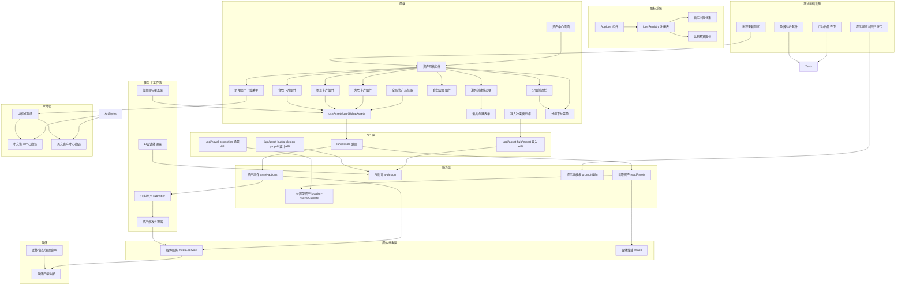

**图表来源**
- [src/app/api/assets/route.ts:23-69](file://src/app/api/assets/route.ts#L23-L69)
- [src/lib/assets/services/read-assets.ts:106-117](file://src/lib/assets/services/read-assets.ts#L106-L117)
- [src/lib/assets/services/asset-actions.ts:143-329](file://src/lib/assets/services/asset-actions.ts#L143-L329)
- [src/lib/assets/services/location-backed-assets.ts:135-188](file://src/lib/assets/services/location-backed-assets.ts#L135-L188)
- [src/lib/constants.ts:149-660](file://src/lib/constants.ts#L149-L660)
- [src/lib/media/service.ts:88-134](file://src/lib/media/service.ts#L88-L134)
- [src/lib/media/attach.ts](file://src/lib/media/attach.ts)
- [src/lib/query/hooks/useAssets.ts:262-298](file://src/lib/query/hooks/useAssets.ts#L262-L298)
- [src/lib/query/hooks/useGlobalAssets.ts:139-173](file://src/lib/query/hooks/useGlobalAssets.ts#L139-L173)
- [src/lib/task/submitter.ts](file://src/lib/task/submitter.ts)
- [src/lib/workers/handlers/asset-hub-modify-task-handler.ts:219-257](file://src/lib/workers/handlers/asset-hub-modify-task-handler.ts#L219-L257)
- [src/lib/storage/index.ts](file://src/lib/storage/index.ts)
- [src/app/[locale]/workspace/asset-hub/page.tsx:33-709](file://src/app/[locale]/workspace/asset-hub/page.tsx#L33-L709)
- [src/app/[locale]/workspace/asset-hub/components/AssetGrid.tsx:31-306](file://src/app/[locale]/workspace/asset-hub/components/AssetGrid.tsx#L31-L306)
- [src/app/[locale]/workspace/asset-hub/components/CharacterCard.tsx:59-533](file://src/app/[locale]/workspace/asset-hub/components/CharacterCard.tsx#L59-L533)
- [src/app/[locale]/workspace/asset-hub/components/LocationCard.tsx:59-500](file://src/app/[locale]/workspace/asset-hub/components/LocationCard.tsx#L59-L500)
- [src/app/[locale]/workspace/asset-hub/components/VoiceCard.tsx:28-143](file://src/app/[locale]/workspace/asset-hub/components/VoiceCard.tsx#L28-L143)
- [src/app/[locale]/workspace/asset-hub/components/VoiceSettings.tsx:1-215](file://src/app/[locale]/workspace/asset-hub/components/VoiceSettings.tsx#L1-L215)
- [src/app/[locale]/workspace/asset-hub/components/FolderSidebar.tsx:51-147](file://src/app/[locale]/workspace/asset-hub/components/FolderSidebar.tsx#L51-L147)
- [src/app/[locale]/workspace/asset-hub/components/FolderDropdown.tsx:84-155](file://src/app/[locale]/workspace/asset-hub/components/FolderDropdown.tsx#L84-L155)
- [src/app/[locale]/workspace/asset-hub/components/AddAssetDropdown.tsx:1-98](file://src/app/[locale]/workspace/asset-hub/components/AddAssetDropdown.tsx#L1-L98)
- [src/app/[locale]/workspace/asset-hub/components/ImportConflictModal.tsx:1-166](file://src/app/[locale]/workspace/asset-hub/components/ImportConflictModal.tsx#L1-L166)
- [src/app/api/asset-hub/import/route.ts:1-310](file://src/app/api/asset-hub/import/route.ts#L1-L310)
- [src/components/shared/assets/PropCreationModal.tsx:1-231](file://src/components/shared/assets/PropCreationModal.tsx#L1-L231)
- [src/components/shared/assets/prop-creation/PropCreationForm.tsx:1-185](file://src/components/shared/assets/prop-creation/PropCreationForm.tsx#L1-L185)
- [src/components/shared/assets/prop-creation/hooks/usePropCreationSubmit.ts:1-218](file://src/components/shared/assets/prop-creation/hooks/usePropCreationSubmit.ts#L1-L218)
- [src/lib/asset-utils/ai-design.ts:1-140](file://src/lib/asset-utils/ai-design.ts#L1-L140)
- [src/app/api/asset-hub/ai-design-prop/route.ts:1-52](file://src/app/api/asset-hub/ai-design-prop/route.ts#L1-L52)
- [src/lib/prompt-i18n/index.ts:1-11](file://src/lib/prompt-i18n/index.ts#L1-L11)
- [src/lib/prompt-i18n/catalog.ts:1-34](file://src/lib/prompt-i18n/catalog.ts#L1-L34)
- [src/lib/prompt-i18n/build-prompt.ts:1-45](file://src/lib/prompt-i18n/build-prompt.ts#L1-L45)
- [src/lib/prompt-i18n/template-store.ts:1-44](file://src/lib/prompt-i18n/template-store.ts#L1-L44)
- [src/lib/prompt-i18n/prompt-ids.ts:1-35](file://src/lib/prompt-i18n/prompt-ids.ts#L1-L35)
- [lib/prompts/novel-promotion/prop_create.zh.txt:1-23](file://lib/prompts/novel-promotion/prop_create.zh.txt#L1-L23)
- [lib/prompts/novel-promotion/prop_create.en.txt:1-23](file://lib/prompts/novel-promotion/prop_create.en.txt#L1-L23)
- [messages/zh/assetHub.json:1-118](file://messages/zh/assetHub.json#L1-L118)
- [messages/en/assetHub.json:1-118](file://messages/en/assetHub.json#L1-L118)
- [src/styles/ui-semantic-glass.css:1-40](file://src/styles/ui-semantic-glass.css#L1-L40)
- [src/styles/ui-tokens-glass.css:1-39](file://src/styles/ui-tokens-glass.css#L1-L39)

**章节来源**
- [src/app/api/assets/route.ts:23-69](file://src/app/api/assets/route.ts#L23-L69)
- [src/lib/assets/services/read-assets.ts:19-104](file://src/lib/assets/services/read-assets.ts#L19-L104)
- [src/lib/assets/services/asset-actions.ts:143-329](file://src/lib/assets/services/asset-actions.ts#L143-L329)
- [src/lib/assets/services/location-backed-assets.ts:135-188](file://src/lib/assets/services/location-backed-assets.ts#L135-L188)
- [src/lib/media/service.ts:88-134](file://src/lib/media/service.ts#L88-L134)
- [src/lib/media/attach.ts](file://src/lib/media/attach.ts)
- [src/lib/constants.ts:149-660](file://src/lib/constants.ts#L149-L660)

## 核心组件
- 统一资产查询与映射
  - 通过 readAssets 在项目与全局两个作用域内聚合资产，按类型过滤并映射为统一的资产摘要结构。
  - 支持位置型资产（场景/道具）与角色、声音等其他资产类型的统一输出。
- 资产动作服务
  - 提交生成与修改任务，支持全局与项目两种作用域；自动注入计费信息与去重键；处理渲染选择与回退。
- 位置型资产生命周期
  - 创建/删除全局与项目的场景/道具资产；批量填充初始图像槽位；按索引排序与选择当前渲染。
- 媒体对象与存储键解析
  - 将任意媒体值（COS key、签名 URL、/m/publicId、对象形态）归一化为存储键，确保写路径一致性。
- 前端查询与选择
  - useAssets/useGlobalAssets 提供资产列表与失效刷新；全局资产选择器支持跨项目引用与 AI 修改。
- 任务与工作流
  - 通过任务系统提交图像生成与修改任务，工作流处理器负责调用模型、上传源图、生成描述与可用槽位。
- **统一资产创建界面**
  - PropCreationModal：完整的道具创建模态框，支持参考图模式和AI设计模式。
  - PropCreationForm：可复用的道具创建表单，包含名称、描述、艺术风格、参考图等功能。
  - usePropCreationSubmit：道具创建的钩子函数，处理AI设计、描述提取、文件上传等逻辑。
- **AI设计功能增强**
  - AI设计道具描述：通过AI生成道具的视觉描述。
  - AI提取描述：从参考图中提取描述信息。
  - AI设计工作流：统一的AI设计处理流程，支持计费和错误处理。
- **导入系统与冲突解决**
  - ImportConflictModal：导入冲突解决模态框，支持批量操作和逐项解决。
  - 导入API路由：支持冲突检测和执行导入，处理文件夹解析和资产创建/更新。
- **AI提示词模板系统**
  - prompt-i18n模块：统一的提示词模板管理，支持多语言和变量替换。
  - 道具设计提示词：专门的道具视觉设计提示词模板，规范AI生成内容。
- **优化资产选择系统**
  - 乐观更新机制：改进的并发处理和错误回滚保护。
  - 统一缓存失效：确保UI状态与服务器状态一致。
- **改进资产中心UI**
  - 现代化布局：玻璃拟态设计，沉浸式视觉体验。
  - 响应式网格：智能列数调整，支持大数据量浏览。
  - 分页机制：每类资产独立分页，提升性能表现。

**更新** 新增了统一资产创建界面、AI设计功能增强、导入系统和冲突解决机制，以及AI提示词模板系统的详细说明。

**章节来源**
- [src/lib/assets/services/read-assets.ts:106-117](file://src/lib/assets/services/read-assets.ts#L106-L117)
- [src/lib/assets/services/asset-actions.ts:143-329](file://src/lib/assets/services/asset-actions.ts#L143-L329)
- [src/lib/assets/services/location-backed-assets.ts:190-270](file://src/lib/assets/services/location-backed-assets.ts#L190-L270)
- [src/lib/media/service.ts:152-171](file://src/lib/media/service.ts#L152-L171)
- [src/lib/query/hooks/useAssets.ts:262-298](file://src/lib/query/hooks/useAssets.ts#L262-L298)
- [src/lib/query/hooks/useGlobalAssets.ts:139-173](file://src/lib/query/hooks/useGlobalAssets.ts#L139-L173)
- [src/lib/constants.ts:149-660](file://src/lib/constants.ts#L149-L660)
- [src/app/[locale]/workspace/asset-hub/components/FolderSidebar.tsx:51-147](file://src/app/[locale]/workspace/asset-hub/components/FolderSidebar.tsx#L51-L147)
- [src/app/[locale]/workspace/asset-hub/components/FolderDropdown.tsx:84-155](file://src/app/[locale]/workspace/asset-hub/components/FolderDropdown.tsx#L84-L155)
- [src/styles/ui-semantic-glass.css:1-40](file://src/styles/ui-semantic-glass.css#L1-L40)
- [src/styles/ui-tokens-glass.css:1-39](file://src/styles/ui-tokens-glass.css#L1-L39)
- [messages/zh/assetHub.json:1-118](file://messages/zh/assetHub.json#L1-L118)
- [messages/en/assetHub.json:1-118](file://messages/en/assetHub.json#L1-L118)
- [src/app/[locale]/workspace/asset-hub/components/CharacterCard.tsx:1-607](file://src/app/[locale]/workspace/asset-hub/components/CharacterCard.tsx#L1-L607)
- [src/app/[locale]/workspace/asset-hub/components/LocationCard.tsx:1-576](file://src/app/[locale]/workspace/asset-hub/components/LocationCard.tsx#L1-L576)
- [src/app/[locale]/workspace/asset-hub/components/VoiceCard.tsx:1-156](file://src/app/[locale]/workspace/asset-hub/components/VoiceCard.tsx#L1-L156)
- [src/app/[locale]/workspace/asset-hub/components/VoiceSettings.tsx:1-215](file://src/app/[locale]/workspace/asset-hub/components/VoiceSettings.tsx#L1-L215)
- [src/app/[locale]/workspace/asset-hub/components/AssetGrid.tsx:1-312](file://src/app/[locale]/workspace/asset-hub/components/AssetGrid.tsx#L1-L312)
- [src/components/ui/icons/AppIcon.tsx:1-14](file://src/components/ui/icons/AppIcon.tsx#L1-L14)
- [src/components/ui/icons/registry.ts:1-194](file://src/components/ui/icons/registry.ts#L1-L194)
- [src/components/ui/icons/custom.tsx:1-200](file://src/components/ui/icons/custom.tsx#L1-L200)
- [src/components/ui/icons/RatioPreviewIcon.tsx:1-54](file://src/components/ui/icons/RatioPreviewIcon.tsx#L1-L54)
- [src/components/shared/assets/PropCreationModal.tsx:1-231](file://src/components/shared/assets/PropCreationModal.tsx#L1-L231)
- [src/components/shared/assets/prop-creation/PropCreationForm.tsx:1-185](file://src/components/shared/assets/prop-creation/PropCreationForm.tsx#L1-L185)
- [src/components/shared/assets/prop-creation/hooks/usePropCreationSubmit.ts:1-218](file://src/components/shared/assets/prop-creation/hooks/usePropCreationSubmit.ts#L1-L218)
- [src/lib/asset-utils/ai-design.ts:1-140](file://src/lib/asset-utils/ai-design.ts#L1-L140)
- [src/app/api/asset-hub/import/route.ts:1-310](file://src/app/api/asset-hub/import/route.ts#L1-L310)
- [src/app/[locale]/workspace/asset-hub/components/ImportConflictModal.tsx:1-166](file://src/app/[locale]/workspace/asset-hub/components/ImportConflictModal.tsx#L1-L166)
- [src/lib/prompt-i18n/index.ts:1-11](file://src/lib/prompt-i18n/index.ts#L1-L11)
- [src/lib/prompt-i18n/catalog.ts:1-34](file://src/lib/prompt-i18n/catalog.ts#L1-L34)
- [src/lib/prompt-i18n/build-prompt.ts:1-45](file://src/lib/prompt-i18n/build-prompt.ts#L1-L45)
- [src/lib/prompt-i18n/template-store.ts:1-44](file://src/lib/prompt-i18n/template-store.ts#L1-L44)
- [src/lib/prompt-i18n/prompt-ids.ts:1-35](file://src/lib/prompt-i18n/prompt-ids.ts#L1-L35)

## 架构总览
资产管理采用"API → 服务层 → 媒体抽象 → 存储后端"的分层设计，结合任务系统完成 AI 生成与修改，通过 Prisma 管理资产与图像槽位数据。统一资产创建界面提供了直观的资产创建工作流，AI设计功能增强了资产生成的智能化程度，导入系统支持批量资产管理和冲突解决，AI提示词模板系统确保了AI生成内容的质量和一致性。优化的资产选择系统和改进的资产中心UI提升了整体用户体验。

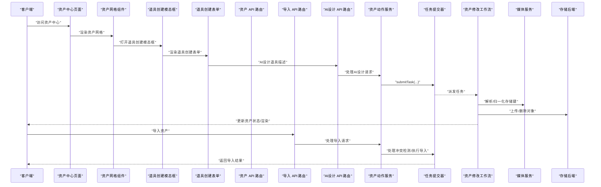

**图表来源**
- [src/app/[locale]/workspace/asset-hub/page.tsx:33-709](file://src/app/[locale]/workspace/asset-hub/page.tsx#L33-L709)
- [src/app/[locale]/workspace/asset-hub/components/AssetGrid.tsx:31-306](file://src/app/[locale]/workspace/asset-hub/components/AssetGrid.tsx#L31-L306)
- [src/app/[locale]/workspace/asset-hub/components/CharacterCard.tsx:59-533](file://src/app/[locale]/workspace/asset-hub/components/CharacterCard.tsx#L59-L533)
- [src/app/[locale]/workspace/asset-hub/components/LocationCard.tsx:59-500](file://src/app/[locale]/workspace/asset-hub/components/LocationCard.tsx#L59-L500)
- [src/lib/constants.ts:652-660](file://src/lib/constants.ts#L652-L660)
- [src/app/api/assets/route.ts:65-125](file://src/app/api/assets/route.ts#L65-L125)
- [src/lib/assets/services/asset-actions.ts:143-329](file://src/lib/assets/services/asset-actions.ts#L143-L329)
- [src/lib/task/submitter.ts](file://src/lib/task/submitter.ts)
- [src/lib/workers/handlers/asset-hub-modify-task-handler.ts:219-257](file://src/lib/workers/handlers/asset-hub-modify-task-handler.ts#L219-L257)
- [src/lib/media/service.ts:152-171](file://src/lib/media/service.ts#L152-L171)
- [src/lib/storage/index.ts](file://src/lib/storage/index.ts)
- [src/app/api/asset-hub/import/route.ts:264-310](file://src/app/api/asset-hub/import/route.ts#L264-L310)
- [src/app/api/asset-hub/ai-design-prop/route.ts:12-52](file://src/app/api/asset-hub/ai-design-prop/route.ts#L12-L52)

## 详细组件分析

### 统一资产查询与映射
- 作用域与鉴权
  - 项目作用域需要 projectId 并进行轻量鉴权；全局作用域需要用户认证并按 userId 过滤。
- 聚合与映射
  - 项目资产：从项目角色、场景/道具中读取并挂载媒体字段，再映射为统一资产结构。
  - 全局资产：从全局角色、场景/道具与声音中读取，挂载媒体字段并映射。
- 类型过滤
  - 可按 kind 过滤返回结果，支持 location、prop、character、voice 等。

**图表来源**
- [src/lib/assets/services/read-assets.ts:19-104](file://src/lib/assets/services/read-assets.ts#L19-L104)
- [src/lib/assets/mappers.ts](file://src/lib/assets/mappers.ts)
- [src/lib/media/attach.ts](file://src/lib/media/attach.ts)

**章节来源**
- [src/lib/assets/services/read-assets.ts:106-117](file://src/lib/assets/services/read-assets.ts#L106-L117)

### 资产动作服务（生成/修改/选择/回退/删除）
- 生成任务
  - 全局：根据类型与外观索引确定艺术风格，确保目标图像槽位存在，构建计费负载并提交任务。
  - 项目：根据目标类型（角色外观或场景图像）解析目标 ID，构建计费负载并提交任务。
- 修改任务
  - 全局/项目均对额外参考图进行输入审计，构建修改意图与计费负载，提交修改任务。
- 渲染选择与确认
  - 全局：支持选择/确认当前渲染，确认时清理非选中对象并持久化描述与索引。
  - 项目：支持选择/确认当前渲染，确认时清理多余图像并更新选中项。
- 回退
  - 恢复到 previousImageUrls/previousDescription，必要时删除当前图像对象。
- 删除
  - 删除位置型资产时级联删除图像槽位；删除全局资产时同时删除图像与资产记录。

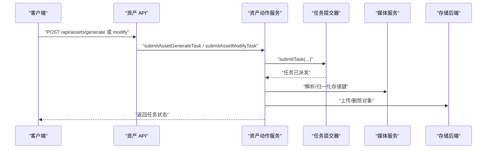

**图表来源**
- [src/lib/assets/services/asset-actions.ts:143-329](file://src/lib/assets/services/asset-actions.ts#L143-L329)
- [src/lib/assets/services/asset-actions.ts:517-679](file://src/lib/assets/services/asset-actions.ts#L517-L679)
- [src/lib/assets/services/asset-actions.ts:1185-1201](file://src/lib/assets/services/asset-actions.ts#L1185-L1201)
- [src/lib/media/service.ts:152-171](file://src/lib/media/service.ts#L152-L171)
- [src/lib/storage/index.ts](file://src/lib/storage/index.ts)

**章节来源**
- [src/lib/assets/services/asset-actions.ts:143-329](file://src/lib/assets/services/asset-actions.ts#L143-L329)
- [src/lib/assets/services/asset-actions.ts:517-679](file://src/lib/assets/services/asset-actions.ts#L517-L679)
- [src/lib/assets/services/asset-actions.ts:1185-1201](file://src/lib/assets/services/asset-actions.ts#L1185-L1201)

### 位置型资产生命周期（场景/道具）
- 创建
  - 全局：插入全局资产记录并填充初始图像槽位（描述与可用槽位）。
  - 项目：插入项目资产记录并填充初始图像槽位。
- 图像槽位
  - 按 imageIndex 排序；支持可用槽位序列化存储；支持描述数组归一化。
- 删除
  - 级联删除图像槽位与资产记录。

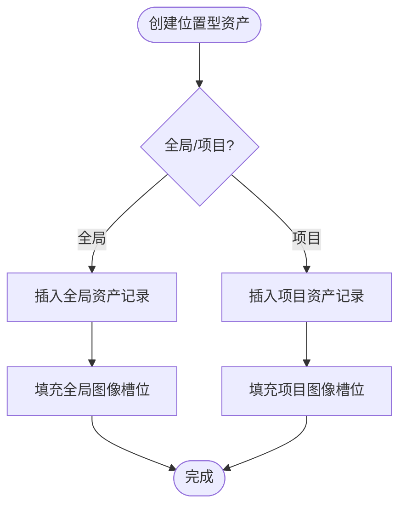

**图表来源**
- [src/lib/assets/services/location-backed-assets.ts:190-270](file://src/lib/assets/services/location-backed-assets.ts#L190-L270)
- [src/lib/assets/services/location-backed-assets.ts:272-325](file://src/lib/assets/services/location-backed-assets.ts#L272-L325)

**章节来源**
- [src/lib/assets/services/location-backed-assets.ts:135-188](file://src/lib/assets/services/location-backed-assets.ts#L135-L188)
- [src/lib/assets/services/location-backed-assets.ts:190-270](file://src/lib/assets/services/location-backed-assets.ts#L190-L270)
- [src/lib/assets/services/location-backed-assets.ts:272-325](file://src/lib/assets/services/location-backed-assets.ts#L272-L325)

### 媒体对象与存储键解析
- 归一化入口
  - resolveStorageKeyFromMediaValue 将多种媒体值形态统一为存储键，用于写操作与比较。
- 媒体对象登记
  - ensureMediaObjectFromStorageKey 基于存储键生成稳定 publicId 并登记媒体对象，避免并发冲突。
- URL 与路由
  - 媒体路由 /m/{publicId} 与存储键映射，便于安全访问与缓存。

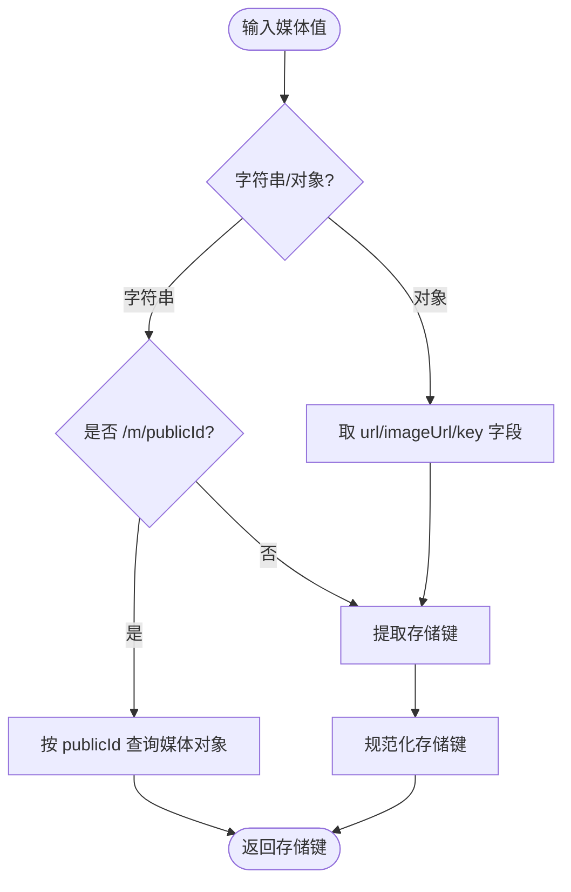

**图表来源**
- [src/lib/media/service.ts:152-171](file://src/lib/media/service.ts#L152-L171)
- [src/lib/media/service.ts:88-134](file://src/lib/media/service.ts#L88-L134)

**章节来源**
- [src/lib/media/service.ts:88-134](file://src/lib/media/service.ts#L88-L134)
- [src/lib/media/service.ts:152-171](file://src/lib/media/service.ts#L152-L171)

### 全局资产库共享与跨项目访问
- 全局资产
  - 用户登录后可访问其全局资产库，按 folderId 分类，支持 location/prop/character/voice。
- 跨项目访问
  - 项目内可通过复制/引用全局资产到项目场景/道具，形成"项目资产 → 全局资产"映射。
- 权限控制
  - 项目作用域需携带有效 projectId 并通过轻量鉴权；全局作用域需用户认证。

**章节来源**
- [src/lib/assets/services/read-assets.ts:59-104](file://src/lib/assets/services/read-assets.ts#L59-L104)
- [src/app/api/assets/route.ts:23-52](file://src/app/api/assets/route.ts#L23-L52)

### 资产标签系统与分类管理
- 标签与分类
  - 通过资产创建与更新接口传入标签/分类字段，配合前端选择器与搜索组件实现筛选。
- 可用槽位
  - 场景/道具图像支持可用槽位序列化存储，便于后续变体生成与选择。

**章节来源**
- [src/lib/assets/services/asset-label.ts](file://src/lib/assets/services/asset-label.ts)
- [src/lib/location-available-slots.ts](file://src/lib/location-available-slots.ts)

### 搜索功能实现
- 前端搜索
  - 结合 useAssets/useGlobalAssets 返回的资产列表，按名称、描述、标签等字段进行本地搜索与过滤。
- 后端过滤
  - readAssets 支持按 kind 进行二次过滤，减少前端负担。

**章节来源**
- [src/lib/query/hooks/useAssets.ts:262-298](file://src/lib/query/hooks/useAssets.ts#L262-L298)
- [src/lib/query/hooks/useGlobalAssets.ts:139-173](file://src/lib/query/hooks/useGlobalAssets.ts#L139-L173)
- [src/lib/assets/services/read-assets.ts:106-117](file://src/lib/assets/services/read-assets.ts#L106-L117)

### 统一资产创建界面

**更新** 新增了统一资产创建界面的详细说明。

#### PropCreationModal 组件
- **完整模态框功能**：提供完整的道具创建工作流，支持资产中心和项目两种模式。
- **状态管理**：集中管理创建模式、名称、描述、AI指令、艺术风格、参考图等状态。
- **文件处理**：支持拖拽上传、粘贴上传、文件选择等多种参考图上传方式。
- **计数控制**：集成图像生成数量选择器，支持批量生成。
- **键盘快捷键**：支持ESC键关闭，提升用户体验。

#### PropCreationForm 表单组件
- **双模式支持**：通过分段控制器在"AI设计"和"参考图"模式间切换。
- **AI设计模式**：输入AI指令，生成道具视觉描述，支持禁用状态和加载状态。
- **参考图模式**：支持多张参考图上传，提供预览和清除功能。
- **艺术风格选择**：集成StyleSelector组件，支持多种艺术风格选项。
- **分组管理**：在资产中心模式下支持文件夹分组选择。

#### usePropCreationSubmit 钩子
- **AI设计集成**：通过useAiDesignProp钩子处理AI设计请求。
- **描述提取**：通过/api/asset-hub/describe-images接口提取描述信息。
- **文件上传**：根据模式选择Asset Hub或项目临时媒体上传。
- **乐观更新**：集成任务状态展示，提供加载状态反馈。
- **错误处理**：统一的错误处理和用户提示机制。

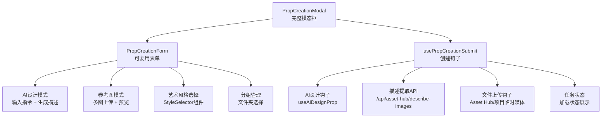

**图表来源**
- [src/components/shared/assets/PropCreationModal.tsx:1-231](file://src/components/shared/assets/PropCreationModal.tsx#L1-L231)
- [src/components/shared/assets/prop-creation/PropCreationForm.tsx:1-185](file://src/components/shared/assets/prop-creation/PropCreationForm.tsx#L1-L185)
- [src/components/shared/assets/prop-creation/hooks/usePropCreationSubmit.ts:1-218](file://src/components/shared/assets/prop-creation/hooks/usePropCreationSubmit.ts#L1-L218)

**章节来源**
- [src/components/shared/assets/PropCreationModal.tsx:1-231](file://src/components/shared/assets/PropCreationModal.tsx#L1-L231)
- [src/components/shared/assets/prop-creation/PropCreationForm.tsx:1-185](file://src/components/shared/assets/prop-creation/PropCreationForm.tsx#L1-L185)
- [src/components/shared/assets/prop-creation/hooks/usePropCreationSubmit.ts:1-218](file://src/components/shared/assets/prop-creation/hooks/usePropCreationSubmit.ts#L1-L218)

### AI设计功能增强

**更新** 新增了AI设计功能增强的详细说明。

#### AI设计共享工具函数
- **统一设计逻辑**：aiDesign函数统一处理Asset Hub和Novel Promotion的AI设计逻辑。
- **提示词模板集成**：通过buildPrompt函数集成prompt-i18n模块，支持多语言提示词。
- **计费处理**：支持withTextBilling和skipBilling两种计费模式。
- **错误处理**：完善的错误处理和返回值结构。

#### AI设计工作流
- **任务化处理**：通过maybeSubmitLLMTask提交LLM任务，支持异步处理。
- **去重机制**：使用createHash创建去重摘要，避免重复任务。
- **进度报告**：通过reportTaskProgress提供任务进度反馈。
- **模型配置**：从getUserModelConfig获取用户模型配置。

#### 道具设计提示词模板
- **专业设计专家**：专门的道具视觉设计专家角色定义。
- **设计规则**：明确的道具设计要求和生成规则。
- **输出格式**：标准化的JSON输出格式，包含prompt字段。
- **多语言支持**：支持中文和英文两种语言版本。

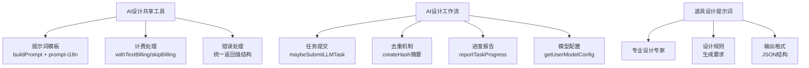

**图表来源**
- [src/lib/asset-utils/ai-design.ts:1-140](file://src/lib/asset-utils/ai-design.ts#L1-L140)
- [src/app/api/asset-hub/ai-design-prop/route.ts:1-52](file://src/app/api/asset-hub/ai-design-prop/route.ts#L1-L52)
- [src/lib/prompt-i18n/build-prompt.ts:1-45](file://src/lib/prompt-i18n/build-prompt.ts#L1-L45)
- [lib/prompts/novel-promotion/prop_create.zh.txt:1-23](file://lib/prompts/novel-promotion/prop_create.zh.txt#L1-L23)
- [lib/prompts/novel-promotion/prop_create.en.txt:1-23](file://lib/prompts/novel-promotion/prop_create.en.txt#L1-L23)

**章节来源**
- [src/lib/asset-utils/ai-design.ts:1-140](file://src/lib/asset-utils/ai-design.ts#L1-L140)
- [src/app/api/asset-hub/ai-design-prop/route.ts:1-52](file://src/app/api/asset-hub/ai-design-prop/route.ts#L1-L52)
- [src/lib/prompt-i18n/build-prompt.ts:1-45](file://src/lib/prompt-i18n/build-prompt.ts#L1-L45)
- [src/lib/prompt-i18n/catalog.ts:1-34](file://src/lib/prompt-i18n/catalog.ts#L1-L34)
- [src/lib/prompt-i18n/template-store.ts:1-44](file://src/lib/prompt-i18n/template-store.ts#L1-L44)
- [src/lib/prompt-i18n/prompt-ids.ts:1-35](file://src/lib/prompt-i18n/prompt-ids.ts#L1-L35)
- [lib/prompts/novel-promotion/prop_create.zh.txt:1-23](file://lib/prompts/novel-promotion/prop_create.zh.txt#L1-L23)
- [lib/prompts/novel-promotion/prop_create.en.txt:1-23](file://lib/prompts/novel-promotion/prop_create.en.txt#L1-L23)

### 导入系统与冲突解决机制

**更新** 新增了导入系统与冲突解决机制的详细说明。

#### ImportConflictModal 冲突解决模态框
- **冲突列表展示**：以列表形式展示所有冲突项，支持排序和筛选。
- **批量操作**：提供"跳过全部"和"覆盖全部"的批量操作按钮。
- **逐项解决**：支持逐项选择skip或overwrite操作。
- **状态反馈**：实时显示解决状态，确保所有冲突都被处理。
- **加载状态**：导入过程中的禁用状态，防止重复提交。

#### 导入API路由
- **冲突检测**：detectConflicts函数检测现有资产冲突，支持四种资产类型。
- **文件夹解析**：resolveFolderId函数处理文件夹名称解析和创建。
- **执行导入**：executeImport函数根据冲突解决策略执行导入操作。
- **多语言支持**：支持skip和overwrite两种导入策略。
- **默认值处理**：为新创建的资产设置合理的默认值。

#### 导入流程
- **检测阶段**：mode=detect时检测冲突并返回冲突信息。
- **执行阶段**：mode=execute时根据resolutions执行导入。
- **状态追踪**：跟踪created、updated、skipped三种状态。
- **错误处理**：完善的参数验证和错误处理机制。

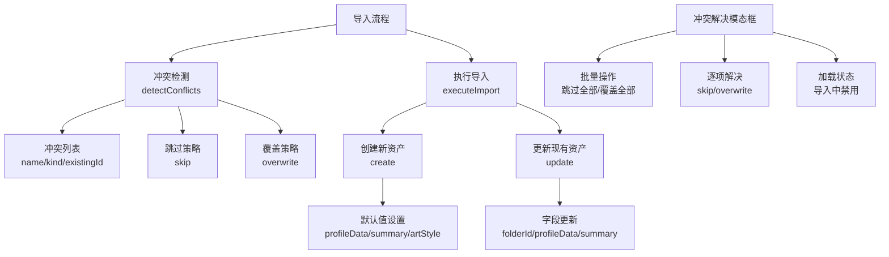

**图表来源**
- [src/app/[locale]/workspace/asset-hub/components/ImportConflictModal.tsx:1-166](file://src/app/[locale]/workspace/asset-hub/components/ImportConflictModal.tsx#L1-L166)
- [src/app/api/asset-hub/import/route.ts:1-310](file://src/app/api/asset-hub/import/route.ts#L1-L310)
- [src/app/[locale]/workspace/asset-hub/page.tsx:538-571](file://src/app/[locale]/workspace/asset-hub/page.tsx#L538-L571)

**章节来源**
- [src/app/[locale]/workspace/asset-hub/components/ImportConflictModal.tsx:1-166](file://src/app/[locale]/workspace/asset-hub/components/ImportConflictModal.tsx#L1-L166)
- [src/app/api/asset-hub/import/route.ts:1-310](file://src/app/api/asset-hub/import/route.ts#L1-L310)
- [src/app/[locale]/workspace/asset-hub/page.tsx:538-571](file://src/app/[locale]/workspace/asset-hub/page.tsx#L538-L571)

### AI提示词模板系统

**更新** 新增了AI提示词模板系统的详细说明。

#### prompt-i18n模块架构
- **统一管理**：通过PROMPT_IDS常量统一管理所有提示词ID。
- **目录映射**：PROMPT_CATALOG提供提示词ID到文件路径的映射。
- **模板存储**：template-store模块提供模板缓存和文件读取功能。
- **构建函数**：buildPrompt函数处理模板加载、变量替换和错误处理。

#### 提示词模板管理
- **目录结构**：lib/prompts目录下按功能分类存储提示词模板。
- **多语言支持**：每个模板都有对应的中文(.zh.txt)和英文(.en.txt)版本。
- **变量系统**：支持{{variable}}和{variable}两种占位符语法。
- **缓存机制**：templateStore使用Map缓存已加载的模板，提升性能。

#### 道具设计提示词
- **专业角色**：定义为"专业的道具视觉设计专家"。
- **设计要求**：明确的道具设计规则和生成约束。
- **输出规范**：标准化的JSON输出格式，包含prompt字段。
- **语言规范**：中文输出60-120字，英文输出50-120词。

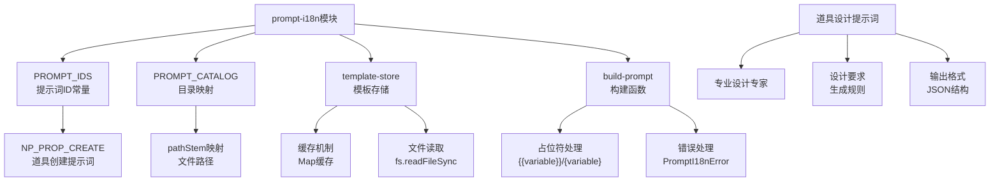

**图表来源**
- [src/lib/prompt-i18n/index.ts:1-11](file://src/lib/prompt-i18n/index.ts#L1-L11)
- [src/lib/prompt-i18n/catalog.ts:1-34](file://src/lib/prompt-i18n/catalog.ts#L1-L34)
- [src/lib/prompt-i18n/build-prompt.ts:1-45](file://src/lib/prompt-i18n/build-prompt.ts#L1-L45)
- [src/lib/prompt-i18n/template-store.ts:1-44](file://src/lib/prompt-i18n/template-store.ts#L1-L44)
- [src/lib/prompt-i18n/prompt-ids.ts:1-35](file://src/lib/prompt-i18n/prompt-ids.ts#L1-L35)
- [lib/prompts/novel-promotion/prop_create.zh.txt:1-23](file://lib/prompts/novel-promotion/prop_create.zh.txt#L1-L23)
- [lib/prompts/novel-promotion/prop_create.en.txt:1-23](file://lib/prompts/novel-promotion/prop_create.en.txt#L1-L23)

**章节来源**
- [src/lib/prompt-i18n/index.ts:1-11](file://src/lib/prompt-i18n/index.ts#L1-L11)
- [src/lib/prompt-i18n/catalog.ts:1-34](file://src/lib/prompt-i18n/catalog.ts#L1-L34)
- [src/lib/prompt-i18n/build-prompt.ts:1-45](file://src/lib/prompt-i18n/build-prompt.ts#L1-L45)
- [src/lib/prompt-i18n/template-store.ts:1-44](file://src/lib/prompt-i18n/template-store.ts#L1-L44)
- [src/lib/prompt-i18n/prompt-ids.ts:1-35](file://src/lib/prompt-i18n/prompt-ids.ts#L1-L35)
- [lib/prompts/novel-promotion/prop_create.zh.txt:1-23](file://lib/prompts/novel-promotion/prop_create.zh.txt#L1-L23)
- [lib/prompts/novel-promotion/prop_create.en.txt:1-23](file://lib/prompts/novel-promotion/prop_create.en.txt#L1-L23)

### 优化资产选择系统的乐观更新机制

**更新** 新增了优化资产选择系统的乐观更新机制详细说明。

#### 改进的乐观更新实现
- **统一状态管理**：CharacterCard和LocationCard采用相似的乐观更新模式。
- **请求ID跟踪**：通过latestSelectRequestRef跟踪每个目标的最新请求ID。
- **错误回滚保护**：在onError回调中检查请求ID，防止过期请求覆盖最新状态。
- **服务端同步**：通过useEffect监听serverSelectedIndex变化，自动清除本地状态。
- **缓存失效优化**：在mutation的onSettled回调中统一失效queryKeys.assets.all('global')缓存。

#### 统一缓存失效机制
- **多处失效**：useSelectCharacterImage和useSelectLocationImage都在onSettled中失效缓存。
- **确保一致性**：这确保了useAssets钩子能够接收到更新后的数据。
- **任务覆盖层**：通过task-target-overlay机制提供视觉反馈。

#### 卡片组件优化
- **CharacterCard**：支持多图选择模式和单图模式的智能切换。
- **LocationCard**：集成图像生成槽位状态显示。
- **VoiceCard**：紧凑的行布局设计，内置音频播放预览功能。

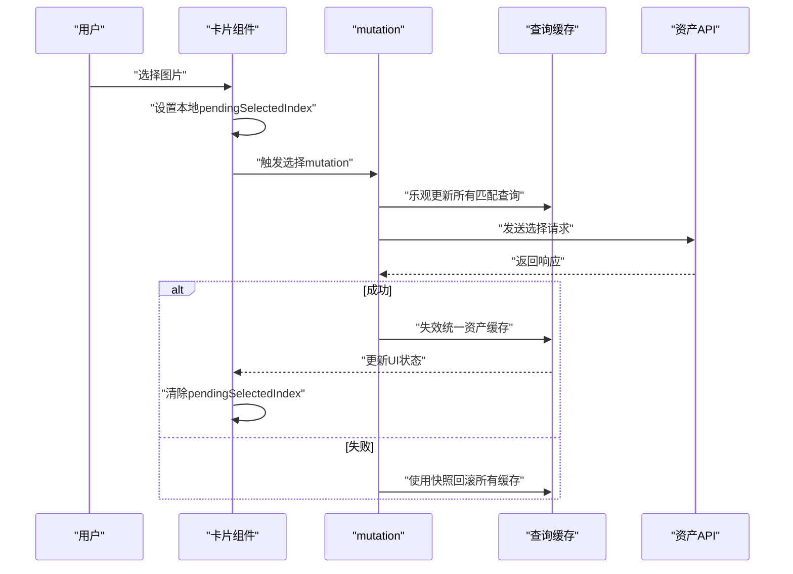

**图表来源**
- [src/app/[locale]/workspace/asset-hub/components/CharacterCard.tsx:157-168](file://src/app/[locale]/workspace/asset-hub/components/CharacterCard.tsx#L157-L168)
- [src/app/[locale]/workspace/asset-hub/components/LocationCard.tsx:127-139](file://src/app/[locale]/workspace/asset-hub/components/LocationCard.tsx#L127-L139)
- [src/lib/query/mutations/asset-hub-character-mutations.ts:241-250](file://src/lib/query/mutations/asset-hub-character-mutations.ts#L241-L250)
- [src/lib/query/mutations/asset-hub-location-mutations.ts:218-227](file://src/lib/query/mutations/asset-hub-location-mutations.ts#L218-L227)

**章节来源**
- [src/app/[locale]/workspace/asset-hub/components/CharacterCard.tsx:157-168](file://src/app/[locale]/workspace/asset-hub/components/CharacterCard.tsx#L157-L168)
- [src/app/[locale]/workspace/asset-hub/components/LocationCard.tsx:127-139](file://src/app/[locale]/workspace/asset-hub/components/LocationCard.tsx#L127-L139)
- [src/lib/query/mutations/asset-hub-character-mutations.ts:176-252](file://src/lib/query/mutations/asset-hub-character-mutations.ts#L176-L252)
- [src/lib/query/mutations/asset-hub-location-mutations.ts:161-229](file://src/lib/query/mutations/asset-hub-location-mutations.ts#L161-L229)
- [src/lib/query/task-target-overlay.ts:52-99](file://src/lib/query/task-target-overlay.ts#L52-L99)

### 改进资产中心UI布局

**更新** 新增了改进资产中心UI布局的详细说明。

#### 资产中心页面架构
- **现代化布局设计**
  - 采用玻璃拟态设计风格，提供沉浸式的视觉体验。
  - 固定头部工具栏包含标题、描述、模型提示信息和操作按钮。
  - 可滚动卡片区域支持大量资产的高效浏览。
- **文件夹管理系统**
  - 支持创建、编辑、删除资产文件夹。
  - 文件夹下拉菜单提供便捷的文件夹选择功能。
- **资产筛选与分页**
  - 支持按类型筛选（全部/角色/场景/道具/音色）。
  - 每个资产类别独立分页，提升大数据量下的性能表现。

#### 资产网格组件
- **响应式网格布局**
  - 根据屏幕尺寸自动调整列数（2-8列不等）。
  - 支持空状态和筛选为空的友好提示。
- **分页机制**
  - 每个资产类别独立维护分页状态。
  - 支持上一页/下一页导航，显示页码信息。
- **加载状态处理**
  - 统一的任务状态显示，提供生成进度反馈。

#### 卡片组件优化
- **角色卡片（CharacterCard）**
  - 支持多图选择模式和单图模式的智能切换。
  - 智能的乐观更新机制，包括本地状态同步和请求ID跟踪。
  - 详细的错误处理和回滚保护。
- **场景卡片（LocationCard）**
  - 集成图像生成槽位状态显示。
  - 支持多图像槽位的选择和确认。
  - 优化的用户交互体验。
- **音色卡片（VoiceCard）**
  - 紧凑的行布局设计。
  - 内置音频播放预览功能。
  - 支持选择模式和删除确认。

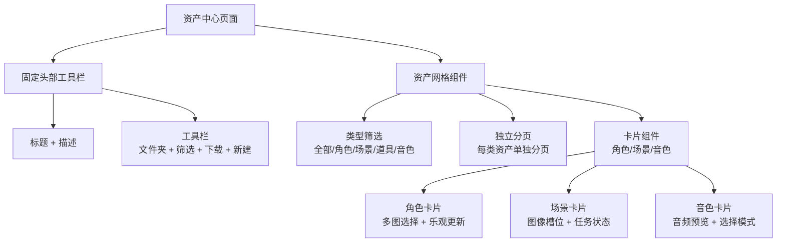

**图表来源**
- [src/app/[locale]/workspace/asset-hub/page.tsx:33-709](file://src/app/[locale]/workspace/asset-hub/page.tsx#L33-L709)
- [src/app/[locale]/workspace/asset-hub/components/AssetGrid.tsx:31-306](file://src/app/[locale]/workspace/asset-hub/components/AssetGrid.tsx#L31-L306)
- [src/app/[locale]/workspace/asset-hub/components/CharacterCard.tsx:59-533](file://src/app/[locale]/workspace/asset-hub/components/CharacterCard.tsx#L59-L533)
- [src/app/[locale]/workspace/asset-hub/components/LocationCard.tsx:59-500](file://src/app/[locale]/workspace/asset-hub/components/LocationCard.tsx#L59-L500)
- [src/app/[locale]/workspace/asset-hub/components/VoiceCard.tsx:28-143](file://src/app/[locale]/workspace/asset-hub/components/VoiceCard.tsx#L28-L143)

**章节来源**
- [src/app/[locale]/workspace/asset-hub/page.tsx:33-709](file://src/app/[locale]/workspace/asset-hub/page.tsx#L33-L709)
- [src/app/[locale]/workspace/asset-hub/components/AssetGrid.tsx:31-306](file://src/app/[locale]/workspace/asset-hub/components/AssetGrid.tsx#L31-L306)
- [src/app/[locale]/workspace/asset-hub/components/CharacterCard.tsx:59-533](file://src/app/[locale]/workspace/asset-hub/components/CharacterCard.tsx#L59-L533)
- [src/app/[locale]/workspace/asset-hub/components/LocationCard.tsx:59-500](file://src/app/[locale]/workspace/asset-hub/components/LocationCard.tsx#L59-L500)
- [src/app/[locale]/workspace/asset-hub/components/VoiceCard.tsx:28-143](file://src/app/[locale]/workspace/asset-hub/components/VoiceCard.tsx#L28-L143)

### AI生成内容与传统媒体文件处理
- 生成流程
  - 通过任务系统提交图像生成任务，工作流处理器根据类型与艺术风格生成图像，上传源图并更新资产。
- 修改流程
  - 支持基于用户指令的图像修改，工作流处理器解析修改意图、生成新描述与可用槽位。
- 传统媒体
  - 通过媒体服务解析存储键与媒体对象，支持上传、删除与引用管理。

**章节来源**
- [src/lib/assets/services/asset-actions.ts:143-329](file://src/lib/assets/services/asset-actions.ts#L143-L329)
- [src/lib/workers/handlers/asset-hub-modify-task-handler.ts:219-257](file://src/lib/workers/handlers/asset-hub-modify-task-handler.ts#L219-L257)
- [src/lib/workers/handlers/asset-hub-ai-modify.ts:57-140](file://src/lib/workers/handlers/asset-hub-ai-modify.ts#L57-L140)
- [src/lib/media/service.ts:152-171](file://src/lib/media/service.ts#L152-L171)

### 元数据管理、缩略图与预览
- 元数据
  - 媒体对象登记时记录 MIME、尺寸、时长等；资产描述与可用槽位作为元数据存储。
- 缩略图与预览
  - 媒体服务提供统一 URL 路由，前端组件负责缩略图与预览展示。

**章节来源**
- [src/lib/media/service.ts:72-86](file://src/lib/media/service.ts#L72-L86)
- [src/lib/media/image-url.ts](file://src/lib/media/image-url.ts)

### 资产生成、修改与删除流程
- 生成
  - 解析语言与计费配置 → 确保目标槽位 → 提交任务 → 更新任务状态。
- 修改
  - 输入审计 → 构建修改意图 → 提交任务 → 处理器生成新描述与可用槽位。
- 删除
  - 删除资产记录与图像槽位，必要时删除存储对象。

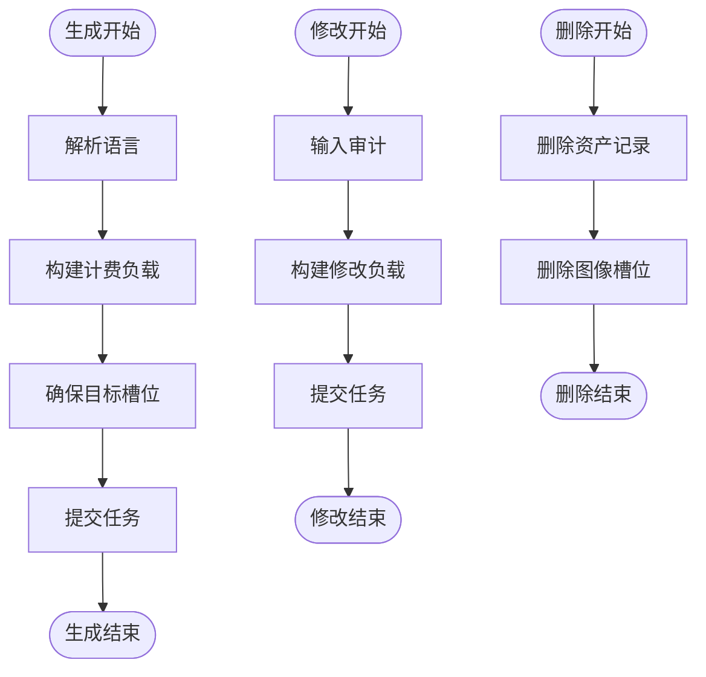

**图表来源**
- [src/lib/assets/services/asset-actions.ts:143-329](file://src/lib/assets/services/asset-actions.ts#L143-L329)
- [src/lib/assets/services/asset-actions.ts:369-515](file://src/lib/assets/services/asset-actions.ts#L369-L515)
- [src/lib/assets/services/asset-actions.ts:1185-1201](file://src/lib/assets/services/asset-actions.ts#L1185-L1201)

**章节来源**
- [src/lib/assets/services/asset-actions.ts:143-329](file://src/lib/assets/services/asset-actions.ts#L143-L329)
- [src/lib/assets/services/asset-actions.ts:369-515](file://src/lib/assets/services/asset-actions.ts#L369-L515)
- [src/lib/assets/services/asset-actions.ts:1185-1201](file://src/lib/assets/services/asset-actions.ts#L1185-L1201)

### 资产迁移、备份恢复与清理策略
- 迁移
  - 迁移到 MinIO 的脚本提供对象存储迁移流程。
- 备份
  - 媒体安全备份脚本提供备份策略与执行入口。
- 恢复
  - 恢复演练脚本支持干跑验证恢复流程。
- 清理
  - 未引用索引构建与遗留引用归档脚本，辅助清理无用对象。

**章节来源**
- [scripts/migrate-to-minio.ts](file://scripts/migrate-to-minio.ts)
- [scripts/media-safety-backup.ts](file://scripts/media-safety-backup.ts)
- [scripts/media-restore-dry-run.ts](file://scripts/media-restore-dry-run.ts)
- [scripts/media-build-unreferenced-index.ts](file://scripts/media-build-unreferenced-index.ts)
- [scripts/media-archive-legacy-refs.ts](file://scripts/media-archive-legacy-refs.ts)
- [scripts/media-backfill-refs.ts](file://scripts/media-backfill-refs.ts)

### 资产 API 使用示例与集成指南
- 读取资产
  - GET /api/assets?scope=global|project&projectId=...&folderId=...&kind=...
  - 需要用户认证或项目轻量鉴权。
- 创建资产（项目）
  - POST /api/assets（scope=project, kind=location|prop, projectId=...）
  - 负载包含名称、摘要、描述等。
- 生成/修改任务
  - 通过资产动作服务提交任务，工作流处理器完成生成与修改。
- 前端集成
  - 使用 useAssets/useGlobalAssets 获取资产列表，结合全局资产选择器与编辑模态框进行交互。

**章节来源**
- [src/app/api/assets/route.ts:23-69](file://src/app/api/assets/route.ts#L23-L69)
- [src/lib/query/hooks/useAssets.ts:262-298](file://src/lib/query/hooks/useAssets.ts#L262-L298)
- [src/lib/query/hooks/useGlobalAssets.ts:139-173](file://src/lib/query/hooks/useGlobalAssets.ts#L139-L173)
- [src/components/shared/assets/GlobalAssetPicker.tsx](file://src/components/shared/assets/GlobalAssetPicker.tsx)
- [src/components/shared/assets/LocationEditModal.tsx](file://src/components/shared/assets/LocationEditModal.tsx)

### 与存储后端的集成与性能优化
- 存储后端
  - 通过统一的存储适配层与媒体服务解耦具体后端（如 COS/MinIO），保证键解析与对象管理一致性。
- 性能优化
  - 并行查询与映射：项目资产读取中并行获取场景/道具与角色数据。
  - 去重键：任务提交时使用去重键避免重复生成。
  - 计费与能力检查：在提交前校验模型能力与计费配置，减少无效任务。
  - 媒体对象登记：通过稳定 publicId 与 upsert 降低并发冲突风险。

**章节来源**
- [src/lib/storage/index.ts](file://src/lib/storage/index.ts)
- [src/lib/media/service.ts:88-134](file://src/lib/media/service.ts#L88-L134)
- [src/lib/assets/services/asset-actions.ts:224-235](file://src/lib/assets/services/asset-actions.ts#L224-L235)
- [src/lib/assets/services/asset-actions.ts:317-328](file://src/lib/assets/services/asset-actions.ts#L317-L328)

### 项目场景资产删除的乐观UI更新机制

**更新** 新增了项目场景资产删除的乐观UI更新机制详细说明。

#### DeleteProjectLocationContext 接口设计
- **快照捕获**：DeleteProjectLocationContext 接口捕获三个关键缓存层级的快照，包括项目资产数据、项目数据和所有资产列表缓存。
- **缓存层级**：通过 assetsQueryKey、projectQueryKey 和 assetsParentKey 三个查询键，确保删除操作能够影响到所有相关的缓存数据。
- **数据结构**：包含 previousAssets、previousProject 和 previousAssetListSnapshots 三个属性，分别对应不同的缓存层级。

#### 全面的乐观更新实现
- **查询取消**：在 onMutate 阶段使用 queryClient.cancelQueries 取消所有可能受影响的查询，避免竞态条件。
- **快照捕获**：使用 queryClient.getQueriesData 获取所有资产列表缓存的快照，确保能够完整回滚。
- **多层乐观更新**：同时更新项目资产数据、项目数据和所有 useAssets 缓存，确保 UI 一致性。
- **精确过滤**：通过 `!(asset.kind === 'location' && asset.id === locationId)` 精确过滤掉被删除的场景资产。

#### 错误回滚与缓存同步
- **onError 处理**：当删除操作失败时，使用 context 对象中的快照数据恢复所有受影响的缓存。
- **onSettled 同步**：删除成功后，使用 invalidateQueryTemplates 同步失效多个查询模板，确保数据一致性。
- **缓存失效**：同时失效项目资产和所有资产列表相关的缓存，避免陈旧数据。

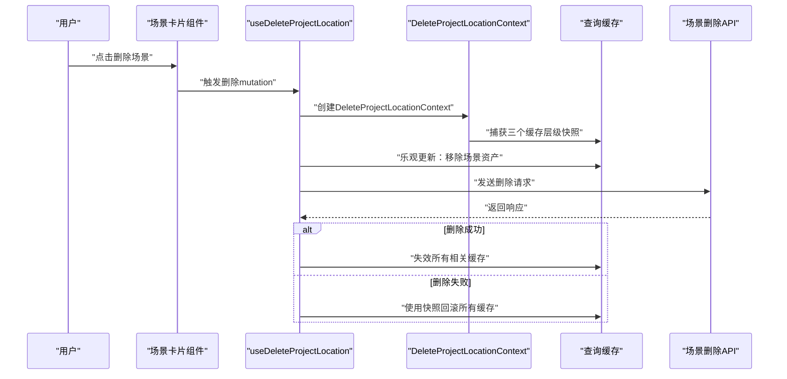

**图表来源**
- [src/lib/query/mutations/location-management-mutations.ts:21-28](file://src/lib/query/mutations/location-management-mutations.ts#L21-L28)
- [src/lib/query/mutations/location-management-mutations.ts:67-103](file://src/lib/query/mutations/location-management-mutations.ts#L67-L103)
- [src/lib/query/mutations/location-management-mutations.ts:104-118](file://src/lib/query/mutations/location-management-mutations.ts#L104-L118)

**章节来源**
- [src/lib/query/mutations/location-management-mutations.ts:21-28](file://src/lib/query/mutations/location-management-mutations.ts#L21-L28)
- [src/lib/query/mutations/location-management-mutations.ts:56-119](file://src/lib/query/mutations/location-management-mutations.ts#L56-L119)
- [src/lib/query/mutations/location-management-mutations.ts:76-96](file://src/lib/query/mutations/location-management-mutations.ts#L76-L96)
- [src/lib/query/mutations/location-management-mutations.ts:104-118](file://src/lib/query/mutations/location-management-mutations.ts#L104-L118)

### 开发环境UI重构演示

**更新** 新增了开发环境中的UI重构演示功能。

#### 工作区重设计演示
- **多种布局变体**：提供了5种不同的项目卡片布局方式，包括网格、横向滚动、紧凑列表、突出首项和极简圆点列表。
- **响应式设计**：每种布局都针对不同屏幕尺寸进行了优化。
- **渐变视觉效果**：使用CSS渐变和图标系统营造现代化的视觉体验。
- **统计信息展示**：集成项目统计数据的可视化展示。

#### 布局组件特点
- **LayoutGrid**：标准网格布局，适合展示大量项目卡片。
- **LayoutScroll**：横向滚动布局，提供沉浸式的大卡片体验。
- **LayoutList**：紧凑列表布局，信息密度高，适合快速浏览。
- **LayoutFeatured**：突出首项布局，强调最重要的项目。
- **LayoutMinimalList**：极简布局，专注于项目名称和关键数据。

**章节来源**
- [src/app/[locale]/dev/workspace-redesign/page.tsx:1-24](file://src/app/[locale]/dev/workspace-redesign/page.tsx#L1-L24)
- [src/app/[locale]/dev/workspace-redesign/shared.ts:1-109](file://src/app/[locale]/dev/workspace-redesign/shared.ts#L1-L109)
- [src/app/[locale]/dev/workspace-redesign/ProjectLayouts.tsx:1-240](file://src/app/[locale]/dev/workspace-redesign/ProjectLayouts.tsx#L1-L240)

## 依赖关系分析

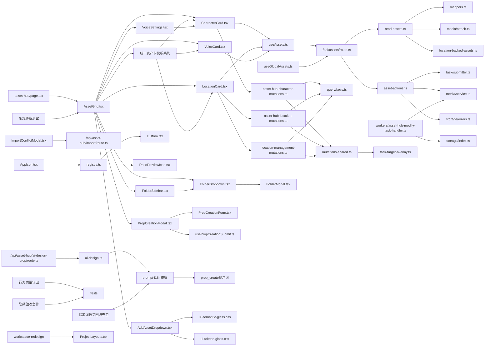

**图表来源**
- [src/lib/assets/services/read-assets.ts:1-132](file://src/lib/assets/services/read-assets.ts#L1-L132)
- [src/lib/assets/services/asset-actions.ts:1-100](file://src/lib/assets/services/asset-actions.ts#L1-L100)
- [src/app/api/assets/route.ts:23-69](file://src/app/api/assets/route.ts#L23-L69)
- [src/lib/query/hooks/useAssets.ts:262-298](file://src/lib/query/hooks/useAssets.ts#L262-L298)
- [src/lib/query/hooks/useGlobalAssets.ts:139-173](file://src/lib/query/hooks/useGlobalAssets.ts#L139-L173)
- [src/lib/workers/handlers/asset-hub-modify-task-handler.ts:219-257](file://src/lib/workers/handlers/asset-hub-modify-task-handler.ts#L219-L257)
- [src/lib/storage/errors.ts:1-13](file://src/lib/storage/errors.ts#L1-L13)
- [src/app/[locale]/workspace/asset-hub/page.tsx:33-709](file://src/app/[locale]/workspace/asset-hub/page.tsx#L33-L709)
- [src/app/[locale]/workspace/asset-hub/components/AssetGrid.tsx:31-306](file://src/app/[locale]/workspace/asset-hub/components/AssetGrid.tsx#L31-L306)
- [src/app/[locale]/workspace/asset-hub/components/CharacterCard.tsx:59-533](file://src/app/[locale]/workspace/asset-hub/components/CharacterCard.tsx#L59-L533)
- [src/app/[locale]/workspace/asset-hub/components/LocationCard.tsx:59-500](file://src/app/[locale]/workspace/asset-hub/components/LocationCard.tsx#L59-L500)
- [src/app/[locale]/workspace/asset-hub/components/VoiceCard.tsx:28-143](file://src/app/[locale]/workspace/asset-hub/components/VoiceCard.tsx#L28-L143)
- [src/app/[locale]/workspace/asset-hub/components/VoiceSettings.tsx:1-215](file://src/app/[locale]/workspace/asset-hub/components/VoiceSettings.tsx#L1-L215)
- [src/app/[locale]/workspace/asset-hub/components/FolderSidebar.tsx:51-147](file://src/app/[locale]/workspace/asset-hub/components/FolderSidebar.tsx#L51-L147)
- [src/app/[locale]/workspace/asset-hub/components/FolderDropdown.tsx:84-155](file://src/app/[locale]/workspace/asset-hub/components/FolderDropdown.tsx#L84-L155)
- [src/app/[locale]/workspace/asset-hub/components/FolderModal.tsx:1-49](file://src/app/[locale]/workspace/asset-hub/components/FolderModal.tsx#L1-L49)
- [src/app/[locale]/workspace/asset-hub/components/AddAssetDropdown.tsx:1-98](file://src/app/[locale]/workspace/asset-hub/components/AddAssetDropdown.tsx#L1-L98)
- [src/app/[locale]/workspace/asset-hub/components/ImportConflictModal.tsx:1-166](file://src/app/[locale]/workspace/asset-hub/components/ImportConflictModal.tsx#L1-L166)
- [src/app/api/asset-hub/import/route.ts:1-310](file://src/app/api/asset-hub/import/route.ts#L1-L310)
- [src/components/shared/assets/PropCreationModal.tsx:1-231](file://src/components/shared/assets/PropCreationModal.tsx#L1-L231)
- [src/components/shared/assets/prop-creation/PropCreationForm.tsx:1-185](file://src/components/shared/assets/prop-creation/PropCreationForm.tsx#L1-L185)
- [src/components/shared/assets/prop-creation/hooks/usePropCreationSubmit.ts:1-218](file://src/components/shared/assets/prop-creation/hooks/usePropCreationSubmit.ts#L1-L218)
- [src/lib/asset-utils/ai-design.ts:1-140](file://src/lib/asset-utils/ai-design.ts#L1-L140)
- [src/app/api/asset-hub/ai-design-prop/route.ts:1-52](file://src/app/api/asset-hub/ai-design-prop/route.ts#L1-L52)
- [src/lib/prompt-i18n/index.ts:1-11](file://src/lib/prompt-i18n/index.ts#L1-L11)
- [src/lib/prompt-i18n/catalog.ts:1-34](file://src/lib/prompt-i18n/catalog.ts#L1-L34)
- [src/lib/prompt-i18n/build-prompt.ts:1-45](file://src/lib/prompt-i18n/build-prompt.ts#L1-L45)
- [src/lib/prompt-i18n/template-store.ts:1-44](file://src/lib/prompt-i18n/template-store.ts#L1-L44)
- [src/lib/prompt-i18n/prompt-ids.ts:1-35](file://src/lib/prompt-i18n/prompt-ids.ts#L1-L35)
- [lib/prompts/novel-promotion/prop_create.zh.txt:1-23](file://lib/prompts/novel-promotion/prop_create.zh.txt#L1-L23)
- [lib/prompts/novel-promotion/prop_create.en.txt:1-23](file://lib/prompts/novel-promotion/prop_create.en.txt#L1-L23)
- [src/lib/query/mutations/asset-hub-character-mutations.ts:176-252](file://src/lib/query/mutations/asset-hub-character-mutations.ts#L176-L252)
- [src/lib/query/mutations/asset-hub-location-mutations.ts:161-229](file://src/lib/query/mutations/asset-hub-location-mutations.ts#L161-L229)
- [src/lib/query/mutations/location-management-mutations.ts:56-119](file://src/lib/query/mutations/location-management-mutations.ts#L56-L119)
- [src/lib/query/keys.ts:14-40](file://src/lib/query/keys.ts#L14-L40)
- [src/lib/query/mutations/asset-hub-mutations-shared.ts:1-18](file://src/lib/query/mutations/asset-hub-mutations-shared.ts#L1-L18)
- [src/lib/query/mutations/mutation-shared.ts:82-91](file://src/lib/query/mutations/mutation-shared.ts#L82-L91)
- [src/lib/query/task-target-overlay.ts:52-99](file://src/lib/query/task-target-overlay.ts#L52-L99)
- [src/lib/constants.ts:149-660](file://src/lib/constants.ts#L149-L660)
- [messages/zh/assetHub.json:1-118](file://messages/zh/assetHub.json#L1-L118)
- [messages/en/assetHub.json:1-118](file://messages/en/assetHub.json#L1-L118)
- [src/styles/ui-semantic-glass.css:1-40](file://src/styles/ui-semantic-glass.css#L1-L40)
- [src/styles/ui-tokens-glass.css:1-39](file://src/styles/ui-tokens-glass.css#L1-L39)
- [src/components/ui/SharedComponents.tsx:1-38](file://src/components/ui/SharedComponents.tsx#L1-L38)
- [src/components/ui/primitives/index.ts:1-20](file://src/components/ui/primitives/index.ts#L1-L20)
- [src/app/[locale]/dev/workspace-redesign/page.tsx:1-24](file://src/app/[locale]/dev/workspace-redesign/page.tsx#L1-L24)
- [src/app/[locale]/dev/workspace-redesign/ProjectLayouts.tsx:1-240](file://src/app/[locale]/dev/workspace-redesign/ProjectLayouts.tsx#L1-L240)
- [src/components/ui/icons/AppIcon.tsx:1-14](file://src/components/ui/icons/AppIcon.tsx#L1-L14)
- [src/components/ui/icons/registry.ts:1-194](file://src/components/ui/icons/registry.ts#L1-L194)
- [src/components/ui/icons/custom.tsx:1-200](file://src/components/ui/icons/custom.tsx#L1-L200)
- [src/components/ui/icons/RatioPreviewIcon.tsx:1-54](file://src/components/ui/icons/RatioPreviewIcon.tsx#L1-L54)
- [tests/unit/optimistic/asset-hub-mutations.test.ts:1-172](file://tests/unit/optimistic/asset-hub-mutations.test.ts#L1-L172)
- [tests/unit/optimistic/asset-actions-generate.test.ts:1-108](file://tests/unit/optimistic/asset-actions-generate.test.ts#L1-L108)
- [scripts/guards/test-behavior-quality-guard.mjs:1-51](file://scripts/guards/test-behavior-quality-guard.mjs#L1-L51)
- [scripts/guards/test-behavior-tasktype-coverage-guard.mjs:1-49](file://scripts/guards/test-behavior-tasktype-coverage-guard.mjs#L1-L49)
- [scripts/guards/prompt-semantic-regression.mjs:13-32](file://scripts/guards/prompt-semantic-regression.mjs#L13-L32)
- [tests/hidden/README.md:1-9](file://tests/hidden/README.md#L1-L9)

**章节来源**
- [src/lib/assets/services/read-assets.ts:1-132](file://src/lib/assets/services/read-assets.ts#L1-L132)
- [src/lib/assets/services/asset-actions.ts:1-100](file://src/lib/assets/services/asset-actions.ts#L1-L100)
- [src/app/api/assets/route.ts:23-69](file://src/app/api/assets/route.ts#L23-L69)
- [src/lib/constants.ts:149-660](file://src/lib/constants.ts#L149-L660)
- [src/styles/ui-semantic-glass.css:1-40](file://src/styles/ui-semantic-glass.css#L1-L40)
- [src/styles/ui-tokens-glass.css:1-39](file://src/styles/ui-tokens-glass.css#L1-L39)
- [messages/zh/assetHub.json:1-118](file://messages/zh/assetHub.json#L1-L118)
- [messages/en/assetHub.json:1-118](file://messages/en/assetHub.json#L1-L118)
- [src/app/[locale]/workspace/asset-hub/components/CharacterCard.tsx:1-607](file://src/app/[locale]/workspace/asset-hub/components/CharacterCard.tsx#L1-L607)
- [src/app/[locale]/workspace/asset-hub/components/LocationCard.tsx:1-576](file://src/app/[locale]/workspace/asset-hub/components/LocationCard.tsx#L1-L576)
- [src/app/[locale]/workspace/asset-hub/components/VoiceCard.tsx:1-156](file://src/app/[locale]/workspace/asset-hub/components/VoiceCard.tsx#L1-L156)
- [src/app/[locale]/workspace/asset-hub/components/VoiceSettings.tsx:1-215](file://src/app/[locale]/workspace/asset-hub/components/VoiceSettings.tsx#L1-L215)
- [src/app/[locale]/workspace/asset-hub/components/AssetGrid.tsx:1-312](file://src/app/[locale]/workspace/asset-hub/components/AssetGrid.tsx#L1-L312)
- [src/components/ui/icons/AppIcon.tsx:1-14](file://src/components/ui/icons/AppIcon.tsx#L1-L14)
- [src/components/ui/icons/registry.ts:1-194](file://src/components/ui/icons/registry.ts#L1-L194)
- [src/components/ui/icons/custom.tsx:1-200](file://src/components/ui/icons/custom.tsx#L1-L200)
- [src/components/ui/icons/RatioPreviewIcon.tsx:1-54](file://src/components/ui/icons/RatioPreviewIcon.tsx#L1-L54)
- [tests/unit/optimistic/asset-hub-mutations.test.ts:1-172](file://tests/unit/optimistic/asset-hub-mutations.test.ts#L1-L172)
- [tests/unit/optimistic/asset-actions-generate.test.ts:1-108](file://tests/unit/optimistic/asset-actions-generate.test.ts#L1-L108)
- [scripts/guards/test-behavior-quality-guard.mjs:1-51](file://scripts/guards/test-behavior-quality-guard.mjs#L1-L51)
- [scripts/guards/test-behavior-tasktype-coverage-guard.mjs:1-49](file://scripts/guards/test-behavior-tasktype-coverage-guard.mjs#L1-L49)
- [scripts/guards/prompt-semantic-regression.mjs:13-32](file://scripts/guards/prompt-semantic-regression.mjs#L13-L32)
- [tests/hidden/README.md:1-9](file://tests/hidden/README.md#L1-L9)

## 性能考量
- 批量与并行
  - 项目资产读取中并行获取角色与场景/道具数据，减少往返时间。
- 去重与幂等
  - 任务提交使用去重键，避免重复生成；渲染选择确认时仅保留选中对象，清理冗余。
- 计费前置
  - 在提交任务前完成计费与能力校验，降低失败成本。
- 存储键解析
  - 统一解析入口减少错误路径与重复 IO。
- **统一资产创建界面优化**
  - PropCreationModal采用集中状态管理，减少不必要的重新渲染。
  - 文件上传通过Promise.all并行处理，提升上传效率。
  - AI设计和描述提取支持禁用状态，避免重复请求。
- **AI设计功能优化**
  - aiDesign函数支持skipBilling模式，避免重复计费。
  - prompt-i18n模块使用模板缓存，提升模板加载性能。
  - AI设计工作流支持异步处理，提升用户体验。
- **导入系统优化**
  - ImportConflictModal支持批量操作，减少用户交互次数。
  - detectConflicts函数使用数据库查询优化，提升冲突检测速度。
  - executeImport函数支持事务处理，确保数据一致性。
- **提示词模板优化**
  - template-store模块使用Map缓存，避免重复文件读取。
  - buildPrompt函数支持变量替换和错误处理，提升模板使用体验。
- **优化资产选择系统**
  - 乐观更新机制通过统一缓存失效确保数据一致性。
  - 请求ID跟踪防止过期请求覆盖最新状态。
  - 智能的本地状态同步减少不必要的服务器通信。
- **改进资产中心UI优化**
  - AssetGrid组件的分页机制通过pageSize平衡内存使用和性能。
  - 响应式布局通过CSS媒体查询实现，避免JavaScript计算。
  - 统一的工具按钮样式和标签样式减少样式计算开销。

**更新** 新增了统一资产创建界面、AI设计功能、导入系统、提示词模板和优化资产选择系统相关的性能考量说明。

## 故障排查指南
- 参数校验
  - INVALID_PARAMS：scope、kind、projectId、artStyle 等参数不合法或缺失。
- 资源不存在
  - NOT_FOUND：目标资产/外观/图像不存在。
- 存储配置
  - StorageConfigError/StorageProviderNotImplementedError：存储配置缺失或未实现。
- 任务状态
  - 通过任务系统查看任务状态与错误码，定位生成/修改失败原因。
- **统一资产创建界面问题**
  - 模态框无法打开：检查PropCreationModal的onClose和onSuccess回调。
  - AI设计失败：验证AI设计API路由和模型配置。
  - 文件上传失败：检查useUploadAssetHubTempMedia或useUploadProjectTempMedia钩子。
  - 描述提取失败：验证/api/asset-hub/describe-images接口。
- **AI设计功能问题**
  - AI设计无响应：检查aiDesignProp钩子和AI设计API路由。
  - 提示词加载失败：验证prompt-i18n模块和模板文件路径。
  - 计费错误：检查withTextBilling配置和用户余额。
- **导入系统问题**
  - 冲突检测失败：验证数据库连接和PRISMA查询。
  - 导入执行失败：检查事务处理和错误回滚机制。
  - 文件夹解析失败：验证文件夹名称和用户权限。
- **提示词模板问题**
  - 模板文件缺失：检查lib/prompts目录下的文件存在性。
  - 变量替换失败：验证buildPrompt函数的变量处理逻辑。
  - 缓存问题：检查templateStore的缓存机制。
- **优化资产选择系统问题**
  - 乐观更新失效：检查pendingSelectedIndex和latestSelectRequestRef的状态管理。
  - 错误回滚异常：验证onError回调函数中的请求ID检查逻辑。
  - 服务端同步失败：确认useEffect监听的serverSelectedIndex变化。
- **本地化问题**
  - 翻译缺失：检查assetHub.json文件中对应键的翻译内容。
  - 动态语言切换失败：验证useTranslations钩子的正确使用和翻译资源的加载。
  - 文化适配问题：检查翻译内容是否符合目标语言的文化习惯。

**更新** 新增了统一资产创建界面、AI设计功能、导入系统、提示词模板和优化资产选择系统相关的故障排查指南。

**章节来源**
- [src/lib/api-errors.ts](file://src/lib/api-errors.ts)
- [src/lib/storage/errors.ts:1-13](file://src/lib/storage/errors.ts#L1-L13)
- [src/lib/assets/services/asset-actions.ts:1196-1201](file://src/lib/assets/services/asset-actions.ts#L1196-L1201)
- [src/lib/query/mutations/location-management-mutations.ts:104-118](file://src/lib/query/mutations/location-management-mutations.ts#L104-L118)
- [src/lib/constants.ts:652-660](file://src/lib/constants.ts#L652-L660)
- [src/app/[locale]/workspace/asset-hub/components/FolderSidebar.tsx:51-147](file://src/app/[locale]/workspace/asset-hub/components/FolderSidebar.tsx#L51-L147)
- [src/app/[locale]/workspace/asset-hub/components/FolderDropdown.tsx:84-155](file://src/app/[locale]/workspace/asset-hub/components/FolderDropdown.tsx#L84-L155)
- [src/styles/ui-semantic-glass.css:1-40](file://src/styles/ui-semantic-glass.css#L1-L40)
- [src/styles/ui-tokens-glass.css:1-39](file://src/styles/ui-tokens-glass.css#L1-L39)
- [src/app/[locale]/workspace/asset-hub/components/CharacterCard.tsx:157-168](file://src/app/[locale]/workspace/asset-hub/components/CharacterCard.tsx#L157-L168)
- [src/app/[locale]/workspace/asset-hub/components/LocationCard.tsx:127-139](file://src/app/[locale]/workspace/asset-hub/components/LocationCard.tsx#L127-L139)
- [src/app/[locale]/workspace/asset-hub/components/VoiceSettings.tsx:48-77](file://src/app/[locale]/workspace/asset-hub/components/VoiceSettings.tsx#L48-L77)
- [src/app/[locale]/workspace/asset-hub/components/AssetGrid.tsx:132-145](file://src/app/[locale]/workspace/asset-hub/components/AssetGrid.tsx#L132-L145)
- [src/components/ui/icons/AppIcon.tsx:8-14](file://src/components/ui/icons/AppIcon.tsx#L8-L14)
- [src/components/ui/icons/registry.ts:79-191](file://src/components/ui/icons/registry.ts#L79-L191)
- [src/components/ui/icons/custom.tsx:633-684](file://src/components/ui/icons/custom.tsx#L633-L684)
- [tests/unit/optimistic/asset-hub-mutations.test.ts:113-148](file://tests/unit/optimistic/asset-hub-mutations.test.ts#L113-L148)
- [scripts/guards/test-behavior-quality-guard.mjs:15-21](file://scripts/guards/test-behavior-quality-guard.mjs#L15-L21)
- [scripts/guards/test-behavior-tasktype-coverage-guard.mjs:10-16](file://scripts/guards/test-behavior-tasktype-coverage-guard.mjs#L10-L16)
- [scripts/guards/prompt-semantic-regression.mjs:26-32](file://scripts/guards/prompt-semantic-regression.mjs#L26-L32)

## 结论
Waoowaoo 的资产管理以统一查询与动作服务为核心，结合任务系统与媒体抽象层，实现了跨项目共享、全局资产库、AI 生成与修改、版本控制与渲染选择、以及完善的存储与迁移策略。通过清晰的分层与严格的参数校验，系统在易用性与可靠性之间取得平衡。

**更新** 本次更新重点完善了统一资产创建界面、AI设计功能增强、导入系统和冲突解决机制，以及AI提示词模板系统。这些改进显著提升了资产管理系统的功能完整性、用户体验和维护性，为用户提供了更加丰富和一致的资产管理工作流。

## 附录
- 数据模型
  - Prisma schema 定义了资产、图像槽位与媒体对象等核心实体，支持资产与图像的多对多关系与有序索引。
- 前端组件
  - 全局资产选择器与编辑模态框提供直观的资产交互体验，支持 AI 修改与描述同步。
- **统一资产创建界面**
  - PropCreationModal：完整的道具创建模态框，支持参考图模式和AI设计模式。
  - PropCreationForm：可复用的道具创建表单，包含名称、描述、艺术风格、参考图等功能。
  - usePropCreationSubmit：道具创建的钩子函数，处理AI设计、描述提取、文件上传等逻辑。
- **AI设计功能增强**
  - AI设计共享工具：统一的AI设计逻辑，支持计费和错误处理。
  - AI设计工作流：任务化的AI设计处理，支持异步处理和进度报告。
  - 道具设计提示词：专业的道具视觉设计提示词模板。
- **导入系统与冲突解决**
  - ImportConflictModal：导入冲突解决模态框，支持批量操作和逐项解决。
  - 导入API路由：支持冲突检测和执行导入，处理文件夹解析和资产创建/更新。
- **AI提示词模板系统**
  - prompt-i18n模块：统一的提示词模板管理，支持多语言和变量替换。
  - 提示词目录：lib/prompts目录下的提示词文件组织。
  - 模板存储：template-store模块提供模板缓存和文件读取功能。
- **优化资产选择系统**
  - 乐观更新机制：改进的并发处理和错误回滚保护。
  - 统一缓存失效：确保UI状态与服务器状态一致。
  - 任务覆盖层：提供视觉反馈的覆盖层机制。
- **改进资产中心UI**
  - 现代化布局：玻璃拟态设计，沉浸式视觉体验。
  - 响应式网格：智能列数调整，支持大数据量浏览。
  - 分页机制：每类资产独立分页，提升性能表现。
- **图标系统与按钮设计**
  - 统一工具按钮样式：toolBtnClass确保按钮外观一致性。
  - 统一标签样式：tagClass提供一致的标签外观。
  - 交互一致性：所有按钮组件遵循相同的交互模式和视觉反馈。
- **测试基础设施扩展**
  - 乐观更新测试：验证多请求并发处理和错误回滚保护。
  - 行为质量守卫：确保测试文件的完整性和质量。
  - 提示词语义回归守卫：验证提示词模板的语义一致性。
  - 隐藏验收套件：保护私有测试，保持稳定接口。
- **开发环境UI重构演示**
  - 多种布局变体：网格、横向滚动、紧凑列表、突出首项和极简圆点列表。
  - 响应式设计：针对不同屏幕尺寸的优化布局。
  - 渐变视觉效果：使用CSS渐变和图标系统营造现代化视觉体验。

**更新** 新增了统一资产创建界面、AI设计功能增强、导入系统、提示词模板系统、优化资产选择系统和改进资产中心UI等相关说明。

**章节来源**
- [prisma/schema.prisma](file://prisma/schema.prisma)
- [src/components/shared/assets/GlobalAssetPicker.tsx](file://src/components/shared/assets/GlobalAssetPicker.tsx)
- [src/components/shared/assets/LocationEditModal.tsx](file://src/components/shared/assets/LocationEditModal.tsx)
- [src/lib/query/mutations/location-management-mutations.ts:21-28](file://src/lib/query/mutations/location-management-mutations.ts#L21-L28)
- [src/app/[locale]/workspace/asset-hub/page.tsx:33-709](file://src/app/[locale]/workspace/asset-hub/page.tsx#L33-L709)
- [src/lib/constants.ts:149-660](file://src/lib/constants.ts#L149-L660)
- [src/app/[locale]/workspace/asset-hub/components/FolderSidebar.tsx:51-147](file://src/app/[locale]/workspace/asset-hub/components/FolderSidebar.tsx#L51-L147)
- [src/app/[locale]/workspace/asset-hub/components/FolderDropdown.tsx:84-155](file://src/app/[locale]/workspace/asset-hub/components/FolderDropdown.tsx#L84-L155)
- [src/styles/ui-semantic-glass.css:1-40](file://src/styles/ui-semantic-glass.css#L1-L40)
- [src/styles/ui-tokens-glass.css:1-39](file://src/styles/ui-tokens-glass.css#L1-L39)
- [messages/zh/assetHub.json:1-118](file://messages/zh/assetHub.json#L1-L118)
- [messages/en/assetHub.json:1-118](file://messages/en/assetHub.json#L1-L118)
- [tests/unit/optimistic/asset-hub-mutations.test.ts:1-172](file://tests/unit/optimistic/asset-hub-mutations.test.ts#L1-L172)
- [tests/unit/optimistic/asset-actions-generate.test.ts:1-108](file://tests/unit/optimistic/asset-actions-generate.test.ts#L1-L108)
- [src/app/[locale]/dev/workspace-redesign/page.tsx:1-24](file://src/app/[locale]/dev/workspace-redesign/page.tsx#L1-L24)
- [src/app/[locale]/dev/workspace-redesign/ProjectLayouts.tsx:1-240](file://src/app/[locale]/dev/workspace-redesign/ProjectLayouts.tsx#L1-L240)
- [src/components/ui/icons/AppIcon.tsx:1-14](file://src/components/ui/icons/AppIcon.tsx#L1-L14)
- [src/components/ui/icons/registry.ts:1-194](file://src/components/ui/icons/registry.ts#L1-L194)
- [src/components/ui/icons/custom.tsx:1-200](file://src/components/ui/icons/custom.tsx#L1-L200)
- [src/components/ui/icons/RatioPreviewIcon.tsx:1-54](file://src/components/ui/icons/RatioPreviewIcon.tsx#L1-L54)
- [scripts/guards/test-behavior-quality-guard.mjs:1-51](file://scripts/guards/test-behavior-quality-guard.mjs#L1-L51)
- [scripts/guards/test-behavior-tasktype-coverage-guard.mjs:1-49](file://scripts/guards/test-behavior-tasktype-coverage-guard.mjs#L1-L49)
- [scripts/guards/prompt-semantic-regression.mjs:13-32](file://scripts/guards/prompt-semantic-regression.mjs#L13-L32)
- [tests/hidden/README.md:1-9](file://tests/hidden/README.md#L1-L9)