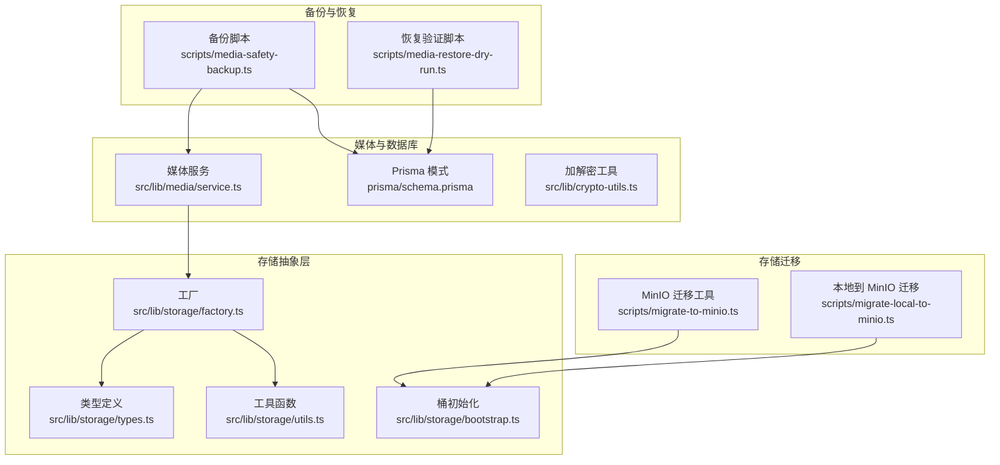
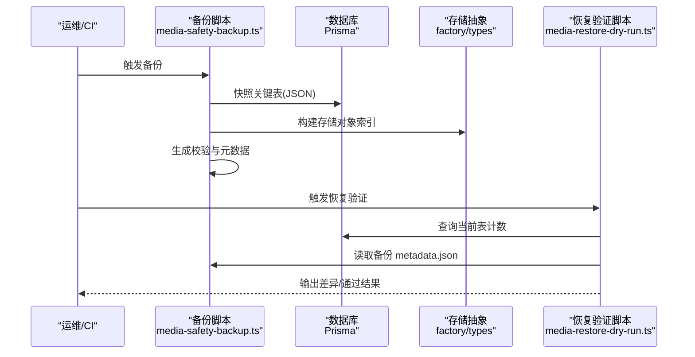
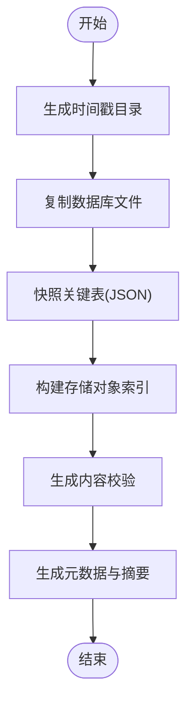
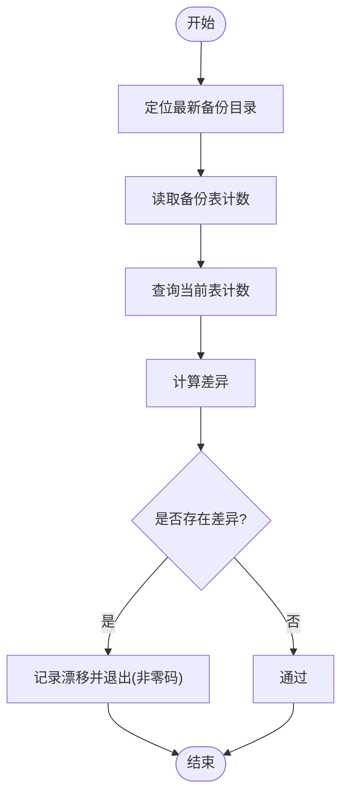
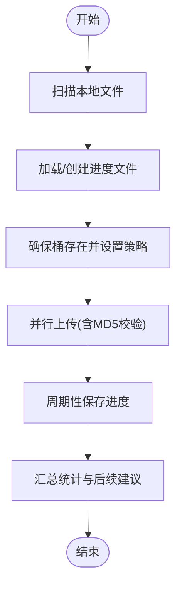
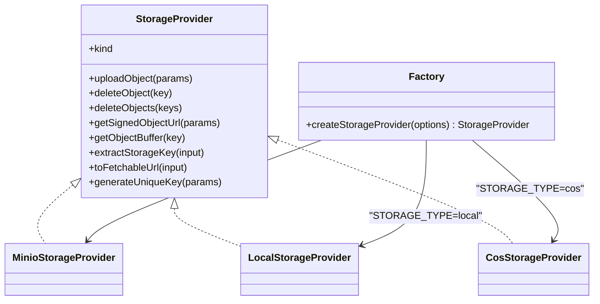
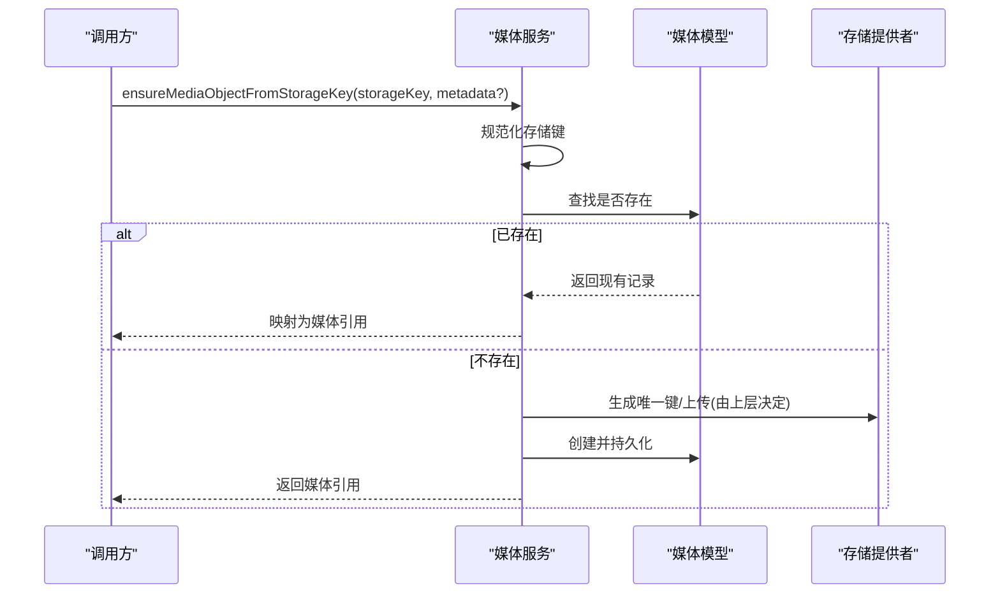
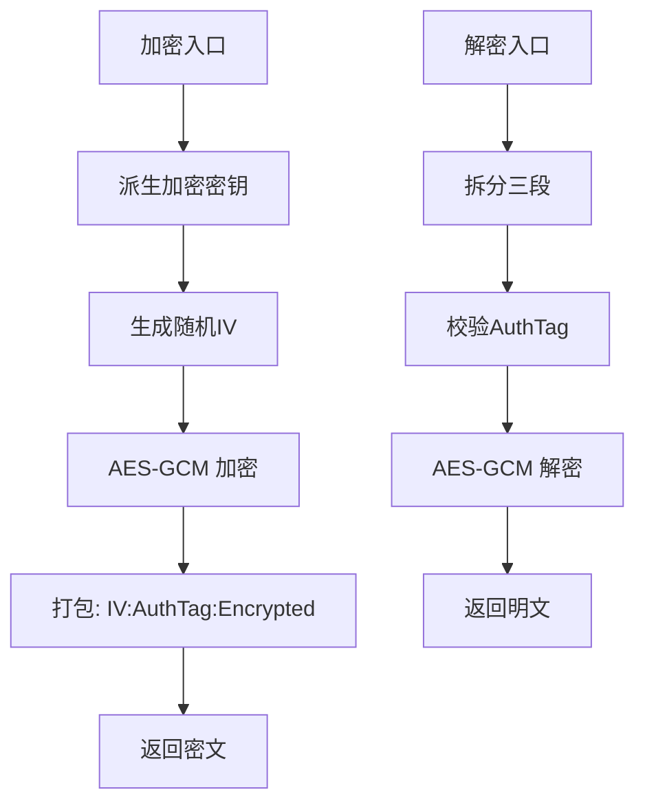
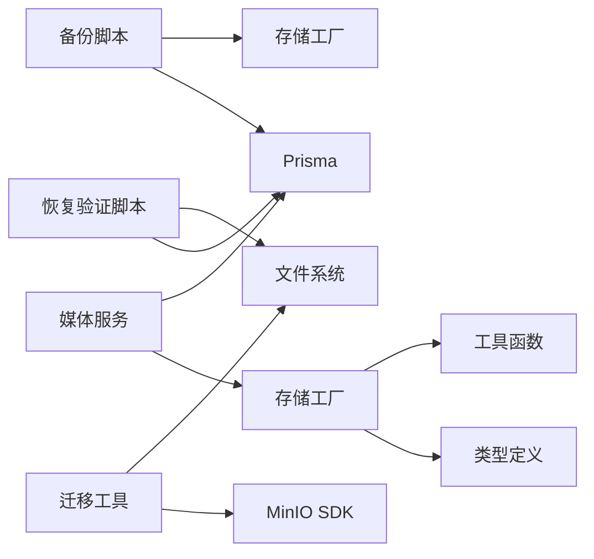

# 备份恢复

<cite>
**本文引用的文件**
- [scripts/media-safety-backup.ts](file://scripts/media-safety-backup.ts)
- [scripts/media-restore-dry-run.ts](file://scripts/media-restore-dry-run.ts)
- [scripts/migrate-to-minio.ts](file://scripts/migrate-to-minio.ts)
- [scripts/migrate-local-to-minio.ts](file://scripts/migrate-local-to-minio.ts)
- [src/lib/storage/factory.ts](file://src/lib/storage/factory.ts)
- [src/lib/storage/types.ts](file://src/lib/storage/types.ts)
- [src/lib/storage/utils.ts](file://src/lib/storage/utils.ts)
- [src/lib/storage/bootstrap.ts](file://src/lib/storage/bootstrap.ts)
- [src/lib/media/service.ts](file://src/lib/media/service.ts)
- [src/lib/crypto-utils.ts](file://src/lib/crypto-utils.ts)
- [prisma/schema.prisma](file://prisma/schema.prisma)
- [README_en.md](file://README_en.md)
</cite>

## 目录
1. [简介](#简介)
2. [项目结构](#项目结构)
3. [核心组件](#核心组件)
4. [架构总览](#架构总览)
5. [详细组件分析](#详细组件分析)
6. [依赖分析](#依赖分析)
7. [性能考虑](#性能考虑)
8. [故障排查指南](#故障排查指南)
9. [结论](#结论)
10. [附录](#附录)

## 简介
本文件面向 Waoowaoo 的备份恢复体系，系统化梳理数据库与媒体文件的备份策略、对象存储备份与迁移、恢复验证与演练、灾难恢复计划、监控告警与安全合规等关键能力。文档以仓库中现有脚本与库模块为基础，结合实际代码路径进行说明，帮助运维与开发团队建立可执行、可验证、可审计的备份恢复流程。

## 项目结构
围绕备份恢复的关键文件分布如下：
- 备份与恢复验证脚本：scripts/media-safety-backup.ts、scripts/media-restore-dry-run.ts
- 存储迁移工具：scripts/migrate-to-minio.ts、scripts/migrate-local-to-minio.ts
- 存储抽象与工厂：src/lib/storage/factory.ts、src/lib/storage/types.ts、src/lib/storage/utils.ts、src/lib/storage/bootstrap.ts
- 媒体对象服务：src/lib/media/service.ts
- 数据库模式：prisma/schema.prisma
- 加解密工具：src/lib/crypto-utils.ts
- 项目说明：README_en.md

**图表来源**
- [scripts/media-safety-backup.ts:1-248](file://scripts/media-safety-backup.ts#L1-L248)
- [scripts/media-restore-dry-run.ts:1-112](file://scripts/media-restore-dry-run.ts#L1-L112)
- [scripts/migrate-to-minio.ts:1-344](file://scripts/migrate-to-minio.ts#L1-L344)
- [scripts/migrate-local-to-minio.ts:1-33](file://scripts/migrate-local-to-minio.ts#L1-L33)
- [src/lib/storage/factory.ts:1-27](file://src/lib/storage/factory.ts#L1-L27)
- [src/lib/storage/types.ts:1-38](file://src/lib/storage/types.ts#L1-L38)
- [src/lib/storage/utils.ts:1-83](file://src/lib/storage/utils.ts#L1-L83)
- [src/lib/storage/bootstrap.ts:1-41](file://src/lib/storage/bootstrap.ts#L1-L41)
- [src/lib/media/service.ts:56-97](file://src/lib/media/service.ts#L56-L97)
- [prisma/schema.prisma:1-800](file://prisma/schema.prisma#L1-L800)
- [src/lib/crypto-utils.ts:40-130](file://src/lib/crypto-utils.ts#L40-L130)

**章节来源**
- [scripts/media-safety-backup.ts:1-248](file://scripts/media-safety-backup.ts#L1-L248)
- [scripts/media-restore-dry-run.ts:1-112](file://scripts/media-restore-dry-run.ts#L1-L112)
- [scripts/migrate-to-minio.ts:1-344](file://scripts/migrate-to-minio.ts#L1-L344)
- [scripts/migrate-local-to-minio.ts:1-33](file://scripts/migrate-local-to-minio.ts#L1-L33)
- [src/lib/storage/factory.ts:1-27](file://src/lib/storage/factory.ts#L1-L27)
- [src/lib/storage/types.ts:1-38](file://src/lib/storage/types.ts#L1-L38)
- [src/lib/storage/utils.ts:1-83](file://src/lib/storage/utils.ts#L1-L83)
- [src/lib/storage/bootstrap.ts:1-41](file://src/lib/storage/bootstrap.ts#L1-L41)
- [src/lib/media/service.ts:56-97](file://src/lib/media/service.ts#L56-L97)
- [prisma/schema.prisma:1-800](file://prisma/schema.prisma#L1-L800)
- [src/lib/crypto-utils.ts:40-130](file://src/lib/crypto-utils.ts#L40-L130)

## 核心组件
- 备份快照与校验
  - 数据库表快照：对关键业务表进行 JSON 快照，记录条目数量，便于恢复前后一致性核对。
  - 存储对象索引：按当前 STORAGE_TYPE 枚举列出对象键、大小、修改时间与哈希，支持本地与对象存储两种模式。
  - 元数据与内容校验：生成 checksums.json 与 metadata.json，包含元数据摘要，保障完整性。
  - 数据库文件备份：解析 DATABASE_URL，复制 SQLite 文件至备份目录，便于文件级备份。
- 恢复验证与演练
  - 最新备份定位：在 data/migration-backups 下按时间戳排序，选择最新有效备份。
  - 表计数比对：读取备份 metadata.json 中的 tableCounts，与当前数据库各表 COUNT 结果对比，输出差异。
  - 干运行模式：仅比对不写入，避免误操作。
- 存储迁移与对象化
  - 工厂模式：根据 STORAGE_TYPE 创建 MinIO/本地/COS 提供者，统一接口。
  - 迁移工具：支持断点续传、MD5 校验、并行上传、策略配置与日志级别。
  - 桶初始化：自动检测/创建 MinIO 桶，必要时设置公开读策略。
- 媒体对象服务
  - 媒体对象映射：从存储键构建媒体引用，包含 URL、MIME、尺寸、时长、哈希等。
  - 存在性与去重：若存储键已存在，直接返回；否则创建并持久化。
- 数据库与加密
  - Prisma 模式：定义了大量与媒体、任务、项目相关的表，是备份快照的目标集合。
  - 加密工具：提供 API Key 的 AEAD 加密/解密，满足敏感配置的安全存储。

**章节来源**
- [scripts/media-safety-backup.ts:153-238](file://scripts/media-safety-backup.ts#L153-L238)
- [scripts/media-restore-dry-run.ts:10-83](file://scripts/media-restore-dry-run.ts#L10-L83)
- [src/lib/storage/factory.ts:15-26](file://src/lib/storage/factory.ts#L15-L26)
- [src/lib/storage/types.ts:23-33](file://src/lib/storage/types.ts#L23-L33)
- [scripts/migrate-to-minio.ts:109-154](file://scripts/migrate-to-minio.ts#L109-L154)
- [src/lib/storage/bootstrap.ts:35-41](file://src/lib/storage/bootstrap.ts#L35-L41)
- [src/lib/media/service.ts:88-97](file://src/lib/media/service.ts#L88-L97)
- [prisma/schema.prisma:103-330](file://prisma/schema.prisma#L103-L330)
- [src/lib/crypto-utils.ts:50-111](file://src/lib/crypto-utils.ts#L50-L111)

## 架构总览
下图展示了备份与恢复的关键交互路径：备份脚本采集数据库与对象存储状态，生成快照与校验；恢复验证脚本通过比对当前数据库与备份元数据，确认一致性；存储迁移工具负责将本地文件迁移到 MinIO 并进行校验。

**图表来源**
- [scripts/media-safety-backup.ts:207-238](file://scripts/media-safety-backup.ts#L207-L238)
- [scripts/media-restore-dry-run.ts:85-102](file://scripts/media-restore-dry-run.ts#L85-L102)
- [src/lib/storage/factory.ts:15-26](file://src/lib/storage/factory.ts#L15-L26)
- [src/lib/storage/types.ts:23-33](file://src/lib/storage/types.ts#L23-L33)

## 详细组件分析

### 备份快照与校验（media-safety-backup.ts）
- 功能要点
  - 生成带时间戳的备份目录 data/migration-backups/<stamp>。
  - 快照指定业务表为 JSON 文件，统计每张表的条目数。
  - 枚举当前 STORAGE_TYPE 对应的对象存储或本地文件，生成对象索引。
  - 复制数据库文件（SQLite）到备份目录，便于文件级备份。
  - 生成 checksums.json 与 metadata.json，包含元数据摘要。
- 关键流程

**图表来源**
- [scripts/media-safety-backup.ts:207-238](file://scripts/media-safety-backup.ts#L207-L238)
- [scripts/media-safety-backup.ts:153-205](file://scripts/media-safety-backup.ts#L153-L205)
- [scripts/media-safety-backup.ts:136-151](file://scripts/media-safety-backup.ts#L136-L151)
- [scripts/media-safety-backup.ts:179-192](file://scripts/media-safety-backup.ts#L179-L192)

**章节来源**
- [scripts/media-safety-backup.ts:1-248](file://scripts/media-safety-backup.ts#L1-L248)

### 恢复验证与演练（media-restore-dry-run.ts）
- 功能要点
  - 在 data/migration-backups 中定位最新有效备份。
  - 读取备份 metadata.json 的 tableCounts。
  - 查询当前数据库各表 COUNT，输出预期 vs 实际 vs 差异。
  - 任何差异即视为漂移，干运行不写入，退出码指示状态。
- 关键流程

**图表来源**
- [scripts/media-restore-dry-run.ts:10-83](file://scripts/media-restore-dry-run.ts#L10-L83)

**章节来源**
- [scripts/media-restore-dry-run.ts:1-112](file://scripts/media-restore-dry-run.ts#L1-L112)

### 存储迁移与对象化（migrate-to-minio.ts 与 migrate-local-to-minio.ts）
- 功能要点
  - 扫描本地目录，递归收集文件，计算本地 MD5，上传至 MinIO。
  - 支持断点续传（进度文件）、并行上传、日志级别控制。
  - 自动创建桶并设置公开读策略（可按需调整）。
  - 上传后进行对象属性校验，记录成功/失败/跳过。
- 关键流程

**图表来源**
- [scripts/migrate-to-minio.ts:66-94](file://scripts/migrate-to-minio.ts#L66-L94)
- [scripts/migrate-to-minio.ts:109-154](file://scripts/migrate-to-minio.ts#L109-L154)
- [scripts/migrate-to-minio.ts:157-195](file://scripts/migrate-to-minio.ts#L157-L195)
- [scripts/migrate-to-minio.ts:226-244](file://scripts/migrate-to-minio.ts#L226-L244)
- [scripts/migrate-to-minio.ts:247-337](file://scripts/migrate-to-minio.ts#L247-L337)

**章节来源**
- [scripts/migrate-to-minio.ts:1-344](file://scripts/migrate-to-minio.ts#L1-L344)
- [scripts/migrate-local-to-minio.ts:1-33](file://scripts/migrate-local-to-minio.ts#L1-L33)

### 存储抽象与工厂（factory/types/utils/bootstrap）
- 功能要点
  - 工厂根据 STORAGE_TYPE 返回 MinIO/本地/COS 提供者实例。
  - 类型定义统一上传/删除/签名 URL/生成唯一键等接口。
  - 工具函数提供重试、流转 Buffer、环境变量校验、URL 归一化等通用能力。
  - MinIO 桶初始化：识别缺失桶错误并创建，必要时设置公开读策略。
- 关键类图

**图表来源**
- [src/lib/storage/types.ts:23-33](file://src/lib/storage/types.ts#L23-L33)
- [src/lib/storage/factory.ts:15-26](file://src/lib/storage/factory.ts#L15-L26)
- [src/lib/storage/bootstrap.ts:35-41](file://src/lib/storage/bootstrap.ts#L35-L41)

**章节来源**
- [src/lib/storage/factory.ts:1-27](file://src/lib/storage/factory.ts#L1-L27)
- [src/lib/storage/types.ts:1-38](file://src/lib/storage/types.ts#L1-L38)
- [src/lib/storage/utils.ts:1-83](file://src/lib/storage/utils.ts#L1-L83)
- [src/lib/storage/bootstrap.ts:1-41](file://src/lib/storage/bootstrap.ts#L1-L41)

### 媒体对象服务（media/service.ts）
- 功能要点
  - 将存储键规范化为媒体引用，包含 URL、MIME、尺寸、时长、哈希等。
  - 若存储键已存在则直接返回，否则创建并持久化。
- 关键流程

**图表来源**
- [src/lib/media/service.ts:88-97](file://src/lib/media/service.ts#L88-L97)

**章节来源**
- [src/lib/media/service.ts:56-97](file://src/lib/media/service.ts#L56-L97)

### 数据库与模式（prisma/schema.prisma）
- 功能要点
  - 定义了与小说推广、角色、场景、剪辑、面板、音频、任务、事件等相关的表。
  - 备份快照针对这些表进行 JSON 快照，恢复验证基于这些表的计数进行核对。
- 关键表（示例）
  - novel_promotion_projects、novel_promotion_episodes、novel_promotion_panels、novel_promotion_voice_lines
  - global_characters、global_character_appearances、global_locations、global_location_images、global_voices
  - tasks、task_events
  - projects

**章节来源**
- [prisma/schema.prisma:103-330](file://prisma/schema.prisma#L103-L330)

### 加密工具（crypto-utils.ts）
- 功能要点
  - 提供 API Key 的 AEAD 加密/解密，格式为 iv:authTag:encrypted（十六进制）。
  - 支持批量加密对象，便于安全存储敏感配置。
- 关键流程

**图表来源**
- [src/lib/crypto-utils.ts:50-111](file://src/lib/crypto-utils.ts#L50-L111)

**章节来源**
- [src/lib/crypto-utils.ts:40-130](file://src/lib/crypto-utils.ts#L40-L130)

## 依赖分析
- 组件耦合
  - 备份脚本依赖 Prisma 连接与存储抽象工厂；恢复验证脚本依赖 Prisma 与文件系统。
  - 迁移工具依赖 MinIO SDK 与文件系统；工厂与工具函数提供横切能力。
- 外部依赖
  - 对象存储：COS（腾讯云）、MinIO（AWS S3 兼容）、本地文件系统。
  - 数据库：MySQL（Prisma 配置），SQLite 文件备份由脚本直接处理。
- 潜在循环依赖
  - 当前模块间为单向依赖，未见循环导入。

**图表来源**
- [scripts/media-safety-backup.ts:1-6](file://scripts/media-safety-backup.ts#L1-L6)
- [scripts/media-restore-dry-run.ts:1-4](file://scripts/media-restore-dry-run.ts#L1-L4)
- [scripts/migrate-to-minio.ts:13-17](file://scripts/migrate-to-minio.ts#L13-L17)
- [src/lib/storage/factory.ts:1-5](file://src/lib/storage/factory.ts#L1-L5)
- [src/lib/storage/types.ts:1-38](file://src/lib/storage/types.ts#L1-L38)
- [src/lib/storage/utils.ts:1-83](file://src/lib/storage/utils.ts#L1-L83)
- [src/lib/media/service.ts:1-10](file://src/lib/media/service.ts#L1-L10)

**章节来源**
- [scripts/media-safety-backup.ts:1-6](file://scripts/media-safety-backup.ts#L1-L6)
- [scripts/media-restore-dry-run.ts:1-4](file://scripts/media-restore-dry-run.ts#L1-L4)
- [scripts/migrate-to-minio.ts:13-17](file://scripts/migrate-to-minio.ts#L13-L17)
- [src/lib/storage/factory.ts:1-5](file://src/lib/storage/factory.ts#L1-L5)
- [src/lib/storage/types.ts:1-38](file://src/lib/storage/types.ts#L1-L38)
- [src/lib/storage/utils.ts:1-83](file://src/lib/storage/utils.ts#L1-L83)
- [src/lib/media/service.ts:1-10](file://src/lib/media/service.ts#L1-L10)

## 性能考虑
- 备份与恢复
  - 备份快照采用一次性导出 JSON，适合中小规模数据；大表建议分批或离线导出。
  - 恢复验证仅做计数比对，开销低；如需更严格校验，可在 CI 中增加逐行哈希比对。
- 存储迁移
  - 并行上传与断点续传显著提升迁移效率；合理设置并发度与日志级别平衡吞吐与可观测性。
  - 上传后校验对象属性，确保一致性；可扩展为对象级校验（ETag/MD5）。
- 存储抽象
  - 工具函数提供指数退避重试，增强网络抖动下的稳定性。

[本节为通用建议，无需特定文件来源]

## 故障排查指南
- 备份失败
  - 检查 DATABASE_URL 是否指向 SQLite 文件，且文件存在可读。
  - 确认 STORAGE_TYPE 与对象存储环境变量配置正确。
  - 查看备份目录权限与磁盘空间。
- 恢复验证失败
  - 使用 dry-run 模式先比对差异，定位具体表与差异方向。
  - 若差异为负，可能为数据清理或归档；若为正，检查是否有新增数据未同步。
- 迁移失败
  - 检查 MinIO 端点、凭据与桶权限；确认网络连通性。
  - 查看进度文件是否被意外删除导致重复迁移。
  - 降低并发度或启用干运行模式排查问题对象。
- 存储初始化
  - 若出现“桶不存在”错误，确认桶名称与区域配置；必要时手动创建并重试。

**章节来源**
- [scripts/media-safety-backup.ts:194-205](file://scripts/media-safety-backup.ts#L194-L205)
- [scripts/media-restore-dry-run.ts:85-102](file://scripts/media-restore-dry-run.ts#L85-L102)
- [scripts/migrate-to-minio.ts:131-154](file://scripts/migrate-to-minio.ts#L131-L154)
- [src/lib/storage/bootstrap.ts:19-33](file://src/lib/storage/bootstrap.ts#L19-L33)

## 结论
Waoowaoo 的备份恢复体系以“快照+校验+验证”的闭环为核心，覆盖数据库与媒体对象两大维度。通过统一的存储抽象与工厂模式，系统支持多存储后端；迁移工具提供高效、可靠的文件迁移能力。建议在生产环境中结合 CI/CD 周期性执行备份与恢复验证，并完善监控告警与合规审计流程，持续提升可用性与安全性。

[本节为总结，无需特定文件来源]

## 附录

### 备份策略与配置建议
- 全量备份
  - 周期性触发备份脚本，保留 metadata.json 与各表 JSON 快照及对象索引。
  - 同步复制数据库文件到异地存储，作为文件级备份。
- 增量备份
  - 当前脚本未内置增量逻辑；可通过外部工具（如数据库自带增量日志/快照）补充。
- 时间点恢复（PoR）
  - 当前脚本未提供时间点恢复能力；建议结合数据库备份与对象存储版本控制实现。
- 媒体文件备份
  - 对象存储：定期遍历并生成对象索引，配合校验文件保障一致性。
  - 本地归档：迁移完成后，按策略清理本地文件，保留最小冗余。
  - 跨区域复制：在对象存储层面开启跨区域复制，确保地理冗余。
- 验证与演练
  - 在 CI 中执行恢复验证脚本，确保备份可恢复。
  - 定期进行“干运行”演练，模拟恢复流程。
- 灾难恢复计划
  - 设定 RTO/RPO 目标：例如 RPO=1d，RTO=4h。
  - 恢复优先级：任务/项目数据 > 媒体资产 > 用户偏好。
  - 切换流程：切换 STORAGE_TYPE 至目标后端，验证访问与渲染。
- 监控与告警
  - 监控项：备份成功率、备份耗时、对象索引数量、迁移进度、存储空间使用率。
  - 告警阈值：连续失败、耗时异常、对象数量骤降、存储空间低于阈值。
- 安全与合规
  - 敏感配置加密存储：使用加密工具对 API Key 等进行 AEAD 加密。
  - 访问控制：限制对象存储访问策略，遵循最小权限原则。
  - 审计日志：记录备份/恢复/迁移关键事件，保留审计轨迹。

[本节为通用建议，无需特定文件来源]