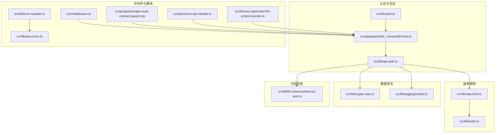
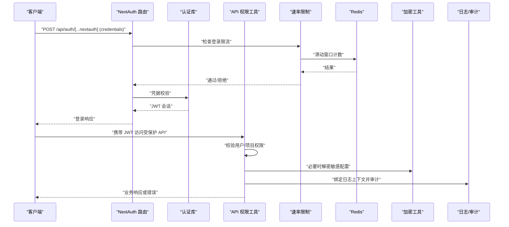
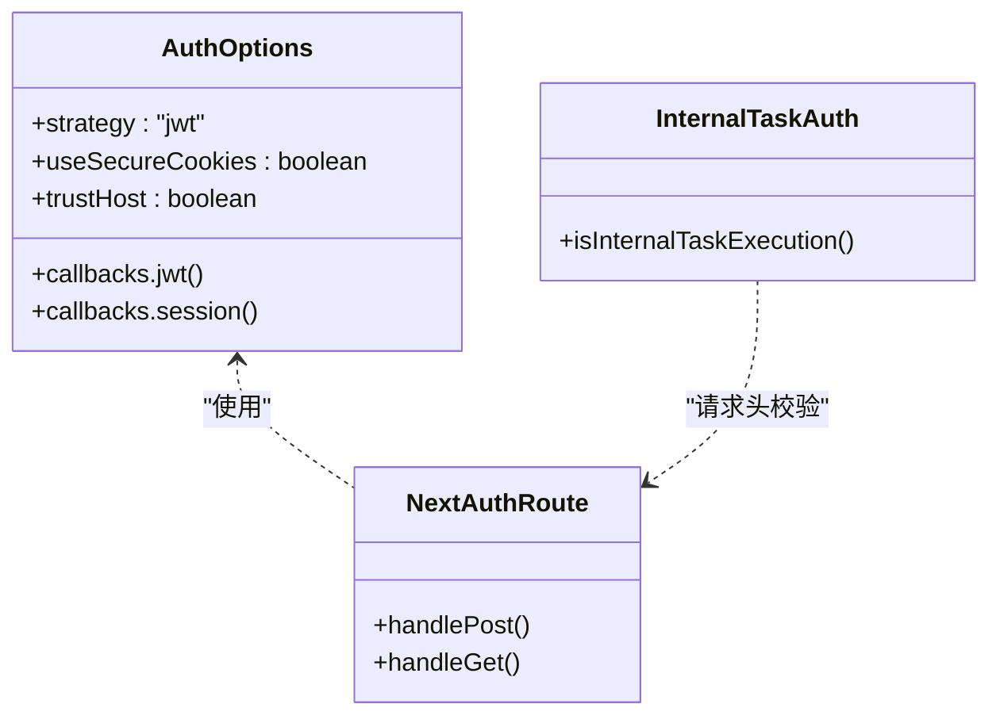
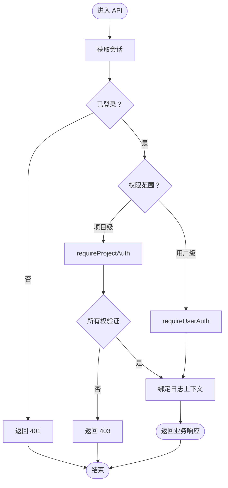
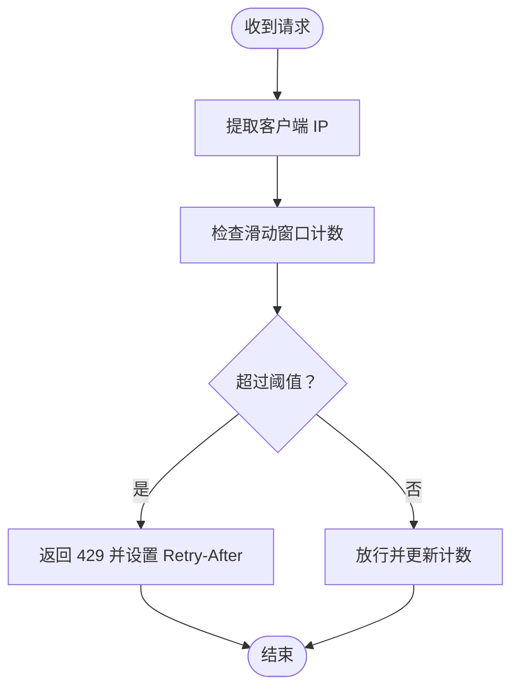
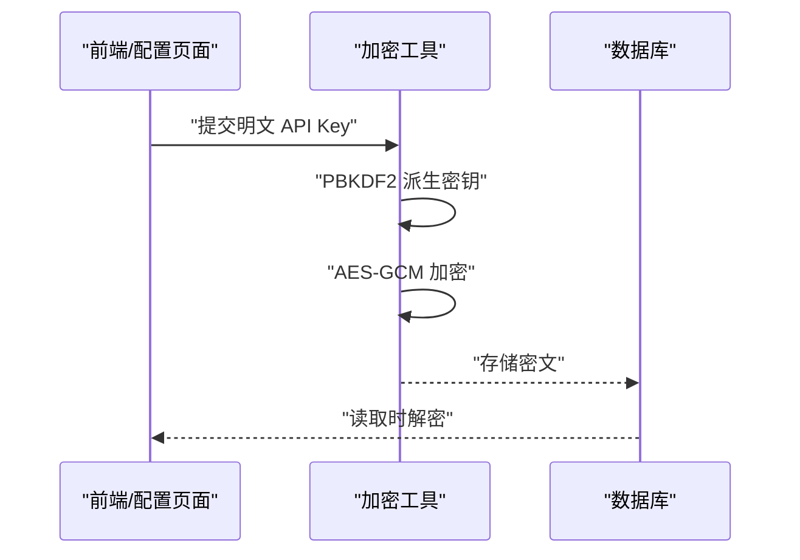
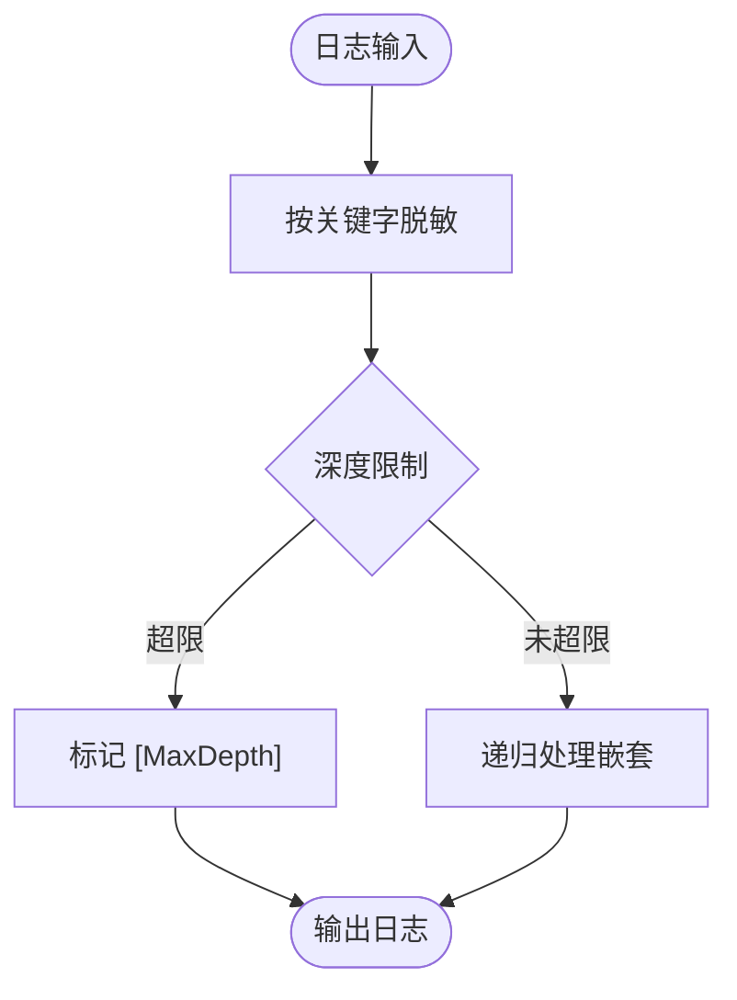
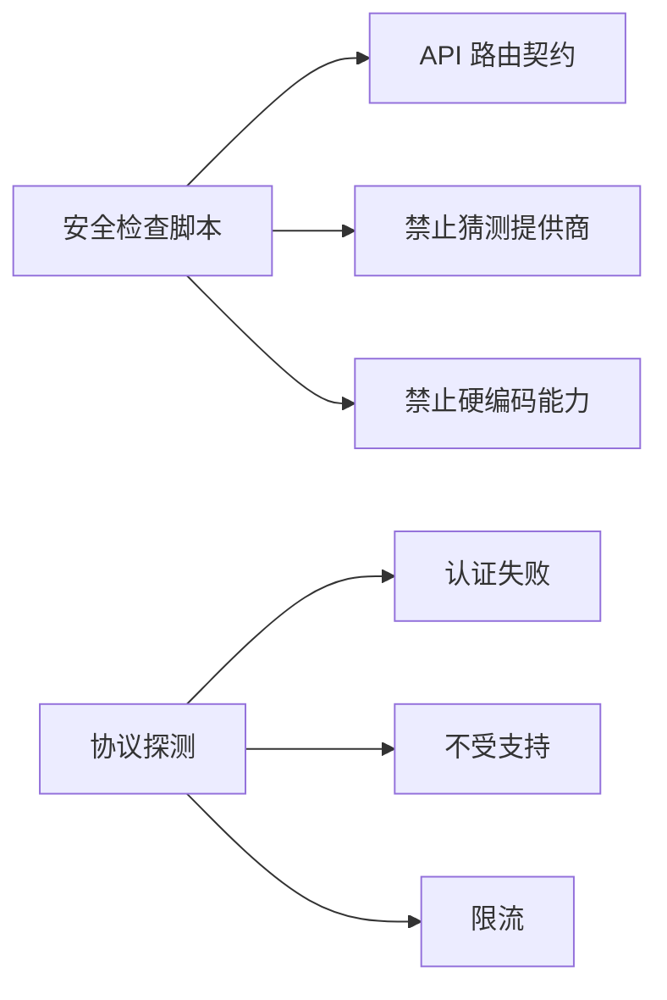
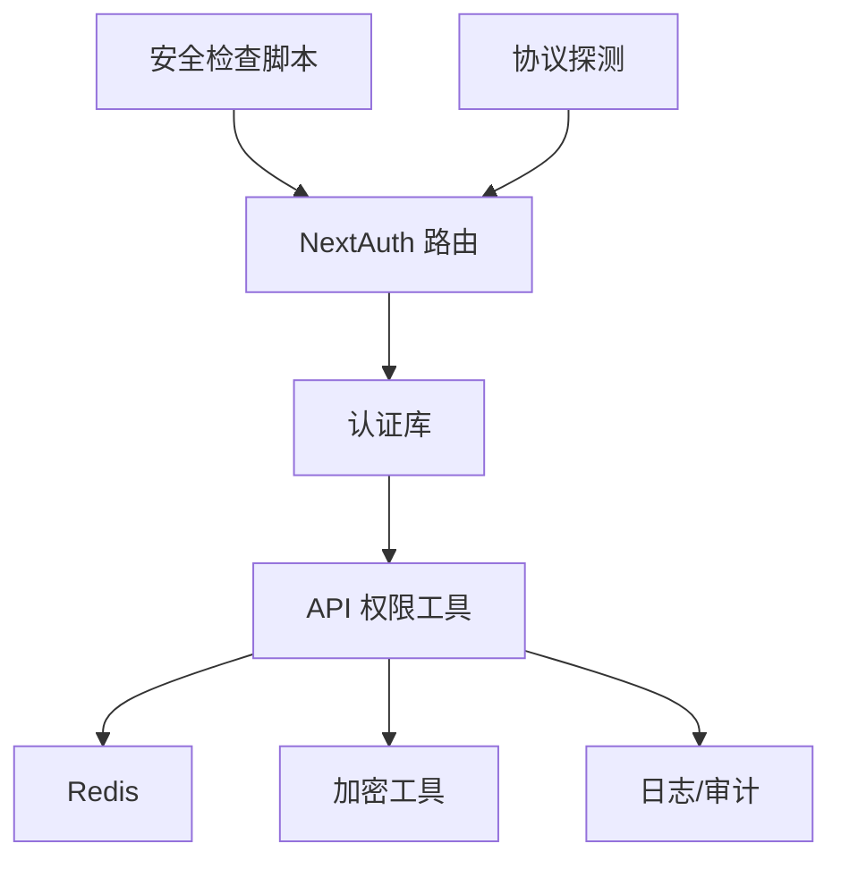

# 安全加固

<cite>
**本文引用的文件**
- [src/lib/auth.ts](file://src/lib/auth.ts)
- [src/app/api/auth/[...nextauth]/route.ts](file://src/app/api/auth/[...nextauth]/route.ts)
- [src/lib/api-auth.ts](file://src/lib/api-auth.ts)
- [src/lib/rate-limit.ts](file://src/lib/rate-limit.ts)
- [src/lib/redis.ts](file://src/lib/redis.ts)
- [src/lib/crypto-utils.ts](file://src/lib/crypto-utils.ts)
- [src/lib/logging/redact.ts](file://src/lib/logging/redact.ts)
- [src/lib/llm-observe/internal-task.ts](file://src/lib/llm-observe/internal-task.ts)
- [src/middleware.ts](file://src/middleware.ts)
- [package.json](file://package.json)
- [scripts/guards/api-route-contract-guard.mjs](file://scripts/guards/api-route-contract-guard.mjs)
- [scripts/check-api-handler.ts](file://scripts/check-api-handler.ts)
- [src/lib/user-api/model-llm-protocol-probe.ts](file://src/lib/user-api/model-llm-protocol-probe.ts)
- [src/lib/error-handler.ts](file://src/lib/error-handler.ts)
- [src/lib/api-errors.ts](file://src/lib/api-errors.ts)
</cite>

## 目录
1. [简介](#简介)
2. [项目结构](#项目结构)
3. [核心组件](#核心组件)
4. [架构总览](#架构总览)
5. [详细组件分析](#详细组件分析)
6. [依赖关系分析](#依赖关系分析)
7. [性能考量](#性能考量)
8. [故障排查指南](#故障排查指南)
9. [结论](#结论)
10. [附录](#附录)

## 简介
本文件面向 Waoowaoo 的安全加固目标，系统化梳理并说明应用在以下方面的安全配置与实现现状：
- 应用安全配置：CORS 策略、CSRF 防护、XSS 防护
- 身份认证与授权：JWT 令牌管理、会话安全、权限控制策略
- API 安全防护：请求签名验证、速率限制、IP 白名单
- 数据安全保护：敏感数据加密、传输安全、存储安全
- 漏洞扫描与安全审计：静态代码分析、依赖包安全检查
- 安全事件响应：入侵检测与日志审计配置
- 合规性与最佳实践：执行标准与落地规范

本文件以仓库现有实现为基础进行归纳总结，并给出可视化图示与可操作的改进建议。

## 项目结构
围绕安全主题，关键目录与文件分布如下：
- 认证与会话：src/lib/auth.ts、src/app/api/auth/[...nextauth]/route.ts、src/lib/api-auth.ts
- 速率限制与限流：src/lib/rate-limit.ts、src/lib/redis.ts
- 数据加密与脱敏：src/lib/crypto-utils.ts、src/lib/logging/redact.ts
- 内部任务鉴权：src/lib/llm-observe/internal-task.ts
- 中间件与国际化：src/middleware.ts
- 安全检查脚本：scripts/guards/*、scripts/check-api-handler.ts
- API 错误处理与审计：src/lib/error-handler.ts、src/lib/api-errors.ts
- 依赖与脚本：package.json

**图表来源**
- [src/lib/auth.ts:1-79](file://src/lib/auth.ts#L1-L79)
- [src/app/api/auth/[...nextauth]/route.ts:1-50](file://src/app/api/auth/[...nextauth]/route.ts#L1-L50)
- [src/lib/api-auth.ts:1-355](file://src/lib/api-auth.ts#L1-L355)
- [src/lib/rate-limit.ts:1-146](file://src/lib/rate-limit.ts#L1-L146)
- [src/lib/redis.ts:1-76](file://src/lib/redis.ts#L1-L76)
- [src/lib/crypto-utils.ts:1-195](file://src/lib/crypto-utils.ts#L1-L195)
- [src/lib/logging/redact.ts:1-36](file://src/lib/logging/redact.ts#L1-L36)
- [src/lib/llm-observe/internal-task.ts:1-18](file://src/lib/llm-observe/internal-task.ts#L1-L18)
- [src/middleware.ts:1-28](file://src/middleware.ts#L1-L28)
- [scripts/guards/api-route-contract-guard.mjs:1-116](file://scripts/guards/api-route-contract-guard.mjs#L1-L116)
- [scripts/check-api-handler.ts:1-38](file://scripts/check-api-handler.ts#L1-L38)
- [src/lib/user-api/model-llm-protocol-probe.ts:99-153](file://src/lib/user-api/model-llm-protocol-probe.ts#L99-L153)
- [src/lib/error-handler.ts:52-97](file://src/lib/error-handler.ts#L52-L97)
- [src/lib/api-errors.ts:477-501](file://src/lib/api-errors.ts#L477-L501)

**章节来源**
- [src/lib/auth.ts:1-79](file://src/lib/auth.ts#L1-L79)
- [src/app/api/auth/[...nextauth]/route.ts:1-50](file://src/app/api/auth/[...nextauth]/route.ts#L1-L50)
- [src/lib/api-auth.ts:1-355](file://src/lib/api-auth.ts#L1-L355)
- [src/lib/rate-limit.ts:1-146](file://src/lib/rate-limit.ts#L1-L146)
- [src/lib/redis.ts:1-76](file://src/lib/redis.ts#L1-L76)
- [src/lib/crypto-utils.ts:1-195](file://src/lib/crypto-utils.ts#L1-L195)
- [src/lib/logging/redact.ts:1-36](file://src/lib/logging/redact.ts#L1-L36)
- [src/lib/llm-observe/internal-task.ts:1-18](file://src/lib/llm-observe/internal-task.ts#L1-L18)
- [src/middleware.ts:1-28](file://src/middleware.ts#L1-L28)
- [scripts/guards/api-route-contract-guard.mjs:1-116](file://scripts/guards/api-route-contract-guard.mjs#L1-L116)
- [scripts/check-api-handler.ts:1-38](file://scripts/check-api-handler.ts#L1-L38)
- [src/lib/user-api/model-llm-protocol-probe.ts:99-153](file://src/lib/user-api/model-llm-protocol-probe.ts#L99-L153)
- [src/lib/error-handler.ts:52-97](file://src/lib/error-handler.ts#L52-L97)
- [src/lib/api-errors.ts:477-501](file://src/lib/api-errors.ts#L477-L501)

## 核心组件
- 认证与会话：基于 NextAuth 的凭据认证，使用 JWT 策略；登录接口具备 IP 限流；支持内部任务令牌校验。
- 权限控制：统一的 API 权限工具，提供用户级与项目级权限校验，结合日志上下文绑定。
- 速率限制：基于 Redis 的滑动窗口实现，针对登录/注册等敏感接口进行限流。
- 数据安全：API Key 加密存储（AES-256-GCM），日志脱敏；传输安全依赖 HTTPS。
- 安全审计：统一错误处理与审计事件记录，支持用户操作审计。
- 合规检查：多类脚本保障 API 路由契约、防止硬编码能力常量、模型提供商猜测等。

**章节来源**
- [src/lib/auth.ts:1-79](file://src/lib/auth.ts#L1-L79)
- [src/app/api/auth/[...nextauth]/route.ts:1-50](file://src/app/api/auth/[...nextauth]/route.ts#L1-L50)
- [src/lib/api-auth.ts:1-355](file://src/lib/api-auth.ts#L1-L355)
- [src/lib/rate-limit.ts:1-146](file://src/lib/rate-limit.ts#L1-L146)
- [src/lib/crypto-utils.ts:1-195](file://src/lib/crypto-utils.ts#L1-L195)
- [src/lib/logging/redact.ts:1-36](file://src/lib/logging/redact.ts#L1-L36)
- [src/lib/error-handler.ts:52-97](file://src/lib/error-handler.ts#L52-L97)
- [src/lib/api-errors.ts:477-501](file://src/lib/api-errors.ts#L477-L501)

## 架构总览
下图展示安全相关模块之间的交互关系与数据流向：

**图表来源**
- [src/app/api/auth/[...nextauth]/route.ts:19-44](file://src/app/api/auth/[...nextauth]/route.ts#L19-L44)
- [src/lib/rate-limit.ts:58-118](file://src/lib/rate-limit.ts#L58-L118)
- [src/lib/redis.ts:41-66](file://src/lib/redis.ts#L41-L66)
- [src/lib/auth.ts:22-54](file://src/lib/auth.ts#L22-L54)
- [src/lib/api-auth.ts:173-191](file://src/lib/api-auth.ts#L173-L191)
- [src/lib/crypto-utils.ts:85-111](file://src/lib/crypto-utils.ts#L85-L111)
- [src/lib/api-errors.ts:487-501](file://src/lib/api-errors.ts#L487-L501)

## 详细组件分析

### 认证与会话（JWT、会话安全、内部任务令牌）
- NextAuth 配置采用 JWT 策略，支持凭据登录；根据协议自动判断 Cookie 是否使用 Secure 标志，避免局域网场景下的 Cookie 设置问题。
- 登录路由对 credentials 回调进行 IP 限流，确保登录接口抗暴力破解。
- 内部任务通过请求头注入用户 ID 与令牌进行鉴权，生产环境要求令牌一致，开发环境允许宽松模式。

**图表来源**
- [src/lib/auth.ts:8-79](file://src/lib/auth.ts#L8-L79)
- [src/app/api/auth/[...nextauth]/route.ts:19-44](file://src/app/api/auth/[...nextauth]/route.ts#L19-L44)
- [src/lib/llm-observe/internal-task.ts:7-18](file://src/lib/llm-observe/internal-task.ts#L7-L18)

**章节来源**
- [src/lib/auth.ts:1-79](file://src/lib/auth.ts#L1-L79)
- [src/app/api/auth/[...nextauth]/route.ts:1-50](file://src/app/api/auth/[...nextauth]/route.ts#L1-L50)
- [src/lib/llm-observe/internal-task.ts:1-18](file://src/lib/llm-observe/internal-task.ts#L1-L18)

### 权限控制与授权（项目级、用户级、错误响应）
- 统一的权限工具提供三类校验：
  - requireAuth：用户登录校验
  - requireUserAuth：用户级 API（如资产库）
  - requireProjectAuth：项目级 API，含所有权与关联数据检查
- 错误响应统一构建，便于前端与审计系统一致处理。
- 日志上下文绑定用户与项目信息，便于审计追踪。

**图表来源**
- [src/lib/api-auth.ts:184-191](file://src/lib/api-auth.ts#L184-L191)
- [src/lib/api-auth.ts:306-313](file://src/lib/api-auth.ts#L306-L313)
- [src/lib/api-auth.ts:214-292](file://src/lib/api-auth.ts#L214-L292)

**章节来源**
- [src/lib/api-auth.ts:1-355](file://src/lib/api-auth.ts#L1-L355)

### 速率限制与 IP 白名单
- 基于 Redis 的滑动窗口实现，支持登录与注册的阈值控制，失败时返回 Retry-After。
- 客户端 IP 从常见代理头提取，回退至本地地址，保证准确性。
- IP 白名单未在现有代码中直接体现，建议在网关或反向代理层实现。

**图表来源**
- [src/lib/rate-limit.ts:58-118](file://src/lib/rate-limit.ts#L58-L118)
- [src/lib/rate-limit.ts:128-145](file://src/lib/rate-limit.ts#L128-L145)
- [src/lib/redis.ts:41-66](file://src/lib/redis.ts#L41-L66)

**章节来源**
- [src/lib/rate-limit.ts:1-146](file://src/lib/rate-limit.ts#L1-L146)
- [src/lib/redis.ts:1-76](file://src/lib/redis.ts#L1-L76)

### 数据安全保护（敏感数据加密、传输安全、存储安全）
- API Key 加密：使用 AES-256-GCM，PBKDF2 派生密钥，存储为 iv:authTag:encrypted 格式。
- 批量加密/解密：遍历对象中包含 key/secret 的字段进行处理。
- 存储安全：建议数据库连接启用 TLS，敏感字段在数据库中加密存储。
- 传输安全：NextAuth 根据协议自动选择是否使用 Secure Cookie；建议强制 HTTPS。

**图表来源**
- [src/lib/crypto-utils.ts:27-38](file://src/lib/crypto-utils.ts#L27-L38)
- [src/lib/crypto-utils.ts:50-73](file://src/lib/crypto-utils.ts#L50-L73)
- [src/lib/crypto-utils.ts:85-111](file://src/lib/crypto-utils.ts#L85-L111)

**章节来源**
- [src/lib/crypto-utils.ts:1-195](file://src/lib/crypto-utils.ts#L1-L195)

### 日志脱敏与审计
- 日志脱敏：按键名包含关键字进行脱敏，避免敏感信息泄露。
- 审计事件：统一错误处理与审计事件记录，支持用户操作审计。

**图表来源**
- [src/lib/logging/redact.ts:14-35](file://src/lib/logging/redact.ts#L14-L35)
- [src/lib/error-handler.ts:60-97](file://src/lib/error-handler.ts#L60-L97)
- [src/lib/api-errors.ts:487-501](file://src/lib/api-errors.ts#L487-L501)

**章节来源**
- [src/lib/logging/redact.ts:1-36](file://src/lib/logging/redact.ts#L1-L36)
- [src/lib/error-handler.ts:52-97](file://src/lib/error-handler.ts#L52-L97)
- [src/lib/api-errors.ts:477-501](file://src/lib/api-errors.ts#L477-L501)

### API 安全防护（请求签名验证、速率限制、IP 白名单）
- 速率限制：已在登录接口生效，建议扩展到注册与高风险接口。
- 请求签名验证：未在现有代码中发现通用签名验证实现，建议引入 HMAC 签名或时间戳校验。
- IP 白名单：未在代码中体现，建议在网关或反向代理层实现。

**章节来源**
- [src/lib/rate-limit.ts:1-146](file://src/lib/rate-limit.ts#L1-L146)
- [src/app/api/auth/[...nextauth]/route.ts:19-44](file://src/app/api/auth/[...nextauth]/route.ts#L19-L44)

### 漏洞扫描与安全审计
- 静态检查：通过脚本保障 API 路由契约、防止硬编码能力常量、模型提供商猜测等。
- 依赖安全：建议集成依赖扫描工具（如 npm audit、Snyk、OSV）定期扫描。
- 协议探测：对第三方 LLM 接口进行探测，区分认证失败、不受支持、限流等情况。

**图表来源**
- [scripts/guards/api-route-contract-guard.mjs:11-24](file://scripts/guards/api-route-contract-guard.mjs#L11-L24)
- [scripts/guards/api-route-contract-guard.mjs:105-112](file://scripts/guards/api-route-contract-guard.mjs#L105-L112)
- [scripts/check-api-handler.ts:4-8](file://scripts/check-api-handler.ts#L4-L8)
- [src/lib/user-api/model-llm-protocol-probe.ts:99-153](file://src/lib/user-api/model-llm-protocol-probe.ts#L99-L153)

**章节来源**
- [scripts/guards/api-route-contract-guard.mjs:1-116](file://scripts/guards/api-route-contract-guard.mjs#L1-L116)
- [scripts/check-api-handler.ts:1-38](file://scripts/check-api-handler.ts#L1-L38)
- [src/lib/user-api/model-llm-protocol-probe.ts:99-153](file://src/lib/user-api/model-llm-protocol-probe.ts#L99-L153)

### 安全事件响应与入侵检测
- 统一错误处理：标准化错误响应，便于前端与监控系统识别。
- 审计事件：在 API 结束阶段记录用户操作审计事件，包含方法、路径、状态与耗时。
- 建议：接入集中式日志与告警系统，对 4xx/5xx 异常、频繁限流、异常状态码进行告警。

**章节来源**
- [src/lib/error-handler.ts:52-97](file://src/lib/error-handler.ts#L52-L97)
- [src/lib/api-errors.ts:477-501](file://src/lib/api-errors.ts#L477-L501)

## 依赖关系分析
- 认证链路：NextAuth 路由 -> 认证库 -> API 权限工具 -> Redis（限流）。
- 数据链路：加密工具 -> 数据库；日志脱敏 -> 审计系统。
- 检查链路：安全脚本 -> API 路由 -> 协议探测。

**图表来源**
- [src/app/api/auth/[...nextauth]/route.ts:19-44](file://src/app/api/auth/[...nextauth]/route.ts#L19-L44)
- [src/lib/auth.ts:22-54](file://src/lib/auth.ts#L22-L54)
- [src/lib/api-auth.ts:173-191](file://src/lib/api-auth.ts#L173-L191)
- [src/lib/rate-limit.ts:58-118](file://src/lib/rate-limit.ts#L58-L118)
- [src/lib/crypto-utils.ts:50-73](file://src/lib/crypto-utils.ts#L50-L73)
- [src/lib/api-errors.ts:487-501](file://src/lib/api-errors.ts#L487-L501)
- [scripts/guards/api-route-contract-guard.mjs:105-112](file://scripts/guards/api-route-contract-guard.mjs#L105-L112)
- [src/lib/user-api/model-llm-protocol-probe.ts:99-153](file://src/lib/user-api/model-llm-protocol-probe.ts#L99-L153)

**章节来源**
- [src/lib/auth.ts:1-79](file://src/lib/auth.ts#L1-L79)
- [src/lib/api-auth.ts:1-355](file://src/lib/api-auth.ts#L1-L355)
- [src/lib/rate-limit.ts:1-146](file://src/lib/rate-limit.ts#L1-L146)
- [src/lib/crypto-utils.ts:1-195](file://src/lib/crypto-utils.ts#L1-L195)
- [src/lib/api-errors.ts:477-501](file://src/lib/api-errors.ts#L477-L501)
- [scripts/guards/api-route-contract-guard.mjs:1-116](file://scripts/guards/api-route-contract-guard.mjs#L1-L116)
- [src/lib/user-api/model-llm-protocol-probe.ts:99-153](file://src/lib/user-api/model-llm-protocol-probe.ts#L99-L153)

## 性能考量
- Redis 连接池与重试策略：合理配置最大重试与指数退避，避免瞬时故障放大。
- 限流算法：滑动窗口在高并发下具备更平滑的节流效果，但需注意 Redis 命令开销。
- 加密成本：PBKDF2 迭代次数与 AES-GCM 计算开销需平衡安全性与性能。

[本节为通用指导，无需特定文件引用]

## 故障排查指南
- 登录被限流：检查 Redis 连接与键空间；确认客户端 IP 提取是否正确。
- 会话异常：确认 NEXTAUTH_URL 协议与 Cookie Secure 标志；核对 JWT 回调逻辑。
- 权限错误：确认请求头中的内部任务令牌与用户 ID；检查项目归属与关联数据是否存在。
- 日志脱敏：确认脱敏关键字列表与深度限制；避免过度脱敏导致调试困难。
- 审计缺失：确认审计事件触发条件与日志级别；检查统一错误处理是否被绕过。

**章节来源**
- [src/lib/rate-limit.ts:128-145](file://src/lib/rate-limit.ts#L128-L145)
- [src/lib/redis.ts:29-32](file://src/lib/redis.ts#L29-L32)
- [src/lib/auth.ts:10-14](file://src/lib/auth.ts#L10-L14)
- [src/lib/api-auth.ts:37-57](file://src/lib/api-auth.ts#L37-L57)
- [src/lib/logging/redact.ts:14-35](file://src/lib/logging/redact.ts#L14-L35)
- [src/lib/error-handler.ts:60-97](file://src/lib/error-handler.ts#L60-L97)

## 结论
Waoowaoo 在安全方面已具备较为完善的基础设施：
- 认证与会话：JWT 会话、登录限流、内部任务令牌校验。
- 权限控制：统一的 API 权限工具与日志上下文绑定。
- 数据安全：API Key 加密与日志脱敏。
- 安全审计：统一错误处理与审计事件记录。
- 合规检查：多类脚本保障路由契约与配置安全。

建议进一步完善的方向：
- 引入请求签名验证与 IP 白名单策略。
- 扩展速率限制覆盖范围，增强对注册与高风险接口的保护。
- 强化传输安全（强制 HTTPS）与数据库 TLS。
- 增加依赖安全扫描与集中式日志告警体系。

[本节为总结性内容，无需特定文件引用]

## 附录
- 依赖与脚本清单：见 package.json 中 scripts 字段，涵盖安全检查、测试与构建脚本。

**章节来源**
- [package.json:9-111](file://package.json#L9-L111)