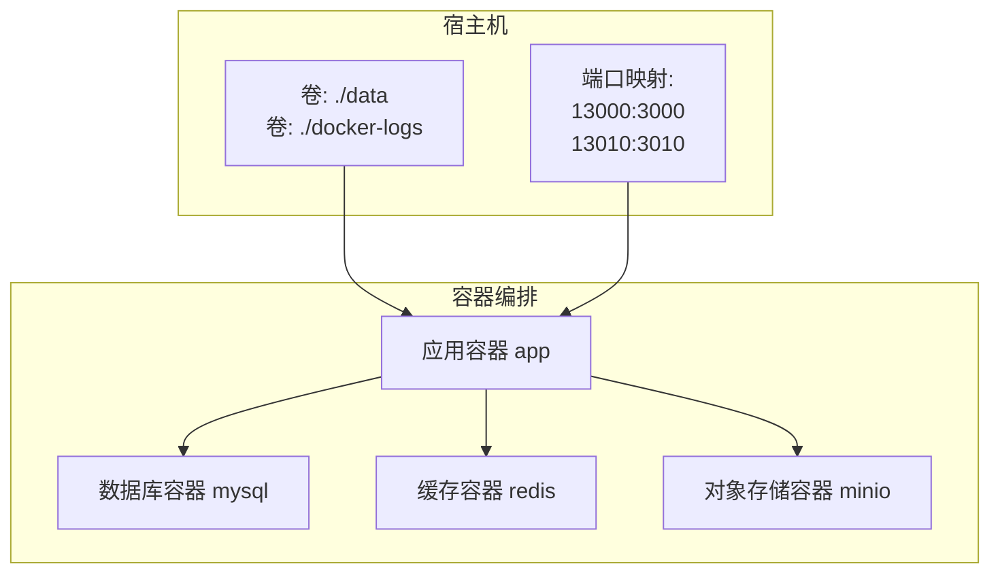
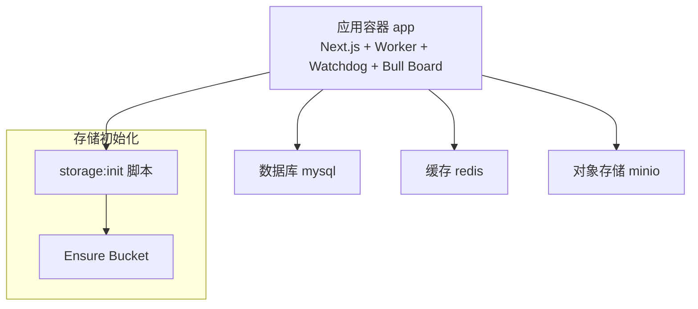
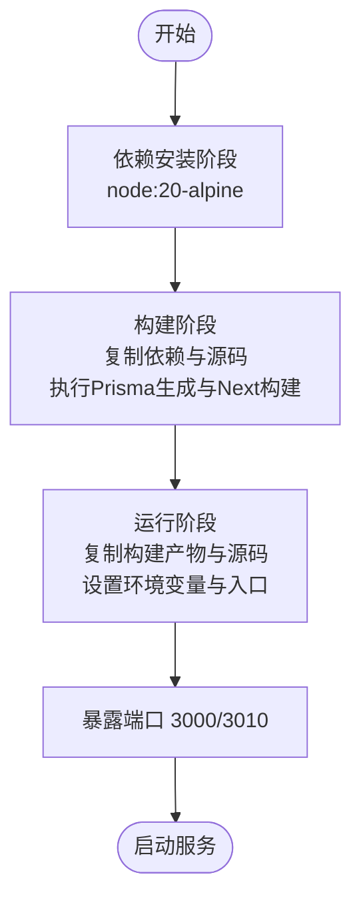
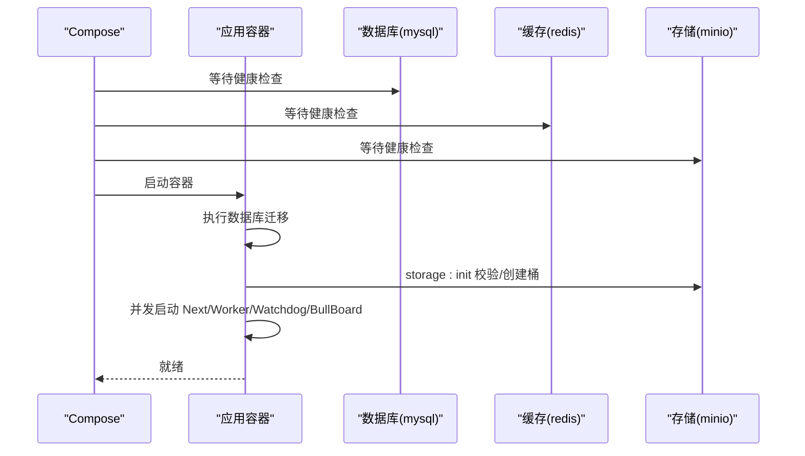
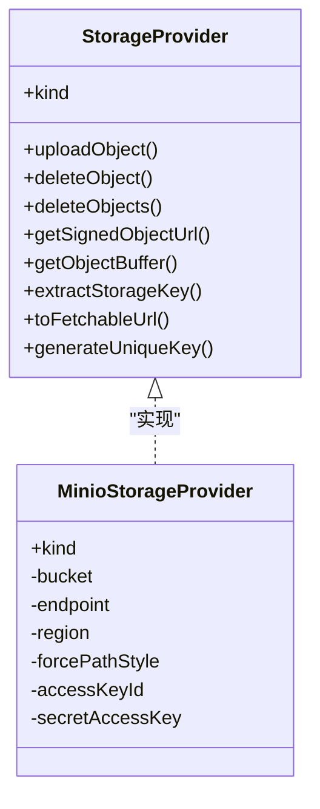
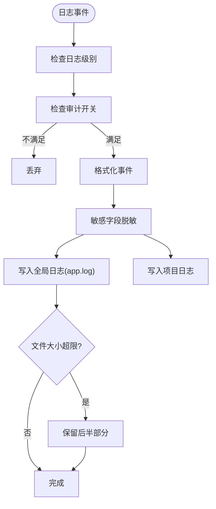
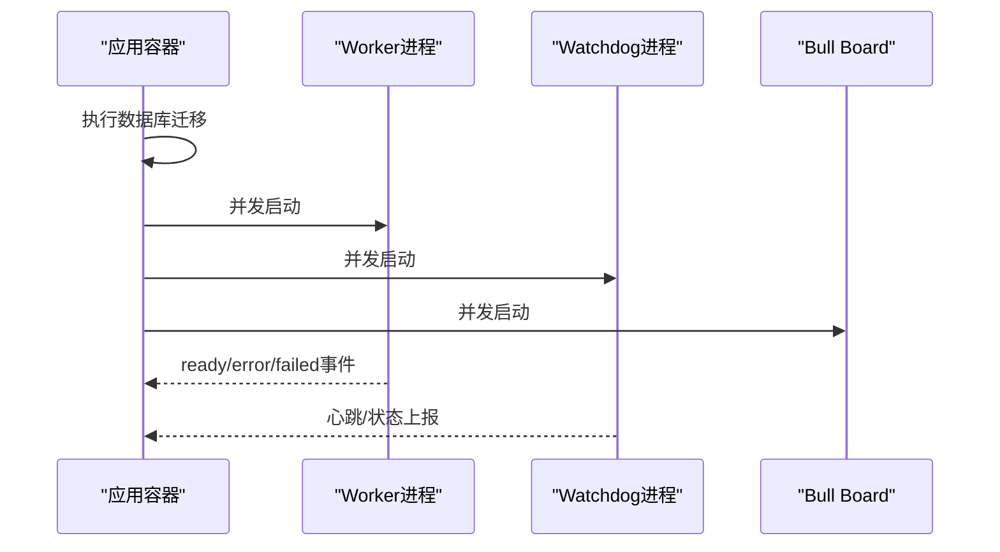
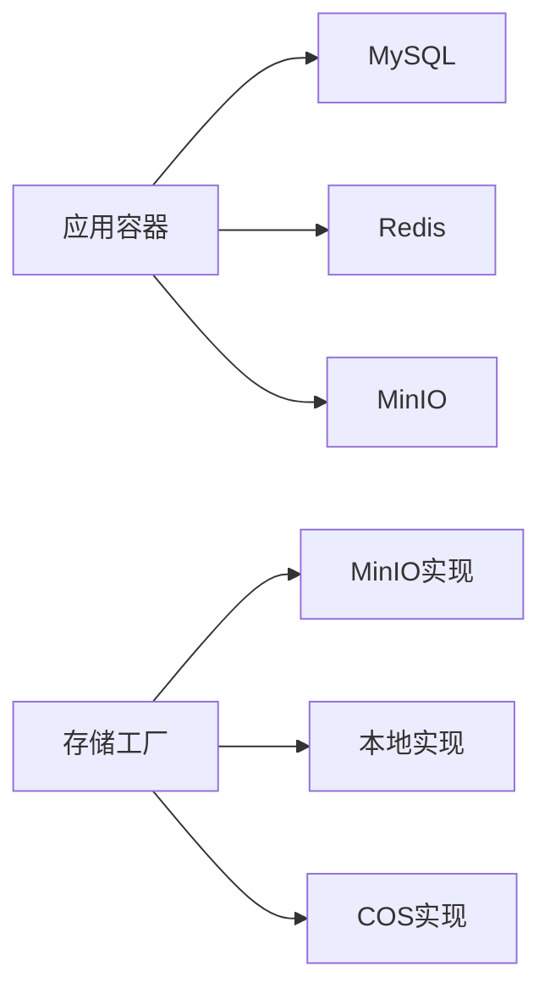

# 容器化部署

<cite>
**本文引用的文件**
- [Dockerfile](file://Dockerfile)
- [.dockerignore](file://.dockerignore)
- [docker-compose.yml](file://docker-compose.yml)
- [docker-compose.test.yml](file://docker-compose.test.yml)
- [.github/workflows/docker-publish.yml](file://.github/workflows/docker-publish.yml)
- [package.json](file://package.json)
- [next.config.ts](file://next.config.ts)
- [src/lib/storage/types.ts](file://src/lib/storage/types.ts)
- [src/lib/storage/init.ts](file://src/lib/storage/init.ts)
- [src/lib/storage/bootstrap.ts](file://src/lib/storage/bootstrap.ts)
- [src/lib/storage/factory.ts](file://src/lib/storage/factory.ts)
- [src/lib/storage/providers/minio.ts](file://src/lib/storage/providers/minio.ts)
- [src/lib/prisma.ts](file://src/lib/prisma.ts)
- [prisma/schema.prisma](file://prisma/schema.prisma)
- [src/lib/workers/index.ts](file://src/lib/workers/index.ts)
- [src/lib/logging/core.ts](file://src/lib/logging/core.ts)
- [src/lib/logging/file-writer.ts](file://src/lib/logging/file-writer.ts)
</cite>

## 目录
1. [简介](#简介)
2. [项目结构](#项目结构)
3. [核心组件](#核心组件)
4. [架构总览](#架构总览)
5. [详细组件分析](#详细组件分析)
6. [依赖关系分析](#依赖关系分析)
7. [性能与资源优化](#性能与资源优化)
8. [故障排查指南](#故障排查指南)
9. [结论](#结论)
10. [附录](#附录)

## 简介
本文件面向Waoowaoo的容器化部署，系统性阐述基于Docker的多阶段构建流程、Docker Compose编排配置、网络与卷挂载策略、环境变量管理、健康检查与重启策略、资源限制建议、以及容器安全加固与镜像扫描实践。文档同时给出部署命令示例与常见问题的解决方案，帮助运维与开发团队快速、稳定地完成生产级部署。

## 项目结构
围绕容器化部署的关键文件与职责如下：
- Dockerfile：定义三阶段构建（依赖安装、构建、运行），并设置运行入口与暴露端口。
- .dockerignore：排除构建与运行无关或敏感的文件与目录，减少镜像体积与泄露风险。
- docker-compose.yml：编排MySQL、Redis、MinIO与应用容器，统一网络、卷与环境变量。
- docker-compose.test.yml：测试环境的最小化编排，便于隔离测试。
- .github/workflows/docker-publish.yml：CI流水线，负责镜像构建、多平台缓存与推送。
- package.json：定义启动脚本，包含并发启动Next.js、Worker、Watchdog与Bull Board。
- next.config.ts：Next.js配置，包含图片源与国际化插件。
- 存储与数据库：通过环境变量驱动，支持MinIO、本地与COS；Prisma连接MySQL。
- 日志与监控：统一日志写入与轮转，支持全局与项目级日志文件输出。

图表来源
- [docker-compose.yml:64-147](file://docker-compose.yml#L64-L147)

章节来源
- [Dockerfile:1-61](file://Dockerfile#L1-L61)
- [.dockerignore:1-54](file://.dockerignore#L1-L54)
- [docker-compose.yml:1-153](file://docker-compose.yml#L1-L153)
- [docker-compose.test.yml:1-33](file://docker-compose.test.yml#L1-L33)
- [.github/workflows/docker-publish.yml:1-56](file://.github/workflows/docker-publish.yml#L1-L56)
- [package.json:9-25](file://package.json#L9-L25)
- [next.config.ts:1-24](file://next.config.ts#L1-L24)

## 核心组件
- 应用容器（Next.js + Worker + Watchdog + Bull Board）
  - 使用多阶段构建，最终仅保留运行所需产物与源代码（用于tsx运行Worker与Watchdog）。
  - 启动命令在容器启动时先执行数据库迁移与初始化提示，再并发启动Next、Worker、Watchdog与Bull Board。
  - 暴露HTTP与队列管理端口，便于外部访问与后台管理。
- 数据库（MySQL）
  - 提供健康检查，确保应用启动前数据库可用。
  - 使用命名卷持久化数据。
- 缓存（Redis）
  - 提供健康检查，启用AOF持久化。
- 对象存储（MinIO）
  - 提供健康检查，映射控制台端口，使用命名卷持久化数据。
  - 应用通过环境变量选择MinIO作为存储后端，并在启动时自动校验/创建桶。
- 日志与监控
  - 统一日志写入到容器内logs目录，支持全局与项目级日志文件轮转。
  - 支持日志级别、格式与敏感字段脱敏配置。

章节来源
- [Dockerfile:19-60](file://Dockerfile#L19-L60)
- [docker-compose.yml:64-147](file://docker-compose.yml#L64-L147)
- [src/lib/storage/init.ts:1-24](file://src/lib/storage/init.ts#L1-L24)
- [src/lib/storage/bootstrap.ts:35-74](file://src/lib/storage/bootstrap.ts#L35-L74)
- [src/lib/logging/core.ts:1-100](file://src/lib/logging/core.ts#L1-L100)
- [src/lib/logging/file-writer.ts:275-307](file://src/lib/logging/file-writer.ts#L275-L307)

## 架构总览
下图展示容器间的关系与数据流：应用容器通过环境变量连接数据库、缓存与对象存储；应用启动时进行数据库迁移与存储桶准备；日志统一写入容器内日志目录，可由宿主卷持久化。

图表来源
- [docker-compose.yml:68-106](file://docker-compose.yml#L68-L106)
- [src/lib/storage/init.ts:1-24](file://src/lib/storage/init.ts#L1-L24)
- [src/lib/storage/bootstrap.ts:35-74](file://src/lib/storage/bootstrap.ts#L35-L74)

## 详细组件分析

### 多阶段构建流程
- 依赖安装阶段（deps）
  - 基于Alpine Node镜像，复制包清单与Prisma目录，执行纯净安装以获得确定性依赖树。
- 构建阶段（builder）
  - 复制依赖与源码，执行Prisma生成与Next.js构建，产出.min化静态资源与构建产物。
- 运行阶段（runner）
  - 复制构建产物与必要源码（Worker、Watchdog、脚本与配置），设置运行时环境变量与入口，暴露端口并启动服务。

图表来源
- [Dockerfile:1-61](file://Dockerfile#L1-L61)

章节来源
- [Dockerfile:1-61](file://Dockerfile#L1-L61)

### Docker Compose 编排配置
- 服务编排
  - mysql：设置数据库凭据、SQL模式与健康检查；映射宿主端口；使用命名卷持久化。
  - redis：启用AOF持久化；映射宿主端口；使用命名卷。
  - minio：设置根用户凭据与控制台端口；映射端口；使用命名卷。
  - app：拉取预构建镜像；注入环境变量（数据库、缓存、存储、认证、队列并发、日志等）；挂载数据与日志卷；等待其他服务健康后再启动；启动时执行数据库迁移与启动提示。
- 网络与端口
  - app容器对外暴露HTTP与队列管理端口，映射至宿主端口以便访问。
- 健康检查
  - mysql、redis、minio均配置健康检查，确保应用侧启动前基础设施可用。
- 重启策略
  - 所有服务均设置unless-stopped，保证异常退出后自动恢复。

图表来源
- [docker-compose.yml:64-147](file://docker-compose.yml#L64-L147)

章节来源
- [docker-compose.yml:1-153](file://docker-compose.yml#L1-L153)

### 存储与数据库配置
- 存储类型与MinIO
  - 应用通过环境变量选择存储类型，默认MinIO；启动时调用storage:init脚本，基于S3客户端检测/创建桶。
  - MinIO提供兼容S3的接口，支持签名URL、批量删除与对象读取。
- 数据库
  - Prisma schema声明使用MySQL，连接字符串来自环境变量；应用启动时执行数据库迁移。

图表来源
- [src/lib/storage/types.ts:23-37](file://src/lib/storage/types.ts#L23-L37)
- [src/lib/storage/providers/minio.ts:22-31](file://src/lib/storage/providers/minio.ts#L22-L31)

章节来源
- [src/lib/storage/types.ts:1-37](file://src/lib/storage/types.ts#L1-L37)
- [src/lib/storage/bootstrap.ts:35-74](file://src/lib/storage/bootstrap.ts#L35-L74)
- [src/lib/storage/factory.ts:15-26](file://src/lib/storage/factory.ts#L15-L26)
- [src/lib/storage/providers/minio.ts:1-31](file://src/lib/storage/providers/minio.ts#L1-L31)
- [prisma/schema.prisma:5-8](file://prisma/schema.prisma#L5-L8)

### 日志与监控
- 日志写入
  - 统一日志模块根据配置决定是否输出与审计标记；全局日志写入容器内logs目录，支持按项目分文件。
- 日志轮转
  - 全局日志文件超过阈值时自动保留后半部分，避免无限增长。
- 日志配置
  - 通过环境变量控制日志开关、级别、格式与敏感字段脱敏列表。

图表来源
- [src/lib/logging/core.ts:97-100](file://src/lib/logging/core.ts#L97-L100)
- [src/lib/logging/file-writer.ts:275-307](file://src/lib/logging/file-writer.ts#L275-L307)

章节来源
- [src/lib/logging/core.ts:1-100](file://src/lib/logging/core.ts#L1-L100)
- [src/lib/logging/file-writer.ts:187-307](file://src/lib/logging/file-writer.ts#L187-L307)

### Worker与Watchdog
- Worker
  - 并发启动图像、视频、语音与文本四类工作线程，监听ready/error/failed事件并记录日志。
- Watchdog
  - 通过独立脚本运行，配合队列心跳与超时参数保障任务存活与可观测性。
- 启动顺序
  - compose中通过command串行执行迁移与提示，随后并发启动各组件。

图表来源
- [package.json:20-25](file://package.json#L20-L25)
- [src/lib/workers/index.ts:1-39](file://src/lib/workers/index.ts#L1-L39)

章节来源
- [package.json:9-25](file://package.json#L9-L25)
- [src/lib/workers/index.ts:1-39](file://src/lib/workers/index.ts#L1-L39)

## 依赖关系分析
- 应用对基础设施的依赖
  - 数据库：通过Prisma连接MySQL，启动前需等待健康检查通过。
  - 缓存：Redis用于队列与会话等场景，需健康可用。
  - 存储：MinIO提供S3兼容接口，启动时自动准备桶。
- 组件耦合
  - 应用容器内部通过环境变量解耦外部服务地址与凭据。
  - 存储抽象通过工厂模式屏蔽具体实现差异。

图表来源
- [docker-compose.yml:68-106](file://docker-compose.yml#L68-L106)
- [src/lib/storage/factory.ts:15-26](file://src/lib/storage/factory.ts#L15-L26)

章节来源
- [docker-compose.yml:1-153](file://docker-compose.yml#L1-L153)
- [src/lib/storage/factory.ts:15-26](file://src/lib/storage/factory.ts#L15-L26)

## 性能与资源优化
- 构建优化
  - 多阶段构建减少最终镜像体积；依赖安装阶段使用纯净安装，提升缓存命中率。
- 运行优化
  - 使用Alpine基础镜像降低镜像体积与攻击面。
  - 通过并发启动多个组件，充分利用CPU资源。
- 存储与数据库
  - MinIO启用AOF持久化与健康检查；MySQL开启严格SQL模式，减少运行期错误。
- 日志
  - 全局日志轮转避免磁盘膨胀；按项目分文件便于定位问题。

章节来源
- [Dockerfile:1-61](file://Dockerfile#L1-L61)
- [docker-compose.yml:18-23](file://docker-compose.yml#L18-L23)
- [docker-compose.yml:35-40](file://docker-compose.yml#L35-L40)
- [docker-compose.yml:56-61](file://docker-compose.yml#L56-L61)
- [src/lib/logging/file-writer.ts:275-307](file://src/lib/logging/file-writer.ts#L275-L307)

## 故障排查指南
- 应用无法启动或白屏
  - 检查数据库健康检查是否通过；确认DATABASE_URL正确指向mysql服务名。
  - 查看应用容器日志，确认storage:init是否成功创建桶。
- 队列管理页面不可用
  - 确认Bull Board端口映射与访问路径；检查BULL_BOARD_HOST/BASE_PATH配置。
- 存储上传失败
  - 校验MINIO_ENDPOINT、MINIO_BUCKET、MINIO_ACCESS_KEY、MINIO_SECRET_KEY；确认MinIO健康检查通过。
- 日志未落盘或过大
  - 检查logs目录权限与卷挂载；确认日志轮转逻辑生效。
- CI镜像构建失败
  - 检查GitHub Actions中镜像标签与缓存配置；确认多平台构建参数正确。

章节来源
- [docker-compose.yml:68-114](file://docker-compose.yml#L68-L114)
- [docker-compose.yml:132-147](file://docker-compose.yml#L132-L147)
- [src/lib/storage/bootstrap.ts:35-74](file://src/lib/storage/bootstrap.ts#L35-L74)
- [src/lib/logging/file-writer.ts:275-307](file://src/lib/logging/file-writer.ts#L275-L307)
- [.github/workflows/docker-publish.yml:46-56](file://.github/workflows/docker-publish.yml#L46-L56)

## 结论
通过多阶段构建与Compose编排，Waoowaoo实现了从依赖安装、构建到生产运行的完整流水线；借助健康检查、重启策略与日志轮转，提升了系统的稳定性与可观测性；结合存储抽象与数据库迁移，确保了部署的一致性与可维护性。建议在生产环境中进一步引入资源限制、健康探针与镜像扫描，持续强化安全与可靠性。

## 附录

### 部署命令示例
- 本地开发/演示
  - 启动编排：docker compose up -d
  - 查看日志：docker compose logs -f app
  - 停止编排：docker compose down
- 生产部署（建议）
  - 使用Compose编排，结合反向代理（如Caddy/Nginx）提供TLS终止与域名路由。
  - 为各服务设置资源限制与健康检查，确保弹性与韧性。
  - 定期扫描镜像漏洞并更新基础镜像版本。

章节来源
- [docker-compose.yml:125-147](file://docker-compose.yml#L125-L147)

### 环境变量与配置要点
- 数据库
  - DATABASE_URL：指向mysql服务名与端口。
- 缓存
  - REDIS_HOST/PORT/USERNAME/PASSWORD/TLS：指向redis服务。
- 存储
  - STORAGE_TYPE/MINIO_ENDPOINT/MINIO_REGION/MINIO_BUCKET/MINIO_ACCESS_KEY/MINIO_SECRET_KEY/MINIO_FORCE_PATH_STYLE：指向minio服务。
- 认证与内部通信
  - NEXTAUTH_URL/INTERNAL_APP_URL/NEXTAUTH_SECRET：浏览器访问地址与内部自调用地址。
- 内部密钥
  - CRON_SECRET/INTERNAL_TASK_TOKEN/API_ENCRYPTION_KEY：用于内部任务与加密。
- 队列与并发
  - WATCHDOG_INTERVAL_MS/TASK_HEARTBEAT_TIMEOUT_MS/QUEUE_CONCURRENCY_*：控制Worker行为。
- Bull Board
  - BULL_BOARD_HOST/PORT/BASE_PATH/USER/PASSWORD：后台管理界面访问配置。
- 日志
  - LOG_UNIFIED_ENABLED/LOG_LEVEL/LOG_FORMAT/LOG_DEBUG_ENABLED/LOG_AUDIT_ENABLED/SERVICE/REDACT_KEYS：统一日志开关、级别、格式与敏感字段脱敏。

章节来源
- [docker-compose.yml:68-114](file://docker-compose.yml#L68-L114)

### 安全加固与镜像扫描
- 最小化镜像
  - 使用Alpine基础镜像；仅复制运行所需文件；利用.dockerignore排除无关内容。
- 健康检查与重启策略
  - 为数据库、缓存与存储配置健康检查；设置unless-stopped重启策略。
- 环境变量与密钥
  - 将敏感信息置于Compose环境变量或外部密钥管理；避免硬编码在镜像中。
- 镜像扫描
  - 在CI中集成镜像扫描步骤，识别高危漏洞并阻断发布。
- 网络与卷
  - 仅映射必要端口；使用只读卷保护配置文件；对日志卷进行定期清理。

章节来源
- [.dockerignore:1-54](file://.dockerignore#L1-L54)
- [Dockerfile:25-26](file://Dockerfile#L25-L26)
- [docker-compose.yml:18-23](file://docker-compose.yml#L18-L23)
- [docker-compose.yml:35-40](file://docker-compose.yml#L35-L40)
- [docker-compose.yml:56-61](file://docker-compose.yml#L56-L61)