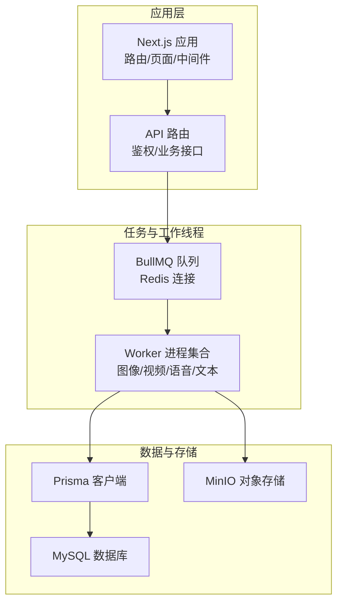
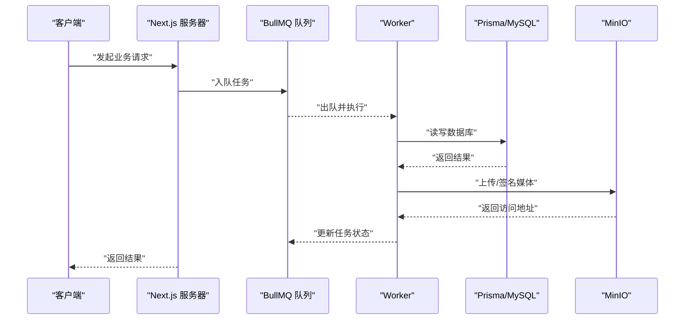
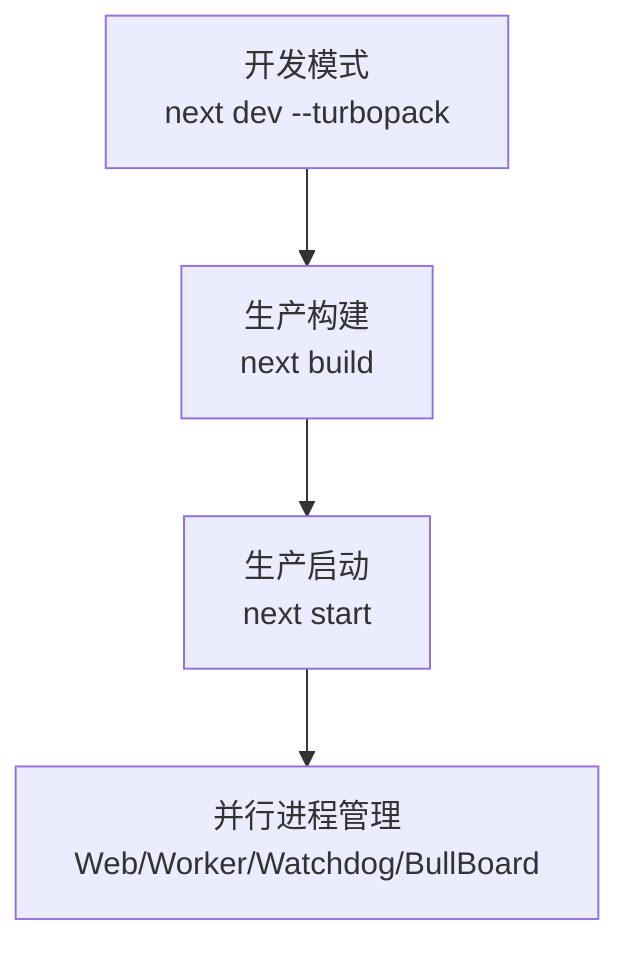
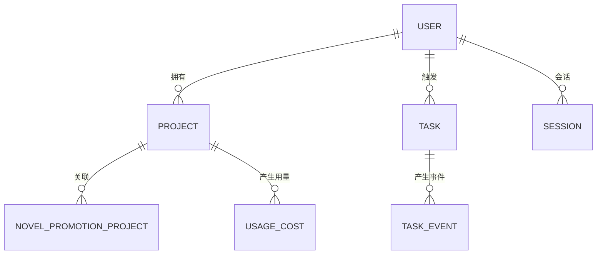
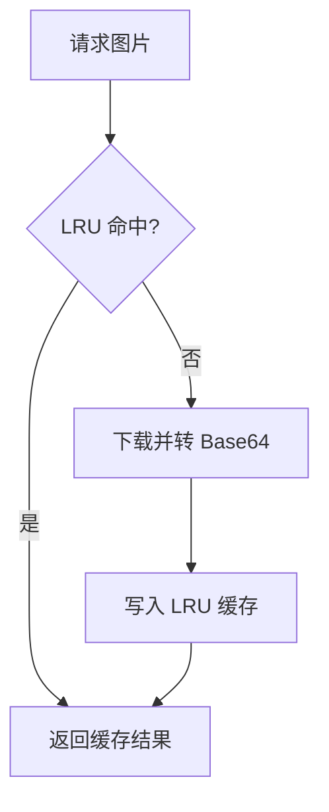
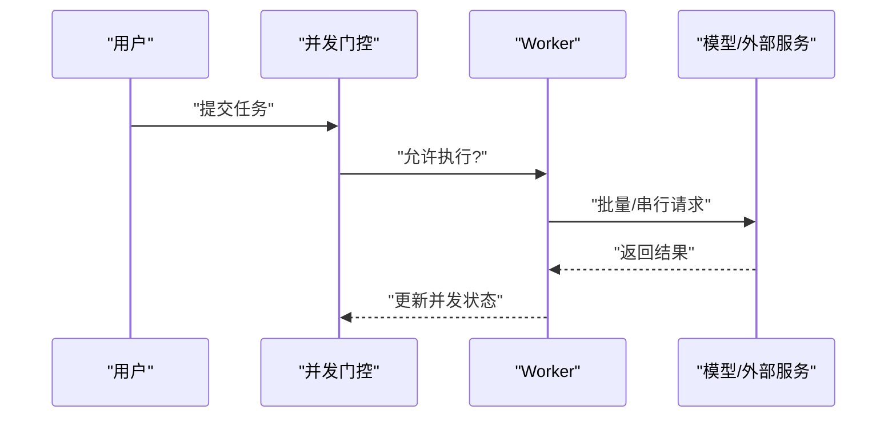
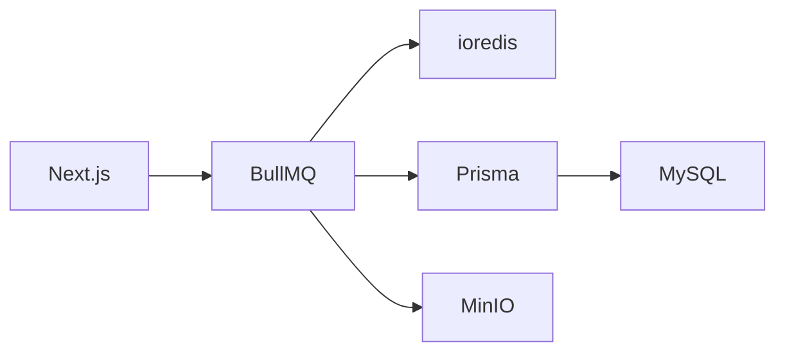

# 性能调优

<cite>
**本文引用的文件**
- [package.json](file://package.json)
- [next.config.ts](file://next.config.ts)
- [Dockerfile](file://Dockerfile)
- [prisma/schema.prisma](file://prisma/schema.prisma)
- [src/lib/prisma.ts](file://src/lib/prisma.ts)
- [src/lib/redis.ts](file://src/lib/redis.ts)
- [src/lib/workers/index.ts](file://src/lib/workers/index.ts)
- [src/lib/workers/image.worker.ts](file://src/lib/workers/image.worker.ts)
- [src/lib/workers/video.worker.ts](file://src/lib/workers/video.worker.ts)
- [src/lib/workers/voice.worker.ts](file://src/lib/workers/voice.worker.ts)
- [src/lib/workers/text.worker.ts](file://src/lib/workers/text.worker.ts)
- [src/lib/workflow-concurrency.ts](file://src/lib/workflow-concurrency.ts)
- [src/lib/image-cache.ts](file://src/lib/image-cache.ts)
- [src/lib/storage/init.ts](file://src/lib/storage/init.ts)
- [vitest.config.ts](file://vitest.config.ts)
</cite>

## 目录
1. [简介](#简介)
2. [项目结构](#项目结构)
3. [核心组件](#核心组件)
4. [架构总览](#架构总览)
5. [详细组件分析](#详细组件分析)
6. [依赖分析](#依赖分析)
7. [性能考虑](#性能考虑)
8. [故障排查指南](#故障排查指南)
9. [结论](#结论)
10. [附录](#附录)

## 简介
本文件面向 Waoowaoo 的性能调优目标，围绕以下方面展开：Next.js 构建优化、静态资源缓存与 CDN 配置、数据库性能调优（索引、查询、连接池）、AI 服务性能优化（并发控制、请求批量化、缓存策略）、内存与 CPU 监控与优化（GC 与进程管理）、负载与压力测试方法、缓存与 CDN 最佳实践、以及性能监控指标与回归检测机制。

## 项目结构
Waoowaoo 采用前后端一体化的 Next.js 应用，配合基于 BullMQ 的异步任务队列、Prisma 数据访问层、ioredis 缓存、MinIO 对象存储等组件。生产容器以多阶段构建，启动时同时运行 Web、Worker、Watchdog、Bull Board 等进程。

图表来源
- [Dockerfile:1-61](file://Dockerfile#L1-L61)
- [src/lib/workers/index.ts:1-39](file://src/lib/workers/index.ts#L1-L39)
- [src/lib/redis.ts:1-76](file://src/lib/redis.ts#L1-L76)
- [src/lib/prisma.ts:1-9](file://src/lib/prisma.ts#L1-L9)
- [src/lib/storage/init.ts:1-25](file://src/lib/storage/init.ts#L1-L25)

章节来源
- [Dockerfile:1-61](file://Dockerfile#L1-L61)
- [package.json:1-186](file://package.json#L1-L186)

## 核心组件
- Next.js 构建与运行：通过脚本统一启动 Web 与 Worker/Watchdog/Bull Board；开发模式启用 Turbopack；生产构建与静态产物缓存。
- 任务系统：BullMQ Worker 按队列类型分发任务，支持用户级并发门控与全局并发限制。
- 数据访问：Prisma 客户端单例模式，配合 MySQL 数据库；Schema 中大量索引覆盖常用查询路径。
- 缓存与存储：ioredis 单例连接；MinIO 初始化与签名 URL；图像下载 LRU 缓存。
- AI 与媒体：多类任务（图像/视频/语音/文本）在 Worker 内执行，结合模型网关与外部服务。

章节来源
- [package.json:9-25](file://package.json#L9-L25)
- [next.config.ts:1-24](file://next.config.ts#L1-L24)
- [src/lib/workers/index.ts:1-39](file://src/lib/workers/index.ts#L1-L39)
- [src/lib/workers/image.worker.ts:50-67](file://src/lib/workers/image.worker.ts#L50-L67)
- [src/lib/workers/video.worker.ts:306-323](file://src/lib/workers/video.worker.ts#L306-L323)
- [src/lib/workers/voice.worker.ts:54-63](file://src/lib/workers/voice.worker.ts#L54-L63)
- [src/lib/workers/text.worker.ts:705-714](file://src/lib/workers/text.worker.ts#L705-L714)
- [src/lib/redis.ts:1-76](file://src/lib/redis.ts#L1-L76)
- [src/lib/prisma.ts:1-9](file://src/lib/prisma.ts#L1-L9)
- [prisma/schema.prisma:1-1002](file://prisma/schema.prisma#L1-L1002)
- [src/lib/image-cache.ts:1-254](file://src/lib/image-cache.ts#L1-L254)
- [src/lib/storage/init.ts:1-25](file://src/lib/storage/init.ts#L1-L25)

## 架构总览
下图展示从请求到任务执行的关键链路，以及与数据库、缓存、对象存储的交互。

图表来源
- [src/lib/workers/index.ts:1-39](file://src/lib/workers/index.ts#L1-L39)
- [src/lib/workers/image.worker.ts:20-48](file://src/lib/workers/image.worker.ts#L20-L48)
- [src/lib/workers/video.worker.ts:183-222](file://src/lib/workers/video.worker.ts#L183-L222)
- [src/lib/workers/voice.worker.ts:11-38](file://src/lib/workers/voice.worker.ts#L11-L38)
- [src/lib/workers/text.worker.ts:653-702](file://src/lib/workers/text.worker.ts#L653-L702)
- [src/lib/prisma.ts:1-9](file://src/lib/prisma.ts#L1-L9)
- [src/lib/storage/init.ts:1-25](file://src/lib/storage/init.ts#L1-L25)

## 详细组件分析

### Next.js 构建与运行优化
- 构建与启动
  - 开发：启用 Turbopack，提升热更新与增量编译速度。
  - 生产：多阶段 Docker 构建，仅拷贝必要产物，减少镜像体积与启动时间。
- 静态资源与图片
  - 通过 next.config.ts 配置允许的远程/本地图片模式，便于后续 CDN 与缓存策略落地。
- 进程管理
  - 启动脚本使用 concurrently 并行启动多个进程，建议在容器中通过进程管理器或 systemd 管理，确保优雅关闭与信号处理。

图表来源
- [package.json:12-25](file://package.json#L12-L25)
- [next.config.ts:1-24](file://next.config.ts#L1-L24)
- [Dockerfile:1-61](file://Dockerfile#L1-L61)

章节来源
- [package.json:12-25](file://package.json#L12-L25)
- [next.config.ts:1-24](file://next.config.ts#L1-L24)
- [Dockerfile:1-61](file://Dockerfile#L1-L61)

### 数据库性能调优（Prisma + MySQL）
- 索引优化
  - Schema 中广泛使用 @@index 与 @@unique，覆盖用户、项目、任务、账单等高频查询字段，显著降低全表扫描概率。
  - 建议对高选择性与频繁过滤字段补充复合索引，避免遗漏。
- 查询优化
  - 使用 PrismaClient 单例，避免重复初始化连接开销。
  - 在 Worker 中尽量批量读取与事务化写入，减少往返次数。
- 连接池配置
  - 当前未显式配置连接池参数，建议在生产环境通过环境变量注入连接池参数（如最大连接数、空闲超时、查询超时等），并与数据库实例规格匹配。

图表来源
- [prisma/schema.prisma:1-1002](file://prisma/schema.prisma#L1-L1002)

章节来源
- [prisma/schema.prisma:1-1002](file://prisma/schema.prisma#L1-L1002)
- [src/lib/prisma.ts:1-9](file://src/lib/prisma.ts#L1-L9)

### 缓存与 CDN 配置
- 应用内缓存
  - 图像下载 LRU 缓存：共享同一 URL 的并发下载 Promise，TTL 与容量可控，降低重复下载与上游限流风险。
  - 建议：对外暴露缓存统计接口，便于观测命中率与体积；在高并发场景下可考虑分布式缓存（如 Redis）替代 LRU。
- CDN 与静态资源
  - 建议：将 Next.js 构建产物与公共静态资源托管于 CDN，并开启压缩与缓存头；图片资源通过 next.config.ts 的 remotePatterns 或自建代理服务统一签名与缓存。
- 对象存储
  - MinIO 初始化脚本确保桶存在；媒体生成后上传至 MinIO，建议使用签名 URL 与短时效策略，结合 CDN 缓存热点内容。

图表来源
- [src/lib/image-cache.ts:46-101](file://src/lib/image-cache.ts#L46-L101)

章节来源
- [src/lib/image-cache.ts:1-254](file://src/lib/image-cache.ts#L1-L254)
- [src/lib/storage/init.ts:1-25](file://src/lib/storage/init.ts#L1-L25)
- [next.config.ts:13-20](file://next.config.ts#L13-L20)

### AI 服务性能优化
- 并发控制
  - Worker 支持按用户维度的并发门控，结合用户偏好中的并发上限进行动态调整，避免单用户过度占用资源。
  - 建议：根据任务类型与模型能力设置不同队列的并发度，定期评估吞吐与延迟，动态调优。
- 请求批量化
  - 文本任务中存在多阶段并行执行与事务化写入，建议在任务设计上合并小任务，减少事务边界与锁竞争。
- 缓存策略
  - 图像下载缓存与提示词/上下文缓存相结合，减少重复推理与外部调用。
  - 建议：对长耗时推理结果增加结果缓存（需考虑一致性与失效策略）。

图表来源
- [src/lib/workers/text.worker.ts:653-702](file://src/lib/workers/text.worker.ts#L653-L702)
- [src/lib/workers/image.worker.ts:50-67](file://src/lib/workers/image.worker.ts#L50-L67)
- [src/lib/workers/video.worker.ts:306-323](file://src/lib/workers/video.worker.ts#L306-L323)
- [src/lib/workers/voice.worker.ts:54-63](file://src/lib/workers/voice.worker.ts#L54-L63)
- [src/lib/workflow-concurrency.ts:1-43](file://src/lib/workflow-concurrency.ts#L1-L43)

章节来源
- [src/lib/workflow-concurrency.ts:1-43](file://src/lib/workflow-concurrency.ts#L1-L43)
- [src/lib/workers/text.worker.ts:653-702](file://src/lib/workers/text.worker.ts#L653-L702)
- [src/lib/workers/image.worker.ts:50-67](file://src/lib/workers/image.worker.ts#L50-L67)
- [src/lib/workers/video.worker.ts:306-323](file://src/lib/workers/video.worker.ts#L306-L323)
- [src/lib/workers/voice.worker.ts:54-63](file://src/lib/workers/voice.worker.ts#L54-L63)

### 内存与 CPU 监控与优化
- 进程管理
  - Docker 入口使用 Tini，确保信号正确传递；建议在容器编排中设置健康检查与重启策略。
- GC 与内存
  - 建议：在 Node.js 启动参数中配置合理的堆大小与 GC 参数；对长生命周期对象进行及时释放，避免闭包持有导致的内存泄漏。
- CPU 优化
  - 将 CPU 密集型任务（如视频合成、图像处理）拆分为独立 Worker 进程或容器，避免阻塞主 Web 进程。

章节来源
- [Dockerfile:25-30](file://Dockerfile#L25-L30)
- [package.json:12-25](file://package.json#L12-L25)

### 负载测试与压力测试
- 测试框架
  - Vitest 提供 Node 环境下的测试能力，建议扩展为性能测试套件，结合并发与吞吐指标。
- 负载场景
  - 并发任务注入：模拟多用户同时提交图像/视频/语音任务，观察队列积压与延迟。
  - 媒体热点：对热门图片/视频进行并发下载与缓存命中率测试。
- 指标采集
  - 延迟分布（P50/P95/P99）、吞吐量、错误率、队列长度、数据库连接数、Redis 命中率、对象存储上传耗时。

章节来源
- [vitest.config.ts:1-45](file://vitest.config.ts#L1-L45)

## 依赖分析
- 外部依赖
  - BullMQ：任务队列与 Worker；ioredis：缓存与队列连接；Prisma：数据库 ORM；Next.js：Web 框架；MinIO：对象存储。
- 内部耦合
  - Worker 依赖 Redis 连接与 Prisma 客户端；任务类型与队列名称解耦良好；并发门控与用户偏好解耦。

图表来源
- [src/lib/redis.ts:1-76](file://src/lib/redis.ts#L1-L76)
- [src/lib/prisma.ts:1-9](file://src/lib/prisma.ts#L1-L9)
- [src/lib/workers/index.ts:1-39](file://src/lib/workers/index.ts#L1-L39)

章节来源
- [src/lib/redis.ts:1-76](file://src/lib/redis.ts#L1-L76)
- [src/lib/prisma.ts:1-9](file://src/lib/prisma.ts#L1-L9)
- [src/lib/workers/index.ts:1-39](file://src/lib/workers/index.ts#L1-L39)

## 性能考虑
- 构建与打包
  - 使用 Turbopack 与生产构建，减少冷启动与首屏渲染时间。
  - 合理拆分页面与组件，利用动态导入与懒加载。
- 数据库
  - 基于现有索引继续完善复合索引；对慢查询进行 EXPLAIN 分析；必要时引入只读副本。
- 缓存
  - 图像下载缓存已具备基础效果；建议引入多级缓存（内存/Redis）与失效策略。
- AI 与媒体
  - 通过并发门控与队列隔离，避免资源争用；对长耗时任务增加进度上报与断点续传。
- 监控与告警
  - 建议接入 APM（如 Prometheus + Grafana）与日志聚合，设置延迟、错误率、队列长度阈值告警。

## 故障排查指南
- 任务长时间卡住
  - 检查队列并发度与用户并发门控配置；查看 Worker 日志与数据库事务是否超时。
- 图片下载失败
  - 查看图像缓存统计与错误日志；确认上游服务可用性与签名 URL 有效期。
- 数据库连接异常
  - 检查连接池参数与数据库实例规格；确认 Prisma 单例初始化逻辑。
- 对象存储上传失败
  - 校验桶权限与签名策略；确认网络连通性与超时设置。

章节来源
- [src/lib/image-cache.ts:216-239](file://src/lib/image-cache.ts#L216-L239)
- [src/lib/storage/init.ts:1-25](file://src/lib/storage/init.ts#L1-L25)
- [src/lib/prisma.ts:1-9](file://src/lib/prisma.ts#L1-L9)
- [src/lib/redis.ts:1-76](file://src/lib/redis.ts#L1-L76)

## 结论
Waoowaoo 已具备良好的性能基线：多阶段构建、任务队列与并发门控、图像缓存与对象存储。建议在生产环境中进一步完善数据库索引、连接池参数、多级缓存与 CDN 策略、以及系统化的性能监控与回归检测机制，持续迭代以应对业务增长与复杂场景。

## 附录
- 最佳实践清单
  - 构建：启用 Turbopack，合理拆分与懒加载；生产构建产物走 CDN。
  - 缓存：LRU 缓存 + Redis 缓存双层；设置 TTL 与淘汰策略；暴露缓存指标。
  - 数据库：完善复合索引；慢查询分析；连接池参数调优。
  - AI 与媒体：并发门控 + 队列隔离；批量化与断点续传；进度上报。
  - 监控：延迟、吞吐、错误率、队列长度、数据库连接数、缓存命中率、对象存储耗时。
  - 测试：扩展 Vitest 为性能测试套件，覆盖并发与热点场景。