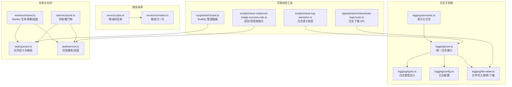
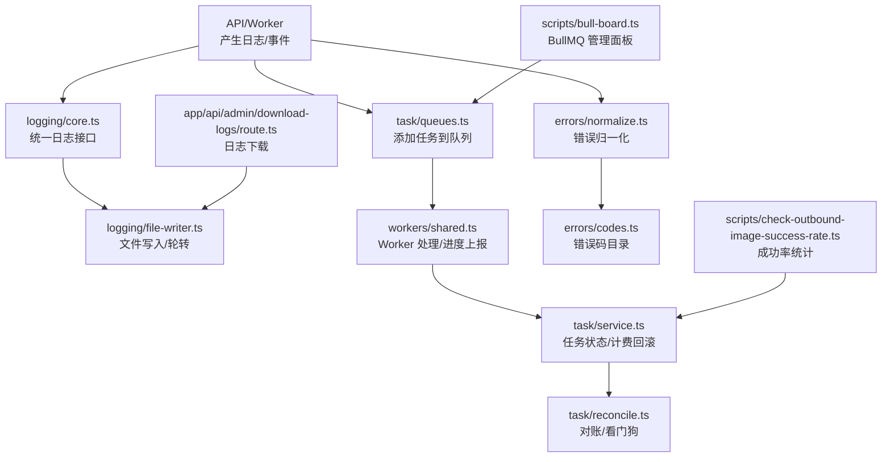
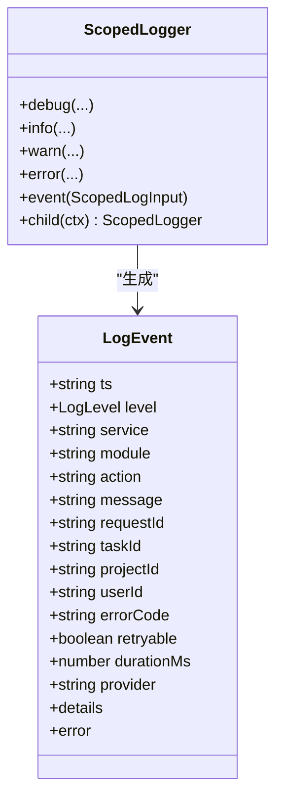
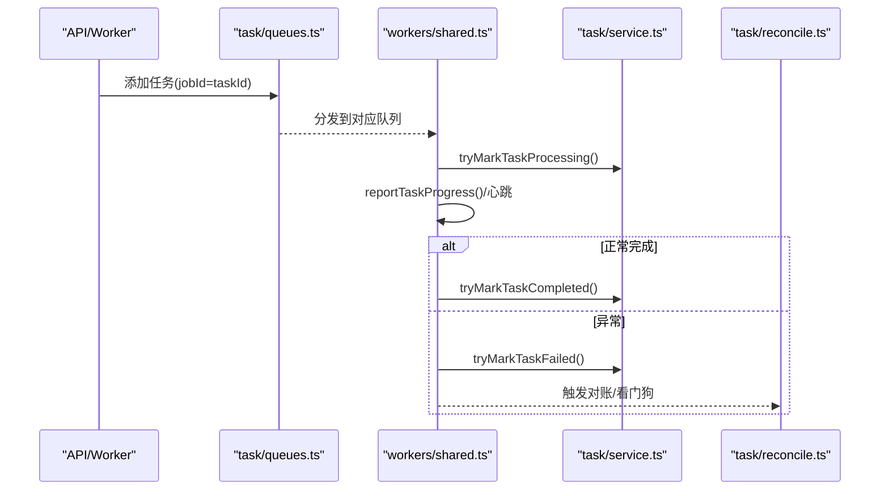
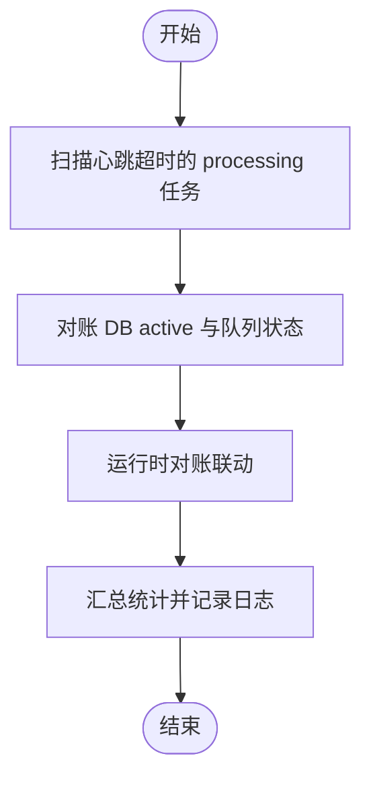
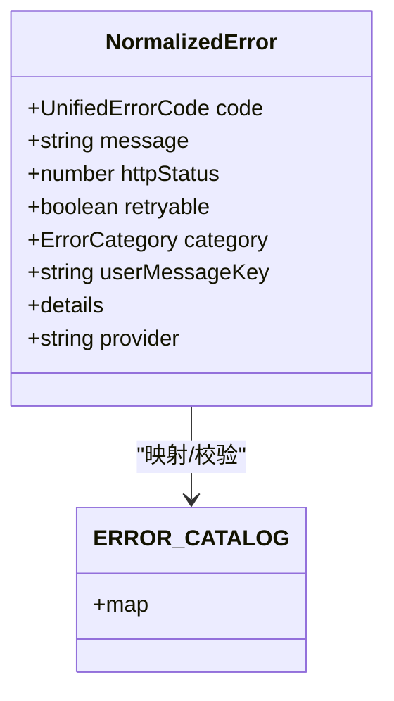
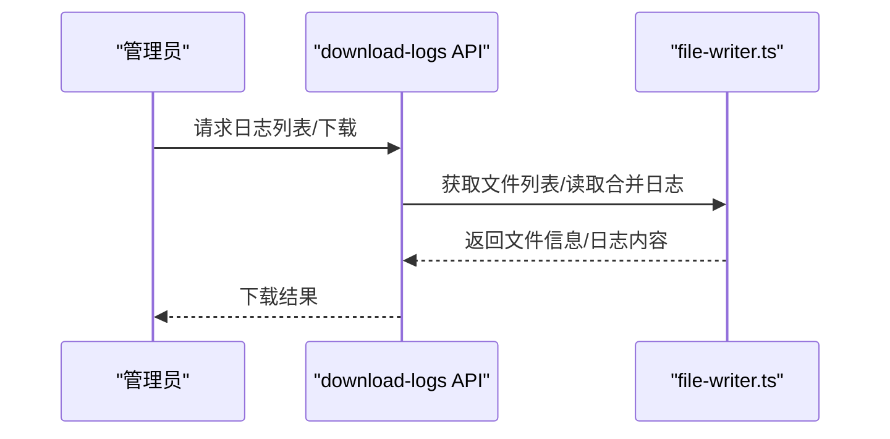
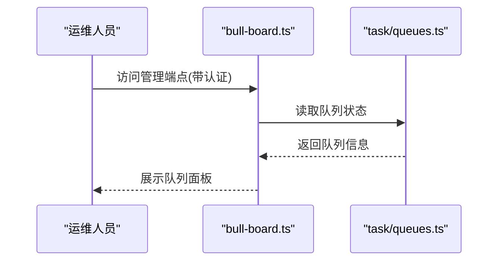
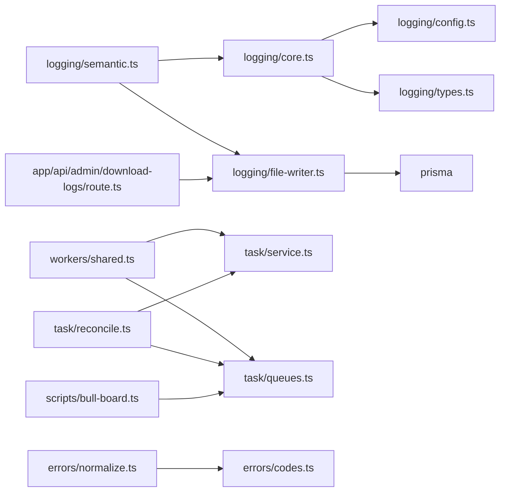

# 监控告警

<cite>
**本文引用的文件**
- [src/lib/logging/core.ts](file://src/lib/logging/core.ts)
- [src/lib/logging/semantic.ts](file://src/lib/logging/semantic.ts)
- [src/lib/logging/types.ts](file://src/lib/logging/types.ts)
- [src/lib/logging/config.ts](file://src/lib/logging/config.ts)
- [src/lib/logging/file-writer.ts](file://src/lib/logging/file-writer.ts)
- [src/lib/task/queues.ts](file://src/lib/task/queues.ts)
- [src/lib/task/reconcile.ts](file://src/lib/task/reconcile.ts)
- [src/lib/task/service.ts](file://src/lib/task/service.ts)
- [src/lib/workers/shared.ts](file://src/lib/workers/shared.ts)
- [scripts/bull-board.ts](file://scripts/bull-board.ts)
- [src/lib/errors/codes.ts](file://src/lib/errors/codes.ts)
- [src/lib/errors/normalize.ts](file://src/lib/errors/normalize.ts)
- [src/lib/sse/shared-subscriber.ts](file://src/lib/sse/shared-subscriber.ts)
- [src/app/api/admin/download-logs/route.ts](file://src/app/api/admin/download-logs/route.ts)
- [scripts/check-outbound-image-success-rate.ts](file://scripts/check-outbound-image-success-rate.ts)
- [scripts/check-log-semantic.ts](file://scripts/check-log-semantic.ts)
</cite>

## 目录
1. [简介](#简介)
2. [项目结构](#项目结构)
3. [核心组件](#核心组件)
4. [架构总览](#架构总览)
5. [详细组件分析](#详细组件分析)
6. [依赖关系分析](#依赖关系分析)
7. [性能考量](#性能考量)
8. [故障排查指南](#故障排查指南)
9. [结论](#结论)
10. [附录](#附录)

## 简介
本文件面向 Waoowaoo 的监控告警体系，围绕应用性能监控（APM）、日志收集与检索、错误监控与异常告警、任务队列监控、告警规则与通知渠道以及监控仪表板设计进行系统化说明。文档以仓库现有实现为依据，结合代码结构与运行机制，给出可操作的配置与使用指南，并提供可视化图表帮助理解。

## 项目结构
监控相关能力主要分布在以下模块：
- 日志子系统：统一日志接口、语义化日志、文件落盘与轮转、审计开关与敏感信息脱敏
- 任务与队列：BullMQ 队列、任务对账与看门狗、Worker 生命周期与进度上报
- 错误体系：错误码目录、错误归一化、HTTP 映射与重试策略
- 可观测性工具：BullMQ 管理面板、日志下载 API、成功/失败率统计脚本、日志语义校验脚本

**图表来源**
- [src/lib/logging/core.ts:1-303](file://src/lib/logging/core.ts#L1-L303)
- [src/lib/logging/semantic.ts:1-237](file://src/lib/logging/semantic.ts#L1-L237)
- [src/lib/logging/types.ts:1-45](file://src/lib/logging/types.ts#L1-L45)
- [src/lib/logging/config.ts:1-42](file://src/lib/logging/config.ts#L1-L42)
- [src/lib/logging/file-writer.ts:1-394](file://src/lib/logging/file-writer.ts#L1-L394)
- [src/lib/task/queues.ts:1-112](file://src/lib/task/queues.ts#L1-L112)
- [src/lib/task/reconcile.ts:1-280](file://src/lib/task/reconcile.ts#L1-L280)
- [src/lib/task/service.ts:1-200](file://src/lib/task/service.ts#L1-L200)
- [src/lib/workers/shared.ts:1-200](file://src/lib/workers/shared.ts#L1-L200)
- [scripts/bull-board.ts:1-106](file://scripts/bull-board.ts#L1-L106)
- [src/lib/errors/codes.ts:1-205](file://src/lib/errors/codes.ts#L1-L205)
- [src/lib/errors/normalize.ts:188-262](file://src/lib/errors/normalize.ts#L188-L262)
- [src/app/api/admin/download-logs/route.ts](file://src/app/api/admin/download-logs/route.ts)
- [scripts/check-outbound-image-success-rate.ts:88-173](file://scripts/check-outbound-image-success-rate.ts#L88-L173)
- [scripts/check-log-semantic.ts:1-54](file://scripts/check-log-semantic.ts#L1-L54)

**章节来源**
- [src/lib/logging/core.ts:1-303](file://src/lib/logging/core.ts#L1-L303)
- [src/lib/logging/semantic.ts:1-237](file://src/lib/logging/semantic.ts#L1-L237)
- [src/lib/logging/types.ts:1-45](file://src/lib/logging/types.ts#L1-L45)
- [src/lib/logging/config.ts:1-42](file://src/lib/logging/config.ts#L1-L42)
- [src/lib/logging/file-writer.ts:1-394](file://src/lib/logging/file-writer.ts#L1-L394)
- [src/lib/task/queues.ts:1-112](file://src/lib/task/queues.ts#L1-L112)
- [src/lib/task/reconcile.ts:1-280](file://src/lib/task/reconcile.ts#L1-L280)
- [src/lib/task/service.ts:1-200](file://src/lib/task/service.ts#L1-L200)
- [src/lib/workers/shared.ts:1-200](file://src/lib/workers/shared.ts#L1-L200)
- [scripts/bull-board.ts:1-106](file://scripts/bull-board.ts#L1-L106)
- [src/lib/errors/codes.ts:1-205](file://src/lib/errors/codes.ts#L1-L205)
- [src/lib/errors/normalize.ts:188-262](file://src/lib/errors/normalize.ts#L188-L262)
- [src/lib/sse/shared-subscriber.ts:1-41](file://src/lib/sse/shared-subscriber.ts#L1-L41)
- [src/app/api/admin/download-logs/route.ts](file://src/app/api/admin/download-logs/route.ts)
- [scripts/check-outbound-image-success-rate.ts:88-173](file://scripts/check-outbound-image-success-rate.ts#L88-L173)
- [scripts/check-log-semantic.ts:1-54](file://scripts/check-log-semantic.ts#L1-L54)

## 核心组件
- 统一日志接口与语义化日志
  - 提供统一的日志写入、上下文注入、级别控制、审计开关与敏感信息脱敏
  - 支持结构化日志事件，包含请求/任务/项目/用户等上下文字段
- 任务队列与 Worker 生命周期
  - 基于 BullMQ 的多队列模型，按任务类型路由到对应队列
  - Worker 进度上报、生命周期事件发布、心跳与超时处理
- 任务对账与看门狗
  - DB 与队列状态对账，孤儿任务识别与失败标记
  - 心跳超时检测与批量巡检，保障任务不永久卡死
- 错误监控与归一化
  - 统一错误码目录与 HTTP 映射，支持重试策略与分类
  - 错误归一化函数，将各类异常映射为统一结构
- 日志收集与下载
  - 按项目与模块落盘，支持全局 app.log 轮转与项目日志清理
  - 提供日志文件列表与合并下载 API，便于集中检索
- 可观测性工具
  - BullMQ 管理面板，支持基础认证与队列可视化
  - 成功/失败率统计脚本与日志语义校验脚本

**章节来源**
- [src/lib/logging/core.ts:97-132](file://src/lib/logging/core.ts#L97-L132)
- [src/lib/logging/semantic.ts:35-146](file://src/lib/logging/semantic.ts#L35-L146)
- [src/lib/task/queues.ts:5-42](file://src/lib/task/queues.ts#L5-L42)
- [src/lib/workers/shared.ts:88-96](file://src/lib/workers/shared.ts#L88-L96)
- [src/lib/task/reconcile.ts:219-278](file://src/lib/task/reconcile.ts#L219-L278)
- [src/lib/errors/codes.ts:12-181](file://src/lib/errors/codes.ts#L12-L181)
- [src/lib/errors/normalize.ts:195-262](file://src/lib/errors/normalize.ts#L195-L262)
- [src/lib/logging/file-writer.ts:226-307](file://src/lib/logging/file-writer.ts#L226-L307)
- [scripts/bull-board.ts:60-98](file://scripts/bull-board.ts#L60-L98)
- [scripts/check-outbound-image-success-rate.ts:88-173](file://scripts/check-outbound-image-success-rate.ts#L88-L173)
- [scripts/check-log-semantic.ts:1-54](file://scripts/check-log-semantic.ts#L1-L54)

## 架构总览
下图展示了监控告警系统的关键交互路径：日志写入、任务队列、Worker 处理、对账与看门狗、错误归一化、日志落盘与下载、队列管理面板。

**图表来源**
- [src/lib/logging/core.ts:97-132](file://src/lib/logging/core.ts#L97-L132)
- [src/lib/logging/file-writer.ts:226-307](file://src/lib/logging/file-writer.ts#L226-L307)
- [src/lib/task/queues.ts:88-101](file://src/lib/task/queues.ts#L88-L101)
- [src/lib/workers/shared.ts:648-675](file://src/lib/workers/shared.ts#L648-L675)
- [src/lib/task/service.ts:129-162](file://src/lib/task/service.ts#L129-L162)
- [src/lib/task/reconcile.ts:155-207](file://src/lib/task/reconcile.ts#L155-L207)
- [src/lib/errors/normalize.ts:195-262](file://src/lib/errors/normalize.ts#L195-L262)
- [src/lib/errors/codes.ts:12-181](file://src/lib/errors/codes.ts#L12-L181)
- [scripts/bull-board.ts:63-71](file://scripts/bull-board.ts#L63-L71)
- [src/app/api/admin/download-logs/route.ts](file://src/app/api/admin/download-logs/route.ts)
- [scripts/check-outbound-image-success-rate.ts:103-130](file://scripts/check-outbound-image-success-rate.ts#L103-L130)

## 详细组件分析

### 日志子系统
- 结构化日志格式
  - 事件包含时间戳、级别、服务名、模块、动作、消息、请求/任务/项目/用户上下文、错误详情、耗时等字段
  - 支持审计事件与敏感信息脱敏
- 语义化日志
  - 提供用户行为、AI 分析、项目动作、认证等模块化的记录接口
- 文件写入与轮转
  - 全局 app.log 自动轮转（超过阈值仅保留后半部分）
  - 项目日志按模块前缀区分（内部/管理），并按 24 小时清理旧行
  - 支持日志文件列表与合并下载 API
- 配置项
  - 开关与级别、调试开关、审计开关、格式、服务名、脱敏键列表

**图表来源**
- [src/lib/logging/types.ts:27-45](file://src/lib/logging/types.ts#L27-L45)
- [src/lib/logging/core.ts:267-302](file://src/lib/logging/core.ts#L267-L302)

**章节来源**
- [src/lib/logging/types.ts:1-45](file://src/lib/logging/types.ts#L1-L45)
- [src/lib/logging/semantic.ts:35-146](file://src/lib/logging/semantic.ts#L35-L146)
- [src/lib/logging/core.ts:97-132](file://src/lib/logging/core.ts#L97-L132)
- [src/lib/logging/config.ts:24-41](file://src/lib/logging/config.ts#L24-L41)
- [src/lib/logging/file-writer.ts:226-307](file://src/lib/logging/file-writer.ts#L226-L307)

### 任务队列与 Worker 生命周期
- 队列模型
  - 四类队列：图像、视频、语音、文本；默认保留完成/失败条目数量、重试次数与指数退避
  - 任务类型路由到对应队列，部分任务类型单次尝试
- Worker 生命周期
  - 构建 Worker 日志上下文（模块、请求 ID、任务 ID、项目 ID、用户 ID）
  - 进度上报与阶段标签构建，支持显示模式与消息模板
  - 异常时抛出不可恢复错误，确保队列记录失败
- 任务状态与事件
  - 生命周期事件与流事件发布，镜像到运行时事件

**图表来源**
- [src/lib/task/queues.ts:88-101](file://src/lib/task/queues.ts#L88-L101)
- [src/lib/workers/shared.ts:648-675](file://src/lib/workers/shared.ts#L648-L675)
- [src/lib/task/service.ts:164-200](file://src/lib/task/service.ts#L164-L200)
- [src/lib/task/reconcile.ts:219-278](file://src/lib/task/reconcile.ts#L219-L278)

**章节来源**
- [src/lib/task/queues.ts:5-42](file://src/lib/task/queues.ts#L5-L42)
- [src/lib/workers/shared.ts:88-96](file://src/lib/workers/shared.ts#L88-L96)
- [src/lib/workers/shared.ts:648-675](file://src/lib/workers/shared.ts#L648-L675)
- [src/lib/task/service.ts:164-200](file://src/lib/task/service.ts#L164-L200)
- [src/lib/task/reconcile.ts:219-278](file://src/lib/task/reconcile.ts#L219-L278)

### 任务对账与看门狗
- 对账范围
  - DB 活跃任务与队列真实状态比对，孤儿任务标记失败并发布事件
- 看门狗周期
  - 心跳超时检测（阈值）、DB 与队列状态对账、运行时对账联动
  - 记录周期内处理统计，异常捕获并记录错误事件

**图表来源**
- [src/lib/task/reconcile.ts:219-278](file://src/lib/task/reconcile.ts#L219-L278)
- [src/lib/task/reconcile.ts:155-207](file://src/lib/task/reconcile.ts#L155-L207)

**章节来源**
- [src/lib/task/reconcile.ts:25-41](file://src/lib/task/reconcile.ts#L25-L41)
- [src/lib/task/reconcile.ts:219-278](file://src/lib/task/reconcile.ts#L219-L278)

### 错误监控与异常告警
- 错误码目录
  - 涵盖鉴权、计费、内容、提供商、系统、参数校验等类别
  - 每个错误码包含 HTTP 状态、是否可重试、用户提示键、默认消息
- 错误归一化
  - 将异常映射为统一结构，包含代码、消息、HTTP 状态、可重试、分类、详情、提供商
  - 支持从 Prisma 错误码推断统一错误码
- 异常告警建议
  - 基于错误码分类与可重试属性，区分系统/提供商/鉴权/配额等告警通道
  - 结合日志中的 errorCode 与 retryable 字段进行聚合与阈值告警

**图表来源**
- [src/lib/errors/types.ts:7-16](file://src/lib/errors/types.ts#L7-L16)
- [src/lib/errors/codes.ts:12-181](file://src/lib/errors/codes.ts#L12-L181)
- [src/lib/errors/normalize.ts:195-262](file://src/lib/errors/normalize.ts#L195-L262)

**章节来源**
- [src/lib/errors/codes.ts:1-205](file://src/lib/errors/codes.ts#L1-L205)
- [src/lib/errors/normalize.ts:195-262](file://src/lib/errors/normalize.ts#L195-L262)
- [src/lib/logging/types.ts:3-9](file://src/lib/logging/types.ts#L3-L9)

### 日志收集与下载
- 文件命名与前缀
  - 内部任务使用 Internal 前缀，用户/管理操作使用 admin 前缀
- 轮转与清理
  - 全局 app.log 超过阈值时仅保留后半部分
  - 项目日志保留 24 小时，定期清理旧行
- 下载 API
  - 提供日志文件列表与合并下载，便于集中检索与导出

**图表来源**
- [src/app/api/admin/download-logs/route.ts](file://src/app/api/admin/download-logs/route.ts)
- [src/lib/logging/file-writer.ts:320-366](file://src/lib/logging/file-writer.ts#L320-L366)

**章节来源**
- [src/lib/logging/file-writer.ts:189-192](file://src/lib/logging/file-writer.ts#L189-L192)
- [src/lib/logging/file-writer.ts:275-307](file://src/lib/logging/file-writer.ts#L275-L307)
- [src/lib/logging/file-writer.ts:320-366](file://src/lib/logging/file-writer.ts#L320-L366)
- [src/app/api/admin/download-logs/route.ts](file://src/app/api/admin/download-logs/route.ts)

### BullMQ 管理面板
- 功能
  - 可视化队列状态、作业列表、重试/删除等操作
  - 支持基础认证中间件，增强访问控制
- 集成
  - 注册四类队列适配器，暴露管理端点

**图表来源**
- [scripts/bull-board.ts:63-71](file://scripts/bull-board.ts#L63-L71)
- [scripts/bull-board.ts:77-98](file://scripts/bull-board.ts#L77-L98)

**章节来源**
- [scripts/bull-board.ts:1-106](file://scripts/bull-board.ts#L1-L106)
- [src/lib/task/queues.ts:5-42](file://src/lib/task/queues.ts#L5-L42)

### 成功/失败率统计与日志语义校验
- 成功率统计
  - 指定时间窗口与任务类型集合，计算完成/失败总数与成功率，支持基线对比与容忍度判定
- 日志语义校验
  - 校验关键模块是否包含指定动作/字段，确保日志语义一致性

**章节来源**
- [scripts/check-outbound-image-success-rate.ts:88-173](file://scripts/check-outbound-image-success-rate.ts#L88-L173)
- [scripts/check-log-semantic.ts:1-54](file://scripts/check-log-semantic.ts#L1-L54)

## 依赖关系分析
- 日志子系统
  - logging/core.ts 依赖 logging/config.ts、logging/types.ts、logging/context.ts、logging/redact.ts
  - logging/semantic.ts 依赖 logging/core.ts 与 file-writer.ts 的项目名注册
  - logging/file-writer.ts 依赖 prisma 查询项目名、Node FS/Path、定时清理
- 任务与队列
  - workers/shared.ts 依赖 task/service.ts、task/publisher.ts、task/progress-message.ts、errors/normalize.ts
  - task/reconcile.ts 依赖 task/queues.ts、task/service.ts、run-runtime/reconcile.ts
  - task/service.ts 依赖 prisma、billing、locales、task/types
- 错误体系
  - errors/normalize.ts 依赖 errors/codes.ts 与 Prisma 错误码推断
- 可观测性工具
  - scripts/bull-board.ts 依赖 task/queues.ts 与 @bull-board/* 适配器
  - app/api/admin/download-logs/route.ts 依赖 logging/file-writer.ts

**图表来源**
- [src/lib/logging/core.ts:1-10](file://src/lib/logging/core.ts#L1-L10)
- [src/lib/logging/semantic.ts:1-2](file://src/lib/logging/semantic.ts#L1-L2)
- [src/lib/logging/file-writer.ts:93-97](file://src/lib/logging/file-writer.ts#L93-L97)
- [src/lib/workers/shared.ts:1-26](file://src/lib/workers/shared.ts#L1-L26)
- [src/lib/task/reconcile.ts:11-21](file://src/lib/task/reconcile.ts#L11-L21)
- [src/lib/errors/normalize.ts:1-3](file://src/lib/errors/normalize.ts#L1-L3)
- [scripts/bull-board.ts:1-6](file://scripts/bull-board.ts#L1-L6)
- [src/app/api/admin/download-logs/route.ts](file://src/app/api/admin/download-logs/route.ts)

**章节来源**
- [src/lib/logging/core.ts:1-10](file://src/lib/logging/core.ts#L1-L10)
- [src/lib/logging/semantic.ts:1-2](file://src/lib/logging/semantic.ts#L1-L2)
- [src/lib/logging/file-writer.ts:93-97](file://src/lib/logging/file-writer.ts#L93-L97)
- [src/lib/workers/shared.ts:1-26](file://src/lib/workers/shared.ts#L1-L26)
- [src/lib/task/reconcile.ts:11-21](file://src/lib/task/reconcile.ts#L11-L21)
- [src/lib/errors/normalize.ts:1-3](file://src/lib/errors/normalize.ts#L1-L3)
- [scripts/bull-board.ts:1-6](file://scripts/bull-board.ts#L1-L6)
- [src/app/api/admin/download-logs/route.ts](file://src/app/api/admin/download-logs/route.ts)

## 性能考量
- 日志写入
  - 统一 JSON 序列化与脱敏，避免重复解析；文件写入采用异步追加，失败不阻塞主流程
- 队列与 Worker
  - 默认保留最近完成/失败条目，控制存储占用；指数退避降低瞬时压力
- 对账与看门狗
  - 批量扫描上限与巡检间隔平衡准确性与开销；心跳超时阈值避免误判
- 日志轮转与清理
  - 全局与项目日志分别控制大小与保留时间，减少磁盘压力

[本节为通用指导，无需特定文件来源]

## 故障排查指南
- 日志无法写入或缺失
  - 检查日志配置开关与级别、审计开关、脱敏键列表
  - 确认 file-writer 的 Node 模块加载与 logs 目录权限
- 队列作业丢失或状态不一致
  - 使用 BullMQ 管理面板确认作业存在与状态
  - 触发对账流程，查看看门狗日志与失败事件
- Worker 进度不更新
  - 检查 reportTaskProgress 调用与日志输出
  - 关注 UnrecoverableError 抛出以确保队列记录失败
- 错误码不匹配或 HTTP 状态异常
  - 核对错误码目录与归一化逻辑，确认 Prisma 错误码映射
- 日志下载为空或文件列表异常
  - 确认日志文件存在与权限，检查合并读取逻辑

**章节来源**
- [src/lib/logging/config.ts:24-41](file://src/lib/logging/config.ts#L24-L41)
- [src/lib/logging/file-writer.ts:281-307](file://src/lib/logging/file-writer.ts#L281-L307)
- [scripts/bull-board.ts:77-98](file://scripts/bull-board.ts#L77-L98)
- [src/lib/workers/shared.ts:648-675](file://src/lib/workers/shared.ts#L648-L675)
- [src/lib/task/reconcile.ts:219-278](file://src/lib/task/reconcile.ts#L219-L278)
- [src/lib/errors/normalize.ts:195-262](file://src/lib/errors/normalize.ts#L195-L262)
- [src/app/api/admin/download-logs/route.ts](file://src/app/api/admin/download-logs/route.ts)

## 结论
Waoowaoo 的监控告警体系以统一日志、任务对账与看门狗、错误归一化为核心，辅以 BullMQ 管理面板与日志下载能力，形成闭环的可观测性方案。建议在生产环境启用审计日志、合理设置日志级别与脱敏键，结合成功率统计与日志语义校验脚本，持续优化告警阈值与通知策略，提升系统稳定性与可维护性。

[本节为总结，无需特定文件来源]

## 附录
- 关键性能指标（KPI）建议
  - 请求/任务吞吐、队列积压、Worker 健康率、任务成功率、平均排队时延、平均处理时延、错误率（按错误码分类）
- 告警规则配置要点
  - 基于日志中的 errorCode、retryable、durationMs、module/action 等字段进行聚合与阈值设定
  - 成功率下降、错误率突增、队列积压、Worker 心跳缺失、日志级别异常需触发不同等级告警
- 通知渠道与升级策略
  - 区分紧急/警告/通知三级，结合静默时段与升级策略，避免告警风暴
- 仪表板设计
  - 聚焦关键业务指标（如图像/视频/语音/文本任务的成功率与耗时分布），结合实时队列状态与错误趋势图

[本节为概念性内容，无需特定文件来源]