# 运维操作

<cite>
**本文引用的文件**   
- [package.json](file://package.json)
- [Dockerfile](file://Dockerfile)
- [docker-compose.yml](file://docker-compose.yml)
- [scripts/watchdog.ts](file://scripts/watchdog.ts)
- [scripts/bull-board.ts](file://scripts/bull-board.ts)
- [scripts/diagnose-project.ts](file://scripts/diagnose-project.ts)
- [scripts/check-log-semantic.ts](file://scripts/check-log-semantic.ts)
- [scripts/media-safety-backup.ts](file://scripts/media-safety-backup.ts)
- [scripts/media-restore-dry-run.ts](file://scripts/media-restore-dry-run.ts)
- [scripts/task-error-stats.ts](file://scripts/task-error-stats.ts)
- [scripts/billing-cleanup-pending-freezes.ts](file://scripts/billing-cleanup-pending-freezes.ts)
- [scripts/billing-reconcile-ledger.ts](file://scripts/billing-reconcile-ledger.ts)
- [prisma/schema.prisma](file://prisma/schema.prisma)
- [README_en.md](file://README_en.md)
</cite>

## 目录
1. [简介](#简介)
2. [项目结构](#项目结构)
3. [核心组件](#核心组件)
4. [架构总览](#架构总览)
5. [详细组件分析](#详细组件分析)
6. [依赖分析](#依赖分析)
7. [性能考虑](#性能考虑)
8. [故障排查指南](#故障排查指南)
9. [结论](#结论)
10. [附录](#附录)

## 简介
本文件面向Waoowaoo项目的日常运维操作，围绕系统维护任务（定期维护、紧急修复、预防性维护）、配置管理（变更审批、版本控制、回滚策略）、故障排查（问题定位、根因分析、方案实施）、变更控制管理（评估、风险分析、影响范围评估）、运维工具使用（诊断、监控、自动化脚本）以及知识库建设与应急响应/灾备演练进行系统化说明，帮助运维人员高效、安全地保障系统稳定运行。

## 项目结构
Waoowaoo采用容器化部署与多服务协作架构：前端Next.js应用、任务队列（Redis+BullMQ）、数据库（MySQL）、对象存储（MinIO），并通过守护进程脚本实现任务健康检查与自动恢复。开发与生产均通过Docker Compose编排，便于快速启动与扩展。

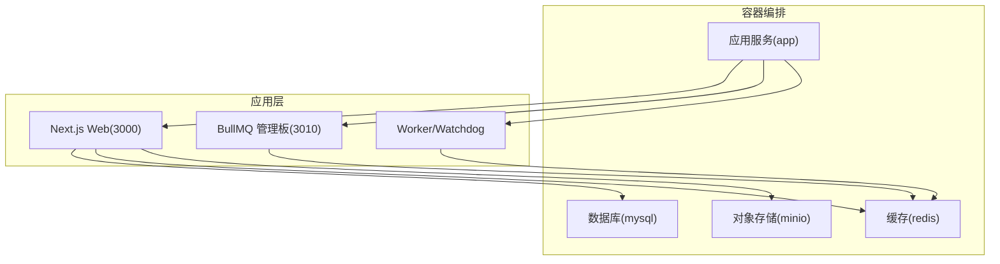

图表来源
- [docker-compose.yml:63-147](file://docker-compose.yml#L63-L147)
- [Dockerfile:64-61](file://Dockerfile#L64-L61)

章节来源
- [README_en.md:30-95](file://README_en.md#L30-L95)
- [docker-compose.yml:1-153](file://docker-compose.yml#L1-L153)
- [Dockerfile:1-61](file://Dockerfile#L1-L61)

## 核心组件
- 应用服务（Next.js + Worker + BullMQ管理板）
- 守护进程（Watchdog）：周期性恢复队列任务、处理僵尸任务、清理日志
- 队列管理（BullMQ + Redis）：按类型分发图像/视频/语音/文本任务
- 数据持久化（MySQL + Prisma）：任务、工单、计费等业务数据
- 对象存储（MinIO）：媒体资源统一存储
- 运维脚本：诊断、备份、恢复、计费对账、错误统计、日志语义校验

章节来源
- [package.json:9-111](file://package.json#L9-L111)
- [scripts/watchdog.ts:1-226](file://scripts/watchdog.ts#L1-L226)
- [scripts/bull-board.ts:1-106](file://scripts/bull-board.ts#L1-L106)
- [prisma/schema.prisma:1-800](file://prisma/schema.prisma#L1-L800)

## 架构总览
系统通过Docker Compose一键拉起MySQL、Redis、MinIO与应用服务；应用内部包含Web服务、BullMQ管理板与Worker/Watchdog。日志统一采集并可按需脱敏输出，计费模块与任务队列解耦，便于独立扩展与治理。

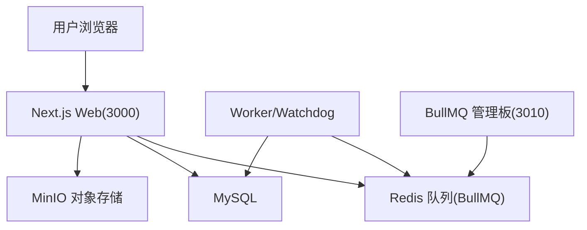

图表来源
- [docker-compose.yml:63-147](file://docker-compose.yml#L63-L147)
- [scripts/bull-board.ts:60-71](file://scripts/bull-board.ts#L60-L71)

章节来源
- [docker-compose.yml:63-147](file://docker-compose.yml#L63-L147)
- [scripts/bull-board.ts:1-106](file://scripts/bull-board.ts#L1-L106)

## 详细组件分析

### 守护进程（Watchdog）：任务健康与恢复
职责
- 恢复“已入队但未写入enqueuedAt”的队列任务
- 标记心跳超时的“processing”任务为失败并重入队列
- 定时清理项目日志

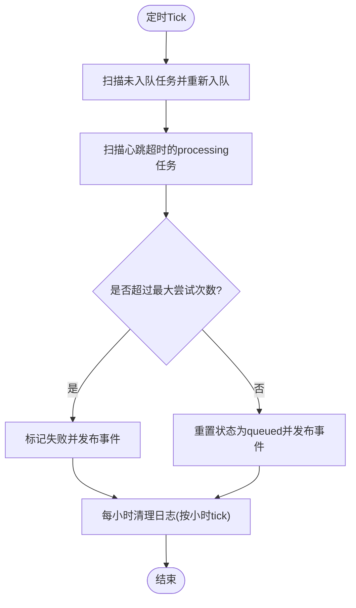

图表来源
- [scripts/watchdog.ts:35-126](file://scripts/watchdog.ts#L35-L126)
- [scripts/watchdog.ts:128-185](file://scripts/watchdog.ts#L128-L185)
- [scripts/watchdog.ts:187-225](file://scripts/watchdog.ts#L187-L225)

章节来源
- [scripts/watchdog.ts:1-226](file://scripts/watchdog.ts#L1-L226)

### BullMQ 管理板（Bull Board）
功能
- 提供Web界面查看各队列（图像/视频/语音/文本）作业状态
- 支持基础认证（可选）
- 支持优雅关闭，释放队列连接

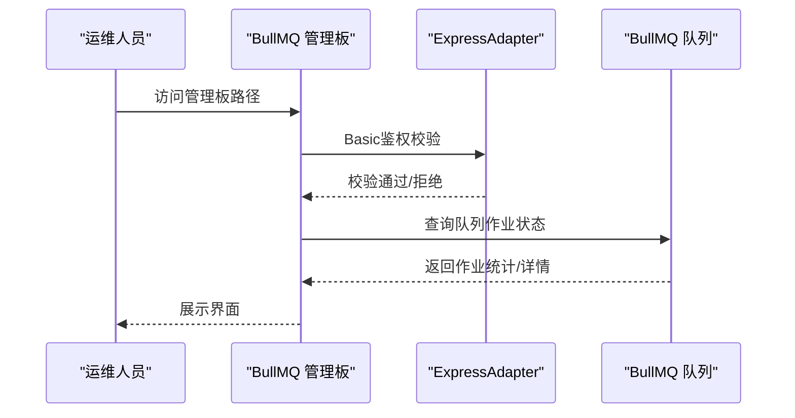

图表来源
- [scripts/bull-board.ts:22-58](file://scripts/bull-board.ts#L22-L58)
- [scripts/bull-board.ts:60-71](file://scripts/bull-board.ts#L60-L71)

章节来源
- [scripts/bull-board.ts:1-106](file://scripts/bull-board.ts#L1-L106)

### 诊断脚本（diagnose-project）
能力
- 校验项目基本信息、小说推广配置、场景与图片引用
- 查询最近任务与事件
- 检查Redis连接与BullMQ队列键
- 读取用户模型配置

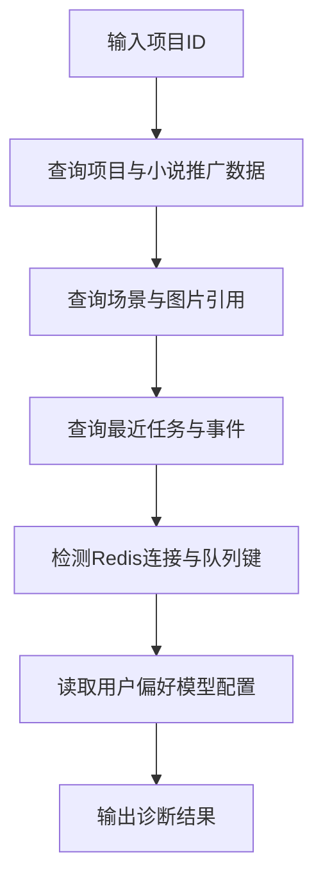

图表来源
- [scripts/diagnose-project.ts:10-179](file://scripts/diagnose-project.ts#L10-L179)

章节来源
- [scripts/diagnose-project.ts:1-189](file://scripts/diagnose-project.ts#L1-L189)

### 日志语义校验（check-log-semantic）
目标
- 统一API、Worker、任务提交、SSE、Watchdog、Bull Board等模块的日志语义
- 强制在使用submitTask的路由中注入请求ID，便于追踪

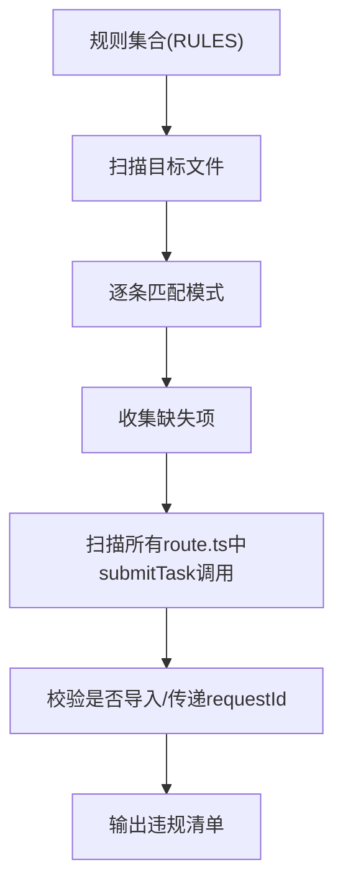

图表来源
- [scripts/check-log-semantic.ts:8-54](file://scripts/check-log-semantic.ts#L8-L54)
- [scripts/check-log-semantic.ts:56-74](file://scripts/check-log-semantic.ts#L56-L74)

章节来源
- [scripts/check-log-semantic.ts:1-111](file://scripts/check-log-semantic.ts#L1-L111)

### 媒体安全备份与恢复（media-safety-backup / media-restore-dry-run）
能力
- 备份数据库文件、关键表快照、对象存储索引与校验和
- 恢复前对比当前库表计数与备份快照，发现漂移即告警

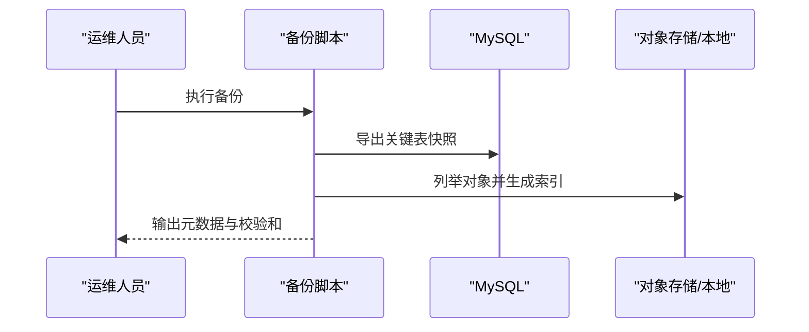

图表来源
- [scripts/media-safety-backup.ts:153-177](file://scripts/media-safety-backup.ts#L153-L177)
- [scripts/media-safety-backup.ts:136-151](file://scripts/media-safety-backup.ts#L136-L151)

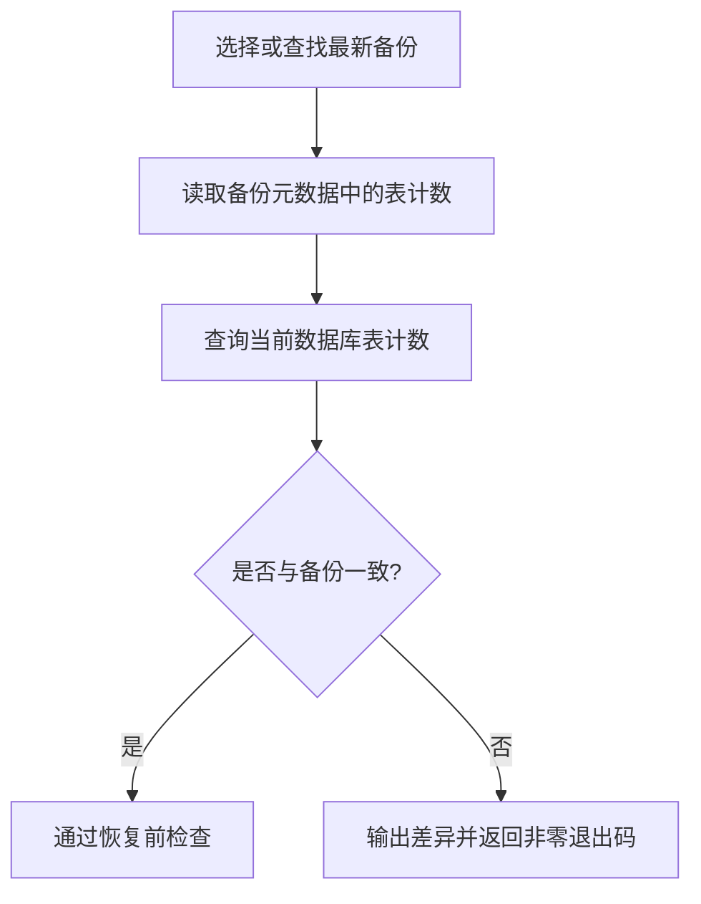

图表来源
- [scripts/media-restore-dry-run.ts:32-67](file://scripts/media-restore-dry-run.ts#L32-L67)

章节来源
- [scripts/media-safety-backup.ts:1-248](file://scripts/media-safety-backup.ts#L1-L248)
- [scripts/media-restore-dry-run.ts:1-112](file://scripts/media-restore-dry-run.ts#L1-L112)

### 计费对账与冻结清理（billing-reconcile-ledger / billing-cleanup-pending-freezes）
能力
- 对账：汇总余额、冻结金额与交易净额，识别差额用户与孤儿冻结
- 清理：批量回滚过期待处理冻结，保证余额一致性

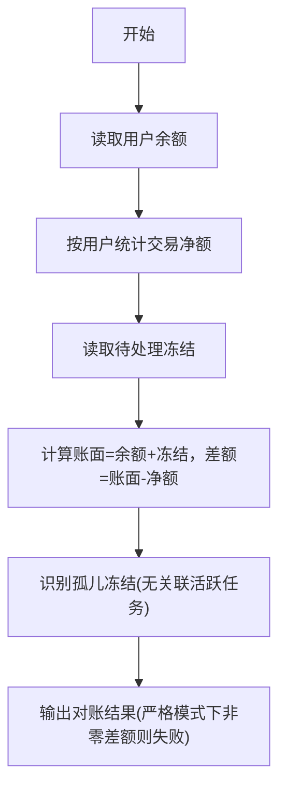

图表来源
- [scripts/billing-reconcile-ledger.ts:24-114](file://scripts/billing-reconcile-ledger.ts#L24-L114)

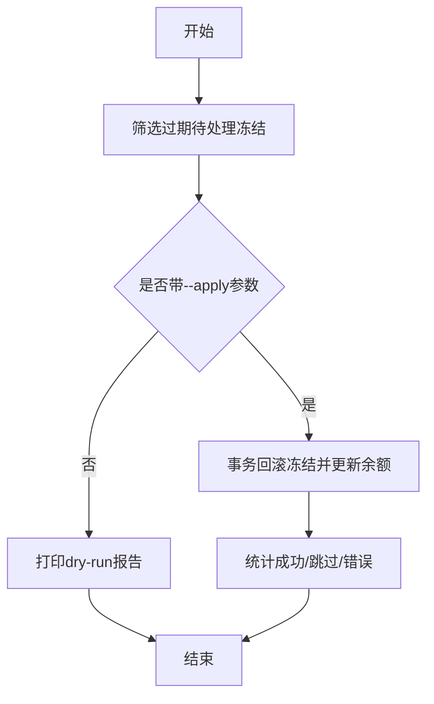

图表来源
- [scripts/billing-cleanup-pending-freezes.ts:32-128](file://scripts/billing-cleanup-pending-freezes.ts#L32-L128)

章节来源
- [scripts/billing-reconcile-ledger.ts:1-126](file://scripts/billing-reconcile-ledger.ts#L1-L126)
- [scripts/billing-cleanup-pending-freezes.ts:1-141](file://scripts/billing-cleanup-pending-freezes.ts#L1-L141)

### 数据模型与队列（Prisma + BullMQ）
- Prisma Schema定义了任务、事件、计费、用户偏好、小说推广等核心实体及索引
- 应用通过脚本启动多个队列（图像/视频/语音/文本），由Worker消费并处理

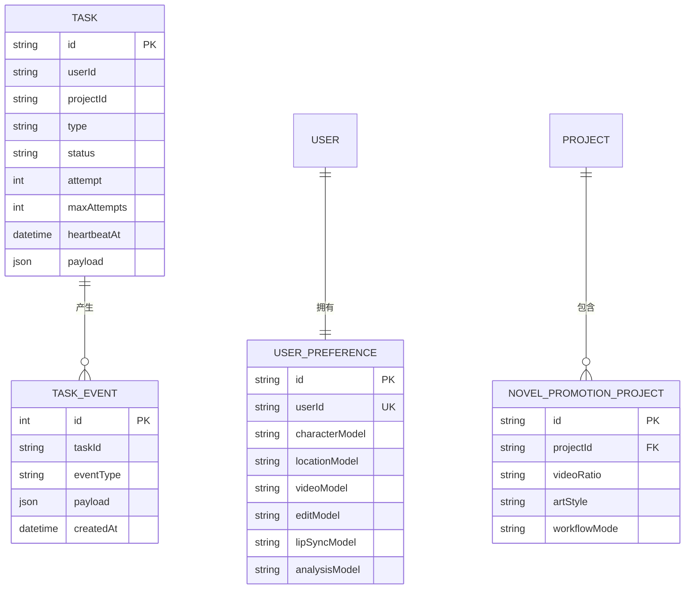

图表来源
- [prisma/schema.prisma:587-646](file://prisma/schema.prisma#L587-L646)
- [prisma/schema.prisma:431-472](file://prisma/schema.prisma#L431-L472)
- [prisma/schema.prisma:244-274](file://prisma/schema.prisma#L244-L274)

章节来源
- [prisma/schema.prisma:1-800](file://prisma/schema.prisma#L1-L800)
- [package.json:23-25](file://package.json#L23-L25)

## 依赖分析
- 启动顺序：MySQL → Redis → MinIO → App（应用启动后执行数据库迁移并进入监听）
- 服务暴露：Web 3000、Bull Board 3010
- 运行时依赖：Next.js、BullMQ、ioredis、Prisma、MinIO SDK等

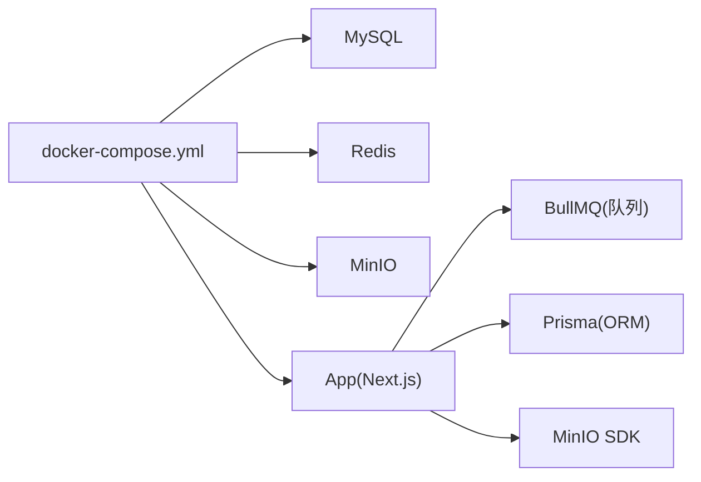

图表来源
- [docker-compose.yml:63-147](file://docker-compose.yml#L63-L147)

章节来源
- [docker-compose.yml:1-153](file://docker-compose.yml#L1-L153)
- [package.json:112-162](file://package.json#L112-L162)

## 性能考虑
- 队列并发：通过环境变量控制图像/视频/语音/文本队列并发度，建议根据硬件与外部API限流动态调整
- 心跳与超时：Watchdog的心跳超时阈值决定任务重试节奏，应结合任务耗时与失败率调优
- 日志轮转：定时清理日志避免磁盘膨胀，建议结合容器日志驱动与宿主机归档策略
- 存储：MinIO作为S3兼容对象存储，注意桶配额、生命周期策略与跨区域冗余

## 故障排查指南

### 常见问题与处置
- 任务长时间处于“processing”且无心跳
  - 使用Watchdog的超时处理逻辑，系统会自动重置为“queued”并发布事件
  - 若频繁出现，检查Worker负载与外部API限流
- 队列堆积严重
  - 通过Bull Board查看队列积压与失败作业，必要时临时提升并发或扩容Worker
- 任务失败率升高
  - 使用任务错误统计脚本按分钟窗口统计失败错误码占比，定位热点错误
- 计费异常
  - 使用对账脚本比对账面与交易净额，识别差额用户与孤儿冻结
  - 使用冻结清理脚本批量回滚过期冻结，避免余额不一致

章节来源
- [scripts/watchdog.ts:128-185](file://scripts/watchdog.ts#L128-L185)
- [scripts/bull-board.ts:60-71](file://scripts/bull-board.ts#L60-L71)
- [scripts/task-error-stats.ts:10-44](file://scripts/task-error-stats.ts#L10-L44)
- [scripts/billing-reconcile-ledger.ts:21-114](file://scripts/billing-reconcile-ledger.ts#L21-L114)
- [scripts/billing-cleanup-pending-freezes.ts:32-128](file://scripts/billing-cleanup-pending-freezes.ts#L32-L128)

### 诊断流程（项目级）
- 步骤
  - 输入项目ID，查询项目与小说推广配置
  - 校验场景与图片引用是否匹配MediaObject
  - 查看最近任务与事件，定位失败原因
  - 检查Redis连通性与队列键，确认队列状态
  - 读取用户偏好模型配置，核对模型可用性

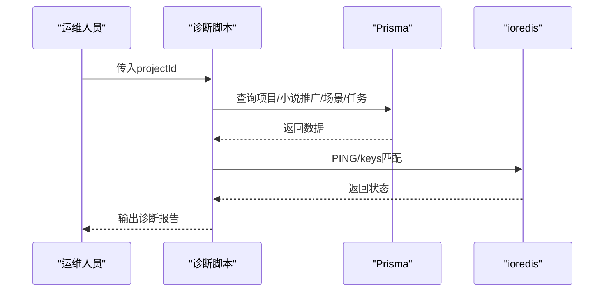

图表来源
- [scripts/diagnose-project.ts:10-179](file://scripts/diagnose-project.ts#L10-L179)

章节来源
- [scripts/diagnose-project.ts:1-189](file://scripts/diagnose-project.ts#L1-L189)

## 结论
通过容器化编排、队列治理、任务守护、备份对账与诊断脚本，Waoowaoo形成了可运维、可观测、可恢复的体系。建议将上述流程纳入SOP，配合变更控制与知识库沉淀，持续提升稳定性与交付效率。

## 附录

### 运维操作SOP（节选）

- 定期维护
  - 每日：检查任务失败统计、队列积压、计费对账
  - 每周：执行媒体安全备份，验证恢复前检查
  - 每月：清理历史日志、评估并发参数、优化模型配置

- 紧急修复
  - 快速定位：使用诊断脚本与Bull Board
  - 降载止损：临时降低并发或暂停高风险任务
  - 回滚：若涉及配置变更，优先使用版本控制与回滚脚本

- 预防性维护
  - 健康检查：Watchdog自动恢复与心跳超时处理
  - 日志规范：强制日志语义与请求ID注入
  - 安全备份：定期快照与校验，恢复前检查

章节来源
- [scripts/task-error-stats.ts:10-44](file://scripts/task-error-stats.ts#L10-L44)
- [scripts/media-safety-backup.ts:207-238](file://scripts/media-safety-backup.ts#L207-L238)
- [scripts/media-restore-dry-run.ts:85-102](file://scripts/media-restore-dry-run.ts#L85-L102)
- [scripts/check-log-semantic.ts:92-111](file://scripts/check-log-semantic.ts#L92-L111)
- [scripts/watchdog.ts:187-225](file://scripts/watchdog.ts#L187-L225)

### 配置管理最佳实践
- 变更审批
  - 通过版本控制系统提交变更，触发守卫脚本与测试
  - 关键配置（数据库、存储、鉴权）双人复核
- 版本控制
  - Docker镜像与compose文件纳入版本管理，升级前备份旧卷
- 回滚策略
  - 保留最近N个备份目录，恢复前执行dry-run
  - 计费相关变更严格区分dry-run与apply模式

章节来源
- [package.json:27-111](file://package.json#L27-L111)
- [docker-compose.yml:42-147](file://docker-compose.yml#L42-L147)
- [scripts/media-restore-dry-run.ts:85-102](file://scripts/media-restore-dry-run.ts#L85-L102)
- [scripts/billing-cleanup-pending-freezes.ts:12-22](file://scripts/billing-cleanup-pending-freezes.ts#L12-L22)

### 变更控制管理
- 变更评估：影响范围（数据库、队列、存储、鉴权）
- 风险分析：失败率、延迟、成本、SLA
- 影响范围评估：通过诊断脚本与对账脚本验证
- 执行与验证：先dry-run，再apply，最后回归测试

章节来源
- [scripts/diagnose-project.ts:10-179](file://scripts/diagnose-project.ts#L10-L179)
- [scripts/billing-reconcile-ledger.ts:21-114](file://scripts/billing-reconcile-ledger.ts#L21-L114)

### 运维工具使用指南
- 诊断工具
  - 项目诊断：[scripts/diagnose-project.ts](file://scripts/diagnose-project.ts)
  - 日志语义：[scripts/check-log-semantic.ts](file://scripts/check-log-semantic.ts)
- 监控工具
  - BullMQ管理板：[scripts/bull-board.ts](file://scripts/bull-board.ts)
  - 任务错误统计：[scripts/task-error-stats.ts](file://scripts/task-error-stats.ts)
- 自动化脚本
  - 媒体安全备份：[scripts/media-safety-backup.ts](file://scripts/media-safety-backup.ts)
  - 恢复前检查：[scripts/media-restore-dry-run.ts](file://scripts/media-restore-dry-run.ts)
  - 计费对账与冻结清理：[scripts/billing-reconcile-ledger.ts](file://scripts/billing-reconcile-ledger.ts)、[scripts/billing-cleanup-pending-freezes.ts](file://scripts/billing-cleanup-pending-freezes.ts)

章节来源
- [scripts/diagnose-project.ts:1-189](file://scripts/diagnose-project.ts#L1-L189)
- [scripts/check-log-semantic.ts:1-111](file://scripts/check-log-semantic.ts#L1-L111)
- [scripts/bull-board.ts:1-106](file://scripts/bull-board.ts#L1-L106)
- [scripts/task-error-stats.ts:1-54](file://scripts/task-error-stats.ts#L1-L54)
- [scripts/media-safety-backup.ts:1-248](file://scripts/media-safety-backup.ts#L1-L248)
- [scripts/media-restore-dry-run.ts:1-112](file://scripts/media-restore-dry-run.ts#L1-L112)
- [scripts/billing-reconcile-ledger.ts:1-126](file://scripts/billing-reconcile-ledger.ts#L1-L126)
- [scripts/billing-cleanup-pending-freezes.ts:1-141](file://scripts/billing-cleanup-pending-freezes.ts#L1-L141)

### 应急响应与灾备演练
- 应急响应
  - 明确分级响应（轻微/严重/中断），指定负责人与沟通渠道
  - 快速定位：日志语义、Bull Board、诊断脚本、错误统计
  - 降载止损：暂停高风险任务、降低并发、启用备用模型
  - 回滚与恢复：优先使用备份与回滚脚本
- 灾难恢复演练
  - 定期演练：从备份恢复、重建队列、验证计费一致性
  - 验证指标：任务成功率、队列延迟、计费差额、UI功能

章节来源
- [scripts/media-safety-backup.ts:207-238](file://scripts/media-safety-backup.ts#L207-L238)
- [scripts/media-restore-dry-run.ts:85-102](file://scripts/media-restore-dry-run.ts#L85-L102)
- [scripts/billing-reconcile-ledger.ts:21-114](file://scripts/billing-reconcile-ledger.ts#L21-L114)