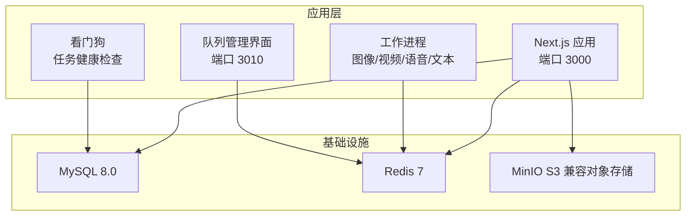
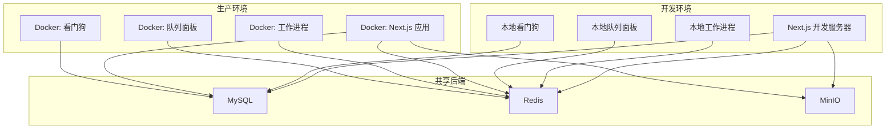
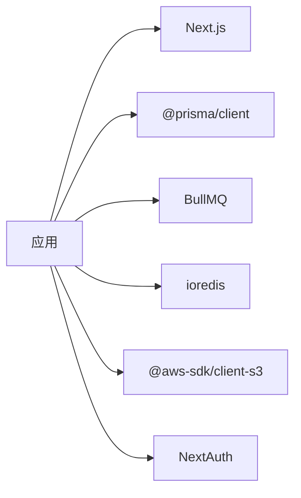

# 部署与运维

<cite>
**本文引用的文件**
- [package.json](file://package.json)
- [Dockerfile](file://Dockerfile)
- [docker-compose.yml](file://docker-compose.yml)
- [.github/workflows/docker-publish.yml](file://.github/workflows/docker-publish.yml)
- [docker-compose.test.yml](file://docker-compose.test.yml)
- [prisma/schema.prisma](file://prisma/schema.prisma)
- [scripts/migrate-to-minio.ts](file://scripts/migrate-to-minio.ts)
- [scripts/watchdog.ts](file://scripts/watchdog.ts)
- [scripts/bull-board.ts](file://scripts/bull-board.ts)
- [src/lib/storage/init.ts](file://src/lib/storage/init.ts)
- [src/lib/storage/bootstrap.ts](file://src/lib/storage/bootstrap.ts)
- [src/lib/workers/index.ts](file://src/lib/workers/index.ts)
- [src/lib/logging/core.ts](file://src/lib/logging/core.ts)
- [src/lib/task/queues.ts](file://src/lib/task/queues.ts)
</cite>

## 目录
1. [简介](#简介)
2. [项目结构](#项目结构)
3. [核心组件](#核心组件)
4. [架构总览](#架构总览)
5. [详细组件分析](#详细组件分析)
6. [依赖分析](#依赖分析)
7. [性能考虑](#性能考虑)
8. [故障排查指南](#故障排查指南)
9. [结论](#结论)
10. [附录](#附录)

## 简介
本文件面向Waoowaoo的部署与运维团队，提供从开发到生产的全栈部署指南、容器化与传统部署对比、CI/CD流水线、自动化与回滚策略、监控告警与日志、数据库备份与灾难恢复、容量规划与性能调优、安全加固与合规检查、运维工具与应急响应，以及环境与配置管理的最佳实践。

## 项目结构
Waoowaoo是一个基于Next.js的全栈应用，采用Monorepo风格组织，包含前端页面、API路由、任务队列与工作进程、存储抽象层、日志与监控、以及Prisma数据库模型。项目通过Docker与Compose进行容器化编排，配合GitHub Actions实现镜像构建与推送。

图表来源
- [docker-compose.yml:1-153](file://docker-compose.yml#L1-L153)
- [Dockerfile:1-61](file://Dockerfile#L1-L61)

章节来源
- [package.json:1-186](file://package.json#L1-L186)
- [docker-compose.yml:1-153](file://docker-compose.yml#L1-L153)
- [Dockerfile:1-61](file://Dockerfile#L1-L61)

## 核心组件
- 应用服务：Next.js应用，监听3000端口，负责Web界面、API路由与静态资源。
- 工作进程：图像、视频、语音、文本四类任务队列的消费者，处理异步任务。
- 看门狗：周期性扫描数据库中异常任务，恢复“僵尸”或未入队任务，保障任务可靠性。
- 队列管理界面：基于BullMQ的可视化面板，暴露在3010端口，支持基础认证。
- 存储初始化：启动时确保MinIO存储桶存在，支持S3兼容接口。
- 日志系统：统一结构化日志输出，支持审计日志、敏感字段脱敏与文件落盘。
- 数据库：MySQL作为主数据存储，Prisma Schema定义模型；Redis用于队列与缓存。

章节来源
- [src/lib/workers/index.ts:1-39](file://src/lib/workers/index.ts#L1-L39)
- [scripts/watchdog.ts:1-226](file://scripts/watchdog.ts#L1-L226)
- [scripts/bull-board.ts:1-106](file://scripts/bull-board.ts#L1-L106)
- [src/lib/storage/init.ts:1-25](file://src/lib/storage/init.ts#L1-L25)
- [src/lib/logging/core.ts:1-303](file://src/lib/logging/core.ts#L1-L303)
- [src/lib/task/queues.ts:1-112](file://src/lib/task/queues.ts#L1-L112)
- [prisma/schema.prisma:1-800](file://prisma/schema.prisma#L1-L800)

## 架构总览
下图展示了开发与生产两种部署形态的关键差异：开发模式通过Concurrently启动多个进程；生产模式通过Docker Compose编排应用、数据库、缓存与对象存储，并由看门狗与队列面板辅助运维。

图表来源
- [package.json:12-25](file://package.json#L12-L25)
- [docker-compose.yml:64-147](file://docker-compose.yml#L64-L147)

章节来源
- [package.json:12-25](file://package.json#L12-L25)
- [docker-compose.yml:64-147](file://docker-compose.yml#L64-L147)

## 详细组件分析

### 容器化部署（Docker）
- 多阶段构建：依赖安装、Next构建、运行时镜像，减少镜像体积并提升安全性。
- 运行时入口：使用tini作为PID1，正确转发信号；CMD执行npm run start，启动应用与工作进程。
- 端口暴露：3000（应用）、3010（队列面板）。
- 数据卷：挂载日志与应用数据目录，便于持久化与运维。

章节来源
- [Dockerfile:1-61](file://Dockerfile#L1-L61)

### Compose编排（开发/测试/生产）
- 服务编排：MySQL、Redis、MinIO、应用服务。
- 环境变量：数据库连接、Redis配置、MinIO参数、NextAuth、内部/外部访问地址、队列面板凭据、日志级别等。
- 健康检查：MySQL、Redis、MinIO均配置健康检查，确保服务可用。
- 命令：启动前执行Prisma db push，随后打印就绪信息并启动应用。

章节来源
- [docker-compose.yml:1-153](file://docker-compose.yml#L1-L153)

### CI/CD流水线（GitHub Actions）
- 触发条件：推送到main分支或打标签。
- 步骤：登录容器仓库、提取元数据、设置QEMU与Buildx、多平台构建并推送镜像。
- 缓存：启用GHA缓存以加速构建。

章节来源
- [.github/workflows/docker-publish.yml:1-56](file://.github/workflows/docker-publish.yml#L1-L56)

### 自动化部署与回滚策略
- 镜像版本化：按语义化版本与latest标签推送，便于回滚。
- Compose升级：通过更新镜像版本与重启服务实现滚动升级；回滚时切换至上一个版本标签。
- 数据一致性：生产环境先执行Prisma db push，再启动应用，避免Schema不匹配导致的启动失败。

章节来源
- [.github/workflows/docker-publish.yml:35-38](file://.github/workflows/docker-publish.yml#L35-L38)
- [docker-compose.yml:132-147](file://docker-compose.yml#L132-L147)

### 监控与告警
- 队列面板：BullMQ可视化界面，支持基本认证，便于查看队列状态与作业历史。
- 日志：统一结构化输出，支持审计日志、敏感字段脱敏、按项目落盘；可通过环境变量控制日志级别与格式。
- 健康检查：数据库与缓存服务均具备健康检查，便于编排层自动重启。

章节来源
- [scripts/bull-board.ts:1-106](file://scripts/bull-board.ts#L1-L106)
- [src/lib/logging/core.ts:1-303](file://src/lib/logging/core.ts#L1-L303)
- [docker-compose.yml:18-23](file://docker-compose.yml#L18-L23)
- [docker-compose.yml:35-40](file://docker-compose.yml#L35-L40)
- [docker-compose.yml:56-61](file://docker-compose.yml#L56-L61)

### 日志收集与性能指标
- 日志采集：应用输出结构化JSON，结合项目级日志文件，便于集中收集与检索。
- 指标建议：结合队列长度、作业耗时、错误率、数据库连接数、Redis命中率等，建立Prometheus/Grafana监控面板。
- 调优方向：根据队列积压调整并发与重试策略，优化慢查询与缓存命中。

章节来源
- [src/lib/logging/core.ts:97-132](file://src/lib/logging/core.ts#L97-L132)
- [src/lib/task/queues.ts:12-20](file://src/lib/task/queues.ts#L12-L20)

### 数据库备份与灾难恢复
- 备份策略：定期导出MySQL数据与二进制日志，结合对象存储归档。
- 恢复流程：在新实例中恢复数据与日志，校验一致性后切换流量。
- 验证：通过只读副本或测试环境验证备份可用性。

（本节为通用运维建议，无需特定文件引用）

### 存储迁移与管理
- 迁移脚本：支持本地存储到MinIO的断点续传、校验与并行上传，提供干运行与进度文件。
- 启动准备：应用启动时确保MinIO存储桶存在，支持S3兼容接口。
- 最佳实践：迁移完成后验证访问权限与URL签名，逐步切流并清理本地冗余数据。

章节来源
- [scripts/migrate-to-minio.ts:1-344](file://scripts/migrate-to-minio.ts#L1-L344)
- [src/lib/storage/init.ts:1-25](file://src/lib/storage/init.ts#L1-L25)
- [src/lib/storage/bootstrap.ts:1-75](file://src/lib/storage/bootstrap.ts#L1-L75)

### 容量规划与性能调优
- 队列并发：根据任务类型设置不同并发（图像/视频/语音/文本），结合重试与超时策略。
- 数据库：合理设置连接池、索引与查询优化，避免热点表。
- 缓存：利用Redis缓存热点数据与会话，降低数据库压力。
- 存储：对象存储分层存放，冷热数据分离，控制成本与延迟。

章节来源
- [docker-compose.yml:94-106](file://docker-compose.yml#L94-L106)
- [src/lib/task/queues.ts:44-85](file://src/lib/task/queues.ts#L44-L85)

### 安全加固与合规
- 密钥管理：通过环境变量注入密钥，避免硬编码；使用最小权限策略。
- 网络隔离：容器网络隔离，仅暴露必要端口；队列面板启用基础认证。
- 合规检查：定期扫描镜像与依赖漏洞，修复高危与严重风险；审计日志保留与轮转。

章节来源
- [docker-compose.yml:86-114](file://docker-compose.yml#L86-L114)
- [scripts/bull-board.ts:22-58](file://scripts/bull-board.ts#L22-L58)
- [src/lib/logging/core.ts:123-131](file://src/lib/logging/core.ts#L123-L131)

### 运维工具与应急响应
- 看门狗：周期性恢复僵尸任务与未入队任务，防止积压。
- 队列面板：快速定位异常作业、重试与清理。
- 日志：统一脱敏与落盘，支持审计事件追踪。
- 应急流程：暂停新任务、隔离问题队列、回滚镜像、修复后恢复。

章节来源
- [scripts/watchdog.ts:187-212](file://scripts/watchdog.ts#L187-L212)
- [scripts/bull-board.ts:77-106](file://scripts/bull-board.ts#L77-L106)
- [src/lib/logging/core.ts:134-152](file://src/lib/logging/core.ts#L134-L152)

### 环境管理与配置管理
- 开发/测试/生产三环境：通过Compose文件区分服务与端口；测试环境独立数据库与缓存。
- 配置中心：通过环境变量集中管理数据库、存储、认证与日志参数。
- 变更控制：镜像版本化与回滚策略，变更前执行Prisma迁移与健康检查。

章节来源
- [docker-compose.test.yml:1-33](file://docker-compose.test.yml#L1-L33)
- [docker-compose.yml:68-114](file://docker-compose.yml#L68-L114)
- [docker-compose.yml:132-147](file://docker-compose.yml#L132-L147)

## 依赖分析
- 应用依赖：Next.js、Prisma、BullMQ、ioredis、MinIO SDK、NextAuth等。
- 开发依赖：TypeScript、ESLint、Vitest、Concurrently等。
- 运行时：Node.js 18.18+，NPM 9+。

图表来源
- [package.json:112-162](file://package.json#L112-L162)
- [package.json:164-184](file://package.json#L164-L184)

章节来源
- [package.json:112-162](file://package.json#L112-L162)
- [package.json:164-184](file://package.json#L164-L184)

## 性能考虑
- 队列背压：指数退避与最大尝试次数，避免雪崩效应。
- 并发控制：按任务类型分配队列与并发，结合限流与熔断。
- 缓存策略：热点数据缓存、会话与鉴权信息缓存，减少数据库压力。
- 存储优化：对象存储分层、CDN加速、签名URL短链化。

章节来源
- [src/lib/task/queues.ts:12-20](file://src/lib/task/queues.ts#L12-L20)
- [docker-compose.yml:94-106](file://docker-compose.yml#L94-L106)

## 故障排查指南
- 应用无法启动：检查数据库与缓存健康检查、环境变量、Prisma迁移是否成功。
- 队列积压：查看队列面板，确认并发与重试策略；检查工作进程日志。
- 存储异常：验证MinIO连接参数与桶权限，使用迁移脚本验证对象完整性。
- 任务失败：通过看门狗日志与审计事件定位失败原因，必要时手动重试或清理。

章节来源
- [docker-compose.yml:18-23](file://docker-compose.yml#L18-L23)
- [scripts/bull-board.ts:77-89](file://scripts/bull-board.ts#L77-L89)
- [scripts/migrate-to-minio.ts:247-337](file://scripts/migrate-to-minio.ts#L247-L337)
- [scripts/watchdog.ts:187-212](file://scripts/watchdog.ts#L187-L212)

## 结论
Waoowaoo提供了完善的容器化与运维能力：通过Docker与Compose实现标准化部署，借助看门狗与队列面板保障任务可靠性与可观测性，结合日志与存储初始化实现可追溯与可恢复。建议在生产环境中强化安全与合规、完善监控与告警、制定严格的变更与回滚流程，持续优化容量与性能。

## 附录
- 开发环境命令：dev、dev:next、dev:worker、dev:watchdog、dev:board。
- 生产环境命令：start、start:next、start:worker、start:watchdog、start:board。
- 存储初始化：storage:init。
- 迁移脚本：migrate-to-minio。

章节来源
- [package.json:9-111](file://package.json#L9-L111)