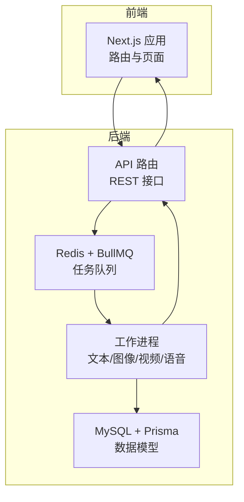
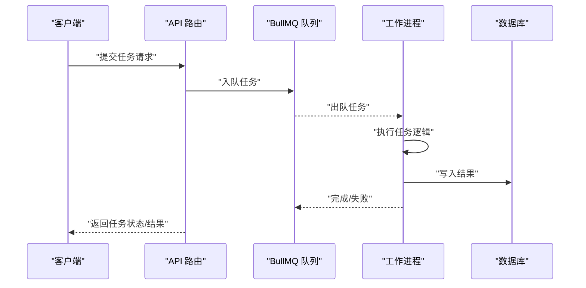
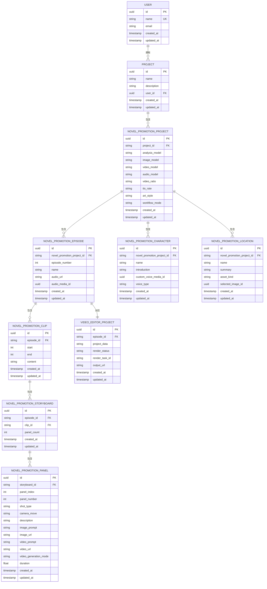
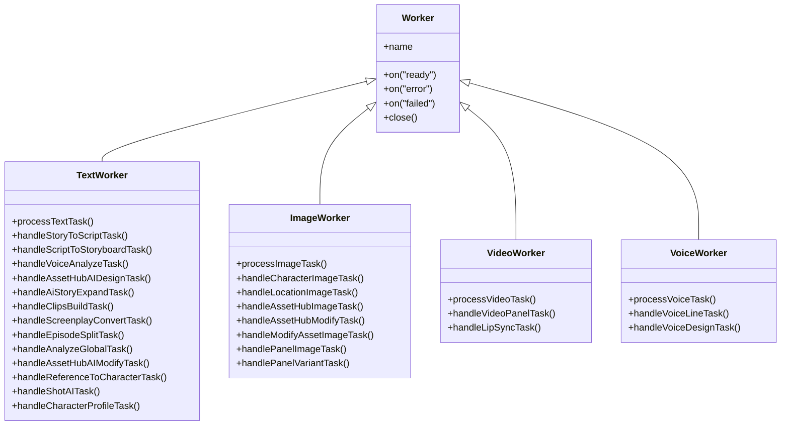
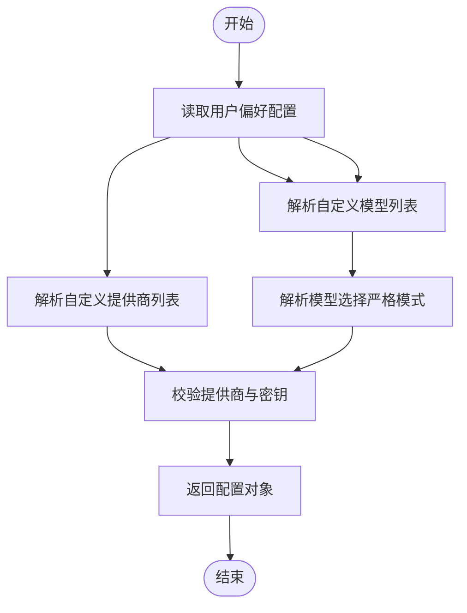
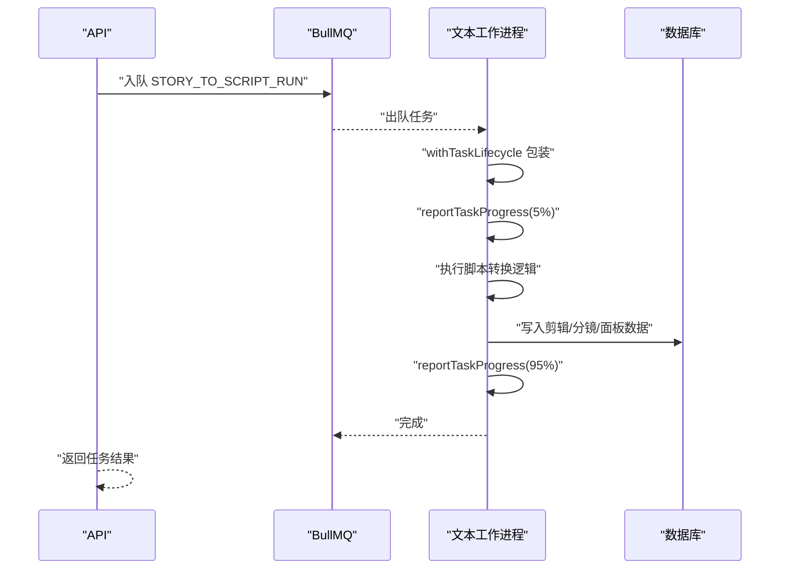
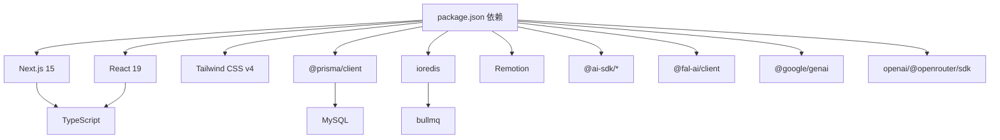

# 项目概述

<cite>
**本文档引用的文件**
- [package.json](file://package.json)
- [README_en.md](file://README_en.md)
- [src/lib/prisma.ts](file://src/lib/prisma.ts)
- [prisma/schema.prisma](file://prisma/schema.prisma)
- [src/lib/redis.ts](file://src/lib/redis.ts)
- [src/lib/api-config.ts](file://src/lib/api-config.ts)
- [src/lib/workers/index.ts](file://src/lib/workers/index.ts)
- [src/lib/workers/text.worker.ts](file://src/lib/workers/text.worker.ts)
- [src/lib/workers/image.worker.ts](file://src/lib/workers/image.worker.ts)
- [src/lib/workers/video.worker.ts](file://src/lib/workers/video.worker.ts)
- [src/lib/workers/voice.worker.ts](file://src/lib/workers/voice.worker.ts)
</cite>

## 目录
1. [引言](#引言)
2. [项目结构](#项目结构)
3. [核心组件](#核心组件)
4. [架构总览](#架构总览)
5. [详细组件分析](#详细组件分析)
6. [依赖分析](#依赖分析)
7. [性能考虑](#性能考虑)
8. [故障排除指南](#故障排除指南)
9. [结论](#结论)
10. [附录](#附录)

## 引言
Waoowaoo 是一个基于 Next.js 15 的全栈多媒体创作平台，专注于“从文本到视频”的自动化工作流，提供小说推广与视频内容生成的端到端解决方案。其核心价值主张包括：
- 自动化工作流：从小说文本自动解析、提取角色与场景、生成分镜与视频，再到配音合成，形成完整的创作闭环。
- AI 内容生成能力：集成多模态大模型与媒体生成服务，支持图像、视频、语音的智能生成与优化。
- 项目管理与实时协作：提供项目维度的数据建模、任务编排与进度追踪，便于团队协作与版本管理。

该平台面向希望快速将文字内容转化为高质量短视频或短剧的创作者、内容工作室与营销团队，既适合初学者上手，也为有经验的开发者提供了可扩展的架构与丰富的技术细节。

## 项目结构
项目采用前后端分离与模块化组织相结合的设计：
- 前端：Next.js 15 应用，路由按功能域划分，页面组件与业务逻辑分层清晰。
- 后端：以 API 路由为核心入口，配合任务队列与工作进程实现异步处理。
- 数据层：MySQL + Prisma ORM，统一建模与迁移管理。
- 任务系统：Redis + BullMQ，多类工作进程并行执行图像、视频、语音与文本任务。
- 配置中心：严格的模型与提供商配置解析，确保运行时一致性与安全性。

**图表来源**
- [src/lib/workers/index.ts:1-39](file://src/lib/workers/index.ts#L1-L39)
- [src/lib/redis.ts:1-76](file://src/lib/redis.ts#L1-L76)
- [src/lib/prisma.ts:1-9](file://src/lib/prisma.ts#L1-L9)
- [prisma/schema.prisma:1-120](file://prisma/schema.prisma#L1-L120)

**章节来源**
- [package.json:112-162](file://package.json#L112-L162)
- [README_en.md:116-123](file://README_en.md#L116-L123)

## 核心组件
- 技术栈与选择理由
  - Next.js 15 + React 19：现代 SSR/SSG 能力与最新生态，适合构建高性能前端应用。
  - TypeScript：强类型保障开发效率与代码质量。
  - Prisma ORM：数据库抽象与类型安全，简化数据访问与迁移。
  - Redis + BullMQ：高可靠的任务队列与工作进程，支持并发控制与重试。
  - Tailwind CSS v4：实用优先的样式工具集，提升界面开发效率。
  - NextAuth.js：完善的认证与会话管理。
- 平台特性
  - 小说脚本分析与拆分、角色与场景生成、分镜构建、视频合成、配音与口型同步。
  - 多语言界面（中/英）、资产中心与全局复用、项目级工作流与计费追踪。

**章节来源**
- [README_en.md:20-27](file://README_en.md#L20-L27)
- [README_en.md:116-123](file://README_en.md#L116-L123)
- [package.json:112-162](file://package.json#L112-L162)

## 架构总览
系统采用“前端 + API + 任务队列 + 工作进程 + 数据库”的分层架构。前端通过 API 路由提交任务至队列，工作进程异步执行具体任务（文本解析、图像生成、视频合成、语音合成），并将结果持久化到数据库，最终由前端实时更新状态与预览。

**图表来源**
- [src/lib/workers/index.ts:1-39](file://src/lib/workers/index.ts#L1-L39)
- [src/lib/workers/text.worker.ts:705-715](file://src/lib/workers/text.worker.ts#L705-L715)
- [src/lib/workers/image.worker.ts:50-68](file://src/lib/workers/image.worker.ts#L50-L68)
- [src/lib/workers/video.worker.ts:306-324](file://src/lib/workers/video.worker.ts#L306-L324)
- [src/lib/workers/voice.worker.ts:54-64](file://src/lib/workers/voice.worker.ts#L54-L64)

## 详细组件分析

### 数据模型与数据库
平台围绕“项目-集数-剪辑-分镜-面板”等核心实体构建，支持角色、场景、语音线、视频编辑项目等扩展。Prisma 提供类型安全的查询与迁移管理，确保数据一致性与演进可控。

**图表来源**
- [prisma/schema.prisma:244-367](file://prisma/schema.prisma#L244-L367)
- [prisma/schema.prisma:369-429](file://prisma/schema.prisma#L369-L429)
- [prisma/schema.prisma:483-524](file://prisma/schema.prisma#L483-L524)
- [prisma/schema.prisma:148-161](file://prisma/schema.prisma#L148-L161)

**章节来源**
- [src/lib/prisma.ts:1-9](file://src/lib/prisma.ts#L1-L9)
- [prisma/schema.prisma:1-120](file://prisma/schema.prisma#L1-L120)

### 任务队列与工作进程
系统通过 BullMQ 在 Redis 中维护多类任务队列，分别由文本、图像、视频、语音四类工作进程处理。每类工作进程具备独立的并发限制与错误处理策略，并通过 Prisma 与数据库交互，保证任务生命周期与状态一致性。

**图表来源**
- [src/lib/workers/text.worker.ts:705-715](file://src/lib/workers/text.worker.ts#L705-L715)
- [src/lib/workers/image.worker.ts:50-68](file://src/lib/workers/image.worker.ts#L50-L68)
- [src/lib/workers/video.worker.ts:306-324](file://src/lib/workers/video.worker.ts#L306-L324)
- [src/lib/workers/voice.worker.ts:54-64](file://src/lib/workers/voice.worker.ts#L54-L64)

**章节来源**
- [src/lib/workers/index.ts:1-39](file://src/lib/workers/index.ts#L1-L39)
- [src/lib/redis.ts:1-76](file://src/lib/redis.ts#L1-L76)

### 配置中心与模型选择
平台提供严格的“配置中心”机制，确保模型与提供商的唯一性、一致性与可审计性。用户偏好中存储自定义模型与提供商配置，运行时通过严格解析与校验，避免猜测与降级带来的不确定性。

**图表来源**
- [src/lib/api-config.ts:291-304](file://src/lib/api-config.ts#L291-L304)
- [src/lib/api-config.ts:323-352](file://src/lib/api-config.ts#L323-L352)
- [src/lib/api-config.ts:418-434](file://src/lib/api-config.ts#L418-L434)

**章节来源**
- [src/lib/api-config.ts:1-509](file://src/lib/api-config.ts#L1-L509)

### 文本工作流（示例：故事转脚本）
文本工作流以“故事转脚本”为例，展示从任务入队到执行、进度上报与结果持久化的完整链路。

**图表来源**
- [src/lib/workers/text.worker.ts:653-703](file://src/lib/workers/text.worker.ts#L653-L703)

**章节来源**
- [src/lib/workers/text.worker.ts:1-715](file://src/lib/workers/text.worker.ts#L1-L715)

## 依赖分析
- 前端与框架
  - Next.js 15、React 19、TypeScript、Tailwind CSS v4、NextAuth.js。
- 数据与缓存
  - Prisma ORM、MySQL、ioredis。
- 任务与队列
  - BullMQ、Redis。
- 多媒体与 AI
  - Remotion、@ai-sdk/*、@fal-ai/client、@google/genai、openai、@openrouter/sdk 等。
- 开发与工具
  - ESLint、Vitest、Concurrently、dotenv-cli、tsx 等。

**图表来源**
- [package.json:112-162](file://package.json#L112-L162)

**章节来源**
- [package.json:112-162](file://package.json#L112-L162)

## 性能考虑
- 并发控制：各工作进程内置用户级并发门控，防止资源争用与超配额。
- 任务分区：按任务类型（文本/图像/视频/语音）分队列，避免相互阻塞。
- 缓存与重试：Redis 连接采用指数退避与懒连接策略，提升稳定性。
- 数据访问：Prisma 客户端单例模式减少连接开销。
- 渲染管线：Remotion 与外部媒体服务结合，支持首尾帧等高级模式以平衡质量与成本。

[本节为通用建议，无需特定文件引用]

## 故障排除指南
- 任务失败排查
  - 查看工作进程日志中的失败事件与错误上下文，定位具体任务与参数。
  - 检查队列连接与 Redis 可用性，确认任务是否被正确入队与出队。
- 配置问题
  - 确认用户偏好中的模型与提供商配置合法且已启用；严格模式下需显式提供 model_key。
- 数据一致性
  - 对于事务性操作（如分镜重生成），检查 Prisma 事务边界与唯一索引冲突。
- 媒体上传/下载
  - 检查 COS/S3 签名链接与下载头设置，确保媒体可访问。

**章节来源**
- [src/lib/workers/index.ts:1-39](file://src/lib/workers/index.ts#L1-L39)
- [src/lib/redis.ts:1-76](file://src/lib/redis.ts#L1-L76)
- [src/lib/api-config.ts:323-352](file://src/lib/api-config.ts#L323-L352)

## 结论
Waoowaoo 通过“前端 + API + 任务队列 + 工作进程 + 数据库”的清晰分层，构建了从小说到视频的自动化创作体系。其技术选型兼顾易用性与可扩展性，既满足初学者快速上手，也提供深入定制的空间。未来可在多租户、计费与渲染优化方面持续增强，进一步提升规模化与商业化能力。

[本节为总结性内容，无需特定文件引用]

## 附录
- 快速启动与开发环境
  - 支持 Docker Compose 一键部署与本地开发两种方式，便于快速验证与迭代。
- 功能清单
  - 小说脚本分析、角色/场景生成、分镜构建、视频合成、配音与口型同步、资产中心与全局复用、项目级工作流与计费追踪。

**章节来源**
- [README_en.md:30-96](file://README_en.md#L30-L96)
- [README_en.md:20-27](file://README_en.md#L20-L27)