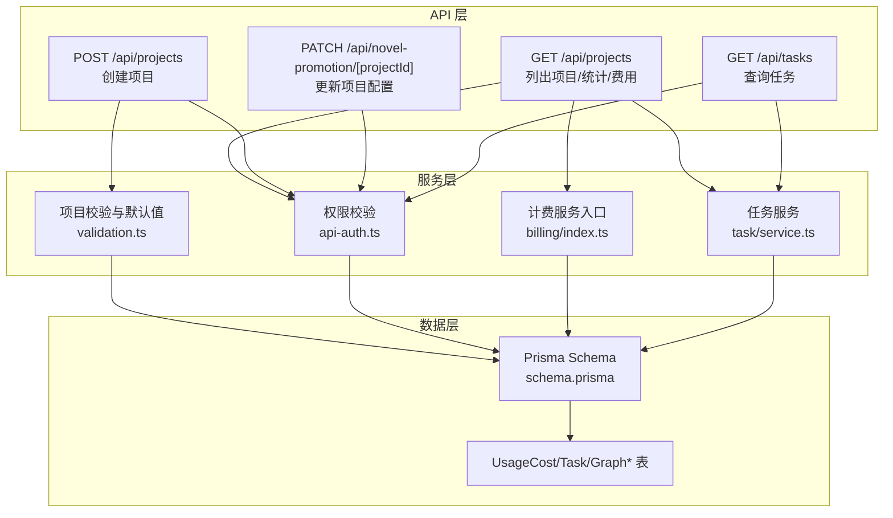
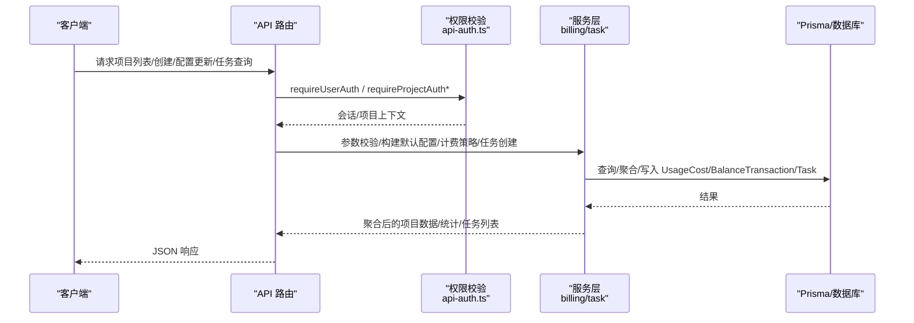
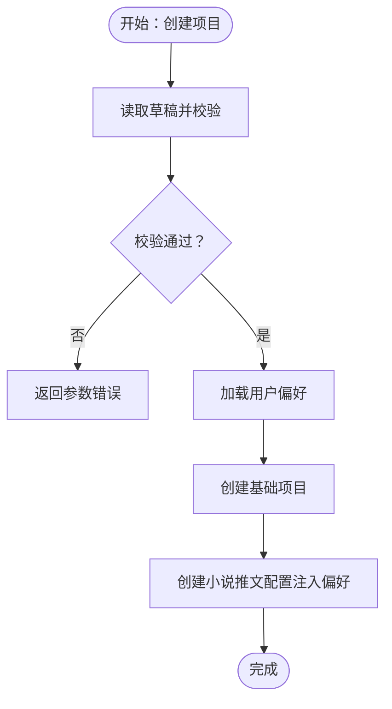
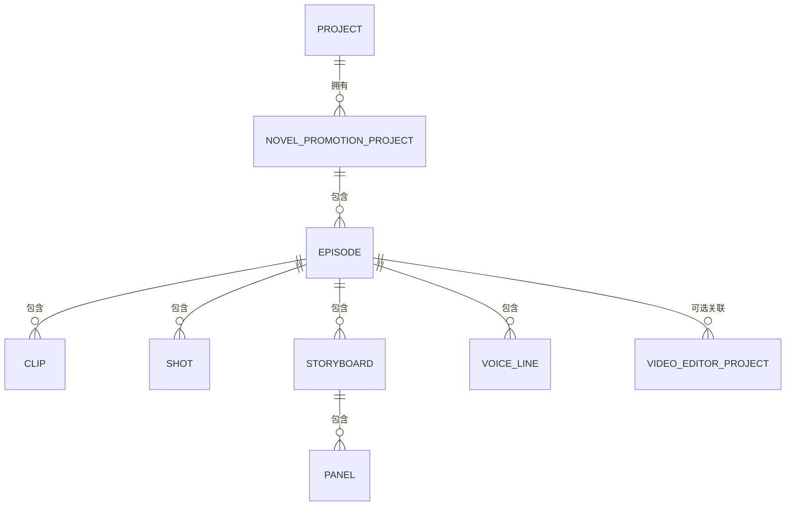
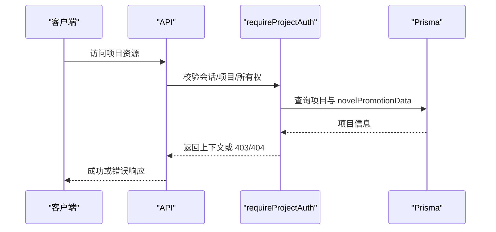
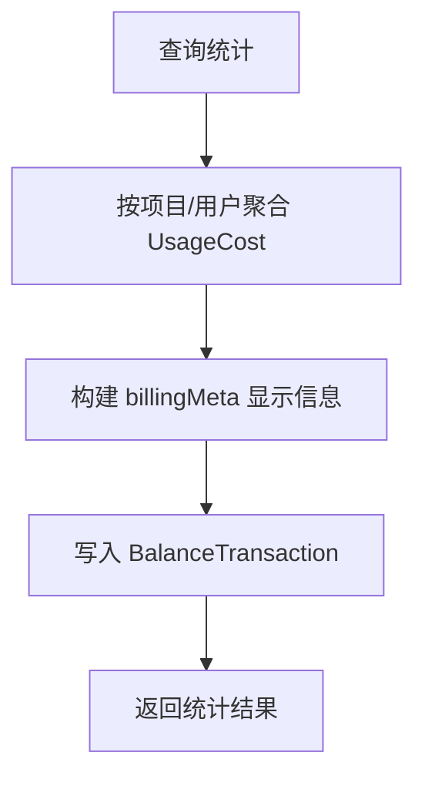
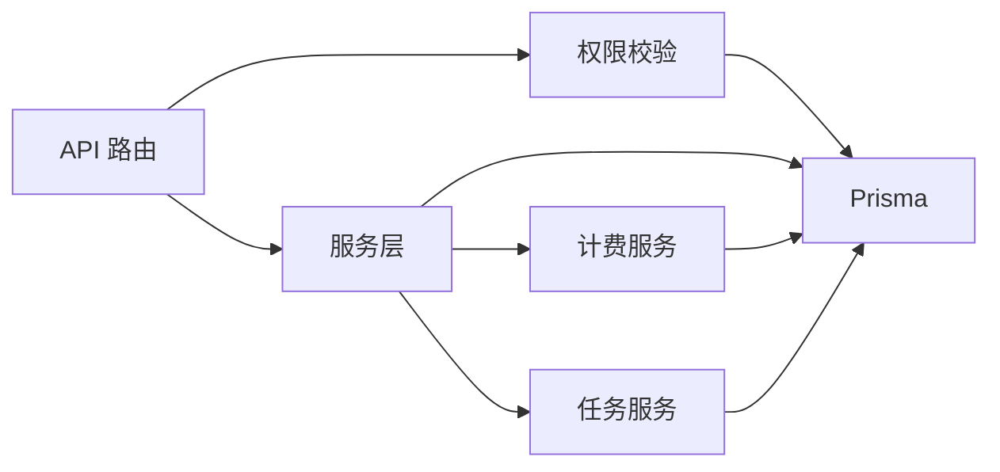

# 项目管理

<cite>
**本文引用的文件**
- [src/types/project.ts](file://src/types/project.ts)
- [prisma/schema.prisma](file://prisma/schema.prisma)
- [src/app/api/projects/route.ts](file://src/app/api/projects/route.ts)
- [src/app/api/novel-promotion/[projectId]/route.ts](file://src/app/api/novel-promotion/[projectId]/route.ts)
- [src/lib/projects/validation.ts](file://src/lib/projects/validation.ts)
- [src/lib/api-auth.ts](file://src/lib/api-auth.ts)
- [src/lib/billing/index.ts](file://src/lib/billing/index.ts)
- [src/lib/billing/reporting.ts](file://src/lib/billing/reporting.ts)
- [src/app/api/tasks/route.ts](file://src/app/api/tasks/route.ts)
- [src/lib/task/service.ts](file://src/lib/task/service.ts)
</cite>

## 目录
1. [简介](#简介)
2. [项目结构](#项目结构)
3. [核心组件](#核心组件)
4. [架构总览](#架构总览)
5. [详细组件分析](#详细组件分析)
6. [依赖分析](#依赖分析)
7. [性能考量](#性能考量)
8. [故障排查指南](#故障排查指南)
9. [结论](#结论)
10. [附录](#附录)

## 简介
本文件面向 Waoowaoo 的“项目管理”能力，系统性梳理多项目支持、多集数管理、权限控制、成本追踪与统计、项目模板与默认配置、批量操作、导入导出与迁移、以及团队协作（任务分配、进度共享、通知）等主题。文档以代码为依据，结合数据模型与 API 行为，给出可操作的使用场景与配置示例，帮助高效管理复杂的多媒体项目。

## 项目结构
- 项目采用 Next.js 应用结构，API 路由位于 src/app/api 下，业务逻辑集中在 src/lib 中，数据模型由 Prisma 定义于 prisma/schema.prisma。
- 项目类型与小说推文模式（多集数、分镜、镜头、剧集等）在 src/types/project.ts 中定义；核心业务实体（项目、计费、任务、图谱运行等）在 Prisma schema 中建模。
- API 层负责权限校验、参数校验、数据聚合与返回；服务层封装计费、任务调度与状态管理；类型层确保前后端契约一致。

图表来源
- [src/app/api/projects/route.ts:27-182](file://src/app/api/projects/route.ts#L27-L182)
- [src/app/api/novel-promotion/[projectId]/route.ts](file://src/app/api/novel-promotion/[projectId]/route.ts#L265-L345)
- [src/lib/projects/validation.ts:40-67](file://src/lib/projects/validation.ts#L40-L67)
- [src/lib/api-auth.ts:214-292](file://src/lib/api-auth.ts#L214-L292)
- [src/lib/billing/index.ts:1-20](file://src/lib/billing/index.ts#L1-L20)
- [src/lib/task/service.ts:164-294](file://src/lib/task/service.ts#L164-L294)
- [prisma/schema.prisma:353-400](file://prisma/schema.prisma#L353-L400)

章节来源
- [src/app/api/projects/route.ts:27-182](file://src/app/api/projects/route.ts#L27-L182)
- [src/app/api/novel-promotion/[projectId]/route.ts](file://src/app/api/novel-promotion/[projectId]/route.ts#L265-L345)
- [src/lib/projects/validation.ts:40-67](file://src/lib/projects/validation.ts#L40-L67)
- [src/lib/api-auth.ts:214-292](file://src/lib/api-auth.ts#L214-L292)
- [src/lib/billing/index.ts:1-20](file://src/lib/billing/index.ts#L1-L20)
- [src/lib/task/service.ts:164-294](file://src/lib/task/service.ts#L164-L294)
- [prisma/schema.prisma:353-400](file://prisma/schema.prisma#L353-L400)

## 核心组件
- 项目与小说推文模式数据模型：涵盖基础项目、角色/场景/道具资产、剧集、分镜、镜头、配音行等，支持图片/视频/音频媒体引用与任务态字段。
- 项目 API：提供项目列表、分页、搜索、统计与费用聚合；支持创建项目并注入用户偏好为默认配置。
- 小说推文项目配置 API：支持更新分析/图像/视频/音频等模型配置、画幅比例、艺术风格、TTS 速率、能力覆盖等。
- 权限控制：统一的会话验证、项目所有权校验、轻量权限校验（仅校验会话）。
- 成本追踪与统计：按项目/用户维度统计费用、按类型/动作聚合、最近流水查询，并记录 UsageCost 与 BalanceTransaction。
- 任务系统：任务创建、去重、心跳、状态推进、失败补偿与账务回滚。
- 类型与契约：严格的输入校验、错误码与国际化提示、媒体字段签名 URL 注入。

章节来源
- [src/types/project.ts:7-287](file://src/types/project.ts#L7-L287)
- [prisma/schema.prisma:244-274](file://prisma/schema.prisma#L244-L274)
- [src/app/api/projects/route.ts:27-182](file://src/app/api/projects/route.ts#L27-L182)
- [src/app/api/novel-promotion/[projectId]/route.ts](file://src/app/api/novel-promotion/[projectId]/route.ts#L265-L345)
- [src/lib/api-auth.ts:214-292](file://src/lib/api-auth.ts#L214-L292)
- [src/lib/billing/reporting.ts:138-257](file://src/lib/billing/reporting.ts#L138-L257)
- [src/lib/task/service.ts:164-294](file://src/lib/task/service.ts#L164-L294)

## 架构总览
下图展示从客户端到 API、服务与数据库的整体交互，突出权限、配置、计费与任务的关键节点。

图表来源
- [src/app/api/projects/route.ts:27-182](file://src/app/api/projects/route.ts#L27-L182)
- [src/app/api/novel-promotion/[projectId]/route.ts](file://src/app/api/novel-promotion/[projectId]/route.ts#L265-L345)
- [src/lib/api-auth.ts:214-292](file://src/lib/api-auth.ts#L214-L292)
- [src/lib/billing/reporting.ts:138-257](file://src/lib/billing/reporting.ts#L138-L257)
- [src/lib/task/service.ts:164-294](file://src/lib/task/service.ts#L164-L294)
- [prisma/schema.prisma:353-400](file://prisma/schema.prisma#L353-L400)

## 详细组件分析

### 多项目支持与生命周期管理
- 项目创建：POST /api/projects 读取请求体草稿，进行名称/描述长度校验，合并用户偏好为默认配置，创建基础项目与小说推文配置。
- 项目列表：GET /api/projects 支持分页与搜索，按“最近访问时间优先、否则按更新时间”排序；并行获取费用与统计（剧集数、面板数、图片/视频数量、首集预览）。
- 生命周期要点：
  - 创建后可选择手动创作或智能导入（AI 分析后批量创建剧集）。
  - 项目与用户偏好解耦，便于模板化与批量复制。
  - 项目访问时间 lastAccessedAt 用于排序优化用户体验。

图表来源
- [src/app/api/projects/route.ts:184-244](file://src/app/api/projects/route.ts#L184-L244)
- [src/lib/projects/validation.ts:40-67](file://src/lib/projects/validation.ts#L40-L67)

章节来源
- [src/app/api/projects/route.ts:27-182](file://src/app/api/projects/route.ts#L27-L182)
- [src/lib/projects/validation.ts:40-67](file://src/lib/projects/validation.ts#L40-L67)

### 多集数管理机制（剧集/分镜/镜头/面板）
- 数据模型：项目内包含多个剧集（episode），每集包含多个剪辑（clip）、分镜（storyboard）、镜头（shot）与面板（panel），以及配音行（voice line）。
- 进度跟踪：面板/镜头支持图片/视频 URL 与任务态字段，便于前端展示生成进度与错误。
- 版本控制：面板/镜头支持 previous* 字段（上一次图片/描述），用于回退与对比。
- 视频编辑集成：每个剧集可关联视频编辑器项目（VideoEditorProject）存储剪辑数据与渲染状态。

图表来源
- [prisma/schema.prisma:244-330](file://prisma/schema.prisma#L244-L330)
- [src/types/project.ts:121-280](file://src/types/project.ts#L121-L280)

章节来源
- [prisma/schema.prisma:121-161](file://prisma/schema.prisma#L121-L161)
- [src/types/project.ts:121-280](file://src/types/project.ts#L121-L280)

### 权限控制系统（角色、访问控制、协作）
- 会话与项目权限：
  - requireUserAuth：仅要求登录，适用于用户级资源。
  - requireProjectAuth：校验会话、项目存在、所有权，并可按需加载角色/场景/剧集关联。
  - requireProjectAuthLight：仅校验会话与所有权，不强制 novelPromotionData。
- 协作与可见性：
  - 当前权限模型以“项目所有权”为核心，未见显式“成员角色/权限矩阵”字段；若需团队协作，可在现有基础上扩展角色枚举与授权策略。

图表来源
- [src/lib/api-auth.ts:214-292](file://src/lib/api-auth.ts#L214-L292)

章节来源
- [src/lib/api-auth.ts:214-292](file://src/lib/api-auth.ts#L214-L292)

### 成本追踪与统计（使用量、费用、预算）
- 计费入口：billing/index.ts 暴露 getProjectCostDetails/getUserCostDetails、addBalance/getBalance、prepare/settle/rollback 等。
- 统计接口：
  - 项目总费用：按项目聚合 UsageCost。
  - 按类型/动作聚合：统计不同 API 类型与动作的消费。
  - 最近流水：分页查询最近记录，携带 billingMeta（包含数量、单位、模型、分辨率、时长等）。
- 流水与冻结：BalanceTransaction 记录消费流水，支持冻结与补偿回滚。
- 项目费用聚合：/api/projects 在应用层对项目集合进行费用与统计的并行聚合，避免 N+1。

图表来源
- [src/lib/billing/reporting.ts:138-257](file://src/lib/billing/reporting.ts#L138-L257)
- [src/app/api/projects/route.ts:84-181](file://src/app/api/projects/route.ts#L84-L181)

章节来源
- [src/lib/billing/index.ts:1-20](file://src/lib/billing/index.ts#L1-L20)
- [src/lib/billing/reporting.ts:138-257](file://src/lib/billing/reporting.ts#L138-L257)
- [src/app/api/projects/route.ts:84-181](file://src/app/api/projects/route.ts#L84-L181)

### 项目模板、默认配置与批量操作
- 模板与默认配置：
  - 创建项目时，自动注入用户偏好（模型、画幅、艺术风格、TTS 速率等）作为小说推文项目的默认配置。
  - 能力覆盖 capabilityOverrides 支持按模型键清洗与校验，保证合法配置。
- 批量操作：
  - 智能导入：AI 分析后批量创建剧集（由 novel-promotion 模块驱动，API 层提供配置与能力约束）。
  - 任务批量：通过任务系统提交批量生成任务（图片/视频/音频），并支持去重与补偿。

章节来源
- [src/app/api/projects/route.ts:206-241](file://src/app/api/projects/route.ts#L206-L241)
- [src/app/api/novel-promotion/[projectId]/route.ts](file://src/app/api/novel-promotion/[projectId]/route.ts#L180-L223)
- [src/lib/task/service.ts:164-294](file://src/lib/task/service.ts#L164-L294)

### 导入导出、备份恢复与迁移
- 导入：
  - novel-promotion 模式支持从文本/脚本导入，AI 分析后批量创建剧集与分镜。
- 导出：
  - 项目数据以 JSON（如 novelPromotionProject 的 JSON 字段）形式存储，便于导出与再导入。
- 备份与迁移：
  - Prisma 迁移文件位于 scripts/migrations，提供数据库结构演进与数据修复脚本（如媒体归档、索引重建、迁移至 MinIO 等）。
  - 媒体迁移：包含本地到 MinIO 的迁移脚本与安全备份脚本，保障媒体资产一致性。

章节来源
- [prisma/schema.prisma:244-274](file://prisma/schema.prisma#L244-L274)
- [scripts/migrations/](file://scripts/migrations/)
- [scripts/media-migrate-to-minio.ts](file://scripts/migrate-to-minio.ts)

### 团队协作（任务分配、进度共享、通知）
- 任务分配与进度：
  - 任务系统支持按 targetType/targetId 聚合活动任务，前端可据此展示面板/镜头生成进度。
  - 任务具备去重键、心跳、最大尝试次数、补偿回滚等机制，提升可靠性。
- 进度共享：
  - 面板/镜头支持图片/视频 URL 与任务态字段，便于跨成员查看生成状态。
- 通知：
  - 任务事件与图谱事件可用于构建通知通道（当前路由未直接暴露通知 API，可通过任务事件订阅实现）。

章节来源
- [src/app/api/tasks/route.ts:16-42](file://src/app/api/tasks/route.ts#L16-L42)
- [src/lib/task/service.ts:300-335](file://src/lib/task/service.ts#L300-L335)
- [src/types/project.ts:162-238](file://src/types/project.ts#L162-L238)

## 依赖分析
- 组件耦合：
  - API 路由依赖权限校验与服务层；服务层依赖 Prisma 与计费/任务模块。
  - 小说推文配置 API 依赖模型键解析与能力覆盖校验。
- 外部依赖：
  - NextAuth 会话、Prisma 客户端、Redis（任务心跳校验降级）。
- 循环依赖：
  - 未发现直接循环依赖；各模块职责清晰（API/服务/数据）。

图表来源
- [src/lib/api-auth.ts:214-292](file://src/lib/api-auth.ts#L214-L292)
- [src/lib/billing/index.ts:1-20](file://src/lib/billing/index.ts#L1-L20)
- [src/lib/task/service.ts:164-294](file://src/lib/task/service.ts#L164-L294)
- [prisma/schema.prisma:353-400](file://prisma/schema.prisma#L353-L400)

章节来源
- [src/lib/api-auth.ts:214-292](file://src/lib/api-auth.ts#L214-L292)
- [src/lib/billing/index.ts:1-20](file://src/lib/billing/index.ts#L1-L20)
- [src/lib/task/service.ts:164-294](file://src/lib/task/service.ts#L164-L294)
- [prisma/schema.prisma:353-400](file://prisma/schema.prisma#L353-L400)

## 性能考量
- 并行查询：项目列表同时获取总数与分页数据，统计与费用聚合并行执行，降低延迟。
- 索引与查询：Prisma 模型为常用查询字段建立索引（如项目 ID、任务状态、任务目标键等），减少慢查询。
- 任务去重与补偿：通过 dedupeKey 与心跳校验避免重复执行；失败时自动回滚计费，保障一致性。
- 媒体与签名：媒体字段统一注入签名 URL，减少前端二次处理开销。

## 故障排查指南
- 权限相关：
  - 401/403：检查会话有效性与项目所有权；必要时调用 requireUserAuth/requireProjectAuth。
- 参数校验：
  - INVALID_PARAMS：检查项目名称/描述长度、模型键格式、艺术风格值、能力覆盖字段合法性。
- 计费异常：
  - BILLING_COMPENSATION_FAILED：当任务失败且需要回滚计费时，系统会尝试补偿；若失败，需人工介入冻结与退款。
- 任务异常：
  - WATCHDOG_TIMEOUT：任务长时间无心跳或队列丢失，系统会标记失败并回滚计费；检查队列/Redis 状态。
- 统计异常：
  - 若项目费用为 0，检查 UsageCost 是否正确记录与聚合。

章节来源
- [src/lib/api-auth.ts:145-163](file://src/lib/api-auth.ts#L145-L163)
- [src/app/api/novel-promotion/[projectId]/route.ts](file://src/app/api/novel-promotion/[projectId]/route.ts#L101-L133)
- [src/lib/task/service.ts:543-621](file://src/lib/task/service.ts#L543-L621)
- [src/lib/billing/reporting.ts:138-149](file://src/lib/billing/reporting.ts#L138-L149)

## 结论
Waoowaoo 的项目管理以“项目 + 小说推文模式”为核心，围绕多项目、多集数、权限、计费与任务系统构建了完整的多媒体项目生命周期管理能力。通过严格的参数校验、统一的权限控制、细粒度的成本统计与任务补偿机制，能够支撑复杂项目的规模化协作与运营。建议后续在权限体系中引入“成员角色/权限矩阵”，以进一步完善团队协作能力。

## 附录

### 使用场景与配置示例（路径指引）
- 创建项目并注入默认配置
  - 路径：[POST /api/projects:184-244](file://src/app/api/projects/route.ts#L184-L244)
  - 参考：[项目校验与默认值:40-67](file://src/lib/projects/validation.ts#L40-L67)
- 更新项目配置（模型/画幅/风格/TTS）
  - 路径：[PATCH /api/novel-promotion/[projectId]](file://src/app/api/novel-promotion/[projectId]/route.ts#L265-L345)
  - 参考：[能力覆盖清洗与校验:180-223](file://src/app/api/novel-promotion/[projectId]/route.ts#L180-L223)
- 查看项目费用与统计
  - 路径：[GET /api/projects:27-182](file://src/app/api/projects/route.ts#L27-L182)
  - 参考：[项目费用统计:151-196](file://src/lib/billing/reporting.ts#L151-L196)
- 查询任务并监控进度
  - 路径：[GET /api/tasks:16-42](file://src/app/api/tasks/route.ts#L16-L42)
  - 参考：[任务查询与活动任务:300-335](file://src/lib/task/service.ts#L300-L335)
- 导入/导出与迁移
  - 参考：[Prisma 迁移目录](file://scripts/migrations/)、[媒体迁移脚本](file://scripts/migrate-to-minio.ts)